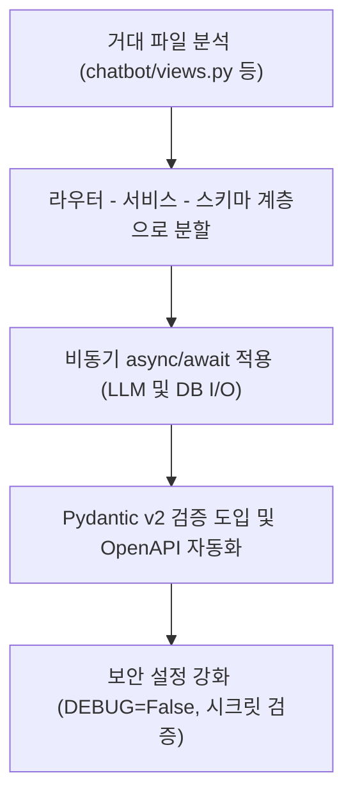

# application-migration (Phase 3 애플리케이션 이식)

> **작성일**: 2026-07-31
> **버전**: v0.1.0
> **설계 기준**: `docs/design/REFACTORING_DESIGN.md` 의 Phase 3 섹션
> **관련 스킬**: [infrastructure-setup](../infrastructure-setup/SKILL.md), [inference-rag-opt](../inference-rag-opt/SKILL.md)

---

## 개요

Phase 3 애플리케이션 이식 스킬은 monolithic Django 모듈 중 거대 파일들을 기능별 도메인으로 분할하고, I/O 작업(LLM API, DB 검색, 외부 API)을 비동기(async/await) 처리하여 챗봇 응답 및 예측 레이턴시를 대폭 개선하는 방법을 정의합니다.

## 선행 의존성

| 구분 | 필수 요구사항 | 확인 명령 |
| :--- | :--- | :--- |
| Framework | FastAPI 또는 Django ASGI | `python -c "import fastapi"` |
| Pydantic | Pydantic v2 스키마 검증 | `python -c "import pydantic"` |
| DB ORM | Phase 2 ORM 이식 완료 | `ls src/app/models/` |

## 디렉토리 구조 및 핵심 자산

| 경로 | 역할 |
| :--- | :--- |
| `src/app/api/` | 라우터 계층 (`bids.py`, `chatbot.py`, `predictions.py`) |
| `src/app/services/` | 비즈니스 로직 계층 |
| `src/app/schemas/` | Pydantic v2 요청/응답 검증 스키마 |
| `src/core/security.py` | SECRET_KEY 검증 및 비밀번호 검증기 |

## 핵심 워크플로우

## 단계별 실행

### 0. 사전 확인
이식 대상 파일(`chatbot/views.py`, `automation_orchestrator.py`, `rag_engine.py`, `predictor.py`)의 기존 로직 및 라우트를 파악합니다.

### 1. 거대 모듈 계층화 분할
- `chatbot/views.py`(801줄): `api/chatbot.py` (라우트), `services/chatbot_service.py` (서비스), `schemas/chatbot.py` (DTO)로 분리합니다.
- `predictor.py`(758줄): `src/ml/predictor.py` 도메인으로 이동하고 싱글톤 객체 패턴으로 관리합니다.

### 2. 비동기화 (async/await)
Gemini LLM 호출 및 백엔드 외부 API 요청을 비동기 클라이언트로 교체하여 블로킹 현상을 제거합니다.

### 3. 보안 강등 방지
`DEBUG` 기본값을 False로 고정하고, `.env` 상의 `SECRET_KEY`가 없을 경우 시동이 중단되도록 안전장치를 추가합니다.

## 에이전트 권한 및 안전 가드레일

| 허용 | 금지 |
| :--- | :--- |
| 거대 단일 파일 모듈화 분할 | API 계약 (엔드포인트 경로/파라미터) 임의 변경 |
| async/await 비동기화 처리 | 예외 무시(try-except-pass)를 통한 증상 은폐 |
| Pydantic v2 스키마 도입 | 시크릿 키 하드코딩 |

## 세션 종료 시 정리
`pytest tests/`를 수행하여 이식된 API 계약이 올바르게 구동하는지 점검합니다.

## 주의 사항
- 모듈 분할 시 순환 참조(circular import)가 발생하지 않도록 의존성 방향(API -> Service -> Model)을 단방향으로 유지하십시오.
