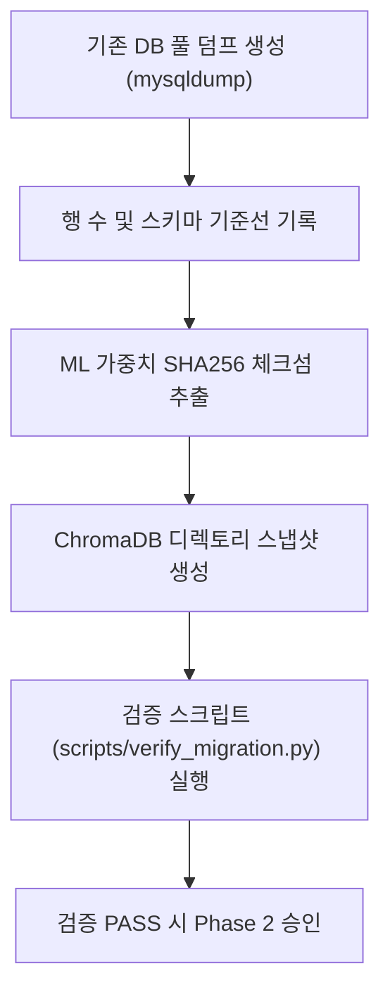

# data-preservation (Phase 1 데이터 보존 선행)

> **작성일**: 2026-07-31
> **버전**: v0.1.0
> **설계 기준**: `docs/design/REFACTORING_DESIGN.md` 의 5장 및 Phase 1
> **관련 스킬**: [foundation-setup](../foundation-setup/SKILL.md), [infrastructure-setup](../infrastructure-setup/SKILL.md)

---

## 개요

Phase 1 데이터 보존 선행 스킬은 G1(데이터 무손실 마이그레이션) 목표를 달성하기 위한 절차를 다룹니다. 기존 MySQL 백업, ML 가중치 바이너리 무결성, ChromaDB 백업 및 마이그레이션 기준선 수립 작업을 다룹니다.

## 선행 의존성

| 구분 | 필수 요구사항 | 확인 명령 |
| :--- | :--- | :--- |
| MySQL | `mysqldump` 클라이언트 | `mysqldump --version` |
| Python | `sha256sum` 또는 Python `hashlib` | `python -c "import hashlib"` |
| ChromaDB | `chroma_db/` 백업 권한 | `ls -l chroma_db/` |

## 디렉토리 구조 및 핵심 자산

| 경로 | 역할 |
| :--- | :--- |
| `docs/migration/db_migration_runbook.md` | DB 마이그레이션 절차서 |
| `docs/migration/ml_weights_verification.md` | ML 가중치/ChromaDB 체크섬 문서 |
| `scripts/verify_migration.py` | 행 수 및 스키마 무결성 검증 자동화 스크립트 |

## 핵심 워크플로우



## 단계별 실행

### 0. 사전 확인
원본 MySQL 데이터베이스 연결과 ML 가중치 파일(`apps/predictions/model_files/`)을 확인합니다.

### 1. DB 풀 덤프 및 행 수 수집
```bash
mysqldump -u root -p procurement > data/backups/procurement_raw.sql
```
각 테이블별 `SELECT COUNT(*)` 결과의 마스터 스냅샷을 생성합니다.

### 2. 가중치 체크섬 수집
`joblib` 가중치 4종(v25, quantum_leap_v25_pro, ssh_hist_premium, v13_hybrid)의 SHA256 해시를 산출하여 기록합니다.

### 3. 검증 스크립트 구축
`scripts/verify_migration.py`를 작성하여 테이블 행 수 불일치 및 컬럼 변경 여부를 자동으로 차단합니다.

## 에이전트 권한 및 안전 가드레일

| 허용 | 금지 |
| :--- | :--- |
| 백업 덤프 생성 및 SHA256 해시 기록 | 기존 DB 테이블 삭제(`DROP TABLE`) |
| 검증용 읽기 쿼리 및 스크립트 작성 | 테이블/컬럼 타입 변환 |
| 마이그레이션 기준 문서 작성 | 데이터 행 임의 삭제 |

## 세션 종료 시 정리
`scripts/verify_migration.py`를 실행하여 100% 매칭되는지 확인합니다.

## 주의 사항
- 마이그레이션 검증을 통과하지 못한 경우 절대로 Phase 2 이후 작업을 진행하지 마십시오.
