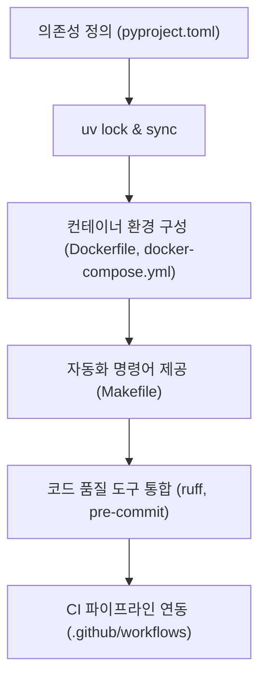

# foundation-setup (Phase 0 기반 정비)

> **작성일**: 2026-07-31
> **버전**: v0.1.0
> **설계 기준**: `docs/design/REFACTORING_DESIGN.md` 의 Phase 0 섹션
> **관련 스킬**: [data-preservation](../data-preservation/SKILL.md), [validation-cutover](../validation-cutover/SKILL.md)

---

## 개요

Phase 0 기반 정비 스킬은 refac_bid_box 프로젝트의 크로스 플랫폼(macOS/Windows) 개발 및 표준화된 패키지 관리 환경을 구축하는 지침을 제공합니다. `pip` 대신 `uv`를 사용하며, Docker 컨테이너 기반으로 독립 실행 가능한 환경을 완성합니다.

## 선행 의존성

| 구분 | 필수 요구사항 | 확인 명령 |
| :--- | :--- | :--- |
| Python | Python 3.11 이상 | `python --version` |
| uv | uv 패키지 매니저 | `uv --version` |
| Docker | Docker Engine & docker-compose | `docker compose version` |
| Make | GNU Make (macOS 기본, Windows WSL/make) | `make --version` |

## 디렉토리 구조 및 핵심 자산

| 경로 | 역할 |
| :--- | :--- |
| `pyproject.toml` | uv 의존성 및 그룹(dev, test, ml) 정의 |
| `Makefile` | 표준 진입점 (`make dev`, `make test`, `make lint`) |
| `Dockerfile` | 애플리케이션 컨테이너 이미지 정의 |
| `docker-compose.yml` | MySQL 8, Redis 7 서비스 오케스트레이션 |
| `.env.example` | 세이프티 환경변수 템플릿 |
| `.github/workflows/ci.yml` | Linting & Testing CI 파이프라인 |

## 핵심 워크플로우

## 단계별 실행

### 0. 사전 확인
`uv` 및 `docker` 환경이 정상 설치되어 있는지 확인합니다.

### 1. 패키지 관리자 초기화
`pyproject.toml`을 작성하고 의존성 그룹을 세분화합니다:
- `main`: fastapi/django, pydantic, sqlalchemy/orm
- `ml`: lightgbm, catboost, scikit-learn, joblib
- `dev`: ruff, pytest, pre-commit

### 2. 컨테이너 및 자동화 타깃 구성
- `docker-compose.yml`에 MySQL 8 (port 3306)과 Redis 7 (port 6379)을 정의합니다.
- `Makefile`에 `dev`, `build`, `lint`, `test` 타깃을 명시합니다.

### 3. 코드 품질 린터 설정
- `ruff` 검사 규칙 및 포맷터를 설정하고 `.git/hooks/pre-commit`을 연동합니다.

## 에이전트 권한 및 안전 가드레일

| 허용 | 금지 |
| :--- | :--- |
| `pyproject.toml` 의존성 추가/수정 | 기존 DB 스키마/컬럼명 수정 |
| 개발용 Dockerfile 및 Makefile 개선 | `.env` 실제 시크릿 값 노출 |
| Lint 및 Test 파이프라인 구성 | 커밋 메시지/주석에 이모지 사용 |

## 세션 종료 시 정리
`make lint` 또는 `uv run ruff check .`를 실행하여 구문 오류가 없는지 확인합니다.

## 주의 사항
- Windows와 macOS 환경에서 동일하게 동작하도록 Makefile 경로 지정을 유의합니다.
