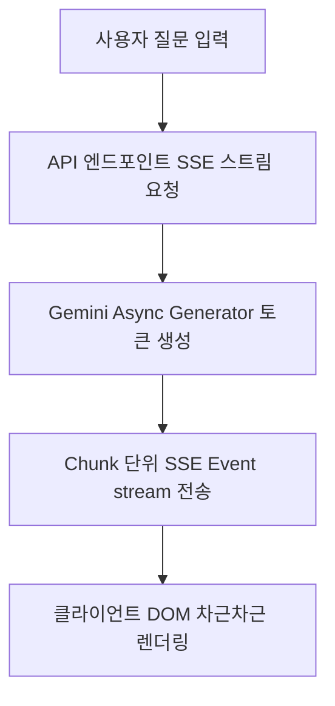

# frontend-streaming (Phase 6 프론트엔드/스트리밍)

> **작성일**: 2026-07-31
> **버전**: v0.1.0
> **설계 기준**: `docs/design/REFACTORING_DESIGN.md` 의 Phase 6 섹션
> **관련 스킬**: [application-migration](../application-migration/SKILL.md), [validation-cutover](../validation-cutover/SKILL.md)

---

## 개요

Phase 6 프론트엔드/스트리밍 스킬은 RAG 챗봇 답변 생성 과정의 UX를 극대화하기 위해 SSE(Server-Sent Events) 또는 WebSocket 스트리밍을 구현하고, HTMX를 통해 동적 반응형 컴포넌트를 구성하는 절차를 설명합니다.

## 선행 의존성

| 구분 | 필수 요구사항 | 확인 명령 |
| :--- | :--- | :--- |
| API | Phase 3/4 비동기 챗봇 API 연동 | `curl http://localhost:8000/api/v1/chatbot/health` |
| FE Stack | Vanilla JS / HTMX / SSE Client | `ls templates/` |

## 디렉토리 구조 및 핵심 자산

| 경로 | 역할 |
| :--- | :--- |
| `templates/` | HTML 템플릿 및 스트리밍 클라이언트 컴포넌트 |
| `src/app/api/chatbot.py` | SSE/WebSocket 스트리밍 엔드포인트 |
| `static/js/chat_stream.js` | SSE 수신 및 Mermaid 차트 동적 렌더링 |

## 핵심 워크플로우

## 단계별 실행

### 0. 사전 확인
기존 동기 챗봇 응답 구조를 파악하고 SSE 청크 단위 데이터 포맷을 정립합니다.

### 1. 백엔드 SSE 엔드포인트 구현
- `EventSourceResponse` 또는 비동기 generator를 활용하여 LLM 청크 토큰을 스트리밍합니다.

### 2. 클라이언트 스트림 수신 및 렌더링
- `EventSource` API를 사용하여 텍스트가 타이핑되듯 즉시 화면에 렌더링되도록 구현합니다.

## 에이전트 권한 및 안전 가드레일

| 허용 | 금지 |
| :--- | :--- |
| SSE/WebSocket 스트리밍 핸들러 구현 | 스트리밍 중 에러 발생 시 커넥션 무한 대기 |
| HTMX 및 Vanilla JS 동적 UI 개선 | 외부에 유효하지 않은 패키지 대량 추가 |

## 세션 종료 시 정리
브라우저 또는 `curl -N` 명령으로 스트리밍 청크 수신을 검증합니다.

## 주의 사항
- LLM 토큰 수신 중 네트워크 단절 시 클라이언트 reconnect 로직을 고려하십시오.
