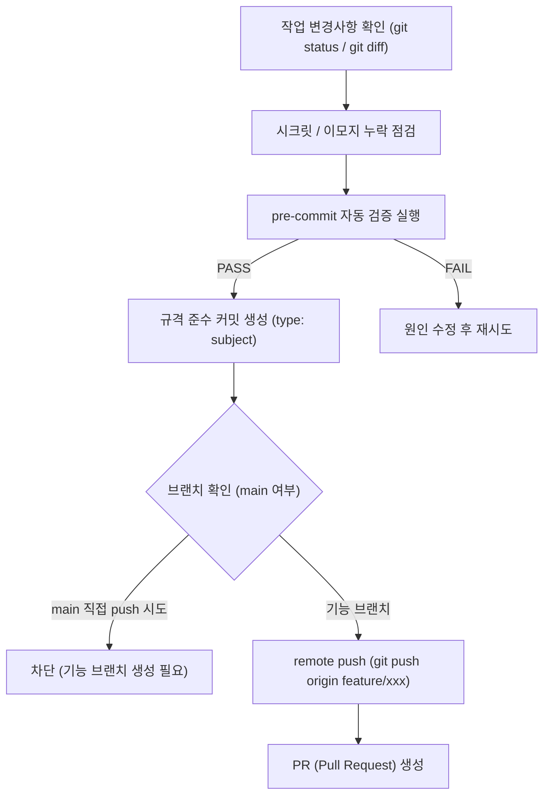

# git-workflow (Git 커밋 및 푸시 워크플로우)

> **작성일**: 2026-07-31
> **버전**: v0.1.0
> **설계 기준**: `AGENTS.md` 5장 Git 규칙 및 `docs/ops/git_branching_strategy.md`
> **관련 스킬**: [foundation-setup](../foundation-setup/SKILL.md), [validation-cutover](../validation-cutover/SKILL.md)

---

## 개요

`git-workflow` 스킬은 refac_bid_box 프로젝트의 버전 관리 표준을 준수하기 위한 가이드를 제공합니다. 커밋 메시지 포맷(`type: subject`), pre-commit 자동 검증 통과, `main` 브랜치 직접 push 금지 및 안전한 브랜치/PR 워크플로우를 보장합니다.

## 선행 의존성

| 구분 | 필수 요구사항 | 확인 명령 |
| :--- | :--- | :--- |
| Git | Git CLI 설치 및 계정 설정 | `git --version` |
| Verification | `scripts/validate_agent_rules.py` 검증 스크립트 | `python3 scripts/validate_agent_rules.py` |
| Branch | 작업용 기능 브랜치 생성 | `git branch --show-current` |

## 디렉토리 구조 및 핵심 자산

| 경로 | 역할 |
| :--- | :--- |
| `AGENTS.md` | 커밋 메시지 및 Git 금지 행위 정본 규칙 |
| `docs/ops/git_branching_strategy.md` | 상세 브랜치 전략 및 PR 작성 절차서 |
| `.git/hooks/pre-commit` | 커밋 전 정합성 자동 검증 훅 |
| `scripts/validate_agent_rules.py` | 규칙 파괴 탐지 검증 스크립트 |

## 핵심 워크플로우



## 단계별 실행

### 1. 변경사항 점검 (`git status` & `git diff`)
- `.env` 등 실제 시크릿 키가 포함되어 있는지 확인합니다.
- 커밋 메시지 및 코드 주석에 **이모지가 포함되어 있지 않은지** 검사합니다.

### 2. pre-commit 정합성 검증
`AGENTS.md`, `SKILLS.md`, `.agents/skills/` 등 규칙 파일 수정 시 검증 스크립트를 수동 또는 자동으로 구동합니다:
```bash
python3 scripts/validate_agent_rules.py --quiet
```

### 3. 규격 준수 커밋 작성
커밋 메시지는 반드시 `type: subject` 형식을 준수해야 합니다.

| Type | 설명 | 예시 |
| :--- | :--- | :--- |
| `feat` | 새로운 기능 추가 | `feat: add retraining trainer module` |
| `fix` | 버그 수정 | `fix: resolve db connection pool leak` |
| `docs` | 문서 수정 및 작성 | `docs: update retraining design in REFACTORING_DESIGN.md` |
| `refactor` | 코드 구조 개선 (기능 변화 없음) | `refactor: split chatbot views into router and service` |
| `chore` | 빌드, 패키지 매니저, 기타 설정 변경 | `chore: add uv dependency groups` |
| `test` | 테스트 코드 추가 및 수정 | `test: add feature parity unit tests` |
| `ci` | CI 파이프라인 설정 변경 | `ci: add github action workflow` |

```bash
git commit -m "feat: add git-workflow skill"
```

### 4. 안전한 Push 및 PR 생성
- `main` 브랜치 직접 push는 엄격히 금지됩니다.
- 작업용 브랜치(`feature/`, `fix/`, `refactor/`)에서 작업 후 원격 저장소로 push합니다:
```bash
git push origin feature/git-skill-setup
```
- PR을 작성하여 코드 리뷰 및 CI 검증 통과 후 `main` 브랜치에 머지합니다.

## 에이전트 권한 및 안전 가드레일

| 허용 | 금지 |
| :--- | :--- |
| 규격에 맞는 커밋 메시지 작성 | `main` 브랜치 직접 push (`git push origin main`) |
| feature/fix 브랜치 생성 및 push | 커밋 메시지나 주석에 이모지 사용 |
| pre-commit 검증 실행 | `--no-verify` 옵션으로 훅 강제 건너뛰기 |
| PR 템플릿에 맞춘 설명 작성 | `.env` 등 실제 시크릿 파일 staging (`git add .env`) |

## 세션 종료 시 정리
`git status`로 트래킹되지 않은 파일이나 정리되지 않은 코드가 없는지 확인합니다.

## 주의 사항
- `git commit --no-verify`로 검증을 우회하는 행위는 금지됩니다.
