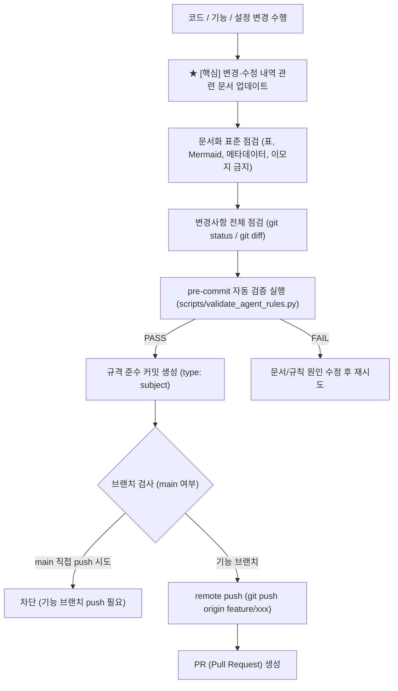

# git-workflow (문서 동기화 기반 Git 커밋 및 푸시 워크플로우)

> **작성일**: 2026-07-31
> **버전**: v0.2.0
> **설계 기준**: `AGENTS.md` 5장 Git 규칙 및 `docs/ops/git_branching_strategy.md`
> **핵심 수칙**: **커밋/푸시 전, 변경·수정 내역을 해당 문서의 형식과 규격에 맞춰 최신 상태로 동기화 업데이트**

---

## 개요

`git-workflow` 스킬의 **가장 중요한 핵심 과제는 커밋 및 푸시 직전 코드·시스템의 변경/수정 내역을 관련 문서(설계서, README, 스킬 인덱스, API 명세 등)에 해당 문서화 표준 형식에 맞게 우선적으로 업데이트**하는 것입니다.

문서 최신화가 확인된 후, 커밋 메시지 포맷(`type: subject`)을 적용하고 pre-commit 정합성 검증을 통과하여 `main` 브랜치 지침과 PR 프로세스에 따라 푸시합니다.

## 선행 의존성

| 구분 | 필수 요구사항 | 확인 명령 |
| :--- | :--- | :--- |
| Documentation | 변경에 영향을 받는 문서 목록 파악 | `git status` |
| Verification | `scripts/validate_agent_rules.py` 검증 스크립트 | `python3 scripts/validate_agent_rules.py` |
| Branch | 작업용 기능 브랜치 확인 | `git branch --show-current` |

## 디렉토리 구조 및 핵심 자산

| 경로 | 역할 |
| :--- | :--- |
| `docs/design/REFACTORING_DESIGN.md` | 전체 리팩토링 설계서 (기능/아키텍처 변경 시 동기화) |
| `README.md` / `docs/README.md` | 프로젝트 및 문서 마스터 인덱스 (구조 변경 시 동기화) |
| `AGENTS.md` / `SKILLS.md` | 에이전트 규칙 및 스킬 인덱스 (규칙/스킬 변경 시 동기화) |
| `docs/ops/git_branching_strategy.md` | 상세 브랜치 전략 및 PR 작성 절차서 |
| `scripts/validate_agent_rules.py` | 규칙 파괴 및 문서 정합성 자동 검증 스크립트 |

## 핵심 워크플로우



## 단계별 실행

### 1. ★ [최우선] 관련 문서 동기화 및 형식 업데이트
커밋하기 전, 작업한 내용에 연관된 모든 문서를 해당 문서화 포맷에 맞춰 최신화합니다:
- **기능/아키텍처 변경**: `docs/design/REFACTORING_DESIGN.md` 해당 장/절 내용 업데이트
- **프로젝트 인덱스/구조 변경**: `README.md` 및 `docs/README.md` 파일 목록/상태 업데이트
- **스킬/에이전트 규칙 변경**: `AGENTS.md`, `SKILLS.md`, `.antigravity/rules.md` 표 및 설명 갱신
- **문서화 표준 준수**: 마크다운 위계(`#`/`##`), 구분선(`---`), 표 우선, 메타데이터 인용 블록(`>`), **이모지 금지** 규칙 엄수

### 2. 변경사항 및 시크릿/이모지 점검 (`git status` & `git diff`)
- `.env` 등 실제 시크릿 키가 커밋 대상에 포함되었는지 점검합니다.
- 새로 작성/수정한 문서나 커밋 메시지, 주석에 **이모지가 포함되어 있지 않은지** 검사합니다.

### 3. pre-commit 정합성 자동 검증
규칙 및 문서 동기화 후 검증 스크립트를 수행합니다:
```bash
python3 scripts/validate_agent_rules.py --quiet
```

### 4. 규격 준수 커밋 작성 (`type: subject`)
문서 동기화와 검증이 완료되면 `type: subject` 규격으로 커밋을 진행합니다:
```bash
git commit -m "docs: update retraining design and sync skill index"
```

### 5. 안전한 Push 및 PR 생성
- `main` 브랜치에 직접 push하지 않고, 작업 브랜치에서 remote push를 진행합니다:
```bash
git push origin feature/my-feature
```

## 에이전트 권한 및 안전 가드레일

| 허용 | 금지 |
| :--- | :--- |
| **코드 변경 시 관련 문서(설계서/README 등) 동시 업데이트** | **코드만 변경하고 관련 문서 동기화를 누락한 채 커밋** |
| 마크다운 표준(표, Mermaid)에 맞는 문서 갱신 | 문서 또는 코드 주석에 이모지 사용 |
| pre-commit 검증을 통과한 규격 커밋 작성 | `main` 브랜치 직접 push (`git push origin main`) |

## 세션 종료 시 정리
`git status`를 수행하여 문서 및 코드 변경사항이 누락 없이 모두 정리되었는지 확인합니다.
