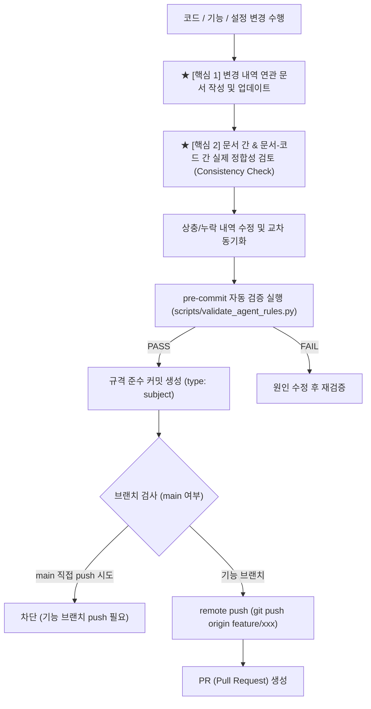

# git-workflow (문서 정합성 검토 기반 Git 커밋 및 푸시 워크플로우)

> **작성일**: 2026-07-31
> **버전**: v0.3.0
> **설계 기준**: `AGENTS.md` 5장 Git 규칙 및 `docs/ops/git_branching_strategy.md`
> **핵심 수칙**: **커밋/푸시 전 관련 문서 업데이트 및 문서 간·문서-코드 간 실제 정합성 검토(Consistency Verification) 필수 이행**

---

## 개요

`git-workflow` 스킬의 **가장 중요한 핵심 과제는 커밋 및 푸시 직전 코드·시스템의 변경 내역을 문서화 표준에 맞춰 업데이트하고, 관련 문서 간 및 문서-코드 간 실제 데이터·경로·명세 정합성을 정교하게 맞추는 검토 작업**을 수행하는 것입니다.

단순 문서 수정에 그치지 않고, 문서 간 버전·설명·경로 상충 여부 및 실제 코드베이스와의 일치 여부를 대조 검증한 후 커밋 및 푸시를 진행합니다.

## 선행 의존성

| 구분 | 필수 요구사항 | 확인 명령 |
| :--- | :--- | :--- |
| Documentation | 변경에 영향받는 문서 및 연관 문서 파악 | `git status` |
| Verification | `scripts/validate_agent_rules.py` 정합성 스크립트 | `python3 scripts/validate_agent_rules.py` |
| Cross-Check | 문서 상호 참조 링크 및 코드 일치 대조 | `view_file` 또는 `grep_search` |

## 디렉토리 구조 및 핵심 자산

| 경로 | 역할 |
| :--- | :--- |
| `docs/design/REFACTORING_DESIGN.md` | 전체 리팩토링 설계서 (아키텍처/기능 변경 정합성 기준) |
| `README.md` / `docs/README.md` | 마스터 인덱스 문서 (구조 및 문서 상태 정합성 기준) |
| `AGENTS.md` / `SKILLS.md` | 에이전트 규칙 및 스킬 인덱스 (규칙/스킬 정합성 기준) |
| `.antigravity/rules.md` | 요약본 규칙 (정본 AGENTS.md와의 핵심 키워드 정합성) |
| `scripts/validate_agent_rules.py` | 규칙 파괴 및 문서 정합성 자동 검증 스크립트 |

## 핵심 워크플로우



## 단계별 실행

### 1. ★ [최우선] 연관 문서 업데이트 및 정합성 검토 (Consistency Verification)

#### 1.1 관련 문서 업데이트
- **기능/아키텍처 변경**: `docs/design/REFACTORING_DESIGN.md` 해당 장/절 내용 업데이트
- **프로젝트 인덱스/구조 변경**: `README.md` 및 `docs/README.md` 파일 목록/상태 업데이트
- **스킬/에이전트 규칙 변경**: `AGENTS.md`, `SKILLS.md`, `.antigravity/rules.md` 표 및 설명 갱신

#### 1.2 실제 문서 간 & 문서-코드 정합성 검토 (교차 대조)
- **문서 간 정합성**: 설계서(`REFACTORING_DESIGN.md`), 마스터 인덱스(`README.md`), 에이전트 규칙(`AGENTS.md`) 간 기재된 내용, 버전, 스스킬 인덱스 표가 서로 일치하는지 확인합니다.
- **문서-코드 정합성**: 문서에 기재된 모듈 파일 경로(예: `src/ml/features.py`), 클래스명, 함수명, 환경변수명이 실제 코드베이스와 **100% 동일한지 대조**합니다.
- **상호 링크 검증**: 문서 내 마크다운 파일 상대 링크(`file:///...` 또는 `./path`)가 유효한지 클릭 검증을 실시합니다.

### 2. 변경사항 및 시크릿/이모지 점검 (`git status` & `git diff`)
- `.env` 등 실제 시크릿 키가 커밋 대상에 포함되었는지 점검합니다.
- 새로 작성/수정한 문서나 커밋 메시지, 주석에 **이모지가 포함되어 있지 않은지** 검사합니다.

### 3. pre-commit 정합성 자동 검증
규칙 및 문서 정합성 확정 후 검증 스크립트를 수행합니다:
```bash
python3 scripts/validate_agent_rules.py --quiet
```

### 4. 규격 준수 커밋 작성 (`type: subject`)
문서 정합성 검토와 자동 검증이 완료되면 `type: subject` 규격으로 커밋을 진행합니다:
```bash
git commit -m "docs: update retraining design and verify document consistency"
```

### 5. 안전한 Push 및 PR 생성
- `main` 브랜치에 직접 push하지 않고, 작업 브랜치에서 remote push를 진행합니다:
```bash
git push origin feature/my-feature
```

## 에이전트 권한 및 안전 가드레일

| 허용 | 금지 |
| :--- | :--- |
| **코드 변경 시 연관 문서 동시 업데이트 및 정합성 검토** | **문서 간/문서-코드 간 내용이 상충되는 상태로 커밋** |
| 문서 상호 참조 및 실제 파일 경로/명세 100% 대조 | 단순 문서 수정을 넘어 실제 코드와 불일치하는 명세 방치 |
| pre-commit 검증을 통과한 규격 커밋 작성 | `main` 브랜치 직접 push (`git push origin main`) |

## 세션 종료 시 정리
`git status`를 수행하여 문서 및 코드 변경사항 및 정합성이 누락 없이 완벽히 맞추어졌는지 확인합니다.
