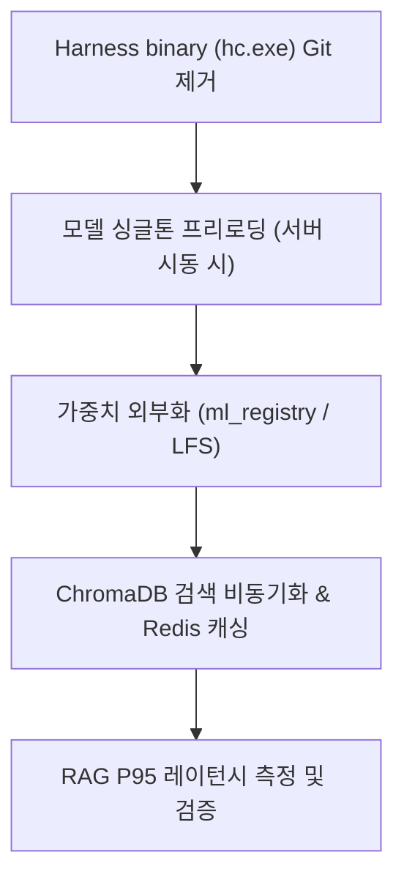

# inference-rag-opt (Phase 4 ML 추론/RAG 최적화)

> **작성일**: 2026-07-31
> **버전**: v0.1.0
> **설계 기준**: `docs/design/REFACTORING_DESIGN.md` 의 Phase 4 섹션
> **관련 스킬**: [application-migration](../application-migration/SKILL.md), [retraining-pipeline](../retraining-pipeline/SKILL.md)

---

## 개요

Phase 4 ML 추론/RAG 최적화 스킬은 추론 모델 동적 로드의 병목을 해결하기 위해 싱글톤 프리로딩(Pre-loading) 및 레지스트리를 구축하고, RAG 벡터 검색 성능을 개선하며 Harness `hc.exe` 바이너리를 Git에서 제거하여 플랫폼 중립성을 달성합니다.

## 선행 의존성

| 구분 | 필수 요구사항 | 확인 명령 |
| :--- | :--- | :--- |
| ML 가중치 | ML 레지스트리 / 가중치 바이너리 존재 | `ls ml_registry/` 또는 `ls apps/predictions/model_files/` |
| ChromaDB | ChromaDB 백업 및 접근 경로 | `ls chroma_db/` |
| Gemini API | Google GenAI 키 설정 | `python -c "import google.genai"` |

## 디렉토리 구조 및 핵심 자산

| 경로 | 역할 |
| :--- | :--- |
| `src/ml/predictor.py` | 싱글톤 모델 로더 및 추론 인터페이스 |
| `src/rag/vector_store.py` | ChromaDB/Qdrant 비동기 검색 및 인덱싱 |
| `src/rag/engine.py` | RAG 질의응답 및 Gemini 연동 엔진 |
| `ml_registry/` | 모델 버전별 가중치 및 메타데이터 저장소 |

## 핵심 워크플로우

## 단계별 실행

### 0. 사전 확인
`importlib` 기반 런타임 전처리 로드 방식을 확인하고 제거 준비를 합니다.

### 1. 플랫폼 종속 바이너리 제거 (G2)
Git에서 `hc.exe` 및 `.ps1` 종속 바이너리를 완전 제거하고, 순수 Python 기반 비동기 스케줄러로 교체합니다.

### 2. 싱글톤 모델 프리로딩
애플리케이션 스타트업 시점에 ML 모델 가중치를 인메모리에 싱글톤으로 로드하여 요청 마다 로딩되는 오버헤드를 방지합니다.

### 3. RAG 비동기화 및 쿼리 캐싱
- ChromaDB 질의응답을 비동기 스레드풀 처리하고, 자주 묻는 Q&A의 Vector search 결과를 Redis에 캐싱합니다.

## 에이전트 권한 및 안전 가드레일

| 허용 | 금지 |
| :--- | :--- |
| 모델 프리로딩 및 RAG 캐싱 적용 | 가중치 로딩 실패 시 0 또는 더미값 무조건 반환 |
| 플랫폼 종속 바이너리 제거 및 대체 | 전처리 로직을 추론 파일 내 별도 임의 작성 |
| ChromaDB 비동기 래퍼 작성 | 가중치 파일 Git 직접 대량 추적 |

## 세션 종료 시 정리
추론 테스트 및 RAG 레이턴시 검증을 수행하여 정상 작동을 확인합니다.

## 주의 사항
- 추론 전처리 시 반드시 `src/ml/features.py`를 참조해야 합니다.
