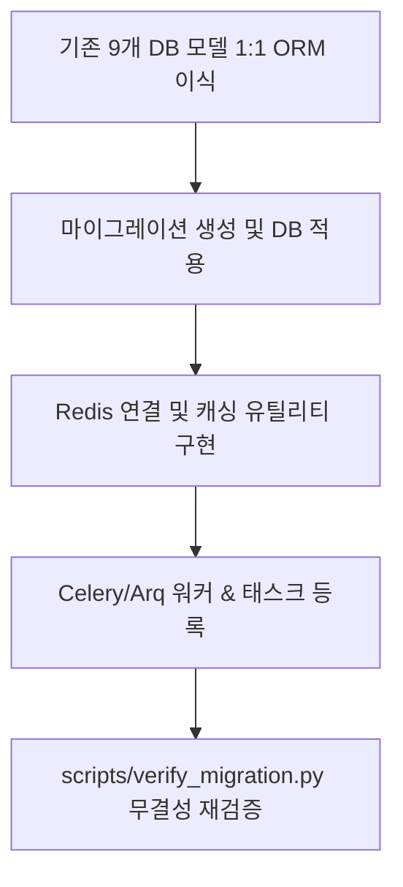

# infrastructure-setup (Phase 2 인프라 구축)

> **작성일**: 2026-07-31
> **버전**: v0.1.0
> **설계 기준**: `docs/design/REFACTORING_DESIGN.md` 의 Phase 2 섹션
> **관련 스킬**: [data-preservation](../data-preservation/SKILL.md), [application-migration](../application-migration/SKILL.md)

---

## 개요

Phase 2 인프라 구축 스킬은 DB 이중화(SQLite fallback)를 제거하고 MySQL 8 스키마를 100% 보존 이식하며, Redis 캐시 및 비동기 태스크 큐(Celery/Arq) 인프라를 연결하는 지침을 다룹니다.

## 선행 의존성

| 구분 | 필수 요구사항 | 확인 명령 |
| :--- | :--- | :--- |
| Docker | MySQL 8 & Redis 7 컨테이너 구동 | `docker compose ps` |
| ORM | SQLAlchemy 2.0 또는 Django ORM | `python -c "import sqlalchemy"` |
| Task Queue | Celery 또는 Arq | `python -c "import celery"` |

## 디렉토리 구조 및 핵심 자산

| 경로 | 역할 |
| :--- | :--- |
| `src/app/models/` | DB ORM 모델 정의 (기존 9개 모델 스키마 100% 일치) |
| `migrations/` | 스키마 마이그레이션 히스토리 |
| `src/tasks/` | Celery/Arq 태스크 정의 (G2B 데이터 수집, KB 업데이트) |
| `src/core/cache.py` | Redis 캐시 클라이언트 |

## 핵심 워크플로우

## 단계별 실행

### 0. 사전 확인
Docker로 실행된 MySQL 8 및 Redis 컨테이너 헬스를 검사합니다.

### 1. DB ORM 이식 및 스키마 검증
기존 Django 모델(`BidAnnouncement`, `BidResult` 등 9개 모델)의 컬럼명과 타임스탬프, 제약조건을 동일하게 작성합니다.

### 2. Redis 캐시 레이어 구성
- `.django_cache` 및 locmem 캐시를 전면 대체합니다.
- 기관별 과거 낙찰률, API 응답 캐싱 유틸리티를 작성합니다.

### 3. 비동기 태스크 큐 설정
- 수집 및 KB 업데이트 비동기 오프로드를 위한 태스크 큐 워커를 생성합니다.

## 에이전트 권한 및 안전 가드레일

| 허용 | 금지 |
| :--- | :--- |
| Redis 캐시 레이어 및 태스크 큐 추가 | DB 컬럼명/타입 변경 |
| ORM 모델 1:1 이식 | SQLite 스위치 복구 (MySQL 전용 연동) |
| 연결 풀 설정 최적화 | 기존 Foreign Key 제약 조건 누락 |

## 세션 종료 시 정리
`python scripts/verify_migration.py`를 실행하여 DB 데이터 무결성을 검증합니다.

## 주의 사항
- DB 마이그레이션 적용 시 기존 컬럼 삭제나 타임스탬프 타입 변경이 발생하지 않도록 엄격히 관리합니다.
