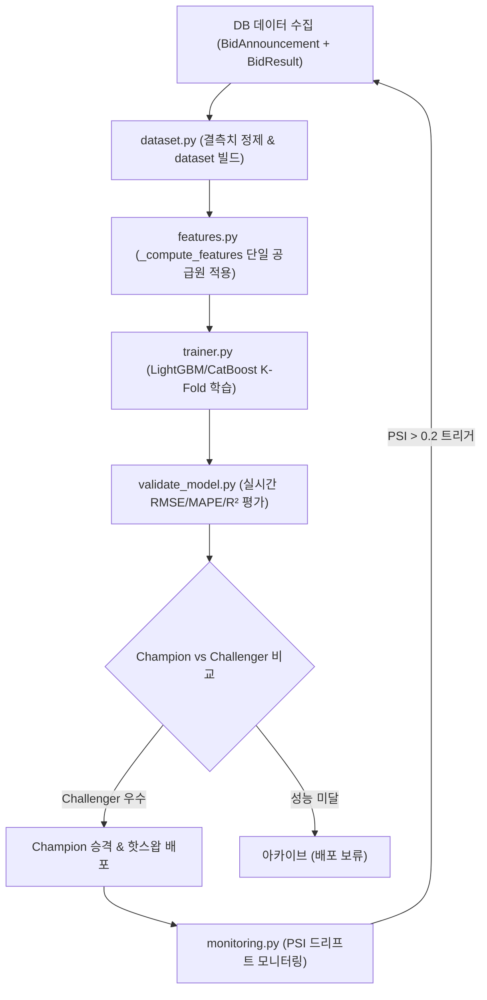

# retraining-pipeline (Phase 5 재학습 MLOps 구축) ★ 핵심

> **작성일**: 2026-07-31
> **버전**: v0.1.0
> **설계 기준**: `docs/design/REFACTORING_DESIGN.md` 의 7장 및 Phase 5
> **관련 스킬**: [inference-rag-opt](../inference-rag-opt/SKILL.md), [validation-cutover](../validation-cutover/SKILL.md)

---

## 개요

Phase 5 재학습 파이프라인 스킬은 refac_bid_box 프로젝트의 핵심 MLOps 구축을 담당합니다. 기존 train/serve skew 문제(학습 스크립트와 추론 스크립트 간 특징 정의 불일치)를 근본적으로 해결하기 위해 **단일 특징 공급원(`src/ml/features.py`)**을 수립하고, 데이터셋 빌더, 일반화 학습기, 실시간 평가, 모델 레지스트리, Champion/Challenger 검증 및 데이터 드리프트(PSI) 모니터링을 구축합니다.

## 선행 의존성

| 구분 | 필수 요구사항 | 확인 명령 |
| :--- | :--- | :--- |
| DB Access | MySQL BidAnnouncement & BidResult 데이터 | `python -c "import sqlalchemy"` |
| ML Libraries | LightGBM, CatBoost, scikit-learn, joblib | `python -c "import lightgbm, catboost"` |
| Design Doc | 설계서 7장 재학습 파이프라인 명세 숙지 | `view_file docs/design/REFACTORING_DESIGN.md` |

## 디렉토리 구조 및 핵심 자산

| 경로 | 역할 |
| :--- | :--- |
| **`src/ml/features.py`** | **★ Single Source of Truth: 학습 및 추론 공용 특징 생성 함수** |
| `src/ml/dataset.py` | DB join 및 정제 기반 학습 데이터셋 파켓(Parquet) 빌더 |
| `src/ml/trainer.py` | K-Fold 교차 검증 및 일반화 모델 학습 엔진 |
| `src/ml/validate_model.py` | holdout/test 세트 실시간 평가 (RMSE/MAPE/R²) 및 Challenger 비교 |
| `ml_registry/` | 모델 버전별 가중치, 메타데이터, 평가 지표 및 상태 관리 |
| `src/ml/monitoring.py` | PSI(Population Stability Index) 기반 데이터/예측 드리프트 감지 |

## 핵심 워크플로우

## 단계별 실행

### 1. 단일 특징 공급원 구축 (`src/ml/features.py`)
- 학습용 `build_feature_frame(raw_df)`와 추론용 `build_feature_dict(request)`를 작성합니다.
- 두 함수 모두 내부적으로 공통 `_compute_features()`를 호출하여 train/serve skew 발생 가능성을 차단합니다.
- 기존 상수 `DEFAULT_INST_RATE = 0.925` 하드코딩을 제거하고, DB 집계 기반 `inst_hist_rate` 계산을 Redis 캐시와 연동합니다.

### 2. 학습 데이터셋 빌더 (`src/ml/dataset.py`)
- DB에서 `BidAnnouncement`과 `BidResult`를 조인하여 `ssh/final_cleaned_filtered.csv`의 정제 로직(결측치, 이상치 필터링)을 모듈화합니다.
- 지정된 카테고리(물품/용역/공사)별로 구분하여 feature store(parquet)에 캐싱합니다.

### 3. 일반화 학습기 (`src/ml/trainer.py`)
- 기존 `build_ssh_hist_premium_model.py`를 파라미터화된 일반화 클래스로 승격시킵니다.
- K-Fold 교차 검증, random_state 고정, 하이퍼파라미터 및 학습 로그 작성을 자동화합니다.

### 4. 모델 평가 및 레지스트리 (`src/ml/validate_model.py` & `ml_registry/`)
- 단순 게이트 수치 점검 탈피: holdout test 세트에 대해 RMSE, MAPE, R²를 실시간으로 산출합니다.
- `ml_registry/{model_name}/{version}/` 구조로 가중치(`model.bin`), 메타데이터(`metadata.json`), 평가지표(`metrics.json`), 상태(`status`: champion | challenger | archived)를 관리합니다.
- Challenger가 기존 Champion을 성능 지표에서 우월하게 앞설 경우에만 승격(Promotion)시킵니다.

### 5. 드리프트 모니터링 (`src/ml/monitoring.py`)
- 최근 입력 특징 분포와 학습 시점의 분포를 PSI(Population Stability Index)로 비교 분석합니다.
- PSI > 0.2 (주의/경고) 검출 시 재학습 비동기 태스크를 자동 발화시킵니다.

## 에이전트 권한 및 안전 가드레일

| 허용 | 금지 |
| :--- | :--- |
| `features.py` 단일 특징 함수 수립 및 튜닝 | 학습용/추론용 특징 추출 함수를 별도로 분리 작성 |
| ML 레지스트리 버저닝 및 메타데이터 작성 | 성능 검증 없이 신규 모델 자동 승격(Champion 교체) |
| PSI 모니터링 알림 트리거 추가 | `DEFAULT_INST_RATE` 하드코딩 상수 복원 |

## 세션 종료 시 정리
재학습 파이프라인의 엔드투엔드 파이프라인(데이터 추출 -> 특징 생성 -> 학습 -> 평가 -> 레지스트리 등록)을 `pytest tests/test_retraining.py`로 검증합니다.

## 주의 사항
- `features.py` 수정 시 반드시 추론 패리티 테스트(`test_feature_parity.py`)를 수행하여 학습과 추론의 데이터 타입 및 컬럼 순서가 일치하는지 확인하십시오.
