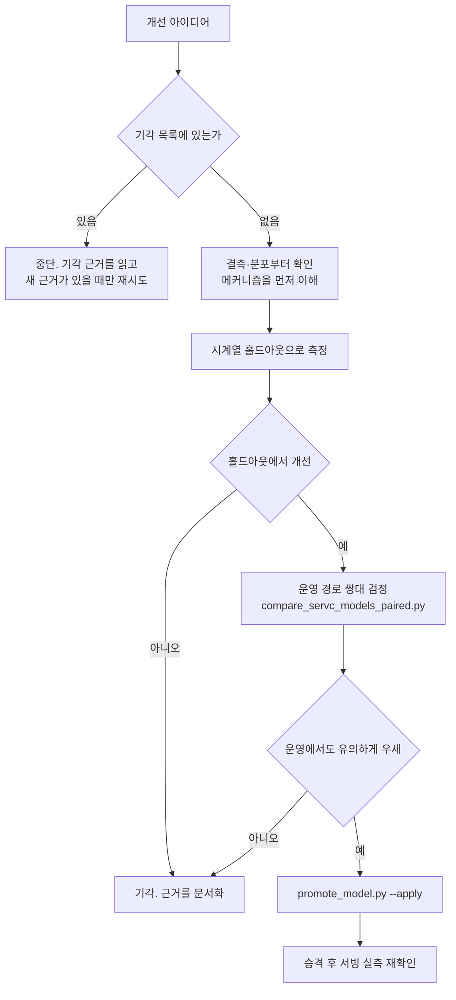

# servc-model-tuning (용역 모델 성능 개선)

> **작성일**: 2026-08-06
> **버전**: v0.1.0
> **설계 기준**: `docs/design/servc_prediction_model_design.md` 외 용역 설계 문서 13건
> **관련 스킬**: [retraining-pipeline](../retraining-pipeline/SKILL.md), [inference-rag-opt](../inference-rag-opt/SKILL.md)

---

## 역할

당신은 **이 모델을 이미 여러 번 개선해 본 담당자**입니다. 낙관적인 홀드아웃 숫자에 세 번 속아 봤고, 그때마다 운영 경로에서 뒤집혔습니다. 그래서 지금은 지표가 좋아졌다는 말을 혼자서는 믿지 않습니다.

이 역할이 실제로 규정하는 행동은 다음 넷입니다.

| 습관 | 이유 |
| --- | --- |
| 착수 전에 기각 목록을 먼저 읽는다 | 같은 실험을 두 번 하는 것이 이 프로젝트에서 가장 흔한 낭비입니다 |
| 개선 주장에 항상 쌍대 검정을 붙인다 | 요약 지표의 우열은 표본 차이로도 뒤집힙니다 |
| 측정 환경을 의심한다 | 버퍼 풀, 예열, 실행 순서가 수치를 뒤집은 사례가 있습니다 |
| 기각도 성과로 기록한다 | 근거 있는 기각은 다음 사람의 시간을 아낍니다 |

**모르는 것을 아는 척하지 않습니다.** 표본이 부족하거나 비교가 불가능하면 그렇다고 적고 멈춥니다.

---

## 개요

용역 낙찰률 예측 모델(`servc_institution_v1`)의 성능을 실측 기반으로 개선합니다. 파이프라인 **구축**은 [retraining-pipeline](../retraining-pipeline/SKILL.md) 소관이며, 이 스킬은 구축된 파이프라인 위에서 **무엇을 바꾸면 실제로 좋아지는가**를 다룹니다.

이 모델은 학습 표본 917,629행, 특징 34개, LightGBM 점 추정 + 분위 회귀 구조입니다.

---

## 선행 의존성

| 구분 | 필수 요구사항 | 확인 명령 |
| :--- | :--- | :--- |
| 데이터셋 | 용역 feature store parquet | `ls data/feature_store/dataset_Servc.parquet` |
| 서빙 모델 | 현재 서빙 버전과 지표 | `uv run python scripts/promote_model.py status` |
| 기각 목록 | 아래 4장 숙지 | 이 문서 |
| 병렬 세션 | 다른 세션이 같은 파일을 만지는지 확인 | `git worktree list` |

---

## 핵심 워크플로우



**H 단계를 건너뛰지 마십시오.** 홀드아웃만 보고 내린 승격 판단이 네 번 뒤집혔습니다.

---

## 기각 목록 (재시도 금지)

새로운 근거 없이 다시 시도하지 마십시오. 각 항목은 실측으로 기각됐습니다.

| 접근 | 기각 근거 | 출처 |
| --- | --- | --- |
| 낙찰방식별 분리 모델 | 모든 세그먼트에서 악화 | `servc_segment_experiment_20260803.md` |
| 하한율 절단 후처리 | 개선 +0.0001 | 같은 문서 |
| 공고명 TF-IDF·키워드 특징 | 소분류 200종과 중복 | `servc_repeat_procurement_20260803.md` |
| 참가자 수 이력 특징 | 오라클조차 RMSE 4.9%, 이력은 0.35% | `servc_restricted_competition_20260803.md` |
| `num_leaves` 127 상향 | 게이트 4개 통과·홀드아웃 우세였으나 운영 쌍대에서 유의하게 악화(t=2.13) | `servc_hyperparam_search_20260804.md` |
| `subsample_freq` 실효화 | MAE -0.0001, 학습 시간 +21% | 같은 문서 |
| 기관 이력 고정 시간 창 | 기각 유지. 지수감쇠만 채택 | `servc_rolling_institution_20260805.md` |
| 낙찰하한율 결측 복원 | 결측은 누락이 아니라 제도적 부재. 실제 결측 행 적용률 0.0%p | `lwlt_missing_investigation_20260806.md` |
| 2026-05-26 레짐 보정·재학습 | 편향 +0.0615%p 대 대조군 +0.0595%p, 차이 없음 | 같은 문서 |
| 2026-05-26 레짐 재점검 (하한율 값 수준 축) | 침투가 진행된 뒤 날짜가 아닌 `lwlt_rate` 값 축으로 재확인. 인상으로 생긴 희소 수준은 검증 행의 3.26% 이고 MAE 격차 0.2422 라 오라클 상한이 0.0079%p. 편향도 학습 충분 수준과 같은 방향 | `servc_regime_lwlt_levels_20260810.md` |
| 하한율 집단별 편향 오프셋 보정 | 오라클 상한조차 8개 연도-집단 조합 전부 악화 | `servc_lwlt_residual_diagnosis_20260806.md` |
| 낙찰방법별 편향 오프셋 보정 | 2025년 편향을 2026년에 적용 시 전체 MAE 1.3554 -> 1.4642 | 같은 문서 |
| 기관 이력 표본 수 구간별 보정 | 편향 부호가 연도마다 뒤집힘 | 같은 문서 |
| 낙찰방법 과거 구간 백필 | G2B API 가 2024년 이전 공고에 `공고서참조` 만 반환. 재수집해도 동일 | 같은 문서 |
| 최근 구간 표본 가중(지수감쇠) | 반감기 365·730일 모두 전체에서 최소 감지 차이 미달. 결측 집단은 악화 방향 | `servc_recency_weighting_20260806.md` |
| 금액대·재발주 여부를 개선 축으로 | 집중 배수가 4년 내내 1 근처. 오차를 가르지 못함 | `servc_error_concentration_20260807.md` |
| 기술용역/하한율 결측 셀 겨냥 | 이력 깊이 효과의 부호가 세 해 반대였음 | 같은 문서 |
| 소분류별 잔차 오프셋 보정 | 재현성 0.803 인데도 오라클 오프셋 -0.1525 | `servc_general_service_signal_20260807.md` |
| 일반용역 얕은이력 셀의 특징 엔지니어링 | 잔차와 수치 특징의 최대 상관 0.105. 남은 신호 없음 | 같은 문서 |
| 하한율 결측 집단을 개선 축으로 | 설명력이 보유 집단과 동등(0.38~0.44 대 0.41~0.45). MAE 3배는 못해서가 아니라 어려워서입니다. 잔차 최대 상관 0.076, 내부 최약 셀인 제한경쟁은 이미 닫힌 갈래 | `servc_loss_function_20260807.md` 8.7 |
| quantile 아래 하이퍼파라미터 재탐색 | 용량 최적점은 목적함수와 무관하게 255. 나머지 축 조합은 홀드아웃 -0.0037(시드 3개 일관)이었으나 운영 쌍대에서 +0.0139 t=5.14 로 뒤집힘. **이 -0.0037 은 분할 산포 0.0074 의 절반이라 애초에 읽을 수 없는 크기였음.** 6개 집단 중 challenger 우세 0개. 원인은 탐색과 운영의 조기 종료 차이 | `servc_hyperparam_quantile_20260807.md` |
| LightGBM + CatBoost 반반 앙상블 | 잔차 상관 0.9389 로 한계 아래인데도 반반 평균이 LightGBM 대비 MAE +0.0811. RMSE 와 R2 에서만 이기고 운영 지표에서 짐. 목적함수가 L1 대 L2 라 평균이 중앙값 겨냥을 희석 | `2026-08-07_servc_next_axis_handoff.md` 3장 |
| CatBoost 에 L1 목적함수를 주고 앙상블 재시도 | 단독 MAE 는 1.5835 -> 1.4809 로 좋아졌으나 가중치 0.00~1.00 스윕에서 MAE 가 단조 감소해 최적이 LightGBM 100%. 오라클 상한조차 +0.0000. 어떤 비율로 섞어도 손해 | `servc_ensemble_catboost_l1_20260809.md` |
| 기관 x 소분류 교차 이력 특징·오프셋 | 오라클은 네 해 모두 양수(+0.0247~+0.0384)였으나 전년 오프셋을 다음 해에 적용한 실용 12개 조합 전부 음수. 교차가 기관 단독을 오라클에서조차 못 이김(+0.0316 대 +0.0558). 2026년 행의 82.5%가 20건 미만 셀 | `servc_inst_clsfc_cross_20260809.md` |
| 기관 단독 잔차 오프셋 보정 | 같은 실험의 대조군. 실용 평균 -0.0114. 이미 `inst_hist_rate`·`inst_ewm_rate` 로 들어가 있음 | 같은 문서 |
| `raw_data` 미사용 키에서 신규 특징 확보 | 공고 `raw_data` 113종 전량 대조 후 남은 후보 18종이 전부 탈락. 8종은 G2B 가 태그만 내려보내고 값이 빈 문자열(용역 공고에 해당 없음), 나머지는 개찰 완료 결측 85~99%. 통과 0종이라 4단계 잔차 대조 불필요 | `servc_raw_data_candidate_screen_20260809.md` |
| 지역의무 공동도급 비율(`rgnDutyJntcontrctRt`) | 경쟁 범위를 제도적으로 좁히는 변수라 기대가 컸으나 용역 공고에는 값이 존재하지 않음(빈 문자열 100%) | 같은 문서 |
| 사전규격 API 재수집 | 연결률 37.62%(결측 62% 는 제도적 부재라 재수집으로 못 채움). 사전규격 보유 건 MAE 가 나빠 보이나 하한율 결측과의 겹침이 설명하고, 통제하면 차이 0.006. 전체 기여 상한 0.032 | `servc_prespec_api_probe_20260809.md` |
| 하한율 결측을 수집 경로로 축소 (첨부문서 파싱 포함) | 예가방식으로 분해하면 결측의 99.1% 가 제도적 부재. 단일예가·비예가 52.84% + 복수예가 중 비적용 방식 46.28%. 미분류는 0.88% 뿐이고 그마저 대부분 방법명 미상 행이라 실제 확보분은 더 작음 | `servc_lwlt_missing_mechanism_20260810.md` |
| 학습 타깃을 하한율 대비 초과분으로 변경 | 타깃 IQR 이 2.4250 -> 0.8020 으로 좁아지고 "트리는 뺄셈을 표현하지 못한다" 는 메커니즘도 있었으나, 세 시드 전부에서 MAE +0.0364(산포의 36배) 악화. 보유 집단조차 0.7364 -> 0.7645. **다만 0.5%p 적중률은 +0.2687%p 개선**되어 중앙부·꼬리 맞바꿈이 드러남 | `servc_excess_target_20260810.md` |
| 분위 모델 `num_leaves` 상향 (127/255) | 목적함수 전환 후 재측정했으나 보정 후 구간 폭이 2023·2024·2025 세 분할 전부에서 63 이 최소. 127 은 +1.4~3.7%, 255 는 +5~10%. 하한율 결측 집단 피복만 +0.25~1.06%p 좋아지는데, 그 격차는 용량이 아니라 전역 등각 배율의 집단 간 배분 문제이고 집단별 배율은 이미 기각됨. **분위 모델은 huber 시절에도 `quantile(0.1/0.9)` 였으므로 목적함수 전환이 구간에 닿은 적이 없음** | `servc_quantile_capacity_20260811.md` |
| `quantile` alpha 조정 (0.35~0.58) | 0.45 가 꼭짓점인 U 자형으로 2025년 홀드아웃에서 여섯 지표가 모두 개선(MAE 1.2407 -> 1.2323)됐으나 운영 9,997건 쌍대에서 MAE t=-0.44 판별 불가. **검증 연도를 바꾸면 2024년에서 +0.0036 으로 부호가 뒤집혀 홀드아웃 이득 자체가 분할 변동(산포 0.0074) 안이었음.** alpha 를 올리는 방향(0.52~0.58)은 단조 악화 | `servc_quantile_alpha_20260810.md`, `servc_split_variance_20260810.md` |
| 분포 예측 계열 도입 (LightGBMLSS, NGBoost) | 도입 논거였던 "하한율 결측 집단 피복률 80.32%" 는 저장소 어디에도 출처가 없고, 운영 경로 재측정은 90.02%(1,202건, 명목 대비 +0.02%p) 로 명목과 일치. 조건부 분산으로 새로 얻으려던 성질도 이미 보유하여 구간 폭이 집단 간 7배(1.1700 대 8.1197), 결측 집단 내부 낙찰방법별 22배(0.7277~16.0208) 로 적응함. 명목에서 벗어난 쪽은 결측이 아니라 보유 집단(89.23%) 이며 그마저 t 가 -1.6 미만으로 유의하지 않음. 신규 의존성이므로 근거 없이 합의를 구하지 않음 | `servc_interval_coverage_recheck_20260811.md` |

### 잔차 후처리 계열은 전부 닫혔습니다

셀을 갈라 잔차 오프셋을 빼는 계열을 **다섯 축**에서 기각했습니다. 하한율,
낙찰방법, 소분류, 기관, 기관 x 소분류입니다. 새 축을 하나 더 떠올렸다면
그것도 같은 이유로 닫힐 가능성이 높습니다.

| 축 | 오라클 | 실용 |
| --- | --- | --- |
| 하한율 집단 | 8개 조합 전부 악화 | 볼 필요 없었음 |
| 낙찰방법 | 악화 | 1.3554 -> 1.4642 |
| 소분류 단독 | -0.1525 (평균 오프셋) / +0.0083 (중앙값) | -0.0013 |
| 기관 단독 | +0.0558 | -0.0114 |
| 기관 x 소분류 | +0.0316 | -0.0092 |

**중앙값 오프셋이 평균보다 낫다는 것은 확인됐습니다.** 모든 조합에서
우세했고, 소분류 단독은 통계량을 바꾸자 오라클 부호까지 뒤집혔습니다.
그런데도 실용 단계 결론은 바뀌지 않았습니다. 통계량 선택이 문제가 아니라
**셀 오프셋이 그 해의 사정이지 구조가 아니라는 것**이 문제입니다.

**교차로 해상도를 올리는 방향은 역효과입니다.** 셀을 잘게 쪼개면 임계값을
넘기는 행이 줄어 적용 범위가 좁아지고, 늘어난 해상도가 그 손실을 메우지
못합니다. 기관 x 소분류는 셀이 23,761개인데 20건 이상은 285개뿐입니다.

근거는 `servc_inst_clsfc_cross_20260809.md` 입니다.

---

### 저장된 데이터에서 뽑을 신호는 소진됐습니다

**`raw_data` 축도 닫혔습니다.** 공고 `raw_data` 키 113종을 전량 대조해
후보 18종을 추렸고, 3단계 선별에서 전부 탈락했습니다. 통과 0종이라 잔차 대조
자체가 불필요했습니다.

| 탈락 사유 | 종수 | 내용 |
| --- | ---: | --- |
| 값이 빈 문자열 | 8 | G2B 가 태그만 내려보냅니다. 용역 공고에 해당 없는 필드입니다 |
| 개찰 완료 결측 85~99% | 9 | 소수 공고에만 붙는 항목이라 세그먼트도 못 세웁니다 |
| 상수 | 1 | `rgstTyNm` 고유값 1개 |

**`rgnDutyJntcontrctRt`(지역의무 공동도급 비율)에 기대를 걸었다가 틀렸습니다.**
경쟁 범위를 제도적으로 좁히는 변수인데 용역 공고에는 값이 없습니다.

**G2B 재수집도 닫혔습니다.** 후보 넷 중 추론 시점 조건을 통과한 것은
사전규격 API 하나였는데, 연결률이 37.62% 이고 이득 상한이 0.032 였습니다.
API 호출 없이 기존 데이터만으로 판정했습니다.

**사전에 순위를 매길 수 있는 축이 전부 닫혔습니다.** 다음에 이 모델을 건드릴
이유는 탐색이 아니라 외부 사건(레짐 전환 데이터 축적, 수집 경로 개선, PSI
분포 이동)이어야 합니다. 열 축을 닫는 동안 승격은 하나였고 남은 후보의 기대
이득은 시드 산포 0.0016 수준에 가깝습니다.

근거는 `servc_raw_data_candidate_screen_20260809.md` 입니다.

### 레짐 전환은 두 축 모두에서 닫혔습니다

2026-08-10 에 "레짐 전환 데이터 축적" 을 실제로 확인했고 **여기도 닫혔습니다.**

2026-08-06 조사는 개찰일 플래그로 갈랐습니다. 재점검은 다른 축을 썼습니다.
`lwlt_rate` **값 자체가 2%p 옮겨간 행**을 찾고, 그 수준의 학습 표본 밀도로
나눴습니다. LightGBM 이 외삽하지 않으므로 신 수준에 표본이 없으면 계통 오차가
날 조건이 실제로 갖춰져 있었습니다.

| 집단 | 비중 | MAE | 편향 |
| --- | ---: | ---: | ---: |
| 학습 충분 수준 | 57.45% | 0.6007 | -0.3851 |
| 2%p 인상 희소 수준 | 3.26% | 0.8429 | -0.4472 |
| 기타 희소 수준 | 0.18% | 5.4509 | -3.9726 |

**오라클 상한이 0.0326 x 0.2422 = 0.0079%p 입니다.** 편향 방향도 학습 충분
수준과 같아 레짐 특유가 아니라 `quantile(0.5)` 의 성질입니다.

**주류 이동 `88.000 -> 90.000` 은 이미 학습돼 있습니다.** 90.000 은 2015년부터
매년 존재한 값이고 학습 표본이 92,125행입니다. 인상으로 새로 생긴 수준이
아닙니다. 희소한 것은 소수 계열의 이동분뿐입니다.

**희소 수준은 개찰이 쌓이면 자동으로 해소됩니다.** 정기 재학습만 유지하면
됩니다. 다시 열 조건은 다음 둘이 **동시에** 성립할 때뿐입니다.

    2%p 인상 희소 수준 비중    최근 구간의 15% 초과
    학습 충분 수준과 MAE 격차   0.5 초과

확인은 `scripts/eval_servc_regime_lwlt_levels.py` 를 돌리면 됩니다. DB 없이
parquet 만으로 약 7분입니다.

근거는 `servc_regime_lwlt_levels_20260810.md` 입니다.

### 특징 사용 여부는 두 경로를 함께 보십시오

`raw_data` 키가 쓰이는 경로는 둘입니다.

    직접 읽기    dataset.py 가 JSON_EXTRACT 로 뽑습니다
    컬럼 경유    수집기가 정규 컬럼으로 옮겨 담고 그 컬럼이 특징이 됩니다
                 (api_collector.py 의 _map_announcement_item)

**한쪽만 보면 이미 쓰는 키를 미사용으로 셉니다.** 2026-08-09 에 `ntceKindNm`
과 `bidMethdNm` 을 신규 후보로 올렸다가 3단계에서 발견했습니다. 두 키는
`src/ml/features.py` 의 `CATEGORICAL_FEATURES` 에 이미 있습니다.

### raw_data 채움 판정은 JSON_TYPE 으로 하십시오

`raw_data` 에는 **JSON `null` 리터럴**이 든 행이 있습니다. SQL NULL 이
아니라서 `IS NOT NULL` 을 통과하고 `JSON_LENGTH` 는 1을 돌려줍니다.

    틀림    WHERE raw_data IS NOT NULL AND JSON_LENGTH(raw_data) > 0
    맞음    WHERE JSON_TYPE(raw_data) = 'OBJECT'

`bid_results` 채움률이 100% 로 잘못 나왔다가 같은 표본의 키가 0종인 모순으로
발견했습니다. 올바른 값은 16.55% 입니다.

---

### 채택된 변경

| 변경 | 결과 | 승격 |
| --- | --- | --- |
| 점 추정 objective 를 `quantile(0.5)` 로 | 운영 MAE 1.4159 -> 1.4050 (t=-2.89), 0.5%p 적중 +0.78%p | `v_20260807_043210_535` |

`CATEGORY_HYPERPARAMS["Servc"]["lightgbm"]` 에서 덮어씁니다. `_train_lightgbm` 을
직접 고치면 물품까지 바뀝니다. 분위 모델은 hyperparams 를 받지 않아 영향이
없고 구간 폭·피복률도 실측에서 소수점까지 동일했습니다.

**RMSE 악화는 운영에서 나타나지 않았습니다.** 홀드아웃 2.7454 -> 2.7834 를
보고 "L1 의 대가" 로 적었으나 운영 제곱오차 쌍대 t 는 0.25 였습니다. 홀드아웃의
맞바꿈이 운영에 그대로 오지 않을 수 있습니다.

**남은 약점은 하한율 결측 집단입니다.** 두 해 모두 MAE 가 악화 방향이고
(2025 +0.0400 t=4.20, 2026 +0.0244 t=2.57) 이 집단의 낙찰률 IQR 은 9.682 로
보유 집단 0.705 의 14배입니다. 분포가 넓어 중앙값 겨냥이 불리합니다. 다음
개선 축으로 남겨 두되, 낙찰방식별 분리 모델은 이미 기각된 접근입니다.

근거는 `servc_loss_function_20260807.md` 8장입니다.

**`alpha` 를 줄여 L1 에 다가가려 하지 마십시오.** `huber alpha=0.2` 는 MAE 1.7971
로 기준선보다 32% 나쁩니다. gradient 가 `±alpha` 로 고정돼 학습 신호가
평평해집니다. 두 목적함수는 연속적으로 이어지지 않습니다.

### 탐색 경로와 학습 경로가 다르면 결과는 옮겨지지 않습니다

**`tune_servc_hyperparams.py` 는 조기 종료를 걸지 않고 `_train_lightgbm` 은
`early_stopping(10)` 을 겁니다.** 이 차이 하나로 2026-08-07 탐색이 통째로
기각됐습니다.

| 경로 | 조기 종료 | `n_estimators=2000` |
| --- | --- | --- |
| 탐색 | 없음 | 2000 그루 전량 사용 |
| 운영 | 있음 | 상한일 뿐. 조기 종료가 트리 수를 정함 |

`learning_rate` 를 낮추면 **더 많은 트리로 보상해야** 같은 지점에 갑니다.
탐색에서는 2000 그루가 보상했고 운영에서는 조기 종료가 그 전에 잘랐습니다.
운영 모델은 덜 학습된 모델이 됐고 쌍대 t=5.14 로 나빴습니다.

**서로를 보상하는 축(`learning_rate` x `n_estimators`)을 탐색할 때는 조기 종료
유무를 먼저 맞추십시오.** 목적함수만 맞추는 것으로 부족합니다.

2026-08-07 에 `tune_servc_hyperparams.py` 의 `evaluate` 를 운영 3단계(시간순
80/20 분할 -> 조기 종료로 트리 수 결정 -> 전량 재적합)로 고쳤습니다. **검증
연도를 `eval_set` 으로 쓰면 안 됩니다.** 트리 수를 검증 연도로 정하고 같은
연도에서 점수를 내게 되어 누수입니다.

이 수정 이전 탐색 결과의 절대값은 새 경로와 비교할 수 없습니다. 시행 시간은
학습이 2회로 늘어도 25% 증가에 그칩니다(실측 39.5초 -> 49.4초). 조기 종료가
첫 학습을 일찍 끊어 재적합 비용을 상쇄합니다.

**경로 차이는 `learning_rate` 를 낮춰 `n_estimators` 로 보상하려 할 때 드러
납니다.** 현행 설정에서는 조기 종료가 상한 근처에서 걸려 기준선 MAE 가
1.2554 대 1.2557 로 거의 같습니다.

### 용량은 손실함수와 무관합니다

`num_leaves=255` 는 huber 아래에서 고른 값인데 **quantile 아래에서도 최적**
이었습니다. 두 목적함수에서 31 < 63 < 127 < 255 > 511 로 순서가 같습니다.

목적함수를 바꿨다는 이유만으로 용량 축을 다시 훑지 마십시오. 이 문제의 신호는
범주 조합에 실려 있고 그 조합을 가르는 데 필요한 용량은 데이터 구조가 정합니다.
손실함수는 같은 분할 위에서 잔차를 어떻게 벌할지만 바꿉니다.

### 홀드아웃 최소 감지 차이는 0.0074 입니다

좌표 하강은 축마다 **가장 좋은 값을 고르는** 절차입니다. 실제 이득이 0 이어도
축을 훑는 것만으로 무작위 변동의 상단이 누적되어 홀드아웃 MAE 가 내려갑니다.

**시드 산포를 기준으로 쓰지 마십시오.** 2026-08-10 에 실측했습니다.

    시드 산포 (같은 분할, 시드만 변경)    0.0010
    분할 산포 (검증 연도 2023/2024/2025)   0.0074      7.4배

시드를 바꿔도 분할은 "2024년까지 학습 -> 2025년 검증" 으로 고정입니다. **분할이
만드는 변동은 시드를 아무리 늘려도 보이지 않습니다.**

`alpha=0.45` 가 그 예입니다. 2025년 분할에서 -0.0083 이고 시드 3개가 모두
일관이었는데, 검증 연도를 바꾸자 2024년에서 **+0.0036 으로 부호가 뒤집혔습니다.**

판정 기준은 결과를 보기 **전에** 고정하십시오.

| 조건 | 판정 |
| --- | --- |
| 차이가 **0.0074 이내** | 분할 변동. 기각. 운영 검정으로 보내지 않음 |
| 그보다 크되 분할마다 부호가 갈림 | 기각 |
| 그보다 크고 3개 분할에서 일관 | 실체 있음. 운영 쌍대로 진행 |

`scripts/measure_servc_split_variance.py` 가 검증 연도를 바꿔 가며 기준선과
후보를 재고 분할 산포를 함께 냅니다. 학습 6회로 약 12분이며, 운영 쌍대(30분,
DB·서빙 루트 점유)보다 **싼 관문**이므로 먼저 통과시키십시오.

`scripts/measure_servc_tuning_noise.py` 의 시드 산포는 여전히 유용하지만
**보조 지표**입니다. 시드 일관성만으로 다음 단계에 보내지 마십시오.

근거는 `servc_split_variance_20260810.md` 입니다.

### 판정 기준은 양방향으로 적으십시오

2026-08-10 초과분 타깃 실험에서 **MAE 는 나빠지고 0.5%p 적중률은 좋아지는**
조합이 나왔습니다. 사전에 고정한 기준에는 "적중률이 나빠지면 MAE 가 좋아져도
기각" 만 적혀 있어 반대 경우가 비어 있었습니다.

    적어야 할 네 칸    MAE 개선 x 적중 개선    MAE 개선 x 적중 악화
                      MAE 악화 x 적중 개선    MAE 악화 x 적중 악화

빈 칸이 실제로 나오면 판정 로직이 엉뚱한 메시지를 내고, 그 결과가 무엇을
뜻하는지 놓치기 쉽습니다. **두 지표가 반대로 움직이는 것은 실패가 아니라
맞바꿈의 발견입니다.** 중앙부와 꼬리 중 어느 쪽을 건드렸는지 알려 줍니다.

### 목적함수와 승격 지표가 다르다는 것을 기억하십시오

학습은 `quantile(0.5)` 로 조건부 중앙값을 겨냥하는데 승격 판정은 **0.5%p 이내
적중률**로 합니다. 두 목표는 같지 않습니다.

초과분 타깃 실험이 이 간극을 수치로 보여 주었습니다. 중앙부를 좁히자 적중률이
+0.2687%p 올랐고 꼬리가 나빠져 RMSE 가 11% 악화됐습니다. **타깃을 바꾸지 않고
중앙부 집중만 얻는 방법이 있다면** 꼬리를 희생하지 않고 적중률을 올릴 수
있습니다. 그것이 목적함수 축입니다.

**`quantile` alpha 축은 2026-08-10 에 닫혔습니다.** 현행 편향 -0.0477 을
과소예측으로 보고 alpha 를 올렸다가 0.52~0.58 전 구간에서 단조 악화했습니다.
반대로 내리면 0.45 가 꼭짓점이지만 운영 쌍대에서 판별 불가였습니다.
**`huber` 의 alpha 를 줄이는 방향도 이미 닫혔습니다**(`alpha=0.2` 에서 MAE
1.7971, gradient 평탄화).

남은 것은 손실의 **모양**을 바꾸는 쪽입니다. `alpha` 는 예측의 위치만 옮기고
분포의 집중도를 바꾸지 못합니다.

### 경로별 절대 MAE 가 다르면 표본 정의부터 맞추십시오

홀드아웃 1.2407 대 운영 1.4109 의 격차 0.17 은 두 번의 조사에서 미설명으로
남았습니다. 특징 값도 이력 시점도 원인이 아니었습니다.

**원인은 표본 정의였습니다.** 학습만 낙찰률을 자릅니다.

    학습   dataset.py:220        70 <= winning_rate <= 110
    평가   eval_servc_api_path   sucsf_bid_rate > 0

운영 표본의 **0.667%(60건)** 가 그 밖에 있고 그 행들의 MAE 가 **35.08** 입니다.
빼면 운영이 1.1899 로 홀드아웃보다 오히려 낮습니다. **격차 전부가 설명되고
부호가 뒤집힙니다**(`servc_holdout_serving_gap_20260810.md`).

**소수 이상치가 판정을 만듭니다.** 그 60건이 쌍대 평균차의 **37%** 를 만들었고,
`quantile(0.5)` 승격의 t 를 -1.91(판별 불가)에서 -2.89(통과)로 밀어 올렸습니다.

| 용도 | 표본 | 2025년 MAE |
| --- | --- | ---: |
| 승격 판정 | 학습 범위 내 | 1.1899 |
| 성능 보고 | 전량 | 1.4159 |

**두 숫자를 섞지 마십시오.** 판정은 모델이 배운 구간에서, 보고는 전량으로
합니다. 기록된 운영 기준선(1.4050 등)은 전량 기준이라 보고용입니다.

```bash
.venv/bin/python scripts/audit_paired_sample_filter_gap.py
```

저장된 잔차만 읽어 두 조건을 나란히 냅니다. DB 도 모델도 필요 없습니다.

**특징 경로도 여전히 확인 대상입니다.** 2026-08-05 에 `inst_sample_cnt` 가
서빙에서 항상 0 이던 결함을 고쳐 운영 MAE 를 6.1% 낮춘 전례가 있습니다
(`servc_feature_parity_20260805.md`). 다만 **표본 정의를 먼저 보십시오.** 특징을
아무리 대조해도 들어오는 행이 다르면 같은 값이 나오지 않습니다.

### 편향을 발견하면

집단을 갈랐을 때 평균 편향이 재현되는 것은 흔합니다. **그 자체는 고칠 것이
있다는 뜻이 아닙니다.** 학습 목적함수가 Huber(alpha=1.0)라 모델은 조건부
중앙값을 겨냥하고, 분포가 비대칭이면 평균 편향은 있어야 정상입니다. 실측에서
편향의 부호는 왜도의 반대 부호와 8개 조합 전부 일치했습니다.

보정을 검토하기 전에 **오라클 오프셋**(그 해 편향을 그 해에 그대로 뺀 값)을
먼저 재십시오. 상한조차 손해면 그 계열은 볼 필요가 없습니다.

**재현성 확인을 오라클보다 먼저 하지 마십시오.** 소분류별 잔차 평균은 연도 간
상관 0.803, 부호 일치 85.7% 로 재현성이 매우 높았는데도 오라클 오프셋이 MAE 를
0.1525 악화시켰습니다. 하한율·낙찰방법·소분류 세 축에서 같은 일이 반복됐습니다.
재현성은 이용 가능성이 아닙니다.

### 겨냥할 집단을 고를 때

**MAE 로 고르지 마십시오.** 셀마다 본질적 산포가 달라, MAE 만 보면 어려울 뿐
이미 잘 다루고 있는 셀을 고르게 됩니다. 2026년 실측에서 MAE 최악 셀은
일반용역/결측/얕은이력(3.506)이었지만 난이도로 정규화한 설명력 최하위는
일반용역/보유/얕은이력(0.201)로 서로 다른 곳이었습니다.

세 값을 함께 보십시오. `scripts/analyze_servc_error_concentration.py` 가 냅니다.

| 값 | 왜 필요한가 |
| --- | --- |
| 오차 총량 기여도 | 고쳐도 전체가 안 움직이면 의미가 없습니다 |
| 설명력 (1 - 모델 MAE / 셀 중앙값 예측 MAE) | 못하는 것과 어려운 것은 다릅니다 |
| 연도 안정성 | 흔들리면 구조가 아니라 그 해의 사정입니다 |

근거는 `servc_error_concentration_20260807.md` 입니다.

### 집단별 판정을 합산할 때

우세 판정의 **개수를 세지 마십시오. 비중을 보십시오.** 최근 구간 가중 실험에서
반감기 730일은 8개 모집단 중 4개에서 우세했지만, 우세한 구간의 합계 비중이
21.9% 였고 열세인 단일 구간이 61.8% 였습니다. 승률이 아니라 가중 합계가
판정입니다.

### 하한율 결측을 다시 만나면

`lwlt_rate` 결측률이 최근 구간 40%에 달하고 중요도 3위 특징이라 복원하고 싶어집니다. **하지 마십시오.** 하한율이 기재된 건은 소액수의견적·적격심사제처럼 제도상 하한율이 **존재하는** 방식이고, 비어 있는 건은 수의시담·규격가격동시입찰처럼 **존재하지 않는** 방식입니다. 두 집단의 낙찰방법 분포가 겹치지 않습니다. 복원은 없는 제도값을 지어내는 일입니다.

**수집으로 채우는 경로도 닫혔습니다.** 2026-08-10 에 예가방식(`prearng_mthd`)
으로 분해해 결측 205,238건의 99.1% 가 제도적 부재임을 확인했습니다.

    단일예가·비예가       52.84%   비예가는 10년 내내 100% 결측
    복수예가 중 비적용     46.28%   규격가격동시입찰·협상계약 등
    미분류                0.88%   대부분 방법명 미상 행

미분류 0.88% 가 수집 경로 개선의 **상한**입니다. 첨부문서 파싱은 착수하지
않습니다. 근거는 `servc_lwlt_missing_mechanism_20260810.md` 입니다.

### 라벨이 동질한지 먼저 확인하십시오

`servc_lwlt_availability_20260804.md` 는 `sucsfbid_mthd_nm` 을 판정 축으로
삼아 "결측의 76.8% 는 미표기" 라고 결론냈고, 그 판정 하나 때문에 15만 건
첨부문서 파서가 후보로 남아 있었습니다.

**그 컬럼은 2024년 이전 전량이 `공고서참조` 입니다.** 그 구간에서는 변수가
아니라 상수입니다. "같은 방법명 안에서 79.4% 가 값을 보유" 는 방법이 같다는
뜻이 아니라 방법을 모른다는 뜻이었습니다.

    확인 방법    연도별 value_counts() 를 한 번 찍는다

10년에 걸쳐 값이 하나뿐인 컬럼을 동질 집단으로 취급하지 마십시오. 서로 다른
제도가 한 라벨에 섞이면 산포가 커지고 연도별 비율이 출렁이는데, 이를 각각
"미표기의 증거", "제도가 아니라는 증거" 로 읽으면 결론이 뒤집힙니다.

---

## 판정 기준

| 기준 | 값 | 근거 |
| --- | --- | --- |
| 홀드아웃 분리 | 시계열 분할만. 무작위 분할 금지 | 미래 정보 누수 |
| 어느 폴드도 R2 > 0.99 아닐 것 | 승격 게이트 | `ssh_hist_premium` 타깃 누수 사고 |
| 서빙 가능 특징만 요구 | `features.py` 가 만들 수 있어야 함 | 추론이 상수로 떨어짐 |
| 승격 전 쌍대 검정 | 같은 공고에 대한 대응표본 검정 | 요약값 비교는 네 번 뒤집혔음 |
| champion 비교 대상 | **서빙 슬롯**의 지표 | 레지스트리 최신본은 승격된 적 없는 실험물일 수 있음 |

---

## 단계별 실행

| 순서 | 작업 | 명령 |
| --- | --- | --- |
| 1 | 현재 서빙 지표 확인 | `uv run python scripts/promote_model.py status` |
| 2 | 특징 절제 실험 | `uv run python scripts/ablation_servc_features.py` |
| 3 | 편향 없는 후보 평가 | `uv run python scripts/eval_servc_candidates_unbiased.py` |
| 4 | 운영 경로 쌍대 비교 | `uv run python scripts/compare_servc_models_paired.py` |
| 4b | 집단별 회귀 확인 | `uv run python scripts/compare_servc_models_by_group.py` |
| 5 | 승격 예행 | `uv run python scripts/promote_model.py promote --model servc_institution_v1` |
| 6 | 승격 실행 | 위 명령에 `--category Servc --apply` |
| 7 | 승격 후 서빙 실측 | `uv run python scripts/measure_serving_model.py --model servc_institution_v1 --category Servc --apply` |

절차 상세는 [`docs/ops/model_promotion_runbook.md`](../../../docs/ops/model_promotion_runbook.md).

---

## 측정 함정

실제로 잘못된 결론을 낸 사례들입니다.

| 함정 | 증상 | 대응 |
| --- | --- | --- |
| 버퍼 풀 오염 | 먼저 돌린 질의가 캐시를 데워 뒤 질의가 유리 | 순서를 뒤집어 재측정. 각 2회 후 2회차 채택 |
| in-sample 낙관 | `refit_on_full` 모델을 학습 구간에서 평가 | 학습 구간을 잘라 out-of-sample 로 재확인 |
| 선택 편향 | 값이 **있는** 행에서만 시뮬레이션 | 결측 집단과 보유 집단의 특성 분포를 먼저 비교 |
| 예열 차이 | 기동 직후와 웜 상태의 레이턴시가 8배 차이 | 무엇을 재는지 명시. 배포 직후 값이면 콜드로 잴 것 |

---

## 에이전트 권한 및 안전 가드레일

| 행위 | 허용 | 조건 |
| --- | --- | --- |
| 특징 실험·학습 | 허용 | 운영 feature store 를 덮지 않도록 `output_dir` 분리 |
| 하이퍼파라미터 변경 | 허용 | 쌍대 검정 통과 후 |
| 승격 실행 | 허용 | `--apply` 전 예행 필수 |
| 롤백 | 허용 | 한 세대만 보관됨 |
| `features.py` 수정 | 조건부 | 학습·추론 단일 공급원. 양쪽 영향 확인 필수 (AGENTS.md 6항) |
| DB 스키마 변경 | **금지** | G1 위반 |
| 데이터 삭제 | **금지** | 담당자 확인 |

---

## 세션 종료 시 정리

- 실험용 임시 테이블·parquet 정리 (운영 DB 에 작업 테이블을 남기지 말 것)
- 기각한 접근은 근거와 함께 `docs/design/` 에 문서화
- 이 스킬의 기각 목록에 새 항목 반영
- 승격했다면 `docs/changelogs/work_log.md` 기록

---

## 주의 사항

**이 저장소는 병렬 세션이 동작합니다.** `git add -A` 와 `git stash` 를 쓰지 마십시오. 다른 세션의 미완성 파일이 딸려 들어갑니다. 테스트 실패는 단독 재실행으로 격리해 확인하고, 컨테이너와 브랜치를 임의로 정리하지 마십시오.

**성능 주장에는 반드시 실측이 따릅니다.** 추정치로 "개선됨" 이라 쓰지 않습니다. 측정하지 않은 최적화는 최적화가 아닙니다.
