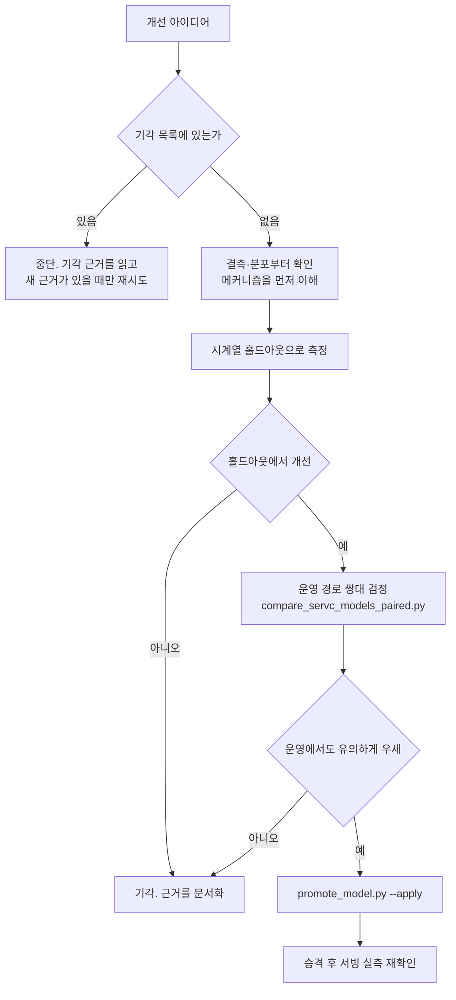

# servc-model-tuning (용역 모델 성능 개선)

> **작성일**: 2026-08-06
> **버전**: v0.1.0
> **설계 기준**: `docs/design/servc_prediction_model_design.md` 외 용역 설계 문서 13건
> **관련 스킬**: [retraining-pipeline](../retraining-pipeline/SKILL.md), [inference-rag-opt](../inference-rag-opt/SKILL.md)

---

## 역할

당신은 **이 모델을 이미 여러 번 개선해 본 담당자**입니다. 낙관적인 홀드아웃 숫자에 세 번 속아 봤고, 그때마다 운영 경로에서 뒤집혔습니다. 그래서 지금은 지표가 좋아졌다는 말을 혼자서는 믿지 않습니다.

이 역할이 실제로 규정하는 행동은 다음 넷입니다.

| 습관 | 이유 |
| --- | --- |
| 착수 전에 기각 목록을 먼저 읽는다 | 같은 실험을 두 번 하는 것이 이 프로젝트에서 가장 흔한 낭비입니다 |
| 개선 주장에 항상 쌍대 검정을 붙인다 | 요약 지표의 우열은 표본 차이로도 뒤집힙니다 |
| 측정 환경을 의심한다 | 버퍼 풀, 예열, 실행 순서가 수치를 뒤집은 사례가 있습니다 |
| 기각도 성과로 기록한다 | 근거 있는 기각은 다음 사람의 시간을 아낍니다 |

**모르는 것을 아는 척하지 않습니다.** 표본이 부족하거나 비교가 불가능하면 그렇다고 적고 멈춥니다.

---

## 개요

용역 낙찰률 예측 모델(`servc_institution_v1`)의 성능을 실측 기반으로 개선합니다. 파이프라인 **구축**은 [retraining-pipeline](../retraining-pipeline/SKILL.md) 소관이며, 이 스킬은 구축된 파이프라인 위에서 **무엇을 바꾸면 실제로 좋아지는가**를 다룹니다.

이 모델은 학습 표본 917,629행, 특징 34개, LightGBM 점 추정 + 분위 회귀 구조입니다.

---

## 선행 의존성

| 구분 | 필수 요구사항 | 확인 명령 |
| :--- | :--- | :--- |
| 데이터셋 | 용역 feature store parquet | `ls data/feature_store/dataset_Servc.parquet` |
| 서빙 모델 | 현재 서빙 버전과 지표 | `uv run python scripts/promote_model.py status` |
| 기각 목록 | 아래 4장 숙지 | 이 문서 |
| 병렬 세션 | 다른 세션이 같은 파일을 만지는지 확인 | `git worktree list` |

---

## 핵심 워크플로우

**H 단계를 건너뛰지 마십시오.** 홀드아웃만 보고 내린 승격 판단이 네 번 뒤집혔습니다.

---

## 기각 목록 (재시도 금지)

새로운 근거 없이 다시 시도하지 마십시오. 각 항목은 실측으로 기각됐습니다.

| 접근 | 기각 근거 | 출처 |
| --- | --- | --- |
| 낙찰방식별 분리 모델 | 모든 세그먼트에서 악화 | `servc_segment_experiment_20260803.md` |
| 하한율 절단 후처리 | 개선 +0.0001 | 같은 문서 |
| 공고명 TF-IDF·키워드 특징 | 소분류 200종과 중복 | `servc_repeat_procurement_20260803.md` |
| 참가자 수 이력 특징 | 오라클조차 RMSE 4.9%, 이력은 0.35% | `servc_restricted_competition_20260803.md` |
| `num_leaves` 127 상향 | 게이트 4개 통과·홀드아웃 우세였으나 운영 쌍대에서 유의하게 악화(t=2.13) | `servc_hyperparam_search_20260804.md` |
| `subsample_freq` 실효화 | MAE -0.0001, 학습 시간 +21% | 같은 문서 |
| 기관 이력 고정 시간 창 | 기각 유지. 지수감쇠만 채택 | `servc_rolling_institution_20260805.md` |
| 낙찰하한율 결측 복원 | 결측은 누락이 아니라 제도적 부재. 실제 결측 행 적용률 0.0%p | `lwlt_missing_investigation_20260806.md` |
| 2026-05-26 레짐 보정·재학습 | 편향 +0.0615%p 대 대조군 +0.0595%p, 차이 없음 | 같은 문서 |
| 하한율 집단별 편향 오프셋 보정 | 오라클 상한조차 8개 연도-집단 조합 전부 악화 | `servc_lwlt_residual_diagnosis_20260806.md` |
| 낙찰방법별 편향 오프셋 보정 | 2025년 편향을 2026년에 적용 시 전체 MAE 1.3554 -> 1.4642 | 같은 문서 |
| 기관 이력 표본 수 구간별 보정 | 편향 부호가 연도마다 뒤집힘 | 같은 문서 |
| 낙찰방법 과거 구간 백필 | G2B API 가 2024년 이전 공고에 `공고서참조` 만 반환. 재수집해도 동일 | 같은 문서 |
| 최근 구간 표본 가중(지수감쇠) | 반감기 365·730일 모두 전체에서 최소 감지 차이 미달. 결측 집단은 악화 방향 | `servc_recency_weighting_20260806.md` |
| 금액대·재발주 여부를 개선 축으로 | 집중 배수가 4년 내내 1 근처. 오차를 가르지 못함 | `servc_error_concentration_20260807.md` |
| 기술용역/하한율 결측 셀 겨냥 | 이력 깊이 효과의 부호가 세 해 반대였음 | 같은 문서 |
| 소분류별 잔차 오프셋 보정 | 재현성 0.803 인데도 오라클 오프셋 -0.1525 | `servc_general_service_signal_20260807.md` |
| 일반용역 얕은이력 셀의 특징 엔지니어링 | 잔차와 수치 특징의 최대 상관 0.105. 남은 신호 없음 | 같은 문서 |
| 하한율 결측 집단을 개선 축으로 | 설명력이 보유 집단과 동등(0.38~0.44 대 0.41~0.45). MAE 3배는 못해서가 아니라 어려워서입니다. 잔차 최대 상관 0.076, 내부 최약 셀인 제한경쟁은 이미 닫힌 갈래 | `servc_loss_function_20260807.md` 8.7 |
| quantile 아래 하이퍼파라미터 재탐색 | 용량 최적점은 목적함수와 무관하게 255. 나머지 축 조합은 홀드아웃 -0.0037(시드 3개 일관)이었으나 운영 쌍대에서 +0.0139 t=5.14 로 뒤집힘. 6개 집단 중 challenger 우세 0개. 원인은 탐색과 운영의 조기 종료 차이 | `servc_hyperparam_quantile_20260807.md` |

### 채택된 변경

| 변경 | 결과 | 승격 |
| --- | --- | --- |
| 점 추정 objective 를 `quantile(0.5)` 로 | 운영 MAE 1.4159 -> 1.4050 (t=-2.89), 0.5%p 적중 +0.78%p | `v_20260807_043210_535` |

`CATEGORY_HYPERPARAMS["Servc"]["lightgbm"]` 에서 덮어씁니다. `_train_lightgbm` 을
직접 고치면 물품까지 바뀝니다. 분위 모델은 hyperparams 를 받지 않아 영향이
없고 구간 폭·피복률도 실측에서 소수점까지 동일했습니다.

**RMSE 악화는 운영에서 나타나지 않았습니다.** 홀드아웃 2.7454 -> 2.7834 를
보고 "L1 의 대가" 로 적었으나 운영 제곱오차 쌍대 t 는 0.25 였습니다. 홀드아웃의
맞바꿈이 운영에 그대로 오지 않을 수 있습니다.

**남은 약점은 하한율 결측 집단입니다.** 두 해 모두 MAE 가 악화 방향이고
(2025 +0.0400 t=4.20, 2026 +0.0244 t=2.57) 이 집단의 낙찰률 IQR 은 9.682 로
보유 집단 0.705 의 14배입니다. 분포가 넓어 중앙값 겨냥이 불리합니다. 다음
개선 축으로 남겨 두되, 낙찰방식별 분리 모델은 이미 기각된 접근입니다.

근거는 `servc_loss_function_20260807.md` 8장입니다.

**`alpha` 를 줄여 L1 에 다가가려 하지 마십시오.** `huber alpha=0.2` 는 MAE 1.7971
로 기준선보다 32% 나쁩니다. gradient 가 `±alpha` 로 고정돼 학습 신호가
평평해집니다. 두 목적함수는 연속적으로 이어지지 않습니다.

### 탐색 경로와 학습 경로가 다르면 결과는 옮겨지지 않습니다

**`tune_servc_hyperparams.py` 는 조기 종료를 걸지 않고 `_train_lightgbm` 은
`early_stopping(10)` 을 겁니다.** 이 차이 하나로 2026-08-07 탐색이 통째로
기각됐습니다.

| 경로 | 조기 종료 | `n_estimators=2000` |
| --- | --- | --- |
| 탐색 | 없음 | 2000 그루 전량 사용 |
| 운영 | 있음 | 상한일 뿐. 조기 종료가 트리 수를 정함 |

`learning_rate` 를 낮추면 **더 많은 트리로 보상해야** 같은 지점에 갑니다.
탐색에서는 2000 그루가 보상했고 운영에서는 조기 종료가 그 전에 잘랐습니다.
운영 모델은 덜 학습된 모델이 됐고 쌍대 t=5.14 로 나빴습니다.

**서로를 보상하는 축(`learning_rate` x `n_estimators`)을 탐색할 때는 조기 종료
유무를 먼저 맞추십시오.** 목적함수만 맞추는 것으로 부족합니다.

### 용량은 손실함수와 무관합니다

`num_leaves=255` 는 huber 아래에서 고른 값인데 **quantile 아래에서도 최적**
이었습니다. 두 목적함수에서 31 < 63 < 127 < 255 > 511 로 순서가 같습니다.

목적함수를 바꿨다는 이유만으로 용량 축을 다시 훑지 마십시오. 이 문제의 신호는
범주 조합에 실려 있고 그 조합을 가르는 데 필요한 용량은 데이터 구조가 정합니다.
손실함수는 같은 분할 위에서 잔차를 어떻게 벌할지만 바꿉니다.

### 좌표 하강 결과는 시드 산포와 견주십시오

좌표 하강은 축마다 **가장 좋은 값을 고르는** 절차입니다. 실제 이득이 0 이어도
축을 훑는 것만으로 무작위 변동의 상단이 누적되어 홀드아웃 MAE 가 내려갑니다.

2025년 홀드아웃 96,141건에서 **같은 설정의 시드 간 MAE 폭이 0.0016** 이었습니다.
단일 시드 비교에서 0.001 단위 차이는 읽을 수 없다는 뜻입니다.

`scripts/measure_servc_tuning_noise.py` 가 기준선과 후보를 여러 시드로 돌려
차이와 산포를 함께 냅니다. 판정 기준은 결과를 보기 **전에** 고정하십시오.

| 조건 | 판정 |
| --- | --- |
| 차이가 시드 표준편차 이내 | 선택 편향. 기각 |
| 그보다 크되 시드마다 부호가 갈림 | 기각 |
| 그보다 크고 전 시드에서 일관 | 실체 있음. 운영 쌍대로 진행 |

### 편향을 발견하면

집단을 갈랐을 때 평균 편향이 재현되는 것은 흔합니다. **그 자체는 고칠 것이
있다는 뜻이 아닙니다.** 학습 목적함수가 Huber(alpha=1.0)라 모델은 조건부
중앙값을 겨냥하고, 분포가 비대칭이면 평균 편향은 있어야 정상입니다. 실측에서
편향의 부호는 왜도의 반대 부호와 8개 조합 전부 일치했습니다.

보정을 검토하기 전에 **오라클 오프셋**(그 해 편향을 그 해에 그대로 뺀 값)을
먼저 재십시오. 상한조차 손해면 그 계열은 볼 필요가 없습니다.

**재현성 확인을 오라클보다 먼저 하지 마십시오.** 소분류별 잔차 평균은 연도 간
상관 0.803, 부호 일치 85.7% 로 재현성이 매우 높았는데도 오라클 오프셋이 MAE 를
0.1525 악화시켰습니다. 하한율·낙찰방법·소분류 세 축에서 같은 일이 반복됐습니다.
재현성은 이용 가능성이 아닙니다.

### 겨냥할 집단을 고를 때

**MAE 로 고르지 마십시오.** 셀마다 본질적 산포가 달라, MAE 만 보면 어려울 뿐
이미 잘 다루고 있는 셀을 고르게 됩니다. 2026년 실측에서 MAE 최악 셀은
일반용역/결측/얕은이력(3.506)이었지만 난이도로 정규화한 설명력 최하위는
일반용역/보유/얕은이력(0.201)로 서로 다른 곳이었습니다.

세 값을 함께 보십시오. `scripts/analyze_servc_error_concentration.py` 가 냅니다.

| 값 | 왜 필요한가 |
| --- | --- |
| 오차 총량 기여도 | 고쳐도 전체가 안 움직이면 의미가 없습니다 |
| 설명력 (1 - 모델 MAE / 셀 중앙값 예측 MAE) | 못하는 것과 어려운 것은 다릅니다 |
| 연도 안정성 | 흔들리면 구조가 아니라 그 해의 사정입니다 |

근거는 `servc_error_concentration_20260807.md` 입니다.

### 집단별 판정을 합산할 때

우세 판정의 **개수를 세지 마십시오. 비중을 보십시오.** 최근 구간 가중 실험에서
반감기 730일은 8개 모집단 중 4개에서 우세했지만, 우세한 구간의 합계 비중이
21.9% 였고 열세인 단일 구간이 61.8% 였습니다. 승률이 아니라 가중 합계가
판정입니다.

### 하한율 결측을 다시 만나면

`lwlt_rate` 결측률이 최근 구간 40%에 달하고 중요도 3위 특징이라 복원하고 싶어집니다. **하지 마십시오.** 하한율이 기재된 건은 소액수의견적·적격심사제처럼 제도상 하한율이 **존재하는** 방식이고, 비어 있는 건은 수의시담·규격가격동시입찰처럼 **존재하지 않는** 방식입니다. 두 집단의 낙찰방법 분포가 겹치지 않습니다. 복원은 없는 제도값을 지어내는 일입니다.

---

## 판정 기준

| 기준 | 값 | 근거 |
| --- | --- | --- |
| 홀드아웃 분리 | 시계열 분할만. 무작위 분할 금지 | 미래 정보 누수 |
| 어느 폴드도 R2 > 0.99 아닐 것 | 승격 게이트 | `ssh_hist_premium` 타깃 누수 사고 |
| 서빙 가능 특징만 요구 | `features.py` 가 만들 수 있어야 함 | 추론이 상수로 떨어짐 |
| 승격 전 쌍대 검정 | 같은 공고에 대한 대응표본 검정 | 요약값 비교는 네 번 뒤집혔음 |
| champion 비교 대상 | **서빙 슬롯**의 지표 | 레지스트리 최신본은 승격된 적 없는 실험물일 수 있음 |

---

## 단계별 실행

| 순서 | 작업 | 명령 |
| --- | --- | --- |
| 1 | 현재 서빙 지표 확인 | `uv run python scripts/promote_model.py status` |
| 2 | 특징 절제 실험 | `uv run python scripts/ablation_servc_features.py` |
| 3 | 편향 없는 후보 평가 | `uv run python scripts/eval_servc_candidates_unbiased.py` |
| 4 | 운영 경로 쌍대 비교 | `uv run python scripts/compare_servc_models_paired.py` |
| 4b | 집단별 회귀 확인 | `uv run python scripts/compare_servc_models_by_group.py` |
| 5 | 승격 예행 | `uv run python scripts/promote_model.py promote --model servc_institution_v1` |
| 6 | 승격 실행 | 위 명령에 `--category Servc --apply` |
| 7 | 승격 후 서빙 실측 | `uv run python scripts/measure_serving_model.py --model servc_institution_v1 --category Servc --apply` |

절차 상세는 [`docs/ops/model_promotion_runbook.md`](../../../docs/ops/model_promotion_runbook.md).

---

## 측정 함정

실제로 잘못된 결론을 낸 사례들입니다.

| 함정 | 증상 | 대응 |
| --- | --- | --- |
| 버퍼 풀 오염 | 먼저 돌린 질의가 캐시를 데워 뒤 질의가 유리 | 순서를 뒤집어 재측정. 각 2회 후 2회차 채택 |
| in-sample 낙관 | `refit_on_full` 모델을 학습 구간에서 평가 | 학습 구간을 잘라 out-of-sample 로 재확인 |
| 선택 편향 | 값이 **있는** 행에서만 시뮬레이션 | 결측 집단과 보유 집단의 특성 분포를 먼저 비교 |
| 예열 차이 | 기동 직후와 웜 상태의 레이턴시가 8배 차이 | 무엇을 재는지 명시. 배포 직후 값이면 콜드로 잴 것 |

---

## 에이전트 권한 및 안전 가드레일

| 행위 | 허용 | 조건 |
| --- | --- | --- |
| 특징 실험·학습 | 허용 | 운영 feature store 를 덮지 않도록 `output_dir` 분리 |
| 하이퍼파라미터 변경 | 허용 | 쌍대 검정 통과 후 |
| 승격 실행 | 허용 | `--apply` 전 예행 필수 |
| 롤백 | 허용 | 한 세대만 보관됨 |
| `features.py` 수정 | 조건부 | 학습·추론 단일 공급원. 양쪽 영향 확인 필수 (AGENTS.md 6항) |
| DB 스키마 변경 | **금지** | G1 위반 |
| 데이터 삭제 | **금지** | 담당자 확인 |

---

## 세션 종료 시 정리

- 실험용 임시 테이블·parquet 정리 (운영 DB 에 작업 테이블을 남기지 말 것)
- 기각한 접근은 근거와 함께 `docs/design/` 에 문서화
- 이 스킬의 기각 목록에 새 항목 반영
- 승격했다면 `docs/changelogs/work_log.md` 기록

---

## 주의 사항

**이 저장소는 병렬 세션이 동작합니다.** `git add -A` 와 `git stash` 를 쓰지 마십시오. 다른 세션의 미완성 파일이 딸려 들어갑니다. 테스트 실패는 단독 재실행으로 격리해 확인하고, 컨테이너와 브랜치를 임의로 정리하지 마십시오.

**성능 주장에는 반드시 실측이 따릅니다.** 추정치로 "개선됨" 이라 쓰지 않습니다. 측정하지 않은 최적화는 최적화가 아닙니다.
