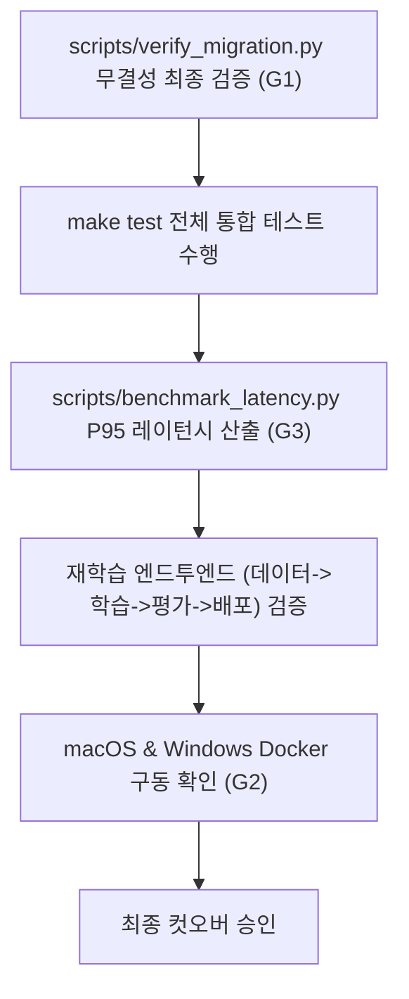

# validation-cutover (Phase 7 검증 및 컷오버)

> **작성일**: 2026-07-31
> **버전**: v0.1.0
> **설계 기준**: `docs/design/REFACTORING_DESIGN.md` 의 Phase 7 섹션
> **관련 스킬**: [retraining-pipeline](../retraining-pipeline/SKILL.md), [data-preservation](../data-preservation/SKILL.md)

---

## 개요

Phase 7 검증 및 컷오버 스킬은 리팩토링된 시스템의 정량적/정성적 지표 달성 여부를 최종 평가합니다. 3대 목표(G1 데이터 무손실, G2 크로스 플랫폼, G3 성능 최적화)를 통합 검증하고 안정적인 컷오버를 진행합니다.

## 선행 의존성

| 구분 | 필수 요구사항 | 확인 명령 |
| :--- | :--- | :--- |
| All Phases | Phase 0~6 완료 | `ls src/ml/features.py` |
| Test Suites | E2E 및 벤치마크 스크립트 | `ls tests/` |
| OS Test | macOS 및 Windows Docker 환경 | `docker compose ps` |

## 디렉토리 구조 및 핵심 자산

| 경로 | 역할 |
| :--- | :--- |
| `tests/` | 단위, 통합 및 E2E 테스트 모음 |
| `scripts/benchmark_latency.py` | P95 레이턴시 측정 벤치마크 스크립트 |
| `scripts/verify_migration.py` | DB 행 수 및 가중치 무결성 검증 |
| `docs/ops/cross_platform_guide.md` | 크로스 플랫폼 검증 가이드 |

## 핵심 워크플로우

## 단계별 실행

### 1. 데이터 무손실 무결성 검증 (G1)
`python scripts/verify_migration.py`를 실행하여 원본 DB와 레지스트리 가중치의 체크섬 및 행 수가 100% 매칭되는지 재검증합니다.

### 2. 레이턴시 벤치마크 (G3)
`scripts/benchmark_latency.py`를 통해 챗봇 및 추론 P95 레이턴시가 기존 대비 50% 이상 감소하였는지 실측합니다.

### 3. 크로스 플랫폼 검증 (G2)
macOS 및 Windows 환경에서 `make dev` 및 `make test` 명령이 동일하게 오차 없이 수행되는지 점검합니다.

### 4. 재학습 전 주기 검증
수동 API 호출을 통해 DB 집계 -> 데이터셋 구성 -> 학습 -> 평가 -> Champion 승격 및 핫스왑 과정을 통과하는지 확인합니다.

## 에이전트 권한 및 안전 가드레일

| 허용 | 금지 |
| :--- | :--- |
| 벤치마크 및 E2E 테스트 실행 | 실패한 테스트 Assert 조작 및 삭제 |
| 컷오버 체크리스트 작성 및 검증 | 검증 미통과 상태에서 컷오버 완료 선언 |
| 성능 측정 및 로그 종합 | 문제 원인 파악 없는 임의 억제 |

## 세션 종료 시 정리
모든 검증 결과를 정리하여 최종 컷오버 보고서를 작성합니다.

## 주의 사항
- 하나라도 검증 조건(G1, G2, G3)을 충족하지 못하면 컷오버를 즉시 중단하고 해당 Phase로 롤백해야 합니다.
