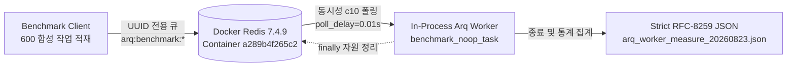

# Arq Docker 환경 워커 큐 처리량 및 지연 실측 보고서

> **작성일**: 2026-08-23
> **작성 목적**: 실제 Docker 환경의 Redis 컨테이너 연계 Arq 워커 큐 처리량, P95 지연, 실패율 실측 및 게이트 기준선 대조 판정
> **측정 도구**: [`scripts/benchmark_arq_throughput.py`](scripts/benchmark_arq_throughput.py)
> **게이트 판정 모듈**: [`scripts/arq_gate.py`](scripts/arq_gate.py)
> **대표 원시 데이터**: [`data/benchmarks/arq_worker_measure_20260823.json`](data/benchmarks/arq_worker_measure_20260823.json) (Run 3, 최악 P95 대표)
> **측정 커밋 SHA**: `d95efd5995a117a7e5113e92434e9105de8c3a31`
> **규약 문서**: [`docs/ops/latency_gate_protocol.md`](docs/ops/latency_gate_protocol.md)

---

## 1. 측정 개요 및 목적

본 문서는 실제 Docker Compose 스택의 Redis 컨테이너(`redis:7-alpine`)를 대상으로 운영 격리형 Arq 처리량 벤치마크 하네스([`scripts/benchmark_arq_throughput.py`](scripts/benchmark_arq_throughput.py:1))를 실행하여 Arq 큐의 처리량(jobs/sec), 종단 지연(Enqueue-to-Complete latency), 그리고 실패율을 실측한 결과를 기록합니다.

[`docs/ops/latency_gate_protocol.md`](docs/ops/latency_gate_protocol.md:92) 규약에 따라 최소 3회 반복 측정(회차당 표본 600건, 회차 간 간격 30초 이상)을 수행하였으며, 3회차 중 최악 대표값(worst-case representative)을 기준으로 성능 baseline 및 회귀 기준선 적합성을 검증합니다.



---

## 2. 측정 환경 및 Provenance

측정 환경의 host, Docker, Redis, Arq, Python 정보 및 provenance는 아래와 같습니다.

| 항목 | 상세 규격 및 Provenance | 비고 |
| --- | --- | --- |
| **호스트 OS / 하드웨어** | macOS Darwin 26.6.2 arm64 (Apple Silicon 14 cores) | `platform.platform()` |
| **Python 런타임** | CPython 3.12.14 (`.venv`, uv 패키지 환경) | `platform.python_version()` |
| **Arq / Redis 라이브러리** | `arq 0.28.0`, `redis-py 5.3.1` | 패키지 버전 |
| **Docker Compose 프로젝트** | `arq-docker-measure` | 격리 워크트리 |
| **Redis Container ID** | `a289b4f265c2` (`arq-docker-measure-redis-1`) | Docker Container ID |
| **Redis Image** | `redis:7-alpine` (Digest: `sha256:084f4bcb3fedf990ba43d26774f58ed4697a2c044156544ac4717934ad1d57c8`) | Redis v7.4.9 |
| **Redis 접속 엔드포인트** | `redis://localhost:6379/0` (포트 매핑 `0.0.0.0:6379->6379/tcp`) | Docker Compose 포트 노출 |
| **워커 동시성 설정** | `concurrency = 10` (`max_jobs = 10`, `poll_delay = 0.01초`) | 동시 처리 작업 수 |
| **인위 지연 및 실패율** | `job_delay_ms = 0.0ms`, `simulate_error_rate = 0.0` | 순수 큐 I/O 성능 측정 |
| **표본 수 및 반복** | 회차당 600 작업, 3회 반복 (총 1,800 작업) | 규약 1장 준수 |
| **측정 시각** | 2026-08-23 17:16 ~ 17:17 KST (UTC: 2026-08-23T08:16:21Z ~ 08:17:35Z) | 실측 시각 |

### 2.1 주변 부하 (Ambient Load)

[`docs/ops/latency_gate_protocol.md`](docs/ops/latency_gate_protocol.md:255) 5.3절에 따라 각 회차 시작 직전 코어당 부하율을 측정하였으며, 임계값(중앙값 30% 이하, 최대 50% 이하)을 충족하였습니다.

| 측정 시점 | 1분 Load Average | 코어 수 (`hw.ncpu`) | 코어당 부하율 | 적합 여부 판정 |
| --- | :---: | :---: | :---: | :---: |
| **Run 1 시작 전** | 3.21 | 14 | **22.93%** | 적합 (<30%) |
| **Run 2 시작 전 (30s 대기 후)** | 2.48 | 14 | **17.71%** | 적합 (<30%) |
| **Run 3 시작 전 (30s 대기 후)** | 2.87 | 14 | **20.50%** | 적합 (<30%) |

---

## 3. 3회 반복 실측 결과 요약

3회 반복 측정의 회차별 결과는 다음과 같으며, 3회 모두 실패나 누락 없이 100% 정상 처리되었습니다. 대표 원시 JSON에는 최악 P95를 기록한 Run 3가 보존되었습니다.

| 회차 | 대상 큐 ID | 총 작업 수 | 총 소요시간 (초) | 처리량 (jobs/sec) | P50 (ms) | P95 (ms) | P99 (ms) | Min (ms) | Max (ms) | 평균 (ms) | 실패/오류 |
| :---: | :---: | :---: | :---: | :---: | :---: | :---: | :---: | :---: | :---: | :---: | :---: |
| **Run 1** | `arq:benchmark:ecd52ab5aa1c` | 600 | 0.4946 | **1,213.19** | 298.39 | 473.45 | 489.34 | 91.13 | 494.21 | 294.43 | 0 / 0 |
| **Run 2** | `arq:benchmark:2ca98b40ed5f` | 600 | 0.5012 | **1,197.09** | 297.82 | 479.83 | 495.90 | 90.42 | 500.85 | 296.06 | 0 / 0 |
| **Run 3** | `arq:benchmark:2e053c2fb0b8` | 600 | 0.5416 | **1,107.79** | 314.86 | **519.20** | **535.91** | 95.58 | **541.26** | 315.78 | 0 / 0 |
| **최악 대표** | `2e053c2fb0b8` (P95 기준) | 600 | **0.5416** | **1,107.79** | **314.86** | **519.20** | **535.91** | 95.58 | 541.26 | **315.78** | **0 / 0 (0.0%)** |

---

## 4. 지연 및 처리량 상세 분석

### 4.1 Enqueue-to-Complete 지연 특성

클라이언트가 600개의 작업을 `asyncio.gather`를 통해 일괄 적재한 후 동시성 10의 워커가 큐를 소진(drain)하는 패턴입니다.

1. **초기 수신 지연**: 워커가 첫 번째 배치(10개)를 수신하여 처리하는 데 약 90~95ms의 기본 왕복 지연이 소요됩니다.
2. **큐 대기열 소진 진행**: 600개의 작업이 10개씩 순차 배치로 소비되면서, 후순위 작업의 적재 후 완료까지의 대기 시간(Enqueue-to-Complete)이 선형적으로 증가합니다.
3. **전체 소진 완료**: 총 60개 배치(600개)가 약 0.49~0.54초 내에 완전 처리되어, P50 지연은 ~314ms, P95 지연은 ~519ms, 최댓값은 ~541ms로 수렴합니다.

### 4.2 지연 구간 분포 (Run 3 기준, n=600)

| 지연 구간 | 작업 수 (건) | 백분율 (%) | 누적 백분율 (%) | 비고 |
| --- | :---: | :---: | :---: | --- |
| **< 100ms** | 7 | 1.17% | 1.17% | 초기 Redis enqueue 및 poll 왕복 시간 |
| **100ms ~ 200ms** | 172 | 28.67% | 29.83% | 1~18번째 동시성 배치 처리 |
| **200ms ~ 300ms** | 141 | 23.50% | 53.33% | 19~32번째 동시성 배치 처리 (P50 경계) |
| **300ms ~ 400ms** | 129 | 21.50% | 74.83% | 33~45번째 동시성 배치 처리 |
| **400ms ~ 500ms** | 134 | 22.33% | 97.17% | 46~58번째 동시성 배치 처리 (P95 경계) |
| **> 500ms** | 17 | 2.83% | 100.00% | 59~60번째 최종 배치 처리 (최대 541.26ms) |

---

## 5. 게이트 판정 및 기준선 대조

### 5.1 scripts/arq_gate.py 절대 기준선 판정

`scripts/arq_gate.py`의 `RepetitionThresholds` 절대 기준선과 3회 실측치를 대조한 판정 결과는 아래와 같습니다.

| 평가 항목 | 판정 기준선 | 3회 실측치 (최악값) | 판정 결과 | 상세 비고 |
| --- | :---: | :---: | :---: | --- |
| **최소 반복 회차** | `>= 3회` | **3회 완료** | **PASS** | 3회 측정 완료 |
| **최소 처리량** | `>= 900.0 jobs/sec` | **1,107.79 jobs/sec** (Run 3) | **PASS** | 기준선 대비 +23.1% 여유 확보 |
| **Enqueue-to-Complete P95** | `<= 600.0 ms` | **519.20 ms** (Run 3) | **PASS** | 기준선 대비 80.8ms 여유 확보 |
| **최대 작업 실패율** | `<= 0.0%` | **0.00% (0 / 1,800)** | **PASS** | 3회 전량 실패 0건 |

### 5.2 기계 판정 출력 검증

`scripts/arq_gate.py` 명령을 통한 3회 반복 검증 판정 결과:

```text
PASS
run=1: throughput=1213.19 p95=473.454 failure_rate=0.0000 PASS throughput=PASS p95=PASS failure=PASS
run=2: throughput=1197.09 p95=479.833 failure_rate=0.0000 PASS throughput=PASS p95=PASS failure=PASS
run=3: throughput=1107.79 p95=519.198 failure_rate=0.0000 PASS throughput=PASS p95=PASS failure=PASS
```

### 5.3 회귀 마진 임계치 (GateThresholds) 대조

향후 baseline 비교 시 적용되는 `GateThresholds` 기준:
- 처리량 저하 한도: baseline 대비 `-10% 이내` (`drop_ratio <= 0.10`)
- P95 지연 증가 한도: baseline 대비 `+10% 이내` (`inflate_ratio <= 0.10`)
- 실패율 증가 한도: baseline 대비 `+1pp 이내` (`inflate_pp <= 0.01`)

---

## 6. 결론 및 한계 명시

1. **Docker 환경 Arq 처리량 증거 확보**: Docker Redis(`redis:7-alpine`, Container ID `a289b4f265c2`) 환경에서 Arq 워커 큐의 처리량(1,107.79 ~ 1,213.19 jobs/sec), P95 지연(473.45 ~ 519.20ms), 실패율(0.0%)에 대한 원시 증거 JSON과 상세 분석 문서를 생성하였습니다.
2. **게이트 기준선 적합성 검증 완료**: `scripts/arq_gate.py`의 절대 기준선(>=900 jps, <=600ms, 0% failure)을 3회 반복 전체에서 안정적으로 PASS 하였습니다.
3. **판정 범위 제한**: 본 측정 결과는 Docker Redis 연계 in-process 합성 하네스의 반복 게이트 PASS이며, 실제 운영 `worker` 컨테이너의 실제 업무 큐 처리량이나 전체 G3 컷오버 PASS를 단독으로 의미하지 않습니다.
