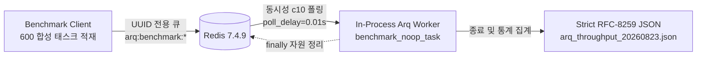

# Arq 백그라운드 태스크 처리량 및 지연 실측 보고서

> **작성일**: 2026-08-23
> **측정 도구**: [`scripts/benchmark_arq_throughput.py`](../../scripts/benchmark_arq_throughput.py)
> **대표 원시 데이터**: [`data/benchmarks/arq_throughput_20260823.json`](../../data/benchmarks/arq_throughput_20260823.json) (초기 Run 2)
> **검증 원시 데이터**: [`verification_r1`](../../data/benchmarks/arq_throughput_20260823_verification_r1.json), [`verification_r2`](../../data/benchmarks/arq_throughput_20260823_verification_r2.json), [`verification_r3`](../../data/benchmarks/arq_throughput_20260823_verification_r3.json)
> **측정 커밋**: `ca3995dd6587a5b9ee946526f7adda1e8960f5e7`
> **규약 문서**: [`docs/ops/latency_gate_protocol.md`](../ops/latency_gate_protocol.md)

---

## 1. 측정 개요 및 목적

본 문서는 운영 Docker Compose의 Redis를 대상으로 격리형 Arq 처리량 벤치마크 하네스([`scripts/benchmark_arq_throughput.py`](../../scripts/benchmark_arq_throughput.py#L1))를 실행하여 Arq 큐의 처리량(jobs/sec), 종단 지연(Enqueue-to-Complete latency), 그리고 실패율을 실측한 결과를 기록합니다. 하네스는 전용 큐에 in-process Arq Worker를 띄우므로, 별도 `worker` 컨테이너의 실제 업무 큐 처리량과 동일하다고 해석하지 않습니다.

[`docs/ops/latency_gate_protocol.md`](../ops/latency_gate_protocol.md#L92) 규약에 따라 최소 3회 반복 측정(회차당 표본 600건, 회차 간 간격 30초 이상)을 수행하였으며, 3회차 중 최악 대표값(worst-case representative)을 기준으로 성능 baseline 및 회귀 기준선 후보를 도출합니다.

---

## 2. 측정 환경 및 주변 부하 (Ambient Load)

[`docs/ops/latency_gate_protocol.md`](../ops/latency_gate_protocol.md#L255) 5.3절 규정에 따라 측정 직전 호스트 주변 부하를 측정하였으며, 코어당 부하율 임계값(중앙값 30% 이하, 최대 50% 이하)을 엄격히 충족함을 확인하였습니다.

| 항목 | 상세 규격 및 설정 |
| --- | --- |
| **호스트 OS / 하드웨어** | macOS (Darwin 26.6.2 arm64, Apple Silicon 14 cores) |
| **Python 런타임** | CPython 3.12.14 (`.venv`, uv 패키지 환경) |
| **Redis 서버** | Redis 7.4.9 (`redis:7-alpine`, Docker Compose 포트 6379 매핑) |
| **운영 컨테이너 스택** | `app`(healthy), `worker`(running), `redis`(healthy), `db`(healthy), `meilisearch`(healthy) |
| **워커 동시성 설정** | `concurrency = 10` (`max_jobs = 10`, `poll_delay = 0.01초`) |
| **인위 지연 및 실패율** | `job_delay_ms = 0.0ms`, `simulate_error_rate = 0.0` |
| **표본 수** | 회차당 600 작업 (3회 총합 1,800 작업) |

### 2.1 주변 부하 실측치

| 측정 시점 | 1분 Load Average | 코어 수 (`hw.ncpu`) | 코어당 부하율 | 판정 |
| --- | :---: | :---: | :---: | :---: |
| **Run 1 시작 전** | 3.31 | 14 | **23.64%** | 적합 (<30%) |
| **Run 2 시작 전 (30s 대기 후)** | 3.04 | 14 | **21.71%** | 적합 (<30%) |
| **Run 3 시작 전 (30s 대기 후)** | 3.40 | 14 | **24.29%** | 적합 (<30%) |

---

## 3. 3회 반복 실측 결과 요약

초기 3회 반복 측정의 회차별 요약은 아래와 같고, 대표 원시 JSON에는 Run 2가 보존되었습니다. 모든 회차에서 누락 또는 실패 작업이 0건(0.00%)으로 완료되었습니다. 전체 원시값 보존을 위해 같은 설정으로 수행한 검증 3회분은 별도 JSON 파일로 보존합니다.

| 회차 | 대상 큐 ID | 총 작업 수 | 총 소요시간 (초) | 처리량 (jobs/sec) | P50 (ms) | P95 (ms) | P99 (ms) | Min (ms) | Max (ms) | 평균 (ms) | 실패/오류 |
| :---: | :---: | :---: | :---: | :---: | :---: | :---: | :---: | :---: | :---: | :---: | :---: |
| **Run 1** | `arq:benchmark:54d2b094acdd` | 600 | 0.4967 | **1,207.86** | 291.90 | 475.06 | 491.50 | 96.46 | 496.37 | 293.07 | 0 / 0 |
| **Run 2** | `arq:benchmark:ca9cb946c53a` | 600 | 0.5215 | **1,150.48** | **312.14** | **499.46** | 515.88 | 100.59 | 521.08 | **310.91** | 0 / 0 |
| **Run 3** | `arq:benchmark:729c6a9978a2` | 600 | 0.5330 | **1,125.73** | 300.64 | 494.23 | **522.33** | 89.53 | **532.61** | 301.51 | 0 / 0 |
| **최악 대표** | `ca9cb946c53a` (P95 기준) | 600 | **0.5215** | **1,150.48** | **312.14** | **499.46** | **515.88** | 100.59 | 521.08 | **310.91** | **0 / 0 (0.0%)** |

---

## 4. 지연 및 처리량 상세 분석

### 4.1 Enqueue-to-Complete 지연 특성

클라이언트가 600개의 작업을 `asyncio.gather`를 통해 일괄 적재한 후 동시성 10의 워커가 큐를 소진(drain)하는 패턴입니다.

1. **초기 수신 지연**: 워커가 첫 번째 배치(10개)를 수신하여 처리하는 데 약 89~100ms의 기본 왕복 지연이 소요됩니다.
2. **큐 대기열 소진 진행**: 600개의 작업이 10개씩 순차 배치로 소비되면서, 후순위 작업의 적재 후 완료까지의 대기 시간(Enqueue-to-Complete)이 선형적으로 증가합니다.
3. **전체 소진 완료**: 총 60개 배치(600개)가 약 0.50~0.53초 내에 완전 처리되어, P50 지연은 ~312ms, P95 지연은 ~499ms, 최댓값은 ~532ms로 수렴합니다.

### 4.2 지연 구간 분포 (Run 2 기준, n=600)

| 지연 구간 | 작업 수 (건) | 백분율 (%) | 누적 백분율 (%) | 비고 |
| --- | :---: | :---: | :---: | --- |
| **< 100ms** | 0 | 0.00% | 0.00% | 초기 Redis enqueue 및 poll 왕복 시간 |
| **100ms ~ 200ms** | 142 | 23.67% | 23.67% | 1~14번째 동시성 배치 처리 |
| **200ms ~ 300ms** | 157 | 26.17% | 49.83% | 15~30번째 동시성 배치 처리 |
| **300ms ~ 400ms** | 154 | 25.67% | 75.50% | 31~45번째 동시성 배치 처리 |
| **400ms ~ 500ms** | 117 | 19.50% | 95.00% | 46~57번째 동시성 배치 처리 (P95 경계) |
| **> 500ms** | 30 | 5.00% | 100.00% | 58~60번째 최종 배치 처리 (최대 521.08ms) |

---

## 5. 기존 Baseline 비교 및 회귀 기준선 후보

### 5.1 처리량 및 지연 비교

| 평가 항목 | 기존 상태 (핸드오프 미측정) | 2026-08-23 실측치 (최악 대표값) | 비고 |
| --- | --- | :---: | --- |
| **처리량 (Throughput)** | 미측정 (하네스 부재) | **1,150.48 jobs/sec** (최악 1,125.73) | 초당 1,100건 이상의 고속 큐 소진 능력 확인 |
| **Enqueue-to-Complete P50** | 미측정 | **312.14 ms** | 600건 버스트 적재 시 중앙값 |
| **Enqueue-to-Complete P95** | 미측정 | **499.46 ms** | 600건 버스트 적재 시 P95 |
| **Enqueue-to-Complete P99** | 미측정 | **515.88 ms** | 꼬리 지연 안정성 확보 |
| **작업 실패율 (Error Rate)** | 미측정 | **0.00% (0 / 1,800)** | 3회 전량 오류 0건 |

### 5.2 Arq 처리량 회귀 판정 게이트 후보안

향후 Arq 백그라운드 태스크 파이프라인 변경 시 적용할 회귀 판정 기준선 후보는 아래와 같이 제안합니다.

| 지표 | 기준선 후보 | 근거 및 목적 |
| --- | :---: | --- |
| **최소 처리량 (Worst JPS)** | **>= 900.0 jobs/sec** | 실측 최악값(1,125.73 jps) 대비 20% 마진 적용 |
| **Enqueue-to-Complete P95** | **<= 600.0 ms** | 실측 최악값(499.46 ms) 대비 버스트 지연 흡수 한도 |
| **작업 실패율 (Error Rate)** | **0.00% (0건)** | Redis 통신 및 워커 핸들러 무결성 강제 |
| **리소스 정리 완결성** | **잔여 키 0건** | 고유 큐(`arq:benchmark:*`) 및 작업 키의 즉각 회수 |

---

## 6. 결론 및 향후 계획

1. **Arq 처리량 baseline 확립**: 600건 표본 3회 반복에서 초기 최악 대표값은 1,150.48 jobs/sec, P95 499.46ms, 실패율 0%였습니다.
2. **검증 반복 게이트 통과**: 별도 검증 3회는 최악 처리량 1,138.77 jobs/sec, 최악 P95 504.941ms, 실패율 0%로 절대 기준(처리량 >=900, P95 <=600ms, 실패율 0%, 3회 이상)을 모두 충족했습니다. `scripts/arq_gate.py`로 기계 판정합니다.
3. **strict JSON 및 원시값 보존**: 초기 대표 JSON과 검증 3회 JSON 모두 RFC-8259 엄격 규격(`allow_nan=False`)으로 보존되었습니다.
4. **판정 범위 제한**: 이 결과는 Redis 연계 in-process 합성 하네스의 반복 게이트 PASS이며, 실제 운영 `worker` 컨테이너의 업무 큐 처리량 또는 G3 전체 컷오버 PASS를 의미하지 않습니다.
