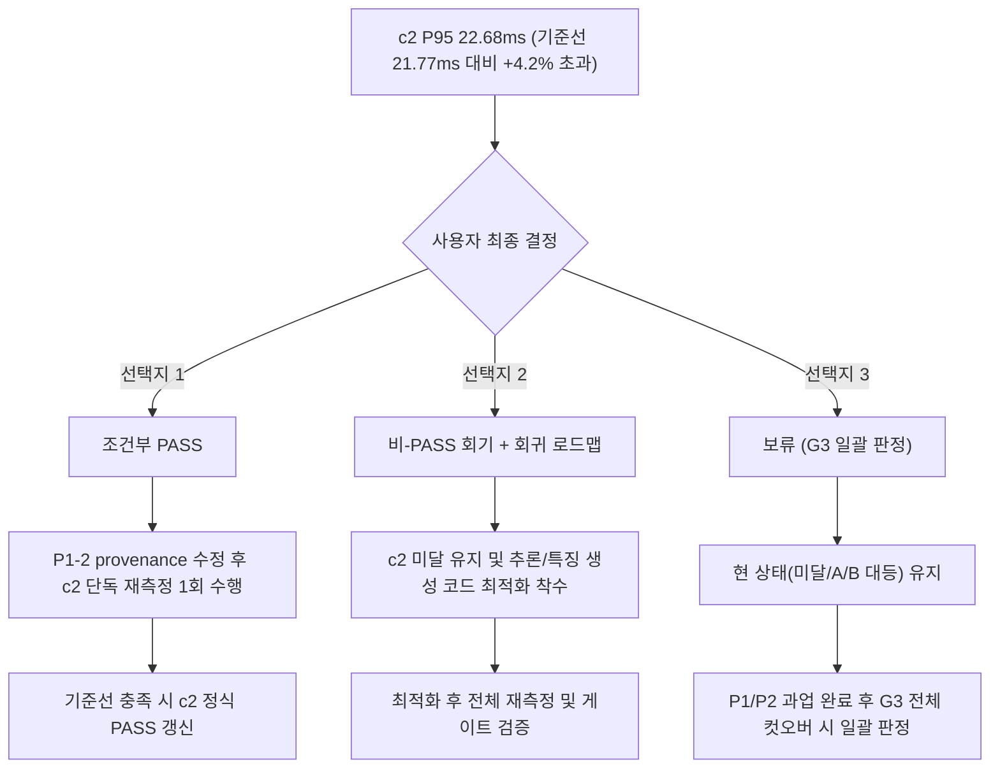

# 예측 API c2 레이턴시 측정 Disposition 보고서

> **작성일**: 2026-08-23
> **Task ID**: `c2_disposition_20260822`
> **대상 지표**: 예측 API c2 동시성 P95 레이턴시 (순차 측정 22.68ms vs 기준선 21.77ms)
> **관련 문서**: [`CURRENT_STATE.md`](../context/CURRENT_STATE.md), [`predict_ab_20260822.md`](../ops/predict_ab_20260822.md), [`latency_gate_protocol.md`](../ops/latency_gate_protocol.md), [`2026-08-22_post_1a45ad5_audit.md`](../handoff/2026-08-22_post_1a45ad5_audit.md)
> **문서 목적**: c2 P95 임계치 초과(+4.2%) 및 통제 교차 A/B 벤치마크 결과에 대한 기술적 분석과 사용자 최종 확정을 위한 3가지 판정 선택지(조건부 PASS / 비-PASS 회기 / 보류) 제시

---

## 1. 개요 및 배경 (Context & Background)

2026-08-22 순차 재측정에서 예측 API c2 동시성의 P95 지연시간이 **22.68ms**로 관측되었습니다. 이는 기존 승격 판정 기준선인 **21.77ms** 대비 **+4.2%(+0.91ms)** 초과한 수치로, [`latency_gate_protocol.md`](../ops/latency_gate_protocol.md) 규약에 따라 현재 정본 상 '미달'로 기록되어 있습니다.

이에 따라 원인 규명 및 런타임 퇴행 여부를 분리 검증하기 위해, 동일 호스트 상에서 격리된 과거 baseline(`refac-bid-box-predict-baseline:af674bc`, 포트 8001)과 현재 main(`127.0.0.1:8000`)을 교차 실행하는 **통제 교차 A/B 5회차 벤치마크 (c2 단독 6,000 표본: Baseline 5 x 600 + Current 5 x 600; c2/c4 전체 A/B 합계 12,000 표본)**를 수행했습니다.

본 문서는 실측 데이터와 통계적 사실을 종합하여 c2 지표의 기술적 성격을 규명하고, G3 스택 최적화 게이트의 진행 방향을 확정하기 위한 3가지 disposition 선택지와 각 선택지의 트리거 및 잔여 작업을 정리합니다.

---

## 2. 실측 사실 및 통제 A/B 분석 (Measurement Evidence)

### 2.1 순차 재측정 결과 (Sequential Benchmark)

[`CURRENT_STATE.md`](../context/CURRENT_STATE.md) 2.1절에 수록된 정본 실측치(3회 반복 중 최악값, 회차당 600표본, warmup 제외)는 다음과 같습니다.

| 동시성 | P50 (ms) | P95 (ms) | P99 (ms) | Max (ms) | >100ms | 회귀 판정선 (+10%) | 판정 상태 |
| :---: | ---: | ---: | ---: | ---: | :---: | :---: | :---: |
| **c1** | 12.18 | **15.39** | 18.01 | 27.96 | 0 / 1,800 | 17.02ms | **통과** |
| **c2** | 17.62 | **22.68** | 26.67 | 28.81 | 0 / 1,800 | 21.77ms | **미달 (+4.2%)** |
| **c4** | 28.83 | **34.32** | 38.55 | 44.06 | 0 / 3,000 | 36.81ms | **통과** |
| **c10** | 38.63 | **47.77** | 68.30 | 74.42 | 0 / 1,800 | 100.00ms | **통과** |

- c1, c4, c10은 모두 판정선을 안정적으로 만족했습니다.
- c2의 최악 P95(22.68ms)는 판정선 21.77ms 대비 +0.91ms 초과하여 미달 상태로 분류되었습니다.

---

### 2.2 통제 교차 A/B 5회차 실측 데이터 (c2)

호스트 부하 드리프트 및 환경 외생 변수를 차단하기 위해 동일 호스트에서 수행된 5회 교차 A/B 측정([`predict_ab_20260822.md`](../ops/predict_ab_20260822.md))의 c2 실측 결과는 다음과 같습니다 (c2 표본: Baseline 5 x 600 + Current 5 x 600 = 6,000건; 전체 A/B 합계는 c2 6,000건 + c4 6,000건 = 12,000건).

| 회차 | Baseline P95 (포트 8001) | Current P95 (포트 8000) | 쌍대 델타 (Current - Baseline) | 호스트 부하 (Current 측정 시) |
| :---: | ---: | ---: | ---: | ---: |
| **r1** | 25.40ms | 26.15ms | +0.75ms | 42.80% / 44.04% |
| **r2** | 24.52ms | 25.08ms | +0.56ms | 33.89% / 34.03% |
| **r3** | 21.70ms | 20.73ms | -0.97ms | 18.67% / 19.05% |
| **r4** | 23.17ms | 21.05ms | -2.12ms | 32.32% / 33.27% |
| **r5** | 21.25ms | 20.15ms | -1.10ms | 30.95% / 36.30% |

#### c2 통계 집계치 요약:
- **중앙값(Median)**: Baseline 23.17ms vs Current **21.05ms** (쌍대 델타 중앙 **-0.97ms**, Current 우세)
- **최악값(Worst)**: Baseline 25.40ms vs Current **26.15ms** (쌍대 델타 **+0.75ms**)
- **꼬리 지연 안전성**: c2 6,000건 표본(A/B 전체 12,000건 포함) 중 50ms 초과 **0건(0.00%)**, 100ms 초과 **0건(0.00%)**

---

### 2.3 기술적 분석 및 소견

1. **치명적 런타임 퇴행 부재 (No Critical Regression)**:
   - 5회 교차 측정 중 3회차(r3, r4, r5)에서 Current가 Baseline보다 빨랐으며, 전체 델타 중앙값은 -0.97ms로 Current 환경이 대등 이상의 성능을 보였습니다.
   - c2 6,000개 표본(c2/c4 A/B 전체 12,000개 표본) 전체에서 >50ms 및 >100ms 지연이 단 1건도 발생하지 않아 꼬리 지연 파탄이나 GC 블로킹 등의 결함은 완전히 배제되었습니다.

2. **호스트 배경 부하와의 동조 현상 (Host Load Sensitivity)**:
   - r1, r2 측정 구간에서는 호스트 코어 사용률이 34~44% 수준으로 상승함에 따라 Baseline과 Current 모두 P95가 24~26ms로 동반 상승했습니다.
   - 호스트 부하가 안정화된 r3~r5 구간에서는 Current P95가 20.15~21.05ms로 기존 기준선(21.77ms) 이내에 안정적으로 정착했습니다.
   - 따라서 순차 재측정에서 관측된 22.68ms는 코드 변경에 의한 고정 오버헤드가 아니라, 단일 시점 측정 시의 호스트 스케줄링 변동이 반영된 결과로 분석됩니다.

3. **보수적 감사 원칙 준수 ([`2026-08-22_post_1a45ad5_audit.md`](../handoff/2026-08-22_post_1a45ad5_audit.md) 3장)**:
   - 통제 A/B에서 -0.97ms 중앙 델타가 확인되었더라도, 정본 규약에 명시된 순차 게이트 수치(22.68ms)를 임의로 덮어쓰거나 승격으로 간주하지 않고 '미달' 상태를 유지하며 정식 절차에 따라 처리합니다.

---

## 3. 판정 선택지 3종 (Disposition Options)

c2 레이턴시 상태를 확정하기 위한 3가지 선택지는 다음과 같습니다.

---

### 3.1 선택지 1: 조건부 PASS (Conditional Pass)

- **정의**: 통제 교차 A/B 5회의 중앙 델타 -0.97ms 및 꼬리 지연 0건(>50ms 0%)의 무결성 증거를 인정하여, 운영 항목으로 회부하고 공식 1회 추가 재측정을 통해 최종 PASS를 확정하는 방안입니다.
- **트리거 및 전제 조건**:
  - P1-2(benchmark container provenance 결박) 작업 완료 후 수행.
  - 호스트 부하 30% 이하가 통제된 상태에서 c2 정식 3회 반복 재측정 1회 수행.
  - 재측정 최악 P95가 판정선 21.77ms 이내임을 증명.
- **잔여 작업**:
  1. provenance가 포함된 정식 벤치마크 하네스로 c2 재측정 실행.
  2. 기준 충족 시 [`CURRENT_STATE.md`](../context/CURRENT_STATE.md)의 c2 상태를 '통과'로 갱신.
- **영향 및 기대 효과**: 불필요한 코드 변경 없이 측정 신뢰성을 회복하고 G3 게이트 요건을 신속하게 정리할 수 있습니다.

---

### 3.2 선택지 2: 비-PASS 회기 + 회귀 로드맵 (Non-Pass & Optimization Roadmap)

- **정의**: 순차 측정 22.68ms의 수치적 초과를 엄격한 실패로 최종 확정하고, c2 지연을 21.77ms 이하로 영구적으로 낮추기 위한 코드 최적화 및 회귀 로드맵을 가동하는 방안입니다.
- **트리거 및 전제 조건**:
  - A/B 벤치마크 결과와 무관하게 규약 상 단일 게이트 수치 초과를 절대적 실패로 규정할 때 선택.
- **잔여 작업**:
  1. `src/ml/features.py` 및 `src/ml/engine.py` 마이크로 프로파일링 수행.
  2. Pydantic 직렬화, 메모리 복사, NumPy 배열 변환 오버헤드 감축 리팩토링.
  3. 최적화 브랜치 생성 후 c1~c10 전체 재측정 및 단위 테스트 회귀 검증.
- **영향 및 기대 효과**: c2 레이턴시 마진을 확실히 확보할 수 있으나, 이미 Baseline 대비 대등한 상태에서 추가 리팩토링으로 인한 공수 및 새로운 회귀 위험이 발생할 수 있습니다.

---

### 3.3 선택지 3: 보류 (Hold for G3 Cutover)

- **정의**: c2 개별 판정을 즉시 변경하지 않고 현재의 '미달(통제 A/B는 -0.97ms 중앙 델타)' 상태를 유지하며, 인프라 신뢰성 과업(P1/P2)과 잔여 운영 검증(G2 Windows 실기, Ollama c4, Arq 처리량)을 우선 완료한 뒤 G3 전체 컷오버 시점에 일괄 판정하는 방안입니다.
- **트리거 및 전제 조건**:
  - c2 미달이 전체 서비스 운영에 블로커가 아니며, P1-1(merge target 결박), P1-2(provenance) 등 인프라 신뢰성 작업이 더 시급하다고 판단될 때 선택.
- **잔여 작업**:
  1. c2 상태는 현재 정본 문서 표기를 유지.
  2. P1/P2 인프라 과업 우선 완료.
  3. Phase 7 종합 컷오버 단계에서 G3 전체 게이트와 함께 c2 최종 상태 일괄 판정.
- **영향 및 기대 효과**: 불필요한 논쟁과 섣부른 코드 수정을 피하고 우선순위가 높은 인프라 안정화에 역량을 집중할 수 있습니다.

---

## 4. 선택지별 종합 비교 매트릭스

| 구분 | 선택지 1: 조건부 PASS | 선택지 2: 비-PASS 회기 | 선택지 3: 보류 (Hold) |
| --- | --- | --- | --- |
| **핵심 기조** | A/B 실측 증거 수용 + 1회 검증 | 규약 절대주의 + 코드 최적화 | 인프라 우선 + 컷오버 일괄 판정 |
| **c2 게이트 판정** | 조건부 PASS (재측정 후 확정) | 미달 (FAIL 유지) | 미달 유지 (보류) |
| **코드 변경 필요성** | 없음 (측정 하네스 provenance만) | 있음 (추론/전처리 경로 리팩토링) | 없음 |
| **필요 잔여 공수** | 낮음 (재측정 1회) | 높음 (프로파일링 + 리팩토링) | 최소 (현 상태 유지) |
| **리스크 요인** | 재측정 시 호스트 부하 관리 필요 | 불필요한 코드 변경에 따른 회귀 위험 | G3 최종 컷오버 판정 시점까지 미결 잔존 |
| **적용 권장 상황** | 인프라 수정 후 빠른 G3 정리가 필요할 때 | 성능 마진 극대화가 서비스 필수 요건일 때 | P1/P2 긴급 과업 완결에 집중할 때 |

---

## 5. 결론 및 사용자 결정 가이드 (Recommendation & Next Steps)

- **기술적 권고**:
  - 통제 교차 A/B에서 확인된 델타(-0.97ms) 및 >50ms 0건의 결과는 런타임 코드 퇴행이 없음을 명확히 증명합니다.
  - 따라서 불필요한 코드 수정을 수반하는 **선택지 2(비-PASS 회기)**보다는, 인프라 신뢰성을 먼저 확보하는 **선택지 3(보류)** 또는 P1-2 provenance 수정 후 정식 재측정을 거치는 **선택지 1(조건부 PASS)**을 권장합니다.
- **사용자 확정 절차**:
  - 본 분석 보고서에 기술된 3가지 선택지 중 최종 방향은 **사용자 결정**에 의해 확정됩니다.
  - 사용자 결정이 내려지면 해당 결정에 맞춰 [`CURRENT_STATE.md`](../context/CURRENT_STATE.md) 및 후속 Task Capsule을 동기화합니다.
