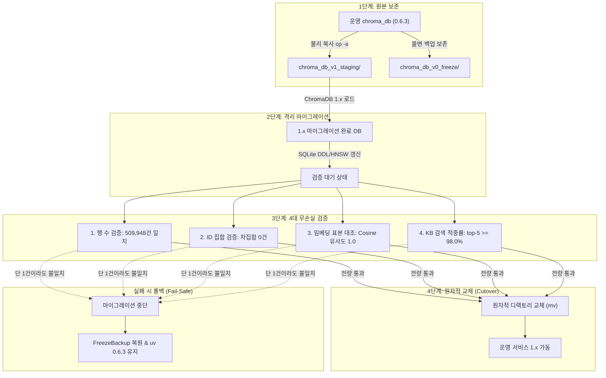

# ChromaDB 1.x 업그레이드 사전 조사 및 무손실 이행 계획서

> **작성일**: 2026-09-13
> **작성자**: Orca Builder (Worker)
> **기준 커밋**: `a1593e80fa245c629efd904066d01ba75c53ef88`
> **상태**: 사전 조사 완료 (단일 권고안 수립)
> **대상 패키지**: `chromadb 0.6.3` -> `chromadb 1.x` (`pyproject.toml`)

---

## 1. 요약과 권고안

### 1.1 배경 및 목적
`.github/vulnerability-allowlist.yml`에 등록된 `chromadb 0.6.3` 관련 취약점 3건(`CVE-2026-45830`, `CVE-2026-45831`, `CVE-2026-45833`)의 예외 만료일은 **2026-12-31**입니다. 만료일 이후에는 CI의 `supply-chain` 취약점 검증 잡이 차단되어 배포 파이프라인이 중단됩니다.

본 조사는 저장소의 **G1 데이터 무손실 원칙**(DB 행 수/스키마 100% 보존, 모델 가중치 및 벡터 DB 무결성 보존)을 엄격히 준수하면서, ChromaDB 0.6.3에서 1.x로 안전하게 업그레이드하기 위한 기술적 영향도, 데이터 이전 경로, 무손실 검증 체계 및 롤백 절차를 사전에 확정하기 위해 작성되었습니다.

### 1.2 대상 데이터 자산 현황
코디네이터 실측에 기반한 정본 자산 명세는 다음과 같습니다:
- **컬렉션 명**: `bidding_kb` (단일 컬렉션)
- **임베딩 차원**: 1024 차원 (`bge-m3`, Ollama 연동)
- **총 레코드 수**: `509,948` 건 (`embeddings` 테이블 기준)
- **세그먼트 구성**:
  - 벡터 세그먼트: `urn:chroma:segment/vector/hnsw-local-persisted`
  - 메타데이터 세그먼트: `urn:chroma:segment/metadata/sqlite`
- **스토리지 규모**: `chroma_db` 디렉토리 전체 약 3.6GB
- **검색 품질 기준선**: KB top-5 적중률 **98.0%** (`scripts/measure_kb_retrieval.py`)

### 1.3 단일 권고안
**권고안: "후보 B: 복사본 마이그레이션 후 원자적 교체 (Copy-then-Migrate & Atomic Swap)"**

원천 DB에서 50만 건을 재임베딩하는 방식(후보 D)은 약 20~30시간 이상의 연산 비용과 Ollama/GPU 부하를 초래합니다. 반면 원본 디렉토리에서 제자리 마이그레이션을 실행하는 방식(후보 A)은 원본 SQLite 스키마를 제자리에서 바꿉니다. 상류 마이그레이션 `00005-max-seq-id-int.sqlite.sql` 은 `max_seq_id` 에 `INTEGER` 컬럼을 추가해 BLOB 값을 변환한 뒤 원래 `seq_id` 컬럼을 `DROP` 하고 새 컬럼 이름을 바꿉니다(출처: [Chroma PR #3765 diff](https://github.com/chroma-core/chroma/pull/3765.diff)). 원 컬럼이 삭제되므로 0.6.3 으로 같은 디렉터리를 다시 열 수 없을 것으로 추론되지만, **역방향 오픈 실패 자체는 실측하지 않았습니다(미확인, 스테이징 복사본에서 확인).**

따라서 **운영 `chroma_db/` 디렉토리의 전체 복사본(`chroma_db_v1_staging/`)을 생성한 뒤, 격리된 스테이징 복사본에서 1.x 마이그레이션을 실행하고 4대 무손실 검증을 100% 통과한 경우에 한하여 디렉터리 이름 교체(`mv`)로 전환**하는 후보 B 방식을 단일 표준 경로로 권고합니다.

---

## 2. 호출부별 API 영향 분석

저장소 내에서 `chromadb`를 직접 import하거나 참조하는 파일은 총 6개입니다. 각 호출부의 현재 사용 API, 1.x 상류 변경점, 코드 수정 필요 여부 및 기술적 근거는 다음과 같습니다.

### 2.1 호출부 영향 매트릭스

| 파일 경로:행 번호 | 현재 사용 API | 1.x 동작 변화 | 수정 필요 여부 | 기술적 근거 및 출처 |
| --- | --- | --- | --- | --- |
| `src/app/api/v1/health.py:70-76` | `chromadb.PersistentClient(path)`<br>`client.get_collection(DEFAULT_COLLECTION)`<br>`collection.count()` | 클라이언트 생성 및 count 호출 인터페이스 호환 유지. 단, `get_collection` 시 기본 임베딩 함수 로드 시도 동작 주의. | 불필요<br>(권장: 공용 헬퍼 통일) | `PersistentClient` 및 `count()` 시그니처 유지 확인.<br>(출처: [Chroma API Types](https://github.com/chroma-core/chroma/blob/main/chromadb/api/types.py)) |
| `src/app/services/kb_builder.py:122-135`<br>(내부: `kb_index_sync.py:105,118,176,270`) | `chromadb.PersistentClient(path)`<br>`chroma_client.delete_collection(name)`<br>`get_collection(..., create=True)`<br>`collection.count()`<br>`collection.get(include, limit, offset)`<br>`collection.upsert(docs, metas, ids)`<br>`collection.delete(ids)` | 핵심 CRUD API 시그니처 호환 유지. `collection.get()` 정렬 기준이 내부 ID 순으로 변경되었으나, `kb_index_sync.py`는 전체 offset 순회 후 해시 맵을 구성하므로 최종 결과 동일. | 불필요 | `delete_collection`, `get_or_create_collection`, `upsert`, `delete`, `get` 지원 확인.<br>(출처: [Chroma v1 Migration Guide](https://github.com/chroma-core/chroma/blob/0ba72738c9d8dc8427573158d53fb035ad7d0bad/docs/docs.trychroma.com/markdoc/content/updates/migration.md)) |
| `src/rag/vector_store.py:502-554` | `chromadb.PersistentClient(path)`<br>`get_collection(client, DEFAULT_COLLECTION)`<br>`collection.query(query_texts, n_results, where)` | 질의 인터페이스 호환 유지. 빈 `where={}` 전달 불가(기존 코드는 이미 방어 로직 완비). `where` 필터 성능 변화는 측정하지 않았습니다(미확인, 4.4 적중률 회귀 측정 시 지연도 함께 기록). | 불필요 | `collection.query` 인터페이스 동일 유지.<br>(출처: [Chroma API Types](https://github.com/chroma-core/chroma/blob/main/chromadb/api/types.py), 빈 `where` 제약은 [Chroma v1 Migration Guide](https://github.com/chroma-core/chroma/blob/0ba72738c9d8dc8427573158d53fb035ad7d0bad/docs/docs.trychroma.com/markdoc/content/updates/migration.md)) |
| `scripts/verify_migration.py:172-191`<br>`scripts/verify_migration.py:332-346` | `read_chroma_stats`: SQLite 파일 직접 연결 및 쿼리 (`collections`, `segments`, `embeddings` 조인)<br>`probe_chroma_query`: `PersistentClient`, `get_collection`, `query`, `count` | `probe_chroma_query`는 정상 동작. 단, `read_chroma_stats`의 SQLite 직접 조회가 1.x 스키마 변경 시 영향받을 수 있으며, `verify_chroma_db()`의 체크섬 검증은 1.x 파일 변경으로 실패하므로 분리 필요. | **수정 필요**<br>(검증 스크립트 대응) | `chroma.sqlite3` 마이그레이션 적용 시 기존 체크섬 불일치 발생. SQLite 내부 스키마 대조 로직 분기 필요.<br>(출처: [Chroma PR #3765](https://github.com/chroma-core/chroma/pull/3765)) |
| `scripts/run_data_reconciliation.py:142-166` | `chromadb.PersistentClient(path)`<br>`get_collection(client, name)`<br>`collection.count()`<br>`collection.get(include, limit, offset)` | 1.x에서 `limit`/`offset` 순회 시 내부 ID 기준으로 페이징 반환되나, 전체 50만 건 순회 후 공고번호 집합(`set[str]`)으로 집계하므로 반환 순서 무관 정합성 유지. | 불필요 | `collection.get` 동작 규약 확인.<br>(출처: [Chroma v1 Migration Guide](https://github.com/chroma-core/chroma/blob/0ba72738c9d8dc8427573158d53fb035ad7d0bad/docs/docs.trychroma.com/markdoc/content/updates/migration.md)) |
| `scripts/measure_kb_retrieval.py:29-93` | `chromadb.PersistentClient(path)`<br>`get_collection(client, collection)`<br>`collection.count()`<br>`collection.get(include=[])`<br>`collection.get(ids, include=["documents"])`<br>`collection.query(query_texts, n_results)` | 경량 ID 조회(`include=[]`), 표본 문서 조회, 질의 모두 1.x에서 동일하게 동작. 측정 지표 및 절차 100% 호환. | 불필요 | `get` 및 `query` 명세 일치.<br>(출처: [Chroma API Types](https://github.com/chroma-core/chroma/blob/main/chromadb/api/types.py)) |

### 2.2 추가 연관 파일 분석
1. `src/rag/embeddings.py:43-126`:
   - `OllamaEmbeddingFunction`의 규약: `__call__(self, input: list[str]) -> list[list[float]]` 및 `name(self) -> str`.
   - Chroma 1.x에서도 커스텀 `EmbeddingFunction` 프로토콜은 `input` 인자명을 필수(`Documents = List[str]`)로 수신하는 규약이 그대로 유지됩니다.
   - 따라서 `OllamaEmbeddingFunction`의 코드 수정은 필요하지 않습니다. (출처: [Chroma PR #3885](https://github.com/chroma-core/chroma/pull/3885), [Chroma API Types](https://github.com/chroma-core/chroma/blob/main/chromadb/api/types.py))
2. `pyproject.toml`:
   - `chromadb==0.6.3` 의존성 정의 변경 필요 (업그레이드 실행 시점).
   - `filterwarnings`: `"ignore:.*:DeprecationWarning:chromadb.types"`는 1.x에서 해당 모듈이 완전히 정리되면 불필요해질 수 있으나, 잔류 시에도 무해합니다.
3. `docker-compose.yml`:
   - 본 프로젝트는 독립 Chroma 서버 컨테이너가 아닌 FastAPI 앱 컨테이너 내부의 임베디드 `PersistentClient` 모드를 사용하며, `./chroma_db:/app/chroma_db` 마운트를 사용합니다.
   - 1.x에서 Docker 공식 이미지 기본 경로가 `/chroma/chroma`에서 `/data`로 변경(PR #3880)되었으나, 본 저장소는 자체 Dockerfile 기반 앱 컨테이너이므로 마운트 경로 수정이 불필요합니다.

---

## 3. 데이터 이전 경로 후보 비교

ChromaDB 0.6.3 데이터를 1.x로 이전하는 4가지 후보 경로를 비교합니다.

### 3.1 이전 후보 비교표

| 비교 항목 | 후보 A: 제자리 자동 마이그레이션 (In-place) | 후보 B: 복사본 마이그레이션 후 원자적 교체 (Copy & Swap) [권고안] | 후보 C: 0.x 전량 Export 후 1.x 재적재 (Zero-re-embedding Dump & Load) | 후보 D: 원천 DB 기준 전량 재색인 (Full Re-indexing) |
| --- | --- | --- | --- | --- |
| **방식 설명** | 1.x 클라이언트로 기존 `chroma_db/`를 직접 오픈하여 제자리 마이그레이션 수행 | 운영 `chroma_db/` 복사본 생성 -> 복사본에서 1.x 오픈 및 4대 무손실 검증 -> 디렉토리 원자적 교체(`mv`) | 0.6.3에서 50만 건 벡터/문서/메타데이터를 Parquet/JSONL로 덤프 -> 1.x 신규 컬렉션에 batch insert | 원천 MySQL DB에서 공고/낙찰 데이터를 읽어 Ollama `bge-m3`로 50만 건을 처음부터 다시 임베딩 |
| **소요 시간** | 약 1 ~ 3분 | **약 10 ~ 15분**<br>(복사 20초 + 마이그레이션 2분 + 검증 8분) | 약 25 ~ 45분<br>(덤프 5분 + HNSW 재색인 20분 + 검증 8분) | **약 20 ~ 30시간 이상**<br>(1만 건당 213.6초 기준 50만 건 연산) |
| **소요 시간 추정 근거** | SQLite DDL(`ALTER TABLE max_seq_id`) 및 세그먼트 인덱스 파일 접근 시간 | 로컬 NVMe SSD 3.6GB 복사(~200MB/s) 20초 + 1.x 마이그레이션 1~2분 + 100건 질의 표본 검증 5~8분 | 1024차원 50만 건 I/O 덤프 + Rust hnswlib 멀티스레드 인덱스 빌드 속도 | `src/rag/embeddings.py` 실측치: 1만 건당 213.6초. 50만 건 단순 계산 10,680초(3시간)이나 DB 페이징/GPU 큐 고려 시 수십 시간 소요 |
| **되돌리기 가능성** | **불가능으로 추론 (미실측)**<br>원본 SQLite 의 `max_seq_id.seq_id` 컬럼이 삭제·대체됨([PR #3765 diff](https://github.com/chroma-core/chroma/pull/3765.diff)). 0.6.3 역방향 오픈 실패는 스테이징에서 확인 전까지 미확인 | **즉시 가능 (완벽 보존)**<br>원본 디렉토리가 100% 보존되므로 `mv` 원복 및 패키지 다운그레이드(1분 미만) | **가능**<br>원본 디렉토리 보존 상태로 진행 | **가능**<br>원본 디렉토리 보존 상태로 진행 |
| **G1 무손실 보장성** | **위험**<br>마이그레이션 실패 시 원본 손상 위험 | **최고 (완벽 보장)**<br>검증 100% 통과 시에만 운영 적용 | **우수**<br>벡터값 직접 보존 가능하나 HNSW 그래프 재생성 오차 가능성 존재 | **열위**<br>시간 소요 과다, 중간 프로세스 중단 위험 |
| **판정** | **기각 (절대 금지)** | **채택 (단일 권고안)** | **예비 대안 (후보 B 실패 시)** | **기각 (비효율 및 자원 낭비)** |

### 3.2 후보 B 실행 파이프라인 (Mermaid)



---

## 4. 무손실 검증 기준

G1 데이터 무손실 원칙을 객관적으로 입증하기 위해, 마이그레이션 완료 판정 전 반드시 통과해야 하는 **4대 필수 검증 기준**을 정의합니다.

### 4.1 행 수 검증 (Record Count Integrity)
- **판정 기준**: 마이그레이션된 컬렉션의 총 문서 수가 정확히 **509,948건**이어야 합니다.
- **검증 명령**:
  ```python
  assert collection.count() == 509948
  ```
- **실패 조건**: 단 1건이라도 누락되거나 초과할 경우 즉시 실패 판정.

### 4.2 ID 집합 대칭 차집합 검증 (ID Set Reconciliation)
- **판정 기준**: 0.6.3 원본 컬렉션의 ID 집합과 1.x 컬렉션의 ID 집합 간 대칭 차집합이 공집합이어야 합니다.
- **검증 명령**:
  ```python
  orig_ids = set(orig_collection.get(include=[])["ids"])
  migrated_ids = set(migrated_collection.get(include=[])["ids"])
  diff = orig_ids.symmetric_difference(migrated_ids)
  assert len(diff) == 0, f"ID 불일치 {len(diff)}건 발생: {list(diff)[:5]}"
  ```
- **실패 조건**: 차집합 개수가 1건 이상일 경우 즉시 실패 판정.

### 4.3 임베딩 값 표본 대조 검증 (Vector Precision Invariance)
- **판정 기준**: 고정 시드(`seed=42`)로 무작위 추출한 1,000건의 문서에 대해 원본 임베딩 벡터와 1.x 임베딩 벡터 간 Cosine 유사도가 1.0(또는 `float32` 수치 정밀도 오차 `L2 distance < 1e-6`)이어야 합니다.
- **검증 로직**:
  ```python
  # 1,000건 표본 추출 및 원본-마이그레이션본 벡터 대조
  for doc_id in sample_ids:
      vec_orig = np.array(orig_collection.get(ids=[doc_id], include=["embeddings"])["embeddings"][0])
      vec_migr = np.array(migrated_collection.get(ids=[doc_id], include=["embeddings"])["embeddings"][0])
      cosine_sim = np.dot(vec_orig, vec_migr) / (np.linalg.norm(vec_orig) * np.linalg.norm(vec_migr))
      assert cosine_sim >= 0.999999, f"임베딩 변형 감지: {doc_id}, sim={cosine_sim}"
  ```
- **목적**: 마이그레이션 과정에서 부동소수점 절삭이나 인코딩 왜곡이 발생하지 않았음을 수학적으로 입증.

### 4.4 검색 top-5 적중률 회귀 검증 (Retrieval Regression Gate)
- **판정 기준**: 기존 정본 품질 기준선인 **KB top-5 적중률 98.0% 이상**을 유지해야 합니다.
- **검증 도구**: `scripts/measure_kb_retrieval.py`
- **검증 명령**:
  ```bash
  python3 scripts/measure_kb_retrieval.py --samples 100 --top-k 5 --seed 42 --collection bidding_kb
  ```
- **실패 조건**: 측정된 top-5 적중률이 98.0% 미만이거나 MRR(Mean Reciprocal Rank) 열화가 발생하는 경우 컷오버 거부.

---

## 5. 되돌리기 절차 (Rollback Procedure)

마이그레이션 수행 중 단 하나의 검증이라도 실패하거나 운영 환경 이상이 감지될 경우, **1분 이내에 0.6.3 정상 상태로 복구**하는 절차입니다.

### 5.1 롤백 트리거 조건
1. 4대 무손실 검증 중 단 1개라도 실패한 경우
2. 1.x 클라이언트 기동 시 세그먼트 로드 실패 또는 비정상 프로세스 충돌 발생 시
3. 애플리케이션 헬스체크 (`/api/v1/health/ready`)가 `degraded` 또는 실패로 떨어지는 경우

### 5.2 단계별 롤백 실행 가이드

1. **서비스 중지**:
   FastAPI 웹 애플리케이션 및 태스크 워커 프로세스를 정지합니다.
   ```bash
   docker compose stop app worker
   # 로컬 프로세스인 경우: kill -TERM <pid>
   ```

2. **데이터 디렉토리 복원**:
   불변 보존된 0.6.3 원본 백업 디렉토리로 `chroma_db`를 즉시 복원합니다.
   ```bash
   rm -rf chroma_db
   cp -a chroma_db_v0_freeze chroma_db
   ```

3. **의존성 복원**:
   `pyproject.toml`을 0.6.3 고정 상태로 되돌리고 동기화합니다.
   ```bash
   git checkout pyproject.toml uv.lock
   uv sync
   ```

4. **서비스 재기동 및 상태 확인**:
   ```bash
   docker compose up -d app worker
   python3 scripts/verify_migration.py --stages chroma
   ```

5. **결과 확인**:
   `scripts/verify_migration.py`에서 기존 0.6.3 컬렉션 질의가 정상(`bidding_kb 질의 정상`)으로 출력되는지 확인.

---

## 6. 미확인 항목 목록과 확인 방법

본 조사에서 기술적으로 확인된 사실과 실행 전 추가 확인이 필요한 미확인 항목을 명확히 구분합니다.

### 6.1 확인 완료된 상류 사실
- Chroma 1.0.0에서 백엔드 코어가 Rust로 전면 재작성됨.
  (출처: [Chroma v1 Migration Guide](https://github.com/chroma-core/chroma/blob/0ba72738c9d8dc8427573158d53fb035ad7d0bad/docs/docs.trychroma.com/markdoc/content/updates/migration.md))
- In-process 클라이언트(`PersistentClient`)에서 `chroma_server_nofile`, `chroma_server_thread_pool_size`, `chroma_memory_limit_bytes`, `chroma_segment_cache_policy` 설정이 무시됨.
  (출처: [Chroma v1 Migration Guide](https://github.com/chroma-core/chroma/blob/0ba72738c9d8dc8427573158d53fb035ad7d0bad/docs/docs.trychroma.com/markdoc/content/updates/migration.md))
- 공식 Docker 컨테이너 기본 볼륨 경로가 `/chroma/chroma`에서 `/data`로 변경됨.
  (출처: [Chroma PR #3880 diff](https://github.com/chroma-core/chroma/pull/3880.diff) 의 `docs/docs.trychroma.com/markdoc/content/updates/migration.md` 변경분)
- SQLite 메타데이터 스키마에서 `max_seq_id` 의 `seq_id` 가 8바이트 big-endian `BLOB` 에서 `INTEGER` 로 마이그레이션되며, 원 컬럼은 `DROP COLUMN` 후 새 컬럼으로 대체됨.
  (출처: [Chroma PR #3765 diff](https://github.com/chroma-core/chroma/pull/3765.diff) 의 `chromadb/migrations/metadb/00005-max-seq-id-int.sqlite.sql`)
- `PersistentClient`, `collection.query()`, `collection.get()`, `collection.upsert()`, `collection.delete()`, `collection.count()` 파이썬 호출 인터페이스 유지됨.
  (출처: [Chroma API Types](https://github.com/chroma-core/chroma/blob/main/chromadb/api/types.py))
- `EmbeddingFunction` 프로토콜 규약(`__call__(self, input: Documents) -> Embeddings`, `name(self) -> str`) 유지됨.
  (출처: [Chroma PR #3885](https://github.com/chroma-core/chroma/pull/3885))

### 6.2 미확인 항목 및 실행 확인 절차

| 항목 ID | 미확인 내용 | 위험 요소 | 확인 절차 및 방법 |
| --- | --- | --- | --- |
| **UNK-01** | `[미확인]` 1.x의 Rust local HNSW 세그먼트 리더가 0.6.3의 `hnsw-local-persisted` 디스크 바이너리 인덱스 파일을 열 때 인덱스 포맷을 제자리 변환하는지 여부 | 인덱스 바이너리가 변환될 경우 이전 버전 호환 영구 소실 | **확인 방법**: 격리된 스테이징 복사본 디렉토리에서 1.x `PersistentClient`로 컬렉션을 로드한 후, HNSW 세그먼트 디렉토리 내 파일들의 SHA256 체크섬과 파일 타임스탬프 변화를 비교 측정. |
| **UNK-02** | `[미확인]` `scripts/verify_migration.py:172`의 `read_chroma_stats` 함수가 수행하는 SQLite 직접 조인 쿼리가 1.x 마이그레이션 후에도 동일하게 509,948건을 반환하는지 여부 | 1.x Rust sysdb 마이그레이션으로 `segments` 또는 `embeddings` 테이블 컬럼 제약 조건이 변경될 가능성 | **확인 방법**: 마이그레이션 완료된 스테이징 `chroma.sqlite3`를 `sqlite3` CLI로 열어 `.schema`를 덤프하고, 해당 조인 쿼리를 수동 실행하여 반환 카운트 일치 대조. |
| **UNK-03** | `[미확인]` CVE-2026-45830, CVE-2026-45831, CVE-2026-45833이 해결된 정확한 최소 1.x 패치 버전 | 1.0.0 초기 릴리스 vs 1.4.x / 1.5.x 중 어떤 버전에서 공급망 취약점이 클리어되는지 미확인 | **확인 방법**: 상류 보안 권고문(GitHub Security Advisories) 대조 및 실제 `pip-audit` / CI `supply-chain` 스캔 잡을 대상 버전별로 dry-run 실행하여 확인. |

---

## 7. 착수 순서와 사용자 결정 항목

### 7.1 단계별 착수 로드맵 (Step-by-Step)

```
[Phase 0: 환경 준비]
  1. 원본 chroma_db/ 디렉토리의 읽기 전용 스냅샷 불변 보존 (chroma_db_v0_freeze/)
  2. 업그레이드 전용 독립 작업 브랜치 생성 (chore/chromadb-1x-upgrade)

[Phase 1: 스테이징 격리 검증]
  3. chroma_db/ 를 chroma_db_v1_staging/ 으로 복사
  4. 가상환경에 chromadb 1.x 설치 (의존성 패키지 충돌 여부 확인)
  5. chroma_db_v1_staging/ 을 1.x PersistentClient 로 오픈하여 마이그레이션 트리거
  6. 4대 무손실 검증 스크립트 실행 (행 수, ID 일치율, 임베딩 cosine 유사도, KB top-5 적중률)

[Phase 2: 코드 및 스크립트 정합성 조정]
  7. scripts/verify_migration.py 의 read_chroma_stats 및 체크섬 검증 로직 조정 (UNK-02 대응)
  8. 전체 테스트 슈트(pytest tests/) 실행 및 회귀 결함 여부 확인

[Phase 3: 컨테이너 및 프로덕션 컷오버]
  9. Docker 빌드 및 컨테이너 헬스체크 검증 (/api/v1/health/ready)
 10. 서비스 점검 창(약 10~15분) 동안 원자적 디렉토리 교체:
     mv chroma_db chroma_db_v0_retired && mv chroma_db_v1_staging chroma_db
 11. main 브랜치 병합 (git merge --no-ff) 및 공급망 스캔 통과 확인
```

### 7.2 사용자 결정이 필요한 항목 (Decisions Required)

1. **마이그레이션 경로 확정**:
   - 본 보고서의 권고안인 **후보 B (복사본 마이그레이션 후 원자적 교체)**를 최종 이행 표준으로 승인할 것인지 여부.
2. **업그레이드 목표 1.x 세부 버전 선택**:
   - 1.0.x 계열(1.x 초기 안정화 버전)을 목표로 할 것인지, 아니면 현재 상류 최신 안정 버전인 1.5.x 계열(Rust 고도화 및 FTS 개선 포함)을 목표로 할 것인지 결정.
3. **컷오버 윈도우(점검 시간) 승인**:
   - 디렉토리 교체 및 컨테이너 재기동에 필요한 약 10~15분의 배치 점검 윈도우 승인 여부.
