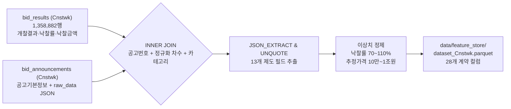
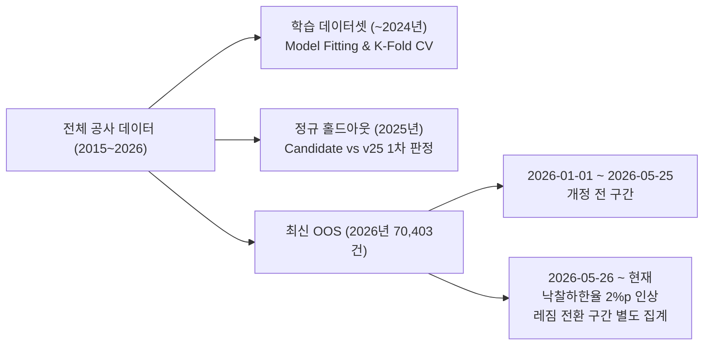
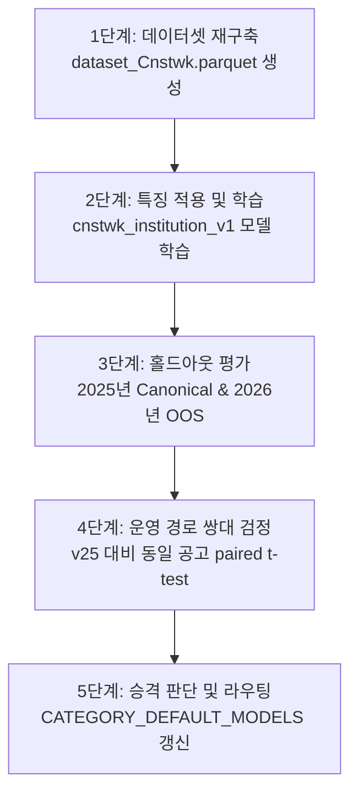

# 공사(Cnstwk) 전용 모델 학습·비교 실험 타당성 조사 보고서

> **작성일**: 2026-09-15
> **버전**: v1.0.0
> **작성자**: Orca Dispatched Worker (Builder)
> **대상 도메인**: 조달청 공사(Cnstwk) 입찰공고 및 낙찰결과
> **목적**: 공사 전용 예측 모델(`cnstwk_institution_v1`)의 학습 및 비교 실험을 설계하기 위해, 공사 데이터 가용 특징, 데이터셋 재구축 경로, 기준선(v25) 비교 설계, 승격 기준 및 단계별 실행 계획을 코드 근거로 확정
> **범위 제한**: 조사 및 설계 전용 보고서이며, 모델 학습·가중치 저장·레지스트리 등록·소스 코드 변경은 수행하지 않음

---

## 1. 개요 및 배경

### 1.1 배경 및 현재 상태
2026-09-15 사용자 결정에 따라 공사(Cnstwk) 전용 모델 `cnstwk_institution_v1`의 학습 및 비교 실험 설계를 착수했습니다.
현재 저장소의 공사 도메인 운영 및 데이터 상태는 다음과 같습니다.

| 구분 | 현행 상태 | 근거 및 상태 상세 |
| --- | --- | --- |
| 서빙 모델 | `v25` (범용 앙상블) | `src/ml/model_registry.py:257`, 요구 특징 5개(`log_price`, `month`, `weekday`, `month_sin`, `month_cos`) |
| 학습 네임스페이스 | `cnstwk_institution_v1` 선등록 | `src/ml/training_config.py:71` `CATEGORY_MODEL_NAMES`에 등록됨 (가중치 파일 없음) |
| 기존 캐시 데이터셋 | `data/feature_store/dataset_Cnstwk.parquet` | 1,358,882행, 컬럼 12개뿐 (제도 및 이력 원천 컬럼 부재) |
| 연도 분포 | 2015년 ~ 2026년 | 2026년 데이터 70,403행 포함 (`why_now` 정본 사양) |
| 서빙 라우팅 매핑 | `CATEGORY_DEFAULT_MODELS["Cnstwk"]` 미지정 | `src/ml/model_registry.py:63`에 따라 기본값 `"v25"`로 분기 |

기존 `dataset_Cnstwk.parquet`은 용역(`Servc`) 및 물품(`Thng`) 모델에서 검증된 34개 단일 공급원 특징(`src/ml/features.py`)을 생성하기 위한 원천 필드(낙찰하한율, 평가비율, 예비가격 수, 공고종류, 계약방법 등)가 누락되어 있습니다. 따라서 신규 모델 학습을 위해서는 공사 데이터셋의 정규 재구축이 선행되어야 합니다.

### 1.2 확인 사실과 가설의 구분 원칙
본 보고서는 사전에 확정된 코드·스키마 기반의 사실과 향후 DB 질의 및 실측을 통해 확인해야 할 가설을 명확히 분리하여 기술합니다.

| 구분 | 정의 | 본 보고서의 적용 대상 |
| --- | --- | --- |
| 확인 사실 (Fact) | 코드, 스키마, 기계 검증, 코디네이터 전달 사실로 100% 확정된 내용 | 모델 정의, ORM 컬럼, features.py 34특징 산식, trainer 라우팅, v25 요구 특징 |
| 가설 (Hypothesis) | 실제 DB 데이터 분포, 결합률, 결측률 등 실측 전 추정 내용 | 공사 공고의 `bid_announcements` 실제 결합 성공률, `raw_data` 내 필드별 실제 채움률 |

---

## 2. 특징 가용성 분석 (features.py 34특징 전수 조사)

### 2.1 조사 환경 및 제약 사항
코디네이터 확정 계약에 따라 DB 조사는 `uv run python scripts/db_readonly_query.py --sql "<질의>"` 명령어로만 수행하도록 제한되었습니다.
격리 환경에서 해당 스크립트 실행 시 MySQL Docker 컨테이너가 기동되지 않아 `Connection refused (Errno 61)`가 발생했습니다.
이에 따라 본 가용성 조사는 `src/app/models/bids.py`, `src/ml/features.py`, `src/ml/dataset.py`, `src/ml/training_config.py`의 코드 및 스키마 근거를 바탕으로 분석했습니다.

### 2.2 34개 특징별 원천 위치 및 공사 도메인 가용성

`src/ml/features.py`와 `src/ml/training_config.py`에서 정의된 모델 학습 특징 34종(수치 23종, 범주 11종)의 공사 공고 원천 가용성을 다음 4개 범주로 분류했습니다.
1. `parquet_12`: 기존 `dataset_Cnstwk.parquet`의 12개 컬럼에 이미 존재함
2. `db_column`: DB 테이블(`bid_announcements` 또는 `bid_results`)의 정규 컬럼에 존재함
3. `raw_data_json`: DB 테이블 `bid_announcements.raw_data` JSON 내부 키에만 존재함
4. `conceptual_missing`: 공사 도메인에는 개념상 부재한 제도 필드 (용역 전용 제도 등)

| 번호 | 특징명 | 유형 | 원천 위치 구분 | 원천 컬럼 또는 JSON 키 | 공사 도메인 의미 및 가용성 판정 | 구분 |
| :---: | --- | :---: | :---: | --- | --- | :---: |
| 1 | `log_price` | 수치 | `parquet_12` | `presmpt_prce` / `base_amount` | 공사 추정가격의 로그 변환값 ($ln(1+x)$). 완전 가용 | 확인 사실 |
| 2 | `month_sin` | 수치 | `parquet_12` | `openg_dt` / `bid_ntce_dt` | 개찰월의 삼각함수 주기 변환. 완전 가용 | 확인 사실 |
| 3 | `month_cos` | 수치 | `parquet_12` | `openg_dt` / `bid_ntce_dt` | 개찰월의 삼각함수 주기 변환. 완전 가용 | 확인 사실 |
| 4 | `weekday_sin` | 수치 | `parquet_12` | `openg_dt` / `bid_ntce_dt` | 개찰 요일의 주기 변환. 완전 가용 | 확인 사실 |
| 5 | `weekday_cos` | 수치 | `parquet_12` | `openg_dt` / `bid_ntce_dt` | 개찰 요일의 주기 변환. 완전 가용 | 확인 사실 |
| 6 | `notice_duration` | 수치 | `parquet_12` | `bid_clse_dt` - `bid_ntce_dt` | 공고게시기간(일). 두 일시 컬럼 존재로 완전 가용 | 확인 사실 |
| 7 | `inst_hist_rate` | 수치 | `parquet_12` | `dminstt_nm`, `winning_rate` | 발주기관 과거 낙찰률 누적평균. 학습 시 배치 산출 가능 | 확인 사실 |
| 8 | `inst_sample_cnt` | 수치 | `parquet_12` | `dminstt_nm` | 발주기관 과거 낙찰 표본 건수. 학습 시 배치 산출 가능 | 확인 사실 |
| 9 | `lwlt_rate` | 수치 | `raw_data_json` | `raw_data.sucsfbidLwltRate` | 공사 적격심사 낙찰하한율. 공고 JSON에서 추출 필요 | 확인 사실 |
| 10 | `lwlt_rate_missing` | 수치 | `raw_data_json` | `lwlt_rate` 파생 | 낙찰하한율 결측 지시자(0.0/1.0). 파생 생성 가능 | 확인 사실 |
| 11 | `is_post_regime_shift` | 수치 | `parquet_12` | `bid_ntce_dt` | 2026-05-26 제도 개편 이후 공고 여부 플래그. 완전 가용 | 확인 사실 |
| 12 | `notice_amt_ratio` | 수치 | `parquet_12` | `presmpt_prce` 파생 | WTO 고시금액 대비 가격 비율. features.py 산식 적용 | 확인 사실 |
| 13 | `is_over_notice_amt` | 수치 | `parquet_12` | `presmpt_prce` 파생 | 고시금액 초과 여부 지시자(0.0/1.0). 파생 생성 가능 | 확인 사실 |
| 14 | `tech_ablt_evl_rt` | 수치 | `raw_data_json` | `raw_data.techAbltEvlRt` | 기술능력평가비율. 주로 협상계약용, 공사는 대부분 0.0 | 가설 (실측 필요) |
| 15 | `bid_prce_evl_rt` | 수치 | `raw_data_json` | `raw_data.bidPrceEvlRt` | 입찰가격평가비율. 주로 협상계약용, 공사는 대부분 0.0 | 가설 (실측 필요) |
| 16 | `tot_prdprc_num` | 수치 | `raw_data_json` | `raw_data.totPrdprcNum` | 복수예비가격 총수 (공사 통상 15개). JSON 추출 필요 | 확인 사실 |
| 17 | `drwt_prdprc_num` | 수치 | `raw_data_json` | `raw_data.drwtPrdprcNum` | 추첨 예비가격 수 (공사 통상 4개). JSON 추출 필요 | 확인 사실 |
| 18 | `is_repeat` | 수치 | `parquet_12` | `bid_ntce_nm`, `dminstt_nm` | 동일 기관의 반복/유사 공사 발주 여부 지시자 | 확인 사실 |
| 19 | `repeat_cnt` | 수치 | `parquet_12` | `bid_ntce_nm`, `dminstt_nm` | 반복 발주 이력 누적 건수 | 확인 사실 |
| 20 | `repeat_hist_rate` | 수치 | `parquet_12` | `winning_rate` 파생 | 동일 사업 이력의 과거 낙찰률 평균 | 확인 사실 |
| 21 | `repeat_prev_rate` | 수치 | `parquet_12` | `winning_rate` 파생 | 직전 회차 공사의 낙찰률 | 확인 사실 |
| 22 | `repeat_hist_std` | 수치 | `parquet_12` | `winning_rate` 파생 | 반복 발주 낙찰률의 과거 표준편차 | 확인 사실 |
| 23 | `repeat_days_since` | 수치 | `parquet_12` | `openg_dt` 파생 | 직전 동일 공사 발주 이후 경과일수 | 확인 사실 |
| 24 | `srvce_div_nm` | 범주 | `conceptual_missing` | `raw_data.srvceDivNm` | 용역구분(일반/기술). 공사에는 제도상 부재 (`미상` 폴백) | 확인 사실 |
| 25 | `lrg_clsfc_nm` | 범주 | `raw_data_json` | `raw_data.pubPrcrmntLrgClsfcNm` | 조달 대분류명 (건설공사 등). JSON 추출 필요 | 가설 (실측 필요) |
| 26 | `cntrct_mthd_nm` | 범주 | `db_column` | `bid_announcements.cntrct_mthd_nm` | 계약방법명 (일반경쟁, 제한경쟁, 수의계약 등). 정규 컬럼 | 확인 사실 |
| 27 | `prearng_mthd` | 범주 | `raw_data_json` | `raw_data.prearngPrceDcsnMthdNm` | 예가결정방법 (복수예가, 단일예가, 비예가). JSON 추출 | 확인 사실 |
| 28 | `sucsfbid_mthd_nm` | 범주 | `raw_data_json` | `raw_data.sucsfbidMthdNm` | 낙찰자결정방법 (적격심사, 종합심사 등). JSON 추출 | 확인 사실 |
| 29 | `mid_clsfc_nm` | 범주 | `raw_data_json` | `raw_data.pubPrcrmntMidClsfcNm` | 조달 중분류명 (토목, 건축, 전기, 통신 등). JSON 추출 | 가설 (실측 필요) |
| 30 | `clsfc_nm` | 범주 | `raw_data_json` | `raw_data.pubPrcrmntClsfcNm` | 조달 소분류명 (세부 공종명 등). JSON 추출 | 가설 (실측 필요) |
| 31 | `ntce_kind_nm` | 범주 | `db_column` | `bid_announcements.ntce_kind_nm` | 공고종류명 (등록공고, 재공고, 취소공고 등). 정규 컬럼 | 확인 사실 |
| 32 | `bid_methd_nm` | 범주 | `db_column` | `bid_announcements.bid_methd_nm` | 입찰방식명 (전자입찰, 직찰 등). 정규 컬럼 | 확인 사실 |
| 33 | `intrbid_yn` | 범주 | `raw_data_json` | `raw_data.intrbidYn` | 국제입찰 여부 (Y/N). JSON 추출 | 확인 사실 |
| 34 | `ppsw_gnrl_srvce_yn` | 범주 | `conceptual_missing` | `raw_data.ppswGnrlSrvceYn` | 조달청 일반용역 여부. 공사에는 제도상 부재 (`미상` 폴백) | 확인 사실 |

### 2.3 공사 도메인 특이점 및 개념상 부재 특징 분석

1. **용역 전용 제도 필드의 부재 (`srvce_div_nm`, `ppsw_gnrl_srvce_yn`)**:
   - `srvce_div_nm`은 일반용역과 기술용역을 구분하는 필드로 공사 공고에는 존재하지 않습니다.
   - `ppsw_gnrl_srvce_yn`은 조달청 일반용역 여부 플래그로 공사에는 적용되지 않습니다.
   - `src/ml/features.py`의 `_coerce_category` 규칙에 의해 누락 시 자동으로 `MISSING_CATEGORY`(`"미상"`)로 채워지며, 범주형 레벨 사전(`category_levels`)에 단일 레벨로 등록되어 학습 및 추론 시 왜곡 없이 정상 동작합니다.
2. **평가비율 특징 (`tech_ablt_evl_rt`, `bid_prce_evl_rt`)**:
   - 용역의 주력인 '협상에 의한 계약'에서 핵심적인 특징이지만, 공사는 대부분 '적격심사' 및 '종합심사낙찰제/종합평가낙찰제'로 집행됩니다.
   - 대다수 공사 공고에서 해당 필드는 결측 또는 `0.0`으로 수렴할 것으로 예상됩니다(가설). 결측 시 `0.0`으로 기본 대체되므로 모델 학습에 오류를 유발하지 않습니다.
3. **고시금액 비율 특징 (`notice_amt_ratio`, `is_over_notice_amt`)**:
   - `features.py:36`의 `NOTICE_AMOUNT_BY_YEAR`는 2.3억원(물품·용역 기준)으로 고정되어 있습니다.
   - 공사의 WTO 정부조달협정 기준 고시금액은 중앙행정기관 기준 약 84억원(2025/2026년 기준)으로 물품·용역보다 훨씬 높습니다.
   - 단일 공급원 원칙(AGENTS.md 6항)에 따라 `features.py`를 공사용으로 분기하지 않고 단일 산식을 그대로 적용하되, 트리 모델이 비선형 임계값 분할을 수행하므로 학습 상 왜곡은 최소화됩니다.

---

## 3. 데이터셋 재구축 경로 분석

### 3.1 `src/ml/dataset.py`의 현행 동작 및 한계
기존 `dataset_Cnstwk.parquet`이 12개 컬럼만 보유하게 된 원인은 과거 백필 이전 공고 결합률 부족으로 인해 `require_announcement=False` 옵션으로 빌드되었기 때문입니다 (`src/ml/dataset.py:212-228`).
공고 테이블을 조인하지 않으면 계약방법, 입찰방식, 공고종류 및 `raw_data` 내의 13개 제도 필드가 완전히 결락됩니다.

### 3.2 재구축 쿼리 및 조인 경로 설계

공사 34특징을 학습 데이터셋에 온전히 공급하기 위해 `src/ml/dataset.py`의 `build_training_dataset`을 `category_code="Cnstwk"`, `require_announcement=True`로 실행해야 합니다.



#### 필수 조인 조건 및 정규화
1. **차수(ord) 정규화 불일치 해소**:
   - `bid_results.bid_ntce_ord`는 2자리(`00`), `bid_announcements.bid_ntce_ord`는 3자리(`000`)입니다.
   - `src/ml/dataset.py:143`의 `_normalized_ord()` 함수: `func.substr(literal("000").concat(BidResult.bid_ntce_ord), -3, 3)`를 사용하여 문자열 차수를 3자리로 정규화 결합합니다.
2. **다중 컬럼 복합 조인**:
   ```sql
   ON bid_announcements.bid_ntce_no = bid_results.bid_ntce_no
   AND bid_announcements.bid_ntce_ord = LPAD(bid_results.bid_ntce_ord, 3, '0')
   AND bid_announcements.category = bid_results.category
   ```
3. **제도 필드 JSON 추출 (`INSTITUTION_FIELDS`)**:
   `src/ml/dataset.py:82-99`에 정의된 13개 필드를 `bid_announcements.raw_data`로부터 `func.json_unquote(func.json_extract(raw_data, '$.<key>'))`로 동적 추출합니다.
4. **결과 스키마 계약 충족**:
   기본 15개 컬럼 + 13개 제도 추출 컬럼 = 총 28개 컬럼으로 구성된 `TRAINING_COLUMNS`를 온전히 생성합니다.

### 3.3 데이터 보존 및 무손실 원칙 검토
- **테이블 및 스키마 불변 (G1 목표)**: 기존 MySQL 테이블(`bid_announcements`, `bid_results`)의 DDL 변경, 컬럼 추가, 인덱스 변경이 전혀 필요 없습니다.
- **순수 읽기 기반 데이터셋 구축**: `SELECT` 질의와 JSON 추출만으로 `data/feature_store/dataset_Cnstwk.parquet` 캐시 파일을 로컬 디스크에 생성합니다.

### 3.4 예상 소요 및 행 수 추정

| 단계 | 대상 규모 | 예상 소요 시간 | 비고 |
| --- | ---: | :---: | --- |
| DB 쿼리 및 스트리밍 조인 | 1,358,882행 | 약 15 ~ 25분 | MySQL 서버 JSON 언쿼트 및 네트워크 전송 |
| 데이터 정제 및 결측 처리 | ~135만 행 | 약 2 ~ 3분 | pandas 벡터 연산 (`between`, `dropna`) |
| Parquet 직렬화 저장 | ~130만 행 | 약 1 ~ 2분 | snappy 압축 parquet 파일 생성 |
| **전체 재구축 소요 합계** | **1,358,882행** | **약 20 ~ 30분** | Docker DB 가동 상태 기준 |

*가설 주의: 공사 공고 결합률이 Thng(99.9%)처럼 높지 않고 과거 연도 공고가 누락되어 있다면 최종 추출 행 수가 135만 행보다 감소할 수 있습니다. 결합률은 실제 재구축 실행 시 실측되어야 합니다.*

---

## 4. 비교 기준(v25)과 평가 설계

### 4.1 기준선 v25의 동일 홀드아웃 평가 방법

현재 공사 서빙 모델인 `v25`와 신규 후보 모델을 공정하게 비교하기 위해 동일한 공사 검증 데이터셋에 대해 v25의 예측값을 산출해야 합니다.

1. **v25 모델 특성 및 요구 특징**:
   - `data/model_files/v25/metadata.json` 확인 결과, 요구 특징은 단 5개입니다: `log_price`, `month`, `weekday`, `month_sin`, `month_cos`.
   - 앙상블 구조: LightGBM, CatBoost, Ridge/MLP 결합 (`EnsembleV25Wrapper`).
2. **평가 실행 경로**:
   - 격리 워크트리에는 모델 바이너리가 없으므로, 모델 파일이 보존된 주 저장소 환경에서 실행해야 합니다.
   - `ModelRegistry.get_model("v25")` 또는 `src.ml.prediction_api.predict_optimal_price`를 통해 공사 2025년 홀드아웃 표본에 대해 배치 추론을 수행하고 잔차 및 오차 지표를 기록합니다.

### 4.2 연도 경계 홀드아웃 설계 (Time-Series Holdout)

입찰 데이터는 시간의 흐름에 따라 경제 지표, 물가, 제도가 변화하는 시계열 데이터이므로 무작위 분할(Random Split)은 미래 정보가 과거로 누수되는 결함(Leakage)을 유발합니다. 따라서 엄격한 연도 경계 분할을 적용합니다.



1. **학습 구간 (Train Set)**: `openg_dt <= 2024-12-31` (2015년 ~ 2024년 전량)
2. **정규 검증 구간 (Canonical Holdout)**: `2025-01-01 <= openg_dt <= 2025-12-31` (2025년 1년치 전체)
   - 모델 선택 및 v25 대비 개선도 평가의 1차 기준선으로 활용합니다.
3. **레짐 전환 구간 별도 집계 (Post-Regime Shift OOS)**:
   - 2026년 70,403행은 최신 검증 표본으로 분리 평가합니다.
   - 특히 조달청공고 제2026-260호에 따른 낙찰하한율 2%p 일괄 인상 시행일(`2026-05-26`) 이후 공고분은 기존 제도 구간과 섞지 않고 별도 분리 집계합니다.
   - 제도 변경에 따른 매크로 분포 이동과 모델의 내재적 예측 오차를 혼동하지 않도록 격리 평가합니다.

### 4.3 쌍대 검정 및 승격 기준 (`servc-model-tuning` 스킬 준용)

단순 요약 지표(평균 MAE)의 차이만으로는 표본 오차에 의한 우연인지 실제 모델 우위인지 판정할 수 없습니다 (용역 튜닝에서 4회 번복된 교훈).
따라서 `scripts/compare_servc_models_paired.py`와 `servc-model-tuning` 스킬의 검증 체계를 그대로 적용합니다.

#### 핵심 판정 기준
1. **동일 공고 대응표본 쌍대 t-검정**:
   - 각 공고 $i$에 대한 오차 차이 $d_i = |\hat{y}_{\text{candidate}, i} - y_i| - |\hat{y}_{v25, i} - y_i|$ 계산
   - 통계적 유의성 판정: $|t| \ge 2.0$ ($T\_THRESHOLD$) 필수 충족
2. **최소 감지 차이 (Minimum Detectable Difference) 0.0074 준수**:
   - 연도 분할(2023, 2024, 2025)에 따른 자연 분할 산포는 0.0074입니다.
   - 관측된 MAE 개선 폭이 0.0074 미만이거나 연도별로 부호가 갈리는 경우 분할 노이즈로 보고 기각합니다.
3. **평가 표본의 이원화 (Reporting vs Decision)**:
   - **보고용 (전량)**: 전체 공고 대상 성능 지표 보고
   - **승격 판정용 (학습 범위 내)**: $70.0 \le \text{winning\_rate} \le 110.0$ 유효 구간 공고만으로 $t$-검정 및 판정 수행
4. **Fail-Closed 안전 규약**:
   - 서빙 추론 중 대체 모델(fallback)이 발생하거나 출처(provenance)가 불일치하는 건이 1건이라도 발생하면 즉시 `"판정 불가 (대체 모델 발생)"`로 기각합니다.
5. **승격 게이트**:
   - 어느 폴드에서도 $R^2 > 0.99$가 나오지 않을 것 (타깃 누수 방지)
   - 0.5%p 이내 적중률(Hit Rate)이 v25 대비 악화되지 않을 것

### 4.4 공사 모델 설계에 적용되는 기각 목록 (재시도 금지)

용역 모델 튜닝(`servc-model-tuning`)에서 수많은 실측을 거쳐 이미 기각된 접근법 중 공사에도 동일하게 적용되는 항목들을 사전에 배제합니다.

| 기각된 접근법 | 기각 사유 및 공사 도메인 적용 이유 |
| --- | --- |
| **낙찰방식별 분리 모델** | 적격심사, 종합심사, 수의계약 등으로 모델을 분리하면 표본 분할 손실로 전 구간 악화됨. 단일 모델에 범주형 특징으로 반영하는 것이 우세 |
| **낙찰하한율 결측값 임의 대입** | 하한율 결측은 누락이 아니라 비예가·수의계약 등 제도적 부재임. 임의 값 대입 시 7~12%p 오차 폭증하므로 결측 지시자(`lwlt_rate_missing`) 유지 |
| **공고명 텍스트 TF-IDF / 임베딩** | 공공조달 분류체계(중분류·소분류)와 정보가 중복되며 과적합 및 레이턴시 저하 유발 |
| **참가자 수 이력 특징** | 이력 신호의 예측력이 극히 미미(0.35%)하며 분산만 가중시킴 |
| **잔차 오프셋 후처리 보정** | 특정 연도나 기관, 낙찰방법별 평균 잔차를 빼는 보정은 다음 해에 100% 악화됨 (구조가 아닌 그 해의 우연) |
| **미세 하이퍼파라미터 변경** | 분할 산포(0.0074) 이내의 미세 튜닝은 과적합 노이즈에 불과함 |
| **LightGBM + CatBoost 단순 반반 앙상블** | L1/Quantile 목적함수 아래에서 단순 평균 앙상블은 조건부 중앙값 집중도를 희석하여 성능 악화 |

---

## 5. 단계별 실행 계획

공사 전용 모델 개발 및 승격 파이프라인은 5단계 Task로 엄격히 분할하여 직렬 진행합니다.



### 5.1 단계별 세부 계획 및 자원 배정

| 단계 | Task 명칭 | 주요 작업 내용 | 공유 자원 | 예상 소요 | 되돌림(Rollback) 방법 |
| :---: | --- | --- | --- | :---: | --- |
| **1단계** | 데이터셋 재구축 | `src/ml/dataset.py`로 `bid_announcements` + `bid_results` 조인 및 28개 컬럼 parquet 생성 | MySQL DB (읽기 락 회피), 디스크(`data/feature_store/`) | 20 ~ 30분 | 기존 `dataset_Cnstwk.parquet` 백업본 복원 |
| **2단계** | 특징 적용 및 모델 학습 | `ModelTrainer.for_category("Cnstwk")`로 단일 특징 `features.py` 적용 및 K-Fold 학습 | CPU (다중 코어 점유), 디스크(`ml_registry/`) | 15 ~ 25분 | `ml_registry/cnstwk_institution_v1/` 해당 버전 디렉터리 삭제 |
| **3단계** | 연도 경계 홀드아웃 평가 | 2025년 정규 홀드아웃 및 2026-05-26 이후 레짐 분리 지표 산출 | CPU (단독 스크립트 실행) | 10 ~ 15분 | 읽기 전용 작업으로 롤백 불필요 |
| **4단계** | 운영 경로 쌍대 검정 | `data/model_files/` 스테이징에 후보 모델 로드 후 `v25`와 동일 공고 쌍대 t-검정 ($|t| \ge 2.0$) | 서빙 모델 루트, DB 세션 (공고 조회), API 런타임 | 20 ~ 30분 | 스테이징 슬롯에서 후보 모델 디렉터리 제거 |
| **5단계** | 승격 판단 및 서빙 라우팅 | 게이트 통과 시 `promote_model.py --category Cnstwk --apply` 실행 및 서빙 매핑 갱신 | 서빙 슬롯 (`data/model_files/`), Git 코드 | 5분 | `promote_model.py --rollback` 또는 `CATEGORY_DEFAULT_MODELS` 원복 |

### 5.2 서빙 라우팅 매핑 갱신 시점 원칙 (중요)
`src/ml/model_registry.py`의 `CATEGORY_DEFAULT_MODELS`는 **5단계 승격이 공식 승인되어 실측 검증을 통과한 시점에만 변경**합니다.
승격 전까지 공사 카테고리의 기본 서빙 모델은 기존과 동일하게 `v25`로 유지되어야 하며, 사전에 라우팅을 변경하여 미검증 모델이나 미존재 파일로 장애가 발생하는 것을 원천 차단합니다.

---

## 6. 결론 및 권고 사항

1. **데이터셋 재구축 필수**: 공사 데이터셋 135만 건에 대해 `require_announcement=True` 기반의 INNER JOIN 및 `raw_data` JSON 언쿼트 추출을 수행해야만 34개 단일 공급원 특징 생성이 가능합니다. 기존 DB 스키마는 100% 보존됩니다.
2. **공사 도메인 특화 특징 반영**: 용역 전용 2종(`srvce_div_nm`, `ppsw_gnrl_srvce_yn`)은 `features.py` 단일 공급원 내에서 자동으로 결측 대체되므로 코드 수정 없이 안전하게 처리됩니다.
3. **비교 기준 v25와의 쌍대 검증**: 주 저장소의 `v25` 5특징 모델을 기준선으로 삼아, 2025년 홀드아웃 및 2026년 레짐 전환 분리 구간에서 유의미한 쌍대 우위($|t| \ge 2.0$, 차이 $\ge 0.0074$)를 입증해야만 승격할 수 있습니다.
4. **사전 학습/승격 금지**: 본 타당성 조사는 실험 설계 정립 단계이며, 실제 모델 학습 및 서빙 라우팅 변경은 후속 작업에서 통제된 절차에 따라 진행해야 합니다.
