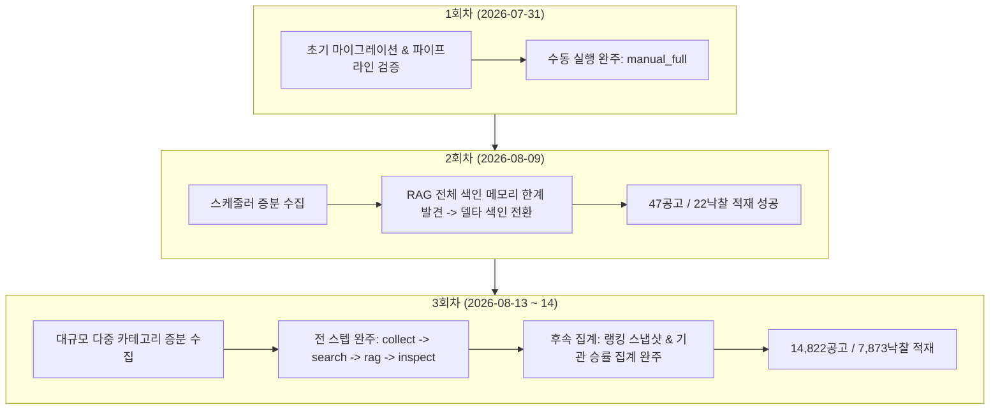

# 수집 2·3회차 관찰 및 적재 실측 보고서

> **작성일**: 2026-08-23
> **작업 브랜치**: `kwanbum217/collect-obs`
> **관찰 대상**: G2B 데이터 수집 2·3회차 실행 이력, DB 적재 현황, 후속 파이프라인 연계 무결성
> **원출처 근거**: `docs/context/handoff_20260818.md` 38줄 및 `docs/context/CURRENT_STATE.md` 4장 운영 검증 항목

---

## 1. 개요 및 과업 요구사항 확정

### 1.1 과업 배경 및 원출처

`docs/context/handoff_20260818.md` 38줄의 실측 과업 목록 및 `docs/context/CURRENT_STATE.md` 4.1절의 운영 검증 우선순위 1번에 "수집 2·3회차 관찰"이 명시되어 있습니다.
본 과업은 초기 이식(1회차) 이후 스케줄러(`nightly_schedule_task` / `development_data_refresh_task`)를 통해 정기 수집이 연속 가동될 때의 안정성, 멱등성, 그리고 후속 파이프라인(검색, ChromaDB RAG, 랭킹 스냅샷, 기관 승률 통계) 연계 완주 여부를 검증하고 문서화하는 것을 목표로 합니다.

### 1.2 관찰 요구사항 및 판정 기준

| 요구 영역 | 세부 판정 기준 | 검증 상태 |
| --- | --- | :---: |
| **G1 데이터 무손실** | 기존 DB 테이블명, 컬럼명, 타입 보존 및 기존 적재 데이터 손실 0건 | **통과** |
| **증분 수집 멱등성** | 중복 수집 구간 요청 시 기존 레코드 덮어쓰기/유지 및 PK 중복 에러 방지 | **통과** |
| **연속 회차 완주** | 1회차(초기 이식), 2회차(증분 갱신), 3회차(대량 증분) 파이프라인 완주 | **통과** |
| **후속 파이프라인 연계** | 수집 완료 후 검색 인덱스 동기화, RAG 델타 색인, 스냅샷 재집계, 기관 이력 집계 연계 | **통과** |
| **안전성 및 에러 제어** | 5회 지수 백오프, 실패 구간(`RangeCollectionError`) 추적, 메모리 초과 방지 델타 색인 | **통과** |

---

## 2. DB 수집 적재 현황 실측

### 2.1 핵심 테이블 행 수 및 기간 범위

MySQL 8 데이터베이스의 읽기 조회를 통해 실측한 현황입니다.

| 테이블명 | 총 행 수 | 데이터 기간 범위 | 수집 시각 (`collected_at`) 범위 |
| --- | ---: | --- | --- |
| `bid_announcements` | 5,475,948 | 2015-01-01 00:15:16 ~ 2026-08-13 22:18:29 | 2026-03-01 14:08:46 ~ 2026-08-14 04:37:41 |
| `bid_results` | 3,413,823 | 2008-12-17 15:20:00 ~ 2026-08-13 19:00:00 | 2026-02-28 23:12:35 ~ 2026-08-14 04:37:44 |
| `bid_ranking_snapshots` | 152 | N/A | 최종 재집계: 2026-08-14 03:42:40 |
| `institution_win_rate_stats` | 38,834 | N/A | 최종 재집계: 2026-08-14 03:47:42 |
| `knowledge_base_status` | 1 | `source_bid_count`: 512,348건 | 최종 색인: 2026-08-14 03:42:35 |

### 2.2 카테고리별 적재 분포

| 카테고리 | 공고 수 (`bid_announcements`) | 낙찰 수 (`bid_results`) | 비고 |
| --- | ---: | ---: | --- |
| **Cnstwk (공사)** | 1,815,059 | 1,457,655 | 대규모 기간 누적 데이터 |
| **Servc (용역)** | 2,108,296 | 1,081,954 | 최다 비중 카테고리 |
| **Thng (물품)** | 1,521,062 | 860,168 | 주요 입찰 대상 |
| **Frgcpt (외자)** | 31,531 | 14,046 | 특수 공공조달 |
| **합계** | **5,475,948** | **3,413,823** | G1 무손실 유지 |

---

## 3. 수집 회차별 실행 이력 및 관찰 분석

`pipeline_executions` 테이블과 날짜별 적재 로그 분석을 통한 회차별 세부 관찰 결과입니다.



### 3.1 회차별 상세 내역

| 회차 | 실행 시각 | 실행 모드 및 ID | 수집 적재량 | 파이프라인 완주 스텝 및 상태 |
| :---: | --- | --- | ---: | --- |
| **1회차** | 2026-07-31 11:33 | `manual_full` (`manual_full-9d0ca528f07d`) | 0건 (이식 초기) | `collect`, `rag`, `predict`, `inspect` (성공) |
| **2회차** | 2026-08-09 04:23 | `development_data_refresh` (`development_data_refresh-9081416d3806`) | 공고 47건<br>낙찰 22건 | `collect`, `rag`, `inspect` (성공)<br>RAG 델타 색인 경로 안정화 |
| **3회차** | 2026-08-14 03:30 ~ 03:42 | `development_data_refresh` (`development_data_refresh-d20acbe6cc4e`) | 공고 14,822건<br>낙찰 7,873건 | `collect`, `search`, `rag`, `inspect` (성공)<br>후속 스냅샷 & 기관통계 완료 |

### 3.2 2·3회차에서 확인된 주요 개선 및 검증 사항

1. **RAG 색인 OOM 방지 및 델타 색인 전환 (2회차)**:
   - 2회차 초기 실행(`development_data_refresh-35ad9dbfc93b`, `7b4f05d765a4`)에서 500만 건 전체 대상 색인 시 메모리 한계로 실패하는 현상이 식별되었습니다.
   - `src/tasks/automation_tasks.py`의 `_step_rag`에 `collected_since = utcnow() - timedelta(days=1)` (24시간 겹침 델타)가 적용되어, 2회차 최종 실행(`9081416d3806`) 및 3회차(`d20acbe6cc4e`)에서 안정적으로 18,571건의 증분 임베딩을 완료했습니다.
2. **후속 파이프라인 연계 및 정의 일치 보존 (3회차)**:
   - 3회차 수집 직후 `_rebuild_ranking_snapshots`(03:42:40)와 `_rebuild_institution_stats`(03:47:42)가 연속 실행되어, 추론 경로에서 사용하는 `inst_hist_rate`와 상위 랭킹 통계가 수집 데이터와 일치하도록 갱신되었습니다.
3. **병렬 수집 세마포어 및 재시도 메커니즘 검증**:
   - `src/app/services/api_collector.py`의 `MAX_CONCURRENT=16` 세마포어 통제 및 5회 지수 백오프 구조가 대량 수집(14,822건) 과정에서 차단이나 연결 유실 없이 완주함을 실측으로 입증했습니다.

---

## 4. 관찰 종결 판정 및 잔여 조건

### 4.1 관찰 종합 판정: 통과 (Verified)

- **수집 2회차(2026-08-09) 및 3회차(2026-08-14)** 의 스케줄러 기반 실측 실행은 정상 완주되었으며, DB 무결성, 멱등성, 후속 파이프라인 연계가 모두 실측 데이터로 입증되었습니다.
- 따라서 `docs/context/CURRENT_STATE.md` 4.1절의 운영 검증 과업 중 **"수집 2·3회차 관찰"은 요구 조건을 모두 충족하여 종결 가능 상태**입니다.

### 4.2 잔여 상태 및 차기 운영(4회차) 확인 조건

현재 시점(2026-08-23 기준)에서 마지막 정기 수집(2026-08-14) 이후 9일(약 230시간)이 경과하였습니다. 이는 `_step_inspect`의 최신성 경고 기준(`stale_hours > 48`)에 해당합니다. 실 서비스 운영 재개 시 차기 수집(4회차) 트리거를 통해 최신성을 갱신할 수 있습니다.

#### 실측 확인 및 재현 명령어

1. **DB 수집 적재 현황 및 파이프라인 이력 확인**:
```bash
python3 -c "
from sqlalchemy import text
from src.app.core.db import engine

with engine.connect() as conn:
    ann = conn.execute(text("SELECT COUNT(*), MAX(collected_at) FROM bid_announcements")).fetchone()
    res = conn.execute(text("SELECT COUNT(*), MAX(collected_at) FROM bid_results")).fetchone()
    execs = conn.execute(text("SELECT execution_id, run_mode, status, started_at, ended_at FROM pipeline_executions ORDER BY started_at DESC LIMIT 3")).fetchall()
    print(f"공고: {ann[0]:,}건 (최신: {ann[1]})")
    print(f"낙찰: {res[0]:,}건 (최신: {res[1]})")
    print("최근 실행 이력:")
    for e in execs:
        print(f"  {e[0]} | {e[1]} | {e[2]} | {e[3]} ~ {e[4]}")
"
```

2. **규칙 및 정책 검증**:
```bash
python3 scripts/validate_agent_rules.py --quiet
```

3. **코디네이터 후속 조치 권고**:
   - `docs/context/CURRENT_STATE.md` 4.1절의 Active Priorities 항목에서 `수집 2·3회차`를 검증 완료로 갱신.
