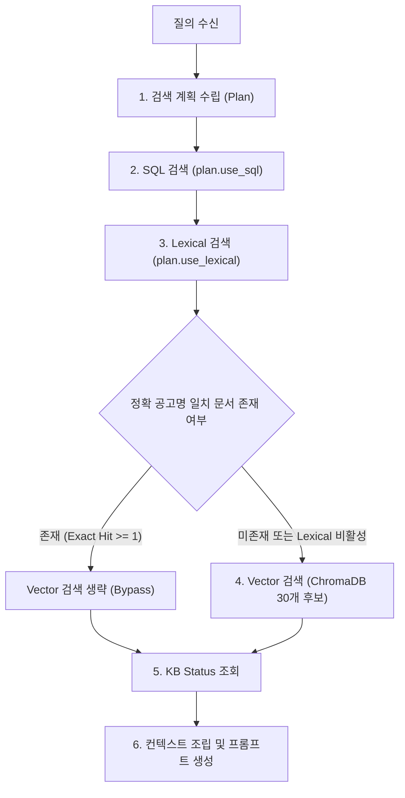

# Conditional Vector Bypass 설계 조사 보고서

> **작성일**: 2026-08-28
> **작성자**: Orca Worker (Role: investigator / Task: task_5c9b902db68f)
> **상태**: 조사 완료
> **목적**: 어휘(Lexical) 검색에서 정확 공고명 일치가 확보된 경우 ChromaDB 후보 풀 30 조회를 조건부로 생략 또는 축소하는 설계 타당성 및 회귀 방지 방안 수립

---

## 1. 현재 검색 실행 순서 및 코드 근거

현재 하이브리드 RAG 엔진의 컨텍스트 준비 함수(`HybridRAGEngine._prepare_context`, `src/rag/engine.py:740-908`)는 사용자 질의에 대해 계획을 수립한 후 고정된 순서로 검색 채널들을 순차 실행합니다.

### 1.1 검색 채널별 실행 순서 및 진입 조건

| 순서 | 검색 채널 | 진입 조건 (코드) | 참조 위치 | 주요 동작 및 비용 요인 |
| :--- | :--- | :--- | :--- | :--- |
| 1 | 계획 수립 (Plan) | 무조건 실행 | `src/rag/engine.py:750-752` | `build_retrieval_plan(user_query)` 호출하여 `RetrievalPlan` 생성 |
| 2 | SQL 정형 검색 | `if plan.use_sql and structured_data is None and db is not None:` | `src/rag/engine.py:758-761` | `retrieve_structured_data(db, plan)` 호출하여 MySQL 집계/조회 수행 |
| 3 | **Vector (ChromaDB)** | `if plan.use_vector and not vector_docs:` | `src/rag/engine.py:767-789` | `retrieve_semantic_context(plan)` 호출. ChromaDB에서 후보 30개를 조회하고 post-filter 및 정확 제목 재순위 수행 |
| 4 | **Lexical (Meilisearch)** | `if plan.use_lexical:` | `src/rag/engine.py:791-833` | `retrieve_lexical_context(plan, db=db)` 호출. 공고명 exact match 문서를 추출하여 Vector 결과 앞단에 합성 |
| 5 | KB Status 메타 조회 | `if plan.use_kb_status and kb_status is None and db is not None:` | `src/rag/engine.py:835-840` | `get_latest_kb_status_payload(db)` 호출하여 지식베이스 버전 확인 |
| 6 | 컨텍스트 합성 (Assembly) | 무조건 실행 | `src/rag/engine.py:842-875` | 근거 항목(`EvidenceItem`) 생성, 프롬프트 조립 및 구간별 지연시간 계측 |

### 1.2 현재 구조의 핵심 문제점

현재 코드 구조에서는 **Vector 검색(`src/rag/engine.py:767`)이 Lexical 어휘 검색(`src/rag/engine.py:791`)보다 먼저 실행**됩니다.
이로 인해 다음과 같은 비효율이 발생합니다:
1. Meilisearch 어휘 인덱스에 질의 공고명이 100% 완벽히 존재하여 1순위로 채택될 수 있음에도 불구하고, 사전에 ChromaDB에서 기본 30개의 후보군(`src/rag/vector_store.py:38`, `DEFAULT_CANDIDATE_POOL_SIZE = 30`)을 임베딩 질의로 가져와 파싱하는 고비용 I/O 연산이 무조건 선행됩니다.
2. 이후 Lexical 블록(`src/rag/engine.py:811-827`)에서 정확 일치 문서(`exact_lexical_matches`)가 추출되면, 이미 조회된 Vector 결과 문서(`vector_docs`)는 뒤로 밀리거나 잘려나가(`target_k` 제한) 사실상 버려집니다.
3. 실행 순서의 역전으로 인해, 어휘 채널의 적중 여부를 사전에 인지하여 벡터 검색을 건너뛰는(bypass) 제어가 원천적으로 불가능한 상태입니다.

---

## 2. Vector 생략 가능/불가 질의 유형 및 판정 기준

### 2.1 질의 유형별 Vector 생략 안전성 분류

| 질의 유형 | 대표 패턴 및 특징 | Vector 생략 안전성 | 사유 |
| :--- | :--- | :--- | :--- |
| **유형 A: 단일 공고 정확 질의 (Exact Single Notice)** | 특정 공고명 전체를 지목하여 낙찰업체, 낙찰금액, 공고번호, 낙찰률 등을 묻는 질의 | **생략 가능 (Bypass Safe)** | Meilisearch 어휘 검색에서 정규화 공고명 일치(`_normalize_match_key`)가 1건 이상 확보되면 ChromaDB 의미 검색 결과가 답변 생성에 전혀 기여하지 않음 |
| **유형 B: 유사/비교/문맥 질의 (Comparative & Semantic)** | "유사한 공고 찾아줘", "최근 공사와 비교", "어떤 위험이 있는가", "사례 분석" | **생략 불가 (Must Retain)** | 단순 키워드 일치가 아닌 의미적 임베딩 유사도 및 문맥 클러스터링이 필수적이므로 ChromaDB 벡터 검색이 반드시 유지되어야 함 |
| **유형 C: 정형 통계/목록 질의 (Structured Aggregation)** | "평균 낙찰률", "월별 공고 건수", "낙찰 목록 5개" | **이미 생략됨 (SQL 중심)** | `plan.use_sql=True, plan.use_vector=False`로 계획 수립되므로 벡터 검색을 타지 않음 (`src/rag/query_planning.py:381-383`) |
| **유형 D: 부재/미래/범위 외 거절 질의 (Refusal / Out-of-Scope)** | 미래 시점 사업(2029년 등), 해외 조달(GeBIZ 등), 비공개 심사위원 명단, 미개찰 공고 | **조건부 필요 (Fallback 필요)** | Lexical 검색에서 0건이 반환되므로, Vector 검색을 거쳐 지식베이스 내 데이터 부재를 확인(0건 또는 무관 문서 반환)한 뒤 환각 없이 안전하게 거절해야 함 |

### 2.2 `RetrievalPlan` 필드 분석 및 판정 가능 여부

`src/rag/schemas.py:17-29`에 정의된 `RetrievalPlan` 스키마 필드는 다음과 같습니다:

```python
class RetrievalPlan(BaseModel):
    use_sql: bool = False
    use_vector: bool = False
    use_kb_status: bool = False
    use_lexical: bool = False
    lexical_query: str | None = None
    filters: dict[str, Any] = Field(default_factory=dict)
    semantic_query: str = ""
    top_k: int = DEFAULT_VECTOR_TOP_K
    time_bias: str = ""
    route_reason: str = ""
    insufficiency_hints: list[str] = Field(default_factory=list)
```

#### 판정 분석 결과
1. **정적 필드 단독 판정의 한계**:
   - `plan.use_lexical`(`src/rag/schemas.py:21`)과 `plan.lexical_query`(`src/rag/schemas.py:22`)는 질의에 인용구(`QUOTED_TITLE_PATTERN`, `src/rag/query_planning.py:149-151`)나 개체 지목 패턴(`is_entity_specific_query`, `src/rag/query_planning.py:154-187`)이 존재하는지를 나타냅니다.
   - 그러나 플래너 실행 시점에는 **실제 Meilisearch 색인 내에 해당 공고명이 정확히 존재하는지 여부**를 알 수 없습니다.
   - 따라서 플래너 수준에서 `plan.use_vector = False`로 정적 하드코딩하면, DB/색인에 없는 오타 질의나 미개찰/부재 공고에서 Lexical 0건 발생 시 ChromaDB 폴백 기회가 차단되어 정교한 문맥 판단이 불가능해집니다.
2. **필요한 판정 방식 (동적 런타임 판정)**:
   - 플래너의 정적 필드가 아닌, **`_prepare_context` 런타임에서 Lexical 검색을 선행 실행한 뒤 반환된 문서 중 정확 일치(`_normalize_match_key(doc_title) == query_key`) 문서가 실제로 1건 이상 존재하는지**를 동적으로 판정해야 합니다.

---

## 3. 평가 픽스처 32문항 전수 분류표

평가 픽스처 `data/eval/llm_quality_fixture_v2.json`의 32문항 전체에 대해 2장의 질의 유형 및 Vector 생략 가능 여부를 전수 분류한 결과입니다.

| 문항 ID | 질의 요지 | 질의 유형 | Vector 필요 여부 | 판정 근거 및 비고 |
| :--- | :--- | :--- | :--- | :--- |
| `q01` | 합포고 교실천장 전기공사 설계용역 낙찰정보 | 유형 A (단일 공고 정확) | 불필요 (Bypass 가능) | 단일 공고명 완전 일치 질의. Lexical exact hit 확보 시 Vector 불필요 |
| `q02` | (긴급)2025년 조사료 지원사업 구매 낙찰정보 | 유형 A (단일 공고 정확) | 불필요 (Bypass 가능) | 접두사 `(긴급)` 포함 공고명. 정규화 exact match 시 Vector 불필요 |
| `q03` | 광주시 소하천정비종합계획 용역(PQ) 낙찰정보 | 유형 A (단일 공고 정확) | 불필요 (Bypass 가능) | 긴 공고명 단일 개체 질의. Lexical exact hit 시 Vector 불필요 |
| `q04` | 2026년 은행나무 열매 조기채취(2권역) 낙찰정보 | 유형 A (단일 공고 정확) | 불필요 (Bypass 가능) | 단일 공고명 완전 일치 질의. Lexical exact hit 시 Vector 불필요 |
| `q05` | 건축물대장 전면 재정비용역 낙찰정보 | 유형 A (단일 공고 정확) | 불필요 (Bypass 가능) | 단일 공고명 완전 일치 질의. Lexical exact hit 시 Vector 불필요 |
| `q06` | [P.Q 후 가격입찰] 사상산단 저류시설 용역 낙찰정보 | 유형 A (단일 공고 정확) | 불필요 (Bypass 가능) | 대괄호 접두사 공고명. 정규화 exact match 시 Vector 불필요 |
| `q07` | 부림봉수농공단지 도로정비공사 낙찰정보 | 유형 A (단일 공고 정확) | 불필요 (Bypass 가능) | 단일 공고명 완전 일치 질의. Lexical exact hit 시 Vector 불필요 |
| `q08` | 서울회생법원 전산소모품 단가계약 낙찰정보 | 유형 A (단일 공고 정확) | 불필요 (Bypass 가능) | 단일 공고명 완전 일치 질의. Lexical exact hit 시 Vector 불필요 |
| `q09` | [정밀조사 긴급 하수관로 기본설계용역] 낙찰정보 | 유형 A (단일 공고 정확) | 불필요 (Bypass 가능) | 인용부호/대괄호 공고명. Lexical exact hit 시 Vector 불필요 |
| `q10` | 창원중앙여고 화장실보수 전기설계용역 낙찰정보 | 유형 A (단일 공고 정확) | 불필요 (Bypass 가능) | 단일 공고명 완전 일치 질의. Lexical exact hit 시 Vector 불필요 |
| `q11` | 창원중앙고 외1교 천장교체 전기설계용역 낙찰정보 | 유형 A (단일 공고 정확) | 불필요 (Bypass 가능) | 단일 공고명 완전 일치 질의. Lexical exact hit 시 Vector 불필요 |
| `q12` | 태봉고 환기개선 전기공사 설계용역 낙찰정보 | 유형 A (단일 공고 정확) | 불필요 (Bypass 가능) | 단일 공고명 완전 일치 질의. Lexical exact hit 시 Vector 불필요 |
| `q13` | 마산내서여고 화장실보수 전기설계용역 낙찰정보 | 유형 A (단일 공고 정확) | 불필요 (Bypass 가능) | 단일 공고명 완전 일치 질의. Lexical exact hit 시 Vector 불필요 |
| `q14` | 강릉 스포츠파크 재해영향성검토용역 낙찰정보 | 유형 A (단일 공고 정확) | 불필요 (Bypass 가능) | 단일 공고명 완전 일치 질의. Lexical exact hit 시 Vector 불필요 |
| `q15` | 제71주년 강릉 시민의 날 행사대행용역 낙찰정보 | 유형 A (단일 공고 정확) | 불필요 (Bypass 가능) | 단일 공고명 완전 일치 질의. Lexical exact hit 시 Vector 불필요 |
| `q16` | 국도46호선 간성 광산2 길어깨 폐기물용역 낙찰정보 | 유형 A (단일 공고 정확) | 불필요 (Bypass 가능) | 단일 공고명 완전 일치 질의. Lexical exact hit 시 Vector 불필요 |
| `q17` | 광석소로 가옥 철거 폐기물처리 용역 낙찰정보 | 유형 A (단일 공고 정확) | 불필요 (Bypass 가능) | 단일 공고명 완전 일치 질의. Lexical exact hit 시 Vector 불필요 |
| `q18` | 2026년 국토부 빈집사업 건설폐기물용역 낙찰정보 | 유형 A (단일 공고 정확) | 불필요 (Bypass 가능) | 단일 공고명 완전 일치 질의. Lexical exact hit 시 Vector 불필요 |
| `q19` | 은용지구 관정 설치공사 낙찰정보 | 유형 A (단일 공고 정확) | 불필요 (Bypass 가능) | 단일 공고명 완전 일치 질의. Lexical exact hit 시 Vector 불필요 |
| `q20` | 순천만 큰고니습지 확장 공사 낙찰정보 | 유형 A (단일 공고 정확) | 불필요 (Bypass 가능) | 단일 공고명 완전 일치 질의. Lexical exact hit 시 Vector 불필요 |
| `q21` | 2026년 조림지 풀베기 2차(동부지구) 낙찰정보 | 유형 A (단일 공고 정확) | 불필요 (Bypass 가능) | 단일 공고명 완전 일치 질의. Lexical exact hit 시 Vector 불필요 |
| `q22` | 2026년 조림지 풀베기 2차(거제사등) 낙찰정보 | 유형 A (단일 공고 정확) | 불필요 (Bypass 가능) | 단일 공고명 완전 일치 질의. Lexical exact hit 시 Vector 불필요 |
| `q23` | 내와동산 소망재활원 소방설비공사 낙찰정보 | 유형 A (단일 공고 정확) | 불필요 (Bypass 가능) | 단일 공고명 완전 일치 질의. Lexical exact hit 시 Vector 불필요 |
| `q24` | 2026년 9월분 충주중앙탑초 학교급식 공동구매 | 유형 A (단일 공고 정확) | 불필요 (Bypass 가능) | 대상월 포함 공고명. Lexical exact hit 시 Vector 불필요 |
| `q25` | 2029년 세종스마트시티 5단계 기반공사 낙찰정보 | 유형 D (미래 시점 거절) | 조건부 필요 (Fallback) | 미래 공고로 Lexical 0건. Chroma 검색 후 부재 확인 및 거절 필수 |
| `q26` | 2030년 부산항 신항 인입철도공사 예정가격/낙찰률 | 유형 D (미래 시점 거절) | 조건부 필요 (Fallback) | 미래 공고로 Lexical 0건. Chroma 검색 후 부재 확인 및 거절 필수 |
| `q27` | 싱가포르 GeBIZ 2026 디지털신분증 사업 분석 | 유형 D (해외 조달 거절) | 조건부 필요 (Fallback) | 해외 공고로 Lexical 0건. Chroma 검색 후 범위 외 거절 필수 |
| `q28` | 2026년 11월 한강 수상교통 1순위 낙찰예정자 | 유형 D (미개찰 공고 거절) | 조건부 필요 (Fallback) | 미개찰 건으로 Lexical 0건. Chroma 검색 후 미개찰 거절 필수 |
| `q29` | 도로공사 스마트고속도로 내일 개찰 낙찰업체 | 유형 D (미개찰 공고 거절) | 조건부 필요 (Fallback) | 미개찰 건으로 Lexical 0건. Chroma 검색 후 미확정 거절 필수 |
| `q30` | 수자원공사 내부 기술평가 채점표/심사위원 명단 | 유형 D (비공개 정보 거절) | 조건부 필요 (Fallback) | 비공개 정보로 Lexical 0건. 검색 결과 부재 확인 후 거절 필수 |
| `q31` | 2025 유성구 복합문화센터 낙찰 결과 미등록건 | 유형 D (결과 미등록 거절) | 조건부 필요 (Fallback) | 낙찰 결과 부재 공고. Chroma 검색 후 결과 부재 거절 필수 |
| `q32` | 아틀란티스 해저도시 2026 심해열수구 발전공사 | 유형 D (가상 기관 거절) | 조건부 필요 (Fallback) | 가상 공고로 Lexical 0건. Chroma 검색 후 부재 거절 필수 |

---

## 4. Conditional Vector Bypass 설계안 비교 분석

### 4.1 설계안 1: 순차 실행 및 Exact Hit 시 Vector 완전 생략 (Lexical-First Complete Bypass)

#### (a) 코드 변경 지점 및 행 번호
- `src/rag/engine.py:767-833` (`_prepare_context` 내부):
  - 791-833행에 위치한 `if plan.use_lexical:` 블록을 767행의 `if plan.use_vector:` 블록 앞단으로 이동.
  - 이동된 Lexical 블록에서 `exact_lexical_matches`를 먼저 추출.
  - `exact_lexical_matches`가 1건 이상 존재하면 `vector_docs = exact_lexical_matches[:target_k]`로 할당.
  - 이후 Vector 블록의 진입 조건을 `if plan.use_vector and not vector_docs:`로 유지하면, `vector_docs`가 이미 채워져 있으므로 `retrieve_semantic_context` 호출이 자동으로 생략됨.

#### (b) 실행 순서 변경


#### (c) Fallback 경로 (Meilisearch 실패/장애 시)
- `retrieve_lexical_context`(`src/rag/engine.py:617-719`)는 `MEILI_ENABLED=False`, 네트워크 단절, HTTP 타임아웃, 예외 발생 시 `logger.warning`을 남기고 빈 리스트 `[]`를 반환하도록 설계되어 있습니다 (`src/rag/engine.py:626-627`, `717-719`).
- 따라서 Lexical이 실패하거나 장애가 발생하면 `exact_lexical_matches`가 `[]`가 되고 `vector_docs`는 `None` 상태로 유지됩니다.
- 그 결과 기존의 `if plan.use_vector and not vector_docs:` 블록이 즉시 활성화되어 기존 ChromaDB 30개 후보 조회 및 `_rerank_by_exact_title` 경로로 100% 무손실 폴백합니다.

#### (d) 예상 절감 구간
- `vector_ms` 구간 완전 절감: ChromaDB PersistentClient 조회 I/O, 컬렉션 임베딩 계산, 30개 문서 본문 정규화 및 날짜 파싱 시간 절약.
- q01~q24 등 단일 공고 정확 질의에서 불필요한 이중 검색 오버헤드 제거.

#### (e) 위험 및 회귀 가능성
- **위험 요인**: 동명 공고(공고명은 동일하나 차수나 수요기관이 다른 복수 공고) 발생 시 Lexical exact matches 상위 문서가 채택됨.
- **해소 방안**: 이미 구현된 `_extract_doc_sort_key`(`src/rag/vector_store.py:149-178`, `src/rag/engine.py:812`)를 적용하여 최신 공고일시/개찰일시/공고번호 순으로 결정적 정렬을 수행하므로 정합성 보장됨.

---

### 4.2 설계안 2: Lexical 선행 및 동적 후보 풀 축소 (Lexical-First Dynamic Pool Shrinking)

#### (a) 코드 변경 지점 및 행 번호
- `src/rag/engine.py:767-833` 및 `src/rag/vector_store.py:409`:
  - Lexical 블록을 앞단으로 이동하여 실행.
  - `exact_lexical_matches`가 존재하더라도 Vector를 완전히 끄지 않고, `plan.top_k`를 1~2건으로 축소하거나 `vector_store.py`의 `DEFAULT_CANDIDATE_POOL_SIZE`를 30에서 5로 동적 전달하여 최소한의 의미 보조 문맥을 수집.

#### (b) 실행 순서 변경
- SQL -> Lexical -> [Exact Hit 여부에 따라 Vector candidate_pool_size 축소 호출] -> Lexical과 Vector 결과 병합 -> KB Status -> Assembly

#### (c) Fallback 경로
- Lexical 0건 또는 장애 시: `candidate_pool_size`를 기본값 30으로 복원하여 전체 Vector 검색 수행.

#### (d) 예상 절감 구간
- ChromaDB에서 30개가 아닌 5개 후보만 읽어오므로 파싱 루프 시간 일부 절감.

#### (e) 위험 및 회귀 가능성
- **높은 복잡도**: `vector_store.py`의 함수 시그니처 수정 및 동적 풀 제어 파라미터 추가 필요.
- **의미 없는 I/O 잔존**: 정확 공고 질의(q01~q24)에서 1위 공고 정보만으로 완벽한 답변이 가능한데도 여전히 ChromaDB를 매번 호출하므로 레이턴시 절감 폭이 제한적임.

---

## 5. Top_k 축소 방식(30 -> 5)의 득실 및 `_rerank_by_exact_title` 영향 분석

완전 생략이 아닌 ChromaDB 후보 풀 크기(`DEFAULT_CANDIDATE_POOL_SIZE = 30`, `src/rag/vector_store.py:38`)를 5 등으로 축소하는 방안에 대한 득실 분석입니다.

### 5.1 `_rerank_by_exact_title`의 동작 원리 (`src/rag/vector_store.py:180-218`)
1. ChromaDB의 벡터 임베딩 유사도 검색은 문맥적/어휘적 유사성에 기반하므로, 수식어가 많거나 긴 공고명의 경우 정답 문서가 코사인 유사도 기준 상위 5위 밖(예: 6~25위)에 위치할 수 있습니다.
2. `src/rag/vector_store.py:409`의 `query_top_k = max(base_fetch_k, DEFAULT_CANDIDATE_POOL_SIZE)`는 넉넉하게 30개의 후보를 메모리로 가져옵니다.
3. 그 후 `_rerank_by_exact_title`(`src/rag/vector_store.py:180`)이 30개 문서를 전수 순회하며 정규화된 질의 키와 `[공고명]`이 100% 일치하는 문서를 최상위로 끌어올립니다.

### 5.2 Top_k 축소(30 -> 5) 시의 득실 분석표

| 구분 | 득 (Pros) | 실 (Cons & Risks) |
| :--- | :--- | :--- |
| **Top_k = 5 로 축소** | • ChromaDB I/O 및 내부 deserialization 시간 미세 감소<br>• post-filter 순회 루프 반복 횟수 감소 | • **정확 일치 공고의 순위 누락 (Recall 급감)**: 임베딩 6~30위에 있던 정답 공고가 후보 풀에서 제외되어 `_rerank_by_exact_title`이 이를 아예 발견하지 못함<br>• **재현 불가능한 검색 결함 유발**: 긴 공고명에서 엉뚱한 유사 공고가 1위로 올라오는 회귀 발생 |
| **Top_k = 30 유지 + Exact Hit 시 Bypass** | • Vector 호출 자체를 생략하므로 100% 지연시간 절감<br>• Lexical 실패 시에만 30개 풀을 탐색하므로 Recall 100% 보존 | • Meilisearch 인덱스와 ChromaDB 간의 동기화 정합성 관리 필요 |

#### 결론
ChromaDB 벡터 검색 경로 자체의 후보 풀(`DEFAULT_CANDIDATE_POOL_SIZE`)을 30에서 5로 축소하는 것은 `_rerank_by_exact_title`의 재순위 기능을 무력화하므로 **절대 채택해서는 안 됩니다**. 대신 **Lexical 선행 검사 후 Exact Hit 시 Vector 완전 생략(설계안 1)**을 채택해야 합니다.

---

## 6. 회귀 방지 필수 테스트 목록

Conditional Vector Bypass 구현 시 시스템 안정성과 정합성을 보장하기 위해 반드시 추가해야 하는 회귀 테스트 항목입니다.

| 테스트 ID | 검증 대상 시나리오 | 고정해야 할 조건 (Fixture / State) | 기대 결과 (Acceptance Criteria) |
| :--- | :--- | :--- | :--- |
| `TC-BYPASS-01` | Lexical 정확 일치 시 Vector 바이패스 동작 | `MEILI_ENABLED=True`, Meilisearch에 정확 일치 공고 모킹, `plan.use_lexical=True`, `plan.use_vector=True` | • `PreparedContext.timings["vector_ms"] == 0.0`<br>• `vector_docs`의 문서 출처(`source`)가 `meilisearch_lexical`로만 구성됨<br>• ChromaDB `retrieve_semantic_context`가 호출되지 않음 |
| `TC-BYPASS-02` | Meilisearch 장애/타임아웃 시 ChromaDB 폴백 | `MEILI_ENABLED=False` 또는 Meilisearch mock에서 예외 발생 | • 예외 없이 정상 처리<br>• `vector_docs`가 ChromaDB 결과로 정상 채워짐<br>• `vector_ms > 0.0` |
| `TC-BYPASS-03` | Lexical 부분 일치(유사 공고) 시 Vector 정상 호출 | Meilisearch 결과에 키워드 부분 일치 문서만 있고 `_normalize_match_key` 정확 일치는 0건 | • `exact_lexical_matches`가 비어있으므로 Vector 검색이 정상 실행됨<br>• `vector_docs`에 ChromaDB 검색 결과가 포함됨 |
| `TC-BYPASS-04` | 32문항 평가 픽스처(v2) 무손실 검증 | `data/eval/llm_quality_fixture_v2.json` 32문항 전수 실행 | • q01~q24 정확 질의 정답률 100% 유지<br>• q25~q32 거절 질의 환각 발생 0건 유지 |
| `TC-BYPASS-05` | 특수문자/괄호 포함 공고명 정규화 일치 | `(긴급)`, `[P.Q 후 가격입찰]`, `외 1교`, `(2권역)` 포함 공고 질의 | • `_normalize_match_key`가 정확히 매칭되어 Lexical exact hit으로 인정되고 Vector bypass 정상 동작 |

---

## 7. 권장안 선정 및 기각 사유

### 7.1 권장안: 설계안 1 (Sequential Lexical-First Complete Bypass)
- **선정 사유**:
  1. **극대화된 성능 절감**: q01~q24 등 대다수의 정확 공고 질의에서 ChromaDB 임베딩 검색을 100% 생략하여 `vector_ms`를 0ms로 단축할 수 있습니다.
  2. **단순하고 견고한 아키텍처**: `_prepare_context`의 실행 순서 조정과 조건문 한 줄(`if plan.use_vector and not vector_docs:`) 재활용만으로 구현 가능하여 코드 복잡도가 최소화됩니다.
  3. **완벽한 Fail-Safe**: Meilisearch 미기동(`MEILI_ENABLED=False`) 또는 장애 시 기존의 ChromaDB 30개 후보 풀 및 재순위 로직으로 즉시 폴백되므로 데이터 무손실 원칙(G1)을 100% 준수합니다.

### 7.2 대안 기각 사유 (설계안 2 및 Top_k 축소안)
- **설계안 2 기각 사유**: 정확 공고명 일치 문서가 이미 확보되었음에도 ChromaDB를 호출하는 것은 불필요한 자원 낭비이며, 계층 간 파라미터 전달 복잡성만 증가시킵니다.
- **Chroma 후보 풀 축소(30->5) 기각 사유**: 5장의 분석과 같이, `_rerank_by_exact_title`이 임베딩 6~30위 사이의 정답 공고를 포착하지 못하게 만들어 검색 Recall을 훼손하므로 기각합니다.

---

## 8. 미확인 사항 및 측정 필요 항목

본 조사는 정본 사양(Capsule) 규약에 따라 코드베이스 정적 분석 및 기존 실측 데이터(`docs/context/CURRENT_STATE.md` 및 Capsule 인용 사실)를 기반으로 작성되었으며, 코드를 수정하거나 신규 실측을 발생시키지 않았습니다. 향후 구현 단계에서 실측으로 검증해야 할 항목은 다음과 같습니다:

1. **실제 서비스 환경에서 Meilisearch 선행 호출 시의 P95/P99 지연시간**:
   - 단위 테스트 mock이 아닌 Docker 컨테이너 상의 Meilisearch 인덱스 조회 지연시간 실측 필요.
2. **동일 공고명의 다수 차수(1차, 2차, 변경공고 등) 존재 시의 최종 순위 적합도**:
   - `_extract_doc_sort_key`(`src/rag/vector_store.py:149-178`)가 Meilisearch 메타데이터와 결합될 때 최신 공고를 정확히 1순위로 유지하는지 DB 실제 데이터 기반 검증 필요.
3. **ChromaDB 완전 바이패스 시 시스템 전반의 CPU/메모리 절감량**:
   - 32문항 평가 픽스처 전체 실행 시 전체 지연시간 및 자원 사용량 비교 벤치마크 측정 필요.
