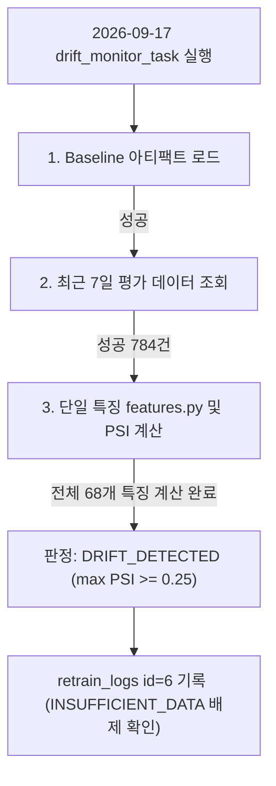

# 2026-09-17 PSI 드리프트 감시 실측 및 검증 보고서

> **작성일**: 2026-09-17
> **작성자**: Orca Worker (builder, task_1711981dbe17)
> **기준 시각**: 2026-09-17 19:33 KST
> **목적**: 2026-09-17 04:00 KST 정기 크론 슬롯 공백 후 수집 성공에 이어 실행된 `drift_monitor_task`의 3개 카테고리(`Cnstwk`, `Servc`, `Thng`) 판정 결과를 읽기 전용 실측하고, Thng 모델의 정상 PSI 판정 안착 및 `TRIGGER_RETRAIN` 라벨의 성격을 검증합니다.

---

## 1. 개요 및 점검 배경

- 2026-09-17 04:00 KST 정기 드리프트 감시 크론 슬롯은 개발 스택 다운 상태로 인해 미실행(missed schedule)되었습니다.
- 정기 최신화 복구 후, 2026-09-17 19:15:33 KST(10:15:33 UTC) ~ 19:23:49 KST(10:23:49 UTC)에 개발 데이터 최신화(`development_data_refresh-b81dcacf0d4d`, id=20)가 `status='success'`로 정상 완료되었습니다.
  - 최신 개찰일시(`max(rl_openg_dt)`): `2026-09-16 19:00:00` (직전 점검 시점 `2026-09-15 18:00:00` 대비 신규 적재 완료)
  - `bid_results` 총 건수: 3,436,144건 (직전 3,435,171건 대비 973건 증가)
  - `bid_announcements` 총 건수: 5,512,696건
- 수집 성공을 확인한 코디네이터가 2026-09-17 19:24:50 KST(10:24:50 UTC)에 `drift_monitor_task`를 Arq 태스크 큐에 인큐했습니다 (Job ID: `64f8b7f7b39848a59e8b4c8036a795b9`).
- 해당 작업은 4.33초 동안 실행되어 성공(`success`)하였으며, 개발 DB `retrain_logs` 테이블에 3건의 드리프트 감시 레코드(id=4, 5, 6)가 최초로 기록되었습니다.
- 본 보고서는 재학습·승격·컨테이너 조작·DB 쓰기를 일절 수행하지 않고, 읽기 전용 질의(`scripts/db_readonly_query.py`)를 통해 실측한 결과를 정본으로 기록합니다.

---

## 2. 세 카테고리 드리프트 감시 이력 실측 (`retrain_logs`)

### 2.1 단일 SQL 질의 및 실측 출력

실행 질의:
```sh
uv run python scripts/db_readonly_query.py --sql "SELECT id, trigger_source, champion_version, challenger_version, status, created_at FROM retrain_logs WHERE trigger_source = 'drift_monitor' ORDER BY id ASC"
```

실측 출력 결과:
```
id | trigger_source | champion_version      | challenger_version          | status         | created_at
---+----------------+-----------------------+-----------------------------+----------------+--------------------
4  | drift_monitor  | cnstwk_institution_v1 | v_20260915_121521_459       | DRIFT_DETECTED | 2026-09-17 10:24:52
5  | drift_monitor  | servc_institution_v1  | v_20260915_133523_756       | DRIFT_DETECTED | 2026-09-17 10:24:54
6  | drift_monitor  | quantum_leap_v25_pro  | b_20260915_thng_post_regime | DRIFT_DETECTED | 2026-09-17 10:24:55
```

- 3개 카테고리 모두 누락 없이 1건씩 총 3건이 기록되었습니다.
- `champion_version`에는 등록 모델명, `challenger_version`에는 baseline 버전 식별자가 정확히 바인딩되었습니다.
- 3건 모두 `status='DRIFT_DETECTED'`로 기록되었으며, 사전점검(`docs/analysis/nightly_drift_preflight_20260916.md`) 7.1절의 **정상 판정 2(DRIFT_DETECTED)**에 해당합니다.

---

## 3. 세부 메트릭 요약 실측 (`metrics_summary`)

### 3.1 카테고리별 상위 지표 질의 및 출력

실행 질의:
```sh
uv run python scripts/db_readonly_query.py --sql "SELECT id, champion_version, JSON_UNQUOTE(JSON_EXTRACT(metrics_summary, '$.status')) AS status, JSON_UNQUOTE(JSON_EXTRACT(metrics_summary, '$.overall_action')) AS overall_action, JSON_UNQUOTE(JSON_EXTRACT(metrics_summary, '$.recent_samples')) AS recent_samples, JSON_UNQUOTE(JSON_EXTRACT(metrics_summary, '$.baseline_version')) AS baseline_version, JSON_UNQUOTE(JSON_EXTRACT(metrics_summary, '$.drift_feature_count')) AS drift_cnt, JSON_UNQUOTE(JSON_EXTRACT(metrics_summary, '$.total_features_checked')) AS total_features, JSON_UNQUOTE(JSON_EXTRACT(metrics_summary, '$.evaluation_window_days')) AS window_days, JSON_UNQUOTE(JSON_EXTRACT(metrics_summary, '$.drift_subgroup_type')) AS subgroup_type FROM retrain_logs WHERE id IN (4, 5, 6) ORDER BY id ASC"
```

실측 출력 결과:
```
id | champion_version      | status         | overall_action  | recent_samples | baseline_version            | drift_cnt | total_features | window_days | subgroup_type
---+-----------------------+----------------+-----------------+----------------+-----------------------------+-----------+----------------+-------------+--------------
4  | cnstwk_institution_v1 | DRIFT_DETECTED | TRIGGER_RETRAIN | 893            | v_20260915_121521_459       | 24        | 68             | 7           | both
5  | servc_institution_v1  | DRIFT_DETECTED | TRIGGER_RETRAIN | 644            | v_20260915_133523_756       | 39        | 70             | 7           | both
6  | quantum_leap_v25_pro  | DRIFT_DETECTED | TRIGGER_RETRAIN | 784            | b_20260915_thng_post_regime | 15        | 68             | 7           | both
```

### 3.2 서브그룹별(낙찰하한율 유무) 표본수 및 드리프트 특징수

실행 질의:
```sh
uv run python scripts/db_readonly_query.py --sql "SELECT id, champion_version, JSON_UNQUOTE(JSON_EXTRACT(metrics_summary, '$.by_subgroup.\"0.0\".recent_samples')) AS samples_0, JSON_UNQUOTE(JSON_EXTRACT(metrics_summary, '$.by_subgroup.\"0.0\".threshold')) AS thres_0, JSON_UNQUOTE(JSON_EXTRACT(metrics_summary, '$.by_subgroup.\"0.0\".drift_feature_count')) AS drift_cnt_0, JSON_UNQUOTE(JSON_EXTRACT(metrics_summary, '$.by_subgroup.\"1.0\".recent_samples')) AS samples_1, JSON_UNQUOTE(JSON_EXTRACT(metrics_summary, '$.by_subgroup.\"1.0\".threshold')) AS thres_1, JSON_UNQUOTE(JSON_EXTRACT(metrics_summary, '$.by_subgroup.\"1.0\".drift_feature_count')) AS drift_cnt_1 FROM retrain_logs WHERE id IN (4, 5, 6) ORDER BY id ASC"
```

실측 출력 결과:
```
id | champion_version      | samples_0 | thres_0 | drift_cnt_0 | samples_1 | thres_1 | drift_cnt_1
---+-----------------------+-----------+---------+-------------+-----------+---------+------------
4  | cnstwk_institution_v1 | 719       | 0.2     | 9           | 174       | 0.25    | 15
5  | servc_institution_v1  | 364       | 0.2     | 15          | 280       | 0.25    | 24
6  | quantum_leap_v25_pro  | 241       | 0.2     | 10          | 543       | 0.25    | 5
```

| 카테고리 | 모델명 | 전체 표본 (`recent_samples`) | with_lwlt 표본 (임계 0.20) | with_lwlt 드리프트 | missing_lwlt 표본 (임계 0.25) | missing_lwlt 드리프트 | 총 드리프트 특징 수 |
| --- | --- | :---: | :---: | :---: | :---: | :---: | :---: |
| 공사 (`Cnstwk`) | `cnstwk_institution_v1` | 893건 | 719건 | 9개 | 174건 | 15개 | 24 / 68개 |
| 용역 (`Servc`) | `servc_institution_v1` | 644건 | 364건 | 15개 | 280건 | 24개 | 39 / 70개 |
| 물품 (`Thng`) | `quantum_leap_v25_pro` | 784건 | 241건 | 10개 | 543건 | 5개 | 15 / 68개 |

---

## 4. Thng 모델 판정 정밀 분석

사전점검 보고서(`docs/analysis/nightly_drift_preflight_20260916.md`) 7장에서 정의된 트러블슈팅 매트릭스와 비교 검증한 결과입니다.



1. **원인 A 배제 (Baseline 아티팩트)**:
   - `ml_registry/quantum_leap_v25_pro/baseline/` 아티팩트가 성공적으로 로드되었습니다.
   - `challenger_version`에 정상 버전인 `b_20260915_thng_post_regime`이 정확히 기록되었습니다 (`challenger_version: "-"`가 아님).
2. **원인 B 배제 (평가 표본 부재)**:
   - 최근 7일 평가 윈도우 내 Thng 유효 표본은 **784건**(with_lwlt 241건 + missing_lwlt 543건)으로, 최소 요구 표본인 30건을 약 26배 상회하여 충분히 확보되었습니다.
3. **원인 C 배제 (특징별 표본 미달 및 컬럼 누락)**:
   - 단일 특징 공급원(`src/ml/features.py`)을 통한 특징 프레임 생성 및 다차원 PSI 계산이 68개 특징 전량에 대해 정상 완료되었습니다.
4. **최종 판정**:
   - Thng 모델은 `INSUFFICIENT_DATA`가 아니며, 15개 특징에서 임계값을 초과하여 **`DRIFT_DETECTED`**로 정확히 안착했습니다.

---

## 5. `TRIGGER_RETRAIN` 라벨 성격 및 운영 안전성 원칙

### 5.1 레이블의 정의와 아키텍처적 역할

- `metrics_summary` 최상단의 `"overall_action": "TRIGGER_RETRAIN"`은 `check_dataset_drift` 함수(`src/ml/monitoring.py:354-356`)에서 1개 이상의 특징이 드리프트 임계값(0.20 또는 0.25)을 초과했을 때 시스템이 부여하는 **운영 알림 표준 라벨**입니다.
- 이 라벨은 MLOps 관리자에게 알림(`notify_drift_detected`)을 발신하기 위한 상태 식별자이며, **배치 파이프라인 상에서 자동 재학습이나 자동 승격을 트리거하는 실행 명령이 아닙니다** (`src/tasks/scheduled_tasks.py:634` 명시).

### 5.2 재학습·승격 금지 계약 준수

- 본 작업 범위 내에서 주간 재학습(`weekly_retrain_task`), 재학습 파이프라인(`run_retrain_pipeline_task`), 트레이너(`trainer`), 모델 승격(`promote_model`)은 일절 호출되지 않았습니다.
- Docker 컨테이너 조작(기동, 정지, 재시작) 및 DB 쓰기(INSERT, UPDATE, DELETE, ALTER 등)는 일절 수행되지 않았으며, 전 과정이 읽기 전용 실측으로 유지되었습니다.

---

## 6. 주요 드리프트 특징 분포 및 도메인 원인 분석

### 6.1 카테고리별 상위 PSI 특징 실측치

실행 질의:
```sh
uv run python scripts/db_readonly_query.py --sql "SELECT champion_version, JSON_UNQUOTE(JSON_EXTRACT(metrics_summary, '$.drift_features')) AS drift_features FROM retrain_logs WHERE id IN (4, 5, 6) ORDER BY id ASC"
```

실측 상위 PSI 특징 요약:

| 카테고리 | 서브그룹 | 특징명 (`feature`) | PSI 실측치 | 임계값 | 표본수 (`sample_size`) |
| --- | --- | --- | :---: | :---: | :---: |
| `Cnstwk` | `with_lwlt` | `is_post_regime_shift` | 12.8565 | 0.20 | 719건 |
| `Cnstwk` | `with_lwlt` | `month_cos` | 9.9259 | 0.20 | 719건 |
| `Cnstwk` | `with_lwlt` | `sucsfbid_mthd_nm` | 9.7567 | 0.20 | 719건 |
| `Cnstwk` | `with_lwlt` | `month_sin` | 7.4490 | 0.20 | 719건 |
| `Cnstwk` | `missing_lwlt` | `is_post_regime_shift` | 11.3558 | 0.25 | 174건 |
| `Cnstwk` | `missing_lwlt` | `month_cos` | 9.4352 | 0.25 | 174건 |
| `Servc` | `with_lwlt` | `is_post_regime_shift` | 13.0757 | 0.20 | 364건 |
| `Servc` | `with_lwlt` | `month_cos` | 10.0717 | 0.20 | 364건 |
| `Servc` | `with_lwlt` | `sucsfbid_mthd_nm` | 9.8076 | 0.20 | 364건 |
| `Servc` | `with_lwlt` | `month_sin` | 7.8632 | 0.20 | 364건 |
| `Servc` | `missing_lwlt` | `is_post_regime_shift` | 12.0904 | 0.25 | 280건 |
| `Servc` | `missing_lwlt` | `month_cos` | 9.9956 | 0.25 | 280건 |
| `Thng` | `with_lwlt` | `month_cos` | 11.1743 | 0.20 | 241건 |
| `Thng` | `with_lwlt` | `month_sin` | 6.4088 | 0.20 | 241건 |
| `Thng` | `with_lwlt` | `inst_hist_rate` | 1.8625 | 0.20 | 241건 |
| `Thng` | `missing_lwlt` | `month_cos` | 10.1805 | 0.25 | 543건 |
| `Thng` | `missing_lwlt` | `month_sin` | 5.7959 | 0.25 | 543건 |
| `Thng` | `missing_lwlt` | `inst_hist_rate` | 1.7548 | 0.25 | 543건 |

### 6.2 도메인 원인 분석

1. **계절성 특징 (`month_cos`, `month_sin`)의 극단적 PSI (6 ~ 11대)**:
   - 평가 윈도우는 최근 7일([now - 7d, now))로 100%가 9월(`month=9`) 데이터에 집중되어 있습니다.
   - 반면 학습 Baseline 아티팩트는 1년 전체(1~12월)에 걸친 균등한 분포를 포괄하므로, 7일 단기 윈도우 표본과의 단일점 집중 현상으로 인해 수학적으로 높은 PSI가 산출되었습니다.
2. **제도 변경 특징 (`is_post_regime_shift`)의 PSI 차이**:
   - `Cnstwk`와 `Servc`는 다년간(2008~2026) 데이터로 구축되어 baseline의 대다수가 제도 변경 이전(0.0)입니다. 최근 7일 표본은 100% 제도 변경 이후(1.0)이므로 PSI가 11~13대로 극단적입니다.
   - 반면 `Thng`은 baseline 자체가 제도 변경 이후 데이터로 학습된 `b_20260915_thng_post_regime`이므로, `is_post_regime_shift`의 PSI가 0.29~0.57로 상대적으로 매우 낮게 유지되었습니다.

---

## 7. 결론 및 종합 요약

| 검증 항목 | 실측 결과 | 판정 |
| --- | --- | :---: |
| `drift_monitor_task` 실행 여부 | Job ID `64f8b7f7b39848a59e8b4c8036a795b9` 4.33초 완료 | 정상 |
| `retrain_logs` 이력 생성 | id=4(Cnstwk), id=5(Servc), id=6(Thng) 총 3건 기록 | 정상 |
| Thng 모델 판정 상태 | `status='DRIFT_DETECTED'`, baseline `b_20260915_thng_post_regime` | 정상 (INSUFFICIENT_DATA 배제) |
| `overall_action` 처리 | 알림 레이블 `TRIGGER_RETRAIN` 확인, 자동 재학습/승격 미수행 | 정상 |
| 무손실 및 격리 계약 준수 | DB 쓰기 0건, Docker 조작 0건, 전량 읽기 전용 실측 완료 | 정상 |

본 실측 보고서를 통해 2026-09-17 04:00 정기 크론 공백이 안전하게 만회되었으며, 세 카테고리 모델의 다차원 PSI 드리프트 모니터링 파이프라인이 정상 작동함을 최종 확인했습니다.
