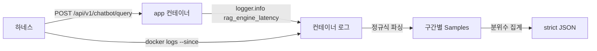

# 단발 질의 RAG 구간 분리 계측 하네스 (2026-08-23)

> **작성일**: 2026-08-23 (Asia/Seoul)
> **대상 도구**: [`scripts/benchmark_rag_segments.py`](../../scripts/benchmark_rag_segments.py)
> **계측 근거**: [`query_rag_latency_instrumentation.md`](query_rag_latency_instrumentation.md)
> **상태**: 도구 작성 완료. **실측 미수행**

---

## 1. 이 도구가 필요한 이유

단발 질의 API 는 총 소요만 알 수 있고 그 내역을 알 수 없었습니다. 2026-08-23
Ollama c4 실측에서 워밍 상태의 단발 질의 10회가 다음과 같이 나왔습니다.

| 지표 | 값 |
| --- | --- |
| 최소 | 2,142ms |
| 중앙 | 5,229ms |
| 최대 | 9,037ms |

**4배가 넘는 편차인데 원인을 지목할 수 없습니다.** 콜드 스타트도 아닙니다.
첫 요청(3,015ms)이 중앙값보다 빨랐고 최대값은 3번째에 나왔습니다. 워밍업
곡선이 아니라 전 구간에 흩어진 변동입니다.

최적화 판단이 여기서 갈립니다.

- 편차가 `llm_ms` 에서 온다면 모델 교체나 양자화가 답이며 RAG 코드를 고쳐도
  소용이 없습니다.
- 편차가 `vector_ms` 나 `sql_ms` 에서 온다면 반대입니다.

`src/rag/engine.py` 에 구간 계측은 2026-08-22 에 들어갔으나, 로그를 모아
분위수로 집계하는 도구가 없어 그 계측이 한 번도 실측에 쓰이지 못했습니다.

---

## 2. 설계

구간 로그는 서버 쪽에서 나오므로 HTTP 응답만으로는 알 수 없습니다. 질의를 보낸
뒤 컨테이너 로그에서 `rag_engine_latency:` 줄을 읽어 집계합니다.



수집 구간은 `plan_ms`, `sql_ms`, `vector_ms`, `kb_ms`, `assembly_ms`,
`llm_ms`, `guard_ms` 이며 `total_ms` 와 함께 집계합니다. `prepare_ms` 는 앞
다섯 구간의 합이라 중복 집계하지 않습니다.

---

## 3. 두 가지 안전장치

### 3.1 잔여 구간을 버리지 않습니다

구간 합이 `total_ms` 와 어긋나면 그 차이를 `residual_ms` 로 기록합니다.
조용히 버리면 계측되지 않은 병목을 놓칩니다. 회귀 테스트
`test_aggregate_records_residual_instead_of_dropping_it` 가 이를 강제합니다.

### 3.2 플래그가 꺼져 있으면 fail-closed 입니다

`LATENCY_SEGMENT_LOGGING` 이 꺼진 채 실행하면 구간 로그가 한 줄도 나오지
않습니다. 그때 빈 결과를 내면 측정 완료로 오인됩니다. 하네스는 실행 전에 대상
컨테이너의 환경변수를 확인하고, 켜져 있지 않으면 안내 메시지와 함께 종료 코드
2 로 끝납니다. 로그가 수집되지 않은 경우도 같습니다.

---

## 4. 사용 절차

`LATENCY_SEGMENT_LOGGING` 은 `.env` 에 없습니다. **측정 중에만 켜고 끝나면
되돌립니다.** 운영 기본값을 바꾸지 마십시오.

```bash
docker compose up -d app redis
# .env 에 LATENCY_SEGMENT_LOGGING=true 를 임시로 추가한 뒤
docker compose up -d --force-recreate app

uv run python scripts/benchmark_rag_segments.py \
  --base-url http://127.0.0.1:8000 \
  --target-container refac_bid_box-app-1 \
  --rounds 20 \
  --output data/benchmarks/rag_segments_<날짜>.json

# 측정이 끝나면 .env 를 원래대로 되돌리고 app 을 재기동합니다
```

---

## 5. 남은 일

**실측이 남았습니다.** 본 Task 시점에는 Ollama c4 측정이 같은 `app` 컨테이너와
같은 호스트 Ollama 인스턴스를 배타 점유하고 있었습니다. Ollama 는 생성 요청을
직렬화하므로 두 측정을 동시에 돌리면 서로의 대기 시간이 상대 P95 에 섞여 양쪽
수치가 오염됩니다. 자원 경합이 아니라 측정 오염이라 병렬이 성립하지 않습니다.

다음 세션에서 4장 절차대로 실측하면 아래 질문에 답할 수 있습니다.

| 질문 | 확인할 값 |
| --- | --- |
| 5초대 중앙값의 주범은 LLM 생성인가 RAG 준비인가 | `llm_ms` 대 `prepare` 계열 구간의 P50 비중 |
| 2.1초와 9.0초를 가르는 것은 무엇인가 | 구간별 P95 대 P50 비율 |
| 계측되지 않은 구간이 있는가 | `residual_ms` 의 크기 |
