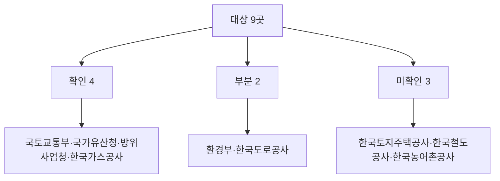

# 중앙부처·공단 9곳 일반용역 적격심사 입찰가격 산식 공식 원문 수집 결과

> **작성일**: 2026-10-04
> **작업**: Orca Task `task_889fe5b87a19` (builder), Run `run_03599ec1fd4a`, Dispatch `ctx_16ae137c83ea`
> **재작업**: Orca Task `task_b232296357f7` (builder), Dispatch `ctx_d892a26f2a84` — 반려 사유(방위사업청 7.2절 통과점수 2칸이 원문 제9조①과 불일치) 해결
> **정본 사양**: `.orca/capsules/task_889fe5b87a19_rework/capsule.yaml` (`ORCA_TASK_CAPSULE_V2`)
> **기준 커밋**: `main` `0b396152`
> **대상**: 중앙부처·공단 9곳 — 국토교통부, 국가유산청, 환경부(기후에너지환경부), 방위사업청, 한국토지주택공사, 한국철도공사, 한국농어촌공사, 한국도로공사, 한국가스공사
> **역할 경계**: 코드·설정·패키지를 변경하지 않았습니다. 이 문서가 이번 작업의 커밋 산출물입니다.
> **원본 위치**: 내려받은 공식 원본과 추출 텍스트는 `.orca/capsules/task_889fe5b87a19/external/` 아래 기관별 폴더에만 두었고, 커밋하지 않습니다(`.orca/` 하위는 커밋 금지).
> **판정 규칙**: 2026-09-30 수집 세션 3절의 10개 규칙을 그대로 적용합니다.

---

## 1. 요약 표

| # | 대상 | 등급 | 문서(제정·개정·시행) | 핵심 한 줄 |
| ---: | --- | --- | --- | --- |
| 1 | 국토교통부 | 확인 | 용역적격심사 및 협상에 의한 낙찰자 결정기준 (훈령 제965호, 2018-01-04, 일반용역) | 4구간 B=70/30/20/20, k=20/2/2/2, 기준 88, 인쇄점수와 전부 일치 |
| 2 | 국가유산청 | 확인(수치는 평탄점수 미인쇄) | 매장유산 조사용역 적격심사 세부기준 (고시 제2024-6호, 2024-05-17) | 별표 1~5 B=30/30/40/45/50, k=1.875/2.5/3/9.6/48, 기준 88, 평탄 점수는 원문 미인쇄 |
| 3 | 환경부(기후에너지환경부) | 부분 | 기술용역 적격심사 및 협상에 의한 낙찰자 결정기준 (기후에너지환경부훈령 제4호, 2025-11-11) | 문서·통과점수 확인, 별표 1 입찰가격 수치는 이미지 PDF로만 제공되어 미확인. 일반용역 자체 산식 없음 |
| 4 | 방위사업청 | 확인(10억 이상은 k 미확정) | 용역 적격심사 기준 (예규 제1082호, 2026-09-21) | 5억~10억·고시~5억·고시 미만 3구간 검산 일치. 10억 이상은 계수 생략+평탄문장 부재로 k 미확정. 통과점수는 제9조① 추정가격 경계(30억·10억) 기준 |
| 5 | 한국토지주택공사 | 미확인 | (자료실에 "용역적격심사 세부기준" 항목은 있음) | ebid 자료실 목록 접근, 개별 문서 다운로드는 세션·보안모듈 필요로 실패 |
| 6 | 한국철도공사 | 미확인 | (규정서식 게시판 조회 0건) | ebid 규정서식 목록에서 적격심사 문서 미확보. 상업 제목 단서만 |
| 7 | 한국농어촌공사 | 미확인 | (ebid 호스트 DNS 실패) | `ebid.ekr.or.kr` 호스트 해석 실패. 홈페이지 접속은 되나 자료실 링크 미확인 |
| 8 | 한국도로공사 | 부분 | 용역적격심사 세부기준 (2022-10-01 개정·시행) | 선행 재계산 문서에 원문 인용·검산 있음. 이번 세션 공식 원문 재확보는 실패 |
| 9 | 한국가스공사 | 확인 | 공사·용역 적격심사 세부기준 (2026-07-09 시행) 및 용역계약 종합심사낙찰제 심사세부기준 (2024-09-09 시행) | 종심제는 제3조 3유형(기본계획·기본설계 30억 이상, 실시설계 40억 이상, 건설사업관리 50억 이상)만. 그 밖의 용역은 적격 B-k(기준 90, k 1.5/2/3/5, B 30/50/70). 2026-10-04 정정 |

---

## 2. 판정 규칙 (수집 세션 3절 그대로)

1. 상업 페이지(bidpro, 비드큐, info21c, 모두입찰, korbid, igunsul, 블로그)의 계수는 베끼지 않는다. 제목과 날짜 단서만 쓴다.
2. 나라장터 첨부는 파일 머리말이 그 기관 규정일 때만 원문이다. 개별 공고 배점표는 전사 규정이 아니다.
3. 조달청 준용 조항만 있으면 조항, 개정 표시, 시행일만 인용한다. 조달청 별표 숫자를 그 기관 계수로 옮기지 않는다.
4. 평점 = B − k × |(기준/100 − 입찰가격/예정가격) × 100|. B는 그 별표의 입찰가격 배점한도다.
5. 계수가 생략되고 평탄 대입이 인쇄 점수와 맞을 때만 k=1. 평탄 문장이 없으면 k=1로 두지 않는다.
6. 평탄 비율과 낙찰하한율로 k를 역산하지 않는다.
7. 대입 결과가 인쇄 점수와 다르면 그 행은 미확정이다. 0.01점 차이도 미확정이다. 원문이 비율만 적고 점수를 인쇄하지 않으면 대입값을 적고 원문이 그렇게 말한다고 밝힌다.
8. 5억 열과 고시금액 산식은 감점이 같아도 짝짓지 않는다.
9. 접속 실패, DNS 실패, 시간 초과는 문서가 없다는 증거가 아니다.
10. 시·도는 그 시의 가격 별표를 읽기 전에는 행정안전부 예규 제373호(규모 구간, 기준비율 88%)에 둔다. 예규는 시·도별로 식을 나누지 않는다.

---

## 3. 수집 환경과 도구

| 항목 | 값 |
| --- | --- |
| 내려받기 | `curl -L -m 30 -o <경로>` |
| PDF 추출 | `uvx --from pdfminer.six pdf2txt.py <파일>` |
| HWP 추출 | `uvx --from pyhwp --with six hwp5txt <파일>` |
| HWPX/HWPML 추출 | `python3` 표준 `zipfile` 로 `Contents/section*.xml` 파싱. 수식은 `<hp:script>`(HancomEQN) 를 함께 추출 |
| 행정규칙 본문 | `POST https://www.law.go.kr/LSW/admRulInfoR.do` (`admRulSeq`, `chrClsCd=010202`) |
| 별표 본문 | `GET https://www.law.go.kr/LSW/admRulBylContentsInfoR.do?bylSeq=<seq>` |
| 기관별 행정규칙 검색 | `POST https://www.law.go.kr/LSW/admRulScListR.do?menuId=4&subMenuId=42&tabMenuId=183` 에 `q`(검색어)와 `p2`(기관코드) |

`pip install`, `uv add`, `brew install` 은 사용하지 않았습니다. 운영 DB·docker 는 건드리지 않았습니다.

내려받은 원본·추출 텍스트는 모두 `.orca/capsules/task_889fe5b87a19/external/` 아래 기관별 폴더(`molit`, `khs`, `me`, `dapa`, `kogas`, `lh`, `korail`, `krc`, `koex`)에 두었습니다. 규칙 검색·기관별 목록 페이지는 `.../external/_search/` 에 두었습니다. 리뷰어는 이 경로의 파일로 문서의 수치를 대조할 수 있습니다.

기관코드(국가법령정보센터): 국토교통부 `1613000`, 국가유산청 `1833100`, 방위사업청 `1690000`, 환경부 계열 `1482000`(기후에너지환경부).

---

## 4. 국토교통부 — 확인

### 4.1 문서 식별

| 항목 | 값 |
| --- | --- |
| 문서명 | 용역적격심사 및 협상에 의한 낙찰자 결정기준 |
| 문서번호 | 국토교통부훈령 제965호 |
| 제정·개정·시행일 | 2018-01-04 일부개정(시행 2018-01-04) |
| 출처 URL | `https://www.law.go.kr/LSW/admRulLsInfoP.do?admRulSeq=2100000109630` |
| 원본 내려받기 | `https://www.law.go.kr/LSW/flDownload.do?flSeq=33015758` (171229·180104 전문 HWP) |
| 확인 날짜 | 2026-10-04 |
| .orca 원본 경로 | `.orca/capsules/task_889fe5b87a19/external/molit/molit_yongyeok_2018-01-04.hwp`, 추출문 `.orca/capsules/task_889fe5b87a19/external/molit/molit_yongyeok_2018-01-04.txt` |
| 등급 | 확인 |

국가법령정보센터에서 이 문서는 폐지 표시 없이 현행으로 조회되며, 국토교통부의 "용역" 일반 산식입니다. 같은 부처의 `건설엔지니어링 적격심사 및 협상에 의한 낙찰자 결정기준`(훈령 제1953호, 2026-06-05)은 설계·건설사업관리·정밀안전진단 전용으로 별개 문서이며, 이 일반용역 산식과 합치지 않습니다.

### 4.2 입찰가격 평점산식 (비고 1)

원문(`molit_yongyeok_2018-01-04.txt:91`)은 `입찰가격 평점산식(｜｜는 절대값 표시임) : 입찰가격을 예정가격으로 나눈 결과 소수점이하의 숫자가 있는 경우 소수점 다섯째자리에서 반올림` 이라고 적고, 다음 네 식을 인쇄합니다.

```
① 평점(점)=70-20×｜88/100-입찰가격/예정가격｜×100 단, 입찰가격이 예정가격 이하로서 예정가격의 88.25% 이상인 경우는 평점 65점 적용
② 평점(점)=30-2×｜88/100-입찰가격/예정가격｜×100 단, 입찰가격이 예정가격 이하로서 예정가격의 93% 이상인 경우는 평점 20점(감리용역의 경우 90.5% 이상인 경우 25점) 적용
③ 평점(점)=20-2×｜88/100-입찰가격/예정가격｜×100 단, 입찰가격이 예정가격이하로서 예정가격의 93% 이상인 경우는 평점 10점 적용
④ 평정(점)=20-2｜88/100-입찰가격/예정가격｜×100 단, 입찰가격이 예정가격이하로서 예정가격의 95.5% 이상인 경우는 평점 5점 적용
```

출처 행: `molit_yongyeok_2018-01-04.txt:93`(①), `:95`(②), `:97`(③), `:99`(④). 구간 명칭은 `【별표 1】 적격심사항목 및 배점한도액(제4조제2항 관련)`(`:83`)의 고시금액 구분과 대응합니다.

### 4.3 구간별 검산

| 구간 | B | k | 기준 | 평탄 문장(원문) | 통과점수 | 최저평점 | 원문 인쇄점수 | 대입값 | 판정 |
| --- | ---: | ---: | ---: | --- | --- | --- | ---: | ---: | --- |
| 고시금액 미만 | 70 | 20 | 88 | 88.25% 이상이면 65점 | 95 | 원문 부재 | 65 | 70 − 20×0.25 = 65.000 | 일치 |
| 고시금액 이상 10억 미만 | 30 | 2 | 88 | 93% 이상이면 20점 | 90 (감리·건설사업관리 95) | 원문 부재 | 20 | 30 − 2×5 = 20.000 | 일치 |
| 고시금액 이상 10억 미만 (감리) | 30 | 2 | 88 | 90.5% 이상이면 25점 | 95 | 원문 부재 | 25 | 30 − 2×2.5 = 25.000 | 일치 |
| 10억 이상 30억 미만 | 20 | 2 | 88 | 93% 이상이면 10점 | 90 | 원문 부재 | 10 | 20 − 2×5 = 10.000 | 일치 |
| 30억 이상 | 20 | 2 | 88 | 95.5% 이상이면 5점 | 85 | 원문 부재 | 5 | 20 − 2×7.5 = 5.000 | 일치 |

통과점수는 `molit_yongyeok_2018-01-04.txt:26-29`(제5조①) 에서 인용했습니다. 최저평점은 추출문 전체에서 `최저평점` 0건으로 **원문 부재**입니다.

### 4.4 소결

- 네 구간 모두 대입값이 원문 인쇄 점수와 0.01점 차이도 없이 일치합니다.
- 이 문서는 국토교통부의 일반용역(감리·건설사업관리 별도 표기 포함) 산식이며, 건설엔지니어링 훈령 제1953호의 기준율 90과 섞지 않았습니다.

---

## 5. 국가유산청 — 확인(수치는 평탄점수 미인쇄)

### 5.1 문서 식별

| 항목 | 값 |
| --- | --- |
| 문서명 | 매장유산 조사용역 적격심사 세부기준 |
| 문서번호 | 국가유산청고시 제2024-6호 (타법개정) |
| 제정·개정·시행일 | 2024-05-17 개정(시행 2024-05-17) |
| 출처 URL | `https://www.law.go.kr/LSW/admRulLsInfoP.do?admRulSeq=2100000241426` |
| 원본 내려받기 | `https://www.law.go.kr/LSW/flDownload.do?flSeq=140637059` (HWPX) / `flSeq=140637063` (PDF) |
| 확인 날짜 | 2026-10-04 |
| .orca 원본 경로 | `.orca/capsules/task_889fe5b87a19/external/khs/khs_yongyeok_2024-05-17.hwpx`, 추출문 `.../khs/khs_yongyeok_2024-05-17.txt`, 교차확인 PDF `.../khs/khs_yongyeok_2024-05-17_pdf.txt` |
| 등급 | 확인 |

국가유산청(옛 문화재청)의 자체 적격심사 고시입니다. 제1조(`khs_yongyeok_2024-05-17.txt:7`)는 근거를 `기획재정부 계약예규 적격심사기준`에 두고, 제3조는 적용대상을 매장유산 조사용역(지표조사·발굴조사)으로 정합니다. 따라서 이 산식은 **매장유산 조사용역 전용**이며, 국가유산청의 다른 일반용역에 대한 자체 B-k 산식은 국가법령정보센터 검색(`q=적격심사`, 기관코드 1833100, 8건)에서 확인되지 않았습니다.

### 5.2 별표별 입찰가격 산식 (원문 텍스트)

원문은 계산식과 평탄 비율을 인쇄하지만 **평탄 비율에 대응하는 점수를 인쇄하지 않습니다.** 문장은 `입찰가격이 예정가격이하로서 90/100이상인 경우에는 90/100인 경우의     점수로 함` 처럼 점수 자리가 비어 있습니다(HWPX·PDF 양쪽 동일, PDF `khs_yongyeok_2024-05-17_pdf.txt:492-493`).

| 별표(추정가격) | B | k | 기준 | 평탄 비율 | 통과점수 | 최저평점 | 원문 인쇄점수 | 대입값 | 판정 |
| --- | ---: | ---: | ---: | ---: | --- | --- | --- | ---: | --- |
| 별표 1 (10억 이상) | 30 | 1.875 | 88 | 90/100 | 85 | 5 | 미인쇄 | 30 − 1.875×2 = 26.25 | 미확정(규칙 7, 원문 미인쇄) |
| 별표 2 (10억 미만 5억 이상) | 30 | 2.5 | 88 | 90/100 | 85 | 5 | 미인쇄 | 30 − 2.5×2 = 25.00 | 미확정(규칙 7, 원문 미인쇄) |
| 별표 3 (5억 미만 2.5억 이상) | 40 | 3 | 88 | 90/100 | 85 | 5 | 미인쇄 | 40 − 3×2 = 34.00 | 미확정(규칙 7, 원문 미인쇄) |
| 별표 4 (2.5억 미만 1억 이상) | 45 | 9.6 | 88 | 89.25/100 | 88 | 5 | 미인쇄 | 45 − 9.6×1.25 = 33.00 | 미확정(규칙 7, 원문 미인쇄) |
| 별표 5 (1억 미만) | 50 | 48 | 88 | 88.25/100 | 88 | 5 | 미인쇄 | 50 − 48×0.25 = 38.00 | 미확정(규칙 7, 원문 미인쇄) |

원문 인용 행:

- 별표 1: `khs_yongyeok_2024-05-17.txt:101` `평점(점) = 30 - 1.875 × |(88/100 – 입찰가격/예정가격)×100|` · 평탄 문장 동일 행 `90/100이하` · 통과점수 `:92` `합산점수 85점 이상`
- 별표 2: `:122` `평점(점) = 30-2.5×|(88/100 – 입찰가격/예정가격)×100|` · 통과점수 `:113`
- 별표 3: `:142` `평점(점) = 40-3×|(88/100 – 입찰가격/예정가격)×100|` · 통과점수 `:133`
- 별표 4: `:162` `평점(점) = 45-9.6×|(88/100 – 입찰가격/예정가격)×100|` · 통과점수 `:153` `88점 이상`
- 별표 5: `:182` `평점(점) = 50-48×|(88/100 – 입찰가격/예정가격)×100|` · 통과점수 `:173`
- 공통 주: `:244`(절대값·반올림), `:246` `4) 최저평점은 5점으로 함`

### 5.3 소결

- B·k·기준율·평탄 비율·통과점수·최저평점은 원문에서 확인됩니다.
- 평탄 비율에 대응하는 점수는 원문이 인쇄하지 않으므로, 위 대입값은 계산값일 뿐 **검산 통과로 세지 않습니다**(규칙 7).

---

## 6. 환경부(기후에너지환경부) — 부분

### 6.1 문서 식별

| 항목 | 값 |
| --- | --- |
| 문서명 | 기술용역 적격심사 및 협상에 의한 낙찰자 결정기준 |
| 문서번호 | 기후에너지환경부훈령 제4호 (일부개정) |
| 제정·개정·시행일 | 2025-11-05 개정(시행 2025-11-11) |
| 출처 URL | `https://www.law.go.kr/LSW/admRulLsInfoP.do?admRulSeq=2100000270570` |
| 원본 내려받기 | `https://www.law.go.kr/LSW/flDownload.do?flSeq=161052893` (개정본문 HWPX) |
| 확인 날짜 | 2026-10-04 |
| .orca 원본 경로 | `.orca/capsules/task_889fe5b87a19/external/me/me_techyongyeok_2025-11-11.hwpx`, 본문 추출문 `.../me/me_techyongyeok_2025-11-11_body.txt` |
| 등급 | 부분 |

환경부는 현 조직상 기후에너지환경부로 조회됩니다. 이 훈령 제2조(적용범위)는 `기본계획용역, 설계용역, 감리용역, 건설사업관리용역, 정밀안전점검(진단)용역, 지도제작용역` 등 **기술용역**을 대상으로 하며, 일반용역 자체 산식은 이 문서 범위에 없습니다.

### 6.2 확인된 값 (조문)

- 통과점수: `me_techyongyeok_2025-11-11_body.txt:15-17` (제5조①) — `고시금액 미만 95점`, `고시금액 이상 10억원 미만 95점`, `10억원 이상 30억원 미만 90점`, `30억원 이상 85점`.
- 평가기준: 제4조②가 `별표 1` 을 가리킵니다(`:13`).

### 6.3 미확인 — 별표 1 입찰가격 수치

별표 1(`적격심사항목 및 배점한도액(제4조제2항 관련)`, `bylSeq=3152729`)은 국가법령정보센터에서 **이미지 변환 PDF 뷰어**로만 제공됩니다(`https://www.law.go.kr/LSW/admRulBylContentsInfoR.do?bylSeq=3152729` → `viewer key=161053051`). 첨부 파일도 `개정본문` 뿐이고, 규칙 전문 HWPML(`admRulHwpSave.do`)에 포함된 이미지는 기관 로고(10KB PNG)로 별표 표가 아니었습니다. 따라서 별표 1 의 **B, k, 기준비율, 평탄 구간** 수치는 이번 세션에서 텍스트로 확보하지 못했습니다. 시도 경로와 실패 형태는 위와 같으며, 표가 없다는 증거로 단정하지 않습니다(규칙 9).

---

## 7. 방위사업청 — 확인(10억 이상은 k 미확정)

### 7.1 문서 식별

| 항목 | 값 |
| --- | --- |
| 문서명 | 용역 적격심사 기준 |
| 문서번호 | 방위사업청예규 제1082호 (일부개정) |
| 제정·개정·시행일 | 2026-09-21 개정(시행 2026-09-21) |
| 출처 URL | `https://www.law.go.kr/LSW/admRulLsInfoP.do?admRulSeq=2100000285258` |
| 원본 내려받기 | `https://www.law.go.kr/LSW/flDownload.do?flSeq=169541375` (HWPX) / `flSeq=169541379` (PDF) |
| 확인 날짜 | 2026-10-04 |
| .orca 원본 경로 | `.orca/capsules/task_889fe5b87a19/external/dapa/dapa_yongyeok_2026-09-21.hwpx`, 추출문 `.../dapa/dapa_yongyeok_2026-09-21.txt`, 수식 계수 보존 재추출문 `.../dapa/dapa_yongyeok_2026-09-21_hwpx_ordered.txt`, 교차확인 PDF `.../dapa/dapa_yongyeok_2026-09-21_pdf.txt` |
| 등급 | 확인(10억 이상 구간은 부분) |

제2조(`dapa_yongyeok_2026-09-21.txt:24`)는 적용대상을 `방위사업청에서 집행하는 용역입찰(국제운송용역 제외 및 장비정비용역 제외)`로 정합니다. 입찰가격 산식은 `【별표 1】` 의 규모별 `(나)입찰가격` 칸에 **HWP 수식(HancomEQN)** 으로 들어 있습니다.

### 7.2 구간별 식과 검산

원문의 입찰가격 산식은 HWP 수식(HancomEQN)이라 hwp5txt 추출문(`dapa_yongyeok_2026-09-21.txt`)이 계수와 `×100` 일부를 누락합니다. 그래서 수식·배점·최저평점은 HWPX 원문(`Contents/section0.xml`)을 문서 순서로 재추출한 `dapa_yongyeok_2026-09-21_hwpx_ordered.txt` 행으로 인용합니다.

| 구간(추정가격) | B | k | 기준 | 평탄 문장(원문) | 통과점수 | 최저평점 | 원문 인쇄점수 | 대입값 | 판정 |
| --- | ---: | ---: | ---: | --- | --- | --- | ---: | ---: | --- |
| 10억 이상 | 30 | 생략(수식에 계수 없음) | 88 | 평탄 문장 없음 | 30억 이상 85 / 30억 미만 10억 이상 90 | 2 | 없음 | 산출 불가 | 미확정(규칙 5, k 미확정) |
| 5억 이상 10억 미만 | 50 | 2 | 88 | `90.5% 이상인 경우 평점은 45점으로 함` | 95 | 2 | 45 | 50 − 2×2.5 = 45.000 | 일치 |
| 고시금액 이상 5억 미만 | 70 | 4 | 88 | `89.25% 이상인 경우 평점은 65점으로 함` | 95 | 2 | 65 | 70 − 4×1.25 = 65.000 | 일치 |
| 고시금액 미만 | 90 | 20 | 88 | `88.25% 이상인 경우 평점은 85점으로 함` | 95 | 2 | 85 | 90 − 20×0.25 = 85.000 | 일치 |

통과점수는 별표 1 의 규모 구간이 아니라 제9조① 의 추정가격 경계(30억원·10억원)로 정해집니다. 그래서 첫 행은 30억원 이상 85점과 30억원 미만 10억원 이상 90점 두 값이고, 나머지 세 구간은 모두 10억원 미만이라 95점입니다.

원문 인용 행(수식은 `⟦EQ:…⟧`, 파일은 `dapa_yongyeok_2026-09-21_hwpx_ordered.txt`):

- 10억 이상: `:140` 절 제목, `:162` `30-│⟦EQ:( 88/100 − 입찰가격/예정가격 )×100⟧│`, `:164` 배점한도 `30`, `:165` `＊ 최저평점은 2점으로 함`. 수식에 계수 자리가 없고 평탄 문장도 없습니다.
- 5억 이상 10억 미만: `:756` 절 제목, `:778` `50-2×│⟦EQ:( 88/100 − 입찰가격/예정가격 )⟧×100│`, `:780` 배점한도 `50`, `:781` `＊ 최저평점은 2점으로 함`, `:782` `＊ 예정가격 대비 입찰가격의 비율이 90.5% 이상인 경우 평점은 45점으로 함`.
- 고시금액 이상 5억 미만: `:1023` 절 제목, `:1043` `70- 4×│⟦EQ:( 88/100 − 입찰가격/예정가격 )⟧×100│`, `:1045` 배점한도 `70`, `:1046` `＊ 최저평점은 2점으로 함`, `:1047` `＊ 예정가격 대비 입찰가격의 비율이 89.25% 이상인 경우 평점은 65점으로 함`.
- 고시금액 미만: `:1287` 절 제목, `:1318` `ㅇ 평점산식 : 90- 20×│⟦EQ:( 88/100 − 입찰가격/예정가격 )⟧×100│`, `:1311` 배점한도 `90`, `:1321` `＊ 최저평점은 2점으로 함`, `:1322` `＊ 예정가격 대비 입찰가격의 비율이 88.25% 이상인 경우 평점은 85점으로 함`.
- 통과점수: `:64` (제9조①) — `추정가격이 30억원 이상 용역은 85점, 추정가격이 30억원 미만 10억원 이상인 용역은 90점, 10억원 미만인 용역은 95점 이상` (같은 문장이 `dapa_yongyeok_2026-09-21.txt:64` 에도 있습니다).
- 계산 소수점: `:29` — `비율, 평점(입찰가격 포함) 등을 계산한 결과 소수점 이하의 숫자가 있는 경우에는 소수점 다섯째 자리에서 반올림한다`.

### 7.3 소결

- 세 구간(5억 이상 10억 미만, 고시금액 이상 5억 미만, 고시금액 미만)은 대입값이 인쇄 점수와 일치합니다.
- 통과점수는 제9조① 의 추정가격 경계(30억원·10억원)를 따르며, 별표 1 의 네 규모 구간에 그대로 대응하지 않습니다. 이번 재작업에서 5억 이상 10억 미만을 95점으로, 10억 이상을 30억원 경계로 나눠 정정했습니다.
- 10억 이상 구간은 수식 `30 − |…|` 로 계수가 생략되어 있고 평탄 문장도 없어 규칙 5에 따라 **k를 1로 확정하지 않았습니다**(미확정).
- 5억 열과 고시금액 산식은 감점이 같아도 짝짓지 않았습니다(규칙 8).

---

## 8. 한국토지주택공사 — 미확인

| 항목 | 값 |
| --- | --- |
| 시도 경로 | `https://ebid.lh.or.kr/ebid.cm.om.cmd.DataOutListCmd.dev` (전자조달 자료실) |
| 응답 | HTTP 200, 81KB 목록 수신 |
| 확인된 항목 | 목록에 `▶ 용역적격심사 세부기준` 행 존재(`fn_dds_open('1019','0201')`) |
| 실패 형태 | 행 클릭으로 열리는 상세/첨부 다운로드가 세션·보안모듈(SecuKitNx/SecuKitNXS) 을 요구해 원문 파일 확보 실패 |
| 출처 URL | `https://ebid.lh.or.kr/` |
| 확인 날짜 | 2026-10-04 |
| .orca 원본 경로 | 원본 미확보. 시도 흔적 `.orca/capsules/task_889fe5b87a19/external/lh/lh_dataroom_list.html` |
| 등급 | 미확인 |

목록에 문서가 존재한다는 사실만 확인했고, 입찰가격 산식 수치는 확보하지 못했습니다. 로그인·보안모듈이 필요하다는 사실만 적으며, 문서 부재로 단정하지 않습니다(규칙 9). 상업 사이트 제목에 `[특별] 용역적격심사 세부기준 한시적 운영방안(공지 2023-09-25~2024-09-30)` 단서가 있으나 계수 전재는 하지 않았습니다.

---

## 9. 한국철도공사 — 미확인

| 항목 | 값 |
| --- | --- |
| 시도 경로 | `https://ebid.korail.com/main.do` → 고객지원센터 > 규정서식 `https://ebid.korail.com/board/ruleList.do` |
| 응답 | HTTP 200, 목록 `총 0 건` (조회조건 파라미터로는 목록 미출력) |
| 실패 형태 | 게시판이 검색 파라미터·세션 기반으로 목록을 로드해 적격심사 규정 문서에 도달하지 못함 |
| 상업 제목 단서(전재 안 함) | `기술용역적격심사세부기준(개정 22.1.24)`, `계약업무처리세부기준 낙찰하한율 2%p 상향 2026-07-06 시행` |
| 출처 URL | `https://ebid.korail.com/board/ruleList.do` |
| 확인 날짜 | 2026-10-04 |
| .orca 원본 경로 | 원본 미확보. 시도 흔적 `.orca/capsules/task_889fe5b87a19/external/korail/korail_ruleList.html`, `.../korail/korail_ruleList_search.html` |
| 등급 | 미확인 |

접속은 되나 규정 목록을 특정하지 못했습니다. 접속 성공을 문서 존재로, 목록 미출력을 문서 부재로 단정하지 않습니다(규칙 9).

---

## 10. 한국농어촌공사 — 미확인

| 항목 | 값 |
| --- | --- |
| 시도 경로 | `https://ebid.ekr.or.kr/`, `https://ebid.ekr.or.kr/main.do`, `https://www.ekr.or.kr/` |
| 응답 | `ebid.ekr.or.kr` 는 호스트 해석 실패(DNS). `www.ekr.or.kr` 는 HTTP 200(126KB)이나 자료실/전자조달 링크 미확인 |
| 실패 형태 | DNS 실패, 홈페이지 자료실 경로 미확인 |
| 상업 제목 단서(전재 안 함) | `한국농어촌공사 일반용역 적격심사 세부기준(2025.10.1 시행)`, `2026.6.24 이후 공고분 적용` |
| 출처 URL | `https://www.ekr.or.kr/` |
| 확인 날짜 | 2026-10-04 |
| .orca 원본 경로 | 원본 미확보. 시도 흔적 `.orca/capsules/task_889fe5b87a19/external/krc/krc_home.html` |
| 등급 | 미확인 |

DNS 실패는 문서가 없다는 증거가 아닙니다(규칙 9). 올바른 전자조달 호스트와 자료실 경로는 다음 세션에서 다시 확인해야 합니다.

---

## 11. 한국도로공사 — 부분

| 항목 | 값 |
| --- | --- |
| 문서명 | 용역적격심사 세부기준 (일반용역) |
| 문서번호·시행일 | 2022-10-01 개정·시행 |
| 출처 URL | `https://ebid.ex.co.kr/` (전자조달 자료실). 이번 세션에서 개별 문서 URL 미확보 |
| 선행 근거 | 선행 재계산 문서 `docs/analysis/20260930_servc_formula_recalc_kwater_koex.md` 4절이 위 원문 HWP 를 인용 |
| 확인 날짜 | 2026-10-04 (선행 문서는 2026-09-30) |
| .orca 원본 경로 | 원본 미확보. 선행 세션이 인용한 `/tmp/qual-formulas/hermes-servc/koex/` 는 재부팅으로 소멸. 시도 흔적 `.orca/capsules/task_889fe5b87a19/external/koex/koex_ebid_default.html` |
| 등급 | 부분 |

선행 문서가 인용한 값(이번 세션에서 원문 파일을 다시 열지 못했으므로 아래는 선행 문서의 인용을 그대로 옮긴 것):

| 행 | B | k | 기준 | 평탄 문장 | 통과점수 | 원문 인쇄점수 | 대입값 | 선행 판정 |
| --- | ---: | ---: | ---: | --- | --- | ---: | ---: | --- |
| 별표 1-2 (일반용역 5억 이상 10억 미만) | 50 | 2 | 88 | 95.5% 이상 35점 | 별표 밖 | 35 | 35.000 | 일치 |
| 별표 1-3 (일반용역 고시금액 이상 5억 미만) | 70 | 3 | 88 | 93% 이상 55점 | 별표 밖 | 55 | 55.000 | 일치 |
| 별표 1-4 (일반용역 고시금액 미만) | 80 | 5 | 88 | 91% 이상 65점 | 별표 밖 | 65 | 65.000 | 일치 |
| 별표 1-1 (일반용역 10억 이상) | 30 | 미확정 | 88 | 없음 | 별표 밖 | 인쇄 없음 | 산출 불가 | 미확정(규칙 5) |
| 별표 2 (시설분야, 고시금액 이상/미만) | 70/80 | 60 | 88 | 88.25% 비율만 | 별표 밖 | 인쇄 없음 | 55.000 / 65.000 | 미확정(규칙 7, 원문 미인쇄) |

이번 세션 시도: `https://ebid.ex.co.kr/` 는 `default.do` 로 리다이렉트하며 로그인 기반이어서 자료실 문서 URL 에 도달하지 못했습니다. 따라서 **이번 세션에서 원문 수치를 재인용하지 않고**, 선행 문서를 근거로만 기록합니다. 다음 세션은 전자조달 자료실의 `용역적격심사 세부기준` 원문을 다시 내려받아 재검산해야 합니다.

---

## 12. 한국가스공사 — 확인

### 12.1 문서 식별

| 항목 | 값 |
| --- | --- |
| 문서명 | 용역계약 종합심사낙찰제 심사세부기준 |
| 문서번호·시행일 | 시행 2024-09-09 (규정실 표기) |
| 출처 URL | `https://bid.kogas.or.kr:9443/supplier/contents/rule/rule_provision_list.jsp` (전자조달 규정실) |
| 원본 내려받기 | `https://bid.kogas.or.kr:9443/supplier/contents/rule/cnts_download_rule_proc.jsp?ruleSeq=7&rule_no=LSD0000017` (ZIP: 본문 + 별표 5종 HWP) |
| 확인 날짜 | 2026-10-04 |
| .orca 원본 경로 | `.orca/capsules/task_889fe5b87a19/external/kogas/kogas_yongyeok_jongsim_2024-09-09.bin`(ZIP), 내부 HWP `.../kogas/unzipped/01_*.hwp`, `02_[별표 01]…hwp`, 추출문 `.../kogas/kogas_02_*.txt` |
| 등급 | 확인 |

### 12.2 판정 — 일반 적격 B-k 가 아님

이 문서는 **용역계약 종합심사낙찰제** 세부기준입니다. 별표 1(`종합심사 점수 산정 및 입찰가격 평점 산식`, 제8조 관련)의 원문(`kogas_02_…txt:3`)은 `종합심사 점수 = 기술능력 평가 점수×가중치 + 입찰가격 평가 점수×가중치` 이고, 입찰가격 평가는 `배점한도×(최저입찰가격/당해입찰가격)` 계열입니다. 적격심사의 `평점 = B − k × |기준 − 비율|` 형태가 아닙니다.

- `kogas_02_…txt:17` `입찰가격을 예정가격의 100분의 80 미만으로 입찰한 자에 대한 평가+a×`
- `kogas_02_…txt:20` `가격 계수(a)는 2로 하되, … 계약담당부서의 장이 조정할 수 있다.`

2026-09-30 세션이 `80% 미만 두 식 사이의 + a × 는 원문에서 확인하지 않음` 이라고 남긴 부분은, 이번 원문 추출로 **`+a×` 와 `가격 계수(a)는 2` 가 원문에 존재함을 확인**했습니다. 다만 배점 한도가 들어 있는 `<표>` 는 HWP 표로 추출기가 텍스트를 뽑지 못했으므로 그 수치는 적지 않습니다.

### 12.3 소결

- (2026-10-04 정정) 이 절의 종합심사낙찰제 판정은 종심제 제3조 3유형에만 해당합니다. 그 밖의 용역은 「공사·용역 적격심사 세부기준」(2026-07-09 시행) 제17조의 적격 B-k 식(기준비율 90, k 1.5/2/3/5, B 30/50/70)을 적용합니다. 원문과 검산은 [servc_formula_kogas_qualification_20261004.md](servc_formula_kogas_qualification_20261004.md) 에 있습니다. 처음 판정 "한국가스공사 용역은 종합심사낙찰제이므로 일반 적격 B-k 계수표에 넣지 않는다" 는 이 적격심사 세부기준을 찾지 못해 생긴 오류입니다.
- 규정실 목록의 `5.용역` 항목은 6건이며, 그 안에 별도의 `용역 적격심사 세부기준` 은 없습니다.

---

## 13. 확정 사실과 미확정 사실

### 13.1 확정 (원문 인용·검산 통과)

| 대상 | 구간 | B | k | 기준 | 검산 |
| --- | --- | ---: | ---: | ---: | --- |
| 국토교통부 | 4구간 | 70/30/20/20 | 20/2/2/2 | 88 | 4/4 일치 |
| 방위사업청 | 3구간(5억 이상 10억 미만·고시 이상 5억 미만·고시 미만) | 50/70/90 | 2/4/20 | 88 | 3/3 일치 |
| 국가유산청 | 별표 1~5 B·k·기준 | 30/30/40/45/50 | 1.875/2.5/3/9.6/48 | 88 | 평탄 점수 미인쇄로 검산 불가(대입값만) |
| 한국가스공사 | 종심제 3유형 외 용역: 적격심사 세부기준 제17조 4구간(30억 이상, 10억~30억, 고시~10억, 고시 미만) | 30/50/70(평가 경우별) | 1.5/2/3/5 | 90 | 확인(별도 문서, 2026-10-04 정정) |

### 13.2 미확정·미확인

- 국토교통부: 최저평점 원문 부재.
- 국가유산청: 5개 별표 평탄 점수 원문 미인쇄, 일반용역 자체 산식 미확인.
- 환경부: 별표 1 입찰가격 수치 미확인(이미지 뷰어).
- 방위사업청: 10억 이상 구간 k 미확정(계수 생략 + 평탄 문장 부재).
- 한국토지주택공사·한국철도공사·한국농어촌공사: 원문 미확보.
- 한국도로공사: 이번 세션 공식 원문 재확보 실패, 선행 문서 근거만.

### 13.3 등급별 집계



---

## 14. 검증과 산출물

| 항목 | 값 |
| --- | --- |
| 검증 명령 | `python3 scripts/validate_agent_rules.py --quiet` |
| 검증 결과 | `검증 통과: 21/21 건` (exit 0) |
| 변경 파일 | `docs/analysis/servc_formula_collection_central_20261004.md` (문서 1개). 재작업 커밋도 이 문서만 담습니다 |
| 커밋 메시지 | `docs: 방위사업청 용역 산식 통과점수를 원문 제9조① 기준으로 정정한다` |
| 작업 브랜치 | `kwanbum217/formula-central` (main 직접 커밋 없음) |

---

## 15. 참고

- `docs/handoff/session_20260930_servc_formula_collection.md` — 33곳 수집 대장과 판정 규칙 10개
- `docs/analysis/20260930_servc_formula_recalc_kwater_koex.md` — 한국수자원공사·한국도로공사 재계산
- `docs/analysis/20260930_servc_formula_recalc_ince_molit.md` — 인천국제공항공사·국토교통부 훈령 제1953호 재확인
- `.orca/capsules/task_889fe5b87a19/external/` — 기관별 공식 원본과 추출 텍스트(커밋하지 않음)
