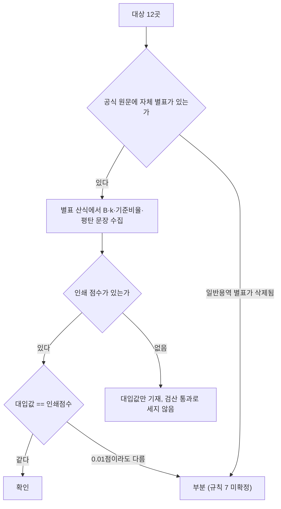

# 지자체 일반용역 적격심사 입찰가격 산식 공식 원문 수집 (12곳)

> **작성일**: 2026-10-04
> **작업**: Orca Task `task_58ea8ddab6fb` (builder, `run_03599ec1fd4a`)
> **목적**: 행정안전부 예규를 포함한 지자체 12곳의 일반용역 적격심사 입찰가격 평점 산식을 공식 원문에서 수집해 등급을 매기고 근거(파일 경로:행)를 남긴다.
> **범위 경계**: 코드·설정·패키지 파일을 바꾸지 않았습니다. `src/app/services/evaluation_rules.py` 에 계수를 입력하지 않았습니다. 산출물은 이 문서 하나입니다.
> **원문 추출물 위치**: `.orca/capsules/task_58ea8ddab6fb/external/<기관>/` 이며 커밋하지 않습니다. 이 문서는 `.orca/` 를 마크다운 링크로 걸지 않고 인라인 코드로만 언급합니다.
> **확인 날짜**: 아래 12곳 모두 2026-10-04 확인.
> **경로 약칭**: 표와 인용에서 `EXT` 는 `.orca/capsules/task_58ea8ddab6fb/external` 을 뜻합니다.
> **결론**: 12곳 모두 등급을 매겼습니다. 확인 10곳, 부분 2곳(대구광역시, 경기도)입니다. 조달청 별표 숫자를 지자체 계수로 옮긴 곳은 없습니다.

---

## 1. 요약

| # | 대상 | 등급 | 문서명 (문서번호) | 시행일 | 핵심 한 줄 |
| ---: | --- | --- | --- | --- | --- |
| 1 | 행정안전부 | 확인 | 지방자치단체 입찰시 낙찰자 결정기준 (행정안전부예규 제373호) | 2026-07-01 | 제2장의2 별표 1·2·4. 기준비율 88, k는 구간별 1/2/4/20(별표 2), 인쇄 점수 전부 일치 |
| 2 | 인천광역시 | 확인 | 인천광역시 일반용역 적격심사 세부기준 (예규 제488호) | 2025-12-24 | 별표 1. B 30/50/70/90, k 1/2/4/20(단순노무 20), 기준 88, 인쇄 점수 전부 일치 |
| 3 | 제주특별자치도 | 확인 | 제주특별자치도 일반용역 적격심사 세부기준 (예규 제82호) | 2024-01-01 | 인천과 같은 구간 구조. 기준 88, 인쇄 점수 전부 일치 |
| 4 | 강원특별자치도 | 확인 | 강원특별자치도 일반용역 적격심사 세부기준 (예규 제832호) | 2023-06-11 | 인천과 같은 구간 구조. 기준 88, 인쇄 점수 전부 일치 |
| 5 | 대구광역시 | 부분 | 대구광역시 일반용역 적격심사 세부기준 (예규 제238호) | 2026-05-11 | 별표 1 단순노무만 남음(일반용역 단순노무 외 별표는 2022.9.30. 삭제). B 60/70, k 60, 기준 88, 원문 점수 미인쇄 |
| 6 | 세종특별자치시 | 확인 | 세종특별자치시 일반용역 적격심사 세부기준 (예규 제32호) | 2025-12-01 | 시설·폐기물·생활폐기물 k 60, 소프트웨어·육상운송 k 2(중소기업간 경쟁제품 비대상)/4(대상), 기준 88, 원문 점수 미인쇄 |
| 7 | 경상북도 | 확인 | 경상북도 일반용역 등 적격심사 세부기준 (예규 제1571호) | 2026-01-08 | 단순노무 k 20(45/65 인쇄), 소프트웨어 두 구간 식 하나(k 4), 폐기물·기타 k 4/20 |
| 8 | 울산광역시 | 확인 | 울산광역시 일반용역 적격심사 세부기준 (공고 제2022-1100호) | 2022-08-10 | 별표 1 일반용역 4구간 k 1/2/4/20, 단순노무 행 별도(20). 이후 대체 원문 미확인 |
| 9 | 충청북도 | 확인 | 충청북도 일반용역 적격심사 세부기준 (공고 제2023-1428호) | 2023-10-20 | 별표 1 4구간 k 1/2/4/20 및 단순노무 20. 2억 미만 산식 확보(90 − 20×) |
| 10 | 전남광주통합특별시 | 확인 | 전남광주통합특별시 일반용역 적격심사 세부지침 (예규 제3호) | 2026-07-16 | 별표 1~6 확보. 별표 4(30/60→15) 확정, 종전 짝짓기 오류 해소 |
| 11 | 경상남도 | 확인 | 경상남도 일반용역 등 적격심사 세부기준 (공고 제2023-23호) | 2023-01-05 | 종전 미확정 분자 88 확정. 별표 1 4구간 k 1/2/4/20, 인쇄 점수 전부 일치 |
| 12 | 경기도 | 부분 | 경기도 일반용역 적격심사 세부기준 지침 (예규 제748호) | 2025-08-08 | 별표 1-1 단순노무 예외 상수 0.25 불일치로 미확정. 별표 1-2~1-6·보험은 확정 |

**등급 집계**: 확인 10곳, 부분 2곳, 미확인 0곳, 조달청 준용 0곳.

**전 대상 공통**: 평점 산식은 `평점 = B − k × |(기준/100 − 입찰가격/예정가격) × 100|` 이고, 확인된 기관·별표의 기준비율은 모두 88입니다(경기도 별표 1-1만 89). 조달청 별표 숫자를 옮긴 곳은 없으며, 12곳 모두 자체 별표에 산식이 직접 인쇄되어 있어 조달청 준용으로 내려간 대상은 없습니다.

---

## 2. 판정 규칙 (2026-09-30 수집 세션 3절 그대로 적용)

1. 상업 페이지(bidpro, 비드큐, info21c, 모두입찰, korbid, igunsul, 블로그)의 계수는 베끼지 않는다. 제목과 날짜 단서만 쓴다.
2. 나라장터 첨부는 파일 머리말이 그 기관 규정일 때만 원문이다. 개별 공고 배점표는 전사 규정이 아니다.
3. 조달청 준용 조항만 있으면 조항, 개정 표시, 시행일만 인용한다. 조달청 별표 숫자를 그 기관 계수로 옮기지 않는다.
4. 평점 = B − k × |(기준/100 − 입찰가격/예정가격) × 100|. B는 그 별표의 입찰가격 배점한도다.
5. 계수가 생략되고 평탄 대입이 인쇄 점수와 맞을 때만 k=1. 평탄 문장이 없으면 k=1로 두지 않는다.
6. 평탄 비율과 낙찰하한율로 k를 역산하지 않는다.
7. 대입 결과가 인쇄 점수와 다르면 그 행은 미확정이다. 0.01점 차이도 미확정이다. 원문이 비율만 적고 점수를 인쇄하지 않으면 대입값을 적고 원문이 그렇게 말한다고 밝힌다.
8. 5억 열과 고시금액 산식은 감점이 같아도 짝짓지 않는다.
9. 접속 실패, DNS 실패, 시간 초과는 문서가 없다는 증거가 아니다.
10. 시·도는 그 시의 가격 별표를 읽기 전에는 행정안전부 예규 제373호(규모 구간, 기준비율 88%)에 둔다. 예규는 시·도별로 식을 나누지 않는다.

---

## 3. 수집 방법과 도구

- **출처 우선순위**: 국가법령정보센터(law.go.kr) > 기관 공식 홈페이지 > 기관 전자조달·계약정보공개시스템 > 공공기관 게시자료 > 나라장터 첨부(머리말이 그 기관 규정일 때만). 지자체는 자치법규정보시스템(elis.go.kr)을 공식 출처로 썼습니다.
- **문서 추출(일회성 실행, 프로젝트 의존성에 추가하지 않음)**: PDF는 `uvx --from pdfminer.six pdf2txt.py <파일>`, HWP는 `uvx --from pyhwp --with six hwp5txt <파일>` 및 표 셀 보존이 필요할 때 `hwp5html --output=<디렉터리>`, HWPX는 `python3 zipfile` 로 `Contents/section*.xml` 을 읽었습니다. 내려받기는 `curl -L -m 30`.
- **설치 금지 준수**: `pip install`, `uv add`, `brew install` 을 쓰지 않았습니다. `uvx` 일회성 실행만 사용했습니다.
- **저장 위치**: 원본과 추출 텍스트는 모두 `.orca/capsules/task_58ea8ddab6fb/external/<기관>/` 아래에만 두었고 커밋하지 않습니다.
- **주의**: HWP 표는 `hwp5txt` 로는 `<표>` 로 소실되므로 표 셀은 `hwp5html`·`hwp5proc xml` 로 재구성했습니다. 나라장터 첨부 PDF처럼 좌표 기반으로만 읽히는 문서는 좌표 디코딩 텍스트를 근거로 썼습니다(경기도).

---

## 4. 대상별 결과

### 4.1 행정안전부 — 확인

| 항목 | 값 |
| --- | --- |
| 문서명 | 지방자치단체 입찰시 낙찰자 결정기준 |
| 문서번호 | 행정안전부예규 제373호, 2026. 6. 29. 일부개정 |
| 시행일 | 2026. 7. 1. |
| 출처 URL | `https://www.mois.go.kr/frt/bbs/type001/commonSelectBoardArticle.do?bbsId=BBSMSTR_000000000016&nttId=127353` (행정안전부 개정전문). 교차: 국가법령정보센터 `https://law.go.kr/LSW/admRulLsInfoP.do?admRulId=36201` |
| 확인 날짜 | 2026-10-04 |
| 원본 파일 | `EXT/mois/mois_373_nakchal.hwpx` (1,482,053 B), 추출 `EXT/mois/mois373_body.txt` |
| 등급 | 확인 |

문서 머리말 `EXT/mois/mois373_body.txt:1` = `[시행 2026. 7. 1.][행정안전부 예규 제373호, 2026. 6. 29. 일부개정]`. 통과점수는 `EXT/mois/mois373_body.txt:7273` — 기술용역 추정가격 10억원 이상 92점, 10억원 미만 95점, 학술연구용역 85점. 아래 표의 인용은 모두 `EXT/mois/mois373_body.txt` 입니다.

**제2장의2 [별표 1] P.Q 대상 기술용역**

| 적용 구간 | B | k | 기준비율 | 평탄 문장(원문) | 인쇄점수 | 대입 검산 |
| --- | ---: | ---: | ---: | --- | ---: | --- |
| 추정가격 10억원 이상 | 30 (`:7482`) | 1(계수 생략) | 88 (`:7484`) | 추정가격의 100분의 96 이상 → 22점 (`:7494`) | 22 | 30−1×\|0.88−0.96\|×100 = **22.0000** 일치 |
| 10억원 미만 5억원 이상 | 50 (`:7556`) | 2 (`:7556`) | 88 (`:7558`) | 100분의 90.5 이상 → 45점 (`:7569`) | 45 | 50−2×2.5 = **45.0000** 일치 |
| 5억원 미만 | 60 (`:7634`) | 4 (`:7634`) | 88 (`:7636`) | 100분의 89.25 이상 → 55점 (`:7647`) | 55 | 60−4×1.25 = **55.0000** 일치 |

최저평점: 세 구간 모두 산식 말미 `최저평점은 2점으로 한다` (`:7495`, `:7568`, `:7646`).

**제2장의2 [별표 2] P.Q 미대상 기술용역 (일반용역 상당)**

| 적용 구간 | B | k | 기준비율 | 평탄 문장(원문) | 인쇄점수 | 대입 검산 |
| --- | ---: | ---: | ---: | --- | ---: | --- |
| 추정가격 10억원 이상 | 30 (`:7896`) | 1(계수 생략) | 88 (`:7898`) | 100분의 96 이상 → 22점 (`:7908`) | 22 | **22.0000** 일치 |
| 10억원 미만 5억원 이상 | 50 (`:8101`) | 2 (`:8101`) | 88 (`:8103`) | 100분의 90.5 이상 → 45점 (`:8113`) | 45 | **45.0000** 일치 |
| 5억원 미만 2억원 이상 | 50 (`:8309`) | 4 (`:8309`) | 88 (`:8311`) | 100분의 89.25 이상 → 45점 (`:8321`) | 45 | **45.0000** 일치 |
| 2억원 미만 1억원 이상 | 80 (`:8501`) | 20 (`:8501`) | 88 (`:8503`) | 100분의 88.25 이상 → 75점 (`:8513`) | 75 | 80−20×0.25 = **75.0000** 일치 |
| 1억원 미만 | 90 (`:8593`, `:8661`) | 20 (`:8661`) | 88 (`:8663`) | 100분의 88.25 이상 → 85점 (`:8673`) | 85 | 90−20×0.25 = **85.0000** 일치 |

최저평점: 다섯 구간 모두 `최저평점은 2점으로 한다` (`:7909`, `:8114`, `:8322`, `:8514`, `:8674`).

**제2장의2 [별표 4] 학술연구용역**

| 적용 구간 | B | k | 기준비율 | 평탄 문장(원문) | 인쇄점수 | 대입 검산 |
| --- | ---: | ---: | ---: | --- | ---: | --- |
| 추정가격 2억원 이상 | 30 (`:9090`) | 2 (`:9321`) | 88 (`:9325`) | 100분의 95.5 이상 → 15점 (`:9340`) | 15 | 30−2×7.5 = **15.0000** 일치 |
| 2억원 미만 1억원 이상 | 60 (`:9091`) | 2 (`:9321`) | 88 (`:9325`) | 100분의 95.5 이상 → 45점 (`:9340`) | 45 | 60−15 = **45.0000** 일치 |
| 1억원 미만 | 65 (`:9092`) | 2 (`:9321`) | 88 (`:9325`) | 100분의 95.5 이상 → 50점 (`:9340`) | 50 | 65−15 = **50.0000** 일치 |

최저평점 2점 (`:9343`). 세 별표 모두 인쇄 점수와 대입값이 0.01점 차이도 없이 일치합니다.

### 4.2 인천광역시 — 확인

| 항목 | 값 |
| --- | --- |
| 문서명 | 인천광역시 일반용역 적격심사 세부기준 |
| 문서번호 | 인천광역시 예규 제488호 (일부개정 2025-12-08). 제정은 예규 제430호(2006-03-20) |
| 시행일 | 2025. 12. 24. |
| 출처 URL | `https://www.elis.go.kr/allalr/selectAlrBdtOne?alrNo=28000032005015&histNo=008` (ELIS). 보조: `https://www.incheon.go.kr/contract/CTRT050100/` 게시목록에 "인천광역시 일반용역 적격심사 세부기준(2025-12-24 시행)" 노출 |
| 확인 날짜 | 2026-10-04 |
| 원본 파일 | `EXT/inan/att008/[별표 1] 일반용역 적격심사 세부기준.hwp`, 추출 `EXT/inan/tbl1_008.txt` |
| 등급 | 확인 |

문서 머리말 `EXT/inan/elis_inan_008.txt:91` = `[시행 2025.12.24]`, `:92` = `(일부개정) 2025-12-08 예규 제 488호`. 통과점수 `EXT/inan/elis_inan_008.txt:144` — 30억원 이상 85점, 30억원 미만 10억원 이상 90점, 10억원 미만 95점, 단순노무 95점. 아래 표의 인용은 `EXT/inan/tbl1_008.txt` 입니다.

| 적용 구간 | B | k | 기준비율 | 평탄 문장(원문) | 인쇄점수 | 대입 검산 |
| --- | ---: | ---: | ---: | --- | ---: | --- |
| 10억원 이상, 단순노무 외 | 30 (`:70`) | 1(계수 생략 `:57`) | 88 (`:61`) | 30억원 미만 10억원 이상, 100분의 98 이상 → 20점 (`:69`) | 20 | 30−10 = **20.0000** 일치 |
| 10억원 이상, 단순노무 | 30 (`:70`) | 20 (`:74`) | 88 (`:64`) | 100분의 88.25 이상 → 25점 (`:86`) | 25 | 30−5 = **25.0000** 일치 |
| 10억원 미만 5억원 이상, 단순노무 외 | 50 (`:327`) | 2 (`:302`) | 88 (`:306`) | 100분의 90.5 이상 → 45점 (`:314`) | 45 | 50−5 = **45.0000** 일치 |
| 10억원 미만 5억원 이상, 단순노무 | 50 (`:327`) | 20 (`:315`) | 88 (`:319`) | 100분의 88.25 이상 → 45점 (`:330`) | 45 | 50−5 = **45.0000** 일치 |
| 5억원 미만 2억원 이상, 단순노무 외 | 70 (`:560`) | 4 (`:547`) | 88 (`:551`) | 100분의 89.25 이상 → 65점 (`:559`) | 65 | 70−5 = **65.0000** 일치 |
| 5억원 미만 2억원 이상, 단순노무 | 70 (`:560`) | 20 (`:564`) | 88 (`:568`) | 100분의 88.25 이상 → 65점 (`:576`) | 65 | 70−5 = **65.0000** 일치 |
| 2억원 미만 (단순노무 포함) | 90 (`:793`) | 20 (`:781`) | 88 (`:785`) | 100분의 88.25 이상 → 85점 (`:792`) | 85 | 90−5 = **85.0000** 일치 |

최저평점 2점 (`:90`, `:334`, `:580`, `:798`). 준용 조항: 제10조 "「지방자치단체 입찰시 낙찰자 결정기준」 및 「지방자치단체 입찰 및 계약 집행기준」 등의 예규에서 정한 바에 따른다" (`EXT/inan/elis_inan_008.txt:171`). 이 준용은 소수점 처리 등에 한정하며, 계수는 자체 별표에서 읽었습니다.

### 4.3 제주특별자치도 — 확인

| 항목 | 값 |
| --- | --- |
| 문서명 | 제주특별자치도 일반용역 적격심사 세부기준 |
| 문서번호 | 제주특별자치도 예규 제82호 (일부개정 2023-12-13) |
| 시행일 | 2024. 1. 1. |
| 출처 URL | `https://www.elis.go.kr/allalr/selectAlrBdtOne?alrNo=50000006014013&histNo=003` (ELIS) |
| 확인 날짜 | 2026-10-04 |
| 원본 파일 | `EXT/jeju/att/[별표 1] 일반용역 적격심사 심사항목 및 배점기준.hwp`, 추출 `EXT/jeju/tbl1_jeju.txt` |
| 등급 | 확인 |

문서 머리말 `EXT/jeju/elis_jeju_main.txt:80` = `[시행 2024.01.01]`, `:81` = `(일부개정) 2023-12-13 예규 제 82호`. 통과점수 `EXT/jeju/elis_jeju_main.txt:127` — 30억원 이상 85점, 30억원 미만 10억원 이상 90점, 10억원 미만 95점, 단순노무 95점. 아래 표의 인용은 `EXT/jeju/tbl1_jeju.txt` 입니다.

| 적용 구간 | B | k | 기준비율 | 평탄 문장(원문) | 인쇄점수 | 대입 검산 |
| --- | ---: | ---: | ---: | --- | ---: | --- |
| 10억원 이상, 단순노무 외 | 30 (`:223`) | 1(계수 생략) | 88 (`:223`) | 30억원 미만 10억원 이상, 100분의 98 이상 → 20점 (`:224`) | 20 | **20.0000** 일치 |
| 10억원 이상, 단순노무 | 30 (`:225`) | 20 (`:225`) | 88 (`:225`) | 100분의 88.25 이상 → 25점 (`:226`) | 25 | **25.0000** 일치 |
| 10억원 미만 5억원 이상, 단순노무 외 | 50 (`:448`) | 2 (`:448`) | 88 (`:448`) | 100분의 90.5 이상 → 45점 (`:449`) | 45 | **45.0000** 일치 |
| 10억원 미만 5억원 이상, 단순노무 | 50 (`:451`) | 20 (`:451`) | 88 (`:451`) | 100분의 88.25 이상 → 45점 (`:452`) | 45 | **45.0000** 일치 |
| 5억원 미만 2억원 이상, 단순노무 외 | 70 (`:674`) | 4 (`:674`) | 88 (`:674`) | 100분의 89.25 이상 → 65점 (`:675`) | 65 | **65.0000** 일치 |
| 5억원 미만 2억원 이상, 단순노무 | 70 (`:677`) | 20 (`:677`) | 88 (`:677`) | 100분의 88.25 이상 → 65점 (`:678`) | 65 | **65.0000** 일치 |
| 2억원 미만, 단순노무 외 | 90 (`:882`) | 20 (`:882`) | 88 (`:882`) | 100분의 88.25 이상 → 85점 (`:883`) | 85 | **85.0000** 일치 |
| 2억원 미만, 단순노무 | 90 (`:885`) | 20 (`:885`) | 88 (`:885`) | 100분의 88.25 이상 → 85점 (`:886`) | 85 | **85.0000** 일치 |

최저평점 2점 (`:229`, `:455`, `:681`, `:889`). 준용 조항: 제7조 "정하지 아니한 사항은 관련 회계예규 등을 준용" (`EXT/jeju/elis_jeju_main.txt:140`).

### 4.4 강원특별자치도 — 확인

| 항목 | 값 |
| --- | --- |
| 문서명 | 강원특별자치도 일반용역 적격심사 세부기준 |
| 문서번호 | 강원특별자치도(강원도) 예규 제832호 (제정, 전부개정지침) |
| 시행일 | 2023. 6. 11. |
| 출처 URL | `https://www.elis.go.kr/allalr/selectAlrBdtOne?alrNo=42000035005022&histNo=001` (ELIS) |
| 확인 날짜 | 2026-10-04 |
| 원본 파일 | `EXT/gwd/att/[별표1] 일반용역 적격심사.hwp`, 추출 `EXT/gwd/tbl1_gwd.txt` |
| 등급 | 확인 |

문서 머리말 `EXT/gwd/elis_gwd_main.txt:232` = `[시행 2023.06.11]`, `:233` = `(제정) 2023-05-26 예규 제 832호 강원도 일반용역 적격심사 세부기준 전부개정지침`. 부칙 `:311` "이 세부기준은 2023년 6월 11일부터 시행한다." 통과점수 `EXT/gwd/elis_gwd_main.txt:276` — 30억원 이상 85점, 30억원 미만 10억원 이상 90점, 10억원 미만 95점, 생활폐기물 수집·운반 대행용역 별도. 아래 표의 인용은 `EXT/gwd/tbl1_gwd.txt` 입니다.

| 적용 구간 | B | k | 기준비율 | 평탄 문장(원문) | 인쇄점수 | 대입 검산 |
| --- | ---: | ---: | ---: | --- | ---: | --- |
| 10억원 이상, 단순노무 외 | 30 (`:59`) | 1(계수 생략 `:54`) | 88 (`:53`) | 30억원 미만 10억원 이상, 100분의 98 이상 → 20점 (`:55`) | 20 | **20.0000** 일치 |
| 10억원 이상, 단순노무 | 30 (`:125`) | 20 (`:120`) | 88 (`:119`) | 100분의 88.25 이상 → 25점 (`:121`) | 25 | **25.0000** 일치 |
| 10억원 미만 5억원 이상, 단순노무 외 | 50 (`:338`) | 2 (`:332`) | 88 (`:331`) | 100분의 90.5 이상 → 45점 (`:334`) | 45 | **45.0000** 일치 |
| 10억원 미만 5억원 이상, 단순노무 | 50 (`:403`) | 20 (`:398`) | 88 (`:397`) | 100분의 88.25 이상 → 45점 (`:399`) | 45 | **45.0000** 일치 |
| 5억원 미만 2억원 이상, 단순노무 외 | 70 (`:616`) | 4 (`:610`) | 88 (`:609`) | 100분의 89.25 이상 → 65점 (`:612`) | 65 | **65.0000** 일치 |
| 5억원 미만 2억원 이상, 단순노무 | 70 (`:682`) | 20 (`:676`) | 88 (`:675`) | 100분의 88.25 이상 → 65점 (`:678`) | 65 | **65.0000** 일치 |
| 2억원 미만, 단순노무 외 | 90 (`:889`) | 20 (`:883`) | 88 (`:882`) | 100분의 88.25 이상 → 85점 (`:885`) | 85 | **85.0000** 일치 |
| 2억원 미만, 단순노무 | 90 (`:941`) | 20 (`:936`) | 88 (`:935`) | 100분의 88.25 이상 → 85점 (`:937`) | 85 | **85.0000** 일치 |

최저평점 2점 (`:58`, `:124`, `:337`, `:402`, `:615`, `:681`, `:888`, `:940`). 준용 조항: 제11조 "「지방자치단체 입찰시 낙찰자 결정기준」 및 「지방자치단체 입찰 및 계약 집행기준」 등에서 정한 바에 따른다" (`EXT/gwd/elis_gwd_main.txt:306`).

### 4.5 대구광역시 — 부분

| 항목 | 값 |
| --- | --- |
| 문서명 | 대구광역시 일반용역 적격심사 세부기준 |
| 문서번호 | 대구광역시 예규 제238호 (일부개정 2026-05-11). 직전본 예규 제223호(2022-09-30) |
| 시행일 | 2026. 5. 11. |
| 출처 URL | `https://www.elis.go.kr/allalr/selectAlrBdtOne?alrNo=27000005004039&histNo=008` (ELIS) |
| 확인 날짜 | 2026-10-04 |
| 원본 파일 | `EXT/daegu/att008/[별표 1] 단순노무 일반용역 적격심사 평가기준.hwp`, 추출 `EXT/daegu/tbl1_daegu.txt` |
| 등급 | 부분 |

**부분 사유**: 제4조① 각 호에서 "2. 삭제 <2022.9.30.>" 로 일반용역(단순노무 외) 평가기준 별표가 삭제되어(`EXT/daegu/elis_daegu_main.txt:165`~`:171`), 이 예규만으로는 일반용역(단순노무 외) 입찰가격 산식을 확정할 수 없습니다. 삭제된 별표 원본 스텁도 "【별표 2】 삭제 <2022.9.30.>" 로 확인됩니다. 남은 것은 단순노무·소프트웨어·폐기물처리·육상운송 별표이며, 일반용역(단순노무 외)은 행정안전부 예규(4.1)로 넘어갑니다. 준용: 제12조 (`EXT/daegu/elis_daegu_main.txt:218`).

통과점수 `EXT/daegu/elis_daegu_main.txt:196` — 85점(소프트웨어·육상운송 중소기업자간 경쟁대상 88점). 아래 표의 인용은 `EXT/daegu/tbl1_daegu.txt` 입니다.

| 적용 구간 | B | k | 기준비율 | 평탄 문장(원문) | 인쇄점수 | 대입값 |
| --- | ---: | ---: | ---: | --- | --- | --- |
| 추정가격 2억원 이상 | 60 (`:52`) | 60 (`:69`) | 88 (`:71`) | "입찰가격이 예정가격 이하로서 예정가격의 88.25% 이상인 경우에는 … 88.25%인 경우의 점수로 평가한다" (`:81`–`:82`) | 미인쇄 | 60−60×0.25 = **45.0000** (원문 미인쇄로 검산 통과 아님) |
| 추정가격 2억원 미만 | 70 (`:53`) | 60 (`:69`) | 88 (`:71`) | 상동 (`:81`–`:82`) | 미인쇄 | 70−15 = **55.0000** (원문 미인쇄) |

최저평점: 별표 1에 명시 없음. 산식 원문: `평점(점) = 배점한도 − 60 × |(88/100 − 입찰가격/예정가격)×100|` (`:69`), `｜｜는 절대값 표시임` (`:83`).

### 4.6 세종특별자치시 — 확인

| 항목 | 값 |
| --- | --- |
| 문서명 | 세종특별자치시 일반용역 적격심사 세부기준 |
| 문서번호 | 세종특별자치시 예규 제32호 (일부개정 2025.11.14). 직전본 예규 제24호(2022.09.01) |
| 시행일 | 2025. 12. 1. |
| 출처 URL | `https://www.elis.go.kr/allalr/selectAlrBdtOne?alrNo=36110115281011&histNo=005` (ELIS) |
| 확인 날짜 | 2026-10-04 |
| 원본 파일 | `EXT/sejong/byp2_2025.hwp`(시설), `byp3_sw_2025.hwp`(SW), `byp4_2025.hwp`(폐기물), `byp4_2_2025.hwp`(생활폐기물), `byp5_2025.hwp`(육상운송). 추출 `EXT/sejong/byp*_2025.tbl.txt`, 본문 `EXT/sejong/sejong_body_2025.txt` |
| 등급 | 확인 |

문서 머리말 `EXT/sejong/sejong_body_2025.txt:3` = `[시행 2025.12.01]`, `:5` = `(일부개정) 2025.11.14 예규 제32호`. 통과점수 `EXT/sejong/sejong_body_2025.txt:108` — 85점(소프트웨어·육상운송 중소기업자간 경쟁제품 88점). 최저평점·평탄 점수는 원문 미기재(비율만 인쇄). 아래 표에서 B는 두 열(5억원 이상 / 5억원 미만), 평탄은 해당 별표 .txt 행입니다.

| 별표(대상) | B | k | 기준비율 | 평탄 문장(원문) | 인쇄점수 | 대입값 |
| --- | ---: | ---: | ---: | --- | --- | --- |
| 별표 2 시설분야용역 | 60 / 70 (`byp2_2025.tbl.txt:10`) | 60 (`byp2_2025.tbl.txt:17`) | 88 (`byp2_2025.tbl.txt:17`) | 88.25% 이상 → 88.25% 점수 (`byp2_2025.txt:37`) | 미인쇄 | 45.0000 / 55.0000 |
| 별표 3 소프트웨어용역 | 60 / 70 (`byp3_sw_2025.tbl.txt:10`) | 비대상 2 (`:14`) / 대상 4 (`:17`) | 88 (`:14`,`:17`) | 비대상 95.5% (`byp3_sw_2025.txt:23`) / 대상 91% (`:31`) | 미인쇄 | 비대상 45.0000 / 55.0000, 대상 48.0000 / 58.0000 |
| 별표 4 폐기물처리용역 | 60 / 70 (`byp4_2025.tbl.txt:11`) | 60 (`byp4_2025.tbl.txt:21`) | 88 (`:21`) | 88.25% 이상 (`byp4_2025.txt:24`) | 미인쇄 | 45.0000 / 55.0000 |
| 별표 4의2 생활폐기물처리용역 | 60 / 70 (`byp4_2_2025.tbl.txt:10`) | 60 (`byp4_2_2025.tbl.txt:13`) | 88 (`:13`) | 88.25% 이상 (`byp4_2_2025.txt:17`) | 미인쇄 | 45.0000 / 55.0000 |
| 별표 5 육상운송용역 | 60 / 70 (`byp5_2025.tbl.txt:10`) | 비대상 2 (`:20`) / 대상 4 (`:23`) | 88 (`:20`,`:23`) | 비대상 95.5% (`byp5_2025.txt:26`) / 대상 91% (`:34`) | 미인쇄 | 비대상 45.0000 / 55.0000, 대상 48.0000 / 58.0000 |

원문이 평탄 비율만 인쇄하고 점수를 인쇄하지 않으므로, 규칙 7에 따라 대입값을 적고 검산 통과로 세지 않습니다.

**정정 (2026-10-05)**: 별표 3·5 의 k 2/4 는 가격 구간이 아니라 **중소기업간 경쟁제품 해당 여부**로 갈립니다(`byp3_sw_2025.txt:16-34`, `byp5_2025.txt:19-34` 의 가) 비대상 / 나) 대상 절). 비대상은 k 2·평점산식 표기 80.495%·평탄 95.5%·통과점수 85점, 대상은 k 4·84.995%·평탄 91%·통과점수 88점이며, B 는 두 경우 모두 5억원 이상 60, 미만 70 입니다. 최초 수집 때 이 표의 k 와 평탄 열을 가격 구간 두 열로 읽었고, 대입값도 B 60 한 열만 적었습니다. 대입값은 B 60 / B 70 순입니다. 구현은 `_SME` rule_id 로 대상을 분리했습니다(`src/app/services/evaluation_rules.py`).

계수 60은 hwp5txt·hwp5proc xml·hwp5html 세 추출기에서 동일하게 `배점한도 − 60 ×` 로 나왔습니다.

### 4.7 경상북도 — 확인

| 항목 | 값 |
| --- | --- |
| 문서명 | 경상북도 일반용역 등 적격심사 세부기준 |
| 문서번호 | 경상북도 예규 제1571호 (일부개정 2026-01-08). 직전본 예규 제1568호(2024-12-12) |
| 시행일 | 2026. 1. 8. |
| 출처 URL | `https://www.elis.go.kr/allalr/selectAlrBdtOne?alrNo=47000006006048&histNo=009` (ELIS) |
| 확인 날짜 | 2026-10-04 |
| 원본 파일 | `EXT/gb/gb_byp001.hwp`(단순노무), `gb_byp002.hwp`(소프트웨어), `gb_byp003.hwp`(폐기물), `gb_byp004.hwp`(기타). 추출 `EXT/gb/gb_byp00*.tbl.txt`, 본문 `EXT/gb/gb_body.txt` |
| 등급 | 확인 |

문서 머리말 `EXT/gb/gb_body.txt:3` = `[시행 2026.01.08]`, `:5` = `(일부개정) 2026-01-08 예규 제 1571호`. 통과점수 `EXT/gb/gb_body.txt:140` — 95점(소프트웨어용역 88점). 최저평점 2점.

| 별표(대상) | B | k | 기준비율 | 평탄 문장(원문) | 인쇄점수 | 대입 검산 |
| --- | ---: | ---: | ---: | --- | ---: | --- |
| 별표 1 단순노무용역 ㉮ 5억원 이상 | 50 (`gb_byp001.tbl.txt:10`) | 20 (`:13`) | 88 (`:13`) | 투찰률 88.25% 이상 → 45점 (`:13`) | 45 | 50−20×0.25 = **45.0000** 일치 |
| 별표 1 단순노무용역 ㉯ 5억원 미만 | 70 (`gb_byp001.tbl.txt:10`) | 20 (`:13`) | 88 (`:13`) | 투찰률 88.25% 이상 → 65점 (`:13`) | 65 | 70−5 = **65.0000** 일치 |
| 별표 2 소프트웨어용역 (두 구간에 식 하나) | 60 / 80 (`gb_byp002.tbl.txt:10`) | 4 (`:14`) | 88 (`:14`) | 예정가격의 91% 이상 → 91% 점수 (`:16`) | 미인쇄 | 48.0000 / 68.0000 |
| 별표 3 폐기물처리용역 ㉮ 5억원 이상 | 50 (`gb_byp003.tbl.txt:9`) | 4 (`:12`) | 88 (`:12`) | 100분의 89.25 이상 → 45점 (`:12`) | 45 | 50−5 = **45.0000** 일치 |
| 별표 3 폐기물처리용역 ㉯ 5억원 미만 | 70 (`gb_byp003.tbl.txt:9`) | 20 (`:12`) | 88 (`:12`) | 100분의 88.25 이상 → 65점 (`:12`) | 65 | 70−5 = **65.0000** 일치 |
| 별표 4 기타 일반용역 ㉮ 5억원 이상 | 50 (`gb_byp004.tbl.txt:9`) | 4 (`:12`) | 88 (`:12`) | 투찰률 89.25% 이상 → 45점 (`:12`) | 45 | 50−5 = **45.0000** 일치 |
| 별표 4 기타 일반용역 ㉯ 5억원 미만 | 70 (`gb_byp004.tbl.txt:9`) | 20 (`:12`) | 88 (`:12`) | 투찰률 88.25% 이상 → 65점 (`:12`) | 65 | 70−5 = **65.0000** 일치 |

단서 확인: "경북 소프트웨어는 두 구간에 식 하나"는 그대로 확인됩니다 — `gb_byp002.tbl.txt:14` 의 단일 산식(`배점한도 − 4×|…|`, 기준 88, 평탄 91%)이 5억원 이상(B=60)·5억원 미만(B=80) 두 열에 적용됩니다. 이 행은 비율만 인쇄되어 대입값만 적습니다.

### 4.8 울산광역시 — 확인 (공고 제2022-1100호가 확인 최신본, 이후 대체 원문 미확인)

| 항목 | 값 |
| --- | --- |
| 문서명 | 울산광역시 일반용역 적격심사 세부기준 |
| 문서번호 | 울산광역시 공고 제2022-1100호 (일부개정 2022-07-21) |
| 시행일 | 2022. 8. 10. (2022.08.10. 입찰공고분부터 적용). 부칙에서 종전 공고 제2019-1401호 폐지 |
| 출처 URL | 계약정보시스템 `https://contract.ulsan.go.kr/contract/info/regulations?idx=314&mode=view`, 고시공고 `https://www.ulsan.go.kr/u/rep/transfer/notice/34811.ulsan?mId=001004002000000000&gosiGbn=A` |
| 확인 날짜 | 2026-10-04 |
| 원본 파일 | `EXT/ulsan/ulsan_general_20220810.hwp`, 추출 `EXT/ulsan/ulsan_general_20220810.tbl.txt`, 고시공고 `EXT/ulsan/ulsan_notice.html` |
| 등급 | 확인 |

통과점수 `EXT/ulsan/ulsan_general_20220810.txt:46` — 30억원 이상 85점, 30억원 미만 10억원 이상 90점, 10억원 미만 95점, 단순노무 95점. 아래 표의 인용은 `EXT/ulsan/ulsan_general_20220810.tbl.txt` 입니다.

| 별표·적용 구간 | B | k | 기준비율 | 평탄 문장(원문) | 인쇄점수 | 대입 검산 |
| --- | ---: | ---: | ---: | --- | ---: | --- |
| 별표 1, 10억원 이상, 단순노무 외 | 30 (`:15`) | 1(계수 생략 `:15`) | 88 (`:15`) | 30억원 미만 10억원 이상, 100분의 98 이상 → 20점 (`:15`) | 20 | 30−10 = **20.0000** 일치(k=1 확정) |
| 별표 1, 10억원 이상, 단순노무 | 30 (`:16`) | 20 (`:16`) | 88 (`:16`) | 100분의 88.25 이상 → 25점 (`:16`) | 25 | 30−5 = **25.0000** 일치 |
| 별표 1, 10억원 미만 5억원 이상, 단순노무 외 | 50 (`:59`) | 2 (`:59`) | 88 (`:59`) | 100분의 90.5 이상 → 45점 (`:59`) | 45 | **45.0000** 일치 |
| 별표 1, 10억원 미만 5억원 이상, 단순노무 | 50 (`:60`) | 20 (`:60`) | 88 (`:60`) | 100분의 88.25 이상 → 45점 (`:60`) | 45 | **45.0000** 일치 |
| 별표 1, 5억원 미만 2억원 이상, 단순노무 외 | 70 (`:103`) | 4 (`:103`) | 88 (`:103`) | 100분의 89.25 이상 → 65점 (`:103`) | 65 | **65.0000** 일치 |
| 별표 1, 5억원 미만 2억원 이상, 단순노무 | 70 (`:104`) | 20 (`:104`) | 88 (`:104`) | 100분의 88.25 이상 → 65점 (`:104`) | 65 | **65.0000** 일치 |
| 별표 1, 2억원 미만 (단순노무 포함) | 90 (`:146`,`:147`) | 20 (`:146`,`:147`) | 88 (`:146`) | 100분의 88.25 이상 → 85점 (`:146`) | 85 | **85.0000** 일치 |
| 별표 1-1 생활폐기물 수집·운반 대행, 30억원 이상 | 30 (`:194`) | 40 (`:194`) | 88 (`:194`) | 100분의 88.25 이상 → 20점 (`:194`) | 20 | 30−10 = **20.0000** 일치 |
| 별표 1-1, 30억원 미만 10억원 이상 | 50 (`:240`) | 20 (`:240`) | 88 (`:240`) | 100분의 88.25 이상 → 45점 (`:240`) | 45 | **45.0000** 일치 |
| 별표 1-1, 10억원 미만 | 70 (`:286`) | 20 (`:286`) | 88 (`:286`) | 100분의 88.25 이상 → 65점 (`:286`) | 65 | **65.0000** 일치 |
| 별표 2 폐기물처리, 10억원 이상 | 30 (`:331`) | 1(계수 생략 `:331`) | 88 (`:331`) | 30억원 미만 10억원 이상, 100분의 98 이상 → 20점 (`:331`) | 20 | **20.0000** 일치(k=1 확정) |
| 별표 2 폐기물처리, 10억원 미만 5억원 이상 | 50 (`:373`) | 2 (`:373`) | 88 (`:373`) | 100분의 90.5 이상 → 45점 (`:373`) | 45 | **45.0000** 일치 |
| 별표 2 폐기물처리, 5억원 미만 2억원 이상 | 70 (`:415`) | 4 (`:415`) | 88 (`:415`) | 100분의 89.25 이상 → 65점 (`:415`) | 65 | **65.0000** 일치 |
| 별표 2 폐기물처리, 2억원 미만 | 90 (`:456`) | 20 (`:456`) | 88 (`:456`) | 100분의 88.25 이상 → 85점 (`:456`) | 85 | **85.0000** 일치 |

최저평점 2점. **미확인**: 공고 제2022-1100호 이후 대체 원문. 시도 경로와 실패 형태 — 계약정보시스템 목록(`ulsan_reg_list.html`, `reglist_p1..3.html`)은 200 OK 이나 적격심사 항목은 `idx=314`(2022.7.21. 일부개정) 1건뿐이고, 고시공고 상세(`ulsan_notice.html`)도 2022-1100 1건입니다. 웹 검색도 2022-1100 결과만 반환했습니다. 접속 실패가 아니라 공식 사이트에 후속 판본이 게시되어 있지 않은 것이므로, 규칙 9에 따라 "그 이후 대체 원문 미확인"으로 적습니다.

### 4.9 충청북도 — 확인

| 항목 | 값 |
| --- | --- |
| 문서명 | 충청북도 일반용역 적격심사 세부기준 |
| 문서번호 | 충청북도 공고 제2023-1428호 (일부개정 2023-10-18) |
| 시행일 | 2023. 10. 20. (`EXT/cb/cb_cjuc.txt:364` "이 기준은 2023년 10월 20일부터 시행한다.") |
| 출처 URL | `https://www.cjuc.or.kr/home/board/download.do?menukey=7403&fsn=1772443843-072-639&bsn=1756710989-000-010&dsn=1772442652-603-436` (충북 산하 공공기관 청주도시공사 게시본. 문서 머리말이 "[시행 2023.10.20][충청북도 공고 제2023-1428호]" 인 충북 공고 원문 PDF) |
| 확인 날짜 | 2026-10-04 |
| 원본 파일 | `EXT/cb/cb_cjuc.pdf` (확장자만 .hwp, 실제 PDF), 추출 `EXT/cb/cb_cjuc.txt` |
| 등급 | 확인 |

문서 머리말 `EXT/cb/cb_cjuc.txt:1` = `[시행 2023. 10. 20.][충청북도 공고 제2023-1428호, 2023. 10. 18., 일부개정]`. 통과점수 `EXT/cb/cb_cjuc.txt:214`~`:220` — 30억원 이상 85점, 30억원 미만 10억원 이상 90점, 10억원 미만 95점, 단순노무 95점. 별표 1 입찰가격 배점한도 `:488`~`:496` — 30 / 50 / 70 / 90. 최저평점 2점 `:1661`, 소수점 다섯째자리 반올림 `:1663`. 아래 표의 인용은 `EXT/cb/cb_cjuc.txt` 입니다.

| 별표 1 적용 구간·구분 | B | k | 기준비율 | 평탄 문장(원문) | 인쇄점수 | 대입 검산 |
| --- | ---: | ---: | ---: | --- | ---: | --- |
| 10억원 이상, 단순노무 외 | 30 (`:490`) | 1 (`:1496`) | 88 (`:1500`) | 투찰률 98% 이상 → 20점 (`:1510`) | 20 | 30−10 = **20.0000** 일치 |
| 10억원 이상, 단순노무 | 30 (`:490`) | 20 (`:1521`) | 88 (`:1521`) | 투찰률 88.25% 이상 → 25점 (`:1539`) | 25 | **25.0000** 일치 |
| 10억원 미만 5억원 이상, 단순노무 외 | 50 (`:492`) | 2 (`:1541`) | 88 (`:1541`) | 투찰률 90.5% 이상 → 45점 (`:1559`) | 45 | **45.0000** 일치 |
| 10억원 미만 5억원 이상, 단순노무 | 50 (`:492`) | 20 (`:1561`) | 88 (`:1561`) | 투찰률 88.25% 이상 → 45점 (`:1579`) | 45 | **45.0000** 일치 |
| 5억원 미만 2억원 이상, 단순노무 외 | 70 (`:494`) | 4 (`:1581`) | 88 (`:1581`) | 투찰률 89.25% 이상 → 65점 (`:1599`) | 65 | **65.0000** 일치 |
| 5억원 미만 2억원 이상, 단순노무 | 70 (`:494`) | 20 (`:1601`) | 88 (`:1601`) | 투찰률 88.25% 이상 → 65점 (`:1619`) | 65 | **65.0000** 일치 |
| 2억원 미만, 단순노무 외 | 90 (`:496`) | 20 (`:1621`) | 88 (`:1621`) | 투찰률 88.25% 이상 → 85점 (`:1639`) | 85 | 90−5 = **85.0000** 일치 |
| 2억원 미만, 단순노무 | 90 (`:496`) | 20 (`:1641`) | 88 (`:1641`) | 투찰률 88.25% 이상 → 85점 (`:1659`) | 85 | **85.0000** 일치 |

과제에서 요구한 **2억 미만 산식**을 확보했습니다 — 위 마지막 두 행(B=90, k=20, 기준 88, 평탄 88.25%→85). 유의: 출처가 충청북도 본청 페이지가 아니라 충북 산하 공공기관 게시본이나, 파일 머리말 자체가 충북 공고 원문이므로 판정 규칙 2의 "머리말이 그 기관 규정일 때 원문" 요건을 충족합니다.

### 4.10 전남광주통합특별시 — 확인

| 항목 | 값 |
| --- | --- |
| 문서명 | 전남광주통합특별시 일반용역 적격심사 세부지침 |
| 문서번호 | 전남광주통합특별시 예규 제3호 (제정 2026-07-01) |
| 시행일 | 2026. 7. 16. |
| 출처 URL | `https://www.elis.go.kr/allalr/selectAlrBdtOne?alrNo=12000042005020&histNo=001` (ELIS) |
| 확인 날짜 | 2026-10-04 |
| 원본 파일 | `EXT/jn_gj/jngj_att001.hwp`~`jngj_att006.hwp`, 추출 `EXT/jn_gj/jngj_att00*.hwp.tbl.txt`, 본문 `EXT/jn_gj/elis_jngj_bonmun.txt` |
| 등급 | 확인 |

문서 머리말 `EXT/jn_gj/elis_jngj_bonmun.txt:266` = `[시행 2026.07.16]`, `:267` = `(제정) 2026-07-01 예규 제 3호`. 통과점수 `EXT/jn_gj/elis_jngj_bonmun.txt:362` — 30억원 이상 85점, 30억원 미만 10억원 이상 90점, 10억원 미만 95점, 시설분야용역은 추정가격 무관 95점. 최저평점 2점. 아래 표의 인용 파일은 `EXT/jn_gj/` 입니다.

| 별표(대상) | 구간 | B | k | 기준 | 평탄 문장(원문) | 인쇄점수 | 대입 검산 |
| --- | --- | ---: | ---: | ---: | --- | ---: | --- |
| 별표 1 시설분야 | 5억원 이상 | 50 (`att001:47`) | 20 (`:47`) | 88 (`:48`) | 투찰율 88.25% 이상 → 45점 (`:54`) | 45 | **45.0000** 일치 |
| 별표 1 시설분야 | 5억원 미만 2억원 이상 | 70 (`:55`) | 20 (`:55`) | 88 (`:56`) | 투찰율 88.25% 이상 → 65점 (`:62`) | 65 | **65.0000** 일치 |
| 별표 1 시설분야 | 2억원 미만 | 90 (`:63`) | 20 (`:63`) | 88 (`:64`) | 투찰율 88.25% 이상 → 85점 (`:70`) | 85 | **85.0000** 일치 |
| 별표 2 소프트웨어 | 5억원 이상 | 50 (`:52`) | 2 (`:52`) | 88 (`:53`) | 투찰율 90.5% 이상 → 45점 (`:59`) | 45 | **45.0000** 일치 |
| 별표 2 소프트웨어 | 5억원 미만 2억원 이상 | 70 (`:60`) | 4 (`:60`) | 88 (`:61`) | 투찰율 89.25% 이상 → 65점 (`:67`) | 65 | **65.0000** 일치 |
| 별표 2 소프트웨어 | 2억원 미만 | 80 (`:68`) | 20 (`:68`) | 88 (`:69`) | 투찰율 88.25% 이상 → 75점 (`:75`) | 75 | **75.0000** 일치 |
| 별표 3 폐기물처리 | 5억원 이상 | 30 (`:53`) | 1 (`:53`) | 88 (`:54`) | 투찰율 93% 이상 → 25점 (`:60`) | 25 | 30−5 = **25.0000** 일치 |
| 별표 3 폐기물처리 | 5억원 미만 2억원 이상 | 80 (`:61`) | 20 (`:61`) | 88 (`:62`) | 투찰율 88.25% 이상 → 75점 (`:68`) | 75 | **75.0000** 일치 |
| 별표 3 폐기물처리 | 2억원 미만 | 90 (`:69`) | 20 (`:69`) | 88 (`:70`) | 투찰율 88.25% 이상 → 85점 (`:76`) | 85 | **85.0000** 일치 |
| 별표 4 생활폐기물 | 30억원 이상 | 30 (`att004:46`) | 60 (`:46`) | 88 (`:46`) | 투찰율 88.25% 이상 → 15점 (`:50`) | 15 | 30−15 = **15.0000** 일치 |
| 별표 4 생활폐기물 | 30억원 미만 10억원 이상 | 50 (`:51`) | 40 (`:51`) | 88 (`:51`) | 투찰율 88.25% 이상 → 40점 (`:55`) | 40 | **40.0000** 일치 |
| 별표 4 생활폐기물 | 10억원 미만 | 70 (`:56`) | 20 (`:56`) | 88 (`:56`) | 투찰율 88.25% 이상 → 65점 (`:60`) | 65 | **65.0000** 일치 |
| 별표 5 육상운송 | 5억원 이상 | 60 (`att005:48`) | 2 (`:48`) | 88 (`:49`) | 투찰율 90.5% 이상 → 55점 (`:55`) | 55 | 60−5 = **55.0000** 일치 |
| 별표 5 육상운송 | 5억원 미만 2억원 이상 | 70 (`:56`) | 2 (`:56`) | 88 (`:57`) | 투찰율 90.5% 이상 → 65점 (`:63`) | 65 | **65.0000** 일치 |
| 별표 5 육상운송 | 2억원 미만 | 80 (`:64`) | 2 (`:64`) | 88 (`:65`) | 투찰율 90.5% 이상 → 75점 (`:71`) | 75 | **75.0000** 일치 |
| 별표 6 어장정화·정비 | 10억원 이상 | 30 (`att006:9`) | 1 (`:9`) | 88 (`:9`) | 투찰율 98% 이상 → 20점 (`:9`) | 20 | **20.0000** 일치 |
| 별표 6 어장정화·정비 | 10억원 미만 5억원 이상 | 50 (`:37`) | 2 (`:37`) | 88 (`:37`) | 투찰율 90.5% 이상 → 45점 (`:37`) | 45 | **45.0000** 일치 |
| 별표 6 어장정화·정비 | 5억원 미만 2억원 이상 | 70 (`:65`) | 4 (`:65`) | 88 (`:65`) | 투찰율 89.25% 이상 → 65점 (`:65`) | 65 | **65.0000** 일치 |
| 별표 6 어장정화·정비 | 2억원 미만 | 90 (`:93`) | 20 (`:93`) | 88 (`:93`) | 투찰율 88.25% 이상 → 85점 (`:93`) | 85 | **85.0000** 일치 |

종전 단서 "별표 4는 읽힌 B=50, k=40, 기준 88이 인쇄 15점과 어긋나 미확정"은 **짝짓기 오류**였음이 확인됩니다. 별표 4의 실제 짝은 `30 − 60×` → 인쇄 15점(30억원 이상)이고, `50 − 40×` → 인쇄 40점(30억원 미만 10억원 이상)입니다. 대입값이 인쇄 점수와 전부 일치하므로 세 행 모두 확정입니다.

### 4.11 경상남도 — 확인

| 항목 | 값 |
| --- | --- |
| 문서명 | 경상남도 일반용역 등 적격심사 세부기준 |
| 문서번호 | 경상남도 공고 제2023-23호 (공고 2023-01-05) |
| 시행일 | 부칙 "발령한 날부터 시행, 시행일 이후 최초 입찰공고분부터 적용" |
| 출처 URL | `https://minwon.gyeongnam.go.kr/citynet/jsp/sap/SAPGosiBizProcess.do?command=searchDetail&flag=gosiGL&svp=Y&sno=40031&gosiGbn=A` (경상남도 고시/공고) |
| 확인 날짜 | 2026-10-04 |
| 원본 파일 | `EXT/gn/gn_general.hwp`, 추출 `EXT/gn/gn_general.hwp.tbl.txt` |
| 등급 | 확인 |

통과점수 `EXT/gn/gn_general.hwp.tbl.txt:1` — 30억원 이상 85점, 30억원 미만 10억원 이상 90점, 10억원 미만 95점. 최저평점 2점. 아래 표의 인용은 `EXT/gn/gn_general.hwp.tbl.txt` 입니다.

| 별표 1 일반용역 구간 | B | k | 기준 | 평탄 문장(원문) | 인쇄점수 | 대입 검산 |
| --- | ---: | ---: | ---: | --- | ---: | --- |
| 추정가격 10억원 이상 | 30 (`:9`) | 1(계수 생략 `:9`) | 88 (`:9`) | 30억원 미만 10억원 이상, 100분의 98 이상 → 20점 (`:17`) | 20 | 30−10 = **20.0000** 일치 |
| 추정가격 10억원 미만 5억원 이상 | 50 (`:59`) | 2 (`:59`) | 88 (`:59`) | 100분의 90.5 이상 → 45점 (`:67`) | 45 | **45.0000** 일치 |
| 추정가격 5억원 미만 2억원 이상 | 70 (`:109`) | 4 (`:109`) | 88 (`:109`) | 100분의 89.25 이상 → 65점 (`:117`) | 65 | **65.0000** 일치 |
| 추정가격 2억원 미만 | 90 (`:157`) | 20 (`:157`) | 88 (`:157`) | 100분의 88.25 이상 → 85점 (`:165`) | 85 | **85.0000** 일치 |

종전 단서 "분자가 추출에 없어 기준 88로 확정하지 않음"은 해소되었습니다 — 각 구간 산식 표의 분자 칸이 `88` 입니다. "가운데 구간은 산식 참조만"도 배점표의 `※ 입찰가격 평점산식 참조` 지시일 뿐 실제 산식은 각 구간에 인쇄되어 있습니다. 준용: 제7조 "정하지 않은 사항은 관련 행정안전부 지방계약예규 등을 준용" (`EXT/gn/gn_general.hwp.tbl.txt`).

### 4.12 경기도 — 부분

| 항목 | 값 |
| --- | --- |
| 문서명 | 경기도 일반용역 적격심사 세부기준 지침 |
| 문서번호 | 경기도 예규 제748호 (일부개정 2025-07-18). 제정 2022-06-03 예규 제729호 |
| 시행일 | 2025. 8. 8. |
| 출처 URL | ELIS `https://www.elis.go.kr/allalr/selectAlrBdtOne?alrNo=41000006005065&histNo=005`. 나라장터 첨부(파일 머리말이 "경기도 일반용역 적격심사 세부기준 지침") |
| 확인 날짜 | 2026-10-04 |
| 원본 파일 | ELIS 별표 `EXT/gg/gg_elis_hist005_att001.hwp`(+`gg_elis_hist005_att001_eqscripts.txt`), 나라장터 PDF `EXT/gg/gg_g2b_20251210.pdf`(디코딩 `gg_g2b_20251210_dec.txt`), 표 `EXT/gg/gg_748_biapyo_table.txt` |
| 등급 | 부분 |

**부분 사유**: 별표 1-1(단순노무용역)의 산식은 k=5, 기준 89인데 평탄 예외 상수 89.95%를 대입하면 0.25점이 인쇄 정수보다 높아 규칙 7에 따라 미확정입니다. 나머지 별표(1-2~1-6)와 보험은 인쇄 점수와 대입값이 전부 일치합니다.

문서 머리말 `EXT/gg/gg_g2b_748.txt:3` = `[시행 2025.08.08]`, `EXT/gg/gg_g2b_20251210.txt:11` = `(일부개정) 2025-07-18 예규 제 748호`. 통과점수 제8조① (`EXT/gg/gg_g2b_20251210_dec.txt:166`~`:169`) — 10억원 이상 90점, 10억원 미만 95점, 단순노무 95점, 보험용역 85점. 최저평점 2점.

**별표 1-1 단순노무용역 — 미확정(규칙 7)**

수식 스크립트 원문 `EXT/gg/gg_elis_hist005_att001_eqscripts.txt`: `평점=30-5 TIMES LEFT | ( {89} over {100} - {입찰가격} over {예정가격} ) TIMES 100 RIGHT |` (B 30/50/70/90 네 개). 평탄 문장과 인쇄 점수는 `EXT/gg/gg_748_biapyo_table.txt:11`~`:14`.

| 구간 | B | k | 기준 | 평탄 문장(원문) | 인쇄점수 | 대입값 | 판정 |
| --- | ---: | ---: | ---: | --- | ---: | ---: | --- |
| 10억원 이상 | 30 (`gg_748_biapyo_table.txt:9`) | 5 (`eqscripts`) | 89 (`eqscripts`, `gg_g2b_20251210_dec.txt:296`) | 투찰률 89.95% 이상 → 25점 (`gg_748_biapyo_table.txt:11`) | 25 | 30−5×0.95 = **25.25** | 불일치 0.25 → 미확정 |
| 10억원 미만 5억원 이상 | 50 (`:9`) | 5 | 89 (`dec.txt:306`) | 투찰률 89.95% 이상 → 45점 (`:12`) | 45 | **45.25** | 불일치 0.25 → 미확정 |
| 5억원 미만 2억원 이상 | 70 (`:9`) | 5 | 89 (`dec.txt:314`) | 투찰률 89.95% 이상 → 65점 (`:13`) | 65 | **65.25** | 불일치 0.25 → 미확정 |
| 2억원 미만 | 90 (`:9`) | 5 | 89 (`dec.txt:326`) | 투찰률 89.95% 이상 → 85점 (`:14`) | 85 | **85.25** | 불일치 0.25 → 미확정 |

낙찰하한율 87.995% (`gg_748_biapyo_table.txt:11`~`:14`). 원문 자체의 불일치이며 반올림으로 확정하지 않았습니다.

**별표 1-2 소프트웨어용역 (전부 일치)** — 인용 `EXT/gg/gg_g2b_20251210_dec.txt`

| 구간 | B | k | 기준 | 평탄 문장(원문) | 인쇄점수 | 검산 |
| --- | ---: | ---: | ---: | --- | ---: | --- |
| 10억원 이상 | 30 (`:392`) | 1(계수 생략 `:416`) | 88 (`:418`) | 투찰률 98% 이상 → 20점 (`:414`) | 20 | **20.0000** 일치 |
| 10억원 미만 5억원 이상 | 50 (`:393`) | 2 (`:427`) | 88 (`:430`) | 투찰률 90.5% 이상 → 45점 (`:425`) | 45 | **45.0000** 일치 |
| 5억원 미만 2억원 이상 | 50 (`:394`) | 4 (`:439`) | 88 (`:442`) | 투찰률 89.25% 이상 → 45점 (`:438`) | 45 | **45.0000** 일치 |
| 2억원 미만 | 90 (`:395`) | 20 (`:448`) | 88 (`:451`) | 투찰률 88.25% 이상 → 85점 (`:447`) | 85 | **85.0000** 일치 |

**별표 1-3 폐기물처리용역 (전부 일치)**

| 구간 | B | k | 기준 | 평탄 문장(원문) | 인쇄점수 | 검산 |
| --- | ---: | ---: | ---: | --- | ---: | --- |
| 10억원 이상 | 30 (`:517`) | 1 (`:534`) | 88 (`:536`) | 투찰률 98% 이상 → 20점 (`:532`) | 20 | **20.0000** 일치 |
| 10억원 미만 5억원 이상 | 50 (`:518`) | 2 (`:546`) | 88 (`:549`) | 투찰률 90.5% 이상 → 45점 (`:545`) | 45 | **45.0000** 일치 |
| 5억원 미만 2억원 이상 | 60 (`:519`) | 4 (`:558`) | 88 (`:561`) | 투찰률 89.25% 이상 → 55점 (`:557`) | 55 | **55.0000** 일치 |
| 2억원 미만 | 70 (`:520`) | 20 (`:566`) | 88 (`:568`) | 투찰률 88.25% 이상 → 65점 (`:564`) | 65 | **65.0000** 일치 |

**별표 1-4 육상운송용역 (전부 일치)**

| 구간 | B | k | 기준 | 평탄 문장(원문) | 인쇄점수 | 검산 |
| --- | ---: | ---: | ---: | --- | ---: | --- |
| 10억원 이상 | 30 (`:623`) | 4 (`:638`) | 88 (`:640`) | 투찰률 90.5% 이상 → 20점 (`:635`) | 20 | 30−10 = **20.0000** 일치 |
| 10억원 미만 5억원 이상 | 50 (`:624`) | 4 (`:646`) | 88 (`:648`) | 투찰률 89.25% 이상 → 45점 (`:643`) | 45 | **45.0000** 일치 |
| 5억원 미만 2억원 이상 | 70 (`:625`) | 20 (`:657`) | 88 (`:659`) | 투찰률 88.25% 이상 → 65점 (`:655`) | 65 | **65.0000** 일치 |
| 2억원 미만 | 90 (`:626`) | 20 (`:664`) | 88 (`:667`) | 투찰률 88.25% 이상 → 85점 (`:663`) | 85 | **85.0000** 일치 |

**별표 1-5 보험용역 (2025.7.18. 신설)** — B 60(5억원 이상)/70(5억원 미만) (`:684`~`:685`), 산식 `평점 = 배점한도 − 0.375 × |(88/100 − 입찰가격/예정가격)×100|` (`:724`, 분자 88 `:726`). 예외·평탄 문장 없음(미기재). 통과점수 85점 (`:169`). 종전 단서 "보험 산식 칸이 비어 있다"는 해소되었습니다 — 산식이 존재합니다.

**별표 1-6 기타 일반용역 (전부 일치)**

| 구간 | B | k | 기준 | 평탄 문장(원문) | 인쇄점수 | 검산 |
| --- | ---: | ---: | ---: | --- | ---: | --- |
| 10억원 이상 | 30 (`:786`) | 1 (`:802`) | 88 (`:804`) | 투찰률 98% 이상 → 20점 (`:800`) | 20 | **20.0000** 일치 |
| 10억원 미만 5억원 이상 | 50 (`:787`) | 2 (`:811`) | 88 (`:813`) | 투찰률 90.5% 이상 → 45점 (`:809`) | 45 | **45.0000** 일치 |
| 5억원 미만 2억원 이상 | 70 (`:788`) | 4 (`:820`) | 88 (`:822`) | 투찰률 89.25% 이상 → 65점 (`:818`) | 65 | **65.0000** 일치 |
| 2억원 미만 | 90 (`:789`) | 20 (`:830`) | 88 (`:832`) | 투찰률 88.25% 이상 → 85점 (`:827`) | 85 | **85.0000** 일치 |

참고: ELIS 등재 최신본은 [시행 2026.04.15] 예규 제751호(용어 일괄정비)이며, 별표 1-1 파일의 MD5가 제748호 별표 1-1과 동일해 별표 수치는 같습니다.

---

## 5. 미확인·부분 항목과 시도 경로

| 대상 | 구분 | 내용 | 시도 경로 / 실패 형태 |
| --- | --- | --- | --- |
| 울산광역시 | 미확인(후속본) | 공고 제2022-1100호(시행 2022-08-10) 이후 대체 원문 | 계약정보시스템 목록 200 OK(적격심사 1건), 고시공고 200 OK(2022-1100 1건), 웹 검색 결과 없음. 접속 실패가 아니라 후속 판본 미게시 |
| 대구광역시 | 부분 | 일반용역(단순노무 외) 입찰가격 산식 | 자치법규에 별표 삭제(2022.9.30.)로 없음. 조달청/행안부 준용으로 넘어가며 계수를 옮기지 않음 |
| 경기도 | 부분 | 별표 1-1 단순노무 예외 행 | 원문 자체 불일치(0.25). 반올림 확정 금지(규칙 7) |
| 전남광주 별표 4 | 종전 미확정 → 확정 | 종전 "B=50, k=40, 기준 88 vs 인쇄 15" | 실제 짝은 30−60×(15점)·50−40×(40점)·70−20×(65점). 짝짓기 오류였음 |
| 경남 분자 / 충북 2억 미만 | 종전 미확정 → 확정 | 기준 88, 2억 미만 산식 | 각각 분자 `88`, `90 − 20×` → 85점 인쇄 확인 |

연결 실패로 인한 미확정은 없습니다. 위 미확인 항목은 모두 200 OK 응답 또는 결과 부재이며, 규칙 9에 따라 부재로 단정하지 않습니다.

---

## 6. 검증 실행

| 명령 | 결과 |
| --- | --- |
| `python3 scripts/validate_agent_rules.py --quiet` | `검증 통과: 21/21 건.` (종료 코드 0) |

수치 검산은 각 대상 표의 대입값으로 확인했습니다. 행정안전부·인천·제주·강원·세종·경북·울산·충북·전남광주·경남·경기의 확인 행은 인쇄 점수와 대입값이 0.01점 차이도 없이 일치하고, 대구 별표 1·세종 시설·전남광주 별표 4 일부처럼 원문이 비율만 인쇄한 행은 대입값만 적고 검산 통과로 세지 않았습니다.

---

## 7. 참고: 조달청 준용 여부

- 12곳 모두 자체 별표에 입찰가격 평점산식이 직접 인쇄되어 있어, 판정 규칙 3·10에 따라 조달청 별표 숫자를 옮길 필요가 없었습니다.
- 인천·제주·강원·경남은 준용 조항을 두지만(소수점 처리 등), 계수는 자체 별표에서 읽었습니다.
- 대구만 일반용역(단순노무 외) 별표가 삭제되어 행정안전부 예규로 넘어갑니다. 이 경우에도 조달청 별표 숫자를 대구 계수로 적지 않았습니다.

---

## 8. 변경 파일

| 항목 | 값 |
| --- | --- |
| 이 작업의 커밋 산출물 | `docs/analysis/servc_formula_collection_local_20261004.md` 1개 |
| 코드·설정·패키지 | 변경 없음 |
| 원문·추출물 | `.orca/capsules/task_58ea8ddab6fb/external/` 아래, 커밋하지 않음 |
