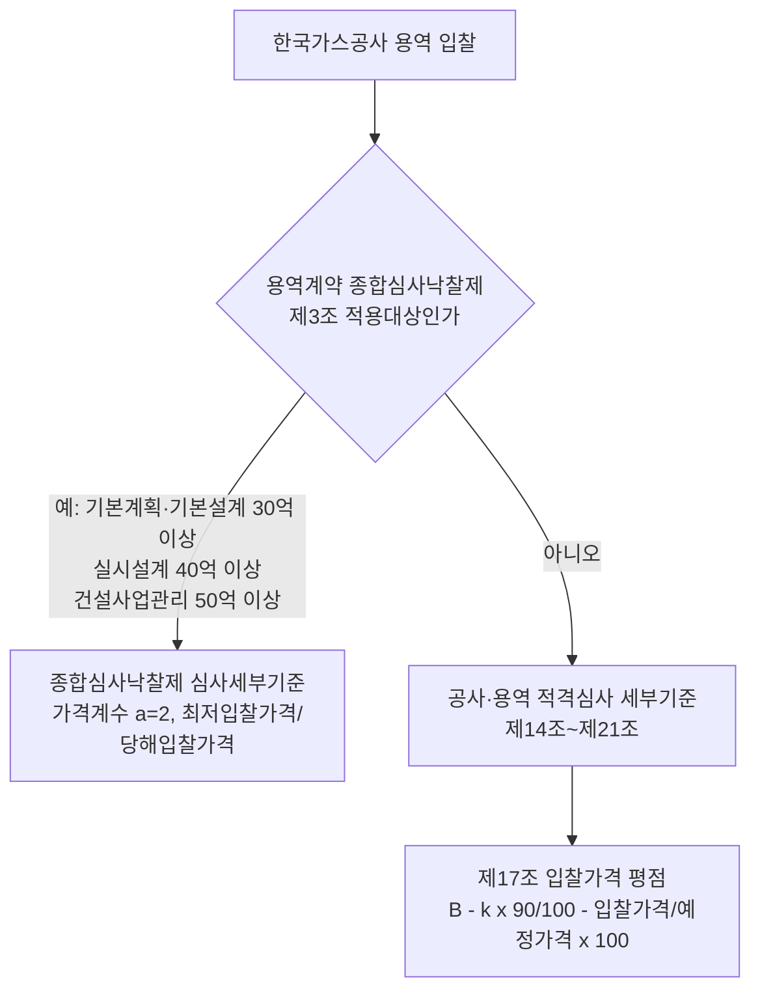

# 한국가스공사 공사·용역 적격심사 세부기준 현행판 용역 입찰가격 산식 수집 결과

> **작성일**: 2026-10-04
> **작업**: Orca Task `task_a61c0e310be3` (builder), Run `run_03599ec1fd4a`, Dispatch `ctx_91f8f396fc37`
> **정본 사양**: `.orca/capsules/task_a61c0e310be3/capsule.yaml` (`ORCA_TASK_CAPSULE_V2`)
> **대상**: 한국가스공사 「공사·용역 적격심사 세부기준」 현행판의 용역 입찰가격 평점 산식 및 종합심사낙찰제와의 적용 경계
> **역할 경계**: 코드·설정·패키지를 변경하지 않았습니다. 이 문서가 이번 작업의 커밋 산출물입니다.
> **원본 위치**: 내려받은 공식 원본과 추출 텍스트는 `.orca/capsules/task_a61c0e310be3/external/kogas/` 아래에만 두었고 커밋하지 않습니다(`.orca/` 하위는 커밋 금지).
> **판정 규칙**: 2026-09-30 수집 세션 3절의 10개 규칙을 그대로 적용합니다.

---

## 1. 요약

- **현행판**: 「공사·용역 적격심사 세부기준」, **시행 2026-07-09 (개정 2026-07-08)**, 한국가스공사 전자조달 규정실 `LCD0000017`(2026-07-09, 1,306KB ZIP). **등급: 확인**.
- **용역 입찰가격 산식(현행)**: 제17조①이 추정가격 구간별로 계수 `k` 를 명시합니다. `k = 1.5`(30억원 이상) / `2`(30억원 미만 10억원 이상) / `3`(10억원 미만 고시금액 이상) / `5`(고시금액 미만), **기준비율 90**, 입찰가격 배점한도(`B`)는 제16조의 30 / 50 / 70점. 제17조④가 **90%(시설분야용역은 92%) 초과 시 별표11의 평점 하한선과 계산식 점수 중 높은 점수**를 인정합니다.
- **2020 개정예고안**: 사용자가 제공한 게시물(`boardIdx=39427`, 작성 2020-07-02)의 전문·신구대비표를 확보했습니다. 이 개정안은 제10조의3(순공사원가)만 바꾸는 내용이며, 제17조는 **기준비율 88, `k = 1`(생략) / 1.5 / 2** 의 2018.11.27 식을 그대로 싣고 있습니다. 즉 2020 개정안으로는 88 기준을 확인했고, 현행판은 그 뒤 2021.07.26·2024.12.10·2026.07.08 개정을 거쳐 **90 기준**으로 바뀌었습니다.
- **종합심사낙찰제와의 경계**: 「용역계약 종합심사낙찰제 심사세부기준」(시행 2024-09-09) 제3조가 적용대상 용역 3유형(건설공사기본계획·기본설계 30억원 이상 / 실시설계 40억원 이상 / 감독권한대행 포함 건설사업관리 50억원 이상)을 정하고, 그 밖의 용역은 「공사·용역 적격심사 세부기준」 제14조~제21조(제8조④)의 적격심사를 적용합니다.
- **정정 필요**: 중앙부처 문서 `docs/analysis/servc_formula_collection_central_20261004.md` 12절의 한국가스공사 판정 `적격 B-k 아님` 은 **종심제 대상 3유형에 한해서만 맞고, 나머지 용역에는 적격 B-k가 적용되므로 정정이 필요**합니다.

---

## 2. 판정 규칙 (수집 세션 3절 그대로)

1. 상업 페이지(bidpro, 비드큐, info21c, 모두입찰, korbid, igunsul, 블로그)의 계수는 베끼지 않는다. 제목과 날짜 단서만 쓴다.
2. 나라장터 첨부는 파일 머리말이 그 기관 규정일 때만 원문이다. 개별 공고 배점표는 전사 규정이 아니다.
3. 조달청 준용 조항만 있으면 조항, 개정 표시, 시행일만 인용한다. 조달청 별표 숫자를 그 기관 계수로 옮기지 않는다.
4. 평점 = B − k × |(기준/100 − 입찰가격/예정가격) × 100|. B는 그 별표의 입찰가격 배점한도다.
5. 계수가 생략되고 평탄 대입이 인쇄 점수와 맞을 때만 k=1. 평탄 문장이 없으면 k=1로 두지 않는다.
6. 평탄 비율과 낙찰하한율로 k를 역산하지 않는다.
7. 대입 결과가 인쇄 점수와 다르면 그 행은 미확정이다. 0.01점 차이도 미확정이다. 원문이 비율만 적고 점수를 인쇄하지 않으면 대입값을 적고 원문이 그렇게 말한다고 밝힌다.
8. 5억 열과 고시금액 산식은 감점이 같아도 짝짓지 않는다.
9. 접속 실패, DNS 실패, 시간 초과는 문서가 없다는 증거가 아니다.
10. 시·도는 그 시의 가격 별표를 읽기 전에는 행정안전부 예규 제373호(규모 구간, 기준비율 88%)에 둔다. 예규는 시·도별로 식을 나누지 않는다.

---

## 3. 수집 환경과 도구

| 항목 | 값 |
| --- | --- |
| 내려받기 | `curl -L -m 30 -o <경로>` (대용량은 `-m 300`) |
| HWP 추출 | `uvx --from pyhwp --with six hwp5txt <파일>` |
| 별표 표 셀 추출 | `uvx --from pyhwp --with six hwp5proc xml <파일>` 후 `<Text>` 노드 수집 |
| 요약정보 파손 HWP 추출 | pyhwp 가 `HwpSummaryInformation` 스트림에서 실패하는 파일은 `olefile` 로 `BodyText/Section*` 를 직접 읽어 zlib 해제 후 레코드 태그 67(`PARA_TEXT`)을 UTF-16LE 로 디코드 |
| 규정실 목록 | `https://bid.kogas.or.kr:9443/supplier/contents/rule/rule_provision_list.jsp` |
| 규정실 내려받기 | `https://bid.kogas.or.kr:9443/supplier/contents/rule/cnts_download_rule_proc.jsp?ruleSeq=<seq>&rule_no=<ruleNo>` (첨부 ZIP) |
| 사규 제/개정예고 목록 | `https://www.kogas.or.kr/site/koGas/goBoard.do?boardNo=25&Key=1060102020000` |
| 사규 제/개정예고 첨부 | `https://www.kogas.or.kr/mgr/fileDownload.do?boardIdx=<idx>&fileNo=<no>` |

`pip install`, `uv add`, `brew install` 은 사용하지 않았습니다. 운영 DB·docker 는 건드리지 않았습니다.

**주의(추출 형태)**: 사규 제/개정예고 게시판의 첨부는 `Content-Disposition` 이 `.hwp` 이지만 실제 본문은 **EUC-KR 로 인코딩된 HTML 렌더링**입니다(전문·신구대비표 모두). 반면 전자조달 규정실 첨부 ZIP 안의 파일은 정상 HWP 5.0(OLE)입니다. 이번 작업은 두 형태를 각각 아래 경로에 보존했습니다.

| 용도 | .orca 경로 |
| --- | --- |
| 현행판 원본 HWP | `.orca/capsules/task_a61c0e310be3/external/kogas/cur2026/공사·용역 적격심사 세부기준.hwp` |
| 현행판 본문 추출문 | `.orca/capsules/task_a61c0e310be3/external/kogas/cur2026/kogas_cur2026_main.txt` |
| 현행판 별표9 추출문 | `.orca/capsules/task_a61c0e310be3/external/kogas/cur2026/kogas_cur2026_byul9.txt` |
| 현행판 별표11 추출문 | `.orca/capsules/task_a61c0e310be3/external/kogas/cur2026/kogas_cur2026_byul11.txt` |
| 2020 예고안 전문(HTML) | `.orca/capsules/task_a61c0e310be3/external/kogas/kogas_jeonmun.html.txt` |
| 2020 예고안 신구대비표(HTML) | `.orca/capsules/task_a61c0e310be3/external/kogas/kogas_singubigo.html.txt` |
| 2020 예고안 별표 HWP 묶음 | `.orca/capsules/task_a61c0e310be3/external/kogas/byulji/` |
| 2020 예고안 별표11 추출문 | `.orca/capsules/task_a61c0e310be3/external/kogas/kogas_2020_byul11.txt` |
| 종심제 본문 추출문 | `.orca/capsules/task_889fe5b87a19/external/kogas/kogas_jongsim_main.txt` |
| 종심제 별표1 추출문 | `.orca/capsules/task_889fe5b87a19/external/kogas/kogas_jongsim_byul1.txt` |

---

## 4. 문서 식별 표

| 문서 | 문서번호·차수 | 제정·개정·시행일 | 출처 URL | 확인 날짜 | .orca 원본 경로 | 등급 |
| --- | --- | --- | --- | --- | --- | --- |
| 공사·용역 적격심사 세부기준 (현행) | 규정실 `LCD0000017`(ruleSeq 32). 본문 표제 `[시행일자 : 2026-07-09]` | 개정 2026-07-08(부칙), 시행 2026-07-09 | `https://bid.kogas.or.kr:9443/supplier/contents/rule/rule_provision_list.jsp` · 첨부 `.../cnts_download_rule_proc.jsp?ruleSeq=32&rule_no=LCD0000017` | 2026-10-04 | `.orca/capsules/task_a61c0e310be3/external/kogas/cur2026/공사·용역 적격심사 세부기준.hwp` | 확인 |
| 공사·용역 적격심사 세부기준 (2020 개정예고안) | 개정예고. 신구대비표 표기 `[개정] 2020-04-28`, `[개정] 2020-06-25`. 게시물 작성 2020-07-02 | 시행 2020-07-01 입찰공고건(부칙) | `https://www.kogas.or.kr/site/koGas/bbs/View.do?cbIdx=25&Key=1060102020000&boardIdx=39427` · 첨부 `.../mgr/fileDownload.do?boardIdx=39427&fileNo=37808`(전문), `fileNo=37807`(신구대비표) | 2026-10-04 | `.orca/capsules/task_a61c0e310be3/external/kogas/kogas_jeonmun.html.txt` | 확인(예고안) |
| 용역계약 종합심사낙찰제 심사세부기준 | 규정실 `LSD0000017`(ruleSeq 7). 표제 `[시행일자 : 2024-09-09]` | 시행 2024-09-09 | `https://bid.kogas.or.kr:9443/supplier/contents/rule/rule_provision_list.jsp` · 첨부 `.../cnts_download_rule_proc.jsp?ruleSeq=7&rule_no=LSD0000017` | 2026-10-04 | `.orca/capsules/task_889fe5b87a19/external/kogas/kogas_jongsim_main.txt` | 확인 |

현행판 근거: 전자조달 규정실 `3.공사` 분류에 `공사용역적격심사세부기준`(2026-07-09)이 있고, `5.용역` 분류에는 종심제·일반조건·특수조건·입찰유의서만 있어 별도의 용역 적격심사 문서는 없습니다. 규정실 목록에서 이 문서가 적격심사 최신본입니다(규칙 9에 따라 미출력을 부재로 단정하지 않으나, 다음 개정 표시가 없어 현행으로 봅니다).

---

## 5. 현행판(시행 2026-07-09) 용역 입찰가격 산식

### 5.1 장 구분과 통과점수

- 제8조④: `이 기준의 제9조 내지 제13조는 공사 적격심사에, 제14조 내지 제21조는 용역 적격심사에 각각 적용한다.` — 원문 `.orca/capsules/task_a61c0e310be3/external/kogas/cur2026/kogas_cur2026_main.txt:59`
- 제5조① 적격통과점수 — 같은 파일 `:24-32`
  - `1. 85점을 적용하는 경우 : 제2호 이외의 모든 용역` (`:26`)
  - `2. 90점을 적용하는 경우 : <별표8> 2.나.의 시설분야용역` (`:27`)
  - `4. 95점을 적용하는 경우 : 추정가격이 100억원미만인 공사` (`:29`) — 용역 아님
- **최저평점**: 현행판 본문·별표 추출문에서 `최저평점` 문구 **0건**. 원문 부재.

### 5.2 심사분야별 배점한도 (제16조①) — 원문 `:201-214`

| 경우 | 해당 용역수행능력 | 신인도 | 입찰가격(B) | 원문 행 |
| --- | ---: | ---: | ---: | --- |
| 100% 계량화 절대평가 | 70 | +5 ~ △5 | **30** | `:203-204` |
| 70% 이상 계량화 절대평가 | 50 | +3.5 ~ △3.5 | **50** | `:205-206` |
| 70% 미만 계량화 절대평가 | 30 | +2.5 ~ △2.5 | **70** | `:207-208` |
| 시설분야용역(별표8 2.나) | 45 | +3.5 ~ △3.5 (+근로조건 5) | **50** | `:209-210` |
| 별표10 준용(실적·경영상태만) | 30 | +2.5 ~ △2.5 | **70** | `:211-214` |
| 사전평가 기술용역(제16조②) | 70 | — | **30** | `:215-217` |

### 5.3 입찰가격 평점계산식 (제17조) — 원문 `:218-228`

원문 `:220-224`:

```
1. 추정가격이 30억원 이상인 경우        평점계산식 = (입찰가격분야의 배점한도) - 1.5*|(90/100 - 입찰가격/예정가격)*100|
2. 추정가격이 30억원 미만 10억원 이상인 경우 평점계산식 = (입찰가격분야의 배점한도) - 2*|(90/100 - 입찰가격/예정가격)*100|
3. 추정가격이 10억원 미만 아래 4호의 고시금액 이상인 경우 평점계산식 = (입찰가격분야의 배점한도) - 3*|(90/100 - 입찰가격/예정가격)*100|
4. 추정가격이 "국가를 당사자로 하는 계약에 관한 법률" 제4조제1항에 따라 재정경제부장관이 정하여 고시하는 금액(정부 기준) 미만인 경우 평점계산식 = (입찰가격분야의 배점한도) - 5*|(90/100 - 입찰가격/예정가격)*100|
```

원문 `:225-226`(제17조②):

```
평점계산식 = (입찰가격분야의 배점한도) - 5*|(92/100 - 입찰가격/예정가격)*100|
```

원문 `:227`(제17조③): `건설 폐기물처리 용역의 경우에는 제15조의2의 평가기준에 의한 입찰가격 평점계산식에 의해 평가한다.`

원문 `:228`(제17조④): `입찰가격이 예정가격 이하로서 예정가격의 90%(단, 동조 제2항의 경우는 92%)를 초과하는 경우에는 "별표11"에서 정한 평점하한선과 동 평점계산식에 의한 점수 중 높은 점수를 평점으로 인정한다.`

적용 구간별 정리:

| 적용 구간(추정가격) | 기준비율 | k | B(제16조) | 평탄 문장(원문) | 통과점수 | 최저평점 | 원문 인쇄점수 | 판정 |
| --- | ---: | ---: | ---: | --- | --- | --- | --- | --- |
| 30억원 이상 | 90 | 1.5 | 30/50/70 | 90% 초과 시 별표11 하한선과 계산식 점수 중 높은 점수 | 85 (시설분야 90) | 원문 부재 | 별표11 하한선 | 확인(아래 5.4) |
| 30억원 미만 10억원 이상 | 90 | 2 | 30/50/70 | 동일 | 85 (시설분야 90) | 원문 부재 | 별표11 하한선 | 확인(아래 5.4) |
| 10억원 미만 고시금액 이상 | 90 | 3 | 30/50/70 | 동일 | 85 (시설분야 90) | 원문 부재 | 별표11 하한선 | 확인(아래 5.4) |
| 고시금액 미만 | 90 | 5 | 30/50/70 | 동일 | 85 (시설분야 90) | 원문 부재 | 별표11 하한선 | 확인(아래 5.4) |
| 시설분야용역(제17조②) | 92 | 5 | 50 | 92% 초과 시 별표11 하한선과 계산식 점수 중 높은 점수 | 90 | 원문 부재 | 별표11 하한선 | 확인(아래 5.4) |
| 건설폐기물처리용역(제17조③) | — | — | — | 제15조의2(기후에너지환경부고시) 준용 | — | — | — | 별도(이 문서 범위 밖) |

- 모든 `k` 가 원문 `:220-226` 에 **숫자로 명시**되어 있습니다. 규칙 5(계수 생략 시 `k=1` 금지)가 적용될 여지가 없습니다.
- B 는 추정가격 구간이 아니라 **용역 유형(계량화 정도)** 으로 정해집니다(제16조①). 구간별 식과 B 를 곱해 읽습니다.
- 5억원 경계는 이 현행판에 없습니다. 따라서 규칙 8(5억 열과 고시금액 산식 짝짓기)이 걸리는 구간 자체가 없습니다.

### 5.4 별표11 평점 하한선 (인쇄 점수)

현행 별표11 제목: `투찰율 90%(단, 제17조 제2항의 경우는 92%) 초과시 평점 하한선(제17조 제4항 관련)` `<개정 2026.7.9.>` — 원문 `.orca/capsules/task_a61c0e310be3/external/kogas/cur2026/kogas_cur2026_byul11.txt:1-10`.

| 적격심사 통과점수 | 당해용역수행능력 | 입찰가격 | 평점 하한선 | 원문 행(`kogas_cur2026_byul11.txt`) |
| --- | ---: | ---: | ---: | --- |
| 85점인 경우 | 70 | 30 | 15점 | `:19-22` |
| 85점인 경우 | 50 | 50 | 35점 | `:23-25` |
| 85점인 경우 | 30 | 70 | 55점 | `:26-28` |
| 90점인 경우 | 70 | 30 | 20점 | `:29-32` |
| 90점인 경우 | 50 | 50 | 40점 | `:33-35` |
| 90점인 경우 | 30 | 70 | 60점 | `:36-38` |

- 별표11 값은 **하한선(floor)** 이며, 원문은 이 값이 특정 투찰율에서의 계산식 대입값이라고 적지 않습니다. 따라서 규칙 7의 `대입 검산` 대상이 아닙니다(원문이 비율과 하한선만 인쇄). 참고로 투찰율 100%에서 `k=1.5` 대입값은 `B−15` 로 통과 85점 행 하한선(15/35/55)과 숫자가 같으나, 원문이 그 관계를 설명하지 않으므로 **검산 통과로 세지 않습니다**(규칙 6).

### 5.5 소결

- 현행판 용역 산식은 `평점 = B − k × |(90/100 − 입찰가격/예정가격) × 100|` 형태이며, `k` 와 기준비율이 원문에 명시되어 있어 미확정 행이 없습니다.
- 통과점수는 일반용역 85점, 시설분야용역 90점입니다(제5조①). 최저평점은 원문 부재입니다.

---

## 6. 2020 개정예고안의 용역 입찰가격 산식 (비교)

2020-07-02 게시물의 개정안 전문 `제17조(입찰가격분야 평점산정)` — 원문 `.orca/capsules/task_a61c0e310be3/external/kogas/kogas_jeonmun.html.txt:209-221`:

```
① 1. 추정가격이 10억원 이상인 경우        평점산식 = (배점한도) - |(88/100 - 입찰가격/예정가격)*100| <개정 2018.11.27>
   2. 추정가격이 10억원 미만인 경우        평점산식 = (배점한도) - 1.5*|(88/100 - 입찰가격/예정가격)*100| <개정 2018.11.27>
   3. 추정가격이 고시금액 미만인 경우       평점산식 = (배점한도) - 2*|(88/100 - 입찰가격/예정가격)*100| <신설 2018.11.27>
② 시설분야용역: 평점산식 = (배점한도) - 5*|(90/100 - 입찰가격/예정가격)*100|
④ 입찰가격이 예정가격 이하로서 예정가격의 88%(단, 제2항의 경우는 90%)를 초과하는 경우에는 "별표11"에서 정한 평점하한선과 동 평점산식에 의한 점수 중 높은 점수를 평점으로 인정한다.
```

| 적용 구간(추정가격) | 기준비율 | k | B(제16조, `:182-207`) | 평탄 문장 | 통과점수(`:29-35`) | 최저평점 | 원문 인쇄점수 | 판정 |
| --- | ---: | ---: | ---: | --- | --- | --- | --- | --- |
| 10억원 이상 | 88 | **생략(수식에 계수 없음)** | 30/50/70 | 88% 초과 시 별표11 하한선 | 85 (시설 90) | 원문 부재 | 별표11 | **미확정(규칙 5)** — 계수 표기 없음 |
| 10억원 미만 | 88 | 1.5 | 30/50/70 | 동일 | 85 (시설 90) | 원문 부재 | 별표11 | 확인 |
| 고시금액 미만 | 88 | 2 | 30/50/70 | 동일 | 85 (시설 90) | 원문 부재 | 별표11 | 확인 |
| 시설분야용역 | 90 | 5 | 50 | 90% 초과 시 별표11 하한선 | 90 | 원문 부재 | 별표11 | 확인 |

- 2020 예고안의 별표11(`kogas_2020_byul11.txt:1-34`) 하한선은 현행판과 동일하게 15/35/55(통과 85) · 20/40/60(통과 90)입니다.
- 10억원 이상 행은 수식에 계수가 없고, 평탄 문장이 가리키는 별표11 값이 특정 투찰율의 계산값이 아니어서 `k=1` 로 확정할 인쇄 점수가 없습니다. 규칙 5에 따라 **미확정**으로 둡니다.
- 2020 예고안의 신구대비표는 `제10조의3(순공사원가 기준 낙찰 배제 세부절차)` 만 담고 있습니다(`kogas_singubigo.html.txt:8-50`). 즉 이 개정예고는 용역 입찰가격 산식을 바꾸는 건이 아닙니다.
- **현행판과의 차이**: 기준비율 88 → 90, 구간 10억/고시 → 30억/10억/고시, `k` 1(생략)/1.5/2 → 1.5/2/3/5 로 바뀌었습니다(현행판 `:220-224` 의 개정 표시 `2021.07.26, 2024.12.10, 2026.07.08`).

---

## 7. 종합심사낙찰제와의 적용 경계

### 7.1 종합심사낙찰제 적용대상 (원문)

「용역계약 종합심사낙찰제 심사세부기준」(시행 2024-09-09) 제1조(목적) — 원문 `.orca/capsules/task_889fe5b87a19/external/kogas/kogas_jongsim_main.txt:4`:

> 이 기준은 「국가를 당사자로 하는 계약에 관한 법률 시행령」(이하 "시행령"이라 한다) 제42조제4항제3호부터 제5호까지의 규정 및 기획재정부 계약예규「용역계약 종합심사낙찰제 심사기준」…에 따라 한국가스공사…가 시행하는 용역계약 중 용역계약 종합심사낙찰제 대상 용역의 낙찰자 결정시 필요한 세부기준을 정함을 목적으로 한다.

제3조(적용대상) — 같은 파일 `:19-22`:

> 이 기준은 국가계약법 시행령 제42조제4항에 따라 다음 각 호의 용역의 입찰에 적용한다.
> 1. 추정가격 30억원 이상의 건설공사기본계획 용역 또는 기본설계 용역
> 2. 추정가격 40억원 이상의 실시설계용역
> 3. 「건설기술진흥법」제39조제2항에 따라 감독권한대행 업무를 포함하는 건설사업관리용역으로서 추정가격이 50억원 이상인 용역

별표1의 입찰가격 평가는 `배점한도 × (최저입찰가격/해당입찰가격)` 계열이고, 80% 미만 구간에 `+a×` 가 붙으며 `가격 계수(a)는 2` — 원문 `kogas_jongsim_byul1.txt:19,22`. 적격심사의 `B − k × |기준 − 비율|` 형태가 아닙니다.

### 7.2 적격심사 적용 (원문)

「공사·용역 적격심사 세부기준」 제1조① — 원문 `cur2026/kogas_cur2026_main.txt:5`:

> 이 기준은 한국가스공사…가 공기업.준정부기관 계약사무규칙 및 계약예규 적격심사 기준…에 의거 시설공사 및 용역계약에 적용할 적격심사세부기준을 정함에 그 목적이 있다.

제8조④ — 같은 파일 `:59`: `제14조 내지 제21조는 용역 적격심사에 각각 적용한다.`

### 7.3 경계 정리

| 용역 유형 | 적용 기준 |
| --- | --- |
| 추정가격 30억원 이상 건설공사기본계획·기본설계 용역 | 종합심사낙찰제(종심제 제3조 1호) |
| 추정가격 40억원 이상 실시설계용역 | 종합심사낙찰제(종심제 제3조 2호) |
| 감독권한대행 포함 건설사업관리용역(추정가격 50억원 이상) | 종합심사낙찰제(종심제 제3조 3호) |
| 위 3유형에 해당하지 않는 용역(예: 소규모 일반용역·학술연구용역 등) | 적격심사(적격심사 제14조~제21조) — 제17조 B-k 산식 |

- 두 기준은 같은 문서가 아니라 **별도 사규**이며, 각자 적용대상을 조항으로 정합니다. 종심제 제1조는 시행령 제42조제4항제3호부터 제5호까지를 근거로 밝히고, 적격심사 제1조는 계약예규 적격심사 기준에 의거함을 밝힙니다.
- 적격심사 본문에는 `종합심사` 문구가 0건입니다(현행판 본문 추출문 grep). 즉 적격심사 문서는 종심제를 명시적으로 배제·언급하지 않고, 종심제 문서 제3조가 자기 적용대상을 한정하는 방식으로 경계가 만들어집니다.



---

## 8. 결론 — 가스공사 등급 정정

중앙부처 문서 `docs/analysis/servc_formula_collection_central_20261004.md` 12절은 한국가스공사에 대해 「용역계약 종합심사낙찰제 심사세부기준」(2024-09-09)만 확보한 상태에서 `일반 적격 B-k 아님` 으로 판정했습니다. 이번 작업으로 「공사·용역 적격심사 세부기준」 현행판(시행 2026-07-09)을 규정실에서 확보한 결과, **가스공사는 종심제 대상 3유형 용역에는 종심제를, 그 밖의 용역에는 적격심사 `평점 = B − k × |(90/100 − 입찰가격/예정가격) × 100|`(B=30/50/70, k=1.5/2/3/5)를 적용**합니다. 따라서 12절의 `적격 B-k 아님` 판정은 **부분 정정이 필요**합니다. 정정 문구는 "가스공사는 종심제 대상 3유형(기본계획·기본설계 30억 이상, 실시설계 40억 이상, 건설사업관리 50억 이상) 용역에 종심제를 적용하고, 그 밖의 용역에는 적격 B-k(기준 90, k=1.5/2/3/5, B=30/50/70, 시설분야 기준 92·k=5)를 적용한다" 로 적는 것이 원문에 부합합니다. 12절 요약 표의 `등급` 은 `확인` 유지가 가능하나 `핵심 한 줄` 은 위와 같이 교체해야 합니다.

---

## 9. 검증과 산출물

| 항목 | 값 |
| --- | --- |
| 검증 명령 | `python3 scripts/validate_agent_rules.py --quiet` |
| 검증 결과 | `검증 통과: 21/21 건` (exit 0) |
| 변경 파일 | `docs/analysis/servc_formula_kogas_qualification_20261004.md` (문서 1개) |
| 커밋 메시지 | `docs: 한국가스공사 용역 적격심사 현행판 입찰가격 산식을 원문으로 판정한다` |
| 작업 브랜치 | `kwanbum217/formula-kogas` (main 직접 커밋 없음) |

---

## 10. 참고

- `docs/analysis/servc_formula_collection_central_20261004.md` — 중앙부처·공단 9곳 수집 결과(12절 가스공사 판정 정정 대상)
- `docs/handoff/session_20260930_servc_formula_collection.md` — 33곳 수집 대장과 판정 규칙 10개
- `.orca/capsules/task_a61c0e310be3/external/kogas/` — 이번 작업의 공식 원본과 추출 텍스트(커밋하지 않음)
- `.orca/capsules/task_889fe5b87a19/external/kogas/` — 종합심사낙찰제 원본과 추출 텍스트(커밋하지 않음)
