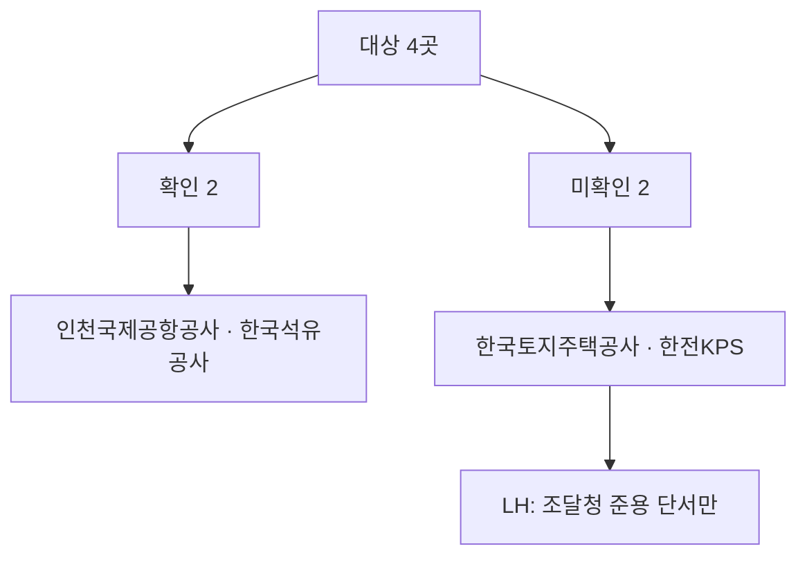

# LH·한국석유공사·한전KPS·인천국제공항공사 일반용역 적격심사 세부기준 원문 재확보 판정

> **작성일**: 2026-10-05
> **작업**: Orca Task `task_afb66751579d` (builder, run_03599ec1fd4a), Dispatch `ctx_6ab13f1b611c`
> **정본 사양**: `.orca/capsules/task_formula_recover_a/capsule.yaml` (`ORCA_TASK_CAPSULE_V2` 2.1.0)
> **목적**: 한국토지주택공사(LH), 한국석유공사, 한전KPS, 인천국제공항공사의 일반용역 적격심사 세부기준 현행 원문을 나라장터 공고 첨부(DB 첨부 URL)와 알리오·기관 공식 사이트에서 수집하고, 입찰가격 평점 산식(적용 구간, B, k, 기준비율, 평탄 구간, 통과점수, 최저평점)을 판정 규칙대로 정리해 현재 판정을 바꿔야 하는지 결론 낸다.
> **역할 경계**: 코드·설정·패키지를 변경하지 않았다. 커밋 산출물은 이 문서 한 편이다. `src/app/services/evaluation_rules.py` 는 손대지 않았다.
> **원본 위치**: 내려받은 원본과 추출 텍스트는 `.orca/capsules/task_afb66751579d/external/` 아래에만 두며 커밋하지 않는다(`.orca/` 커밋 금지).
> **판정 규칙**: 2026-09-30 수집 세션 3절의 10개 규칙을 그대로 적용한다.

---

## 1. 요약 — 대상 4곳 판정

| # | 대상 | 기존 판정 | 이번 판정 | 문서(문서번호·시행) | 핵심 |
| ---: | --- | --- | --- | --- | --- |
| 1 | 인천국제공항공사 | 미확인 | **확인** | 일반용역 적격심사 세부기준, 재무처-17529호(2024.12.23), 시행 2025-01-01 이후 입찰공고분 | 나라장터 공고 첨부(공고 R25BK01060561 칸3)에서 전사 원문 확보. 별표 1~9 |
| 2 | 한국석유공사 | 미확인 | **확인** | 용역 적격심사 세부기준, 제정 1995.9.18·12차 개정 2019.09.30 | 나라장터 공고 첨부(공고 R26BK01716376 칸6)에서 전사 원문 확보. 일반용역은 별표 5~11 |
| 3 | 한국토지주택공사 | 미확인 | **미확인 유지** (현행판 단서 확보) | 자체 용역적격심사 세부기준 원문 미확보. 나라장터 LH 일반용역 공고문은 조달청 기준 준용 | ebid 자료실은 보안모듈, lh.or.kr 사규 목록에 없음. 공고문에서 조달청 준용 조항만 확인 |
| 4 | 한전KPS | 미확인 | **미확인 유지** | 자체 원문 미확보 | 나라장터 Servc 공고 5건에 적격심사 첨부 없음. kps.co.kr 사규 목록 404·알리오 JS |

**판정이 바뀐 곳**: 인천국제공항공사(미확인→확인), 한국석유공사(미확인→확인).
**바뀌지 않은 곳**: 한국토지주택공사(미확인 유지, 조달청 준용 단서만 추가), 한전KPS(미확인 유지).

직전 인수인계 8.3절의 "원문 미확보 7곳"(LH·한국석유공사·한전 전력연구원·한전KPS·인천국제공항공사·한국도로공사·한국철도공사) 중 한국석유공사·인천국제공항공사 두 곳이 이번에 원문을 확보했다.

---

## 2. 판정 규칙 (2026-09-30 수집 세션 3절 그대로)

1. 상업 페이지(bidpro, 비드큐, info21c, 모두입찰, korbid, igunsul, 블로그)의 계수는 베끼지 않는다. 제목과 날짜 단서만 쓴다.
2. 나라장터 첨부는 파일 머리말이 그 기관 규정일 때만 원문이다. 개별 공고 배점표는 전사 규정이 아니다.
3. 조달청 준용 조항만 있으면 조항, 개정 표시, 시행일만 인용한다. 조달청 별표 숫자를 그 기관 계수로 옮기지 않는다.
4. 평점 = B − k × |(기준/100 − 입찰가격/예정가격) × 100|. B는 그 별표의 입찰가격 배점한도다.
5. 계수가 생략되고 평탄 대입이 인쇄 점수와 맞을 때만 k=1. 평탄 문장이 없으면 k=1로 두지 않는다.
6. 평탄 비율과 낙찰하한율로 k를 역산하지 않는다.
7. 대입 결과가 인쇄 점수와 다르면 그 행은 미확정이다. 0.01점 차이도 미확정이다. 원문이 비율만 적고 점수를 인쇄하지 않으면 대입값을 적고 원문이 그렇게 말한다고 밝힌다.
8. 5억 열과 고시금액 산식은 감점이 같아도 짝짓지 않는다.
9. 접속 실패, DNS 실패, 시간 초과는 문서가 없다는 증거가 아니다.
10. 시·도는 그 시의 가격 별표를 읽기 전에는 행정안전부 예규 제373호에 둔다. 이번 대상에는 시·도가 없다.

이번 대상 4곳은 모두 공기업·준정부기관이며, 지방자치단체가 아니다. 규칙 10은 적용 대상이 없다.

---

## 3. 대상별 시도 경로와 결과

DB 조회는 `uv run python scripts/db_readonly_query.py --sql "<질의>"` 형태만 사용했다. `bid_announcements` 에서 `category='Servc'` 와 `dminstt_nm LIKE '<기관명>%'`, `bid_ntce_dt` 조건을 인덱스에 태워 조회했고, 첨부 파일명은 `raw_data` 의 `ntceSpecFileNm1~10`, URL 은 `ntceSpecDocUrl1~10` 을 읽었다.

| 대상 | 경로 1: 나라장터 공고 첨부(DB) | 경로 2: 알리오 내부규정 | 경로 3: 기관 공식 사이트 | 결과 |
| --- | --- | --- | --- | --- |
| 한국토지주택공사 | Servc 375건(2024-01-01 이후). 첨부 슬롯 1~10에 `적격`·`세부기준` 파일명 0건. 일반용역(미화 R25BK01097015, 경비 R25BK01095615) 공고문 2건 내려받아 본문에 조달청 준용 조항 확인 | 정적 수집 불가(`alio.go.kr` 는 Vue 스크립트 렌더링, `occasional/ruleList.do` 빈 템플릿 응답) | `ebid.lh.or.kr` 자료실은 세션·보안모듈 필요. `lh.or.kr` 규정·시행세칙 목록 273건에 적격심사 항목 미확인. `data.go.kr` 15118134 는 다운로드를 ebid 자료실로 되돌림 | 미확인 유지. 공고문에서 조달청 준용 단서만 확보 |
| 한국석유공사 | Servc. 첨부 `용역 적격심사 세부기준.hwp`·`별첨2.용역 적격심사 세부기준.hwp` 다수(공고 R26BK01716376 칸6, R25BK01180260 칸4 등). 원문 확보 | 정적 수집 불가(위와 동일) | `ebid.knoc.co.kr` 접속 실패(시간 초과) | **확인**(전사 원문, `용역 적격심사 세부기준`) |
| 한전KPS | `dminstt_nm='한전케이피에스주식회사'` Servc 5건, 지사·사업처 4곳 0건. 첨부에 적격심사 0건 | 정적 수집 불가(위와 동일) | `kps.co.kr` 사규 목록 `ruleList.do`·`ruleinfo.do` 404. 사규 바로가기는 `alio.go.kr` 로 리다이렉트. 사규 제·개정 예고 395건에 적격심사 미확인 | 미확인 유지 |
| 인천국제공항공사 | Servc. 첨부 `(재무처-17529) 일반용역 적격심사 세부기준.hwp`(공고 R25BK01060561 칸3, R25BK01054180 칸3). 원문 확보. `(재무처-8933) 기술용역 적격심사 세부기준.hwp` 별도 문서도 존재(기술용역) | 정적 수집 불가(위와 동일) | `airport.kr` 규정 메뉴는 스크립트 로드(이전 세션 실패 유지) | **확인**(전사 원문, `일반용역 적격심사 세부기준`) |

알리오는 네 대상 모두 공통으로 정적 수집이 불가했다. `alio.go.kr/item/itemOrganList.do`, `alio.go.kr/info/ruleSearchList.do`(404), `alio.go.kr/occasional/ruleList.do` 를 확인했고, 응답은 모두 스크립트 템플릿(빈 `{{ }}` 바인딩)이라 문서 목록·첨부를 얻지 못했다. 로그인·인증서가 필요한 경로가 아니라 **브라우저 렌더링이 필요한 경로**이며, 문서 부재로 단정하지 않는다(규칙 9).

접근이 로그인·보안모듈·정적수집 불가로 막힌 대상은 LH·한전KPS 2곳으로 절반을 넘지 않아 에스컬레이션 요건에 해당하지 않는다.

---

## 4. 인천국제공항공사 — 확인 (전사 일반용역)

### 4.1 문서 식별

| 항목 | 값 |
| --- | --- |
| 문서명 | 일반용역 적격심사 세부기준 |
| 문서번호 | `[재무처-17529호, 2024.12.23.]` (최종 개정). 이전 `[재무처-8933호, 2023.7.20.]`(`iia_17529_full.txt:9`) |
| 시행 | 부칙 `<2024. 12. 23.>` 제1항 `이 세부기준은 2025년 1월 1일 이후 입찰공고하는 용역부터 적용한다` (`iia_17529_full.txt:147`) |
| 적용범위 | 인천국제공항공사(이하 "공사")가 집행하는 일반용역(제1조, `iia_17529_full.txt:12`, `:15`) |
| 통과점수 | 제10조① 종합평점 85점. 단 여객 육상운송용역은 88점 (`iia_17529_full.txt:114`) |
| 출처 URL | `https://www.g2b.go.kr/pn/pnp/pnpe/UntyAtchFile/downloadFile.do?bidPbancNo=R25BK01060561&bidPbancOrd=000&fileType=&fileSeq=3&prcmBsneSeCd=03` (공고 R25BK01060561 첨부 칸3) |
| 확인 날짜 | 2026-10-05 |
| .orca 원본 경로 | `.orca/capsules/task_afb66751579d/external/iia/iia_reawu17529_defense.hwp`, 추출 `.../extracted/iia_17529_full.txt`(표·수식 보존), `.../extracted/iia_17529.txt`(hwp5txt 1차) |
| 등급 | 확인 |

이 파일은 나라장터 공고 R25BK01060561(2025-09-16 소방시설 법정점검 용역)과 R25BK01054180(2025-09-11 드론탐지장비 수리용역)에 첨부된 문서로, 머리말 첫 줄이 `일반용역 적격심사 세부기준`(`iia_17529_full.txt:1`)이고 제1조가 주체를 `인천국제공항공사`로 명시하므로 그 기관 규정 원문이다(규칙 2). 직전 세션이 문서번호(재무처-17529호, 2024-12-23 제정, 2025-01-01 시행)로 적어 둔 문서와 동일하다.

### 4.2 별표별 입찰가격 산식

원문의 계산식은 HWP 수식 개체로 들어 있어 hwp5txt 추출문이 계수와 기준비율을 누락한다. 그래서 표·수식을 보존한 `iia_17529_full.txt` 행으로 인용한다. B는 각 별표 `입찰가격` 행의 배점한도 값, k·기준비율은 계산식, 평탄은 `입찰가격이 예정가격 이하로서 …% 이상인 경우` 문장, 통과점수는 제10조①, 최저평점은 `최저평점은 2점으로 함` 행에서 읽었다.

| 별표 | 용역 | 적용 구간(열) | B | k | 기준비율 | 평탄 문장(원문 비율) | 통과점수 | 최저평점 | 인용 |
| --- | --- | --- | ---: | ---: | ---: | --- | ---: | ---: | --- |
| 별표 1 | 학술연구용역 | 고시금액 이상 / 미만 | 60 / 70 | 2 / 4 | 88 | 95.5% / 91.75% | 85 | 2 | B `:190-191`, 식 `:216`, `:232`, 기준 `:218`, `:234`, 평탄 `:226`, `:242`, 최저 `:246` |
| 별표 2 | 기술분야 아웃소싱용역 | 단일 | 30 | 5 | 91 | 94% | 85 | 2 | B `:356`, 식 `:373`, 기준 `:375`, 평탄 `:384`, 최저 `:387` |
| 별표 3 | 일반분야 아웃소싱용역 | 단일 | 55 | 5 | 91 | 94% | 85 | 2 | B `:585`, 식 `:602`, 기준 `:604`, 평탄 `:613`, 최저 `:616` |
| 별표 4 | 폐기물처리용역 | 고시금액 이상 / 미만 | 60 / 70 | 2 / 4 | 88 | 95.5% / 91.75% | 85 | 2 | B `:795-796`, 식 `:823`, `:839`, 기준 `:825`, `:841`, 평탄 `:833`, `:849`, 최저 `:853` |
| 별표 5 | 여객 육상운송용역 | 추정가격 5억원 이상 / 미만 | 60 / 70 | 4 | 91 | 94% | 88 | 2 | B `:996-997`, 식 `:1015`, 평탄 `:1016`, 최저 `:1019` |
| 별표 5의 2 | 화물 육상운송용역 | 고시금액 이상 / 미만 | 60 / 70 | 2 / 4 | 88 | 95.5% / 91.75% | 85 | 2 | B `:1158-1159`, 식 `:1185`, `:1200`, 기준 `:1187`, `:1202`, 평탄 `:1195`, `:1210`, 최저 `:1213` |
| 별표 6 | 보험용역 | 고시금액 이상 / 미만 | 60 / 70 | 0.375 | 88 | 평탄 문장 없음 | 85 | 원문 부재 | B `:1316-1317`, 식 `:1335`, 기준 `:1337` |
| 별표 7 | 수리·점검용역 | 고시금액 이상 / 미만 | 60 / 70 | 2 / 4 | 88 | 95.5% / 91.75% | 85 | 2 | B `:1417-1418`, 식 `:1443`, `:1449`, 평탄 `:1444`, `:1450`, 최저 `:1453` |
| 별표 8 | 임대차용역 | 단일 | 70 | 2 / 4 | 88 | 95.5% / 91.75% | 85 | 2 | B `:1568`, 식 `:1592`, `:1598`, 평탄 `:1593`, `:1599`, 최저 `:1601` |
| 별표 9 | 기타용역 | 고시금액 이상 / 미만 | 60 / 70 | 2 / 4 | 88 | 95.5% / 91.75% | 85 | 2 | B `:1677-1678`, 식 `:1703`, `:1719`, 기준 `:1705`, `:1721`, 평탄 `:1713`, `:1729`, 최저 `:1733` |

계산식 원문(수식 개체 그대로, 별표 7): `평점(점)=배점한도-2 x |( 88/100 - 입찰가격/예정가격 ) x 100|` (`iia_17529_full.txt:1443`), `...-4 x |( 88/100 ... )|`(`:1449`). 별표 6(보험)만 `- 0.375 × |(88/100 - 입찰가격/예정가격)×100|`(`:1335`)이고 평탄 문장·최저평점 문구가 없다.

- 5억 열과 고시금액 산식을 짝짓지 않았다(규칙 8). 별표 5(여객)만 원문이 `추정가격 5억원 이상/미만` 두 열(`:960-963`)에 하나의 계산식(`:1015`)을 인쇄하므로, 이 별표는 원문이 인쇄한 대로 적었다.
- 별표 2·3(아웃소싱)은 원문이 배점한도를 단일 값으로 인쇄해 구간 열이 없다.

### 4.3 검산

평탄 문장이 모두 `…인 경우의 점수로 평가` 형태로 **점수를 인쇄하지 않는다.** 규칙 7에 따라 아래 대입값은 계산값일 뿐 검산 통과로 세지 않는다. 인쇄 점수가 있는 행은 0개다(검산 통과 0건).

| 별표·구간 | 평탄 대입값(계산) |
| --- | --- |
| 별표 1 고시금액 이상 | 60 − 2 × |88 − 95.5| = 45.000 |
| 별표 1 고시금액 미만 | 70 − 4 × |88 − 91.75| = 55.000 |
| 별표 2 | 30 − 5 × |91 − 94| = 15.000 |
| 별표 3 | 55 − 5 × |91 − 94| = 40.000 |
| 별표 4 고시금액 이상 | 60 − 2 × |88 − 95.5| = 45.000 |
| 별표 4 고시금액 미만 | 70 − 4 × |88 − 91.75| = 55.000 |
| 별표 5 | 60 − 4 × |91 − 94| = 48.000 / 70 − 4 × 3 = 58.000 |
| 별표 5의 2 | 45.000 / 55.000 |
| 별표 7 | 45.000 / 55.000 |
| 별표 8 | 45.000 / 55.000 |
| 별표 9 | 45.000 / 55.000 |

### 4.4 기존 문서 대조

| 항목 | 기존 문서(`servc_formula_collection_energy_20261004.md` 5.5절, `20260930_servc_formula_recalc_ince_molit.md`) | 이번 원문 | 판정 |
| --- | --- | --- | --- |
| 등급 | 미확인 — 공식 원문 재확보 실패, 저장소 밖 `/tmp` 소실 | 나라장터 공고 첨부에서 전사 원문 확보 | 미확인 → 확인 |
| 문서번호 | 재무처-17529호(2024-12-23 제정, 2025-01-01 시행) | `[재무처-17529호, 2024.12.23.]`, 부칙 시행 2025-01-01 | 일치 |
| 별표 1·4·5의2·9 | 기준 88, k=2(고시 이상)·4(고시 미만) | 일치 | 일치 |
| 별표 2 | B=30, k=5, 기준 91 | 일치 | 일치 |
| 별표 3 | B=55, k=5, 기준 91 | 일치 | 일치 |
| 별표 6 | B=60/70, k=0.375, 기준 88 | 일치 | 일치 |
| 검산 | 원문이 상한 비율만 인쇄, 검산 통과 0건 | 동일 | 일치 |

직전 세션이 재확인 문서에 적어 둔 값(B·k·기준)이 이번에 내려받은 공식 원문과 모두 맞았다. 차이는 등급뿐이다(원문 파일 확보 여부).

---

## 5. 한국석유공사 — 확인 (전사 용역, 일반용역 별표 5~11)

### 5.1 문서 식별

| 항목 | 값 |
| --- | --- |
| 문서명 | 용역 적격심사 세부기준 |
| 문서번호·차수 | 제정 `1995.9.18.`, 4차~12차 개정, 최종 `12차 개정 : 2019.09.30.` (`knoc_2026_full.txt:32-41`) |
| 시행 | 부칙 없음. 본문에 시행일 미표기. 표제 개정일(2019.09.30)이 최신 |
| 적용범위 | 한국석유공사(이하 '우리공사')에서 집행하는 제반 용역입찰(제1조, `knoc_2026_full.txt:44`). 제2조가 기술용역·일반용역·기타용역으로 구분(`:46`) |
| 통과점수 | 제10조② 일반용역·기타용역 종합평점 85점(정보통신·운송의 중소기업자간 경쟁대상은 88점) (`knoc_2026_full.txt:164`) |
| 출처 URL | `https://www.g2b.go.kr/pn/pnp/pnpe/UntyAtchFile/downloadFile.do?bidPbancNo=R26BK01716376&bidPbancOrd=000&fileType=&fileSeq=6&prcmBsneSeCd=03` (공고 R26BK01716376 첨부 칸6) |
| 확인 날짜 | 2026-10-05 |
| .orca 원본 경로 | `.orca/capsules/task_afb66751579d/external/knoc/knoc_r26bk01716376_spec.hwp`, `.../knoc/knoc_r25bk01180260_spec.hwp`, 추출 `.../extracted/knoc_2026_full.txt`·`knoc_2025_full.txt`(표·수식 보존) |
| 등급 | 확인 |

이 파일은 나라장터 공고 R26BK01716376(2026-09-08 시추작업에 따른 동해안 어업생산량 변동 조사 용역) 칸6 `용역 적격심사 세부기준.hwp` 와 R25BK01180260(2025-11-26 보유 토지 감정평가 용역) 칸4 `별첨2_용역 적격심사 세부기준.hwp` 로 내려받은 문서다. 머리말이 `용역 적격심사 세부기준`(`knoc_2026_full.txt:3`)이고 제1조가 주체를 `한국석유공사`로 명시하므로 그 기관 규정 원문이다(규칙 2). 두 공고의 파일 본문은 표제 앞 `건명` 줄만 다르고 규정 본문은 동일하다(`diff` 결과 차이 32행 전부 공고 머리말·여백, `md5` 상이).

이 문서는 기술용역(별표 1~4)과 일반용역(별표 5~11), 기타용역(별표 11)을 한 문서에서 다루는 **통합 용역 적격심사 세부기준**이다. 이번 대상은 일반용역이므로 별표 5~11을 적는다. 제5조 ① 2호가 일반용역 평가기준을 `가. 학술연구용역 : 별표 5` ~ `사. 운송용역(중소기업자간 경쟁대상) : 별표 10의2` 로, 제3호가 기타용역을 `별표 11` 로 정한다(`knoc_2026_full.txt:103-112`).

### 5.2 일반용역 별표별 입찰가격 산식

계산식은 `평점(점)=배점한도-k×|(기준/100 - 입찰가격/예정가격)×100|` 형태로 인쇄되고, `배점한도` 는 문자로 두고 k(2·4·5)와 기준비율(88·91)은 원문에 숫자로 들어 있다. B는 각 별표 `입찰가격` 행의 배점한도 값이다.

| 별표 | 용역(평가기준) | 적용 구간(열) | B | k | 기준비율 | 평탄 문장(원문 비율) | 통과점수 | 최저평점 | 인용 |
| --- | --- | --- | ---: | ---: | ---: | --- | ---: | ---: | --- |
| 별표 5 | 학술연구용역 | 추정가격 2억원 이상 / 미만 | 40 / 70 | 2 | 88 | 95.5% | 85 | 2 | B `:347-348`, 식 `:369`, 평탄 `:371`, 최저 `:374`, 통과 `:362` |
| 별표 6 | 시설분야용역 | 추정가격 5억원 이상 / 미만 | 60 / 70 | 5 | 91 | 94% | 85 | 2 | B `:477-478`, 식 `:499`, 평탄 `:501`, 최저 `:504`, 통과 `:493` |
| 별표 7 | 정보통신용역(중소기업자간 경쟁 비대상) | 추정가격 5억원 이상 / 미만 | 60 / 70 | 2 | 88 | 95.5% | 85 | 2 | B `:632-633`, 식 `:654`, 평탄 `:656`, 최저 `:659`, 통과 `:648` |
| 별표 8 | 정보통신용역(중소기업자간 경쟁대상) | 추정가격 5억원 이상 / 미만 | 60 / 70 | 4 | 91 | 94% | 88 | 2 | B `:762-763`, 식 `:784`, 평탄 `:786`, 최저 `:789`, 통과 `:778` |
| 별표 9 | 폐기물처리용역 | 추정가격 5억원 이상 / 미만 | 60 / 70 | 2 | 88 | 95.5% | 85 | 2 | B `:895-896`, 식 `:917`, 평탄 `:919`, 최저 `:922`, 통과 `:911` |
| 별표 10 | 운송용역(중소기업자간 경쟁 비대상) | 추정가격 5억원 이상 / 미만 | 60 / 70 | 2 | 88 | 95.5% | 85 | 2 | B `:1067-1068`, 식 `:1089`, 평탄 `:1091`, 최저 `:1094`, 통과 `:1083` |
| 별표 10의 2 | 운송용역(중소기업자간 경쟁대상) | 추정가격 5억원 이상 / 미만 | 60 / 70 | 4 | 91 | 94% | 88 | 2 | B `:1230-1231`, 식 `:1252`, 평탄 `:1254`, 최저 `:1257`, 통과 `:1246` |
| 별표 11 | 기타용역 | 추정가격 2억원 이상 / 미만 | 40 / 70 | 2 | 88 | 95.5% | 85 | 2 | B `:1312-1313`, 식 `:1334`, 평탄 `:1336`, 최저 `:1339`, 통과 `:1328` |

계산식 원문(별표 5): `ㅇ 평점(점)=배점한도2×|( 88/100 - 입찰가격/예정가격 )×100|` (`knoc_2026_full.txt:369`). 원문 표기가 `배점한도2×` 처럼 곱셈 기호 없이 붙지만, 최저평점 2·평탄 95.5%·기준 88 조합과 다른 별표(별표 6 `배점한도5×` 기준 91, 별표 8 `배점한도4×` 기준 91)로 보아 k=2·5·4 다. 원문이 k를 문자로 두지 않고 계수 자리에 숫자로 인쇄하므로 규칙 5(계수 생략 시 k=1) 적용 대상이 아니다.

- 별표 5·11(2억원 구간)은 별표 6~10의 5억원 구간과 다른 적용 경계를 쓴다. 원문이 인쇄한 그대로 적었고 임의로 맞추지 않았다.
- 조달청 준용이 아니라 자체 B-k 식이다. 제1조는 근거를 `기획재정부 계약예규 「적격심사기준」 제6조` 에 두지만(`:44`), 별표에 자체 B·k·기준을 인쇄한다.

### 5.3 검산

평탄 문장이 모두 `(단, 입찰가격이 예정가격 이하로서 예정가격의 95.5%이상인 경우에는 입찰가격이 예정가격의 95.5%인 경우의 점수로 평가)` 형태로 **점수를 인쇄하지 않는다.** 규칙 7에 따라 대입값은 계산값일 뿐이며 검산 통과 0건이다.

| 별표·구간 | 평탄 대입값(계산) |
| --- | --- |
| 별표 5 2억원 이상 | 40 − 2 × |88 − 95.5| = 25.000 |
| 별표 5 2억원 미만 | 70 − 2 × 7.5 = 55.000 |
| 별표 6 | 60 − 5 × |91 − 94| = 45.000 / 70 − 5 × 3 = 55.000 |
| 별표 7 | 60 − 2 × 7.5 = 45.000 / 70 − 2 × 7.5 = 55.000 |
| 별표 8 | 60 − 4 × 3 = 48.000 / 70 − 4 × 3 = 58.000 |
| 별표 9 | 45.000 / 55.000 |
| 별표 10 | 45.000 / 55.000 |
| 별표 10의 2 | 48.000 / 58.000 |
| 별표 11 | 25.000 / 55.000 |

### 5.4 기존 문서 대조

| 항목 | 기존 문서(`servc_formula_collection_energy_20261004.md` 5.1절) | 이번 원문 | 판정 |
| --- | --- | --- | --- |
| 등급 | 미확인 — 자체 사규 목록에 일반용역 적격심사 규정 없음, `ebid.knoc.co.kr` 시간 초과 | 나라장터 공고 첨부에서 전사 원문 확보 | 미확인 → 확인 |
| 문서 성격 | "일반용역 적격심사 규정 없음" | `용역 적격심사 세부기준`(통합) 존재, 일반용역은 별표 5~11 | 새 정보 |
| 계수 | 없음 | 별표 5~11 확보 | 새 정보 |

**문서명 확인**: 이 문서는 `용역 적격심사 세부기준` 이며 `일반용역 적격심사 세부기준` 이라는 별도 제목이 아니다. 제2조가 기술용역·일반용역·기타용역을 나누고 제5조가 일반용역 별표를 따로 두므로, 일반용역 부분(별표 5~11)은 이 문서로 확정한다.

---

## 6. 한국토지주택공사 — 미확인 유지 (조달청 준용 현행판 단서만 확보)

### 6.1 시도와 결과

| 항목 | 값 |
| --- | --- |
| 시도 1 | `ebid.lh.or.kr` 전자조달 자료실. 목록에 `▶ 용역적격심사 세부기준` 행이 있으나(이전 세션 확인) 다운로드가 세션·보안모듈(SecuKitNx) 을 요구 |
| 시도 2 | `lh.or.kr` 정보공개 > 규정·시행세칙 목록(`menu.es?mid=a10108020000`, 273건, 28쪽). 첫 쪽에 인사·직제·보수·여비·취업규칙 등만 있고 적격심사 항목 미확인 |
| 시도 3 | `data.go.kr` 파일데이터 15118134(`한국토지주택공사_입찰진행 및 심사기준_20230725`). 제공형태가 `기관자체에서 다운로드`이며 URL 이 다시 `ebid.lh.or.kr/ebid.cm.om.cmd.DataOutListCmd.dev` 로 연결. 수정일 2026-09-02 |
| 시도 4 | 나라장터 DB. Servc 375건(2024-01-01 이후) 중 첨부 파일명에 `적격`·`세부기준` 0건. 일반용역 2건(미화 R25BK01097015, 경비 R25BK01095615) 공고문 내려받아 본문 확인 |
| 등급 | 미확인(자체 세부기준). 공고문에서 현행판 명칭·준용 단서만 확보 |

### 6.2 나라장터 공고문에서 확인한 현행판 단서 (원문 미확보, 현행판 단서 있음)

LH 일반용역 공고문 2건은 자체 규정이 아니라 **조달청 일반용역 적격심사 세부기준을 준용**한다고 적고 있다. 규칙 3에 따라 준용 조항·명칭만 인용하고 조달청 별표 숫자를 옮기지 않는다.

| 공고 | 인용 문장 | 인용 |
| --- | --- | --- |
| R25BK01097015 (판교 제2테크노밸리 기업지원허브 및 기업성장센터 미화용역, 2025-10-17) | `입찰자는 「조달청 일반용역 적격심사세부기준」 관련 특수조건 … 알고 입찰에 참가하여야 합니다` 및 `조달청 일반용역 적격심사 세부기준 제5조 제1항 제2호 [별표2] (시설분야용역 적격심사: 추정가격 5억원 이상)` | `lh_mihwa_full.txt:490`, `:496`, 목록 `:707` |
| R25BK01095615 (판교 … 경비용역, 2025-10-17) | `입찰자는 「조달청 일반용역 적격심사세부기준」 관련 특수조건 … 알고 입찰에 참가하여야 합니다` 및 `조달청 일반용역 적격심사 세부기준 제5조 제1항 제2호 [별표2] (시설분야용역 적격심사: 추정가격 5억원 이상)` | `lh_gyeongbi_full.txt:498`, `:504`, `:718` |

즉 나라장터에 올라온 LH 일반용역 공고는 조달청 명의(서울지방조달청 등)로 집행되며 조달청 기준을 적용한다. LH 자체 `용역적격심사 세부기준`(전자조달 자료실)의 원문은 이번에도 확보하지 못했으며, 보안모듈·스크립트 렌더링 때문에 문서 부재로 단정하지 않는다(규칙 9).

### 6.3 기존 문서 대조

| 항목 | 기존 문서(`servc_formula_userfiles_agency_20261004.md` 8절, `servc_formula_collection_central_20261004.md` 8절) | 이번 확인 | 판정 |
| --- | --- | --- | --- |
| 등급 | 미확인 — 자료실 목록에 행 존재, 다운로드 세션·보안모듈 실패 | 자체 원문 재확보 실패. 나라장터 공고문에서 조달청 준용 단서 확인 | 미확인 유지, 새 단서 추가 |

---

## 7. 한전KPS — 미확인 유지

### 7.1 시도와 결과

| 항목 | 값 |
| --- | --- |
| 시도 1 | 나라장터 DB. `dminstt_nm='한전케이피에스주식회사'` Servc 5건(2015~2026, 전부 설계공모·건설사업관리 계열)에 적격심사 첨부 0건. 지사·사업처 4곳(`한전케이피에스(주) 서울전력지사`, `(주) 한울1사업처`, `한전케이피에스주식회사 원자력정비기술센터`, `한전케이피에스주식회사 한빛1사업처`) Servc 0건 |
| 시도 2 | `kps.co.kr` 사규. 사규 목록 URL(`/web/info/rule/ruleList.do`, `/web/info/rule/ruleinfo.do`)은 404. 사규 바로가기는 `alio.go.kr/item/itemOrganList.do` 로 리다이렉트. 사규 제·개정 예고(`/web/info/rule/ruleannounce.do`) 395건에 적격심사 항목 미확인 |
| 시도 3 | 알리오 내부규정. 정적 수집 불가(스크립트 렌더링) |
| 시도 4 | 검색. 웹 검색에서 한국전력공사(주)의 `일반용역 적격심사 세부기준`(srm.kepco.net) 등이 나오지만 한국전력공사는 한전KPS 와 별개 법인이라 그 계수를 KPS 로 옮기지 않는다(규칙 3 준용) |
| 등급 | 미확인 |

### 7.2 기존 문서 대조

| 항목 | 기존 문서(`servc_formula_collection_energy_20261004.md` 5.4절, 인수인계 7절) | 이번 확인 | 판정 |
| --- | --- | --- | --- |
| 등급 | 미확인 — 2026-09-30 세션이 2026-06-22 개정·2026-07-15 시행 본을 받았다고 하나 원문 소실, 재확보 실패 | 나라장터 Servc 첨부 0건, 공식 사이트 사규 목록 404·알리오 JS | 미확인 유지 |

한전KPS 는 이번 세션에서도 공식 원문을 확보하지 못했다. 접속 실패·스크립트 렌더링은 문서가 없다는 증거가 아니다(규칙 9).

---

## 8. 결론 — 대상별 현재 판정에서 이번 판정으로

| 대상 | 문서 | 기존 판정 | 이번 판정 | 변경 | 근거 |
| --- | --- | --- | --- | --- | --- |
| 인천국제공항공사 | 일반용역 적격심사 세부기준(재무처-17529호, 시행 2025-01-01) | 미확인 | 확인 | 변경 | 나라장터 공고 R25BK01060561 첨부 칸3 원문 확보, 별표 1~9 |
| 한국석유공사 | 용역 적격심사 세부기준(12차 개정 2019.09.30) | 미확인 | 확인 | 변경 | 나라장터 공고 R26BK01716376 첨부 칸6 원문 확보, 일반용역 별표 5~11 |
| 한국토지주택공사 | 용역적격심사 세부기준(자체) | 미확인 | 미확인 유지 | 유지 | 자체 원문 미확보. 나라장터 공고문은 조달청 준용 |
| 한전KPS | 용역 적격심사 세부기준(자체) | 미확인 | 미확인 유지 | 유지 | 나라장터 Servc 첨부 0건, 사규 목록 404·알리오 JS |

---

## 9. 확정 사실과 미확정 사실

### 9.1 확정 (원문 인용 완료)

| 대상 | 범위 | B | k | 기준비율 | 검산 |
| --- | --- | --- | --- | --- | --- |
| 인천국제공항공사 | 별표 1~9 | 60/70, 별표2 30, 별표3 55, 별표8 70 | 2/4, 5, 4, 0.375 | 88·91 | 평탄 점수 미인쇄로 검산 0건 |
| 한국석유공사 | 일반용역 별표 5~11 | 60/70, 별표5·11 40/70 | 2, 4, 5 | 88·91 | 평탄 점수 미인쇄로 검산 0건 |

### 9.2 미확정·미확인

- 인천국제공항공사: 별표 6(보험) 최저평점·평탄 문장 원문 부재. 별표 1~9 평탄 점수 미인쇄.
- 한국석유공사: 부칙·시행일 원문 부재(표제 개정일만). 별표 5~11 평탄 점수 미인쇄.
- 한국토지주택공사: 자체 세부기준 원문 미확보(보안모듈). 나라장터 공고문 준용 단서만 확인.
- 한전KPS: 공식 원문 미확보.
- 공통: 인쇄 점수가 없어 대입값은 계산값이며 검산 통과로 세지 않았다(규칙 7).

---

## 10. 검증과 산출물

| 항목 | 값 |
| --- | --- |
| 검증 명령 | `python3 scripts/validate_agent_rules.py --quiet`, `uv run pytest tests/test_validate_doc_links.py -q` |
| 변경 파일 | 이 문서 1개(`docs/analysis/servc_formula_recover_a_20261005.md`) |
| 원문 경로 | `.orca/capsules/task_afb66751579d/external/` (커밋하지 않음) |
| 추출 텍스트 | `.../external/extracted/iia_17529_full.txt`, `knoc_2026_full.txt`, `knoc_2025_full.txt`, `lh_mihwa_full.txt`, `lh_gyeongbi_full.txt` |
| 작업 브랜치 | `kwanbum217/formula-recover-a` (main 직접 커밋 없음) |

추출 도구는 사용자 승인된 일회성 실행만 썼다: HWP 는 `uvx --from pyhwp --with six hwp5txt`, 표·수식 보존 재추출은 `hwp5proc xml` 과 수식 개체(HWPTAG_CTRL_EQEDIT) 파싱, 내려받기는 `curl -L -m 30`. `pip install`·`uv add`·`brew install` 은 쓰지 않았고, 운영 DB 쓰기·docker 조작은 하지 않았다. 판정 규칙의 금지(상업 사이트 계수 전재, 조달청 별표 숫자 전용, k 역산, 반올림 확정, 5억 열과 고시금액 산식 짝짓기)를 지켰다.

`src/app/services/evaluation_rules.py`, 테스트, DB 스키마, Meilisearch 색인, Docker 관련 파일은 변경하지 않았다. 계수·기준율을 코드에 입력하지 않았다.

---

## 11. 참고

- `docs/analysis/servc_formula_collection_energy_20261004.md` — 에너지·공항 공기업 8곳(한국석유공사·한전KPS·인천국제공항공사 미확인)
- `docs/analysis/servc_formula_collection_central_20261004.md` — 중앙부처·공단 9곳(LH 미확인)
- `docs/analysis/servc_formula_userfiles_agency_20261004.md` — 사용자 제공 공공기관 6건(LH 미확인 유지)
- `docs/ops/handoff_20261004_estprice_tailwind4_datebomb_session_close.md` — 8.3절 원문 미확보 7곳
- `docs/handoff/session_20260930_servc_formula_collection.md` — 33곳 수집 대장과 판정 규칙 10개
- `.orca/capsules/task_afb66751579d/external/` — 내려받은 원본과 추출 텍스트(커밋하지 않음)
