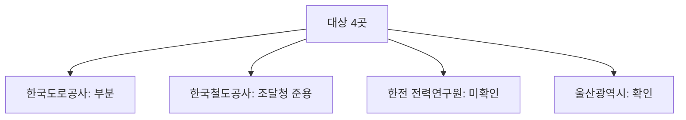

# 한국도로공사·한국철도공사·한전 전력연구원·울산광역시 일반용역 적격심사 원문 수집·판정

> **작성일**: 2026-10-05
> **작업**: Orca Task `task_645f7028e7d6` (builder), Run `run_03599ec1fd4a`, Dispatch `ctx_6884faa6ada8`
> **정본 사양**: `.orca/capsules/task_formula_recover_b/capsule.yaml` (`ORCA_TASK_CAPSULE_V2` 2.1.0)
> **기준 커밋**: `0f89fa0b` (작업 브랜치 `kwanbum217/formula-recover-b`, main 직접 커밋 없음)
> **대상**: 한국도로공사, 한국철도공사, 한전 전력연구원, 울산광역시
> **목적**: 네 대상의 일반용역 적격심사 세부기준 현행 원문을 나라장터 공고 첨부(DB 의 첨부 URL), 알리오 내부규정, 기관 공식 사이트에서 수집하고, 입찰가격 평점 산식(적용 구간, B, k, 기준비율, 평탄 구간, 통과점수, 최저평점)을 판정 규칙대로 정리해 현재 판정을 바꿔야 하는지 결론 낸다.
> **역할 경계**: 코드·설정·패키지를 변경하지 않았다. 커밋 산출물은 이 문서 한 편이다. `src/app/services/evaluation_rules.py` 를 손대지 않았다.
> **원본 위치**: 이번에 내려받은 원본과 추출 텍스트는 `.orca/capsules/task_645f7028e7d6/external/` 아래에만 두며 커밋하지 않는다. 기존 세션이 이미 받아 둔 원문 추출물(`.orca/capsules/*/external/`)은 읽기만 했다.
> **판정 규칙**: 2026-09-30 수집 세션 3절의 10개 규칙을 그대로 적용한다.

---

## 0. 결론 — 대상별 현재 판정 -> 이번 판정

| # | 대상 | 현재 판정 | 이번 판정 | 바뀌는가 | 핵심 |
| ---: | --- | --- | --- | --- | --- |
| 1 | 한국도로공사 | 부분 | 부분 | 유지 | 나라장터·전자조달·알리오 어디에서도 현행 2022-10-01 판 원문을 확보하지 못했다. 사용자 파일 2021-03-02 판 원문만 저장소에 있다 |
| 2 | 한국철도공사 | 분야 한정 | 조달청 준용 (일반용역) | 바뀜 | 공식 계약절차 페이지가 일반용역은 조달청 일반용역 적격심사 세부기준, 자체 기준은 기술용역이라고 명시한다 |
| 3 | 한전 전력연구원 | 미확인 | 미확인 | 유지 | 전력연구원 나라장터 발주는 조달청 경유 협상계약이라 적격심사 단서가 없다. 한전 본사 기준은 확보했으나 전력연구원 적용 근거는 확인하지 못했다 |
| 4 | 울산광역시 | 확인 | 확인 | 유지 | 계약정보시스템 계약법규 목록에 2022.7.21 판 한 건뿐이고 후속 판본이 게시되어 있지 않다 |

등급 정의는 기존 수집 문서와 같다. 확인은 공식 원문을 읽어 수치를 검산까지 마친 상태, 부분은 원문의 일부 칸을 읽지 못했거나 시행본이 아닌 판만 있는 상태, 조달청 준용은 자체 산식 없이 조달청 기준을 쓴다는 조항만 있는 상태, 미확인은 공식 원문을 확보하지 못한 상태다.

---

## 1. 적용한 판정 규칙 (2026-09-30 수집 세션 3절 그대로)

1. 상업 페이지(bidpro, 비드큐, info21c, 모두입찰, korbid, igunsul, 블로그)의 계수는 베끼지 않는다. 제목과 날짜 단서만 쓴다.
2. 나라장터 첨부는 파일 머리말이 그 기관 규정일 때만 원문이다. 개별 공고 배점표는 전사 규정이 아니다.
3. 조달청 준용 조항만 있으면 조항, 개정 표시, 시행일만 인용한다. 조달청 별표 숫자를 그 기관 계수로 옮기지 않는다.
4. 평점 = B − k × |(기준/100 − 입찰가격/예정가격) × 100|. B는 그 별표의 입찰가격 배점한도다.
5. 계수가 생략되고 평탄 대입이 인쇄 점수와 맞을 때만 k=1. 평탄 문장이 없으면 k=1로 두지 않는다.
6. 평탄 비율과 낙찰하한율로 k를 역산하지 않는다.
7. 대입 결과가 인쇄 점수와 다르면 그 행은 미확정이다. 0.01점 차이도 미확정이다. 원문이 비율만 적고 점수를 인쇄하지 않으면 대입값을 적고 원문이 그렇게 말한다고 밝힌다.
8. 5억 열과 고시금액 산식은 감점이 같아도 짝짓지 않는다.
9. 접속 실패, DNS 실패, 시간 초과는 문서가 없다는 증거가 아니다.
10. 시·도는 그 시의 가격 별표를 읽기 전에는 행정안전부 예규 제373호(규모 구간, 기준비율 88%)에 둔다. 예규는 시·도별로 식을 나누지 않는다.

---

## 2. 수집 환경과 도구

| 항목 | 값 |
| --- | --- |
| 내려받기 | `curl -L -m 30` |
| PDF 추출 | `uvx --from pdfminer.six pdf2txt.py <파일>` |
| HWP 추출 | `uvx --from pyhwp --with six hwp5txt <파일>`, 표 보존이 필요할 때 `hwp5html --output=<디렉터리>` |
| HWPX 추출 | `python3` 표준 `zipfile` 로 `Contents/section*.xml` 파싱 |
| DB 조회 | `uv run python scripts/db_readonly_query.py --sql "<질의>" --limit <n> --format json` |
| 금지 준수 | `pip install`, `uv add`, `brew install` 미사용. 운영 DB 쓰기·docker 조작 없음. 초당 1회 초과 요청 없음 |

이번에 새로 내려받은 원본과 추출 텍스트는 `.orca/capsules/task_645f7028e7d6/external/` 아래 기관별 폴더(`kepri`, `koex`, `ulsan`, `korail`)에 두었다. 사용자 파일과 기존 세션 원문은 `.orca/capsules/task_4103791c2123`, `.orca/capsules/task_ac5c1133322a`, `.orca/capsules/task_58ea8ddab6fb` 의 `external/` 에 있다. 리뷰어는 이 경로의 파일로 이 문서의 수치를 대조할 수 있다. 아래 인용의 `EXT` 약칭은 쓰지 않고 전체 상대 경로로 적는다.

---

## 3. 대상별 시도 경로와 결과

| 대상 | 시도 경로 | 응답 | 결과 |
| --- | --- | --- | --- |
| 한국도로공사 | 나라장터 공고 첨부, `dminstt_nm='한국도로공사'` | 200 (DB) | Servc 전체 2건(2015-08-11 염해조사, 2015-08-25 정밀안전진단)뿐이고 2025-01-01 이후 0건. 전사 세부기준 첨부 없음 |
| 한국도로공사 | 전자조달 `https://ebid.ex.co.kr/default.do` | 200 | 본문이 "한국도로공사 전자조달시스템" 뿐인 로그인 기반 화면. 자료실 문서 URL 미확보 |
| 한국도로공사 | 알리오 내부규정 목록 `https://www.alio.go.kr/occasional/ruleList.do` | 200 | 목록이 스크립트로 로드되어 정적 내려받기로는 기관별 규정을 특정하지 못함 |
| 한국도로공사 | 자회사 `한국도로공사서비스(주)` 공고 첨부 | 200 | 보험 공고에 `조달청 일반용역 적격심사 세부기준` 별지 양식 첨부. 자회사 사실이며 본사 판정에 쓰지 않음 |
| 한국철도공사 | 나라장터 공고 첨부, `dminstt_nm LIKE '한국철도공사%'` | 200 (DB) | Servc 44건, 최신 2024-08-29(건설사업관리 용역). 전사 일반용역 세부기준 첨부 없음 |
| 한국철도공사 | 전자조달 규정서식 `https://ebid.korail.com/board/ruleList.do` | 200 | 목록 `총 0 건`. 세션 기반 조회라 문서에 도달하지 못함 |
| 한국철도공사 | 공식 계약절차 안내 `https://info.korail.com/info/contents.do?key=2973` | 200 | 일반용역은 조달청 일반용역 적격심사 세부기준, 자체 기준은 기술용역·철도궤도/신호/전차선로 공사라고 명시 |
| 한전 전력연구원 | 나라장터 공고 첨부, `dminstt_nm='한전전력연구원'` | 200 (DB) | Servc 2건. 2025-12-08 공고는 조달청 명의 협상에 의한 계약이라 적격심사 단서가 없음 |
| 한전 전력연구원 | `https://srm.kepri.re.kr` | DNS 실패 | 호스트 해석 실패. 부재의 증거로 단정하지 않음(규칙 9) |
| 한전 전력연구원 | `https://www.kepri.re.kr:20808/index` | 200 | 홈페이지는 열리나 자체 일반용역 적격심사 문서를 확인하지 못함 |
| 한전 전력연구원 | 한전 본사 전자조달 `https://srm.kepco.net` | 200 | 일반용역 기준(2026.4)과 기술용역 기준(시행 2026-08-18) 확보. 전력연구원 적용 근거는 미확인 |
| 울산광역시 | 나라장터 공고 첨부, `dminstt_nm='울산광역시'` | 200 (DB) | 최근 일반용역 다수가 수의계약 견적제출(적격심사 비대상)이고 세부기준 첨부 없음. 경쟁입찰 건은 "적격심사 비대상" 표기 |
| 울산광역시 | 계약정보시스템 계약법규 `https://contract.ulsan.go.kr/contract/info/regulations` | 200 | 목록에 `울산광역시 일반용역 적격심사 세부기준(2022.7.21.일부개정)`(idx=314) 한 건뿐. 후속 판본 없음 |
| 울산광역시 | 고시공고 `https://www.ulsan.go.kr/u/rep/transfer/notice/34811.ulsan` | 200 | 공고 제2022-1100호 1건 |
| 울산광역시 | 자치법규정보시스템(ELIS) | 검색 특정 실패 | 화면이 스크립트 기반이라 개정 이력 목록을 정적으로 특정하지 못함 |

---

## 4. 한국도로공사 — 부분 유지 (현행 2022-10-01 판 원문 미확보)

### 4.1 판정

- 현행 2022-10-01 판 원문은 이번 세션에서도 확보하지 못했다. 나라장터 첨부, 전자조달, 알리오 어느 경로도 원문 파일에 도달하지 못했다(3절).
- 저장소에 있는 것은 사용자 제공 2021-03-02 시행판 원문이다. 시행본(현행)이 아니므로 이 문서는 2021-03-02 판 수치를 "시행본 아님"으로 명시해 기록한다.
- 상업 페이지 제목 단서로는 `한국도로공사 일반용역 적격심사 세부기준 (2022.10.1 시행)`, `2022. 10. 1. 개정`이 확인된다(규칙 1에 따라 제목과 날짜 단서만 쓴다). 이 단서는 현행판이 존재한다는 사실만 말하며 계수는 옮기지 않는다.
- 선행 세션(2026-09-30) 재계산 문서가 2022-10-01 판을 인용한 값은 이번 세션에 원문 파일로 다시 열지 못했으므로, 이 문서는 그 값을 원문 인용으로 세지 않는다.

판정: **부분 유지**. 원문 자체가 없는 것이 아니라 현행판을 확보하지 못한 상태다.

### 4.2 문서 식별 (확보본, 시행본 아님)

| 항목 | 값 |
| --- | --- |
| 문서명 | 용역적격심사 세부기준 |
| 문서번호 | 원문 부재(개정 연혁만 인쇄) |
| 제정·개정 | `1995. 8.29. 제정` 부터 `2021. 3. 2. 개정` 까지 25차 개정 연혁 |
| 시행 | 부칙 제1조 `이 세부기준은 2021년 3월 2일 이후에 입찰공고를 한 후 실시하는 용역 적격심사부터 적용한다` |
| 출처 | 사용자 제공 파일(2026-10-04) |
| 원본 경로 | `data/sources/qualification/files/koex/1e0fb31939d2_한국도로공사 용역적격심사세부기준(20210302시행).hwp` |
| 추출문 | `data/sources/qualification/files/koex/567695672f3f_extracted_TABLE_한국도로공사 용역적격심사세부기준(20210302시행).txt` |
| 등급 | 부분(시행본 아님, 현행 2022-10-01 판 미확보) |

제1조는 근거를 `공기업·준정부기관 계약사무규칙 제12조 및 기획재정부 계약예규 적격심사기준`에 두고 적용 대상을 `한국도로공사가 집행하는 용역입찰`로 정한다. 아래 수치는 위 추출문 행으로 인용한다.

### 4.3 입찰가격 평점 산식과 검산 (2021-03-02 판)

통과점수는 제5조제1항에서 인용했다. `85점이상인 자(단, 추정가격이 10억원 이상인 기술용역은 92점, 추정가격이 10억원 미만인 기술용역은 95점 이상인 자)` — `data/sources/qualification/files/koex/567695672f3f_extracted_TABLE_한국도로공사 용역적격심사세부기준(20210302시행).txt:48`.

**별표 1 일반용역**

| 적용 구간 | B | k | 기준 | 평탄 문장(원문) | 통과점수 | 최저평점 | 원문 인쇄점수 | 대입값 | 판정 | 인용 |
| --- | ---: | ---: | ---: | --- | ---: | ---: | ---: | ---: | --- | --- |
| 추정가격 10억원 이상 | 30 | 미확정(계수 생략) | 88 | 없음 | 85 | 2 | 없음 | 산출 불가 | 미확정(규칙 5) | `...table.txt:77` |
| 5억원 이상 10억원 미만 | 50 | 2 | 88 | `100분의 95.5이상인 경우의 평점은 35점으로 한다` | 85 | 2 | 35 | 50 − 2×7.5 = 35.000 | 일치 | `...table.txt:81` |
| 고시금액 이상 5억원 미만 | 70 | 3 | 88 | `100분의 93이상인 경우의 평점은 55점으로 한다` | 85 | 4 | 55 | 70 − 3×5 = 55.000 | 일치 | `...table.txt:85` |
| 고시금액 미만 | 80 | 5 | 88 | `100분의 91이상인 경우의 평점은 65점으로 한다` | 85 | 5 | 65 | 80 − 5×3 = 65.000 | 일치 | `...table.txt:90` |

**별표 2 시설분야용역**

| 적용 구간 | B | k | 기준 | 평탄 문장(원문) | 통과점수 | 최저평점 | 원문 인쇄점수 | 대입값 | 판정 | 인용 |
| --- | ---: | ---: | ---: | --- | ---: | ---: | ---: | ---: | --- | --- |
| 고시금액 이상 | 70 | 60 | 88 | `예정가격 대비 입찰가격의 비율이 88.25% 이상인 경우 평점은 88.25% 평점으로 함` | 85 | 2 | 미인쇄 | 70 − 60×0.25 = 55.000 | 미확정(규칙 7) | `...table.txt:106` |
| 고시금액 미만 | 80 | 60 | 88 | 상동 | 85 | 2 | 미인쇄 | 80 − 60×0.25 = 65.000 | 미확정(규칙 7) | `...table.txt:106` |

**별표 3 기술용역**

| 적용 구간 | B | k | 기준 | 평탄 문장(원문) | 통과점수 | 최저평점 | 원문 인쇄점수 | 대입값 | 판정 | 인용 |
| --- | ---: | ---: | ---: | --- | ---: | ---: | ---: | ---: | --- | --- |
| 추정가격 10억원 이상 | 30 | 1(계수 생략) | 88 | `100분의 96이상인 경우의 평점은 22점으로 한다` | 92 | 2 | 22 | 30 − 1×8 = 22.000 | 일치(규칙 5) | `...table.txt:131` |
| 5억원 이상 10억원 미만 | 50 | 2 | 88 | `100분의 90.5이상인 경우의 평점은 45점으로 한다` | 95 | 2 | 45 | 50 − 2×2.5 = 45.000 | 일치 | `...table.txt:135` |
| 고시금액 이상 5억원 미만 | 70 | 4 | 88 | `100분의 89.25이상인 경우의 평점은 65점으로 한다` | 95 | 2 | 65 | 70 − 4×1.25 = 65.000 | 일치 | `...table.txt:139` |
| 고시금액 미만 | 90 | 20 | 88 | `100분의 88.25이상인 경우의 평점은 85점으로 한다` | 95 | 2 | 85 | 90 − 20×0.25 = 85.000 | 일치 | `...table.txt:144` |

주의: 위 표의 등급은 "2021-03-02 판(시행본 아님)"의 검산 결과다. 현행 2022-10-01 판의 계수는 이 문서로 확정하지 않는다.

### 4.4 소결

- 현행 2022-10-01 판 원문 미확보이므로 현재 판정 `부분`을 유지한다.
- 사용자 파일 2021-03-02 판은 별표 1·2·3 을 모두 담고 있어, 일반용역 5억 미만 구간 세 개(50-2×, 70-3×, 80-5×)와 기술용역 네 구간(30-1×, 50-2×, 70-4×, 90-20×)의 검산이 원문 인쇄 점수와 일치한다. 다만 이는 2021-03-02 판이며 현행판으로 부르지 않는다.
- 일반용역 10억원 이상 구간과 시설분야용역 두 구간은 각각 계수 생략·평탄 점수 미인쇄로 미확정이다(규칙 5·7).
- 다음 수집 경로는 기관 전자조달 로그인 계정 또는 정보공개청구다.

---

## 5. 한국철도공사 — 일반용역은 조달청 준용 (판정 바뀜)

### 5.1 판정

공식 계약절차 안내 페이지가 낙찰자 결정 구조를 다음과 같이 명시한다. 인용은 `https://info.korail.com/info/contents.do?key=2973`(한국철도공사 공식, 확인 날짜 2026-10-05) 본문이다.

- `1. 적격심사 낙찰자 결정 시 계약이행능력을 심사` 아래에 `(조달청) 일반용역 적격심사 세부기준`, `(한국철도공사) 기술용역 적격심사 세부기준`, `(한국철도공사) 철도궤도, 철도신호, 철도전차선로 공사 적격심사 세부기준` 이 나란히 적혀 있다.
- 즉 한국철도공사의 **일반용역**은 자체 세부기준이 아니라 **조달청 일반용역 적격심사 세부기준**을 적용한다. 자체 기준은 기술용역과 철도궤도·신호·전차선로 공사에 둔다.

따라서 "한국철도공사 전사 일반용역 적격심사 세부기준"은 별도 자체 문서가 아니며, 판정 등급은 **조달청 준용**이다. 규칙 3에 따라 조항·개정 표시·시행일만 인용하고 조달청 별표 숫자를 한국철도공사 계수로 옮기지 않는다.

기존에 확보한 자체 기준은 두 갈래다.

| 문서 | 범위 | 시행 | 출처·근거 | 등급 |
| --- | --- | --- | --- | --- |
| 승강기 점검보수 일반용역 적격심사 세부기준 | 승강기 점검보수용역 한정 | `한국철도공사 건축기술단 공고 제2026-01호(2026.9.14.개정)`, 부칙 `이 기준은 공고된 날로부터 시행` | 사용자 제공 파일, 원본 `data/sources/qualification/files/korail/369f83debc3b_한국철도공사 승강기_점검보수_일반용역_적격심사_세부기준_개정(2026.09.14).hwp`, 추출문 `data/sources/qualification/files/korail/616b07286783_korail.txt` | 확인(분야 한정) |
| 기술용역 적격심사 세부기준 | 기술용역 | 개정 2022-01-24, 2026-02-27 단서 | 공식 페이지가 자체 기준으로 지목. 원문 파일은 미확보(상업 게시판에 제목·날짜 단서만) | 원문 미확보, 현행판 단서 있음 |

### 5.2 승강기 점검보수용역 한정 별표 검산 (원문 인용)

통과점수는 제4조제1항에서 인용했다. `추정가격이 10억원 미만인 용역 : 종합평점 95점이상`, `추정가격이 10억원 이상인 용역 : 종합평점 92점 이상` — `data/sources/qualification/files/korail/616b07286783_korail.txt:12-13`. 기준비율은 네 구간 모두 90으로 인쇄되어 있다(88·91·93 과 다른 값이다).

| 적용 구간(추정가격) | B | k | 기준 | 평탄 문장(원문) | 통과점수 | 최저평점 | 원문 인쇄점수 | 대입값 | 판정 | 인용 |
| --- | ---: | ---: | ---: | --- | ---: | ---: | ---: | ---: | --- | --- |
| 10억원 이상 | 30 | 1(계수 생략) | 90 | `100분의 98이상인 경우의 평점은 22점으로 한다` | 92 | 2 | 22 | 30 − 1×8 = 22.000 | 일치(규칙 5) | `korail_full.txt:74`, `:87`, `:89`, `:99`, `:102` |
| 10억원 미만 5억원 이상 | 50 | 2 | 90 | `100분의 92.5이상인 경우의 평점은 45점으로 한다` | 95 | 2 | 45 | 50 − 2×2.5 = 45.000 | 일치 | `korail_full.txt:137`, `:150`, `:152`, `:162`, `:165` |
| 5억원 미만 | 70 | 4 | 90 | `100분의 91.25이상인 경우의 평점은 65점으로 한다` | 95 | 2 | 65 | 70 − 4×1.25 = 65.000 | 일치 | `korail_full.txt:200`, `:213`, `:215`, `:225`, `:228` |
| 고시금액 미만 | 90 | 20 | 90 | `100분의 90.25이상인 경우의 평점은 85점으로 한다` | 95 | 2 | 85 | 90 − 20×0.25 = 85.000 | 일치 | `korail_full.txt:263`, `:276`, `:278` |

10억원 이상 구간의 계산식은 `평점(점) = 30 -|(90/100 - 입찰가격/예정가격)×100|` 로 인쇄되어 계수 자리가 없고(`korail_full.txt:87`), 평탄 대입이 인쇄 점수 22와 정확히 맞으므로 규칙 5에 따라 k=1로 확정한다.

### 5.3 소결

- **일반용역 판정이 분야 한정에서 조달청 준용으로 바뀐다.** 자체 전사 일반용역 세부기준은 존재하지 않고, 공식 페이지가 조달청 기준을 지목한다.
- 자체 기준은 기술용역·공사(철도궤도/신호/전차선로)·승강기 점검보수용역에 한정된다. 승강기 한정 기준의 네 구간은 대입값이 인쇄 점수와 모두 일치한다.
- 일반용역에 적용되는 조달청 기준의 조항·시행일은 이번 세션에 조달청 원문으로 별도 확인하지 않았으므로, 이 문서는 "한국철도공사 일반용역 = 조달청 준용" 이라는 기관 지목 사실만 기록한다.

---

## 6. 한전 전력연구원 — 미확인 유지 (한전 본사 기준은 별도 확보)

### 6.1 판정

- 전력연구원은 한국전력공사 소속 조직이며, 나라장터 `dminstt_nm='한전전력연구원'` 공고는 Servc 2건뿐이다.
- 2025-12-08 `인도네시아 ODA 사업용 MDMS 현지화 개발`(추정가격 794,694,018원)은 **조달청 명의** `제한(총액)협상에의한계약` 공고로 적격심사가 아니다. 공고서 원문에 적격심사 인용이 없다 — 원본 `data/sources/qualification/files/kepri/cbfb7cb8e54d_kepri_gonggo_R25BK01212422.hwp`, 추출문 `data/sources/qualification/files/kepri/6f66e559f63b_index.xhtml`. 따라서 "전력연구원 발주 용역이 어떤 적격심사 세부기준을 인용하는지"는 이 공고로 확인되지 않는다.
- 2015-07-06 `2015년 전력연구원 사옥위탁관리 청소용역`은 나라장터 DB 에 제목만 있고 적격심사 세부기준 인용은 확인하지 않았다.
- `srm.kepri.re.kr` 는 DNS 해석에 실패했고, `www.kepri.re.kr:20808` 은 열리지만 자체 적격심사 문서가 확인되지 않았다. 규칙 9에 따라 부재로 단정하지 않는다.
- 전력연구원이 한전 본사 기준을 쓰는지 여부는 확인하지 못했다. 2026-09-30 기록의 쟁점(한전 계약업무 집행지침 제3조가 전력연구원을 포함하지 않음)은 이번 세션에도 해소되지 않았다.

판정: **미확인 유지**.

### 6.2 참고 — 한전 본사 기준 (전력연구원 적용 근거는 미확인)

전력연구원 적용 여부와 별개로, 모회사인 한국전력공사의 일반용역·기술용역 적격심사 세부기준을 `https://srm.kepco.net` 에서 확보했다. 이는 전력연구원 자체 기준이 아니므로 별도 기록으로만 둔다.

| 항목 | 일반용역 | 기술용역 |
| --- | --- | --- |
| 문서명 | 적격심사기준 | 한국전력공사 기술용역 적격심사 세부기준 |
| 표제·시행 | 표제 `2026. 4`, 부칙 `2026년 4월 입찰 공고하는 적격심사 대상 용역부터 적용` | 부칙 `이 세부기준은 2026년 8월 18일부터 시행한다` |
| 출처 URL | `https://srm.kepco.net/printDownloadAttachment.do?id=b3d99179-caf8-4f14-9ddc-8bddba1f90b7` | `https://srm.kepco.net/printDownloadAttachment.do?id=e626a330-4298-46c6-b5b2-c279f2f1e135` |
| 원본 경로 | `data/sources/qualification/files/kepri/39edeaabb702_kepco_ilban_2026_04.bin` | `data/sources/qualification/files/kepri/3d3278a7bb48_kepco_gisul_qual.bin` |
| 추출문 | `data/sources/qualification/files/kepri/0d3ea51ae087_kepco_ilban_2026_04.txt` | `data/sources/qualification/files/kepri/77f1a64dc14d_kepco_gisul.txt` |
| 적용 대상 | 제1조 `한국전력공사에서 집행하는 일반용역 입찰` | 제1조 `한전에서 집행하는 기술용역 입찰` |
| 통과점수 | 제10조① 종합평점 85점(소프트웨어용역의 중소기업자간 경쟁제품, 여객 육상운송용역 88점) | 제5조 `용역규모별 적격통과점수` |

일반용역 별표 1 의 입찰가격 평점산식은 원문 인쇄가 다음과 같다(추출문 `kepco_ilban_2026_04.txt`).

- 고시금액 이상: `평점(점) = 배점한도 - 2 × |(88/100 - 입찰가격/예정가격) × 100|` (`:621-626`), 평탄 `예정가격의 95.5%인 경우의 점수로 평가` (`:679-683`)
- 고시금액 미만: `평점(점) = 배점한도 - 4 × |(88/100 - 입찰가격/예정가격) × 100|` (`:629-634`), 평탄 `예정가격의 91.75%인 경우의 점수로 평가` (`:684-688`)
- 공통: `최저평점은 2점으로 함` (`:694`)

기술용역 별표 1 의 입찰가격 항목은 `평점 = 90 - 20 × |(90/100 - 입찰가격/예정가격) × 100|`, `최저평점은 2점으로 한다`, 평탄 `예정가격의 100분의 90.25이상인 경우의 평점은 85점으로 한다` 로 인쇄되어 있다(`kepco_gisul.txt:219-234`).

주의(미확정): 두 문서의 배점한도(B) 표는 PDF 추출에서 표 칸 순서가 뒤섞여 값이 확정되지 않았다. 위 산식이 쓰는 `배점한도` 기호의 실제 숫자를 원문 행에서 특정하지 못했으므로 B 는 미확정으로 둔다(규칙 7 정신). 평탄 점수를 인쇄하지 않는 행은 검산 통과로 세지 않는다.

### 6.3 소결

- 전력연구원 판정은 미확인을 유지한다. 발주 실적이 조달청 경유 협상계약이라 적격심사 단서가 없고, 자체 SRM 은 DNS 실패, 자체 홈페이지에는 문서가 확인되지 않았다.
- 한전 본사 기준은 확보했으나 전력연구원 적용 근거가 확인되지 않아 전력연구원 계수로 옮기지 않는다(규칙 3 정신).
- 다음 수집 경로는 전력연구원 자체 전자조달 호스트 재확인 또는 정보공개청구다.

---

## 7. 울산광역시 — 확인 유지 (2022.7.21 판이 게시 최신본)

### 7.1 판정

- 계약정보시스템 계약법규 목록(`https://contract.ulsan.go.kr/contract/info/regulations`, 확인 2026-10-05)에 `울산광역시 일반용역 적격심사 세부기준(2022.7.21.일부개정)` 한 건(idx=314)만 있다. 그 뒤 일반용역 적격심사 세부기준 항목은 없다. 페이지 응답은 200이며 목록 자체는 정상 수신했다.
- 고시공고(`https://www.ulsan.go.kr/u/rep/transfer/notice/34811.ulsan`)에도 공고 제2022-1100호 한 건이다.
- 나라장터의 최근 울산광역시 일반용역 공고는 수의계약 견적제출(적격심사 비대상)이거나 첨부에 세부기준이 없다. 다만 접속 성공이나 목록 부재를 문서 부재로 단정하지 않는다(규칙 9).

판정: **확인 유지**. 2022-07-21 일부개정(공고 제2022-1100호)이 공식 게시 최신본이고, 그 이후 대체 원문은 확인되지 않았다.

### 7.2 문서 식별

| 항목 | 값 |
| --- | --- |
| 문서명 | 울산광역시 일반용역 적격심사 세부기준 |
| 문서번호 | 울산광역시 공고 제2022-1100호(일부개정 2022-07-21) |
| 시행 | 2022-08-10(2022.08.10. 입찰공고분부터 적용). 부칙에서 종전 공고 제2019-1401호 폐지 |
| 출처 URL | `https://contract.ulsan.go.kr/contract/info/regulations?idx=314&mode=view`, 고시공고 `https://www.ulsan.go.kr/u/rep/transfer/notice/34811.ulsan` |
| 확인 날짜 | 2026-10-05(최신본 여부), 원문 수치 확인 2026-10-04 |
| 원본 경로 | `data/sources/qualification/files/ulsan/0a4c5d79ff9d_ulsan_general_20220810.hwp` |
| 추출문 | `data/sources/qualification/files/ulsan/0e673b450ec3_ulsan_general_20220810.tbl.txt`, 본문 `data/sources/qualification/files/ulsan/c6a460417140_ulsan.txt` |
| 등급 | 확인 |

### 7.3 입찰가격 평점 산식과 검산

통과점수는 제5조제1항에서 인용했다. `추정가격 30억원 이상 용역은 85점 이상, 30억원 미만 10억원 이상인 용역은 90점 이상, 10억원 미만인 용역은 95점 이상`, 단순노무는 추정가격 무관 95점, 생활폐기물은 10억원 이상 90점/미만 95점 — `data/sources/qualification/files/ulsan/c6a460417140_ulsan.txt:46`. 기준비율은 모든 별표에서 88이다.

| 별표·적용 구간 | B | k | 기준 | 평탄 문장(원문) | 통과점수 | 최저평점 | 원문 인쇄점수 | 대입 검산 | 판정 | 인용(추출문 `ulsan_general_20220810.tbl.txt`) |
| --- | ---: | ---: | ---: | --- | ---: | ---: | ---: | ---: | --- | --- |
| 별표 1, 10억원 이상, 단순노무 외 | 30 | 1(계수 생략) | 88 | `100분의 98 이상인 경우의 평점은 20점으로 함` | 95 | 2 | 20 | 30 − 10 = 20.000 | 일치(규칙 5) | `:15` |
| 별표 1, 10억원 이상, 단순노무 | 30 | 20 | 88 | `100분의 88.25 이상인 경우의 평점은 25점으로 함` | 95 | 2 | 25 | 30 − 5 = 25.000 | 일치 | `:16` |
| 별표 1, 10억원 미만 5억원 이상, 단순노무 외 | 50 | 2 | 88 | `100분의 90.5 이상인 경우의 평점은 45점으로 함` | 95 | 2 | 45 | 50 − 5 = 45.000 | 일치 | `:59` |
| 별표 1, 10억원 미만 5억원 이상, 단순노무 | 50 | 20 | 88 | `100분의 88.25 이상인 경우의 평점은 45점으로 함` | 95 | 2 | 45 | 50 − 5 = 45.000 | 일치 | `:60` |
| 별표 1, 5억원 미만 2억원 이상, 단순노무 외 | 70 | 4 | 88 | `100분의 89.25 이상인 경우의 평점은 65점으로 함` | 95 | 2 | 65 | 70 − 5 = 65.000 | 일치 | `:103` |
| 별표 1, 5억원 미만 2억원 이상, 단순노무 | 70 | 20 | 88 | `100분의 88.25 이상인 경우의 평점은 65점으로 함` | 95 | 2 | 65 | 70 − 5 = 65.000 | 일치 | `:104` |
| 별표 1, 2억원 미만(단순노무 포함) | 90 | 20 | 88 | `100분의 88.25 이상인 경우의 평점은 85점으로 함` | 95 | 2 | 85 | 90 − 5 = 85.000 | 일치 | `:146`, `:147` |
| 별표 1-1 생활폐기물, 30억원 이상 | 30 | 40 | 88 | `100분의 88.25 이상인 경우의 평점은 20점으로 함` | 90 | 2 | 20 | 30 − 10 = 20.000 | 일치 | `:194` |
| 별표 1-1 생활폐기물, 30억원 미만 10억원 이상 | 50 | 20 | 88 | `100분의 88.25 이상인 경우의 평점은 45점으로 함` | 90 | 2 | 45 | 50 − 5 = 45.000 | 일치 | `:240` |
| 별표 1-1 생활폐기물, 10억원 미만 | 70 | 20 | 88 | `100분의 88.25 이상인 경우의 평점은 65점으로 함` | 95 | 2 | 65 | 70 − 5 = 65.000 | 일치 | `:286` |
| 별표 2 폐기물처리, 10억원 이상 | 30 | 1(계수 생략) | 88 | `100분의 98 이상인 경우의 평점은 20점으로 함` | 95 | 2 | 20 | 30 − 10 = 20.000 | 일치(규칙 5) | `:331` |
| 별표 2 폐기물처리, 10억원 미만 5억원 이상 | 50 | 2 | 88 | `100분의 90.5 이상인 경우의 평점은 45점으로 함` | 95 | 2 | 45 | 50 − 5 = 45.000 | 일치 | `:373` |
| 별표 2 폐기물처리, 5억원 미만 2억원 이상 | 70 | 4 | 88 | `100분의 89.25 이상인 경우의 평점은 65점으로 함` | 95 | 2 | 65 | 70 − 5 = 65.000 | 일치 | `:415` |
| 별표 2 폐기물처리, 2억원 미만 | 90 | 20 | 88 | `100분의 88.25 이상인 경우의 평점은 85점으로 함` | 95 | 2 | 85 | 90 − 5 = 85.000 | 일치 | `:456` |

### 7.4 소결

- 2022-07-21 판의 별표 수치는 추출문에서 대입값과 인쇄 점수가 0.01점 차이도 없이 일치한다.
- 공식 게시 최신본이 2022-07-21 판이므로 이후 개정 여부는 "공식 목록에 후속 판본 미게시"로 적고, 부재로 단정하지 않는다(규칙 9).

---

## 8. 확정·미확정 정리

### 8.1 이번 세션에 원문으로 확인한 것

| 대상 | 확인 내용 | 등급 |
| --- | --- | --- |
| 한국도로공사 | 2021-03-02 시행판(시행본 아님) 별표 1 일반용역 5억 미만 3구간·별표 3 기술용역 4구간 검산 일치, 별표 2 시설분야·일반용역 10억 이상 미확정 | 부분 |
| 한국철도공사 | 일반용역은 조달청 준용(공식 페이지). 승강기 점검보수 한정 기준 4구간 검산 일치 | 조달청 준용(일반용역), 확인(승강기 한정) |
| 한전 전력연구원 | 발주 공고는 조달청 협상계약이라 적격심사 단서 없음. 한전 본사 기준(일반용역 2026.4, 기술용역 2026-08-18) 별도 확보 | 미확인 |
| 울산광역시 | 2022-07-21 판 별표 1·1-1·2 전 구간 검산 일치, 공식 게시 최신본 | 확인 |

### 8.2 미확보·미확정

- 한국도로공사: 현행 2022-10-01 판 원문 미확보. 2022-10-01 판 계수는 상업 제목·날짜 단서와 선행 문서 인용만 있고 원문 파일로 재확인하지 않았다.
- 한국철도공사: 자체 기술용역 적격심사 세부기준(개정 2026-02-27 단서) 원문 미확보. 일반용역에 적용되는 조달청 기준의 조항·시행일을 조달청 원문으로 별도 확인하지 않았다.
- 한전 전력연구원: 자체 기준 원문 미확보, 한전 본사 기준의 전력연구원 적용 근거 미확인.
- 한전 본사 기준: 배점한도(B) 표가 PDF 추출에서 뒤섞여 값 미확정.
- 울산광역시: 2022-07-21 판 이후 후속 판본 없음(공식 목록 기준).

### 8.3 판정 등급 집계

---

## 9. 검증과 산출물

| 항목 | 값 |
| --- | --- |
| 검증 명령 | `python3 scripts/validate_agent_rules.py --quiet` |
| 문서 링크 시험 | `uv run pytest tests/test_validate_doc_links.py -q` |
| 변경 파일 | `docs/analysis/servc_formula_recover_b_20261005.md` 1개 |
| 원본·추출물 | `.orca/capsules/task_645f7028e7d6/external/` 아래, 커밋하지 않음 |
| 작업 브랜치 | `kwanbum217/formula-recover-b` (main 직접 커밋 없음) |

`src/app/services/evaluation_rules.py`, 테스트, DB 스키마, Meilisearch 색인, Docker 관련 파일은 변경하지 않았다. 계수·기준율을 코드에 입력하지 않았다.

---

## 10. 참고

- `docs/analysis/servc_formula_collection_central_20261004.md` — 중앙부처·공단 9곳(한국도로공사·한국철도공사 포함)
- `docs/analysis/servc_formula_collection_energy_20261004.md` — 에너지·공항 공기업 8곳(한전 전력연구원 포함)
- `docs/analysis/servc_formula_collection_local_20261004.md` — 지자체 12곳(울산광역시 포함)
- `docs/analysis/servc_formula_userfiles_agency_20261004.md` — 사용자 제공 공공기관 6건(한국철도공사 승강기 한정 포함)
- `docs/analysis/servc_formula_userfiles_existing_20261004.md` — 기관 5건(한국도로공사 2021-03-02 판 포함)
- `docs/ops/handoff_20261004_estprice_tailwind4_datebomb_session_close.md` — 인수인계 8.3절 원문 미확보 7곳 현황
