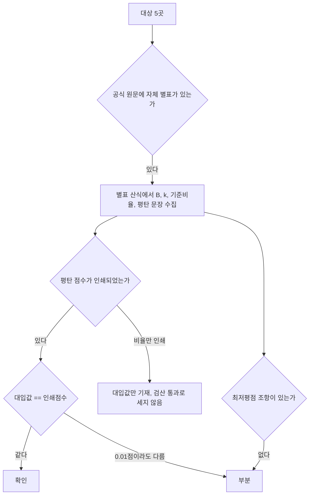

# 서울·부산·대전·충남·전북 일반용역 적격심사 입찰가격 산식 재수집 (5곳)

> **작성일**: 2026-10-05
> **작업**: Orca Task `task_809e97534b72` (builder, `run_03599ec1fd4a`)
> **목적**: 2026-09-30 세션에서 확인으로 분류됐으나 원문 파일이 사라진 5곳(서울특별시, 부산광역시, 대전광역시, 충청남도, 전북특별자치도)의 일반용역 적격심사 세부기준 현행 원문을 다시 수집해 별표별 입찰가격 평점 산식(적용 구간, B, k, 기준비율, 평탄 구간, 통과점수, 최저평점)과 적용범위 조항을 판정 규칙대로 정리한다.
> **범위 경계**: 코드·설정·패키지 파일을 바꾸지 않았습니다. `src/app/services/evaluation_rules.py` 에 계수를 입력하지 않았습니다. 산출물은 이 문서 하나입니다.
> **원문 추출물 위치**: `.orca/capsules/task_809e97534b72/external/<기관>/` 이며 커밋하지 않습니다. 이 문서는 `.orca/` 를 마크다운 링크로 걸지 않고 인라인 코드로만 언급합니다.
> **경로 약칭**: 표와 인용에서 `EXT` 는 `.orca/capsules/task_809e97534b72/external` 을 뜻합니다.
> **확인 날짜**: 아래 5곳 모두 2026-10-05 확인.
> **결론**: 5곳 모두 판정했습니다. 확인 4곳(서울·부산·대전·전북), 부분 1곳(충남)입니다. 조달청 별표 숫자를 옮긴 곳은 없고, 5곳 모두 자체 별표에 산식이 인쇄되어 있습니다.

---

## 1. 결론: 대상별 현재 판정 -> 이번 판정

| # | 대상 | 2026-09-30 판정 | 이번 판정 | 원문 확보 | 핵심 한 줄 |
| ---: | --- | --- | --- | --- | --- |
| 1 | 서울특별시 | 확인(시행 2024-08-12) | 확인 | 확보 | 별표 1·2·3·4, 기준 88, k 1/2/4/20, 인쇄 점수 전부 일치 |
| 2 | 부산광역시 | 확인(공고 2025-1981호) | 확인 | 확보 | 공고 제2025-1981호, 시행 2025-06-26. 기준 88, k 1/2/4/20, 인쇄 점수 전부 일치 |
| 3 | 대전광역시 | 확인(공고 2025-9528호) | 확인 | 확보 | 공고 제2025-9528호, 시행 2026-01-01. 별표 6, 청소류 k=20·소프트웨어류 k=1/2/4/20 |
| 4 | 충청남도 | 확인(공고 2026-1235호) | 부분 | 확보 | B·k·기준비율은 인쇄되어 있으나 평탄 점수 미인쇄, 최저평점 조항 원문에 없음 |
| 5 | 전북특별자치도 | 확인(부칙 제2024-10호) | 확인 | 확보 | 부칙 제2024-10호, 시행 2024-01-18. 기준 88, k 1/2/4/20, 인쇄 점수 전부 일치 |

**등급 집계**: 확인 4곳, 부분 1곳, 미확인 0곳.

**전 대상 공통**: 평점 산식은 `평점 = B − k × |(기준/100 − 입찰가격/예정가격) × 100|` 이고, 확인·부분 행의 기준비율은 88 또는 91입니다. 5곳 모두 자체 별표에 산식이 직접 인쇄되어 있어 조달청 준용으로 내려간 대상은 없습니다.

---

## 2. 판정 규칙 (2026-09-30 수집 세션 3절 그대로 적용)

1. 상업 페이지(bidpro, 비드큐, info21c, 모두입찰, korbid, igunsul, 블로그)의 계수는 베끼지 않는다. 제목과 날짜 단서만 쓴다.
2. 나라장터 첨부는 파일 머리말이 그 기관 규정일 때만 원문이다. 개별 공고 배점표는 전사 규정이 아니다.
3. 조달청 준용 조항만 있으면 조항, 개정 표시, 시행일만 인용한다. 조달청 별표 숫자를 그 기관 계수로 옮기지 않는다.
4. 평점 = B − k × |(기준/100 − 입찰가격/예정가격) × 100|. B는 그 별표의 입찰가격 배점한도다.
5. 계수가 생략되고 평탄 대입이 인쇄 점수와 맞을 때만 k=1. 평탄 문장이 없으면 k=1로 두지 않는다.
6. 평탄 비율과 낙찰하한율로 k를 역산하지 않는다.
7. 대입 결과가 인쇄 점수와 다르면 그 행은 미확정이다. 0.01점 차이도 미확정이다. 원문이 비율만 적고 점수를 인쇄하지 않으면 대입값을 적고 원문이 그렇게 말한다고 밝힌다.
8. 5억 열과 고시금액 산식은 감점이 같아도 짝짓지 않는다.
9. 접속 실패, DNS 실패, 시간 초과는 문서가 없다는 증거가 아니다.
10. 시·도는 그 시의 가격 별표를 읽기 전에는 행정안전부 예규 제373호(규모 구간, 기준비율 88%)에 둔다. 예규는 시·도별로 식을 나누지 않는다.

---

## 3. 대상별 시도 경로와 결과

| # | 대상 | 시도한 경로 | 결과 |
| ---: | --- | --- | --- |
| 1 | 서울특별시 | 국가법령정보센터 자치법규 검색, 서울시 정보소통광장(`opengov.seoul.go.kr`) 검색, 서울시 계약마당(`contract.seoul.go.kr`), 서울시 보도자료(`news.seoul.go.kr`), 나라장터 공고 DB | 성공: 나라장터 공고 첨부에서 현행 전문 확보. `opengov`·`news.seoul.go.kr` 은 2007~2019년 옛 판본만 노출 |
| 1b | 서울특별시 | `bps.brmh.org:442`(서울시 산하 병원) 직링크 | 실패: HTTP 400. 호스트가 요청을 거부하며, 검색엔진 색인으로만 본문이 보임. 원문은 나라장터 첨부로 대체 확보 |
| 2 | 부산광역시 | 부산시 고시공고(`busan.go.kr/nbgosi`), 나라장터 공고 검색 | 성공: 고시공고 2025-1981 첨부(개정전문 hwpx) |
| 3 | 대전광역시 | 대전시 고시공고(`daejeon.go.kr/drh`), 나라장터 공고 검색 | 성공: 대전시 공고 첨부(공고 제2025-9528호 hwpx) |
| 4 | 충청남도 | 충청남도 도정공고(`minwon.chungnam.go.kr`, `chungnam.go.kr/gyeyak`), 계약법령예규 게시판 | 성공: 계약법령예규 게시판 파일(PDF). `minwon` 직링크는 404 |
| 5 | 전북특별자치도 | 전북 계약정보공개 알림 자료실(`jeonbuk.go.kr/board`) | 성공: 알림 자료실 게시본(hwp, 부칙 제2024-10호) |
| 5b | 전북특별자치도 | 알림 자료실 인접 글(정보통신용역, dataSid 535516) | 성공(참고): 일반용역 글은 dataSid 535515 로 확인 |

로그인·인증서·회원가입이 필요한 경로는 사용하지 않았습니다. `bps.brmh.org` 400 은 부재의 증거가 아니며(규칙 9), 같은 원문을 나라장터 첨부로 확보했으므로 판정에 영향이 없습니다.

---

## 4. 대상별 결과

### 4.1 서울특별시 — 확인

| 항목 | 값 |
| --- | --- |
| 문서명 | 서울특별시 일반용역 적격심사 세부기준 (개정전문) |
| 문서번호·차수 | 서울특별시 재무공고. 파일 머리말 `2024. 7.` 개정전문 |
| 시행일 | 2024. 8. 12. 이후 시행 (`data/sources/qualification/files/seoul/c3c437588e9f_seoul_general_2024_08_12.tbl.txt:36`) |
| 출처 | 나라장터 공고 `R26BK01557506`(서울특별시 재무공고 제2026-1589호) 첨부 5번 `★서울시 일반용역 적격심사 세부기준(2024.8.12.).hwp`. 보조: 서울시 정보소통광장 `https://opengov.seoul.go.kr/sanction/18765847` |
| 확인 날짜 | 2026-10-05 |
| 원본 파일 | `data/sources/qualification/files/seoul/8cf449ed49f4_seoul_general_2024_08_12.hwp`, 추출 `data/sources/qualification/files/seoul/c3c437588e9f_seoul_general_2024_08_12.tbl.txt` |
| 등급 | 확인 |

문서 머리말 `data/sources/qualification/files/seoul/c3c437588e9f_seoul_general_2024_08_12.tbl.txt:2`~`:3` = `서울특별시 일반용역 적격심사 세부기준 개정(전문)`. 통과점수 `:32` — 추정가격 30억원 이상 85점, 30억원 미만 10억원 이상 90점, 10억원 미만 95점, 단순노무 95점, 보험용역 85점. 아래 표의 인용은 모두 `data/sources/qualification/files/seoul/c3c437588e9f_seoul_general_2024_08_12.tbl.txt` 입니다.

| 적용 구간·구분 | B | k | 기준비율 | 평탄 문장(원문) | 인쇄점수 | 대입 검산 |
| --- | ---: | ---: | ---: | --- | ---: | --- |
| 10억원 이상, 단순노무 외 | 30 (`:369`) | 1(계수 생략 `:379`) | 88 (`:379`) | 30억원 미만 10억원 이상, 100분의 98 이상 → 20점 (`:380`) | 20 | 30−1×10 = **20.0000** 일치 |
| 10억원 이상, 단순노무 | 30 (`:369`) | 20 (`:381`) | 88 (`:381`) | 88.25 이상 → 25점 (`:382`) | 25 | 30−20×0.25 = **25.0000** 일치 |
| 10억원 미만 5억원 이상, 단순노무 외 | 50 (`:712`) | 2 (`:722`) | 88 (`:722`) | 90.5 이상 → 45점 (`:723`) | 45 | 50−2×2.5 = **45.0000** 일치 |
| 10억원 미만 5억원 이상, 단순노무 | 50 (`:712`) | 20 (`:724`) | 88 (`:724`) | 88.25 이상 → 45점 (`:725`) | 45 | 50−20×0.25 = **45.0000** 일치 |
| 5억원 미만 2억원 이상, 단순노무 외 | 70 (`:1055`) | 4 (`:1065`) | 88 (`:1065`) | 89.25 이상 → 65점 (`:1066`) | 65 | 70−4×1.25 = **65.0000** 일치 |
| 5억원 미만 2억원 이상, 단순노무 | 70 (`:1055`) | 20 (`:1067`) | 88 (`:1067`) | 88.25 이상 → 65점 (`:1068`) | 65 | 70−20×0.25 = **65.0000** 일치 |
| 2억원 미만, 단순노무 외 | 90 (`:1308`) | 20 (`:1318`) | 88 (`:1318`) | 88.25 이상 → 85점 (`:1319`) | 85 | 90−20×0.25 = **85.0000** 일치 |
| 2억원 미만, 단순노무 | 90 (`:1308`) | 20 (`:1320`) | 88 (`:1320`) | 88.25 이상 → 85점 (`:1321`) | 85 | 90−20×0.25 = **85.0000** 일치 |

최저평점 2점 (`:384`, `:727`, `:1070`, `:1323`). 준용·별표: 별표 1~4 및 보험용역 별표(`:1325`)가 인쇄되어 있고, 조달청 별표 숫자를 옮긴 곳은 없습니다.

**적용범위 조항**: 제1조(목적) `:7` — `서울특별시 및 그 관할구역 안에 있는 자치구에서 집행하는 일반용역계약에 적용할 적격심사 세부기준`. **자치구 포함**. 제3조(적용 범위) `:13` — `이 기준은 다른 법령 및 행정규칙 등에 특별한 심사기준이 있는 경우 외에 적용한다`.

### 4.2 부산광역시 — 확인

| 항목 | 값 |
| --- | --- |
| 문서명 | 부산광역시 일반용역 적격심사 세부기준 (개정 전문) |
| 문서번호·차수 | 부산광역시 공고 제2025-1981호 (2025. 6. 10.). 직전 제2023-1819호 |
| 시행일 | 2025. 6. 26.부터 입찰공고분. 다만 제9조②만 2025. 7. 1. (`:85`) |
| 출처 | 부산시 고시공고 `https://www.busan.go.kr/nbgosi/view?sno=72702&gosiGbn=A` 첨부 `[개정전문]부산광역시 일반용역 적격심사 세부기준.hwpx` |
| 확인 날짜 | 2026-10-05 |
| 원본 파일 | `data/sources/qualification/files/busan/b142d8a724f1_busan_general_hwpx.hwpx`, 추출 `data/sources/qualification/files/busan/242b87586a42_busan_general_2025_1981.txt` |
| 등급 | 확인 |

문서 머리말 `data/sources/qualification/files/busan/242b87586a42_busan_general_2025_1981.txt:1` = `부산광역시 공고 제2025-1981호(2025. 6. 10.)`. 통과점수 제7조 `:57` — 30억원 이상 85점, 30억원 미만 10억원 이상 90점, 10억원 미만 95점, 단순노무 95점. 보험서비스 용역은 예정가격 이하 최저가. 아래 표의 인용은 `:149`(입찰가격 평점 산식)와 `:150`입니다.

| 적용 구간·구분 | B | k | 기준비율 | 평탄 문장(원문) | 인쇄점수 | 대입 검산 | 낙찰하한율 |
| --- | ---: | ---: | ---: | --- | ---: | --- | --- |
| 10억원 이상, 단순노무 외 | 30 (`:149`) | 1(계수 생략 `:149`) | 88 (`:149`) | 30억원 미만 10억원 이상, 투찰률 98% 이상 → 20점 (`:149`) | 20 | 30−1×10 = **20.0000** 일치 | 72.995/77.995% |
| 10억원 이상, 단순노무 | 30 (`:149`) | 20 (`:149`) | 88 (`:149`) | 투찰률 88.25% 이상 → 25점 (`:149`) | 25 | 30−20×0.25 = **25.0000** 일치 | 87.745% |
| 10억원 미만 5억원 이상, 단순노무 외 | 50 (`:149`) | 2 (`:149`) | 88 (`:149`) | 투찰률 90.5% 이상 → 45점 (`:149`) | 45 | 50−2×2.5 = **45.0000** 일치 | 85.495% |
| 10억원 미만 5억원 이상, 단순노무 | 50 (`:149`) | 20 (`:149`) | 88 (`:149`) | 투찰률 88.25% 이상 → 45점 (`:149`) | 45 | 50−20×0.25 = **45.0000** 일치 | 87.745% |
| 5억원 미만 2억원 이상, 단순노무 외 | 70 (`:149`) | 4 (`:149`) | 88 (`:149`) | 투찰률 89.25% 이상 → 65점 (`:149`) | 65 | 70−4×1.25 = **65.0000** 일치 | 86.745% |
| 5억원 미만 2억원 이상, 단순노무 | 70 (`:149`) | 20 (`:149`) | 88 (`:149`) | 투찰률 88.25% 이상 → 65점 (`:149`) | 65 | 70−20×0.25 = **65.0000** 일치 | 87.745% |
| 2억원 미만, 단순노무 외 | 90 (`:149`) | 20 (`:149`) | 88 (`:149`) | 투찰률 88.25% 이상 → 85점 (`:149`) | 85 | 90−20×0.25 = **85.0000** 일치 | 87.745% |
| 2억원 미만, 단순노무 | 90 (`:149`) | 20 (`:149`) | 88 (`:149`) | 투찰률 88.25% 이상 → 85점 (`:149`) | 85 | 90−20×0.25 = **85.0000** 일치 | 87.745% |

최저평점 2점 (`:150`). 별표 1의 라벨은 `단순노무외의 용역`/`단순노무` 로 인쇄되어 있습니다(추출 XML 확인). 8개 행 모두 원문 인쇄 점수와 대입값이 0.01점 차이도 없이 일치합니다.

**적용범위 조항**: 제1조(목적) `:25` — `부산광역시(소속 행정기관 및 구․군 포함)에서 집행하는 일반용역 입찰의 낙찰자 결정`. **소속 행정기관 및 구·군 포함**. 제2조(정의) `:27`.

### 4.3 대전광역시 — 확인

| 항목 | 값 |
| --- | --- |
| 문서명 | 대전광역시 일반용역 적격심사 세부기준 |
| 문서번호·차수 | 대전광역시 공고 제2025-9528호 |
| 시행일 | 2026. 1. 1.부터 시행, 2026. 1. 1. 이후 최초 입찰공고분부터 적용 (`:69`, `:70`) |
| 출처 | 대전시청 공고 `https://www.daejeon.go.kr/drh/drhGosiView.do?gosigbn=A&sno=56877&menuSeq=1908` 첨부 `대전광역시 일반용역 적격심사 세부기준(대전광역시 공고 제2025-9528호).hwpx`. 별표 6의 원문 머리말은 `대전광역시 공고 제2025-9528호` |
| 확인 날짜 | 2026-10-05 |
| 원본 파일 | `data/sources/qualification/files/daejeon/194799c3a43d_daejeon_2025_9528.hwpx`, 추출 `data/sources/qualification/files/daejeon/6cfe2e0ddf33_daejeon_2025_9528.txt` |
| 등급 | 확인 |

문서 머리말 `data/sources/qualification/files/daejeon/6cfe2e0ddf33_daejeon_2025_9528.txt:1` = `대전광역시 공고 제2025-9528호`. 통과점수 제8조 `:39` — 30억원 이상 85점, 30억원 미만 10억원 이상 90점, 10억원 미만 95점, 청소·시설물경비·시설물관리용역은 추정가격 무관 95점. 입찰가격 산식은 별표 6(입찰가격)이며 `:262` 한 행에 인쇄되어 있습니다.

**별표 6 — 청소·시설물경비·시설물관리용역 (k=20)**

| 적용 구간 | B | k | 기준비율 | 평탄 문장 | 인쇄점수 | 대입값 | 낙찰하한율 |
| --- | ---: | ---: | ---: | --- | --- | ---: | --- |
| 10억원 이상 | 30 (`:262`) | 20 (`:262`) | 88 (`:262`) | 없음 | 미인쇄 | 30−20×0.25 = **25.0000** | 87.745% |
| 10억원 미만 5억원 이상 | 50 (`:262`) | 20 (`:262`) | 88 (`:262`) | 없음 | 미인쇄 | 50−20×0.25 = **45.0000** | 87.745% |
| 5억원 미만 2억원 이상 | 70 (`:262`) | 20 (`:262`) | 88 (`:262`) | 없음 | 미인쇄 | 70−20×0.25 = **65.0000** | 87.745% |
| 2억원 미만 | 90 (`:262`) | 20 (`:262`) | 88 (`:262`) | 없음 | 미인쇄 | 90−20×0.25 = **85.0000** | 87.745% |

**별표 6 — 소프트웨어·폐기물처리·기타 일반용역 (k=1/2/4/20)**

| 적용 구간 | B | k | 기준비율 | 평탄 문장(원문) | 인쇄점수 | 대입 검산 | 낙찰하한율 |
| --- | ---: | ---: | ---: | --- | ---: | --- | --- |
| 10억원 이상 | 30 (`:262`) | 1(계수 생략 `:262`) | 88 (`:262`) | 추정가격 30억원 미만으로 투찰율 98% 이상인 경우 평점은 20점으로 함 (`:262`) | 20 | 30−1×10 = **20.0000** 일치 | 72.995/77.995% |
| 10억원 미만 5억원 이상 | 50 (`:262`) | 2 (`:262`) | 88 (`:262`) | 없음 | 미인쇄 | 50−2×2.5 = **45.0000** | 85.495% |
| 5억원 미만 2억원 이상 | 70 (`:262`) | 4 (`:262`) | 88 (`:262`) | 없음 | 미인쇄 | 70−4×1.25 = **65.0000** | 86.745% |
| 2억원 미만 | 90 (`:262`) | 20 (`:262`) | 88 (`:262`) | 없음 | 미인쇄 | 90−20×0.25 = **85.0000** | 87.745% |

최저평점 2점 (`:263`). 10억원 이상 소프트웨어류는 계수가 생략되어 있으나 평탄 문장이 인쇄 20점으로 대입값 20.0000과 일치하므로 규칙 5에 따라 k=1로 확정합니다. 청소류·중간 구간은 평탄 문장이 없어 k를 역산하지 않고 원문 계수(20/2/4)만 적었습니다. 대입값은 원문 점수 미인쇄 행이므로 검산 통과로 세지 않습니다.

**적용범위 조항**: 제1조(목적) `:4` — `대전광역시와 소속행정기관 및 그 관할구역 안에 있는 자치구에서 집행하는 일반용역 입찰의 낙찰자 결정`. **소속 행정기관 및 자치구 포함**. 제2조(정의) `:5`, 제3조(적용예외) `:12`.

### 4.4 충청남도 — 부분

| 항목 | 값 |
| --- | --- |
| 문서명 | 충청남도 일반용역 적격심사 세부기준 |
| 문서번호·차수 | 충청남도 공고 2026-1235호 (게시 2026-06-17), 행정안전부 협의 2026. 6. 16. |
| 시행일 | 원문 표지에 행정안전부 협의일 인쇄. 게시 본문은 적용례를 별도 명시하지 않음 |
| 출처 | 충청남도 계약법령예규·도정공고 `https://www.chungnam.go.kr/cnportal/province/province/view.do?nttId=2178926&menuNo=500487` 첨부 `충청남도 일반용역 적격심사 세부기준(2026년).hwpx` 계열 파일. 내려받기는 `chungnam.go.kr/gyeyak` 파일서버에서 PDF 로 수신 |
| 확인 날짜 | 2026-10-05 |
| 원본 파일 | `data/sources/qualification/files/chungnam/d0bbd1b2e704_cn_gyeyak.bin`(PDF, 실제 파일명 계열 `충청남도 일반용역 적격심사 세부기준(2026년)`), 추출 `data/sources/qualification/files/chungnam/d123ad901f6f_chungnam_2026_1235.txt`, 표 재추출 `data/sources/qualification/files/chungnam/679905cdbce5_chungnam_tables.txt` |
| 등급 | 부분 |

**부분 사유**: 별표 1(시설분야), 별표 2·2의1(정보통신), 별표 3(폐기물처리), 별표 4(육상운송)의 B·k·기준비율·낙찰하한율은 원문에 인쇄되어 있으나, 평탄 구간이 비율(94%, 95.5%, 91.75%)만 인쇄되고 점수는 인쇄되지 않았으며(규칙 7), 최저평점 조항이 추출 원문에 없습니다. 그래서 평탄 행은 대입값만 적고 검산 통과로 세지 않습니다.

문서 머리말 `data/sources/qualification/files/chungnam/d123ad901f6f_chungnam_2026_1235.txt:1` = `충청남도 공고 2026-1235호`, `:3` = `행정안전부 협의(2026. 06. 16.)`. 통과점수 제6절 `:457`~`:459` — 종합평점 85점 이상. 다만 `정보통신 용역의 중소기업자간 경쟁제품은 88점`. B·k·기준비율 인용은 `data/sources/qualification/files/chungnam/679905cdbce5_chungnam_tables.txt`(PDF 표 재추출)입니다.

| 별표(대상) | B | k | 기준비율 | 평탄 문장(원문) | 인쇄점수 | 대입값 | 낙찰하한율 |
| --- | --- | ---: | ---: | --- | --- | --- | --- |
| 별표 1 시설분야용역 | 60(5억원 이상)/70(5억원 미만) (`tables:P10`) | 5 (`tables:P10`) | 91 (`tables:P10`, `txt:555`) | 예정가격의 94% 이상 → 94%인 경우 점수로 평가 (`txt:595`) | 미인쇄 | 60−5×3 = **45.0000** / 70−5×3 = **55.0000** | 87.995% |
| 별표 2 정보통신(중소기업자간 경쟁제품 비대상), 고시금액 이상 | 60/70 (`tables:P13`) | 2 (`txt:917`) | 88 (`txt:917`) | 예정가격의 95.5% 이상 → 95.5%인 경우 점수로 평가 (`txt:935`) | 미인쇄 | 60−2×7.5 = **45.0000** / 70−2×7.5 = **55.0000** | 80.495% |
| 별표 2, 고시금액 미만 | 60/70 (`tables:P13`) | 4 (`txt:926`) | 88 (`txt:926`) | 예정가격의 91.75% 이상 → 91.75%인 경우 점수로 평가 (`txt:939`) | 미인쇄 | 60−4×3.75 = **45.0000** / 70−4×3.75 = **55.0000** | 84.245% |
| 별표 2의1 정보통신(경쟁제품 대상) | 60/70 (`tables:P16`) | 4 (`txt:1174`) | 91 (`txt:1174`) | 예정가격의 94% 이상 → 94%인 경우 점수로 평가 (`txt:1231`) | 미인쇄 | 60−4×3 = **48.0000** / 70−4×3 = **58.0000** | 87.995% |
| 별표 3 폐기물처리용역, 고시금액 이상 | 60/70 (`tables:P19`) | 2 (`txt:1513`) | 88 (`txt:1513`) | 예정가격의 95.5% 이상 → 95.5%인 경우 점수로 평가 (`txt:1531`) | 미인쇄 | 60−2×7.5 = **45.0000** / 70−2×7.5 = **55.0000** | 80.495% |
| 별표 3, 고시금액 미만 | 60/70 (`tables:P19`) | 4 (`txt:1522`) | 88 (`txt:1522`) | 예정가격의 91.75% 이상 → 91.75%인 경우 점수로 평가 (`txt:1535`) | 미인쇄 | 60−4×3.75 = **45.0000** / 70−4×3.75 = **55.0000** | 84.245% |
| 별표 4 육상운송용역, 고시금액 이상 | 60/70 (`tables:P20`) | 2 (`txt:2004`) | 88 (`txt:2004`) | 예정가격의 95.5% 이상 → 95.5%인 경우 점수로 평가 (`txt:2022`) | 미인쇄 | 60−2×7.5 = **45.0000** / 70−2×7.5 = **55.0000** | 80.495% |
| 별표 4, 고시금액 미만 | 60/70 (`tables:P20`) | 4 (`txt:2013`) | 88 (`txt:2013`) | 예정가격의 91.75% 이상 → 91.75%인 경우 점수로 평가 (`txt:2026`) | 미인쇄 | 60−4×3.75 = **45.0000** / 70−4×3.75 = **55.0000** | 84.245% |
| 별표 5 생활폐기물수집운반대행(참고 예시) | 60/70 (`tables:P23`) | 5 (`txt:1629`) | 91 (`txt:1629`) | 예정가격의 94% 이상 → 94%인 경우 점수로 평가 (`txt:1683`) | 미인쇄 | 60−5×3 = **45.0000** / 70−5×3 = **55.0000** | 87.995% |
| 별표 6 해양환경관리·어장관리, 추정가격 5억원 미만 | 60/70 (`tables:P26`) | 5 (`txt:2334`) | 91 (`txt:2334`) | 예정가격의 94% 이상 → 94%인 경우 점수로 평가 (`txt:2338`) | 미인쇄 | 60−5×3 = **45.0000** / 70−5×3 = **55.0000** | 87.995% |
| 별표 6, 추정가격 5억원 이상 | 60/70 (`tables:P26`) | 2 (`txt:2351`) | 88 (`txt:2351`) | 예정가격의 95.5% 이상 → 95.5%인 경우 점수로 평가 (`txt:2355`) | 미인쇄 | 60−2×7.5 = **45.0000** / 70−2×7.5 = **55.0000** | 80.495% |

**주의**: 별표 2·3·4 의 고시금액 구간(k=2/4)과 배점표의 추정가격 열(5억원 이상 60 / 미만 70)은 원문에서 결합된 하나의 식으로 인쇄되지 않습니다. 규칙 8에 따라 두 축을 하나의 계수 짝으로 확정하지 않고 B와 k를 병기만 합니다. 최저평점은 추출 원문에서 확인되지 않았습니다(미확인).

**적용범위 조항**: 제1절 1. 목적 `:15`~`:18` — `충청남도 및 관할 시‧군에서 집행하는 일반용역 계약에 적용할 적격심사 세부기준`. **관할 시·군 포함**.

### 4.5 전북특별자치도 — 확인

| 항목 | 값 |
| --- | --- |
| 문서명 | 전북특별자치도 일반용역 적격심사 세부기준 |
| 문서번호·차수 | 부칙 제2024-10호 (2024. 1. 10.). 직전 부칙 제2022-17호 |
| 시행일 | 2024. 1. 18. 이후 시행, 이후 입찰공고분부터 적용 (`:48`, `:49`) |
| 출처 | 전북특별자치도 계약정보공개 알림 자료실 `https://www.jeonbuk.go.kr/board/view.jeonbuk?boardId=BBS_0000028&menuCd=DOM_000000103004007000&dataSid=535515` |
| 확인 날짜 | 2026-10-05 |
| 원본 파일 | `data/sources/qualification/files/jeonbuk/0238c8e43939_jb_general_2024_10.hwp`, 표 추출 `data/sources/qualification/files/jeonbuk/5110c07087d6_jb_general_2024_10.tbl.txt` |
| 등급 | 확인 |

문서 제1조 `data/sources/qualification/files/jeonbuk/5110c07087d6_jb_general_2024_10.tbl.txt:7`, 부칙 `:47`~`:49`. 통과점수 제8조 `:66` — 추정가격 30억원 이상 85점, 30억원 미만 10억원 이상 90점, 10억원 미만 95점, 단순노무 95점. 아래 표 인용은 모두 `data/sources/qualification/files/jeonbuk/5110c07087d6_jb_general_2024_10.tbl.txt` 입니다.

| 적용 구간·구분 | B | k | 기준비율 | 평탄 문장(원문) | 인쇄점수 | 대입 검산 | 낙찰하한율 |
| --- | ---: | ---: | ---: | --- | ---: | --- | --- |
| 10억원 이상, 단순노무 외 | 30 (`:127`) | 1(계수 생략 `:127`) | 88 (`:127`) | 30억원 미만 10억원 이상, 100분의 98 이상 → 20점 (`:128`~`:130`) | 20 | 30−1×10 = **20.0000** 일치 | 77.995% |
| 10억원 이상, 단순노무 | 30 (`:131`) | 20 (`:131`) | 88 (`:131`) | 88.25 이상 → 25점 (`:132`) | 25 | 30−20×0.25 = **25.0000** 일치 | 87.745% |
| 10억원 미만 5억원 이상, 단순노무 외 | 50 (`:357`) | 2 (`:357`) | 88 (`:357`) | 90.5 이상 → 45점 (`:358`) | 45 | 50−2×2.5 = **45.0000** 일치 | 85.495% |
| 10억원 미만 5억원 이상, 단순노무 | 50 (`:360`) | 20 (`:360`) | 88 (`:360`) | 88.25 이상 → 45점 (`:361`) | 45 | 50−20×0.25 = **45.0000** 일치 | 87.745% |
| 5억원 미만 2억원 이상, 단순노무 외 | 70 (`:583`) | 4 (`:583`) | 88 (`:583`) | 89.25 이상 → 65점 (`:584`) | 65 | 70−4×1.25 = **65.0000** 일치 | 86.745% |
| 5억원 미만 2억원 이상, 단순노무 | 70 (`:586`) | 20 (`:586`) | 88 (`:586`) | 88.25 이상 → 65점 (`:587`) | 65 | 70−20×0.25 = **65.0000** 일치 | 87.745% |
| 2억원 미만 (구분 없음) | 90 (`:792`) | 20 (`:792`) | 88 (`:792`) | 88.25 이상 → 85점 (`:793`) | 85 | 90−20×0.25 = **85.0000** 일치 | 87.745% |

최저평점 2점 (`:137`, `:366`, `:592`, `:799`). 확인된 7개 행 모두 대입값이 인쇄 점수와 0.01점 차이도 없이 일치합니다.

**적용범위 조항**: 제1조(목적) `:7` — `전북특별자치도(시․군․구 등)가 집행하는 일반용역 계약에 적용할 적격심사 세부기준`. **시·군·구 등 포함**. 제3조(적용범위) `:11` — `이 기준은 다른 법령 및 행정규칙 등에 특별한 심사기준이 있는 경우 외에 적용한다`.

---

## 5. 적용범위 조항 정리 (시·도 -> 시·군·구 공고 적용 판단용)

| 대상 | 조항 | 원문 인용 | 범위 |
| --- | --- | --- | --- |
| 서울특별시 | 제1조(목적) | `서울특별시 및 그 관할구역 안에 있는 자치구에서 집행하는 일반용역계약` | 자치구 포함 |
| 부산광역시 | 제1조(목적) | `부산광역시(소속 행정기관 및 구․군 포함)에서 집행하는 일반용역 입찰` | 소속 행정기관·구·군 포함 |
| 대전광역시 | 제1조(목적) | `대전광역시와 소속행정기관 및 그 관할구역 안에 있는 자치구에서 집행하는 일반용역 입찰` | 소속 행정기관·자치구 포함 |
| 충청남도 | 제1절 1. 목적 | `충청남도 및 관할 시‧군에서 집행하는 일반용역 계약` | 관할 시·군 포함 |
| 전북특별자치도 | 제1조(목적) | `전북특별자치도(시․군․구 등)가 집행하는 일반용역 계약` | 시·군·구 등 포함 |

5곳 모두 본청만이 아니라 관할 시·군·구를 포함하는 적용범위 조항을 두고 있습니다.

---

## 6. 검증 실행

| 명령 | 결과 |
| --- | --- |
| `python3 scripts/validate_agent_rules.py --quiet` | `검증 통과: 21/21 건.` (종료 코드 0) |
| `python3 scripts/validate_doc_links.py --quiet` | `[PASS] 문서 링크 검증 통과 (869개 파일)` (종료 코드 0) |
| `uv run pytest tests/test_validate_doc_links.py -q` | `14 passed in 3.54s` (종료 코드 0) |

---

## 7. 변경 파일

| 항목 | 값 |
| --- | --- |
| 이 작업의 커밋 산출물 | `docs/analysis/servc_formula_recover_c_20261005.md` 1개 |
| 코드·설정·패키지 | 변경 없음 |
| 원문·추출물 | `.orca/capsules/task_809e97534b72/external/` 아래, 커밋하지 않음 |
