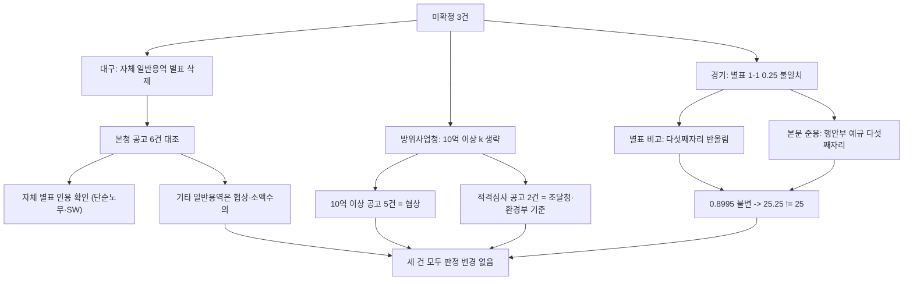

# 대구광역시·방위사업청·경기도 미확정 산식 재판정 (공고 첨부·원문 재대조)

> **작성일**: 2026-10-05
> **작업**: Orca Task `task_c8b185b0c638` (builder), Run `run_03599ec1fd4a`, Dispatch `ctx_e87794bf71af`
> **정본 사양**: `.orca/capsules/task_formula_resolve/capsule.yaml` (`ORCA_TASK_CAPSULE_V2`)
> **대상**: 대구광역시(단순노무 외 일반용역 산식 부재 시 실제 적용 기준), 방위사업청(10억원 이상 구간 계수 k), 경기도(별표 1-1 단순노무 0.25 불일치)
> **목적**: 나라장터 공고 첨부(DB)와 기관 원문을 재대조해 세 미확정 사항의 판정을 바꿔야 하는지 결론 낸다.
> **역할 경계**: 코드·설정·패키지를 변경하지 않았습니다. 커밋 산출물은 이 문서 한 편입니다. `src/app/services/evaluation_rules.py` 에 계수를 입력하지 않았습니다.
> **원본 위치**: 이번에 새로 내려받은 공고 첨부와 추출 텍스트는 `.orca/capsules/task_c8b185b0c638/external/<기관>/` 아래에만 두었고 커밋하지 않습니다. 기존 원문 추출물은 `.orca/capsules/<task>/external/` 의 각 경로를 인라인 코드로만 인용합니다.
> **판정 규칙**: 2026-09-30 수집 세션 3절의 10개 규칙을 그대로 적용합니다.
> **판정 식**: 평점 = B − k × |(기준/100 − 입찰가격/예정가격) × 100|. B는 그 별표의 입찰가격 배점한도다.

---

## 결론 표

| 대상 | 현재 판정 | 이번 판정 | 판정 변경 | 핵심 근거 |
| --- | --- | --- | --- | --- |
| 대구광역시 | 부분(단순노무 외 일반용역 입찰가격 산식 부재) | **부분 유지** | 아니오 | 예규 제238호 제4조①2 의 일반용역 별표 삭제를 원문에서 재확인했습니다. 실제 대구시 본청 2025-01-01 이후 일반용역 적격심사 공고는 자체 별표(별표 1 단순노무, 별표 3의2 소프트웨어)를 인용하고, 기타 일반용역은 협상에 의한 계약·소액수의로 집행했습니다. 자체 가격 별표가 없으므로 규칙 10에 따라 행정안전부 예규 제373호에 둡니다. |
| 방위사업청 | 확인(10억원 이상 구간 k 미확정) | **확인(10억원 이상 k 미확정) 유지** | 아니오 | 방위사업청 예규 제1082호 별표 1 의 10억원 이상 식은 계수 없이 인쇄되고 평탄 문장도 없습니다(규칙 5). 2025-01-01 이후 추정가격 10억원 이상 방위사업청 용역 공고 5건은 전부 협상에 의한 계약(제안서 평가)이었고, 실제 적격심사 공고 2건은 모두 조달청·환경부 기준을 인용한 10억원 미만 건이었습니다. 10억원 이상 구간 평점식·인쇄 점수 보강 근거가 없어 원문 판정을 바꾸지 않습니다. |
| 경기도 | 부분(별표 1-1 단순노무 0.25 불일치) | **부분 유지** | 아니오 | 별표 1-1 의 소수점 규정은 "입찰가격을 예정가격으로 나눈 결과 소수점 이하의 숫자는 소수점 다섯째자리에서 반올림함" 하나이고, 본문 제10조의 준용 대상인 행정안전부 예규 제373호의 소수점 처리도 다섯째자리 반올림입니다. 89.95% = 0.8995 를 다섯째자리에서 반올림해도 0.8995 이므로 대입값 25.25 는 그대로입니다(인쇄 25). 0.25 차이는 원문 규칙으로 설명되지 않아 미확정을 유지합니다. |

**판정 변경 0건.** 세 대상 모두 기존 판정을 유지합니다.

---

## 1. 요약

| # | 대상 | 등급 | 등급을 정한 문서(원문) | 이번 조사에서 확인한 것 | 결론 |
| ---: | --- | --- | --- | --- | --- |
| 1 | 대구광역시 | 부분 | 대구광역시 일반용역 적격심사 세부기준 (예규 제238호, 시행 2026-05-11). 삭제는 예규 제223호(2022-09-30) | 자체 예규의 단순노무 외 일반용역 별표 삭제를 재확인. 실제 본청 공고 6건을 내려받아 인용 기준을 대조 | 자체 산식 부재, 실제 공고는 자체 별표 인용 또는 협상·소액수의. 규칙 10 으로 행정안전부 예규 제373호 |
| 2 | 방위사업청 | 확인(10억원 이상 k 미확정) | 용역 적격심사 기준 (방위사업청 예규 제1082호, 시행 2026-09-21) | 10억원 이상 방위사업청 용역 공고 5건 전부 협상 계열. 적격심사 공고 2건은 조달청·환경부 기준(10억원 미만) | 10억원 이상 구간 보강 근거 없음. k 미확정 유지 |
| 3 | 경기도 | 부분 | 경기도 일반용역 적격심사 세부기준 지침 (예규 제748호, 시행 2025-08-08. 제751호는 용어정비) | 별표 1-1 소수점 규정과 본문 제10조 준용(행정안전부 예규)을 계산으로 재대조 | 0.25 차이 미설명. 미확정 유지 |



---

## 2. 판정 규칙 (2026-09-30 수집 세션 3절 그대로 적용)

1. 상업 페이지(bidpro, 비드큐, info21c, 모두입찰, korbid, igunsul, 블로그)의 계수는 베끼지 않는다. 제목과 날짜 단서만 쓴다.
2. 나라장터 첨부는 파일 머리말이 그 기관 규정일 때만 원문이다. 개별 공고 배점표는 전사 규정이 아니다.
3. 조달청 준용 조항만 있으면 조항, 개정 표시, 시행일만 인용한다. 조달청 별표 숫자를 그 기관 계수로 옮기지 않는다.
4. 평점 = B − k × |(기준/100 − 입찰가격/예정가격) × 100|. B는 그 별표의 입찰가격 배점한도다.
5. 계수가 생략되고 평탄 대입이 인쇄 점수와 맞을 때만 k=1. 평탄 문장이 없으면 k=1로 두지 않는다.
6. 평탄 비율과 낙찰하한율로 k를 역산하지 않는다.
7. 대입 결과가 인쇄 점수와 다르면 그 행은 미확정이다. 0.01점 차이도 미확정이다. 원문이 비율만 적고 점수를 인쇄하지 않으면 대입값을 적고 원문이 그렇게 말한다고 밝힌다.
8. 5억 열과 고시금액 산식은 감점이 같아도 짝짓지 않는다.
9. 접속 실패, DNS 실패, 시간 초과는 문서가 없다는 증거가 아니다.
10. 시·도는 그 시의 가격 별표를 읽기 전에는 행정안전부 예규 제373호(규모 구간, 기준비율 88%)에 둔다. 예규는 시·도별로 식을 나누지 않는다.

---

## 3. 대구광역시 — 부분 유지

### 3.1 자체 예규 재확인 (원문)

| 항목 | 값 |
| --- | --- |
| 문서명 | 대구광역시 일반용역 적격심사 세부기준 |
| 문서번호 | 대구광역시 예규 제238호(일부개정 2026-05-11). 직전본 예규 제223호(2022-09-30) |
| 시행일 | 2026. 5. 11. |
| 출처 | 자치법규정보시스템(ELIS) `.orca/capsules/task_58ea8ddab6fb/external/daegu/elis_daegu_main.txt` |
| 별표 1 원문 | `.orca/capsules/task_58ea8ddab6fb/external/daegu/tbl1_daegu.txt` |
| 확인 날짜 | 2026-10-05 |

원문에서 재확인한 삭제 조항과 별표 구성:

- 제4조① 각 호가 `1. 단순노무 일반용역 적격심사 평가기준 : 별표 1` · `2. 삭제 <2022.9.30.>` · `3. 소프트웨어용역 … 별표 3 또는 별표 3의2` · `4. 폐기물처리용역 … 별표 4` · `5. 육상운송용역 … 별표 5 또는 별표 5의2` 로 인쇄되어 있습니다. 출처 `.orca/capsules/task_58ea8ddab6fb/external/daegu/elis_daegu_main.txt:165-171`.
- 별표/서식 목록도 `[별표 1] 단순노무 …` 다음이 `삭제 〈2022.9.30.〉` 이고, 제4조①2 에 대응하는 일반용역(단순노무 외) 별표가 없습니다. 출처 `.orca/capsules/task_58ea8ddab6fb/external/daegu/elis_daegu_main.txt:97-115`.
- 제12조③은 `비율, 평점 등을 산정한 결과 소수점 이하의 숫자가 있는 경우로서 해당규정에서 별도로 정하지 않은 경우에는 소수점 셋째자리에서 반올림한다` 로 인쇄됩니다. 출처 `.orca/capsules/task_58ea8ddab6fb/external/daegu/elis_daegu_main.txt:213` 대응 행.

남아 있는 대구 자체 별표 1(단순노무)의 입찰가격 산식은 `평점(점) = 배점한도 − 60 × |(88/100 − 입찰가격/예정가격)×100|`, 평탄 문장 `88.25% 이상인 경우 88.25%인 경우의 점수로 평가`, B = 60(2억원 이상)/70(2억원 미만), 인쇄 점수 미기재입니다. 출처 `.orca/capsules/task_58ea8ddab6fb/external/daegu/tbl1_daegu.txt` 의 `입찰가격 평점산식` 행. 인쇄 점수가 없으므로 규칙 7에 따라 대입값(45.0000/55.0000)은 검산 통과로 세지 않습니다.

### 3.2 실제 대구시 본청 공고 대조 (공고 첨부)

`dminstt_nm='대구광역시'`, `category='Servc'`, `bid_ntce_dt>='2025-01-01'` 조건으로 조회한 본청 공고 중 대상별로 6건을 내려받아 인용 문단을 확인했습니다. 첨부 칸은 모두 `ntceSpecFileNm1` / `ntceSpecDocUrl1`(규격 첨부 1번 칸)입니다.

| 공고번호 | 공고일 | 추정가격(원) | 용역 구분 | 파일명(첨부 1칸) | 공고문이 인용한 기준 | 출처 |
| --- | --- | ---: | --- | --- | --- | --- |
| R25BK01157938 | 2025-11-20 | 259,112,727 | 단순노무(청소·야간경비) | 입찰공고문(2026년 대구간송미술관 청소, 야간경비 용역).hwp | `「대구광역시 일반용역 적격심사 세부기준」을 적용` · `【별표 1】 단순노무 일반용역 적격심사 평가기준` · 낙찰하한율 87.745% · 종합평점 85점 | `.orca/capsules/task_c8b185b0c638/external/daegu/R25BK01157938_f1.txt:26-28`, `:47` |
| R25BK01072802 | 2025-09-23 | 298,795,455 | 소프트웨어 | 입찰공고문(대구도서관 공동보존서고 자료 이관).hwp | `「대구광역시 일반용역 적격심사 세부기준」 <별표 3의2> 소프트웨어용역(중소기업자간 경쟁 제품 대상) 적격심사 평가기준` · 낙찰하한율 87.995% | `.orca/capsules/task_c8b185b0c638/external/daegu/R25BK01072802_f1.txt:66` |
| R25BK01128009 | 2025-11-04 | 378,071,818 | 기타 일반용역(임차·운영) | 1.입찰공고문(재난관리자원 통합관리센터 임차).hwp | `(협상에 의한 계약)` · `「지방자치단체 입찰시 낙찰자 결정기준(행정안전부 예규)」에 따른 “협상에 의한 계약 낙찰자 결정기준”` | `.orca/capsules/task_c8b185b0c638/external/daegu/R25BK01128009_f1.txt:29-31` |
| R26BK01406877 | 2026-03-19 | 237,280,000 | 기타 일반용역(조사) | 입찰공고문(AI 활용 지반침하 전조증상 조사 용역).hwpx | `(협상에 의한 계약)` · 행정안전부 예규 “협상에 의한 계약 낙찰자 결정기준” | `.orca/capsules/task_c8b185b0c638/external/daegu/R26BK01406877_f1.txt` 의 4. 입찰 및 계약방식 문단 |
| R26BK01420646 | 2026-03-26 | 27,636,364 | 기타 일반용역(요금 산정) | 소액수의 견적제출 공고문(2026년 도시가스 공급비용 산정용역).hwp | `낙찰하한율(88%) 이상 … 「지방자치단체 입찰 및 계약 집행기준(행정안전부 예규)」의 수의계약 운영요령` | `.orca/capsules/task_c8b185b0c638/external/daegu/R26BK01420646_f1.txt:53` |
| R26BK01752223 | 2026-09-30 | 34,963,637 | 폐기물처리 | 공고문(제2026-118호)[대구 제2수목원 기반시설 조성공사 임목폐기물 운반 및 처리용역].pdf | 소액수의 견적, 낙찰하한율·수의계약 운영요령 배제사유(적격심사 세부기준 산식 인용 없음) | `.orca/capsules/task_c8b185b0c638/external/daegu/R26BK01752223_f1.txt:52-58`, `:157-159` |

원문 재대조 결과:

- 대구시 본청의 적격심사 대상 공고는 **자체 예규 「대구광역시 일반용역 적격심사 세부기준」의 별표를 직접 인용**했습니다(단순노무 별표 1, 소프트웨어 별표 3의2). 이는 대구시가 자체 별표를 실제로 적용한다는 뜻입니다.
- 단순노무 외 **기타 일반용역**(재난관리자원 임차·운영, AI 지반침하 조사, 도시가스 요금 산정 등)은 조회 범위에서 적격심사가 아니라 **협상에 의한 계약(행정안전부 예규 협상 기준)** 또는 **소액수의 견적**으로 집행되었습니다. 대구 자체 입찰가격 산식이나 행정안전부 예규 별표를 적격심사 근거로 인용한 기타 일반용역 공고는 확인되지 않았습니다.
- 이는 예규 제4조①2 의 일반용역(단순노무 외) 별표 삭제와 일치합니다. 대구시에는 그 범주에 적용할 **자체 가격 별표가 없습니다**.

### 3.3 소결

- 예규 제238호에서 단순노무 외 일반용역 별표가 삭제된 사실을 원문으로 재확인했습니다(제4조①2 `삭제 <2022.9.30.>`).
- 실제 대구시 본청 적격심사 공고는 남아 있는 자체 별표(단순노무·소프트웨어 등)를 인용하고, 기타 일반용역은 협상·소액수의로 집행되었습니다.
- 대구시의 해당 범주 가격 별표가 원문에 없으므로, **판정 규칙 10** 에 따라 대구광역시의 단순노무 외 일반용역은 행정안전부 예규 제373호(「지방자치단체 입찰시 낙찰자 결정기준」, 별표 2 P.Q 미대상 기술용역, 기준비율 88)에 둡니다. 조달청 별표 숫자를 대구 계수로 옮기지 않았습니다(규칙 3).
- 따라서 대구광역시 판정은 **부분 유지**입니다. 등급을 바꿀 근거는 없습니다.

---

## 4. 방위사업청 — 확인(10억원 이상 구간 k 미확정) 유지

### 4.1 원문 재확인 (예규 제1082호)

| 항목 | 값 |
| --- | --- |
| 문서명 | 용역 적격심사 기준 |
| 문서번호 | 방위사업청예규 제1082호(일부개정 2026-09-21, 시행 2026-09-21) |
| 출처 URL | `https://www.law.go.kr/LSW/admRulLsInfoP.do?admRulSeq=2100000285258` |
| .orca 원본 | `.orca/capsules/task_889fe5b87a19/external/dapa/dapa_yongyeok_2026-09-21_hwpx_ordered.txt`(수식 계수 보존 재추출문), 교차확인 `.orca/capsules/task_889fe5b87a19/external/dapa/dapa_yongyeok_2026-09-21.txt` |
| 확인 날짜 | 2026-10-05 |

10억원 이상 구간 재확인:

| 구간(추정가격) | B | k | 기준 | 평탄 문장 | 인쇄 점수 | 대입값 | 판정 | 인용 |
| --- | ---: | --- | ---: | --- | --- | --- | --- | --- |
| 10억원 이상 | 30 | 생략(수식에 계수 없음) | 88 | 없음 | 없음 | 산출 불가 | 미확정(규칙 5) | `.orca/capsules/task_889fe5b87a19/external/dapa/dapa_yongyeok_2026-09-21_hwpx_ordered.txt:140`(절 제목), `:162`(`30-│⟦EQ:( 88/100 − 입찰가격/예정가격 )×100⟧│`), `:164`(배점한도 30), `:165`(최저평점 2) |

10억원 이상 식은 `30 − |…|` 로 계수가 인쇄되지 않고 평탄 문장도 없습니다. 규칙 5에 따라 k = 1로 두지 않으며, 규칙 6에 따라 낙찰하한율로 역산하지 않습니다. 나머지 세 구간(5억원 이상 10억원 미만 B=50 k=2, 고시금액 이상 5억원 미만 B=70 k=4, 고시금액 미만 B=90 k=20)은 기존대로 인쇄 점수와 대입값이 일치합니다. 통과점수는 제9조① 의 추정가격 경계(30억원·10억원)를 따릅니다.

### 4.2 실제 방위사업청 공고 대조 (공고 첨부)

**추정가격 10억원 이상 공고 5건** — `dminstt_nm LIKE '방위사업청%'`, `category='Servc'`, `bid_ntce_dt>='2025-01-01'`, `presmpt_prce>=1000000000` 조건 조회 결과입니다.

| 공고번호 | 공고일 | 추정가격(원) | 공고명 | 첨부 1칸 파일명 | 계약 방식 | 출처 |
| --- | --- | ---: | --- | --- | --- | --- |
| R25BK00986869 | 2025-08-01 | 21,357,064,464 | 국방전자조달시스템 고도화 구축사업 | 입찰공고서(방위사업청-국가_협상_수평_1468_80억이상_장기계속).hwp | 협상(제안서 평가) | DB 조회 `bid_announcements` |
| R26BK01570214 | 2026-06-15 | 14,789,364,373 | 통합 연계 고도화 구축 사업 | 입찰공고서(국가_협상_수평_1468_80억이상_차등3_장기계속_공가)최종.hwpx | 협상(제안서 평가) | DB 조회 |
| R26BK01283390 | 2026-01-20 | 3,316,363,636 | 26년 사이버보안 취약점 진단사업 | 입찰공고서-(국가+일반+1468,1542+설명회+수요기관평가).hwp | 협상(제안서 평가) · 공고서 표제 `(일반총액/협상계약/국내입찰)` | `.orca/capsules/task_c8b185b0c638/external/dapa/R26BK01283390_f1.txt:7`, `:39-40`, `:127` |
| R25BK00955349 | 2025-07-15 | 1,216,363,636 | CBM작전모의모델(Build-I) 체계개발 PMO사업 | 긴급공고 사유서 … .hwpx / 제안요청서 … .hwpx | 협상(제안요청서 평가) | DB 조회 |
| R25BK00997019 | 2025-08-07 | 1,216,363,636 | CBM작전모의모델(Build-I) 체계개발 PMO사업 | 수의계약체결제한여부확인서.zip | 협상 계열(같은 사업 재공고) | DB 조회 |

추정가격 10억원 이상 5건에서 **방위사업청 예규 별표 1 의 10억원 이상 배점표를 붙인 적격심사 공고는 없었습니다.** 모두 협상에 의한 계약(제안서 평가) 계열입니다.

**실제 적격심사 공고 2건** — 인용한 기준이 방위사업청 예규가 아님을 확인했습니다.

| 공고번호 | 공고일 | 추정가격(원) | 공고명 | 공고문이 인용한 적격심사 기준 | 출처 |
| --- | --- | ---: | --- | --- | --- |
| R26BK01398051 | 2026-03-17 | (공고서 표제) 5억~15억 구간 | 방위사업청 청사 신축공사 건설폐기물 처리용역 | `(환경부) 건설폐기물처리용역 적격업체 평가기준` · `평가항목 및 배점기준: 추정가격 15억원 미만 5억원 이상인 용역` · 발주처 `서울지방조달청` | `.orca/capsules/task_c8b185b0c638/external/dapa/R26BK01398051_f1.xml`(문서 순서 텍스트 607, 612-620, 1021) |
| R25BK01225758 | 2025-12-15 | (공고서 표제) 5억원 미만 | 26년 방위사업청 대전 임시청사 시설보안(경비, 안내) 인력 용역 | `조달청 일반용역 적격심사 세부기준 제5조 제1항 제2호` · `시설분야용역 적격심사: 추정가격 5억원 미만` | `.orca/capsules/task_c8b185b0c638/external/dapa/R25BK01225758_f1.xml`(문서 순서 텍스트 665-681, 725, 1036) |

두 건 모두 조달청 위탁(수요기관 방위사업청) 건으로, 공고문의 적격심사 근거는 조달청 기준 또는 환경부 별도 기준입니다. 파일 머리말이 방위사업청 예규인 첨부가 아니므로 규칙 2상 원문이 아니며, 10억원 이상 구간이 아닙니다.

### 4.3 소결

- 2025-01-01 이후 방위사업청 발주 용역에서 추정가격 10억원 이상 공고는 전부 협상에 의한 계약이었고, 적격심사 공고는 조달청·환경부 기준을 인용한 10억원 미만 건이었습니다.
- 따라서 예규 제1082호 별표 1 의 10억원 이상 구간에 대해 **공고 첨부에서 평점식이나 인쇄 점수라는 보강 근거를 찾지 못했습니다.** 설령 개별 공고 배점표가 있었다 해도 규칙 2상 전사 규정이 아니므로 원문 판정을 바꾸는 근거가 되지 못합니다.
- 결론: 방위사업청 10억원 이상 구간 k는 **미확정 유지**입니다. 판정을 바꿀 근거가 없습니다.

---

## 5. 경기도 — 부분 유지 (별표 1-1 0.25 불일치)

### 5.1 원문과 수치 재확인

| 항목 | 값 |
| --- | --- |
| 문서명 | 경기도 일반용역 적격심사 세부기준 지침 |
| 문서번호 | 경기도 예규 제748호(일부개정 2025-07-18, 시행 2025-08-08). ELIS 최신본 예규 제751호(시행 2026-04-15)는 용어 일괄정비로 별표 수치 동일 |
| 본문 출처 | `.orca/capsules/task_58ea8ddab6fb/external/gg/gg_g2b_748.txt` |
| 별표 1-1 표 출처 | `.orca/capsules/task_58ea8ddab6fb/external/gg/gg_748_biapyo_table.txt` |
| 수식 출처 | `.orca/capsules/task_58ea8ddab6fb/external/gg/gg_elis_hist005_att001_eqscripts.txt` |
| 나라장터 첨부 인쇄 | `.orca/capsules/task_58ea8ddab6fb/external/gg/gg_g2b_20251210_dec.txt` |
| 확인 날짜 | 2026-10-05 |

별표 1-1 단순노무 용역의 입찰가격 평점산식은 네 구간 모두 `평점 = 배점한도 − 5 × |(89/100 − 입찰가격/예정가격)×100|` 이고, 산식 예외는 `투찰률이 89.95% 이상인 경우 평점은 25/45/65/85점으로 함`, 낙찰하한율은 `87.995%`, 비고는 `입찰가격을 예정가격으로 나눈 결과 소수점 이하의 숫자는 소수점 다섯째자리에서 반올림함` 입니다.

- 수식 원문: `.orca/capsules/task_58ea8ddab6fb/external/gg/gg_elis_hist005_att001_eqscripts.txt:2-5` (`평점=30-5 TIMES LEFT | ( {89} over {100} - {입찰가격} over {예정가격} ) TIMES 100 RIGHT |` 및 B 50/70/90).
- 별표 1-1 인쇄(10억원 이상 행): `.orca/capsules/task_58ea8ddab6fb/external/gg/gg_748_biapyo_table.txt:11-14`(예외 문장·낙찰하한율), `:15`(비고).
- 나라장터 첨부 인쇄(같은 별표): `.orca/capsules/task_58ea8ddab6fb/external/gg/gg_g2b_20251210_dec.txt:294-300`(10억원 이상), `:303-310`, `:312-319`, `:322-330`(각 구간), `:332`(비고). 첨부에도 별도의 평점 반올림 문구는 없고 같은 비고만 인쇄되어 있습니다.

### 5.2 계산 재대조

대입 (10억원 이상, B=30):

```
투찰률 89.95%  ->  입찰가격/예정가격 = 0.8995
|(89/100) - 0.8995| = |0.89 - 0.8995| = 0.0095
0.0095 x 100 = 0.95
0.95 x 5 = 4.75
30 - 4.75 = 25.25
인쇄 점수 = 25  ->  차이 0.25 (규칙 7: 0.01점도 미확정)
```

소수점 규정 대조:

1. 별표 비고는 `입찰가격을 예정가격으로 나눈 결과 소수점 이하의 숫자는 소수점 다섯째자리에서 반올림함` 입니다. 0.8995 를 다섯째자리에서 반올림하면 0.8995 로 값이 바뀌지 않습니다(다섯째자리는 0).
2. 본문 제10조는 `이 세부기준에 정하지 아니한 사항은 「지방자치단체 입찰시 낙찰자 결정기준」에 따른다` 로 준용합니다. 출처 `.orca/capsules/task_58ea8ddab6fb/external/gg/gg_g2b_748.txt:131-133`.
3. 준용 대상인 행정안전부 예규 제373호 제2장 제11절 `3. 소수점 처리방법` 은 `시공비율은 백분율(%)로 소수점 셋째 자리에서 버린다`, `“1)” 이외의 경우는 소수점 다섯째 자리에서 반올림한다` 로 인쇄됩니다. 출처 `.orca/capsules/task_58ea8ddab6fb/external/mois/mois373_body.txt:3616-3621`. 시공비율이 아닌 입찰가격 비율은 다섯째자리 반올림이므로 0.8995 는 그대로입니다.

즉 별표 비고와 본문 준용 양쪽 모두 0.8995 를 바꾸지 않으므로 대입값 25.25 는 유지됩니다.

부수 확인: 인쇄된 `평점은 25점` 은 같은 식에서 투찰률 **90.00%** 일 때 성립합니다(30 − 5 × |0.89 − 0.90| × 100 = 30 − 5.00 = 25.00). 원문이 인쇄한 예외 상수 `89.95%` 와 인쇄 점수 `25점` 은 서로 0.05%p 어긋나 있고, 그 결과가 0.25점 차이입니다. 이 어긋남을 설명하는 소수점·반올림 조항은 원문 어디에도 없습니다.

### 5.3 소결

- 별표 1-1 의 0.25 차이는 원문의 소수점 처리 조항(다섯째자리 반올림)으로 설명되지 않습니다.
- 나라장터 첨부에 인쇄된 같은 별표도 동일하게 `89.95% -> 25점` 이라, 공고 첨부로도 차이가 해소되지 않습니다.
- 규칙 7(0.01점 차이도 미확정)과 규칙 6(k 역산·반올림 확정 금지)에 따라 **경기도 별표 1-1 은 미확정 유지**입니다. 경기도 판정은 **부분 유지**입니다.
- 별표 1-2 소프트웨어, 1-3 폐기물처리, 1-4 육상운송, 1-5 보험, 1-6 기타 일반용역은 기존대로 인쇄 점수와 대입값이 일치하며 이번 조사에서 바뀌지 않았습니다.

---

## 6. 검증과 산출물

| 항목 | 값 |
| --- | --- |
| 검증 명령 | `python3 scripts/validate_agent_rules.py --quiet` |
| 검증 결과 | 아래 실행 결과 참조 |
| 문서 링크 검증 | `uv run pytest tests/test_validate_doc_links.py -q` |
| 검증 결과 | 아래 실행 결과 참조 |
| 변경 파일 | `docs/analysis/servc_formula_resolve_daegu_dapa_gg_20261005.md` (문서 1개) |
| 작업 브랜치 | `kwanbum217/formula-resolve` (main 직접 커밋 없음) |
| 원본·첨부 경로 | `.orca/capsules/task_c8b185b0c638/external/` (커밋하지 않음) |

`src/app/services/evaluation_rules.py` 를 비롯한 코드·설정·패키지 파일, 테스트, DB 스키마, Meilisearch 색인, Docker 관련 파일은 변경하지 않았습니다. 계수·기준율을 코드에 입력하지 않았습니다.

---

## 7. 참고

- `docs/handoff/session_20260930_servc_formula_collection.md` — 33곳 수집 대장과 판정 규칙 10개
- `docs/analysis/servc_formula_collection_local_20261004.md` — 지자체 12곳(대구 4.5절, 경기 4.12절)
- `docs/analysis/servc_formula_collection_central_20261004.md` — 중앙부처·공단 9곳(방위사업청 7절)
- `docs/analysis/servc_formula_userfiles_local_20261004.md` — 사용자 제공 지자체 11건(경기 4.7절)
- `docs/analysis/servc_formula_userfiles_existing_20261004.md` — 사용자 제공 기관 5건(방위사업청 7절)
- `.orca/capsules/task_c8b185b0c638/external/` — 이번에 내려받은 대구·방위사업청 공고 첨부와 추출 텍스트(커밋하지 않음)
- `.orca/capsules/task_58ea8ddab6fb/external/` — 대구·경기 원문 추출물(커밋하지 않음)
- `.orca/capsules/task_889fe5b87a19/external/dapa/` — 방위사업청 예규 원문 추출물(커밋하지 않음)
