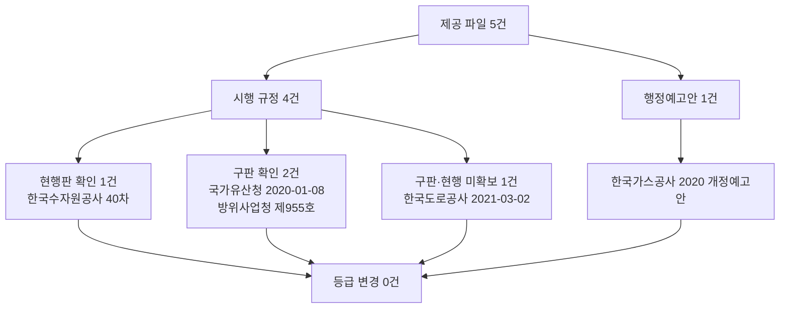

# 사용자 제공 기관 파일 5건 용역 입찰가격 산식 원문 대조

> **작성일**: 2026-10-04
> **작업**: Orca Task `task_ac5c1133322a` (builder), Run `run_03599ec1fd4a`, Dispatch `ctx_be5a7add0d8f`
> **정본 사양**: `.orca/capsules/task_ac5c1133322a/capsule.yaml` (`ORCA_TASK_CAPSULE_V2`)
> **대상**: 사용자가 2026-10-04 제공한 파일 5건 — 한국도로공사, 국가유산청, 한국가스공사, 방위사업청, 한국수자원공사
> **목적**: 제공 파일을 원문으로 읽어 일반용역 적격심사 입찰가격 평점 산식(적용 구간, B, k, 기준비율, 평탄 구간, 통과점수, 최저평점)을 정리하고, 기존 수집 문서(`docs/analysis/servc_formula_collection_central_20261004.md`, `docs/analysis/servc_formula_collection_energy_20261004.md`, `docs/analysis/servc_formula_kogas_qualification_20261004.md`)의 값과 대조해 등급을 바꿔야 하는지 결론 낸다.
> **역할 경계**: 코드·설정·패키지를 변경하지 않았습니다. 이 문서가 이번 작업의 커밋 산출물 한 편입니다.
> **원본 위치**: 제공 파일과 추출 텍스트는 `.orca/capsules/task_ac5c1133322a/external/` 아래에만 두었고 커밋하지 않습니다(`.orca/` 하위는 커밋 금지).
> **판정 규칙**: 2026-09-30 수집 세션 3절의 10개 규칙을 그대로 적용합니다.
> **판정 식**: 평점 = B − k × |(기준율/100 − 입찰가격/예정가격) × 100|. B는 해당 별표의 입찰가격 배점한도다.

---

## 1. 파일별 판정 요약

| 파일명 | 머리말상 기관·문서명·문서번호·시행일 | 원문 인정 여부 | 기존 판정 | 이번 판정 |
| --- | --- | --- | --- | --- |
| `한국도로공사 용역적격심사세부기준(20210302시행).hwp` | 한국도로공사 「용역적격심사 세부기준」, 문서번호 없음(공사 사규), 부칙 `2021. 3. 2.` 개정·시행 | 시행 규정(구판). 머리말·부칙이 한국도로공사 규정 | 중앙부처 문서에서 부분(현행 2022-10-01 판 원문 재확보 실패) | 구판(2021-03-02) 원문 확보. 값은 기존 인용과 일치. 현행판 미확보로 **부분 유지** |
| `국가유산청 매장문화재_조사용역_적격심사_세부기준(개정전문).hwp` | 문화재청(현 국가유산청) 고시 제2020-2호, 2020-01-08 일부개정(개정전문), 부칙 있음 | 시행 규정(구판). 표제·고시번호가 문화재청 규정 | 중앙부처 문서에서 확인(고시 제2024-6호) | 2020-01-08 구판. 별표 1~5 B·k·기준이 현행 고시 제2024-6호와 일치. **확인 유지** |
| `한국가스공사 전문.hwp` (실제 본문은 EUC-KR HTML) | 한국가스공사 「공사·용역 적격심사 세부기준 개정(안)」, 문서번호 없음, 부칙 `2020년 07월 01일` 입찰공고건부터 시행 | 행정예고안. 표제가 `개정(안)`이며 시행 규정 아님 | 가스공사 문서에서 현행판(2026-07-09) 확인 | 2020 개정예고안. 현행판과 다름. **확인 유지**(현행판 등급 유지) |
| `방위사업청 3.용역 적격심사기준_전문.hwp` | 방위사업청 예규 제955호, 2024-12-31 개정, 부칙 `발령한 날`부터 시행 | 시행 규정(구판). 머리말·부칙이 방위사업청 예규 | 중앙부처 문서에서 확인(예규 제1082호, 2026-09-21) | 2024-12-31 구판. 별표 1 네 구간이 현행 예규 제1082호와 일치. **확인(10억 이상 k 미확정) 유지** |
| `한국수자원공사 용역적격심사세부기준_2026-06-29.hwp` | 한국수자원공사 「용역적격심사 세부기준」, 40차/개정 2026-06-29, 부칙 `2026년 6월 30일`부터 시행 | 시행 규정(현행). 표제·차수·부칙이 한국수자원공사 규정 | 공기업 문서에서 확인(40차 2026-06-29 근거) | 40차 현행판 원문 확보. 값은 38차와 일치. **확인 유지** |

- 판정 규칙 2·출처 판정에 따라 **가스공사 파일은 행정예고안이므로 시행 규정으로 인정하지 않습니다.** 나머지 4건은 파일 머리말·부칙이 그 기관 규정이고 시행일이 적혀 있어 원문(시행 규정)으로 인정합니다. 다만 도로공사·국가유산청·방위사업청 3건은 기존 문서가 근거한 판보다 **이전 판**입니다.
- 파일명만으로 기관·판을 정하지 않고 본문 머리말과 부칙으로 정했습니다.

### 1.1 이번 판정에서 바뀌는 것

- **등급 변경(상향·하향) 대상은 없습니다.** 5건 모두 기존 등급을 유지합니다.
- **새로 확보한 원문**: 도로공사 2021-03-02 판(구판), 가스공사 2020 개정예고안 원문.
- **새 정보**: 도로공사 별표3(기술용역) 4구간은 기존 중앙부처 문서에 없던 값입니다(3절).

---

## 2. 판정 규칙 (2026-09-30 수집 세션 3절 그대로)

1. 상업 페이지(bidpro, 비드큐, info21c, 모두입찰, korbid, igunsul, 블로그)의 계수는 베끼지 않는다. 제목과 날짜 단서만 쓴다.
2. 나라장터 첨부는 파일 머리말이 그 기관 규정일 때만 원문이다. 개별 공고 배점표는 전사 규정이 아니다.
3. 조달청 준용 조항만 있으면 조항, 개정 표시, 시행일만 인용한다. 조달청 별표 숫자를 그 기관 계수로 옮기지 않는다.
4. 평점 = B − k × |(기준/100 − 입찰가격/예정가격) × 100|. B는 그 별표의 입찰가격 배점한도다.
5. 계수가 생략되고 평탄 대입이 인쇄 점수와 맞을 때만 k=1. 평탄 문장이 없으면 k=1로 두지 않는다.
6. 평탄 비율과 낙찰하한율로 k를 역산하지 않는다.
7. 대입 결과가 인쇄 점수와 다르면 그 행은 미확정이다. 0.01점 차이도 미확정이다. 원문이 비율만 적고 점수를 인쇄하지 않으면 대입값을 적고 원문이 그렇게 말한다고 밝힌다.
8. 5억 열과 고시금액 산식은 감점이 같아도 짝짓지 않는다.
9. 접속 실패, DNS 실패, 시간 초과는 문서가 없다는 증거가 아니다.
10. 시·도는 그 시의 가격 별표를 읽기 전에는 행정안전부 예규 제373호(규모 구간, 기준비율 88%)에 둔다.

---

## 3. 수집 환경과 도구

| 항목 | 값 |
| --- | --- |
| 제공 파일 위치 | `.orca/capsules/task_ac5c1133322a/external/user_files/` (5건, 커밋하지 않음) |
| HWP 표 추출 | `uvx --from pyhwp --with six hwp5proc xml <파일>` 후 `<Paragraph>`/`<TableCell>` 순서 보존 파서로 텍스트화 |
| HWP 기본 추출 | `uvx --from pyhwp --with six hwp5txt <파일>` |
| HWP 수식(EqEdit) 추출 | `uvx --from pyhwp --with six hwp5proc cat <파일> BodyText/Section<N>` 로 스트림을 꺼낸 뒤 `HWPTAG_CTRL_EQEDIT(0x58)` 페이로드를 UTF-16LE 로 해독 |
| HTML(가스공사) 변환 | `python3` 표준 라이브러리로 태그 제거(EUC-KR) |

`pip install`, `uv add`, `brew install` 은 사용하지 않았고, 외부 접속·내려받기도 하지 않았습니다. 운영 DB·docker 는 건드리지 않았습니다.

**추출 형태 주의**: 제공 파일 5건 중 4건은 정상 HWP 5.0(OLE)이나, **`한국가스공사 전문.hwp` 는 확장자와 달리 본문이 EUC-KR 로 인코딩된 HTML 렌더링**입니다(`file` 판정: `HTML document text`). `hwp5txt` 로는 `Not an OLE2 Compound Binary File` 로 실패해 별도로 태그를 제거했습니다. 이는 기존 가스공사 문서(`docs/analysis/servc_formula_kogas_qualification_20261004.md` 3절)가 밝힌 "예고안 첨부는 `.hwp` 이지만 실제 본문은 EUC-KR HTML" 과 같은 형태입니다.

**표 추출 주의**: `hwp5txt` 는 표 내용을 `<표>` 로만 출력하고 셀 텍스트를 버립니다. 산식이 표 안에 있으므로 `hwp5proc xml` 로 셀을 순서대로 재구성했습니다. 수자원공사는 산식의 분수가 OLE 수식 개체라 XML 에 `<EqEdit/>`(빈 태그)로만 나오므로, 원시 스트림의 `HWPTAG_CTRL_EQEDIT` 레코드를 직접 해독해 기준비율을 읽었습니다.

### 3.1 추출 파일 경로 (리뷰어 대조용)

| 파일 | 추출 경로 |
| --- | --- |
| 도로공사 | `.orca/capsules/task_ac5c1133322a/external/extracted/한국도로공사 용역적격심사세부기준(20210302시행).table.txt` |
| 국가유산청 | `.orca/capsules/task_ac5c1133322a/external/extracted/국가유산청 매장문화재_조사용역_적격심사_세부기준(개정전문).table.txt` |
| 가스공사 | `.orca/capsules/task_ac5c1133322a/external/extracted/한국가스공사 전문.html.txt` |
| 방위사업청 | `.orca/capsules/task_ac5c1133322a/external/extracted/방위사업청 3.용역 적격심사기준_전문.table.txt` |
| 수자원공사(표) | `.orca/capsules/task_ac5c1133322a/external/extracted/한국수자원공사 용역적격심사세부기준_2026-06-29.table.txt` |
| 수자원공사(수식) | `.orca/capsules/task_ac5c1133322a/external/extracted/한국수자원공사 용역적격심사세부기준_2026-06-29.equations.txt` |

---

## 4. 한국도로공사 — 구판 확인, 등급 부분 유지

### 4.1 문서 식별

| 항목 | 값 |
| --- | --- |
| 문서명 | 용역적격심사 세부기준 |
| 기관 | 한국도로공사 |
| 문서번호 | 없음(공사 사규). 머리말에 제정·개정 이력만 열거 |
| 제정·개정 | 목록 마지막이 `2021. 3. 2. 개정`(`.orca/capsules/task_ac5c1133322a/external/extracted/한국도로공사 용역적격심사세부기준(20210302시행).table.txt:15`) |
| 시행일 | 부칙 제1조 `2021년 3월 2일 이후에 입찰공고를 한 후 실시하는 용역 적격심사부터 적용`(`...:74`) |
| 통과점수 | 제5조① 종합평점 85점. 10억원 이상 기술용역 92점, 10억원 미만 기술용역 95점(`...:48`) |
| 원문 인정 여부 | 시행 규정(구판). 한국도로공사 사규 |
| 기존 판정 | 중앙부처 문서에서 부분(현행 2022-10-01 판 재확보 실패) |
| 이번 판정 | 구판(2021-03-02) 원문 확보, 값은 기존 인용과 일치. **부분 유지** |

### 4.2 별표 1 일반용역 입찰가격 산식

원문 계산식은 `.orca/capsules/task_ac5c1133322a/external/extracted/한국도로공사 용역적격심사세부기준(20210302시행).table.txt` 의 아래 행에 있습니다. 88/100 은 셀 안에서 분수로 인쇄되어 `88`, `100` 이 분리 추출됩니다.

| 구간(추정가격) | B | k | 기준 | 평탄 문장(원문) | 인쇄점수 | 대입값 | 판정 | 인용 |
| --- | ---: | ---: | ---: | --- | ---: | ---: | --- | --- |
| 10억원 이상 | 30 | **미확정** | 88 | 없음 | 없음 | 산출 불가 | 미확정(규칙 5) | `...:77` |
| 5억원 이상 10억원 미만 | 50 | 2 | 88 | `100분의 95.5이상인 경우의 평점은 35점` | 35 | 50 − 2×7.5 = 35.000 | 일치 | `...:81` |
| 고시금액 이상 5억원 미만 | 70 | 3 | 88 | `100분의 93이상인 경우의 평점은 55점` | 55 | 70 − 3×5 = 55.000 | 일치 | `...:85` |
| 고시금액 미만 | 80 | 5 | 88 | `100분의 91이상인 경우의 평점은 65점` | 65 | 80 − 5×3 = 65.000 | 일치 | `...:90` |

- 10억원 이상 행은 수식이 `평점=30 -｜(88/100 - 입찰가격/예정가격)×100｜` 로 계수가 생략되어 있고 평탄 문장도 없어 규칙 5·7에 따라 **k를 1로 두지 않습니다**(미확정).
- 최저평점: 10억원 이상 2점, 5억~10억 2점, 고시~5억 4점, 고시 미만 5점(위 인용 행).

### 4.3 별표 2 시설분야용역 입찰가격 산식

| 구간 | B | k | 기준 | 평탄 문장(원문) | 인쇄점수 | 대입값 | 판정 | 인용 |
| --- | ---: | ---: | ---: | --- | --- | ---: | --- | --- |
| 고시금액 이상 | 70 | 60 | 88 | `예정가격 대비 입찰가격의 비율이 88.25% 이상인 경우 평점은 88.25% 평점으로 함` | 미인쇄 | 70 − 60×0.25 = 55.000 | 미확정(규칙 7, 점수 미인쇄) | `...:106` |
| 고시금액 미만 | 80 | 60 | 88 | 동일 | 미인쇄 | 80 − 60×0.25 = 65.000 | 미확정(규칙 7, 점수 미인쇄) | `...:106` |

원문은 평탄 비율(`88.25%`)만 적고 그 비율에 대응하는 점수를 인쇄하지 않습니다. 대입값은 계산값일 뿐 검산 통과로 세지 않습니다(규칙 7). 최저평점 2점.

### 4.4 별표 3 기술용역 입찰가격 산식

| 구간(추정가격) | B | k | 기준 | 평탄 문장(원문) | 인쇄점수 | 대입값 | 판정 | 인용 |
| --- | ---: | ---: | ---: | --- | ---: | ---: | --- | --- |
| 10억원 이상 | 30 | 1 | 88 | `100분의 96이상인 경우의 평점은 22점` | 22 | 30 − 1×8 = 22.000 | 일치(규칙 5로 k=1 확정) | `...:131` |
| 5억원 이상 10억원 미만 | 50 | 2 | 88 | `100분의 90.5이상인 경우의 평점은 45점` | 45 | 50 − 2×2.5 = 45.000 | 일치 | `...:135` |
| 고시금액 이상 5억원 미만 | 70 | 4 | 88 | `100분의 89.25이상인 경우의 평점은 65점` | 65 | 70 − 4×1.25 = 65.000 | 일치 | `...:139` |
| 고시금액 미만 | 90 | 20 | 88 | `100분의 88.25이상인 경우의 평점은 85점` | 85 | 90 − 20×0.25 = 85.000 | 일치 | `...:144` |

- 별표 3-1(기술용역 10억원 이상)은 별표 1-1(일반용역 10억원 이상)과 달리 평탄 문장이 있어, 계수가 생략되어도 평탄 대입이 인쇄 점수와 맞으므로 규칙 5에 따라 **k=1로 확정**합니다. 같은 문서 안에서도 별표에 따라 판정이 갈리는 사례입니다.
- 최저평점은 네 구간 모두 2점.

### 4.5 기존 문서 대조

기존 `docs/analysis/servc_formula_collection_central_20261004.md` 11절의 도로공사 값(선행 재계산 문서가 인용한 2022-10-01 판)과 대조합니다.

| 항목 | 기존 문서(2022-10-01 인용) | 이번 파일(2021-03-02) | 판정 |
| --- | --- | --- | --- |
| 별표1-1(10억 이상) | B=30, k 미확정, 평탄 없음 | B=30, k 미확정, 평탄 없음 | 일치 |
| 별표1-2(5억~10억) | B=50, k=2, 95.5%→35 | B=50, k=2, 95.5%→35 | 일치 |
| 별표1-3(고시~5억) | B=70, k=3, 93%→55 | B=70, k=3, 93%→55 | 일치 |
| 별표1-4(고시 미만) | B=80, k=5, 91%→65 | B=80, k=5, 91%→65 | 일치 |
| 별표2(시설) | B=70/80, k=60, 88.25% 비율만 | B=70/80, k=60, 88.25% 비율만 | 일치 |
| 별표3(기술용역) | 문서에 없음 | B=30/50/70/90, k=1/2/4/20, 96%/90.5%/89.25%/88.25% | **새 정보** |

### 4.6 소결

- 이번 파일은 기존 문서가 인용한 2022-10-01 판보다 **약 1년 7개월 앞선 2021-03-02 판**입니다. 별표 1·2의 값이 기존 인용과 0.01점 차이도 없이 일치하므로, 두 판 사이에 이 산식이 바뀌지 않았을 가능성이 큽니다.
- 다만 **현행 2022-10-01 판 원문 자체는 이번에도 확보하지 못했으므로 등급은 부분을 유지**합니다. 2021-03-02 판은 원문(시행 규정)으로 인정하며 검산까지 마쳤습니다.
- 별표 3(기술용역) 4구간과 별표 3-1의 k=1 확정은 기존 문서에 없던 새 정보입니다.

---

## 5. 국가유산청 — 구판 확인, 등급 확인 유지

### 5.1 문서 식별

| 항목 | 값 |
| --- | --- |
| 문서명 | 매장문화재 조사용역 적격심사 세부기준 |
| 기관 | 문화재청(현 국가유산청) |
| 문서번호 | 문화재청 고시 제2020-2호 (2020-01-08 일부개정) |
| 제정·개정 | 제정 2014-02-04 고시 제2014-7호 … 일부개정 2020-01-08 고시 제2020-2호(`.orca/capsules/task_ac5c1133322a/external/extracted/국가유산청 매장문화재_조사용역_적격심사_세부기준(개정전문).table.txt:2-6`) |
| 시행일 | 마지막 부칙 `<제2019-76호, 2019. 5. 31.>` `고시한 날부터 시행`(`...:73`). 개정전문 표기 |
| 통과점수 | 제11조① 추정가격 2.5억원 이상 85점, 2.5억원 미만 88점(`...:56`) |
| 최저평점 | 별지 1-3 서식 주 4) `최저평점은 5점으로 함`(`...:119`) |
| 원문 인정 여부 | 시행 규정(구판). 문화재청 고시. 단 **매장문화재 조사용역 전용** |
| 기존 판정 | 중앙부처 문서에서 확인(고시 제2024-6호, 2024-05-17) |
| 이번 판정 | 2020-01-08 구판. 별표 1~5 값이 현행 고시 제2024-6호와 일치. **확인 유지** |

### 5.2 별표별 입찰가격 산식

원문은 계산식과 평탄 비율을 인쇄하지만 **평탄 비율에 대응하는 점수를 인쇄하지 않습니다**(`90/100인 경우의 점수로 함` 처럼 점수 자리가 비어 있음).

| 별표(추정가격) | B | k | 기준 | 평탄 비율 | 통과점수 | 최저평점 | 인쇄점수 | 대입값 | 판정 | 인용 |
| --- | ---: | ---: | ---: | ---: | --- | --- | --- | ---: | --- | --- |
| 별표 1 (10억 이상) | 30 | 1.875 | 88 | 90/100 | 85 | 5 | 미인쇄 | 30 − 1.875×2 = 26.250 | 미확정(규칙 7) | `...:77` |
| 별표 2 (10억 미만 5억 이상) | 30 | 2.5 | 88 | 90/100 | 85 | 5 | 미인쇄 | 30 − 2.5×2 = 25.000 | 미확정(규칙 7) | `...:79` |
| 별표 3 (5억 미만 2.5억 이상) | 40 | 3 | 88 | 90/100 | 85 | 5 | 미인쇄 | 40 − 3×2 = 34.000 | 미확정(규칙 7) | `...:81` |
| 별표 4 (2.5억 미만 1억 이상) | 45 | 9.6 | 88 | 89.25/100 | 88 | 5 | 미인쇄 | 45 − 9.6×1.25 = 33.000 | 미확정(규칙 7) | `...:83` |
| 별표 5 (1억 미만) | 50 | 48 | 88 | 88.25/100 | 88 | 5 | 미인쇄 | 50 − 48×0.25 = 38.000 | 미확정(규칙 7) | `...:85` |

- 별표 1~5 계산식이 한 표에 다시 정리되어 있습니다(`...:115`). 평탄 비율 주석은 `...:120-122`.
- B·k·기준율·평탄 비율·통과점수·최저평점은 원문에서 확인됩니다. 평탄 점수는 원문이 인쇄하지 않으므로 대입값은 검산 통과로 세지 않습니다(규칙 7).

### 5.3 기존 문서 대조

| 항목 | 기존 문서(고시 제2024-6호) | 이번 파일(고시 제2020-2호) | 판정 |
| --- | --- | --- | --- |
| 제목 | 매장유산 조사용역 적격심사 세부기준 | 매장문화재 조사용역 적격심사 세부기준 | 명칭 차이(2024년 개정에서 `매장문화재`→`매장유산`) |
| 별표 1~5 B | 30/30/40/45/50 | 30/30/40/45/50 | 일치 |
| 별표 1~5 k | 1.875/2.5/3/9.6/48 | 1.875/2.5/3/9.6/48 | 일치 |
| 기준비율 | 88 | 88 | 일치 |
| 평탄 비율 | 90/90/90/89.25/88.25 | 90/90/90/89.25/88.25 | 일치 |
| 통과점수 | 85/85/85/88/88 | 85/85/85/88/88 | 일치 |
| 최저평점 | 5 | 5 | 일치 |

### 5.4 소결

- 이번 파일은 **2020-01-08 구판**이며 제목이 옛 명칭(`매장문화재`)입니다. 그럼에도 별표 1~5의 B·k·기준율·평탄 비율·통과점수·최저평점이 현행 고시 제2024-6호와 모두 일치합니다.
- 따라서 **국가유산청 등급은 확인(수치는 평탄점수 미인쇄)을 유지**합니다. 새 정보는 없고, 2020년 판과 2024년 판의 산식이 같다는 사실만 추가로 확인했습니다.
- 이 산식은 매장문화재(매장유산) 조사용역 전용이며, 국가유산청의 일반용역 자체 산식은 기존 문서대로 확인되지 않았습니다.

---

## 6. 한국가스공사 — 2020 개정예고안, 등급 확인 유지

### 6.1 문서 식별

| 항목 | 값 |
| --- | --- |
| 문서명 | 공사·용역 적격심사 세부기준 개정(안) |
| 기관 | 한국가스공사 |
| 문서번호 | 없음(개정예고안) |
| 시행 표기 | 부칙 `이 지침은 2020년 07월 01일 입찰공고건 부터 시행한다`(`.orca/capsules/task_ac5c1133322a/external/extracted/한국가스공사 전문.html.txt:393`) |
| 원문 인정 여부 | **행정예고안**. 표제가 `개정(안)`이며 시행 규정 아님 |
| 기존 판정 | 가스공사 문서에서 현행판(시행 2026-07-09) 확인 |
| 이번 판정 | 2020 개정예고안. 현행판과 다름. **확인 유지** |

**형태 주의**: 확장자는 `.hwp` 이지만 실제 본문은 EUC-KR HTML 입니다(3절). 기존 가스공사 문서가 규정실 현행판과 별도로 보존한 2020 예고안 전문(HTML)과 같은 형태입니다.

### 6.2 제17조 입찰가격 평점산식 (예고안)

| 구간(추정가격) | 기준 | k | B(제16조) | 평탄 문장(원문) | 통과점수 | 최저평점 | 판정 | 인용 |
| --- | ---: | ---: | ---: | --- | --- | --- | --- | --- |
| 10억원 이상 | 88 | **생략(수식에 계수 없음)** | 30/50/70 | 88% 초과 시 별표11 하한선과 계산식 중 높은 점수 | 85(시설 90) | 원문 부재 | 미확정(규칙 5) | `...:188-189`, `:198` |
| 10억원 미만 | 88 | 1.5 | 30/50/70 | 동일 | 85 | 원문 부재 | 확인 | `...:190-191` |
| 고시금액 미만 | 88 | 2 | 30/50/70 | 동일 | 85 | 원문 부재 | 확인 | `...:192-193` |
| 시설분야용역(제17조②) | 90 | 5 | 50 | 90% 초과 시 별표11 하한선 | 90 | 원문 부재 | 확인 | `...:194-195` |

- B는 제16조①의 계량화 정도별 배점(30/50/70, 시설 50)입니다(`...:162-178`).
- 통과점수는 제5조① — 일반용역 85점, 시설분야용역 90점(`...:23-27`).
- 10억원 이상 행은 수식에 계수가 없고, 평탄 문장이 가리키는 별표11 값은 특정 투찰율의 계산값이 아니어서 `k=1` 로 확정할 인쇄 점수가 없습니다(규칙 5·6).

### 6.3 기존 문서 대조

기존 `docs/analysis/servc_formula_kogas_qualification_20261004.md` 6절은 이 2020 예고안(게시물 boardIdx=39427)을 이미 분석했습니다.

| 항목 | 기존 문서(2020 예고안) | 이번 파일(2020 예고안) | 판정 |
| --- | --- | --- | --- |
| 문서 성격 | 행정예고안 | 행정예고안 | 일치 |
| 10억원 이상 | 88, k 생략(미확정) | 88, k 생략(미확정) | 일치 |
| 10억원 미만 | 88, k=1.5 | 88, k=1.5 | 일치 |
| 고시금액 미만 | 88, k=2 | 88, k=2 | 일치 |
| 시설분야용역 | 90, k=5 | 90, k=5 | 일치 |
| 부칙 | 2020-07-01 입찰공고건 | 2020-07-01 입찰공고건 | 일치 |

### 6.4 소결

- 이번 파일은 기존 가스공사 문서가 이미 분석한 **2020 개정예고안과 같은 문서**입니다. 새 정보는 없습니다.
- 현행 가스공사 용역 산식은 「공사·용역 적격심사 세부기준」 **시행 2026-07-09** 의 제17조(기준비율 90, k 1.5/2/3/5, B 30/50/70, 시설분야 기준 92·k=5)입니다. 예고안은 기준비율 88·구간 10억/고시·k 1(생략)/1.5/2로 **현행과 다릅니다**.
- 따라서 **가스공사 등급은 확인을 유지**하며, 이 예고안을 현행 산식으로 쓰지 않습니다(규칙 2: 행정예고안은 시행 규정이 아님).

---

## 7. 방위사업청 — 구판 확인, 등급 확인 유지

### 7.1 문서 식별

| 항목 | 값 |
| --- | --- |
| 문서명 | 용역 적격심사 기준 |
| 기관 | 방위사업청 |
| 문서번호 | 방위사업청 예규 제955호 (2024-12-31 개정) |
| 개정 이력 | 지침 제2007-27호 … 예규 제840호(2022-12-30) … 예규 제955호(2024-12-31)(`.orca/capsules/task_ac5c1133322a/external/extracted/방위사업청 3.용역 적격심사기준_전문.table.txt:14`) |
| 시행일 | 부칙 `<제955호, 2024. 12. 31.>` `이 예규는 발령한 날부터 시행`(`...:126-127`) |
| 통과점수 | 제9조① 추정가격 30억원 이상 85점, 30억원 미만 10억원 이상 90점, 10억원 미만 95점(`...:62`) |
| 원문 인정 여부 | 시행 규정(구판). 방위사업청 예규 |
| 기존 판정 | 중앙부처 문서에서 확인(예규 제1082호, 2026-09-21) |
| 이번 판정 | 2024-12-31 구판. 별표 1 네 구간이 현행 예규 제1082호와 일치. **확인(10억 이상 k 미확정) 유지** |

### 7.2 별표 1 입찰가격 산식

| 구간(추정가격) | B | k | 기준 | 평탄 문장(원문) | 인쇄점수 | 대입값 | 판정 | 인용 |
| --- | ---: | ---: | ---: | --- | ---: | ---: | --- | --- |
| 10억원 이상 | 30 | **미확정** | 88 | 없음 | 없음 | 산출 불가 | 미확정(규칙 5) | `...:133` |
| 5억원 이상 10억원 미만 | 50 | 2 | 88 | `예정가격 대비 입찰가격의 비율이 90.5% 이상인 경우 평점은 45점` | 45 | 50 − 2×2.5 = 45.000 | 일치 | `...:260` |
| 고시금액 이상 5억원 미만 | 70 | 4 | 88 | `89.25% 이상인 경우 평점은 65점` | 65 | 70 − 4×1.25 = 65.000 | 일치 | `...:302` |
| 고시금액 미만 | 90 | 20 | 88 | `88.25% 이상인 경우 평점은 85점` | 85 | 90 − 20×0.25 = 85.000 | 일치 | `...:345` |

- 10억원 이상 행 수식은 `30 -(88-입찰가격)×100 / 100 예정가격`, 즉 `30 − |(88/100 − 입찰가격/예정가격)×100|` 로 계수가 생략되어 있고 평탄 문장도 없어 **k를 1로 두지 않습니다**(미확정).
- 최저평점은 네 구간 모두 2점.
- 통과점수는 별표 1 의 규모 구간이 아니라 제9조① 의 추정가격 경계(30억원·10억원)로 정해집니다.

### 7.3 기존 문서 대조

| 항목 | 기존 문서(예규 제1082호) | 이번 파일(예규 제955호) | 판정 |
| --- | --- | --- | --- |
| 10억원 이상 | B=30, k 생략(미확정), 88 | B=30, k 생략(미확정), 88 | 일치 |
| 5억~10억 | B=50, k=2, 90.5%→45 | B=50, k=2, 90.5%→45 | 일치 |
| 고시~5억 | B=70, k=4, 89.25%→65 | B=70, k=4, 89.25%→65 | 일치 |
| 고시 미만 | B=90, k=20, 88.25%→85 | B=90, k=20, 88.25%→85 | 일치 |
| 통과점수 | 제9조① 30억 85 / 10억~30억 90 / 10억 미만 95 | 동일 | 일치 |

### 7.4 소결

- 이번 파일은 기존 문서가 근거한 예규 제1082호(2026-09-21)보다 **약 1년 9개월 앞선 제955호(2024-12-31) 구판**입니다. 별표 1 네 구간과 통과점수가 현행판과 모두 일치합니다.
- **방위사업청 등급은 확인(10억 이상 k 미확정)을 유지**합니다. 10억원 이상 구간이 계수 생략 + 평탄 문장 부재로 미확정인 점도 동일합니다.
- 5억 열과 고시금액 산식은 감점이 같아도 짝짓지 않았습니다(규칙 8).

---

## 8. 한국수자원공사 — 40차 현행 확인, 등급 확인 유지

### 8.1 문서 식별

| 항목 | 값 |
| --- | --- |
| 문서명 | 용역적격심사 세부기준 |
| 기관 | 한국수자원공사 |
| 차수·개정 | 40차 / 개정 2026-06-29(`.orca/capsules/task_ac5c1133322a/external/extracted/한국수자원공사 용역적격심사세부기준_2026-06-29.table.txt:2`) |
| 시행일 | 부칙 (2026.06.29.) 제1조 `2026년 6월 30일부터 시행`(`...:176`) |
| 통과점수 | 제11조① 종합평점 85점. 10억원 이상 기술용역 92점, 10억원 미만 기술용역 95점(`...:61`) |
| 최저평점 | 추출문에서 `최저평점` 문구 0건. **원문 부재** |
| 원문 인정 여부 | 시행 규정(현행). 한국수자원공사 사규 |
| 기존 판정 | 공기업 문서에서 확인(인수인계·재계산은 40차 2026-06-29 근거, 수집은 38차 PDF) |
| 이번 판정 | 40차 2026-06-29 현행판 원문 확보. 값은 38차와 일치. **확인 유지** |

**추출 주의**: 입찰가격 산식의 분수가 OLE 수식 개체라 `.table.txt` 에서는 `30 - ∣() × 100)∣` 처럼 계수·기준비율이 빈 괄호로 나옵니다. 기준비율은 `HWPTAG_CTRL_EQEDIT` 레코드를 직접 해독한 `...equations.txt` 에서 읽었습니다.

### 8.2 별표별 입찰가격 산식

B·k·평탄 문장은 `.table.txt`, 기준비율은 `.equations.txt` 행으로 인용합니다.

| 별표(구간) | B | k | 기준 | 평탄 문장(원문) | 인쇄점수 | 대입값 | 판정 | 인용(표 / 수식) |
| --- | ---: | ---: | ---: | --- | ---: | ---: | --- | --- |
| 별표1 (10억 이상 기술) | 30 | 1 | 88 | `96이상인 경우의 평점은 22점` | 22 | 30 − 1×8 = 22.000 | 일치 | `...table.txt:179,181` / `...equations.txt:5` |
| 별표1의1 (10억 이상 점검정비) | 40 | 1 | 88 | `96이상인 경우의 평점은 32점` | 32 | 40 − 1×8 = 32.000 | 일치 | `...:183,184` / `:6` |
| 별표2 (10억 미만 5억 이상 기술) | 50 | 2 | 88 | `90.5이상인 경우의 평점은 45점` | 45 | 50 − 2×2.5 = 45.000 | 일치 | `...:186,187` / `:7` |
| 별표3 (5억 미만 고시금액 이상 기술) | 70 | 4 | 88 | `89.25이상인 경우의 평점은 65점` | 65 | 70 − 4×1.25 = 65.000 | 일치 | `...:190,191` / `:8` |
| 별표4 (고시금액 미만 기술) | 80 | 20 | 88 | `88.25이상인 경우의 평점은 75점` | 75 | 80 − 20×0.25 = 75.000 | 일치 | `...:194,195` / `:9-10` |
| 별표5 (학술연구용역) | 40 | 2 | 88 | `95.495%이상인 경우의 평점은 25점` | 25 | 40 − 2×7.495 = 25.010 | 미확정(규칙 7, +0.010) | `...:201,202` / `:11-12` |
| 별표6 (시설분야용역) | 60 | 5 | 91 | `93.995% 이상인 경우의 평점은 45점` | 45 | 60 − 5×2.995 = 45.025 | 미확정(규칙 7, +0.025) | `...:204,205` / `:13-14` |
| 별표7의1 (10억 이상 기타) | 30 | **미확정** | 88 | 없음 | 없음 | 산출 불가 | 미확정(규칙 5) | `...:210` / `:15-16` |
| 별표7의2 (10억 미만 5억 이상 기타) | 50 | 2 | 88 | `95.505이상인 경우의 평점은 35점` | 35 | 50 − 2×7.505 = 34.990 | 미확정(규칙 7, −0.010) | `...:217,218` / `:17-18` |
| 별표7의3 (5억 미만 고시금액 이상 기타) | 70 | 3 | 88 | `93.005이상인 경우의 평점은 55점` | 55 | 70 − 3×5.005 = 54.985 | 미확정(규칙 7, −0.015) | `...:225,227` / `:19-20` |
| 별표8 (고시금액 미만 기타) | 80 | 5 | 88 | `91.005이상인 경우의 평점은 65점` | 65 | 80 − 5×3.005 = 64.975 | 미확정(규칙 7, −0.025) | `...:234,236` / `:21-22` |

- 별표1·1의1은 수식에 계수가 인쇄되지 않았으나 평탄 대입이 인쇄 점수와 정확히 맞아 규칙 5에 따라 **k=1로 확정**합니다.
- 별표5~8의 대입값은 인쇄 점수와 0.010~0.025점 차이가 나므로 규칙 7에 따라 **미확정**입니다(0.01점 차이도 미확정).
- 별표7의1은 계수와 평탄 문장이 모두 없어 k를 두지 않습니다(규칙 5).
- 전 구간 최저평점은 원문에 없습니다(38차 PDF에서도 찾지 못했다는 기존 문서 기록과 일치).

### 8.3 기존 문서 대조

기존 `docs/analysis/servc_formula_collection_energy_20261004.md` 3.2절은 38차(2024-11-25) PDF를 근거로 같은 값을 기록했습니다.

| 항목 | 기존 문서(38차 2024-11-25) | 이번 파일(40차 2026-06-29) | 판정 |
| --- | --- | --- | --- |
| 별표1 | 30/1/88, 96%→22 | 30/1/88, 96%→22 | 일치 |
| 별표1의1 | 40/1/88, 96%→32 | 40/1/88, 96%→32 | 일치 |
| 별표2 | 50/2/88, 90.5%→45 | 50/2/88, 90.5%→45 | 일치 |
| 별표3 | 70/4/88, 89.25%→65 | 70/4/88, 89.25%→65 | 일치 |
| 별표4 | 80/20/88, 88.25%→75 | 80/20/88, 88.25%→75 | 일치 |
| 별표5 | 40/2/88, 95.495%→25(미확정) | 40/2/88, 95.495%→25(미확정) | 일치 |
| 별표6 | 60/5/91, 93.995%→45(미확정) | 60/5/91, 93.995%→45(미확정) | 일치 |
| 별표7의1 | 30/k 미확정 | 30/k 미확정 | 일치 |
| 별표7의2 | 50/2/88, 95.505%→35(미확정) | 50/2/88, 95.505%→35(미확정) | 일치 |
| 별표7의3 | 70/3/88, 93.005%→55(미확정) | 70/3/88, 93.005%→55(미확정) | 일치 |
| 별표8 | 80/5/88, 91.005%→65(미확정) | 80/5/88, 91.005%→65(미확정) | 일치 |
| 최저평점 | 원문 부재 | 원문 부재 | 일치 |

### 8.4 소결

- 이번 파일은 인수인계·재계산 문서가 근거로 삼은 **40차(2026-06-29) 현행판**입니다. 기존에 저장소가 실제 읽은 38차(2024-11-25) PDF와 값이 모두 일치합니다.
- 기준비율 88(별표6만 91)을 수식 개체에서 직접 해독해 원문으로 확인했습니다.
- **수자원공사 등급은 확인을 유지**합니다. 미확정 행(별표5·6·7의1·7의2·7의3·8)도 기존 문서와 동일합니다.

---

## 9. 기존 문서 값과의 대조 요약 (기관별)

| 기관 | 일치 항목 | 불일치·차이 | 새 정보 |
| --- | --- | --- | --- |
| 한국도로공사 | 별표1·2의 B·k·기준·평탄·통과·최저 전부 일치 | 판 차이: 이번 파일 2021-03-02 vs 기존 인용 2022-10-01(구판) | 별표3 기술용역 4구간(30/50/70/90, k=1/2/4/20), 별표3-1 k=1 확정 |
| 국가유산청 | 별표1~5의 B·k·기준·평탄·통과·최저 전부 일치 | 판 차이: 2020-01-08 구판 vs 2024-05-17 현행. 문서명 `매장문화재` vs `매장유산` | 2020년 판과 2024년 판의 산식이 동일함을 확인 |
| 한국가스공사 | 2020 예고안 제17조·제16조·제5조 전부 일치 | 없음(같은 문서) | 현행(2026-07-09)과 예고안(기준 88)의 차이를 재확인 |
| 방위사업청 | 별표1 네 구간·통과점수 전부 일치 | 판 차이: 제955호(2024-12-31) vs 제1082호(2026-09-21) | 2024년 판과 2026년 판의 산식이 동일함을 확인 |
| 한국수자원공사 | 별표1~8의 B·k·기준·평탄·통과 전부 일치 | 판 차이: 40차(2026-06-29) vs 기존 저장소 38차(2024-11-25) | 40차 판 번호·시행일(2026-06-30) 확인, 기준비율 88/91을 수식 개체에서 직접 확인 |

**불일치로 등급을 바꿔야 하는 값은 없습니다.** 세 건(도로공사·국가유산청·방위사업청)의 차이는 판(版本) 차이일 뿐 값은 일치하고, 가스공사는 같은 예고안이며, 수자원공사는 현행판과 기존 38차가 일치합니다.

---

## 10. 결론 — 기관별 등급 유지/변경

| 기관 | 기존 등급 | 이번 판정 등급 | 조치 | 근거 |
| --- | --- | --- | --- | --- |
| 한국도로공사 | 부분 | **부분 유지** | 유지 | 구판(2021-03-02) 원문을 확보해 검산했으나, 현행 2022-10-01 판 원문은 이번에도 미확보 |
| 국가유산청 | 확인(평탄점수 미인쇄) | **확인 유지** | 유지 | 2020-01-08 구판이나 별표 1~5 값이 현행 고시 제2024-6호와 일치, 평탄 점수 미인쇄도 동일 |
| 한국가스공사 | 확인 | **확인 유지** | 유지 | 사용자 파일은 2020 개정예고안(시행 규정 아님). 현행판(2026-07-09) 등급은 그대로 |
| 방위사업청 | 확인(10억 이상 k 미확정) | **확인(10억 이상 k 미확정) 유지** | 유지 | 2024-12-31 구판이나 별표 1 네 구간·통과점수가 현행 예규 제1082호와 일치 |
| 한국수자원공사 | 확인 | **확인 유지** | 유지 | 40차(2026-06-29) 현행판 원문을 확보, 값이 38차와 일치 |

### 10.1 등급 정의(기존 문서와 동일)

| 등급 | 뜻 |
| --- | --- |
| 확인 | 공식 원문 또는 추출문을 읽어 수치를 검산까지 마친 상태 |
| 부분 | 공식 원문을 확보했으나 일부 칸(예: k, 기준율)을 원문에서 읽지 못하거나, 현행판을 확보하지 못한 상태 |
| 조달청 준용 | 자체 산식 없이 조달청 기준을 준용한다는 조항만 있는 상태 |
| 미확인 | 공식 원문 또는 필요한 칸을 확보하지 못한 상태 |

### 10.2 유의 사항

- 이번에 확보한 원문 중 도로공사·국가유산청·방위사업청 3건은 **기존 문서가 근거한 판보다 이전 판**입니다. 값이 일치하므로 현행 산식으로 인용할 수 있으나, **현행판 그 자체를 읽었다고 단정하지 않습니다**(규칙 9). 현행판 확보가 필요하면 도로공사는 2022-10-01 판, 국가유산청은 2024-05-17 판, 방위사업청은 2026-09-21 판을 다시 받아야 합니다.
- 가스공사 파일은 행정예고안이므로 시행 규정으로 인정하지 않습니다(규칙 2). 현행판은 종전대로 시행 2026-07-09 판입니다.
- 조달청 별표 숫자 전재, k 역산, 반올림 확정, 5억 열과 고시금액 산식 짝짓기는 하지 않았습니다.

---

## 11. 확정 사실과 미확정 사실

### 11.1 확정 (원문 인용·검산)

| 기관 | 구간 | B | k | 기준 | 검산 |
| --- | --- | ---: | ---: | ---: | --- |
| 한국도로공사 | 별표1-2·1-3·1-4, 별표3-1~3-4 | 50/70/80, 30/50/70/90 | 2/3/5, 1/2/4/20 | 88 | 7/7 일치 |
| 국가유산청 | 별표1~5 B·k·기준 | 30/30/40/45/50 | 1.875/2.5/3/9.6/48 | 88 | 평탄 점수 미인쇄로 검산 불가(대입값만) |
| 한국가스공사 | 2020 예고안 제17조 | 30/50/70, 시설 50 | 생략(미확정)/1.5/2, 시설 5 | 88, 시설 90 | 예고안(시행 규정 아님) |
| 방위사업청 | 별표1 5억~10억·고시~5억·고시 미만 | 50/70/90 | 2/4/20 | 88 | 3/3 일치 |
| 한국수자원공사 | 별표1·1의1·2·3·4 | 30/40/50/70/80 | 1/1/2/4/20 | 88 | 5/5 일치 |

### 11.2 미확정·미확인

- 한국도로공사: 별표1-1·별표2 평탄 점수 미인쇄(미확정), 별표2 k=60이나 평탄 점수 없음, 현행 2022-10-01 판 미확보.
- 국가유산청: 별표 1~5 평탄 점수 원문 미인쇄, 일반용역 자체 산식 미확인.
- 한국가스공사: 2020 예고안 10억원 이상 구간 k 미확정(계수 생략), 최저평점 원문 부재.
- 방위사업청: 10억원 이상 구간 k 미확정(계수 생략 + 평탄 문장 부재), 현행 2026-09-21 판 미확보.
- 한국수자원공사: 별표7의1 k 미확정, 별표5·6·7의2·7의3·8 대입값과 인쇄 점수의 0.010~0.025점 차이로 미확정, 최저평점 원문 부재.

### 11.3 등급별 집계

---

## 12. 검증과 산출물

| 항목 | 값 |
| --- | --- |
| 검증 명령 | `python3 scripts/validate_agent_rules.py --quiet` |
| 검증 결과 | 아래 실행 결과 참조 |
| 변경 파일 | `docs/analysis/servc_formula_userfiles_existing_20261004.md` (문서 1개) |
| 작업 브랜치 | `kwanbum217/userfiles-existing` (main 직접 커밋 없음) |
| 원문·추출 경로 | `.orca/capsules/task_ac5c1133322a/external/` (커밋하지 않음) |

`src/app/services/evaluation_rules.py` 를 비롯한 코드·설정·패키지 파일, 테스트, DB 스키마, Meilisearch 색인, Docker 관련 파일은 변경하지 않았습니다. 계수·기준율을 코드에 입력하지 않았습니다.

---

## 13. 참고

- `docs/analysis/servc_formula_collection_central_20261004.md` — 중앙부처·공단 9곳 수집 결과(도로공사 11절, 국가유산청 5절, 방위사업청 7절, 가스공사 12절)
- `docs/analysis/servc_formula_collection_energy_20261004.md` — 에너지·공항 공기업 8곳 수집 결과(한국수자원공사 3.2절)
- `docs/analysis/servc_formula_kogas_qualification_20261004.md` — 한국가스공사 현행판과 2020 개정예고안(6절)
- `.orca/capsules/task_ac5c1133322a/external/` — 제공 원본과 추출 텍스트(커밋하지 않음)
