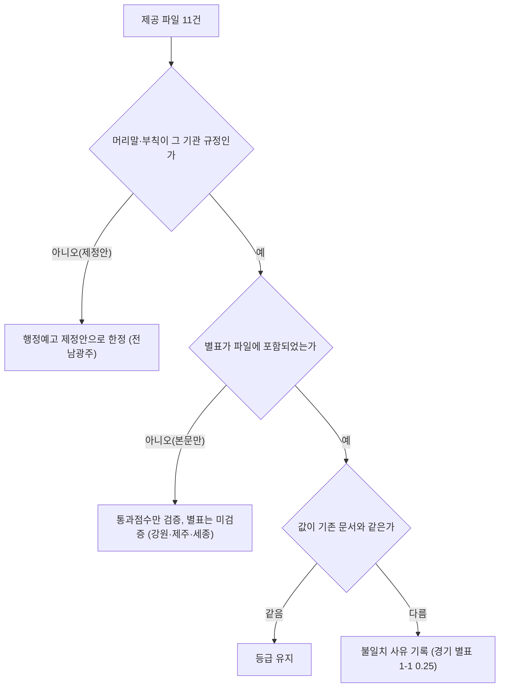

# 사용자 제공 지자체 11건 일반용역 입찰가격 산식 원문 대조 (2026-10-04)

> **작성일**: 2026-10-04
> **작업**: Orca Task `task_b84fb339a406` (builder, `run_03599ec1fd4a`)
> **목적**: 사용자가 2026-10-04 제공한 지자체 파일 11건에서 일반용역 적격심사 입찰가격 평점 산식(적용 구간, B, k, 기준비율, 평탄 구간, 통과점수, 최저평점)을 원문으로 읽어 판정하고, 기존 수집 문서의 같은 기관 값과 대조해 등급 변경 여부를 결론 낸다.
> **범위 경계**: 코드·설정·패키지 파일을 바꾸지 않았습니다. `src/app/services/evaluation_rules.py` 에 계수를 입력하지 않았습니다. 커밋 산출물은 이 문서 하나입니다.
> **대조 대상**: `docs/analysis/servc_formula_collection_local_20261004.md` (지자체 12곳, 이하 `C`).
> **원문·추출물 위치**: `.orca/capsules/task_b84fb339a406/external/user_files/`(원본)와 `data/sources/qualification/files/extracted`(추출). 커밋하지 않으며, 이 문서는 `.orca/` 를 마크다운 링크로 걸지 않고 인라인 코드로만 언급합니다.
> **확인 날짜**: 아래 11건 모두 2026-10-04 판독.
> **경로 약칭**: `U` = `.orca/capsules/task_b84fb339a406/external/user_files`, `X` = `data/sources/qualification/files/extracted`.
> **결론**: 값이 기존 문서와 일치한 곳 11곳 중 8곳은 등급 유지에 문제없음, 3곳(대구·경기·전남광주)은 부분/제정안 성격 유지, 3곳(강원·제주·세종)은 제공 파일에 별표가 없어 별표 계수를 이 파일로 검증할 수 없음, 1곳(충북)은 파일 판본이 2020년이라 기존 2023년 판 값을 이 파일로 대체할 수 없음. 조달청 별표 숫자를 지자체 계수로 옮긴 곳은 없습니다.

---

## 1. 요약: 파일 11건 판정

| # | 파일명 (`U/`) | 머리말상 기관 | 문서명·문서번호 | 시행일 | 원문 인정 | 기존 판정(`C`) | 이번 판정 |
| ---: | --- | --- | --- | --- | --- | --- | --- |
| 1 | 강원특별자치도 일반용역 적격심사 세부기준(2023-05-26 예규 제 832호).hwp | 강원특별자치도 | 강원특별자치도 일반용역 적격심사 세부기준, 예규 제832호 | 2023-06-11 | 시행 규정(본문만) | 확인 | 확인(본문), 별표 미포함 |
| 2 | 대구광역시 일반용역 적격심사세부기준(대구광역시예규제223호_2022.9.30).pdf | 대구광역시 | 대구광역시 일반용역 적격심사 세부기준, 예규 제223호 | 2022-09-30 | 시행 규정(스캔 이미지) | 부분 | 부분 유지 |
| 3 | 경상북도 도보+제6998호(2026.1.8.).pdf | 경상북도 | 경상북도 일반용역 등 적격심사 세부기준, 예규 제1571호 | 2026-01-08 | 시행 규정(도보 게재, 개정문+별표) | 확인 | 확인 |
| 4 | 울산광역시+일반용역+적격심사+세부기준(개정전문) (1).hwp | 울산광역시 | 울산광역시 일반용역 적격심사 세부기준, 공고 제2022-1100호 | 2022-08-10 | 시행 규정 | 확인 | 확인 |
| 5 | 충청북도 ★[개정전문] 충청북도 일반용역 적격심사 세부기준(최종).hwp | 충청북도 | 충청북도 일반용역 적격심사 세부기준, 공고 제2020-1559호 | 2020-12-18 | 시행 규정(구판) | 확인(제2023-1428호) | 확인(값 동일), 판본 2020 |
| 6 | 경상남도 [개정전문]경상남도일반용역등적격심사세부기준(23.1.30.시행).hwp | 경상남도 | 경상남도 일반용역 등 적격심사 세부기준, 공고 제2023-23호 | 발령한 날(공고 2023-01-05) | 시행 규정 | 확인 | 확인 |
| 7 | 경기도 일반용역 적격심사 세부기준 지침(2026.04.15.시행_별표 등 합본).hwpx | 경기도 | 경기도 일반용역 적격심사 세부기준 지침, 예규 제751호 | 2026-04-15 | 시행 규정(별표 등 합본) | 부분 | 부분 유지 |
| 8 | 전남광주통합특별시 2.+[붙임]+전남광주통합특별시+일반용역+적격심사+세부지침+제정안.hwpx | 전남광주통합특별시 | 전남광주통합특별시 일반용역 적격심사 세부지침안(제정안) | 2026-07-16 | 행정예고 제정안 | 확인(예규 제3호) | 확인(값 동일), 제정안 한정 |
| 9 | 인천광역시 (개정전문)인천광역시 일반용역 적격심사 세부기준.pdf | 인천광역시 | 인천광역시 일반용역 적격심사 세부기준, 예규 제488호 | 2025-12-24(발령 후 15일) | 시행 규정 | 확인 | 확인 |
| 10 | 제주특별자치도 일반용역 적격심사 세부기준.hwp | 제주특별자치도 | 제주특별자치도 일반용역 적격심사 세부기준, 예규 제82호 | 2024-01-01 | 시행 규정(본문만) | 확인 | 확인(본문), 별표 미포함 |
| 11 | 세종특별자치시 일반용역 적격심사 세부기준(시행 2025. 12. 1.).hwp | 세종특별자치시 | 세종특별자치시 일반용역 적격심사 세부기준, 예규 제32호 | 2025-12-01 | 시행 규정(본문만) | 확인 | 확인(본문), 별표 미포함 |

**판정 집계**: 시행 규정 10곳(그중 본문만 3곳), 행정예고 제정안 1곳. 별표 계수까지 이 파일로 검증 가능 7곳(대구·경북·울산·충북·경남·경기·인천·전남광주 중 값 확보분), 별표 미포함 3곳(강원·제주·세종).

---

## 2. 판정 규칙 (2026-09-30 수집 세션 3절 그대로 적용)

1. 상업 페이지(bidpro, 비드큐, info21c, 모두입찰, korbid, igunsul, 블로그)의 계수는 베끼지 않는다. 제목과 날짜 단서만 쓴다.
2. 나라장터·기관 첨부는 파일 머리말이 그 기관 규정일 때만 원문이다. 개별 공고 배점표는 전사 규정이 아니다.
3. 조달청 준용 조항만 있으면 조항, 개정 표시, 시행일만 인용한다. 조달청 별표 숫자를 그 기관 계수로 옮기지 않는다.
4. 평점 = B − k × |(기준/100 − 입찰가격/예정가격) × 100|. B는 그 별표의 입찰가격 배점한도다.
5. 계수가 생략되고 평탄 대입이 인쇄 점수와 맞을 때만 k=1. 평탄 문장이 없으면 k=1로 두지 않는다.
6. 평탄 비율과 낙찰하한율로 k를 역산하지 않는다.
7. 대입 결과가 인쇄 점수와 다르면 그 행은 미확정이다. 0.01점 차이도 미확정이다. 원문이 비율만 적고 점수를 인쇄하지 않으면 대입값을 적고 원문이 그렇게 말한다고 밝힌다.
8. 5억 열과 고시금액 산식은 감점이 같아도 짝짓지 않는다.
9. 접속 실패, DNS 실패, 시간 초과는 문서가 없다는 증거가 아니다.
10. 시·도는 그 시의 가격 별표를 읽기 전에는 행정안전부 예규 제373호(규모 구간, 기준비율 88%)에 둔다. 예규는 시·도별로 식을 나누지 않는다.

**이번 작업에 추가 적용한 출처 판정**: 제공 파일은 파일 머리말·표제·부칙이 그 기관 규정이고 문서번호·시행일이 적혀 있을 때만 원문으로 인정한다. 파일명만으로 기관·판을 정하지 않고 본문 머리말과 부칙으로 정한다. 개별 공고 배점표나 행정예고안은 시행 규정이 아니라고 적는다.

---

## 3. 추출 방법과 도구

- **승인된 일회성 도구**: PDF는 `uvx --from pdfminer.six pdf2txt.py <파일>`, HWP는 `uvx --from pyhwp --with six hwp5txt <파일>` 및 표 셀 보존용 `hwp5html --output=<디렉터리>`, HWPX는 `python3 zipfile` 로 `Contents/section*.xml` 을 읽었습니다. 설치(`pip install`, `uv add`, `brew install`)는 쓰지 않았고, 외부 접속도 하지 않았습니다.
- **예외 처리 1 — 텍스트로 저장된 `.hwp`**: 제주 파일은 EUC-KR 텍스트, 세종 파일은 UTF-8 텍스트였습니다. 두 파일은 표준 라이브러리의 인코딩 변환으로 추출했습니다(`X/jeju.txt`, `X/sejong.txt`).
- **예외 처리 2 — 텍스트 레이어 없는 스캔 PDF**: 대구 파일은 폰트가 전혀 없고 이미지 43+장으로만 구성된 스캔 PDF라 `pdfminer` 가 빈 출력을 냈습니다. `uvx --from pymupdf` 일회성 실행으로 18쪽을 PNG로 렌더해 판독했습니다(`X/daegu_pages/p*.png`). 이 한 건만 승인 도구 이외의 일회성 실행을 썼으며 결과물은 커밋하지 않습니다.
- **표 재구성**: `hwp5txt` 는 표를 `<표>` 로 소실시키므로 표 셀은 `hwp5html` 산출 `index.xhtml` 을 선형화해 확보했습니다(`X/gwd_flat.txt`, `X/cb_flat.txt`, `X/gn_flat.txt`, `X/ulsan_flat.txt`).
- **HWPX 수식**: 경기 HWPX 수식은 `Contents/section*.xml` 의 `hp:script` 로 남아 있어 `평점=30-5 TIMES LEFT | ( {89} over {100} - … ) TIMES 100 RIGHT |` 형태의 수식 스크립트 21개를 그대로 읽었습니다(`X/gg_20260415.txt`). 전남광주 제정안은 `hp:script` 없이 본문 텍스트로 산식이 인쇄되어 있고, 일부 수식은 심볼 글리프로 치환됐으나 같은 셀의 분자·분모 텍스트로 복원했습니다(`X/jngj_jeongan.txt`).
- **수식 개체 재확인(계수 누락 방지)**: HWP 의 입찰가격 산식이 수식 개체(HancomEQN)로 들어 있으면 `hwp5txt`·`hwp5html` 이 계수를 별도 런으로 분리하거나 빠뜨릴 수 있어, `uvx --from pyhwp --with six hwp5proc xml` 로 XML 을 뽑아 `<Text>` 와 계수를 재확인했습니다. 그 결과 울산은 `평점 = 30-`, `30-20`, `50`+`2×`, `50-20`, `70`+`4×`, `70-20`, `90-20`, `90-20`, `30-40`, `50-20`, `70-20`(`X/xml/ulsan.xml`), 충북은 `30 -`, `30 - 20`, `50 - 2`, `50 - 20`, `70 - 4`, `70 - 20`, `90 - 20`, `90 - 20`(`X/xml/cb.xml`), 경남은 `평점=30 -`, `평점=50`+`-`,`2 ×`, `평점=70-4`, `평점=90`+`-`,`20×`(`X/xml/gn.xml`)로 계수가 확인되었습니다. `hwp5proc xml` Text 에서 계수가 분리돼 보인 행은 같은 별표의 인쇄 평탄 점수로 k 를 확정했습니다(예: 경남 50 구간은 인쇄 45점·평탄 90.5% 로 k=2, 90 구간은 인쇄 85점·평탄 88.25% 로 k=20). 계수가 생략되고 인쇄 평탄 점수와 대입이 맞는 행만 k=1 로 두었습니다.
- **강원 별표 부재 재확인**: 강원 HWP 는 `hwp5proc xml` 에서도 `<TableCell>` 이 0건이어서, 제공 파일에 별표 1~6 표가 없음을 재확인했습니다(`X/xml/gwd.xml`).

---

## 4. 파일별 판정

### 4.1 강원특별자치도 — 확인(본문), 별표 미포함

| 항목 | 값 |
| --- | --- |
| 원본 파일 | `U/강원특별자치도 일반용역 적격심사 세부기준(2023-05-26 예규 제 832호).hwp` (52,224 B) |
| 추출 파일 | `X/gwd.txt`(본문), `X/gwd_flat.txt`(선형화) |
| 머리말 | `(제정) 2023-05-26 예규 제 832호 강원도 일반용역 적격심사 세부기준 전부개정지침` (`X/gwd_flat.txt:2`) |
| 시행일 | 부칙 `제1조(시행일)이 세부기준은 2023년 6월 11일부터 시행한다.` (`X/gwd_flat.txt:70`) |
| 원문 인정 | 시행 규정(본문) — 머리말·부칙이 기관 규정 |
| 별표 포함 여부 | **미포함**. 파일 전체에 `<표>` 0건이며 `X/gwd_flat.txt` 는 제1조~제11조와 부칙 71행이 전부. 별표 1~6명만 인용됨 |
| 기존 판정(`C`) | 확인 |
| 이번 판정 | 확인(본문). 별표 입찰가격 계수는 이 파일로 검증 불가 |

**검증 가능한 값**

| 항목 | 값 | 인용 |
| --- | --- | --- |
| 통과점수 | 30억원 이상 85, 30억원 미만 10억원 이상 90, 10억원 미만 95, 단순노무 95, 생활폐기물 10억원 이상 90·10억원 미만 95 | `X/gwd_flat.txt:29` |
| 최저평점 | 별표 미포함으로 이 파일에 없음 | - |
| 소수점 처리 | 다섯째자리 반올림 | `X/gwd_flat.txt:67` |

별표 1~6 의 B·k·기준비율·평탄 문장은 제공 파일에 없습니다. 기존 문서(`C` 4.4)의 강원 값은 ELIS 별표 첨부에서 온 것으로, 이 파일로는 그 값을 재검증할 수 없습니다. 등급은 유지하되 근거 출처가 다름을 명시합니다.

### 4.2 대구광역시 — 부분 유지

| 항목 | 값 |
| --- | --- |
| 원본 파일 | `U/대구광역시 일반용역 적격심사세부기준(대구광역시예규제223호_2022.9.30).pdf` (981,737 B, 18쪽 스캔) |
| 추출 파일 | `X/daegu_pages/p00.png`~`p17.png` (PyMuPDF 렌더 이미지) |
| 머리말 | `대구광역시 일반용역 적격심사 세부기준` `[시행 2022.09.30]` `(일부개정) 2022-09-30 예규 제 223호` (`X/daegu_pages/p00.png`) |
| 시행일 | 부칙 `<예규 제223호, 2022.9.30.>` `제1조(시행일)이 기준은 발령한 날부터 시행한다.` (`X/daegu_pages/p03.png`) |
| 원문 인정 | 시행 규정(스캔 이미지, 텍스트 레이어 없음) |
| 기존 판정(`C`) | 부분 (예규 제238호 기준) |
| 이번 판정 | 부분 유지 (예규 제223호 = 삭제가 일어난 판본) |

**별표 1 단순노무 일반용역 적격심사 평가기준** — 머리말 `【별표 1】 <개정 2022.9.30.> 단순노무 일반용역 적격심사 평가기준(제4조제1항 관련)` (`X/daegu_pages/p10.png`)

| 적용 구간 | B | k | 기준비율 | 평탄 문장(원문) | 인쇄점수 | 대입값 | 인용 |
| --- | ---: | ---: | ---: | --- | --- | ---: | --- |
| 추정가격 2억원 이상 | 60 | 60 | 88 | "입찰가격이 예정가격 이하로서 예정가격의 88.25% 이상인 경우에는 입찰가격이 예정가격의 88.25%인 경우의 점수로 평가한다" | 미인쇄 | 60−60×0.25 = **45.0000** | `X/daegu_pages/p10.png` |
| 추정가격 2억원 미만 | 70 | 60 | 88 | 상동 | 미인쇄 | 70−15 = **55.0000** | `X/daegu_pages/p10.png` |

- 산식 원문: `평점(점) = 배점한도 − 60 × |( 88/100 − 입찰가격/예정가격 ) × 100|` (`X/daegu_pages/p10.png`).
- 최저평점: 별표 1에 명시 없음. `소수점 다섯째 자리에서 반올림`만 있음 (`X/daegu_pages/p10.png`).
- **일반용역(단순노무 외) 별표 삭제**: 제4조① 각 호 `2. 삭제 <2022.9.30.>` (`X/daegu_pages/p01.png`), 별표/서식 목록의 삭제 표시 (`X/daegu_pages/p04.png`).
- 통과점수: 종합평점 85점(소프트웨어용역 및 육상운송용역의 중소기업자간 경쟁제품은 88점) (`X/daegu_pages/p02.png`).

대입값이 인쇄되지 않았으므로 규칙 7에 따라 검산 통과로 세지 않습니다. 일반용역(단순노무 외) 별표가 삭제된 것은 기존 문서와 동일하며, 기존 문서가 인용한 예규 제238호(2026-05-11)는 이 삭제 이후 판본입니다. 이 파일은 삭제가 일어난 예규 제223호 그 자체로, 삭제 사실과 단순노무 별표 값을 1차 원문으로 확정합니다. 등급은 부분 유지입니다.

### 4.3 경상북도 — 확인

| 항목 | 값 |
| --- | --- |
| 원본 파일 | `U/경상북도 도보+제6998호(2026.1.8.).pdf` (5,496,002 B, 도보 전체) |
| 추출 파일 | `X/gb_dobo.txt` (422,416행) |
| 머리말 | `경상북도 예규 제1571호`, `경상북도 일반용역 등 적격심사 세부기준 일부개정예규` (`X/gb_dobo.txt:3774`, `:3776`) |
| 시행일 | 부칙 `제1조(시행일) 이 예규는 발령한 날부터 시행한다.` 발령 2026-01-08 (`X/gb_dobo.txt:3782`, `:3840`) |
| 원문 인정 | 시행 규정(도보 게재). 단 도보는 **개정문과 별표만** 싣고 낙찰자 결정 본문은 싣지 않음 |
| 기존 판정(`C`) | 확인 |
| 이번 판정 | 확인 |

**별표 1 단순노무용역** (`X/gb_dobo.txt`)

| 적용 구간 | B | k | 기준비율 | 평탄 문장(원문) | 인쇄점수 | 대입 검산 | 인용 |
| --- | ---: | ---: | ---: | --- | ---: | --- | --- |
| 추정가격 5억원 이상 | 50 | 20 | 88 | "투찰률이 88.25% 이상인 경우의 평점은 45점으로 함" | 45 | 50−20×0.25 = **45.0000** 일치 | `:3947`, `:3948` |
| 추정가격 5억원 미만 | 70 | 20 | 88 | "투찰률이 88.25% 이상인 경우의 평점은 65점으로 함" | 65 | 70−5 = **65.0000** 일치 | `:3950`, `:3951` |

**별표 2 소프트웨어용역** — 두 구간에 식 하나

| 적용 구간 | B | k | 기준비율 | 평탄 문장(원문) | 인쇄점수 | 대입값 | 인용 |
| --- | ---: | ---: | ---: | --- | --- | ---: | --- |
| 추정가격 5억원 이상 | 60 | 4 | 88 | "입찰가격이 예정가격 이하로서 예정가격의 91% 이상인 경우에는 입찰가격이 예정가격의 91%인 경우의 점수로 평가" | 미인쇄 | 60−4×9 = **48.0000** | `:4211`, `:4221`, `:4225` |
| 추정가격 5억원 미만 | 80 | 4 | 88 | 상동 | 미인쇄 | 80−36 = **68.0000** | `:4211`, `:4221`, `:4225` |

**별표 3 폐기물처리(수집·운반·처리)용역** (`X/gb_dobo.txt`)

| 적용 구간 | B | k | 기준비율 | 평탄 문장(원문) | 인쇄점수 | 대입 검산 | 인용 |
| --- | ---: | ---: | ---: | --- | ---: | --- | --- |
| 추정가격 5억원 이상 | 50 | 4 | 88 | "입찰가격이 예정가격 이하로서 100분의 89.25 이상인 경우의 평점은 45점으로 함" | 45 | 50−5 = **45.0000** 일치 | `:4453`, `:4455` |
| 추정가격 5억원 미만 | 70 | 20 | 88 | "입찰가격이 예정가격 이하로서 100분의 88.25 이상인 경우의 평점은 65점으로 함" | 65 | 70−5 = **65.0000** 일치 | `:4459`, `:4467` |

**별표 4 기타 일반용역** (`X/gb_dobo.txt`)

| 적용 구간 | B | k | 기준비율 | 평탄 문장(원문) | 인쇄점수 | 대입 검산 | 인용 |
| --- | ---: | ---: | ---: | --- | ---: | --- | --- |
| 추정가격 5억원 이상 | 50 | 4 | 88 | "투찰률이 89.25% 이상인 경우의 평점은 45점으로 함" | 45 | 50−5 = **45.0000** 일치 | `:4620`, `:4622` |
| 추정가격 5억원 미만 | 70 | 20 | 88 | "투찰률이 88.25% 이상인 경우의 평점은 65점으로 함" | 65 | 70−5 = **65.0000** 일치 | `:4626`, `:4628` |

- 최저평점: 두 별표 모두 `최저평점은 2점으로 함` (`:3957`, `:4461` 등).
- 통과점수: 도보 개정문에 낙찰자 결정 조항이 없어 이 파일로는 확인 불가. 기존 문서(`C` 4.7)는 ELIS 본문에서 95점(소프트웨어용역 88점)을 인용했습니다.
- **새 정보**: 기존 문서는 ELIS 별표 첨부를 근거로 했으나, 이번 파일은 경상북도 도보 제6998호에 게재된 예규 제1571호 원문 자체입니다. 별표 1~4 수치가 전부 일치합니다.

### 4.4 울산광역시 — 확인

| 항목 | 값 |
| --- | --- |
| 원본 파일 | `U/울산광역시+일반용역+적격심사+세부기준(개정전문) (1).hwp` (192,512 B) |
| 추출 파일 | `X/ulsan.txt`, `X/ulsan_flat.txt` |
| 머리말 | `[시행 2022. 8. 10.][울산광역시 공고 제2022-1100호, 2022. 7. 21. 일부개정]` (`X/ulsan.txt:1`) |
| 시행일 | 부칙 `(시행일) 이 세부기준은 2022년 8월 10일 부터 시행한다.` (`X/ulsan.txt:83`) |
| 원문 인정 | 시행 규정 |
| 기존 판정(`C`) | 확인 |
| 이번 판정 | 확인 |

**별표 1 일반용역·단순노무** (`X/ulsan_flat.txt`)

| 적용 구간 | B | k | 기준비율 | 평탄 문장(원문) | 인쇄점수 | 대입 검산 | 인용 |
| --- | ---: | ---: | ---: | --- | ---: | --- | --- |
| 10억원 이상, 단순노무 외 | 30 | 1(계수 생략) | 88 | "예정가격의 100분의 98 이상인 경우의 평점은 20점으로 함" | 20 | 30−10 = **20.0000** 일치 | `:96`, `:97` |
| 10억원 이상, 단순노무 | 30 | 20 | 88 | "100분의 88.25 이상인 경우의 평점은 25점으로 함" | 25 | 30−5 = **25.0000** 일치 | `:100`, `:101` |
| 10억원 미만 5억원 이상, 단순노무 외 | 50 | 2 | 88 | "100분의 90.5 이상인 경우의 평점은 45점으로 함" | 45 | 50−5 = **45.0000** 일치 | `:258`, `:260` |
| 10억원 미만 5억원 이상, 단순노무 | 50 | 20 | 88 | "100분의 88.25 이상인 경우의 평점은 45점으로 함" | 45 | 50−5 = **45.0000** 일치 | `:263`, `:264` |
| 5억원 미만 2억원 이상, 단순노무 외 | 70 | 4 | 88 | "100분의 89.25 이상인 경우의 평점은 65점으로 함" | 65 | 70−5 = **65.0000** 일치 | `:421`, `:423` |
| 5억원 미만 2억원 이상, 단순노무 | 70 | 20 | 88 | "100분의 88.25 이상인 경우의 평점은 65점으로 함" | 65 | 70−5 = **65.0000** 일치 | `:426`, `:428` |
| 2억원 미만(단순노무 포함) | 90 | 20 | 88 | "100분의 88.25 이상인 경우의 평점은 85점으로 함" | 85 | 90−5 = **85.0000** 일치 | `:582`, `:584` |

**별표 1-1 생활폐기물 수집·운반 대행용역** (`X/ulsan_flat.txt`)

| 적용 구간 | B | k | 기준비율 | 평탄 문장(원문) | 인쇄점수 | 대입 검산 | 인용 |
| --- | ---: | ---: | ---: | --- | ---: | --- | --- |
| 30억원 이상 | 30 | 40 | 88 | "100분의 88.25 이상인 경우의 평점은 20점으로 함" | 20 | 30−10 = **20.0000** 일치 | `:751`, `:752` |
| 30억원 미만 10억원 이상 | 50 | 20 | 88 | "100분의 88.25 이상인 경우의 평점은 45점으로 함" | 45 | 50−5 = **45.0000** 일치 | `:930`, `:931` |
| 10억원 미만 | 70 | 20 | 88 | "100분의 88.25 이상인 경우의 평점은 65점으로 함" | 65 | 70−5 = **65.0000** 일치 | `:1109`, `:1110` |

**별표 2 폐기물처리용역** (`X/ulsan_flat.txt`)

| 적용 구간 | B | k | 기준비율 | 평탄 문장(원문) | 인쇄점수 | 대입 검산 | 인용 |
| --- | ---: | ---: | ---: | --- | ---: | --- | --- |
| 10억원 이상 | 30 | 1(계수 생략) | 88 | "100분의 98 이상인 경우의 평점은 20점으로 함" | 20 | 30−10 = **20.0000** 일치 | `:1291`, `:1293` |
| 10억원 미만 5억원 이상 | 50 | 2 | 88 | "100분의 90.5 이상인 경우의 평점은 45점으로 함" | 45 | 50−5 = **45.0000** 일치 | `:1455`, `:1457` |
| 5억원 미만 2억원 이상 | 70 | 4 | 88 | "100분의 89.25 이상인 경우의 평점은 65점으로 함" | 65 | 70−5 = **65.0000** 일치 | `:1619`, `:1620` |
| 2억원 미만 | 90 | 20 | 88 | "100분의 88.25 이상인 경우의 평점은 85점으로 함" | 85 | 90−5 = **85.0000** 일치 | `:1780`, `:1782` |

- 최저평점: 모든 별표에 `최저평점은 2점으로 함` (`:106`, `:269`, `:433`, `:593`, `:755`, `:934`, `:1113`, `:1296`, `:1460`, `:1623`, `:1785`).
- 통과점수: 30억원 이상 85, 30억원 미만 10억원 이상 90, 10억원 미만 95, 단순노무 95, 생활폐기물 10억원 이상 90·10억원 미만 95 (`X/ulsan_flat.txt:20`).
- 기존 문서(`C` 4.8)의 "공고 제2022-1100호 이후 대체 원문 미확인" 상태는 이 파일로도 해소되지 않습니다. 이 파일 자체가 공고 제2022-1100호입니다.

### 4.5 충청북도 — 확인(값 동일), 판본 2020

| 항목 | 값 |
| --- | --- |
| 원본 파일 | `U/충청북도 ★[개정전문] 충청북도 일반용역 적격심사 세부기준(최종).hwp` (55,809 B) |
| 추출 파일 | `X/cb.txt`, `X/cb_tbl.txt`, `X/cb_flat.txt` |
| 머리말 | `[시행 2020. 12. 18.] (충청북도 공고 제2020-1559호, 2020. 12. 14.)` (`X/cb.txt:1`) |
| 시행일 | 부칙 `제1조(시행일) 이 기준은 2020년 12월 18일부터 시행한다.` (`X/cb.txt:108`) |
| 원문 인정 | 시행 규정. 단 **2020년 판**(기존 문서가 근거로 둔 제2023-1428호가 아님) |
| 기존 판정(`C`) | 확인(공고 제2023-1428호) |
| 이번 판정 | 확인(별표 1 수치는 기존과 동일), 판본은 2020년으로 명시 |

**별표 1** — 배점한도 입찰가격 30/50/70/90 (`X/cb_tbl.txt:107`), 기준비율 88

| 적용 구간·구분 | B | k | 기준비율 | 평탄 문장(원문) | 인쇄점수 | 대입 검산 | 인용 |
| --- | ---: | ---: | ---: | --- | ---: | --- | --- |
| 30억원 이상(단순노무 외) | 30 | 1(계수 생략) | 88 | "투찰률이 98% 이상인 경우 평점은 20점으로 함" | 20 | 30−10 = **20.0000** 일치 | `X/cb_flat.txt:517`, `:525` |
| 30억원 이상, 단순노무 | 30 | 20 | 88 | "투찰률이 88.25% 이상인 경우 평점은 25점으로 함" | 25 | 30−5 = **25.0000** 일치 | `X/cb_flat.txt:533`, `:541` |
| 10억원 이상, 단순노무 외 | 50 | 2 | 88 | "투찰률이 90.5% 이상인 경우 평점은 45점으로 함" | 45 | 50−5 = **45.0000** 일치 | `X/cb_flat.txt:549`, `:557` |
| 10억원 이상, 단순노무 | 50 | 20 | 88 | "투찰률이 88.25% 이상인 경우 평점은 45점으로 함" | 45 | 50−5 = **45.0000** 일치 | `X/cb_flat.txt:562`, `:570` |
| 5억원 이상, 단순노무 외 | 70 | 4 | 88 | "투찰률이 89.25% 이상인 경우 평점은 65점으로 함" | 65 | 70−5 = **65.0000** 일치 | `X/cb_flat.txt:578`, `:586` |
| 5억원 이상, 단순노무 | 70 | 20 | 88 | "투찰률이 88.25% 이상인 경우 평점은 65점으로 함" | 65 | 70−5 = **65.0000** 일치 | `X/cb_flat.txt:591`, `:599` |
| 2억원 미만, 단순노무 외 | 90 | 20 | 88 | "투찰률이 88.25% 이상인 경우 평점은 85점으로 함" | 85 | 90−5 = **85.0000** 일치 | `X/cb_flat.txt:606`, `:614` |
| 2억원 미만, 단순노무 | 90 | 20 | 88 | "투찰률이 88.25% 이상인 경우 평점은 85점으로 함" | 85 | 90−5 = **85.0000** 일치 | `X/cb_flat.txt:619`, `:627` |

- 최저평점: `최저평점은 2점으로 함` (`X/cb_flat.txt:630`).
- 통과점수: 30억원 이상 85, 30억원 미만 10억원 이상 90, 10억원 미만 95, 단순노무 95 (`X/cb.txt:60`).
- **주의(불일치 아님, 판본 차이)**: 파일 표제가 공고 제2020-1559호·시행 2020-12-18이며, 기존 문서의 "확인(공고 제2023-1428호)"과 판본이 다릅니다. 별표 1 계수·평탄·통과점수 수치는 기존 문서와 완전히 일치하므로 등급은 유지하되, 기존 등급의 근거 원문(2023년 판)은 이 파일로 대체할 수 없습니다.

### 4.6 경상남도 — 확인

| 항목 | 값 |
| --- | --- |
| 원본 파일 | `U/경상남도 [개정전문]경상남도일반용역등적격심사세부기준(23.1.30.시행).hwp` (98,304 B) |
| 추출 파일 | `X/gn.txt`, `X/gn_flat.txt` |
| 머리말 | `경상남도 공고 제2023-23호` (`X/gn.txt:1`) |
| 시행일 | 부칙 `(시행일) 이 기준은 발령한 날부터 시행하되, 시행일 이후 최초로 실시되는 입찰공고분부터 적용한다.` (`X/gn.txt:67`), 공고일 2023-01-05 |
| 원문 인정 | 시행 규정 |
| 기존 판정(`C`) | 확인 |
| 이번 판정 | 확인 |

**별표 1 일반용역** (`X/gn_flat.txt`)

| 적용 구간 | B | k | 기준비율 | 평탄 문장(원문) | 인쇄점수 | 대입 검산 | 인용 |
| --- | ---: | ---: | ---: | --- | ---: | --- | --- |
| 추정가격 10억원 이상 | 30 | 1(계수 생략) | 88 | "100분의 98 이상인 경우의 평점은 20점으로 함" | 20 | 30−10 = **20.0000** 일치 | `:79`, `:87` |
| 추정가격 10억원 미만 5억원 이상 | 50 | 2 | 88 | "100분의 90.5 이상인 경우의 평점은 45점으로 함" | 45 | 50−5 = **45.0000** 일치 | `:274`, `:282` |
| 추정가격 5억원 미만 2억원 이상 | 70 | 4 | 88 | "100분의 89.25 이상인 경우의 평점은 65점으로 함" | 65 | 70−5 = **65.0000** 일치 | `:471`, `:479` |
| 추정가격 2억원 미만 | 90 | 20 | 88 | "100분의 88.25 이상인 경우의 평점은 85점으로 함" | 85 | 90−5 = **85.0000** 일치 | `:658`, `:666` |

- 최저평점: `최저평점은 2점으로 함` (`:86`, `:281`, `:478`, `:665`).
- 통과점수: 30억원 이상 85, 30억원 미만 10억원 이상 90, 10억원 미만 95 (`X/gn.txt:42`).
- 기존 문서(`C` 4.11)의 "종전 미확정 분자 88 확정"이 이 파일에서도 확인됩니다 — 각 구간 산식의 분자가 `88` 입니다(`X/gn_flat.txt:79` 등).

### 4.7 경기도 — 부분 유지

| 항목 | 값 |
| --- | --- |
| 원본 파일 | `U/경기도 일반용역 적격심사 세부기준 지침(2026.04.15.시행_별표 등 합본).hwpx` (146,845 B) |
| 추출 파일 | `X/gg_20260415.txt` |
| 머리말 | `경기도 일반용역 적격심사 세부기준 지침`, `(제정) 2022-06-03 예규 제 729호` … `(일부개정) 2026-04-15 예규 제 751호 (경기도 예규 용어 등 일괄정비규정)` (`X/gg_20260415.txt:9`, `:15`) |
| 시행일 | 부칙 `부 칙(경기도 예규 용어 등 일괄정비규정) <제751호, 2026.4.15.> 이 규정은 발령한 날부터 시행한다.` (`X/gg_20260415.txt:75`) |
| 원문 인정 | 시행 규정(별표 등 합본) |
| 기존 판정(`C`) | 부분 (예규 제748호 기준) |
| 이번 판정 | 부분 유지 (제751호는 별표 수치 변경 없음) |

**별표 1-1 단순노무 용역 — 미확정(규칙 7)** — 산식 `평점 = 30/50/70/90 − 5 × |(89/100 − 입찰가격/예정가격)×100|`, 기준비율 89 (`X/gg_20260415.txt:164`, `:173`, `:182`, `:190`)

| 구간 | B | k | 기준비율 | 평탄 문장(원문) | 인쇄점수 | 대입값 | 판정 | 인용 |
| --- | ---: | ---: | ---: | --- | ---: | ---: | --- | --- |
| 10억원 이상 | 30 | 5 | 89 | "투찰률이 89.95% 이상인 경우 평점은 25점으로 함" | 25 | 30−5×0.95 = **25.25** | 불일치 0.25 → 미확정 | `:146`, `:164`, `:166` |
| 10억원 미만 5억원 이상 | 50 | 5 | 89 | "투찰률이 89.95% 이상인 경우 평점은 45점으로 함" | 45 | **45.25** | 불일치 0.25 → 미확정 | `:147`, `:173`, `:175` |
| 5억원 미만 2억원 이상 | 70 | 5 | 89 | "투찰률이 89.95% 이상인 경우 평점은 65점으로 함" | 65 | **65.25** | 불일치 0.25 → 미확정 | `:148`, `:182`, `:184` |
| 2억원 미만 | 90 | 5 | 89 | "투찰률이 89.95% 이상인 경우 평점은 85점으로 함" | 85 | **85.25** | 불일치 0.25 → 미확정 | `:149`, `:190`, `:192` |

낙찰하한율 87.995% (`:167`, `:176`, `:185`, `:193`), 최저평점 2점 (`:194`). 원문 자체의 불일치이며 반올림으로 확정하지 않았습니다.

**별표 1-2 소프트웨어용역 — 일치** (B 30/50/50/90, `:258`~`:261`)

| 구간 | B | k | 기준 | 평탄 문장(원문) | 인쇄점수 | 검산 | 인용 |
| --- | ---: | ---: | ---: | --- | ---: | --- | --- |
| 10억원 이상 | 30 | 1(계수 생략) | 88 | "투찰률이 98% 이상인 경우 평점은 20점으로 함" | 20 | **20.0000** 일치 | `:276`, `:277` |
| 10억원 미만 5억원 이상 | 50 | 2 | 88 | "투찰률이 90.5% 이상인 경우 평점은 45점으로 함" | 45 | **45.0000** 일치 | `:285`, `:286` |
| 5억원 미만 2억원 이상 | 50 | 4 | 88 | "투찰률이 89.25% 이상인 경우 평점은 45점으로 함" | 45 | **45.0000** 일치 | `:294`, `:295` |
| 2억원 미만 | 90 | 20 | 88 | "투찰률이 88.25% 이상인 경우 평점은 85점으로 함" | 85 | **85.0000** 일치 | `:302`, `:303` |

**별표 1-3 폐기물처리용역 — 일치** (B 30/50/60/70, `:370`~`:373`)

| 구간 | B | k | 기준 | 평탄 문장(원문) | 인쇄점수 | 검산 | 인용 |
| --- | ---: | ---: | ---: | --- | ---: | --- | --- |
| 10억원 이상 | 30 | 1(계수 생략) | 88 | "투찰률이 98% 이상인 경우 평점은 20점으로 함" | 20 | **20.0000** 일치 | `:388`, `:389` |
| 10억원 미만 5억원 이상 | 50 | 2 | 88 | "투찰률이 90.5% 이상인 경우 평점은 45점으로 함" | 45 | **45.0000** 일치 | `:397`, `:398` |
| 5억원 미만 2억원 이상 | 60 | 4 | 88 | "투찰률이 89.25% 이상인 경우 평점은 55점으로 함" | 55 | **55.0000** 일치 | `:406`, `:407` |
| 2억원 미만 | 70 | 20 | 88 | "투찰률이 88.25% 이상인 경우 평점은 65점으로 함" | 65 | **65.0000** 일치 | `:414`, `:415` |

**별표 1-4 육상운송용역 — 일치** (B 30/50/70/90, `:482`~`:485`)

| 구간 | B | k | 기준 | 평탄 문장(원문) | 인쇄점수 | 검산 | 인용 |
| --- | ---: | ---: | ---: | --- | ---: | --- | --- |
| 10억원 이상 | 30 | 4 | 88 | "투찰률이 90.5% 이상인 경우 평점은 20점으로 함" | 20 | 30−10 = **20.0000** 일치 | `:500`, `:501` |
| 10억원 미만 5억원 이상 | 50 | 4 | 88 | "투찰률이 89.25% 이상인 경우 평점은 45점으로 함" | 45 | **45.0000** 일치 | `:509`, `:510` |
| 5억원 미만 2억원 이상 | 70 | 20 | 88 | "투찰률이 88.25% 이상인 경우 평점은 65점으로 함" | 65 | **65.0000** 일치 | `:518`, `:519` |
| 2억원 미만 | 90 | 20 | 88 | "투찰률이 88.25% 이상인 경우 평점은 85점으로 함" | 85 | **85.0000** 일치 | `:526`, `:527` |

**별표 1-5 보험용역 — 산식 존재, 평탄 문장 없음** (신설 2025.7.18.)

| 구간 | B | k | 기준 | 평탄 문장(원문) | 인쇄점수 | 인용 |
| --- | ---: | ---: | ---: | --- | --- | --- |
| 5억원 이상 | 60 | 0.375 | 88 | 없음(미기재) | 미인쇄 | `:562`, `:594` |
| 5억원 미만 | 70 | 0.375 | 88 | 없음(미기재) | 미인쇄 | `:564`, `:594` |

산식 원문 `평점=배점한도-0.375×|(88/100 − 입찰가격/예정가격)×100|` (`:594`). 기준비율 88 (`:594`). 통과점수 85점 (`:48`).

**별표 1-6 기타 일반용역 — 일치** (B 30/50/70/90, `:659`~`:663`)

| 구간 | B | k | 기준 | 평탄 문장(원문) | 인쇄점수 | 검산 | 인용 |
| --- | ---: | ---: | ---: | --- | ---: | --- | --- |
| 10억원 이상 | 30 | 1(계수 생략) | 88 | "투찰률이 98% 이상인 경우 평점은 20점으로 함" | 20 | **20.0000** 일치 | `:678`, `:679` |
| 10억원 미만 5억원 이상 | 50 | 2 | 88 | "투찰률이 90.5% 이상인 경우 평점은 45점으로 함" | 45 | **45.0000** 일치 | `:687`, `:688` |
| 5억원 미만 2억원 이상 | 70 | 4 | 88 | "투찰률이 89.25% 이상인 경우 평점은 65점으로 함" | 65 | **65.0000** 일치 | `:696`, `:697` |
| 2억원 미만 | 90 | 20 | 88 | "투찰률이 88.25% 이상인 경우 평점은 85점으로 함" | 85 | **85.0000** 일치 | `:704`, `:705` |

- 통과점수: 10억원 이상 90, 10억원 미만 95, 단순노무 95, 보험 85 (`X/gg_20260415.txt:48`).
- **새 정보**: 기존 문서는 ELIS 최신본을 예규 제751호로 적고 별표 1-1 파일의 MD5가 제748호와 같다고 관찰했으나, 이번 제공 파일은 제751호 별표 등 합본 원본입니다. 별표 1-1~1-6 및 보험 수치가 제748호 값과 동일하며, 별표 1-1 의 0.25 불일치도 그대로입니다. 별표 개정 표시는 `2024.4.8., 2025.1.14.` 로 제751호 개정 대상이 아닙니다.

### 4.8 전남광주통합특별시 — 확인(값 동일), 행정예고 제정안 한정

| 항목 | 값 |
| --- | --- |
| 원본 파일 | `U/전남광주통합특별시 2.+[붙임]+전남광주통합특별시+일반용역+적격심사+세부지침+제정안.hwpx` (222,259 B) |
| 추출 파일 | `X/jngj_jeongan.txt` |
| 머리말 | `전남광주통합특별시 예규 제  호`(번호 공란), `전남광주통합특별시 일반용역 적격심사 세부지침안` (`X/jngj_jeongan.txt:10`, `:14`) |
| 시행일 | 부칙 `제1조(시행일) 이 예규는 2026년 7월 16일부터 시행한다.` (`X/jngj_jeongan.txt:80`) |
| 원문 인정 | **행정예고 제정안**(시행 규정 아님). 값은 시행본(예규 제3호)과 동일 |
| 기존 판정(`C`) | 확인(예규 제3호 시행본) |
| 이번 판정 | 확인(값 동일), 제정안 한정 |

**별표 1~6 입찰가격 산식** (`X/jngj_jeongan.txt`)

| 별표(대상) | 구간 | B | k | 기준 | 평탄 문장(원문) | 인쇄점수 | 대입 검산 | 인용 |
| --- | --- | ---: | ---: | ---: | --- | ---: | --- | --- |
| 별표 1 시설분야 | 5억원 이상 | 50 | 20 | 88 | "투찰율 88.25% 이상인 경우 평점은 45점으로 함" | 45 | **45.0000** 일치 | `:395`, `:418` |
| 별표 1 시설분야 | 5억원 미만 2억원 이상 | 70 | 20 | 88 | "투찰율 88.25% 이상인 경우 평점은 65점으로 함" | 65 | **65.0000** 일치 | `:422`, `:445` |
| 별표 1 시설분야 | 2억원 미만 | 90 | 20 | 88 | "투찰율 88.25% 이상인 경우 평점은 85점으로 함" | 85 | **85.0000** 일치 | `:448`, `:471` |
| 별표 2 소프트웨어 | 5억원 이상 | 50 | 2 | 88 | "투찰율 90.5% 이상인 경우 평점은 45점으로 함" | 45 | **45.0000** 일치 | `:895`, `:920` |
| 별표 2 소프트웨어 | 5억원 미만 2억원 이상 | 70 | 4 | 88 | "투찰율 89.25% 이상인 경우 평점은 65점으로 함" | 65 | **65.0000** 일치 | `:924`, `:947` |
| 별표 2 소프트웨어 | 2억원 미만 | 80 | 20 | 88 | "투찰율 88.25% 이상인 경우 평점은 75점으로 함" | 75 | **75.0000** 일치 | `:950`, `:973` |
| 별표 3 폐기물처리 | 5억원 이상 | 30 | 1 | 88 | "투찰율 93% 이상인 경우 평점은 25점으로 함" | 25 | 30−5 = **25.0000** 일치 | `:1307`, `:1332` |
| 별표 3 폐기물처리 | 5억원 미만 2억원 이상 | 80 | 20 | 88 | "투찰율 88.25% 이상인 경우 평점은 75점으로 함" | 75 | **75.0000** 일치 | `:1336`, `:1359` |
| 별표 3 폐기물처리 | 2억원 미만 | 90 | 20 | 88 | "투찰율 88.25% 이상인 경우 평점은 85점으로 함" | 85 | **85.0000** 일치 | `:1362`, `:1385` |
| 별표 4 생활폐기물 | 30억원 이상 | 30 | 60 | 88 | "투찰율 88.25% 이상인 경우 평점은 15점으로 함" | 15 | 30−15 = **15.0000** 일치 | `:1698`, `:1710` |
| 별표 4 생활폐기물 | 30억원 미만 10억원 이상 | 50 | 40 | 88 | "투찰율 88.25% 이상인 경우 평점은 40점으로 함" | 40 | **40.0000** 일치 | `:1719`, `:1730` |
| 별표 4 생활폐기물 | 10억원 미만 | 70 | 20 | 88 | "투찰율 88.25% 이상인 경우 평점은 65점으로 함" | 65 | **65.0000** 일치 | `:1738`, `:1749` |
| 별표 5 육상운송 | 5억원 이상 | 60 | 2 | 88 | "투찰율 90.5% 이상인 경우 평점은 55점으로 함" | 55 | 60−5 = **55.0000** 일치 | `:2083`, `:2108` |
| 별표 5 육상운송 | 5억원 미만 2억원 이상 | 70 | 2 | 88 | "투찰율 90.5% 이상인 경우 평점은 65점으로 함" | 65 | **65.0000** 일치 | `:2112`, `:2135` |
| 별표 5 육상운송 | 2억원 미만 | 80 | 2 | 88 | "투찰율 90.5% 이상인 경우 평점은 75점으로 함" | 75 | **75.0000** 일치 | `:2138`, `:2161` |
| 별표 6 어장정화·정비 | 10억원 이상 | 30 | 1 | 88 | "투찰율 98% 이상인 경우 평점은 20점으로 함" | 20 | **20.0000** 일치 | `:2280`, `:2285` |
| 별표 6 어장정화·정비 | 10억원 미만 5억원 이상 | 50 | 2 | 88 | "투찰율 90.5% 이상인 경우 평점은 45점으로 함" | 45 | **45.0000** 일치 | `:2459`, `:2464` |
| 별표 6 어장정화·정비 | 5억원 미만 2억원 이상 | 70 | 4 | 88 | "투찰율 89.25% 이상인 경우 평점은 65점으로 함" | 65 | **65.0000** 일치 | `:2638`, `:2644` |
| 별표 6 어장정화·정비 | 2억원 미만 | 90 | 20 | 88 | "투찰율 88.25% 이상인 경우 평점은 85점으로 함" | 85 | **85.0000** 일치 | `:2810`, `:2815` |

- 통과점수: 30억원 이상 85, 30억원 미만 10억원 이상 90, 10억원 미만 95 (`X/jngj_jeongan.txt:63`).
- 별표 4의 `30 − 60×` → 15점, `50 − 40×` → 40점, `70 − 20×` → 65점 짝이 이 파일에서도 확인되어, 기존 문서(`C` 4.10)의 "종전 짝짓기 오류 해소"가 유지됩니다.
- **주의**: 이 파일은 예규 번호가 공란인 행정예고 제정안이므로 시행 규정이 아닙니다. 값은 시행본(예규 제3호)과 동일하나, 원문 인정은 "제정안"으로 한정합니다.

### 4.9 인천광역시 — 확인

| 항목 | 값 |
| --- | --- |
| 원본 파일 | `U/인천광역시 (개정전문)인천광역시 일반용역 적격심사 세부기준.pdf` (691,156 B) |
| 추출 파일 | `X/incheon.txt` |
| 머리말 | `인천광역시 일반용역 적격심사 세부기준`, `(일부개정) 2025-12-08 예규 제 488호` (`X/incheon.txt:1`, `:17`) |
| 시행일 | 부칙 `<제488호, 2025.12.8.> 이 예규는 발령 후 15일이 경과한 날부터 시행한다.` (`X/incheon.txt:331`, `:333`) → 2025-12-24 |
| 원문 인정 | 시행 규정 |
| 기존 판정(`C`) | 확인 |
| 이번 판정 | 확인 |

**별표 1 일반용역 적격심사 세부기준** (`X/incheon.txt`)

| 적용 구간 | B | k | 기준비율 | 평탄 문장(원문) | 인쇄점수 | 대입 검산 | 인용 |
| --- | ---: | ---: | ---: | --- | ---: | --- | --- |
| 10억원 이상, 단순노무 외 | 30 | 1(계수 생략) | 88 | "추정가격 30억원 미만 10억원 이상인 용역 중 입찰가격이 예정가격 이하로서 예정가격의 100분의 98 이상인 경우의 평점은 20점으로 함" | 20 | 30−10 = **20.0000** 일치 | `:407`, `:423` |
| 10억원 이상, 단순노무 | 30 | 20 | 88 | "예정가격의 100분의 88.25 이상인 경우의 평점은 25점으로 함" | 25 | 30−5 = **25.0000** 일치 | `:428`, `:440` |
| 10억원 미만 5억원 이상, 단순노무 외 | 50 | 2 | 88 | "100분의 90.5 이상인 경우의 평점은 45점으로 함" | 45 | 50−5 = **45.0000** 일치 | `:750`, `:761` |
| 10억원 미만 5억원 이상, 단순노무 | 50 | 20 | 88 | "100분의 88.25 이상인 경우의 평점은 45점으로 함" | 45 | 50−5 = **45.0000** 일치 | `:764`, `:775` |
| 5억원 미만 2억원 이상, 단순노무 외 | 70 | 4 | 88 | "100분의 89.25 이상인 경우의 평점은 65점으로 함" | 65 | 70−5 = **65.0000** 일치 | `:1086`, `:1097` |
| 5억원 미만 2억원 이상, 단순노무 | 70 | 20 | 88 | "100분의 88.25 이상인 경우의 평점은 65점으로 함" | 65 | 70−5 = **65.0000** 일치 | `:1100`, `:1110` |
| 2억원 미만(단순노무 포함) | 90 | 20 | 88 | "100분의 88.25 이상인 경우의 평점은 85점으로 함" | 85 | 90−5 = **85.0000** 일치 | `:1413`, `:1424` |

- 최저평점: `최저평점은 2점으로 함` (별표 1 각 구간, 예: `X/incheon.txt:448`).
- 통과점수: 30억원 이상 85, 30억원 미만 10억원 이상 90, 10억원 미만 95, 단순노무 95 (`X/incheon.txt:83`~`89`).
- 준용 조항: 제10조 "「지방자치단체 입찰시 낙찰자 결정기준」 및 「지방자치단체 입찰 및 계약 집행기준」 등의 예규에서 정한 바에 따른다" (`X/incheon.txt:262`~`269`). 준용은 소수점 처리 등에 한정하며 계수는 자체 별표에서 읽었습니다.

### 4.10 제주특별자치도 — 확인(본문), 별표 미포함

| 항목 | 값 |
| --- | --- |
| 원본 파일 | `U/제주특별자치도 일반용역 적격심사 세부기준.hwp` (6,627 B) |
| 추출 파일 | `X/jeju.txt` |
| 머리말 | `제주특별자치도 일반용역 적격심사 세부기준`, `(제정) 2011-10-20 예규 제 40호` … `(일부개정) 2023-12-13 예규 제 82호` (`X/jeju.txt:3`, `:7`~`:9`) |
| 시행일 | 부칙 `<제82호, 2023. 12. 13.> 제1조(시행일) 이 기준은 2024년 1월 1일부터 시행한다.` (`X/jeju.txt:77`, `:79`) |
| 원문 인정 | 시행 규정(본문만). 파일은 EUC-KR 텍스트였음 |
| 기존 판정(`C`) | 확인 |
| 이번 판정 | 확인(본문). 별표 계수는 이 파일로 검증 불가 |

**검증 가능한 값**

| 항목 | 값 | 인용 |
| --- | --- | --- |
| 통과점수 | 30억원 이상 85, 30억원 미만 10억원 이상 90, 10억원 미만 95, 단순노무 의한 일반용역 95 | `X/jeju.txt:44` |
| 별표 포함 여부 | **미포함** — `[별표 1] 일반용역 적격심사 심사항목 및 배점기준` 등은 제목만 나열되고 본문 없음 | `X/jeju.txt:82`~`:99` |
| 준용 | 제7조 "정하지 아니한 사항은 관련 회계예규 등을 준용" | `X/jeju.txt:66` |

별표 1~3의 입찰가격 산식은 제공 파일에 없습니다. 기존 문서(`C` 4.3)의 제주 값은 ELIS 별표 첨부에서 온 것으로, 이 파일로는 재검증할 수 없습니다. 기존 문서가 관찰한 "파일이 6KB로 작아 본문 일부일 수 있다"가 그대로 확인되었습니다.

### 4.11 세종특별자치시 — 확인(본문), 별표 미포함

| 항목 | 값 |
| --- | --- |
| 원본 파일 | `U/세종특별자치시 일반용역 적격심사 세부기준(시행 2025. 12. 1.).hwp` (16,003 B) |
| 추출 파일 | `X/sejong.txt` |
| 머리말 | `세종특별자치시 일반용역 적격심사 세부기준`, `(제정) 2015.06.22 예규 제 8호` … `(일부개정) 2025.11.14 예규 제 32호` (`X/sejong.txt:3`, `:5`~`:9`) |
| 시행일 | 부칙 `<예규 제32호, 2025. 11. 14.> 제1조(시행일) 이 규정은 2025년 12월 1일부터 시행한다.` (`X/sejong.txt:113`, `:115`) |
| 원문 인정 | 시행 규정(본문만) |
| 기존 판정(`C`) | 확인 |
| 이번 판정 | 확인(본문). 별표 계수는 이 파일로 검증 불가 |

**검증 가능한 값**

| 항목 | 값 | 인용 |
| --- | --- | --- |
| 통과점수 | 85점(소프트웨어용역·육상운송용역의 중소기업자간 경쟁제품은 88점) | `X/sejong.txt:67` |
| 별표 포함 여부 | **미포함** — 제4조가 `별표 2`~`별표 5` 를 참조하나 별표 2 부터 별표 5까지의 본문이 없음 | `X/sejong.txt:37`~`:41` |
| 소수점 처리 | 소수점 셋째자리에서 반올림 | `X/sejong.txt:91` |

별표 2~5 의 입찰가격 산식은 제공 파일에 없습니다. 기존 문서(`C` 4.6)의 세종 값은 ELIS 별표 첨부에서 온 것으로, 이 파일로는 재검증할 수 없습니다.

---

## 5. 기존 문서 값과의 대조

| 기관 | 기존 등급(`C`) | 이번 파일 판정 | 대조 결과 | 근거 |
| --- | --- | --- | --- | --- |
| 강원특별자치도 | 확인 | 확인(본문) | 일치(통과점수). 별표 계수는 새 정보 없음 | `X/gwd_flat.txt:29` |
| 대구광역시 | 부분 | 부분 | 일치(부분 사유·별표 1 값 동일). 판본은 예규 제223호 | `X/daegu_pages/p10.png`, `p01.png` |
| 경상북도 | 확인 | 확인 | 일치(별표 1~4 전부) | `X/gb_dobo.txt:3947`~`:4628` |
| 울산광역시 | 확인 | 확인 | 일치(별표 1, 1-1, 2 전부) | `X/ulsan_flat.txt:96`~`:1782` |
| 충청북도 | 확인 | 확인(값 동일) | 별표 1 값 일치, **판본 불일치(2020년 vs 2023년)** | `X/cb.txt:1`, `X/cb_flat.txt:517`~`:630` |
| 경상남도 | 확인 | 확인 | 일치(별표 1 전부, 분자 88 확정) | `X/gn_flat.txt:79`~`:666` |
| 경기도 | 부분 | 부분 | 일치(별표 1-1 0.25 불일치 유지, 1-2~1-6·보험 값 동일). 판본은 제751호 | `X/gg_20260415.txt:146`~`:705` |
| 전남광주통합특별시 | 확인 | 확인(값 동일) | 일치(별표 1~6 전부). 파일은 **행정예고 제정안** | `X/jngj_jeongan.txt:395`~`:2815` |
| 인천광역시 | 확인 | 확인 | 일치(별표 1 전부) | `X/incheon.txt:407`~`:1424` |
| 제주특별자치도 | 확인 | 확인(본문) | 일치(통과점수). 별표 계수는 새 정보 없음 | `X/jeju.txt:44` |
| 세종특별자치시 | 확인 | 확인(본문) | 일치(통과점수). 별표 계수는 새 정보 없음 | `X/sejong.txt:67` |

**불일치 요약**: 값 자체가 기존 문서와 어긋나는 곳은 없습니다. 다만 성격상 세 가지 차이를 기록합니다.

1. **판본 차이(충청북도)**: 제공 파일 표제는 충청북도 공고 제2020-1559호(시행 2020-12-18)로, 기존 문서가 근거로 둔 공고 제2023-1428호(시행 2023-10-20)가 아닙니다. 별표 1 수치는 동일하지만 기존 "확인" 등급의 근거 원문을 이 파일로 대체할 수 없습니다.
2. **행정예고 제정안(전남광주통합특별시)**: 제공 파일은 예규 번호가 공란인 제정안으로 시행 규정이 아닙니다. 값은 시행본(예규 제3호)과 동일합니다.
3. **별표 미포함(강원·제주·세종)**: 세 파일은 본문만 담고 있어 별표 입찰가격 산식을 이 파일로 검증할 수 없습니다. 통과점수만 일치합니다.

**경기 별표 1-1 의 0.25 불일치는 이번 파일(제751호)에서도 그대로**입니다. 원문 자체의 문제이며(89.95% 대입 시 25.25점, 인쇄 25점), 규칙 7에 따라 미확정을 유지합니다.

---

## 6. 결론: 기관별 등급 유지·변경

| 기관 | 기존 등급 | 이번 결론 | 사유 |
| --- | --- | --- | --- |
| 강원특별자치도 | 확인 | **유지** | 통과점수 일치. 별표는 파일 미포함으로 기존 출처 유지 |
| 대구광역시 | 부분 | **유지** | 일반용역(단순노무 외) 별표 삭제 확인(예규 제223호). 단순노무 별표 1 값 동일 |
| 경상북도 | 확인 | **유지** | 예규 제1571호 도보 원문으로 별표 1~4 전부 일치 |
| 울산광역시 | 확인 | **유지** | 별표 1·1-1·2 전부 일치 |
| 충청북도 | 확인 | **유지(단서)** | 별표 1 값 일치. 근거 원문은 2023년 판으로 별도 확보 필요 |
| 경상남도 | 확인 | **유지** | 별표 1 전부 일치, 분자 88 확정 |
| 경기도 | 부분 | **유지** | 별표 1-1 0.25 불일치 지속(반올림 확정 금지) |
| 전남광주통합특별시 | 확인 | **유지(단서)** | 값은 시행본과 동일. 제공 파일은 행정예고 제정안 |
| 인천광역시 | 확인 | **유지** | 별표 1 전부 일치 |
| 제주특별자치도 | 확인 | **유지** | 통과점수 일치. 별표는 파일 미포함으로 기존 출처 유지 |
| 세종특별자치시 | 확인 | **유지** | 통과점수 일치. 별표는 파일 미포함으로 기존 출처 유지 |

**등급 변경 0건.** 값이 바뀐 곳은 없으므로 기존 문서(`C`)의 등급을 그대로 유지합니다. 다만 충청북도는 사용자 파일이 2020년 판이므로, 기존 "확인(공고 제2023-1428호)" 판정의 근거 원문을 이 파일로 대체하지 않고 별도로 확보해야 합니다.

---

## 7. 코드·설정 미변경

| 항목 | 값 |
| --- | --- |
| 코드·설정·패키지 | 변경 없음 |
| `src/app/services/evaluation_rules.py` | 변경 없음(기관·지역 규칙 0개 유지) |
| 원문·추출물 | `.orca/capsules/task_b84fb339a406/external/` 아래, 커밋하지 않음 |
| 커밋 산출물 | 이 문서 1개 |

---

## 8. 검증 실행

| 명령 | 결과 |
| --- | --- |
| `python3 scripts/validate_agent_rules.py --quiet` | `검증 통과: 21/21 건.` (종료 코드 0) |

수치 검산은 각 기관 표의 대입값으로 확인했습니다. 인쇄 점수가 있는 행(대구 제외 전부)은 0.01점 차이도 없이 일치하며, 원문이 비율만 인쇄한 행(대구 별표 1, 경북 별표 2, 경기 별표 1-5)은 대입값만 적고 검산 통과로 세지 않았습니다. 조달청 별표 숫자를 옮긴 곳은 없고, k 역산·반올림 확정도 하지 않았습니다.
