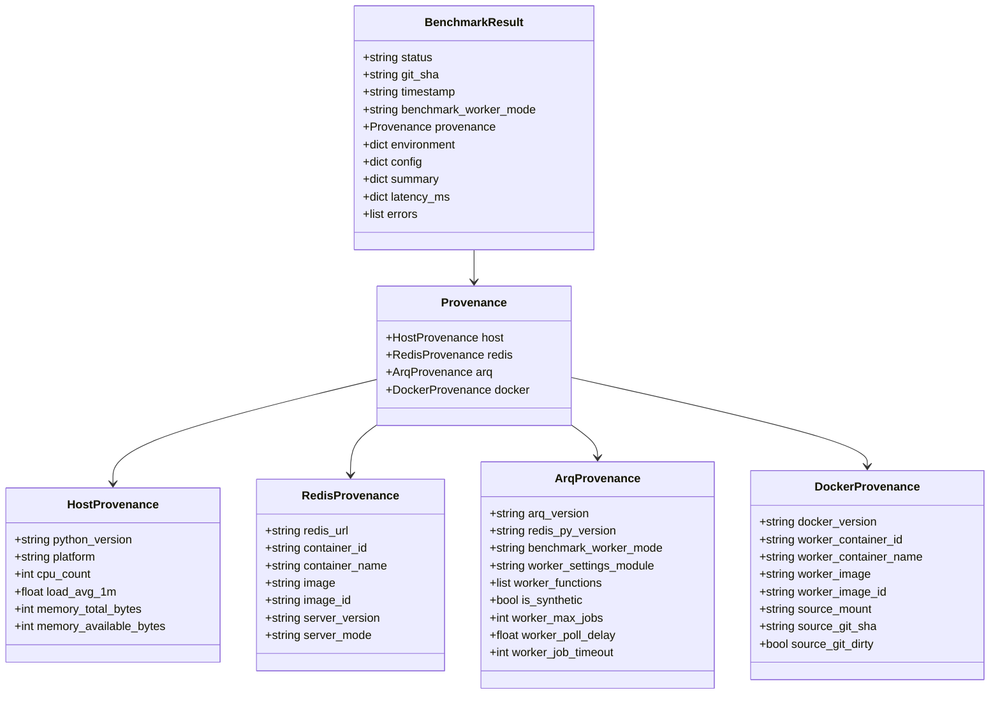

# Arq 하네스 무결성 강화 및 공통 Provenance 검증 보고서

> **작성일**: 2026-08-24
> **작성 목적**: Arq in-process 및 Docker 컨테이너 벤치마크 하네스의 provenance 공통 스키마 적용, 바인드 마운트/Git 상태 검증, 시작-종료 identity 일치성 결박 및 반복 측정 원시 데이터 보존 계약 구현 검증
> **대상 모듈**: [`scripts/benchmark_arq_container.py`](scripts/benchmark_arq_container.py), [`scripts/benchmark_arq_throughput.py`](scripts/benchmark_arq_throughput.py), [`scripts/_bench_worker_settings.py`](scripts/_bench_worker_settings.py)
> **테스트 모듈**: [`tests/test_benchmark_arq_container.py`](tests/test_benchmark_arq_container.py), [`tests/test_benchmark_arq_throughput.py`](tests/test_benchmark_arq_throughput.py)
> **설계 정본**: [`.orca/capsules/task_arq_harness_integrity/capsule.yaml`](.orca/capsules/task_arq_harness_integrity/capsule.yaml)

---

## 1. 개요 및 배경

기존 Arq 처리량 및 지연 계측 하네스는 in-process 방식([`scripts/benchmark_arq_throughput.py`](scripts/benchmark_arq_throughput.py:1))과 Docker 컨테이너 방식([`scripts/benchmark_arq_container.py`](scripts/benchmark_arq_container.py:1))으로 분리 운영되었으나, 다음과 같은 무결성 및 정합성 결함이 존재했습니다:

1. **런타임 소스 결박 부재**: Docker 워커 컨테이너 기동 시 호스트 소스 디렉터리를 `/app`에 바인드 마운트하지만, 실제 마운트된 소스의 Git SHA, dirty 상태, 마운트 경로를 시작 전에 검증하지 않았습니다.
2. **시작-종료 Identity 검증 부재**: 벤치마크 실행 도중 Redis 컨테이너나 워커 컨테이너가 재시작되거나 이미지가 교체되어도 이를 감지하지 못했습니다.
3. **Provenance 스키마 불일치**: in-process와 container 하네스 간의 환경 메타데이터 키 구조가 상이하였고, Redis `INFO server` 버전/실행 모드 및 호스트 물리 메모리 정보가 누락되어 있었습니다.
4. **합성(Synthetic)과 운영(Production) 워커 구분 모호**: 벤치마크 전용 noop 워커(`scripts._bench_worker_settings.WorkerSettings`)가 실제 운영 비즈니스 워커(`src.tasks.worker.WorkerSettings`)와 어떻게 다른지 메타데이터에 명시되지 않아 오인의 소지가 있었습니다.
5. **반복 측정 원시 데이터 보존 계약 미흡**: `--repetitions N` (예: 3회) 실행 시 대표 결과 하나만 저장되거나 중간 회차 실패가 발생해도 fail-closed로 거부하는 엄격한 계약이 부족했습니다.

본 작업을 통해 두 하네스를 공통 Provenance 스키마 및 엄격한 fail-closed 검증 체계로 통합하였습니다.

---

## 2. 주요 개선 사항

### 2.1 호스트 바인드 마운트 및 Git SHA/Dirty 검증 (Fail-Closed)
- 벤치마크 시작 전 호스트 소스 경로(`PROJECT_ROOT` 또는 `--source-mount`)의 Git commit SHA와 `git status --porcelain` dirty 상태를 검사합니다.
- `strict=True` (기본값) 환경에서 Git SHA가 `unknown`이거나 워킹 트리가 `dirty` 상태인 경우 즉시 `BuildProvenanceError`를 발생시키고 측정을 중단합니다.
- 워커 컨테이너 기동 직후 `docker inspect -f '{{json .Mounts}}'`를 파싱하여 컨테이너 내부 `/app` 마운트의 `Source`가 실제 호스트 소스 경로와 정확히 일치하는지 대조 검증합니다.

### 2.2 측정 시작-종료 간 Identity 일치성 검증 (`verify_identity_consistency`)
- 측정 시작 시점(`start_identity`)과 완료 직후(`end_identity`)에 아래 식별자를 수집하여 대조합니다:
  - 워커 컨테이너 ID 및 이미지 식별자 (Container 하네스)
  - Redis 컨테이너 ID, 이미지 ID, Redis 서버 버전(`redis_version`) 및 실행 모드(`redis_mode`)
  - 호스트 소스 마운트 경로, Git SHA, Git dirty 상태
- 측정 도중 컨테이너 교체, 재시작, 브랜치 변경, dirty 상태 변경이 감지되면 evidence를 무효화하고 실패 처리합니다.

### 2.3 4계층 Provenance 공통 스키마 구조화
`host`, `redis`, `arq`, `docker`의 4개 최상위 카테고리로 구성된 동일한 구조를 두 하네스에 모두 적용하였습니다:

| 카테고리 | 공통 필수 키 | 수집 내용 |
| --- | --- | --- |
| **`host`** | `python_version`, `platform`, `cpu_count`, `load_avg_1m`, `memory_total_bytes`, `memory_available_bytes` | Python/OS 런타임, CPU 코어 및 부하율, 물리 메모리 용량 |
| **`redis`** | `redis_url`, `container_id`, `container_name`, `image`, `image_id`, `server_version`, `server_mode` | Redis 접속 URL, Docker 컨테이너 identity, `INFO server` 버전/모드 |
| **`arq`** | `arq_version`, `redis_py_version`, `benchmark_worker_mode`, `worker_settings_module`, `worker_functions`, `is_synthetic`, `worker_max_jobs`, `worker_poll_delay`, `worker_job_timeout` | Arq/Redis 패키지 버전, 워커 모드(`in_process` vs `docker_container`), 합성 워커 설정 |
| **`docker`** | `docker_version`, `worker_container_id`, `worker_container_name`, `worker_image`, `worker_image_id`, `source_mount`, `source_git_sha`, `source_git_dirty` | Docker 엔진 버전, 워커 컨테이너/이미지 식별자, 소스 마운트 및 Git 무결성 |

### 2.4 합성 워커와 운영 워커 명시적 구분
- `scripts/_bench_worker_settings.py`에 `is_synthetic = True`, `benchmark_worker_mode = "docker_container"`, `worker_settings_module = "scripts._bench_worker_settings.WorkerSettings"`, `functions = [benchmark_noop_task]`를 명시하여, 운영 큐(`arq:queue`) 및 비즈니스 태스크(`src/tasks/worker.py`)와 100% 분리된 합성 벤치마크임을 확정하였습니다.

### 2.5 반복 측정(Repetitions) 원시 데이터 보존 계약
- `--repetitions N` (예: 3회) 실행 시 각 회차의 원시 결과가 `<output_stem>_r1.json`, `_r2.json`, `_rN.json`으로 반드시 디스크에 기록됩니다.
- N개 회차 중 단 1회라도 실패하거나, 개별 회차 파일 저장이 누락/0바이트인 경우 최종 프로세스는 즉시 실패(종료 코드 1)로 종료됩니다.
- N회 전량 성공 시에만 P95 기준 최악 대표값을 선정하여 `--output` 최종 파일에 보존합니다.

### 2.6 크로스플랫폼 호환성 보장
- Windows 환경에서 `os.getloadavg`가 없어도 안전하게 `None`을 기록하는 공통 helper(`single_host_load_sample`)를 사용합니다.
- 물리 메모리 수집 시 `os.sysconf`, `/proc/meminfo`, macOS `sysctl`, Windows `ctypes GlobalMemoryStatusEx` 순으로 안전 탐색하여 외부 의존성 없이 동작합니다.

---

## 3. Provenance 스키마 대조표

---

## 4. 검증 결과

1. **단위 테스트 및 스키마 일치성 테스트**:
   - `tests/test_benchmark_arq_throughput.py`: 27개 테스트 통과
   - `tests/test_benchmark_arq_container.py`: 10개 테스트 통과
   - 두 하네스 간 `test_provenance_schema_equality_between_inprocess_and_container` 검증을 통해 4계층의 모든 키 세트가 100% 동일함을 확인.
2. **Fail-Closed 동작 검증**:
   - Git dirty 상태 시 측정 시작 거부 확인.
   - 워커 컨테이너/Redis/Git identity 교체 시 시작-종료 검증 거부 확인.
   - repetitions 중 단일 회차 실패 또는 파일 누락 시 실패 코드 반환 확인.
3. **규칙 및 린트 검증**:
   - `python3 scripts/validate_agent_rules.py` 검증 통과.

---

## 5. 결론 및 향후 계획

- Arq in-process 및 Docker container 벤치마크 하네스가 신뢰할 수 있는 공통 provenance schema 및 fail-closed 무결성 검증 체계를 갖추었습니다.
- 실제 Docker Compose 환경에서의 3회 반복 재측정 및 baseline 갱신은 코디네이터 후속 공유 자원 Task에서 실행됩니다.
