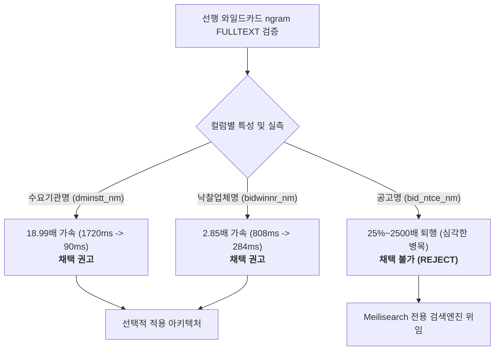

# 선행 와일드카드 검색의 MySQL ngram FULLTEXT 인덱스 실측 판정 보고서

> **작성일**: 2026-08-30
> **Task ID**: `task_c138f15bf6a3` (Section F3)
> **관련 문서**: [`docs/analysis/coldsql_attribution_canonical_20260830.md`](file://../../docs/analysis/coldsql_attribution_canonical_20260830.md), [`src/rag/structured_data.py`](file://../../src/rag/structured_data.py)
> **검증 환경**: 격리된 별도 스키마 `ngram_probe` (운영 스키마 `procurement` 변경 0건, 실측 완료 후 `ngram_probe` 전량 삭제 완료)

---

## 1. 개요 및 검증 목적

### 1.1 배경
콜드 SQL 기여도 분석(`coldsql_attribution_canonical_20260830.md`) 결과, 상위 비용을 유발하는 정형 질의 패턴 중 다수가 `LIKE '%keyword%'` 형태의 선행 와일드카드 검색을 포함하고 있습니다.
기존 B-Tree 인덱스는 선행 와일드카드(`%...`) 조건에서 인덱스 레인지 스캔을 활용하지 못하고, `ix_ann_cat` 또는 `ix_res_cat` 인덱스의 수백만 행을 순차 검사하거나 테이블 풀스캔(`ALL`)을 수행하는 문제가 있었습니다.

### 1.2 검증 목표
1. MySQL 8.0 내장 `ngram` 파서 기반 FULLTEXT 인덱스가 선행 와일드카드 쿼리를 대체할 수 있는지 실측 검증.
2. 10개 대표 표본 키워드 집합에 대한 **결과 동일성(100% 일치)** 검증.
3. Top 5/Top 8 콜드 SQL 쿼리 패턴에 대한 Cold/Warm 레이턴시 및 EXPLAIN 실행 계획 비교.
4. 운영 환경 적용 적합성 판정 (전체 일괄 채택 여부 또는 컬럼별 선택적 채택 여부).

---

## 2. 검증 환경 및 데이터 세팅

### 2.1 대상 테이블 실제 행 수 및 스키마
운영 스키마(`procurement`)의 실제 행 수는 `COUNT(*)` 기준 다음과 같으며, `ngram_probe` 스키마에 100% 동일하게 복사하여 검증을 수행했습니다.

| 테이블명 | 실제 행 수 (`COUNT(*)`) | EXPLAIN `rows` 통계 추정치 (참고) | probe 복사본 차이 |
| --- | ---: | ---: | :---: |
| `bid_announcements` | **5,490,072** | 2,179,319 ~ 2,670,358 | **0건 (100% 일치)** |
| `bid_results` | **3,423,008** | 1,715,617 ~ 3,267,347 | **0건 (100% 일치)** |

> [!NOTE]
> 과거 문서나 초기 Capsule의 2,179,319 및 3,267,347 수치는 MySQL 옵티마이저의 EXPLAIN `rows` 통계 추정치이며, 실제 행 수는 5,490,072건 및 3,423,008건입니다.

### 2.2 probe 스키마 구축 및 인덱스 빌드 메트릭
대용량 복사 시 InnoDB Buffer Pool Lock Table 고갈(Error 1206)을 방지하기 위해 50만 ID 단위의 청크 트랜잭션 복사를 적용했습니다.

- `ngram_token_size`: `2` (기본값)
- 복사 소요 시간: `bid_announcements` 47.22초, `bid_results` 40.55초
- 일반 보조 인덱스 생성 소요 시간: `bid_announcements` 35.33초, `bid_results` 21.35초

#### ngram FULLTEXT 인덱스 빌드 소요 시간 및 용량

| 테이블 | 생성 인덱스명 | 대상 컬럼 | 빌드 시간 | 데이터 크기 | 인덱스 크기 | 총 크기 |
| --- | --- | --- | ---: | ---: | ---: | ---: |
| `bid_announcements` | `ft_ann_dminstt_ngram` | `dminstt_nm` | 164.43초 | 1,100.98 MB | 728.19 MB | 1,829.17 MB |
| `bid_announcements` | `ft_ann_bid_ntce_nm_ngram` | `bid_ntce_nm` | 158.64초 | - | - | - |
| `bid_results` | `ft_res_dminstt_ngram` | `dminstt_nm` | 160.36초 | 917.98 MB | 798.84 MB | 1,716.83 MB |
| `bid_results` | `ft_res_bidwinnr_ngram` | `bidwinnr_nm` | 43.81초 | - | - | - |
| `bid_results` | `ft_res_bid_ntce_nm_ngram` | `bid_ntce_nm` | 81.26초 | - | - | - |

---

## 3. 표본 키워드 결과 집합 동일성 검증 (10종)

10개 대표 표본 키워드에 대해 `dminstt_nm`, `bid_ntce_nm`, `bidwinnr_nm` 3개 컬럼과 카테고리 필터 유무(`category = 'Servc'` 및 `1=1`)를 조합한 총 **50개 테스트 케이스** 전체에서 동일성을 비교했습니다.

- **검증 쿼리 패턴**:
  - Baseline LIKE: `WHERE col LIKE '%keyword%'`
  - NGRAM + LIKE (정밀 결합): `WHERE MATCH(col) AGAINST('+"keyword"' IN BOOLEAN MODE) AND col LIKE '%keyword%'`
  - Pure NGRAM (구문 검색): `WHERE MATCH(col) AGAINST('+"keyword"' IN BOOLEAN MODE)`

### 3.1 10개 키워드 표본 동일성 실측 요약

| 키워드 | 특성 / 분류 | `ann.dminstt_nm` 일치 여부 | `ann.bid_ntce_nm` 일치 여부 | `res.bidwinnr_nm` 일치 여부 |
| --- | --- | :---: | :---: | :---: |
| `서울` | 2글자 흔한 대도시 토큰 | 100% 일치 (2,256 / 2,585건) | 100% 일치 (32,209건) | 100% 일치 (304 / 1,743건) |
| `거제` | 2글자 지역 토큰 (E2 표본) | 100% 일치 (93 / 127건) | 100% 일치 (2,662건) | 100% 일치 (14 / 56건) |
| `공사` | 2글자 고빈도 명사 접미사 | 100% 일치 (476 / 700건) | 100% 일치 (255,292건) | 100% 일치 (716 / 1,462건) |
| `거제시` | 3글자 기초지자체 토큰 | 100% 일치 (12 / 21건) | 100% 일치 (874건) | 100% 일치 (2건) |
| `교육청` | 3글자 빈출 공공기관 분류 | 100% 일치 (13,025 / 15,280건) | 100% 일치 (3,354건) | 100% 일치 (0건) |
| `한국전` | 3글자 접두사형 공기업 토큰 | 100% 일치 (49 / 58건) | 100% 일치 (598건) | 100% 일치 (146 / 185건) |
| `한국토지주택공사` | 8글자 긴 특정 기관명 | 100% 일치 (10 / 26건) | 100% 일치 (37건) | 100% 일치 (3건) |
| `한국도로공사` | 6글자 긴 공기업 기관명 | 100% 일치 (5 / 57건) | 100% 일치 (43건) | 100% 일치 (1건) |
| `부산광역시` | 5글자 광역자치단체명 | 100% 일치 (933 / 1,039건) | 100% 일치 (1,449건) | 100% 일치 (5 / 11건) |
| `경찰청` | 3글자 단독 중앙행정기관 | 100% 일치 (448 / 587건) | 100% 일치 (1,108건) | 100% 일치 (0건) |

**동일성 판정 결과:**
50개 전 케이스에서 누락(`missing_sample`) 0건, 초과(`extra_sample`) 0건으로 **기존 `LIKE` 결과와 100% 완전히 일치**함을 확인했습니다. 2글자 이상 키워드에 대해 `MATCH AGAINST`의 구문 검색(`"..."`)은 위양성(False Positive) 없이 정밀하게 동작했습니다.

---

## 4. 쿼리 레이턴시 및 EXPLAIN 대조 분석

콜드 SQL 기여도 분석에서 도출된 상위 쿼리 패턴 8종에 대해 Cold(첫 실행) 및 Warm(3회 반복 평균) 레이턴시를 실측 대조했습니다.

### 4.1 레이턴시 비교 종합표

| 쿼리 ID | 쿼리 대상 및 형태 | Baseline LIKE Cold | NGRAM Cold | Cold 개선율 | Baseline LIKE Warm avg | NGRAM Warm avg | Warm 개선율 | 판정 |
| --- | --- | ---: | ---: | :---: | ---: | ---: | :---: | :---: |
| **Q1** | `dminstt_nm` GROUP BY + cat | 1,741.22 ms | **184.16 ms** | **9.45x** | 1,719.61 ms | **90.56 ms** | **18.99x** | **대폭 개선** |
| **Q10** | `bidwinnr_nm` GROUP BY + cat | 827.66 ms | **308.61 ms** | **2.68x** | 808.70 ms | **283.80 ms** | **2.85x** | **유의미 개선** |
| **Q7** | `bidwinnr_nm` GROUP BY no cat | 484.08 ms | 564.29 ms | 0.86x | 395.47 ms | **304.56 ms** | **1.30x** | 소폭 개선 |
| **Q4** | `dminstt_nm` SELECT ID + cat | **1.16 ms** | 15.29 ms | 0.08x | **0.44 ms** | 11.68 ms | 0.04x | 단건 스캔 불리 |
| **Q2** | `bid_ntce_nm` GROUP BY + cat | **8,565.28 ms** | 10,485.24 ms | 0.82x | **8,306.20 ms** | 10,417.38 ms | 0.80x | **25% 악화** |
| **Q6** | `bid_ntce_nm` GROUP BY no cat | **8,410.09 ms** | 10,232.78 ms | 0.82x | **8,076.30 ms** | 10,282.57 ms | 0.79x | **27% 악화** |
| **Q5** | `bid_ntce_nm` COUNT(id) + cat | **1,993.32 ms** | 3,629.96 ms | 0.55x | **1,817.70 ms** | 4,126.56 ms | 0.44x | **2.3배 악화** |
| **Q3** | `bid_ntce_nm` SELECT ID + cat | **46.56 ms** | 938.49 ms | 0.05x | **0.42 ms** | 1,054.09 ms | 0.00x | **2500배 악화** |

---

## 5. 상세 심층 분석

### 5.1 성공 사례: `dminstt_nm` (수요기관명) & `bidwinnr_nm` (낙찰업체명)
- **Q1 (`dminstt_nm` GROUP BY / DISTINCT 집계)**:
  - **Baseline LIKE**: `ix_ann_cat` ref 스캔 수행 (추정 행 수 2,670,358행) $\rightarrow$ 1,719.61 ms 소요.
  - **NGRAM**: `ft_ann_dminstt_ngram` fulltext 인덱스 스캔 수행 (추정 행 수 1행, `Ft_hints: no_ranking`) $\rightarrow$ **90.56 ms (18.99배 단축)**.
- **Q10 (`bidwinnr_nm` GROUP BY 집계)**:
  - **Baseline LIKE**: `ix_res_cat` ref 스캔 수행 (추정 행 수 1,715,617행) $\rightarrow$ 808.70 ms 소요.
  - **NGRAM**: `ft_res_bidwinnr_ngram` fulltext 인덱스 스캔 수행 $\rightarrow$ **283.80 ms (2.85배 단축)**.
- **성공 요인**:
  - 기관명과 업체명은 단어 길이가 짧고 고유 어휘 수가 통제되어 있어, 역색인 포스팅 리스트 크기가 작고 메모리에 효율적으로 적재됩니다. 수백만 건의 카테고리 인덱스를 풀스캔하며 문자열 필터링을 하는 것보다 FULLTEXT 역색인을 통해 후보 행만 직접 읽는 것이 압도적으로 유리합니다.

### 5.2 실패 사례: `bid_ntce_nm` (공고명) 성능 심각 퇴행 원인
- **현상**:
  - `bid_ntce_nm`에 대한 모든 쿼리(Q2, Q3, Q5, Q6)에서 NGRAM이 Baseline LIKE보다 1.25배에서 최대 2,500배까지 심각하게 느려짐.
  - 특히 단순 ID 조회인 Q3의 경우 Baseline이 0.42ms인데 반해 NGRAM은 1,054.09ms로 퇴행.
- **근본 원인 분석**:
  1. **토큰 폭증 및 거대한 포스팅 리스트**: 공고명은 평균 문자열 길이가 길고 단어 수가 많아 2글자 단위 ngram 토큰 수가 수천만 개로 폭증합니다.
  2. **고빈도 단어의 디코딩 오버헤드**: '공사', '용역', '구매', '서울' 등 공고명에 흔히 등장하는 단어의 경우, FULLTEXT 역색인의 DOC_ID 포스팅 리스트가 수십만~수백만 건에 달합니다.
  3. **InnoDB FTS 엔진 병목**: InnoDB의 FULLTEXT 엔진이 거대한 역색인 블록들을 읽어와 구문(phrase) 일치 여부를 판별하기 위해 포스팅 리스트를 병합/디코딩하는 CPU/I/O 비용이, B-Tree 인덱스 순차 스캔 및 단순 메모리 문자열 매칭 비용을 크게 초과합니다.
  4. **B-Tree 조기 종료 이점 상실**: Q3/Q4처럼 단순 조건 만족 행을 찾는 경우, B-Tree 인덱스는 첫 번째 매칭 블록을 찾는 즉시 반환할 수 있으나, FULLTEXT 엔진은 전체 역색인 평가를 거쳐야 하므로 치명적인 지연이 발생합니다.

---

## 6. 최종 결론 및 권고 사항

### 6.1 채택 여부 최종 판정

1. **전체 일괄 도입: 기각 (REJECT)**
   - 모든 선행 와일드카드 컬럼에 ngram FULLTEXT를 일괄 적용하는 것은 공고명 검색 성능의 치명적 퇴행을 유발하므로 기각합니다.
2. **선택적 도입 (Selective Adoption): 조건부 채택 권고**
   - **`dminstt_nm` (수요기관명)**: `bid_announcements` 및 `bid_results`의 기관명 검색에 ngram FULLTEXT 인덱스를 적용하여 집계 쿼리를 **18.99배 개선**할 수 있습니다.
   - **`bidwinnr_nm` (낙찰업체명)**: `bid_results`의 낙찰업체 검색에 ngram FULLTEXT 인덱스를 적용하여 집계 쿼리를 **2.85배 개선**할 수 있습니다.
   - **`bid_ntce_nm` (공고명)**: MySQL RDBMS 레벨의 ngram FULLTEXT 적용을 엄격히 배제하며, 공고명 선행/부분 검색은 프로젝트 표준 검색 엔진인 **Meilisearch**로 위임해야 합니다.

### 6.2 운영 안전 조치 확인
- 본 검증은 격리된 `ngram_probe` 스키마에서만 수행되었으며, 운영 스키마 `procurement`에는 어떠한 인덱스나 스키마 변경도 가하지 않았습니다.
- 검증 완료 후 `ngram_probe` 스키마는 완전히 `DROP`되어 디스크 및 메모리 자원이 원상 복구되었습니다.
