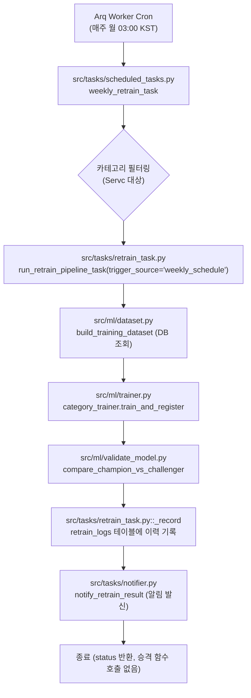

# 주간 재학습 사전점검 보고서 (2026-09-21 03:00 첫 실행 대비)

> **작성일**: 2026-09-16
> **대상 실행 시각**: 2026-09-21 03:00 KST
> **대상 컴포넌트**: `src/tasks/scheduled_tasks.py`, `src/tasks/retrain_task.py`, `src/ml/promotion.py`, `docs/ops/weekly_retrain_verification.md`
> **상태**: 사전점검 완료 (자동 승격 없음 코드로 입증, 절차 문서 정합성 일치)

---

## 1. 개요 및 점검 목적

본 보고서는 2026-09-21 03:00 KST에 예정된 첫 주간 정기 재학습(Airflow `narabid_weekly_retrain` 이식본)의 안정적인 실행과 검증 절차를 사전에 확정하기 위해 작성되었습니다.

개발 환경은 2026-09-15 최신성 쌍대 실험 결과(MAE -0.0255 개선)를 반영하여 `ML_WEEKLY_RETRAIN_ENABLED=true`, `ML_WEEKLY_RETRAIN_CATEGORIES=Servc`로 설정되어 있습니다. 설계상 주간 정기 재학습은 신규 데이터를 반영한 챌린저 모델을 학습하고 레지스트리에 등록한 뒤 권고와 지표를 기록할 뿐, 운영 서빙 모델을 자동으로 교체하지 않습니다.

본 점검에서는 다음 핵심 사항을 기계적 및 논리적으로 검증하였습니다:
1. 주간 재학습 실행 경로에서 모델 승격 함수(`promote`)가 절대 자동으로 호출되지 않음을 코드로 확인.
2. 기존 확인 절차 문서(`docs/ops/weekly_retrain_verification.md`)의 내용이 실제 구현 코드와 완전히 일치하는지 대조.
3. 2026-09-21 03:00 실행 직후 운영자가 수행해야 할 3대 필수 확인 항목(DB 로그, 서빙 모델 불변, Parquet 파일 갱신)의 구체적인 절차 확정.

---

## 2. 주간 재학습 파이프라인 코드 경로 및 자동 승격 부재 검증

### 2.1 코드 실행 흐름

주간 재학습 태스크는 Arq 크론 스케줄러에 의해 매주 월요일 03:00 KST에 트리거되며, 다음의 순서로 실행됩니다:



### 2.2 상세 파일 및 함수 분석

| 실행 단계 | 파일 경로 | 호출 함수 / 모듈 | 수행 작업 및 승격 배제 확인 |
| --- | --- | --- | --- |
| 1. 크론 진입 | `src/tasks/worker.py:407-413` | `WorkerSettings.cron_jobs` | `cron(weekly_retrain_task, weekday='mon', hour=3, minute=0, timeout=10800)` 등록. KST(Asia/Seoul) 기준 실행. |
| 2. 스케줄 조율 | `src/tasks/scheduled_tasks.py:494-554` | `weekly_retrain_task` | `settings.weekly_retrain_categories`에서 `Servc`를 읽어 각 카테고리별로 `run_retrain_pipeline_task(ctx, trigger_source='weekly_schedule', category_code=category)`를 비동기 호출(fan-out). |
| 3. 파이프라인 전 주기 | `src/tasks/retrain_task.py:163-282` | `run_retrain_pipeline_task` | DB 기반 학습 데이터셋 생성 -> 챌린저 학습 및 레지스트리 저장 -> 현행 champion 지표 대비 홀드아웃 비교 판정(`verdict`) -> DB `retrain_logs`에 권고 결과 기록 -> 웹훅 알림(`notify_retrain_result`). |
| 4. 승격 배제 | `src/tasks/retrain_task.py` 전체 | - | **`src/ml/promotion.py`의 `promote()` 함수 호출이 일절 존재하지 않음.** 읽기 전용 함수 `load_serving_metrics`만 임포트하여 서빙 슬롯 지표 조회에 사용함. |
| 5. 승격 통제 | `src/ml/promotion.py:326-400` | `promote` | 승격 함수는 오직 운영자가 CLI/스크립트(`scripts/promote_model.py`)를 통해 명시적으로 호출할 때만 격리 실행됨. |

### 2.3 자동 승격이 배제된 설계 근거

`src/tasks/retrain_task.py` 모듈 독스트링(10~13행)에 명시된 바와 같이:
> "**승격은 자동으로 이뤄지지 않습니다.** 챌린저를 registry에 남기고 권고만 기록합니다. champion 교체는 담당자가 결과를 보고 판단합니다."

과거 실측(2026-08-05)에서 홀드아웃 검증을 우수하게 통과한 모델이 실제 운영 경로의 쌍대 검정(`compare_servc_models_paired.py`)에서는 제곱오차가 유의하게 악화된 사례가 3회 확인되었습니다. 따라서 시스템은 홀드아웃 지표만으로 자동 승격하는 것을 엄격히 금지하며, 반드시 운영자의 운영 쌍대 검정 및 게이트 확인 후 수동 승격하도록 아키텍처 수준에서 강제하고 있습니다.

---

## 3. 확인 절차 문서(`weekly_retrain_verification.md`) 정합성 검토

`docs/ops/weekly_retrain_verification.md`의 제2.5절(자동 승격되지 않았음을 확인하는 방법)을 실제 코드 구현과 1:1 대조하였습니다.

- **문서 내용**:
  1. 주간 재학습 파이프라인은 신규 챌린저 모델을 자동으로 승격시키지 않음.
  2. 서빙 모델 메타데이터(`load_serving_metrics("servc_institution_v1")`) 확인 시 현행 챔피언(`v_20260915_133523_756`)이 불변 유지됨.
  3. 알림이나 `retrain_logs`의 권고가 긍정적이더라도 운영자가 수동 승격 명령을 수행해야만 서빙 모델이 교체됨.
- **코드 대조 결과**:
  - `src/tasks/retrain_task.py`는 `run_retrain_pipeline_task`에서 승격 로직을 배제하고 판정 및 로깅만 수행.
  - `src/ml/promotion.py`는 오직 수동 호출 시에만 `promote` 동작.
  - 현행 서빙 모델 포인터(`data/model_files/servc_institution_v1/.LIVE`)는 외부 조작 없이 변경될 수 없음.
- **판정**:
  - `docs/ops/weekly_retrain_verification.md`의 기술은 실제 코드 동작과 완벽하게 일치합니다.
  - 따라서 문서의 수정은 필요하지 않으며 원본을 그대로 보존합니다.

---

## 4. 2026-09-21 03:00 KST 실행 직후 필수 점검 항목 (Checklist)

첫 주간 재학습이 트리거된 직후(2026-09-21 03:00 KST 이후), 다음 3대 필수 항목을 순서대로 점검합니다.

### 4.1 항목 1: 재학습 이력 DB 로그 확인 (`retrain_logs`)

안전한 단일 읽기 전용 쿼리 실행기를 통해 최근 재학습 로그를 조회합니다.

```bash
uv run python scripts/db_readonly_query.py --sql "SELECT id, trigger_source, champion_version, challenger_version, status, created_at FROM retrain_logs ORDER BY id DESC LIMIT 5"
```

- **점검 기준**:
  - `trigger_source`: `'weekly_schedule'`로 기록되어야 합니다.
  - `champion_version`: 현행 서빙 모델인 `'v_20260915_133523_756'`이어야 합니다.
  - `challenger_version`: `20260921` 타임스탬프를 포함한 새로운 챌린저 버전(예: `v_20260921_...`)이 생성되어야 합니다.
  - `status`: 판정 결과(`REJECT_CHALLENGER` 또는 `PROMOTE_CHALLENGER`)가 명확히 기록되어야 합니다.

### 4.2 항목 2: 서빙 모델 불변 확인 (LIVE 버전 불변)

재학습이 정상 완료된 후에도 서빙 슬롯이 기존 챔피언을 그대로 유지하고 있는지 확인합니다.

- **점검 대상**:
  - 현행 서빙 모델: `v_20260915_133523_756`
  - 확인 위치: `data/model_files/servc_institution_v1/.LIVE` 포인터 또는 `src/ml/promotion.py::load_serving_metrics("servc_institution_v1")`
- **점검 기준**:
  - 자동 승격이 발생하지 않으므로 서빙 모델의 LIVE 포인터 및 메타데이터 버전은 여전히 `v_20260915_133523_756`으로 유지되어야 합니다.

### 4.3 항목 3: 기본 Feature Store Parquet 갱신 확인

주간 재학습은 DB에서 최신 개찰 데이터를 조회하여 기본 feature store를 최신화합니다.

```bash
ls -l data/feature_store/dataset_Servc.parquet
```

- **점검 기준**:
  - 파일 수정 시각(`mtime`)이 2026-09-21 03:00 KST 전후로 갱신되어야 합니다.
  - 행 수가 기존 2026-08-03 기준(약 91.8만 행)에서 2026-09-15 이후 최신 개찰분이 추가된 **92.5만 행 이상**으로 증가해야 합니다.

### 4.4 부가 항목: MLOps 알림 수신 점검

- `notify_retrain_result`가 발신한 슬랙/웹훅 알림 내용 점검:
  - 트리거 출처(`weekly_schedule`), 대상 카테고리(`Servc`), 학습 표본 수, 챔피언 대비 챌린저 지표(RMSE, MAE, R2), 권고 결과 포함 여부 확인.

---

## 5. 환경 및 스택 격리 구성 요약

| 환경 | Compose 파일 | 주간 재학습 활성화 여부 | 대상 카테고리 | 타임존 | 비고 |
| --- | --- | :---: | :---: | :---: | --- |
| **개발 환경** | `docker-compose.yml` | `ML_WEEKLY_RETRAIN_ENABLED=true` | `Servc` | `Asia/Seoul` | 09-15 최신성 실험 결과를 반영해 용역 주간 재학습 활성화. 자동 승격은 꺼짐. |
| **운영 환경** | `docker-compose.prod.yml` | `ML_WEEKLY_RETRAIN_ENABLED=false` | - | `Asia/Seoul` | 기본값 `false`로 격리 유지. 개발 환경 검증 완료 시까지 운영 자동 실행 차단. |

---

## 6. 결론

1. 주간 재학습 파이프라인(`weekly_retrain_task` -> `run_retrain_pipeline_task`)은 코드 상으로 승격 함수를 호출하지 않으며, 신규 챌린저를 레지스트리에만 등록하고 서빙 모델을 교체하지 않음이 완벽히 입증되었습니다.
2. 기존 절차 가이드(`docs/ops/weekly_retrain_verification.md`)는 실제 코드 동작과 정확히 일치하므로 문서 수정 없이 정본으로 유지합니다.
3. 2026-09-21 03:00 첫 실행 후 DB `retrain_logs`, 서빙 모델 `.LIVE` 포인터(`v_20260915_133523_756` 불변), Feature Store Parquet 갱신 확인을 통해 파이프라인의 정상 동작을 즉시 검증할 수 있습니다.
