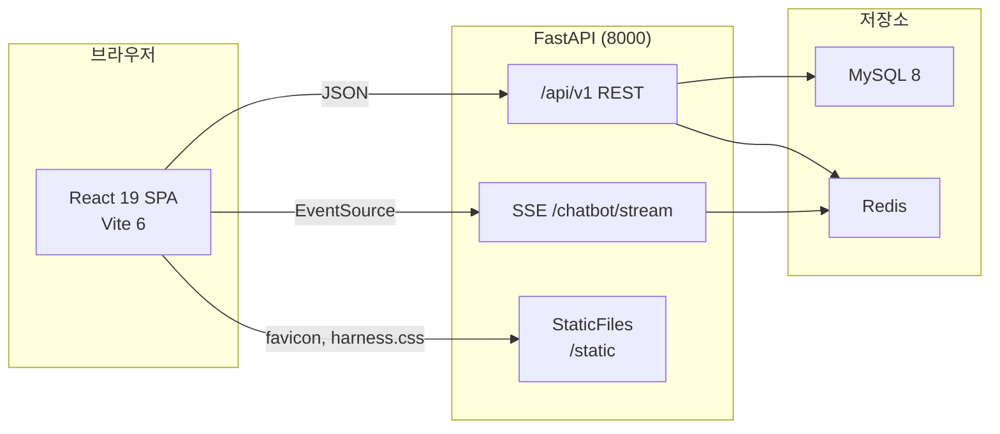

# 프론트엔드 React 원본 재현 설계서

> **작성일**: 2026-08-03
> **버전**: v0.1.0
> **상태**: **기각** (2026-08-03). [`FRONTEND_DECISION.md`](FRONTEND_DECISION.md) 의 SSR 정본 결정을 유지하기로 하여 실행하지 않습니다. 판단 근거로만 보존합니다
> **대상**: `frontend/` React 19 애플리케이션
> **원본**: `/Users/kwanbum/Documents/korea_IT/lanhchain_ai_vision/bid_box` (Django 5.1.6)

---

## 0. 선행 경고: 확정 ADR 과의 충돌

본 설계서는 기존 확정 결정을 **뒤집는 것을 전제**로 작성되었습니다. 채택 전 반드시 아래를 확인해야 합니다.

| 문서 | 확정일 | 결정 내용 |
| --- | --- | --- |
| [`FRONTEND_DECISION.md`](FRONTEND_DECISION.md) | 2026-07-31 | 1차 UI 는 SSR + HTMX + Jinja2 |
| 동일 문서 | 2026-07-31 | React SPA(`frontend/`) 는 신규 개발 중단, 참조용 동결 |
| 동일 문서 | 2026-08-01 | 원본 템플릿 12종 5,370줄 Jinja2 이식 **완료** |

기존 ADR 이 React 를 중단한 사유는 "Antigravity 가 설계와 무관하게 생성" 이었습니다. 따라서 본 설계서를 채택한다는 것은 다음을 의미합니다.

1. 이미 완료된 원본 재현 작업(SSR)을 React 로 다시 수행합니다.
2. 확정 상태의 ADR 을 폐기하고 새 결정으로 대체합니다.
3. P1~P8 전 단계를 새로 수행해야 하며, 그동안 정본 UI 의 이중화가 지속됩니다.

**채택하지 않을 경우** 필요한 조치는 훨씬 작습니다. `frontend/` 를 배포 구성에서 분리하여 원본과 다른 디자인이 노출되지 않게 하는 것으로 충분하며, 이는 본 설계서 11장의 대안에 해당합니다.

---

## 1. 배경과 문제 정의

리팩토링 저장소에는 프론트엔드가 **두 벌** 존재하며, 둘의 디자인이 서로 다릅니다. 아래는 추정이 아니라 두 저장소를 직접 비교한 실측 결과입니다.

### 1.1 경로별 현황

| 구분 | 경로 | 포트 | 원본 재현 여부 |
| --- | --- | --- | --- |
| SSR 템플릿 | `src/app/templates/` | 8000 (`app`) | 재현됨 |
| React SPA | `frontend/src/App.tsx` | 5173 (`frontend`) | **재현되지 않음** |

### 1.2 SSR 템플릿 실측 (재현 상태 양호)

| 파일 | 원본 | 현재 | 차이의 성격 |
| --- | --- | --- | --- |
| `base.html` | 448줄 | 447줄 | Django 태그 -> Jinja2 문법 |
| `index.html` | 784줄 | 783줄 | 동일 |
| `chatbot/chat.html` | 1,828줄 | 1,834줄 | 동일 |
| `bids/dashboard.html` | 387줄 | 386줄 | 동일 |

팔레트 정의는 원본과 완전히 일치합니다.

```
primary.DEFAULT #0073E6   primary.hover #005BB3   primary.light #E6F1FF
harness.bg #F9FAFB        harness.sidebar #020B1A  harness.border #E6E9EF
harness.text #1F2937      harness.muted #6B7280
```

### 1.3 React SPA 실측 (문제 지점)

| 항목 | 원본 | 현재 React |
| --- | --- | --- |
| 화면 수 | 12개 페이지 템플릿 (총 5,370줄) | `App.tsx` 단일 파일 728줄 |
| 주 색상 | `#0073E6` 기업형 블루 | `#0f172a`, `#38bdf8`, `#334155` (slate/sky) |
| 레이아웃 | 고정 사이드바 + harness 디자인 | 원본과 무관한 독자 구성 |
| API 연동 | - | `/api/v1/chatbot/stream` 한 곳뿐 |

`docker-compose.yml:30`에 `frontend` 서비스가 5173 포트로 등록되어 실행 시 화면에 노출되지만, `src/app/main.py`는 이 빌드 산출물을 마운트하지 않습니다. **원본과 다른 디자인의 UI가 배포 구성에는 올라가 있으면서 백엔드와는 연결되지 않은 상태**입니다.

### 1.4 문제의 정의

12개 페이지를 728줄 단일 파일로 축약한 것은 리팩토링이 아니라 별개 산출물입니다. 재현율 관점의 결함이며, 동시에 정본 UI가 무엇인지 불분명한 구조적 결함입니다.

---

## 2. 목표와 비목표

### 2.1 목표

| 번호 | 목표 |
| --- | --- |
| F1 | 원본 12개 화면을 React 컴포넌트로 이관하되 **디자인 토큰, 레이아웃, 색상을 원본과 동일하게 유지** |
| F2 | 모든 화면을 `/api/v1` REST 계약에 연결하여 실제 동작하는 상태로 완성 |
| F3 | 정본 UI 경로를 하나로 확정하고 배포 구성에서 중복을 제거 |

### 2.2 비목표

| 항목 | 사유 |
| --- | --- |
| 디자인 개선, 색상 재해석 | 재현이 목적이므로 임의 변경은 결함으로 간주합니다 |
| 백엔드 API 스키마 변경 | 기존 계약을 그대로 소비합니다 |
| DB 스키마 변경 | 데이터 무손실 원칙(G1)에 따라 금지입니다 |

---

## 3. 원본 자산 인벤토리

### 3.1 페이지 목록

| 원본 템플릿 | 줄 수 | 경로 | 대응 React 라우트 |
| --- | --- | --- | --- |
| `index.html` | 784 | `/` | `/` |
| `bids/list.html` | 184 | `/bids/` | `/bids` |
| `bids/detail.html` | 517 | `/bids/{pk}/` | `/bids/:pk` |
| `bids/results.html` | 323 | `/results/` | `/results` |
| `bids/result_detail.html` | 150 | `/results/{pk}/` | `/results/:pk` |
| `bids/dashboard.html` | 387 | `/dashboard/` | `/dashboard` |
| `bids/compare.html` | 336 | `/compare/` | `/compare` |
| `chatbot/chat.html` | 1,828 | `/chat/` | `/chat` |
| `accounts/login.html` | 116 | `/accounts/login/` | `/accounts/login` |
| `accounts/signup.html` | 277 | `/accounts/signup/` | `/accounts/signup` |
| `accounts/terms_content.html` | 20 | 약관 부분 | 컴포넌트로 내포 |
| `base.html` | 448 | 공통 레이아웃 | `AppLayout` |

합계 5,370줄입니다. `chat.html` 한 화면이 전체의 34퍼센트를 차지하므로 별도 단계로 분리합니다.

### 3.2 사이드바 내비게이션 (원본 `base.html`)

| 순서 | 라벨 | 이동 경로 |
| --- | --- | --- |
| 1 | 홈 | `/` |
| 2 | 공고 탐색 | `/bids` |
| 3 | 낙찰 결과 | `/results` |
| 4 | 입찰 인텔리전스 | `/dashboard` |
| 5 | AI 어드바이저 | `/chat` |
| 6 | 환경 설정 | 설정 화면 |

브랜드 표기는 `BID<span class="text-primary">BOX</span>` 형태이며 활성 항목은 `bg-primary text-white font-bold`, 비활성은 `text-white/60`입니다.

---

## 4. 아키텍처

### 4.1 구성도



### 4.2 화면과 API 매핑

| 화면 | 소비 엔드포인트 |
| --- | --- |
| 홈 | `GET /api/v1/bids/home` |
| 공고 탐색 | `GET /api/v1/bids` |
| 공고 상세 | `GET /api/v1/bids/{pk}`, `POST /api/v1/predictions/predict-price` |
| 낙찰 결과 | `GET /api/v1/bids/results` |
| 낙찰 결과 상세 | `GET /api/v1/bids/results/{pk}` |
| 입찰 인텔리전스 | `GET /api/v1/bids/stats` |
| 공고 대비 비교 | `GET /api/v1/bids/compare-stats` |
| AI 어드바이저 | `POST /api/v1/chatbot/chat`, `GET /api/v1/chatbot/stream`, `POST /api/v1/chatbot/session/new` |
| 로그인 | `POST /api/v1/accounts/login`, `GET /api/v1/accounts/me` |
| 회원가입 | `POST /api/v1/accounts/signup` |
| 로그아웃 | `POST /api/v1/accounts/logout` |
| 자동화 실행 | `POST /api/v1/automation/run/*`, `GET /api/v1/automation/job/{job_id}/status` |

모든 엔드포인트는 이미 구현되어 있으므로 백엔드 추가 작업은 없습니다.

---

## 5. 디자인 토큰 이관 방침

### 5.1 원칙

원본은 Tailwind CDN 설정을 `base.html` 인라인 스크립트로 주입합니다. React 에서는 이를 **빌드타임 Tailwind 설정으로 이관**하되 값은 한 글자도 바꾸지 않습니다.

### 5.2 이관 대상

| 토큰 | 값 | 이관 위치 |
| --- | --- | --- |
| `primary.DEFAULT` | `#0073E6` | `tailwind.config.ts` |
| `primary.hover` | `#005BB3` | 동일 |
| `primary.light` | `#E6F1FF` | 동일 |
| `harness.bg` | `#F9FAFB` | 동일 |
| `harness.sidebar` | `#020B1A` | 동일 |
| `harness.border` | `#E6E9EF` | 동일 |
| `harness.text` | `#1F2937` | 동일 |
| `harness.muted` | `#6B7280` | 동일 |
| `borderRadius.enterprise` | `0.75rem` | 동일 |

`static/css/harness.css` 는 원본과 동일 파일을 그대로 사용합니다. 복제하지 않고 `/static` 마운트를 통해 참조하여 이중 관리를 피합니다.

### 5.3 금지 사항

- slate/sky 계열(`#0f172a`, `#38bdf8`) 등 현행 React 팔레트는 **전량 폐기**합니다.
- 임의의 색상 추가, 여백 조정, 폰트 변경을 금지합니다. 필요 시 원본 수정이 선행되어야 합니다.

---

## 6. 컴포넌트 설계

### 6.1 디렉토리 구조

```
frontend/src/
  main.tsx
  App.tsx                 라우터 정의만 유지
  layouts/
    AppLayout.tsx         base.html 대응 (사이드바 + 헤더 + 콘텐츠)
    Sidebar.tsx
    TopBar.tsx
  pages/
    HomePage.tsx
    BidListPage.tsx
    BidDetailPage.tsx
    ResultListPage.tsx
    ResultDetailPage.tsx
    DashboardPage.tsx
    ComparePage.tsx
    ChatPage.tsx
    LoginPage.tsx
    SignupPage.tsx
  components/
    common/               버튼, 배지, 페이지네이션, 빈 상태
    bids/                 공고 카드, 필터 바, 상세 패널
    chat/                 메시지 버블, 제안 칩, 입력 바, 스트리밍 표시
  api/
    client.ts             fetch 래퍼, 오류 정규화
    bids.ts / chatbot.ts / accounts.ts / predictions.ts
  types/
    api.ts                백엔드 Pydantic 스키마 대응 타입
```

### 6.2 레이아웃 대응 규칙

| 원본 `base.html` 블록 | React 컴포넌트 |
| --- | --- |
| 사이드바 내비게이션 | `Sidebar.tsx` |
| 상단 검색 바, 로그인 버튼 | `TopBar.tsx` |
| `` | `AppLayout` 의 `pageHeader` prop |
| `` | `<Outlet />` |

활성 메뉴 판정은 원본이 `request.resolver_match` 를 쓰지만 React 에서는 `useLocation()` 으로 대체합니다. 판정 결과에 따른 클래스 문자열은 원본과 동일하게 유지합니다.

---

## 7. 인증과 세션

원본은 Django 세션 쿠키를 사용하며, 리팩토링 백엔드도 `POST /api/v1/accounts/login` 이 세션을 설정합니다.

| 항목 | 방침 |
| --- | --- |
| 인증 수단 | 세션 쿠키 유지 (JWT 도입하지 않음) |
| 요청 설정 | `fetch(..., { credentials: "include" })` |
| 사용자 상태 | 앱 진입 시 `GET /api/v1/accounts/me` 로 복원 |
| 보호 라우트 | 미인증 시 `/accounts/login?next=` 로 이동 |
| CORS | 개발 시 Vite 프록시로 동일 출처화하여 쿠키 문제를 회피 |

---

## 8. 챗봇 화면 (최대 난이도)

`chat.html` 1,828줄은 단일 페이지 중 가장 복잡합니다. 원본에서 확인된 주요 요소입니다.

| 원본 요소 | ID | React 대응 |
| --- | --- | --- |
| 새 대화 버튼 | `btn-new-chat` | `NewChatButton` |
| 메시지 영역 | `chat-messages` | `MessageList` |
| 초기 안내 화면 | `welcome-state` | `WelcomeState` |
| 추천 질의 칩 | `suggestions-area` | `SuggestionChips` |
| 입력창 | `chat-input` | `ChatInput` |
| 전송 / 중지 | `btn-send`, `btn-stop` | `ChatInput` 내부 상태 |

스트리밍은 `GET /api/v1/chatbot/stream` (SSE) 를 `EventSource` 로 구독하며, 중지 버튼은 연결 해제로 처리합니다. 세션 생성은 `POST /api/v1/chatbot/session/new` 를 사용합니다.

---

## 9. 재현율 검증 기준

주관적 판단을 배제하기 위해 아래 기준으로 판정합니다. **측정하지 않은 재현은 재현이 아닙니다.**

| 번호 | 검증 항목 | 방법 | 합격 기준 |
| --- | --- | --- | --- |
| V1 | 팔레트 일치 | 빌드 산출 CSS 에서 색상 추출 후 원본과 대조 | 원본에 없는 색상 0건 |
| V2 | 레이아웃 일치 | 동일 뷰포트(1440x900) 스크린샷 비교 | 사이드바 폭, 헤더 높이 오차 2px 이내 |
| V3 | 내비게이션 일치 | 메뉴 라벨과 이동 경로 대조 | 6개 항목 전부 일치 |
| V4 | 화면 완비 | 12개 화면 라우팅 접근 | 404 또는 미구현 0건 |
| V5 | API 연동 | 각 화면의 네트워크 요청 확인 | 하드코딩 목업 데이터 0건 |
| V6 | 인증 흐름 | 로그인 후 보호 라우트 접근 | 세션 유지 정상 |

V1 과 V5 는 자동화 스크립트로, V2 는 스크린샷 대조로 확인합니다.

---

## 10. 이행 로드맵

| 단계 | 범위 | 산출물 | 검증 |
| --- | --- | --- | --- |
| P1 | 토큰 이관, `AppLayout`, `Sidebar`, `TopBar` | Tailwind 설정, 레이아웃 3종 | V1, V3 |
| P2 | API 클라이언트, 타입 정의 | `api/`, `types/` | 타입 검사 통과 |
| P3 | 목록 계열 (홈, 공고, 결과) | 3개 페이지 | V4, V5 부분 |
| P4 | 상세 계열 (공고 상세, 결과 상세) | 2개 페이지 | V4, V5 부분 |
| P5 | 분석 계열 (인텔리전스, 비교) | 2개 페이지 | V4, V5 부분 |
| P6 | 인증 (로그인, 회원가입) | 2개 페이지 | V6 |
| P7 | AI 어드바이저 (SSE 포함) | 1개 페이지 + 컴포넌트군 | V4, V5 |
| P8 | 정본 확정, 배포 구성 정리 | `docker-compose.yml`, `main.py` | V2 전량 |

각 단계는 독립 브랜치에서 진행하고 검증 통과 후 병합합니다.

---

## 11. 정본 확정 방침 (P8)

React 재현이 완료되기 전까지 **SSR 템플릿이 정본**입니다. 완료 시점에 아래를 결정해야 합니다.

| 선택지 | 장점 | 단점 |
| --- | --- | --- |
| React 단독 | 자산 일원화, SPA 반응성 | SSR 대비 초기 로딩 불리, SEO 대응 필요 |
| SSR 단독 | 이미 완성 상태 | React 투자 폐기 |
| 병행 유지 | - | 이중 관리, 현재 혼란의 원인 |

**병행 유지는 배제합니다.** 현재 문제의 직접 원인이기 때문입니다. 최종 선택은 P7 완료 후 실측(초기 로딩 시간, P95 레이턴시)을 근거로 결정합니다.

---

## 12. 리스크

| 리스크 | 영향 | 대응 |
| --- | --- | --- |
| `chat.html` 1,828줄의 숨은 인터랙션 누락 | 기능 퇴행 | P7 착수 전 원본 스크립트 전량 판독, 기능 목록화 |
| Tailwind CDN 과 빌드타임 설정의 클래스 차이 | 미세한 레이아웃 틀어짐 | V2 스크린샷 대조로 조기 발견 |
| 세션 쿠키의 교차 출처 문제 | 로그인 실패 | 개발은 Vite 프록시, 운영은 동일 출처 서빙 |
| 작업 중 SSR 과 React 가 동시에 노출 | 사용자 혼란 | P8 이전까지 5173 을 기본 기동 대상에서 제외 |

---

## 13. 참고

| 문서 | 경로 |
| --- | --- |
| 리팩토링 설계서 | [`docs/design/REFACTORING_DESIGN.md`](REFACTORING_DESIGN.md) |
| 에이전트 규칙 | [`AGENTS.md`](../../AGENTS.md) |
| 원본 프로젝트 | `/Users/kwanbum/Documents/korea_IT/lanhchain_ai_vision/bid_box` |
