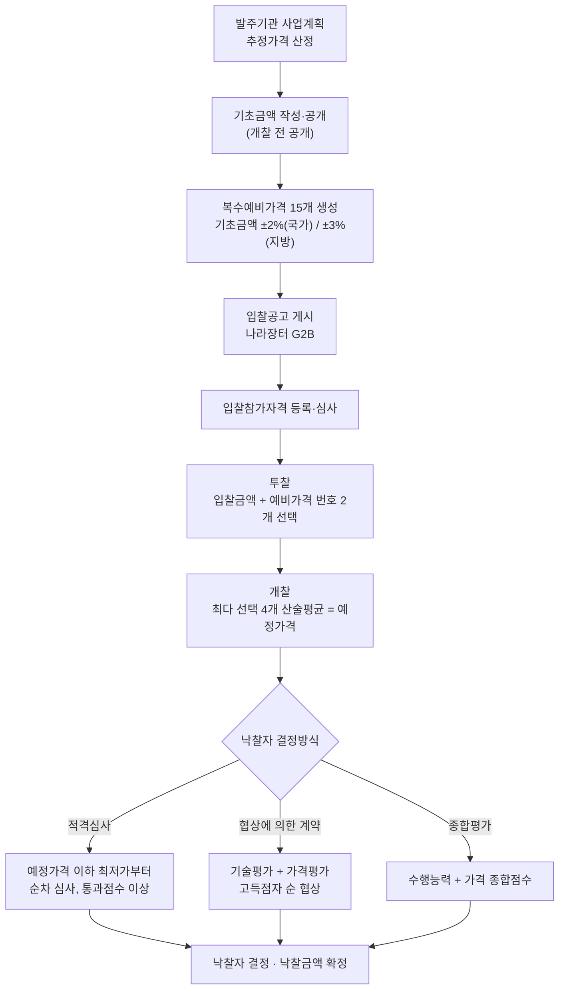
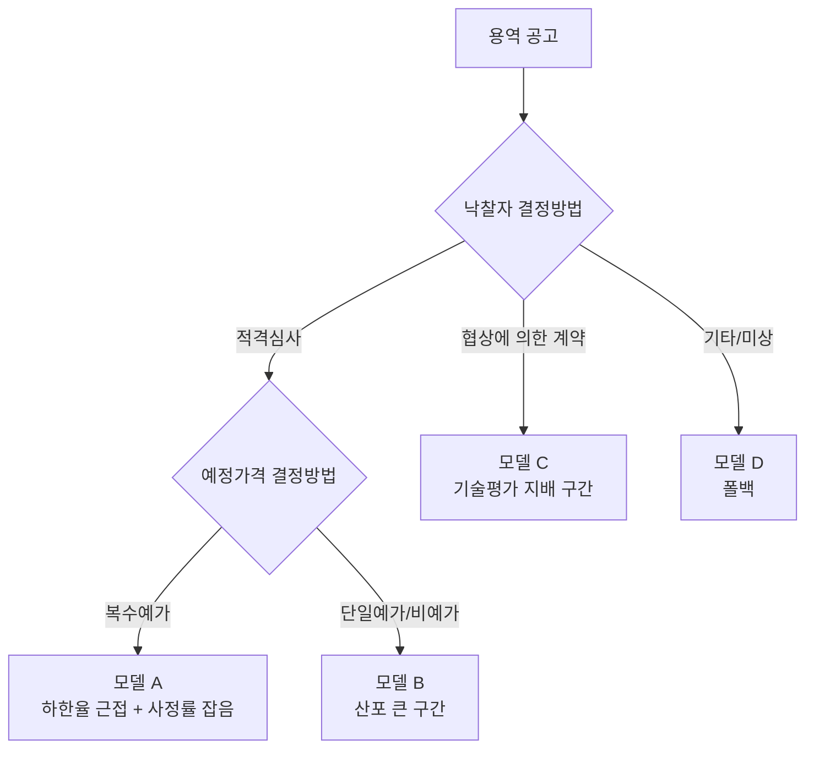

# G2B 전자입찰 제도 분석과 용역 낙찰가 산정 구조 설계서

> **작성일**: 2026-08-03
> **버전**: v1.0.0
> **상태**: 제도 조사 완료, 데이터 재검증 대기
> **대상**: 용역(Servc) 낙찰률 예측 모델
> **연계 문서**: [`docs/design/servc_prediction_model_design.md`](servc_prediction_model_design.md)

---

## 1. 이 문서의 목적

기존 [`servc_prediction_model_design.md`](servc_prediction_model_design.md) v2.0.0 은 **데이터에서 역추정한 통계**를 근거로 작성되었습니다. 낙찰하한율이 강한 신호라는 것은 실측으로 확인했지만, **그 값이 어떤 제도에서 어떤 산식으로 나오는지**는 부분적으로만 대조했습니다.

본 문서는 조달청·기획재정부·행정안전부의 공식 근거를 기준으로 전자입찰 제도 전반을 재구성하고, 다음 세 가지를 확정합니다.

| 확정 사항 | 내용 |
| --- | --- |
| **낙찰하한율의 생성 원리** | 임의 상수가 아니라 적격심사 배점 구조에서 유도되는 결정론적 값임을 산식으로 증명 |
| **제도 변경 시점(2026-05-26)** | 낙찰하한율 2%p 일괄 인상. 학습 데이터와 서비스 시점의 분포가 다름 |
| **예측 가능 구간의 경계** | 낙찰방식별로 예측 가능성이 근본적으로 다름. 단일 모델로 덮을 수 없음 |

세 번째 항목이 특히 중요합니다. 지금까지 용역 930,388행을 단일 타깃으로 다뤘으나, 제도상 **적격심사·협상에 의한 계약·종합평가는 낙찰률의 결정 메커니즘 자체가 다릅니다.**

---

## 2. 전자입찰 전체 흐름

### 2.1 절차 개관



### 2.2 예측 시점의 정보 경계

모델이 **공고 시점**에 사용할 수 있는 정보는 위 흐름에서 D 단계까지입니다.

| 단계 | 정보 | 공고 시점 가용 |
| --- | --- | --- |
| A | 추정가격 (`presmptPrce`) | 가용 |
| B | 기초금액 | 대체로 가용 (개찰 전 공개가 원칙) |
| C | 복수예비가격 15개 | **비공개** |
| D | 낙찰하한율 (`sucsfbidLwltRate`), 예가결정방법, 낙찰방법 | 가용 |
| F | 참가업체 수, 투찰 분포 | **불가** |
| G | 예정가격 | **불가 (개찰 시 확정)** |

`servc_prediction_model_design.md` 4.9 절이 제기한 위험이 여기서 확정됩니다. **복수예가 건에서 `presmpt_prce` 가 예정가격을 의미한다면 그 특징은 서비스에서 쓸 수 없습니다.** 필드명(`presmptPrce` = 추정가격)상으로는 A 단계 값이지만, 수집 시점이 개찰 이후라 갱신된 값일 가능성을 배제할 수 없습니다. 6.4 절의 검증 항목으로 둡니다.

---

## 3. 가격 개념의 층위

용역 입찰에서 금액은 다섯 층으로 나뉘며, 서로 다른 개념입니다. 데이터 컬럼과 혼동하면 특징 설계가 무너집니다.

| 개념 | 정의 | 부가세 | 관계 |
| --- | --- | --- | --- |
| **예산금액** | 발주기관이 확보한 예산 | 포함 | 추정가격 x 1.1 (통상) |
| **추정가격** | 부가세를 제외한 발주 예상 금액. 각종 기준금액(고시금액 등) 판단의 기준 | 제외 | 제도 적용 구간을 가르는 값 |
| **기초금액** | 계약담당자가 조사·조정한 실제 기준가격. 복수예비가격의 기준 | 포함 | 예정가격의 중심값 |
| **예비가격** | 기초금액 ±2%(국가) 또는 ±3%(지방) 범위의 15개 난수 | 포함 | 비공개 |
| **예정가격** | 개찰 시 최다 선택 4개 예비가격의 산술평균 | 포함 | 낙찰 판정의 분모 |

`servc_prediction_model_design.md` 4.8 절이 관찰한 "예정가격 / 예산금액 중앙값 0.9091 = 1/1.1" 은 위 표의 첫 두 행 관계이며, 사정률이 아니라 **부가세 관계**라는 결론이 제도적으로 확인됩니다.

### 3.1 사정률

사정률 = 예정가격 / 기초금액 이며, 구조상 다음 범위에 갇힙니다.

| 적용 법령 | 예비가격 범위 | 사정률 이론 범위 |
| --- | --- | --- |
| 국가계약법 | 기초금액 ±2% | 0.98 ~ 1.02 |
| 지방계약법 | 기초금액 ±3% | 0.97 ~ 1.03 |

4개 평균이므로 실제 분포는 이론 범위보다 좁고 중심에 몰립니다. **개찰 당일 입찰자들의 번호 선택으로 결정되므로 공고 시점에는 원리적으로 알 수 없습니다.** 예측 대상의 일부이지 입력이 아니라는 기존 판단이 유지됩니다.

### 3.2 고시금액

WTO 정부조달협정에 따른 국제입찰 대상 기준금액이며, 적격심사 배점 구간을 가르는 핵심 임계값입니다.

| 기간 | 중앙행정기관 물품·용역 고시금액 |
| --- | --- |
| ~2024 | 2.2억원 |
| 2025~2026 | **2.3억원** |

**임계값이 2025년에 이동했습니다.** 추정가격 2.2억~2.3억 구간 건은 공고 연도에 따라 적용 배점표가 달라집니다. 특징에 고시금액 대비 비율을 넣을 때 연도별 기준값을 써야 합니다.

---

## 4. 예정가격 결정방법

`prearngPrceDcsnMthdNm` 필드의 세 값은 각각 다른 제도입니다.

| 방법 | 절차 | 예정가격의 성질 |
| --- | --- | --- |
| **복수예가** | 15개 예비가격 생성 → 투찰 시 각 입찰자가 2개 선택 → 최다 선택 4개 산술평균 | 확률변수. 개찰 시 확정 |
| **단일예가** | 계약담당자가 예정가격을 직접 작성·봉인 | 상수. 공고 시점에 이미 결정(비공개) |
| **비예가** | 예정가격을 작성하지 않음 | 없음. 입찰금액 자체로 판정 |

복수예가에서 예정가격이 확률변수라는 점이 예측 구조를 규정합니다.

```
낙찰률 = 낙찰금액 / 추정가격
       = (예정가격 x 투찰률) / 추정가격
       = 사정률 x (기초금액 / 추정가격) x 투찰률
```

세 항 중 **사정률은 예측 불가능한 잡음**이고, **투찰률은 낙찰하한율에 강하게 고정**되며, **기초금액/추정가격 비율은 발주기관 특성**입니다. `servc_prediction_model_design.md` 4.7 절이 실측한 "복수예가에서 프리미엄 중앙값 0.161%p" 는 투찰률 항이 하한율에 붙어 있다는 뜻이고, 남은 산포 대부분은 사정률 항입니다.

**따라서 복수예가 구간의 잔차 하한은 사정률 분산으로 정해집니다.** 모델을 아무리 개선해도 이 아래로는 내려가지 않습니다. 6.2 절에서 이 하한을 정량화하는 실험을 정의합니다.

---

## 5. 낙찰자 결정방식과 낙찰하한율

### 5.1 적격심사의 일반 산식

적격심사는 **예정가격 이하 최저가 입찰자부터 순차로 심사**하여 종합평점이 통과점수 이상인 첫 번째 입찰자를 낙찰자로 결정합니다.

```
종합평점 = 수행능력 평점(N) + 입찰가격 평점(P)
입찰가격 평점 P = B - k x |R - x| x 100
```

| 기호 | 의미 |
| --- | --- |
| `B` | 입찰가격 배점한도 |
| `k` | 감점 계수 |
| `R` | 기준 투찰률 (개정 전 0.88, **개정 후 0.90**) |
| `x` | 투찰률 = 입찰금액 / 예정가격 |
| `N_max` | 수행능력 배점한도 (만점 취득 가정) |
| `T` | 적격 통과점수 |

수행능력 만점을 가정하면 낙찰 가능한 최저 투찰률은 다음과 같이 유도됩니다.

```
N_max + B - k x (R - x) x 100 >= T
x >= R - (B - T + N_max) / (100k)
```

즉 **낙찰하한율은 배점표에서 결정론적으로 계산되는 값**입니다.

### 5.2 유도 결과 검증 (기술용역, 2026-05-26 개정 후)

| 추정가격 구간 | N_max | B | k | T | 유도값 | 공시 하한율 |
| --- | ---: | ---: | ---: | ---: | ---: | ---: |
| 10억원 이상 | 70 | 30 | 1 | 92 | 82.000 | **81.995** |
| 5억~10억원 | 50 | 50 | 2 | 95 | 87.500 | **87.495** |
| 고시금액~5억원 | 30 | 70 | 4 | 95 | 88.750 | **88.745** |
| 고시금액 미만 | 10 | 90 | 20 | 95 | 89.750 | **89.745** |

**4개 구간 전부 일치합니다.** 공시값이 유도값보다 0.005%p 높은 것은 평점 계산 시 소수점 반올림 처리에 따른 안전여유입니다.

### 5.3 데이터 최빈값과의 대조

`servc_prediction_model_design.md` 4.6 절의 실측 최빈 하한율을 **개정 전(기준 0.88)** 기술용역 값과 대조합니다.

| 추정가격 구간 | 데이터 최빈값 | 개정 전 이론값 | 일치 |
| --- | ---: | ---: | :---: |
| 2억 미만 | 87.745 | 89.745 - 2 = 87.745 | 일치 |
| 2억~10억 | 86.745 | 88.745 - 2 = 86.745 | 일치 |
| 2억~10억 (2위) | 85.495 | 87.495 - 2 = 85.495 | 일치 |
| 10억~50억 | 79.995 | 81.995 - 2 = 79.995 | 일치 |

**4개 구간 전부 일치합니다.** `sucsfbidLwltRate` 가 제도적 실제값이라는 기존 판단이 산식 수준에서 확증되었습니다. 동시에 **보유 데이터가 개정 전 제도로 생성되었다는 사실**도 확정됩니다.

미확인 값이 남습니다.

| 값 | 건수 | 추정 | 상태 |
| --- | ---: | --- | --- |
| 88.000 | 171,390 | 지방계약 또는 일반용역 시설분야(87.995) 반올림 표기 | **미확인** |
| 90.000 | 22,867 | 수요기관 자체기준 또는 계약이행능력심사 | **미확인** |
| 82.995 | 666 | 미상 | **미확인** |

6.4 절의 검증 항목으로 둡니다. 171,390건은 무시할 수 없는 규모입니다.

### 5.4 일반용역 분야별 낙찰하한율

일반용역은 구간이 아니라 **용역 종류별 별표**로 하한율이 갈립니다.

| 분야 | 통과점수 | 개정 전 | 개정 후 (2026-05-26~) |
| --- | ---: | ---: | ---: |
| 시설분야용역 (청소·경비·시설관리) | 85 | 87.995 | **89.995** |
| 소프트웨어용역 (중기간 경쟁제품 해당) | 88 | 85.995 | **87.995** |
| 여객육상운송용역 | 88 | 85.995 | **87.995** |
| 학술연구·SW(비중기간)·폐기물·수리점검 (고시금액 미만) | 85 | 84.245 | **86.245** |
| 학술연구·SW(비중기간)·폐기물·수리점검 (고시금액 이상) | 85 | 80.495 | **82.495** |
| 보험용역 | 85 | 45.994 | **47.994** |

**동일한 추정가격이라도 용역 종류에 따라 하한율이 40%p 넘게 벌어집니다.** 보험용역(47.994)과 시설분야용역(89.995)이 같은 모델의 같은 구간에 들어가 있습니다.

현재 특징 집합에는 용역 세부 분야를 식별하는 변수가 없습니다. `sucsfbidLwltRate` 가 그 정보를 간접적으로 담고 있어 모델이 작동해 온 것으로 보이며, 이는 **하한율 결측 23% 구간에서 성능이 무너지는 이유**를 설명합니다. 8.2 절에서 대응합니다.

### 5.5 적격심사가 아닌 방식

| 방식 | 낙찰률 결정 구조 | 하한율 개념 |
| --- | --- | --- |
| **협상에 의한 계약** | 기술능력 70~90 + 입찰가격 10~30 종합. 고득점자 순 협상 | **없음.** 가격만으로 결정되지 않음 |
| **종합평가/종합심사** | 수행능력 + 가격 + 사회적 책임 종합 | 없음 |
| **2단계 경쟁 (규격·가격 분리)** | 규격 적격자 중 최저가 | 적격심사 미적용 |
| **희망수량 경쟁** | 수량 배분 | 별도 |
| **최저가** | 예정가격 이하 최저가 | 없음 |

협상에 의한 계약의 가격평점 산식입니다.

```
평점 = B x (최저입찰가격 / 추정가격의 80% 상당가격)
       + 2 x (추정가격의 80% 상당가격 - 당해입찰가격)
           / (추정가격의 80% 상당가격 - 추정가격의 60% 상당가격)
```

당해입찰가격이 추정가격의 60% 미만이면 60% 로 절사합니다. **즉 협상 계약의 실질 가격 하한은 추정가격의 60%** 이며, 적격심사의 88~90% 와 전혀 다른 영역입니다. 기술평가 비중이 70~90% 이므로 가격 경쟁 유인 자체가 약하고, 낙찰률은 넓게 퍼집니다.

**핵심 판단입니다. 적격심사와 협상 계약을 한 모델·한 지표로 다루는 것은 잘못입니다.** 8.1 절에서 분리 설계를 확정합니다.

### 5.6 국가계약과 지방계약의 차이

| 항목 | 국가계약법 | 지방계약법 |
| --- | --- | --- |
| 예비가격 범위 | 기초금액 ±2% | 기초금액 ±3% |
| 근거 기준 | 조달청 적격심사 세부기준 | 지방자치단체 입찰시 낙찰자 결정기준 (행안부 예규) |
| 하한율 인상 시기 | 공사 2026-01-30, 물품·용역 2026-05-26 | 공사 2025-07-01 |

**지방계약의 사정률 분산이 국가계약의 1.5배입니다.** 복수예가 구간에서 예측 잔차 하한이 발주기관 소속에 따라 다르다는 뜻이며, 이는 `dminstt_nm`(수요기관)이 강한 특징이었던 이유의 일부를 설명합니다. 다만 데이터에 적용 법령 구분 필드가 없어 기관명으로 대리해야 합니다.

---

## 6. 2026-05-26 제도 변경의 영향

### 6.1 변경 내용

| 분야 | 개정 전 | 개정 후 | 시행일 |
| --- | --- | --- | --- |
| 시설공사 (국가) | - | +2%p | 2026-01-30 |
| 시설공사 (지방) | - | +2%p | 2025-07-01 |
| **기술용역 (10억 미만)** | 79.995~87.745 | **81.995~89.745** | **2026-05-26** |
| **물품·일반용역** | 80.495~87.995 | **82.495~89.995** | **2026-05-26** |

근거는 조달청공고 제2026-260호이며, 「2026년 경제성장전략」의 적정대가 지급 방침에 따른 후속 조치입니다. 기술용역은 2003년 이후 23년 만, 물품·일반용역은 2017년 이후 9년 만의 조정입니다. **2026년 5월 26일 이후 최초 입찰공고분부터** 적용됩니다.

### 6.2 모델에 대한 영향

이것은 통상적인 데이터 드리프트가 아니라 **결정론적 레짐 전환**입니다.

| 영향 | 내용 |
| --- | --- |
| 특징 분포 | `sucsfbidLwltRate` 가 시행일 기준으로 +2%p 계단 이동 |
| 타깃 분포 | 낙찰률도 동반 상승. 하한율 절단 제약이 새 값으로 이동 |
| 학습 데이터 | 보유 데이터 절대다수가 **개정 전** 레짐 |
| 시간순 분할 | 홀드아웃이 시행일을 걸치면 성능 지표가 왜곡됨 |

대응입니다.

| 조치 | 내용 | 우선순위 |
| --- | --- | --- |
| **레짐 플래그 특징** | `is_post_20260526 = 공고일 >= 2026-05-26` 이진 특징 추가 | 필수 |
| **하한율 정규화** | `lwlt_rate_norm = 하한율 - 레짐 기준치(88 또는 90)` 파생. 레짐 간 의미 정렬 | 필수 |
| **절단 기준 갱신** | 후처리 절단은 각 행의 실제 하한율 사용. 상수 금지 | 필수 |
| **시간순 분할 경계** | 홀드아웃을 2026-05-26 이후로 잡아 신 레짐 성능을 직접 측정 | 필수 |
| **PSI 임계 예외** | 시행일 전후 PSI 급등은 정상. 알람 억제 구간 지정 | 필수 |
| **표본 가중** | 신 레짐 표본에 가중치 부여 검토 | 조건부 |

**표본 가중은 신 레짐 표본이 충분히 쌓인 뒤 판단합니다.** 2026-05-26 시행, 현재 2026-08-03 이므로 약 10주분입니다. 표본 수를 먼저 세고 결정합니다.

### 6.3 재학습 주기에 대한 함의

제도 개정이 모델 성능을 직접 무너뜨린다는 것이 확인되었으므로, **재학습 트리거에 제도 변경 감지를 넣습니다.**

| 감지 신호 | 임계 | 조치 |
| --- | --- | --- |
| `sucsfbidLwltRate` 최빈값 집합 변화 | 신규 최빈값이 상위 5위 내 진입 | 즉시 재학습 후보 |
| 구간별 하한율 중앙값 이동 | 0.5%p 이상 | 조사 후 재학습 |
| 하한율 결측률 변화 | 5%p 이상 | 수집 파이프라인 점검 |

기존 PSI 모니터링은 분포 변화를 사후에 알려주지만, 위 신호는 **제도 값이라 즉시 확정적**입니다. 더 빠르고 오탐이 없습니다.

### 6.4 데이터 재검증 항목

Docker 환경이 정지 상태라 본 문서 작성 시점에는 재질의하지 못했습니다. 아래를 순서대로 확인합니다.

| 번호 | 확인 사항 | 방법 |
| --- | --- | --- |
| V1 | 2026-05-26 이후 용역 표본 수와 하한율 분포 | 공고일 기준 집계 |
| V2 | 하한율 88.000 / 90.000 / 82.995 의 정체 | 해당 건의 수요기관·낙찰방법·용역명 표본 조사 |
| V3 | 공고 시점 `presmptPrce` 존재 여부 | 개찰 전 공고 수집 후 필드 확인 (3.x 미해결 위험) |
| V4 | `bidwinnrDcsnMthdNm`(낙찰방법) 분포 | 적격심사 / 협상 / 기타 비율 |
| V5 | 협상 계약 건의 낙찰률 분포 | 적격심사 건과 분산 비교 |
| V6 | 기초금액 필드 확보 가능성 | `raw_data` 내 기초금액 관련 키 전수 조사 |

**V3 와 V4 는 구현 착수 전 필수입니다.** V4 결과에 따라 8.1 절의 분리 설계 규모가 정해집니다.

---

## 7. 데이터 필드와 제도 개념 매핑

| G2B 필드 | 제도 개념 | 현재 상태 | 조치 |
| --- | --- | --- | --- |
| `presmptPrce` | 추정가격 | DB 컬럼 `presmpt_prce` | V3 검증 필요 |
| `sucsfbidLwltRate` | 낙찰하한율 | `raw_data` JSON 내부 | **컬럼 승격 필요** |
| `prearngPrceDcsnMthdNm` | 예정가격 결정방법 | `raw_data` JSON 내부 | **컬럼 승격 필요** |
| `bidwinnrDcsnMthdNm` | 낙찰자 결정방법 | 미추출 | **추출 필요 (V4)** |
| `cntrctCnclsMthdNm` | 계약체결방법 | 컬럼 존재 | 활용 중 |
| `sucsfbidMthdNm` | 낙찰방법명 | 미확인 | 조사 필요 |
| `bsisAmount` 계열 | 기초금액 | 미확인 | V6 |
| `asignBdgtAmt` / `bdgtAmt` | 예산금액 | `raw_data` 추출 로직 존재 | 유지 |

`raw_data` JSON 조회는 인덱스를 타지 않아 학습 데이터셋 생성이 느립니다. **하한율과 예가결정방법은 정식 컬럼으로 승격하고 인덱스를 답니다.** 데이터 무손실 원칙상 기존 컬럼은 건드리지 않고 추가만 합니다.

---

## 8. 예측 모델 설계 반영

### 8.1 낙찰방식별 분리

단일 모델을 낙찰방식별 분리 모델로 전환합니다.



| 모델 | 예상 특성 | 성능 목표 |
| --- | --- | --- |
| **A. 적격심사 x 복수예가** | 표본 최다. 프리미엄 중앙값 0.161%p | 잔차 하한이 사정률 분산. RMSE 목표를 이 하한 대비로 설정 |
| **B. 적격심사 x 단일예가** | 프리미엄 표준편차 7.38 | 별도 보고. A 의 지표에 섞지 않음 |
| **C. 협상에 의한 계약** | 가격 하한 60%, 기술평가 지배 | **점 추정이 부적절할 수 있음.** 구간 추정 검토 |
| **D. 폴백** | 하한율 결측 23% 포함 | 보수적 예측 + 신뢰도 하향 표시 |

**모델 C 는 별도 판단이 필요합니다.** 가격이 종합점수의 10~30% 만 차지하므로 공고 시점 정보로 낙찰률을 점 추정하는 것 자체가 무리일 수 있습니다. V5 로 분산을 확인한 뒤, 점 추정 대신 **구간 추정 + 신뢰도 표시**로 전환할지 결정합니다.

### 8.2 특징 추가

제도 분석에서 도출된 신규 특징입니다.

| 특징 | 정의 | 근거 |
| --- | --- | --- |
| `is_post_20260526` | 공고일 >= 2026-05-26 | 6.2. 레짐 전환 |
| `lwlt_rate_norm` | 하한율 - 레짐 기준치 | 6.2. 레짐 간 의미 정렬 |
| `lwlt_rate_missing` | 하한율 == 0 또는 결측 | 결측 23% 를 모델이 인지 |
| `is_over_notice_amt` | 추정가격 >= 연도별 고시금액 | 3.2. 배점표 임계값 |
| `notice_amt_ratio` | 추정가격 / 연도별 고시금액 | 3.2 |
| `is_local_govt` | 수요기관이 지방자치단체 | 5.6. 사정률 분산 1.5배 차이 |
| `svc_category` | 용역 세부 분야 (시설/SW/학술/폐기물/운송/보험) | 5.4. 하한율이 40%p 갈림 |
| `prearng_method` | 예가결정방법 | 기존 유지 |
| `bidwinnr_method` | 낙찰자 결정방법 | 8.1. 분리 기준이자 특징 |

`svc_category` 는 데이터에 직접 없습니다. **용역명(`bid_ntce_nm`) 텍스트 + 업종코드 + 하한율 역매핑**으로 도출해야 하며, 하한율이 결측인 건에서 특히 가치가 큽니다. 도출 규칙의 정확도를 하한율 보유 건으로 교차 검증한 뒤 채택합니다.

### 8.3 후처리 제약

| 제약 | 규칙 |
| --- | --- |
| 하한 절단 | 예측 낙찰률 < 해당 건 하한율이면 하한율로 절단 |
| 하한율 결측 시 | 절단하지 않음. 대신 신뢰도 하향 |
| 상한 | 예정가격 초과 낙찰 불가. 낙찰률 상한은 100 x (기초금액/추정가격) x 사정률 상한 |
| 협상 계약 | 하한 절단 미적용 (제도상 하한율 개념 없음) |

**협상 계약에 적격심사 하한율을 적용하지 않도록 방식별로 분기합니다.** 현행 설계는 이 분기가 없어, 협상 건에 잘못된 하한을 씌울 위험이 있습니다.

### 8.4 성능 보고 분해

전체 평균 지표는 97% 를 차지하는 복수예가에 가려 나머지가 보이지 않습니다. 다음 축으로 반드시 분해 보고합니다.

| 축 | 구간 |
| --- | --- |
| 낙찰방식 | 적격심사 / 협상 / 기타 |
| 예가결정방법 | 복수예가 / 단일예가 / 비예가 |
| 제도 레짐 | 2026-05-26 이전 / 이후 |
| 추정가격 | 고시금액 미만 / 고시금액~5억 / 5억~10억 / 10억 이상 |
| 하한율 가용성 | 보유 / 결측 |

---

## 9. 이행 계획

| 단계 | 작업 | 선행 조건 |
| --- | --- | --- |
| 0 | Docker 기동, V1~V6 데이터 재검증 | - |
| 1 | `sucsfbidLwltRate`, `prearngPrceDcsnMthdNm`, `bidwinnrDcsnMthdNm` 컬럼 승격 + 백필 | 0 |
| 2 | 레짐 특징·고시금액 특징을 `src/ml/features.py` 단일 함수에 추가 | 1 |
| 3 | `svc_category` 도출 규칙 작성 및 교차 검증 | 1 |
| 4 | 낙찰방식별 분리 모델 학습, 8.4 축으로 분해 평가 | 2, 3 |
| 5 | 후처리 제약 분기 구현 | 4 |
| 6 | 제도 변경 감지 모니터링을 재학습 트리거에 연결 | 4 |

**0 단계 없이 1 단계로 넘어가지 않습니다.** V3 결과에 따라 특징 설계 전체가 바뀝니다.

---

## 10. 미확정 사항

정직하게 남겨 둡니다.

| 항목 | 상태 |
| --- | --- |
| 공고 시점 `presmptPrce` 의 의미 | **미확인.** 설계 전체의 전제 (V3) |
| 하한율 88.000 (171,390건) 의 근거 | **미확인** (V2) |
| 지방계약 용역 적격심사 하한율 개정 여부·시행일 | **미확인.** 공사만 2025-07-01 확인됨 |
| 협상 계약 건의 낙찰률 예측 가능성 | **미확인** (V5) |
| 기초금액 확보 가능성 | **미확인** (V6) |
| 신 레짐 표본 규모 | **미확인** (V1) |
| 사정률 분산이 정하는 잔차 하한의 실제 크기 | 미측정. 6.2 이후 실험 필요 |

본 문서의 제도 분석은 공식 근거로 뒷받침되지만, **데이터 재검증 전에는 설계 확정이 아닙니다.**

---

## 11. 요약

| 발견 | 함의 |
| --- | --- |
| 낙찰하한율은 적격심사 배점표에서 결정론적으로 유도됨 (8개 구간 전부 일치) | `sucsfbidLwltRate` 신뢰 확정. 결측 시 배점표로 역산 가능 |
| **2026-05-26 낙찰하한율 2%p 일괄 인상** | 학습 데이터 대다수가 구 레짐. 레짐 특징·정규화·분할 경계 조정 필수 |
| 일반용역은 분야별로 하한율이 47.994~89.995 로 갈림 | 용역 세부 분야 특징이 없으면 하한율 결측 구간에서 무너짐 |
| 협상에 의한 계약은 가격 하한 60%, 기술평가 지배 | 적격심사와 같은 모델·같은 하한 절단을 쓰면 안 됨 |
| 복수예가의 잔차 하한 = 사정률 분산 | 모델 개선의 이론적 한계. 목표치를 이 하한 대비로 설정 |
| 고시금액이 2025년에 2.2억 → 2.3억으로 이동 | 임계값 특징은 연도별 기준값 사용 |
| 지방계약 예비가격 범위가 ±3% (국가 ±2%) | 발주기관 소속에 따라 예측 난이도가 다름 |

---

## 12. 참고 자료

**법령·행정규칙**

- [(계약예규) 예정가격작성기준 — 국가법령정보센터](https://www.law.go.kr/admRulLsInfoP.do?admRulSeq=2100000196211)
- [(계약예규) 협상에 의한 계약체결기준 — 국가법령정보센터](https://www.law.go.kr/%ED%96%89%EC%A0%95%EA%B7%9C%EC%B9%99/(%EA%B3%84%EC%95%BD%EC%98%88%EA%B7%9C)%ED%98%91%EC%83%81%EC%97%90%EC%9D%98%ED%95%9C%EA%B3%84%EC%95%BD%EC%B2%B4%EA%B2%B0%EA%B8%B0%EC%A4%80)
- [(계약예규) 용역입찰유의서 — 국가법령정보센터](https://www.law.go.kr/%ED%96%89%EC%A0%95%EA%B7%9C%EC%B9%99/(%EA%B3%84%EC%95%BD%EC%98%88%EA%B7%9C)%EC%9A%A9%EC%97%AD%EC%9E%85%EC%B0%B0%EC%9C%A0%EC%9D%98%EC%84%9C)
- [국가종합전자조달시스템 전자입찰특별유의서 — 국가법령정보센터](https://www.law.go.kr/admRulInfoP.do?admRulSeq=2100000215368)
- [조달청 일반용역 적격심사 세부기준 — 국가법령정보센터](https://www.law.go.kr/admRulLsInfoP.do?admRulSeq=2100000220190)
- [조달청 기술용역 적격심사 세부기준 — 국가법령정보센터](https://www.law.go.kr/LSW/admRulLsInfoP.do?admRulSeq=2100000099611)
- [지방자치단체 입찰시 낙찰자 결정기준 — 국가법령정보센터](https://www.law.go.kr/LSW/admRulInfoP.do?admRulSeq=2000000022527)

**조달청·기관 자료**

- [낙찰자 결정제도 — 조달청](https://pps.go.kr/kor/sub.do?key=00005)
- [PQ + 적격심사 — 조달청](https://www.pps.go.kr/kor/content.do?key=00729)
- [국가종합전자조달시스템 전자입찰특별유의서 (PDF) — 조달청](https://www.pps.go.kr/common/fileDown.do?key=200001160335&sn=2)
- [기초금액 VS 복수예비가격 VS 예정가격 — 조달연구원 웹진](https://ppta.or.kr/webzine/2021_01/g2.html)
- [「지방자치단체 입찰 및 계약집행기준」 개정 알림 — 행정안전부](https://www.mois.go.kr/frt/bbs/type001/commonSelectBoardArticle.do?bbsId=BBSMSTR_000000000016&nttId=117518)
- [「조달청 기술용역 적격심사 세부기준」 개정 — KDI 경제정보센터](https://eiec.kdi.re.kr/policy/materialView.do?num=268793)

**제도 변경 보도**

- [일반용역·물품 낙찰하한율 26일부터 오른다 — 조달경제신문](https://www.jodaleconomy.com/news/articleView.html?idxno=2479)
- [물품·용역 공공계약 낙찰하한율 2%p 인상 — 뉴데일리](https://biz.newdaily.co.kr/site/data/html/2026/03/20/2026032000201.html)
- [정부, 물품·용역 낙찰하한율 2%p 상향 — 아주경제](https://www.ajunews.com/view/20260320103858853)
- [공공계약 국제입찰 대상금액 변경고시 — 뉴시스](https://www.newsis.com/view/NISX20241224_0003008558)

**실무 정리**

- [용역 적격심사 평가기준 — 비드프로](https://bidpro.co.kr/jkdirsvc/jkview.asp)
- [용역 적격심사 제도 완벽 해설 (적용대상·심사기준·9개 별표)](https://04noti.com/service-contract-eligibility-review-criteria/)
- [복수예가 뜻과 작동 원리](https://blog.cliwant.com/boksu-yega-meaning-how-it-works/)
- [국가 공사계약자 적격심사 — 찾기쉬운 생활법령정보](https://easylaw.go.kr/CSP/CnpClsMain.laf?popMenu=ov&csmSeq=519&ccfNo=2&cciNo=5&cnpClsNo=2)
- [지방자치단체 용역계약 낙찰자 결정방법 — 찾기쉬운 생활법령정보](https://easylaw.go.kr/CSP/CnpClsMainBtr.laf?popMenu=ov&csmSeq=1302&ccfNo=3&cciNo=2&cnpClsNo=1)
