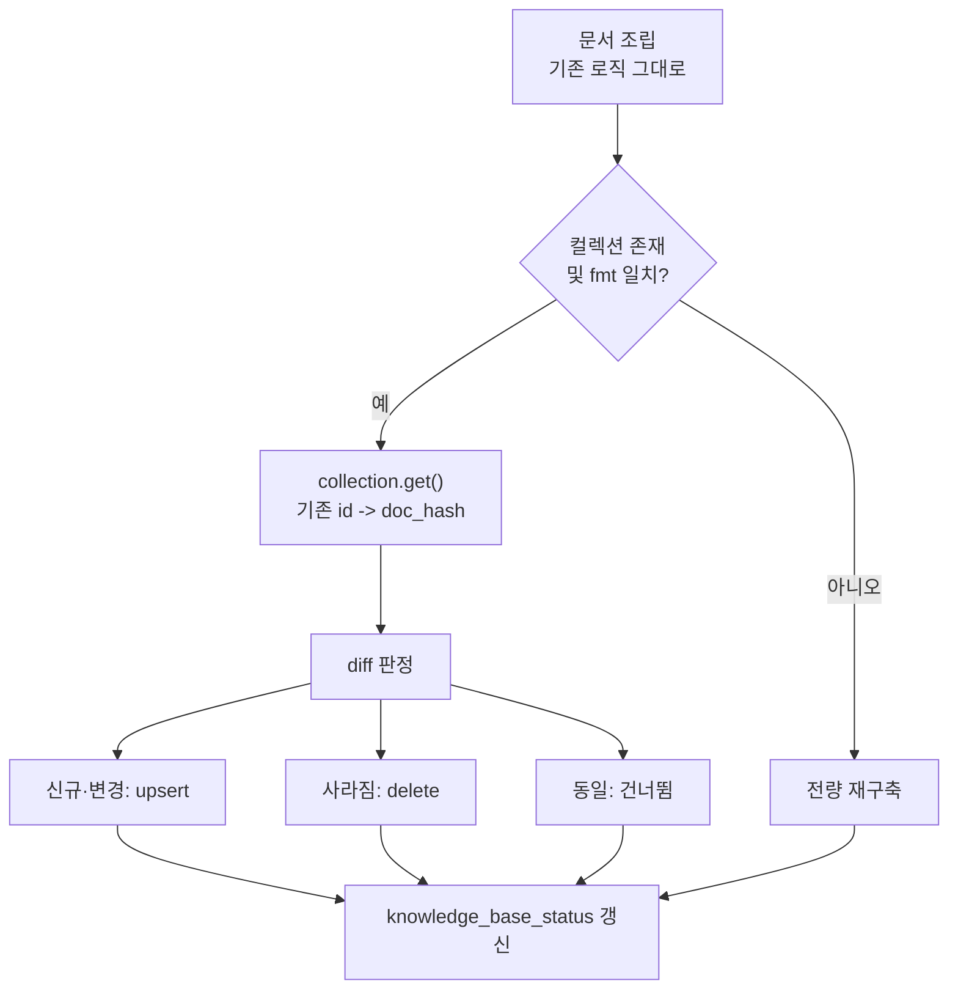

# 지식베이스 증분 색인 설계와 실측

> **작성일**: 2026-08-06
> **대상**: `src/app/services/kb_builder.py`
> **상태**: 구현·실측 완료

---

## 1. 배경

`rebuild_knowledge_base()` 는 실행할 때마다 컬렉션을 통째로 지우고 다시 만들었습니다.

```python
chroma_client.delete_collection(COLLECTION_NAME)
collection = chroma_client.create_collection(name=COLLECTION_NAME)
```

| 문제 | 결과 |
| --- | --- |
| 변경분이 0건이어도 전량 재임베딩 | 문서 1,000건 기준 약 29초를 매번 소모 |
| 재구축 중 컬렉션이 빔 | 그 사이 챗봇 질의가 근거 없이 답변 |
| 실패 시 롤백 없음 | 삭제 후 색인이 실패하면 KB 가 빈 채로 남음 |

두 번째와 세 번째가 특히 위험합니다. 2026-08-01 부터 5일간 이어진 ChromaDB 장애도 검색 실패가 조용히 넘어가 아무도 몰랐던 사례였습니다.

---

## 2. 변경 판정 기준

**DB 시각이 아니라 문서 본문의 SHA256 을 씁니다.**

`BidAnnouncement.collected_at` 은 `default=utcnow` 로 INSERT 시각입니다. 재수집으로 값이 갱신돼도 시각이 그대로일 수 있어 변경 감지 기준이 될 수 없습니다. 실제로 2015년 공고 행이 2026-03~08 에 재수집됐음이 별도 진단에서 확인됐습니다.

본문 해시는 어떤 경로로 값이 바뀌었든 정확히 잡아냅니다.

---

## 3. 상태 저장 위치

| 후보 | 판단 |
| --- | --- |
| 새 DB 테이블 | 마이그레이션이 필요하고, 컬렉션과 DB 가 어긋날 수 있습니다 |
| **ChromaDB 메타데이터** | **채택.** 색인과 해시가 원자적으로 함께 움직입니다 |

기존 메타데이터에 두 필드를 더했습니다.

| 필드 | 용도 |
| --- | --- |
| `doc_hash` | 본문 SHA256. 변경 판정 기준 |
| `fmt` | 문서 포맷 버전(`DOC_FORMAT_VERSION`) |

`fmt` 이 필요한 이유는 `_build_announcement_document()` 의 출력 형식을 바꾸면 모든 해시가 달라지기 때문입니다. 포맷을 고친 사람이 전량 재색인을 잊으면 낡은 형식의 문서가 조용히 남습니다. 상수를 올리면 자동으로 전량 갱신됩니다.

---

## 4. 처리 흐름



컬렉션을 먼저 지우지 않습니다. `upsert` 는 제자리 갱신이라 재색인 중에도 KB 가 계속 답합니다.

삭제는 재색인 **뒤에** 수행합니다. 먼저 지우면 색인이 실패했을 때 문서만 사라집니다.

---

## 5. 전량 재구축으로 떨어지는 조건

증분이 항상 옳지는 않습니다. 다음이면 안전하게 전량으로 갑니다.

| 조건 | 이유 |
| --- | --- |
| 컬렉션 없음 또는 비어 있음 | 최초 구축 |
| `doc_hash` 없는 문서 존재 | 기존 운영 색인 1,000건이 해당. 첫 실행이 자동으로 전량 |
| `fmt` 불일치 | 본문 포맷이 바뀜 |
| `full=True` | 운영자 강제 |
| 기존 색인 조회 실패 | 비교 기준이 서지 않음 |

임베딩 모델을 바꾸는 경우에도 전량 재구축이 필요합니다. 벡터 공간이 달라져 섞으면 검색이 망가집니다. 다만 기존 컬렉션 정합성 때문에 모델 교체는 하지 않는 것이 원칙입니다.

---

## 6. 실측

문서 1,000건, 평균 183자, ChromaDB 기본 임베딩(CPU) 기준입니다.

| 시나리오 | 소요 | 단축 |
| --- | ---: | ---: |
| 전량 재구축 | 28.72초 | 기준 |
| 증분 - 변경 0건 | 0.01초 | 100.0% |
| 증분 - 변경 10건 | 0.38초 | 98.7% |
| 증분 - 변경 100건 | 2.65초 | 90.8% |

**측정 순서 편향을 배제했습니다.** 같은 데이터를 연달아 처리하면 앞 실행이 캐시를 데워 뒤가 유리해지므로, 순서를 뒤집어 증분을 먼저 실행하고 전량을 나중에 측정했습니다.

| 순서 | 증분 | 전량 |
| --- | ---: | ---: |
| 전량 먼저 | 0.01초 | 28.72초 |
| 증분 먼저 | 0.01초 | 27.46초 |

두 방향 모두 같은 결론입니다.

야간 수집 후 재색인은 대개 변경분이 전체의 1% 미만이므로, 가장 흔한 경로가 **29초에서 0.4초 이하**로 떨어집니다.

기준 처리량은 초당 약 21.5건입니다. 문서가 10만 건 규모로 커지면 전량 재구축은 약 78분이 되지만 증분은 변경분에만 비례합니다.

---

## 7. 검증

| 항목 | 결과 |
| --- | --- |
| 신규 테스트 | `tests/test_kb_incremental_indexing.py` 10건 |
| 전량 테스트 | 736 passed / 2 skipped |
| G1 무손실 | `verify_migration.py` 4/4 (질의 프로브 포함) |

테스트가 고정하는 것입니다.

- 변경 없으면 임베딩 0건
- 변경된 1건만 재임베딩, 나머지는 유지
- DB 에서 사라진 문서는 컬렉션에서도 삭제
- `fmt` 을 올리면 전량 재색인
- 해시 없는 기존 색인은 전량으로 폴백
- **색인이 실패해도 기존 컬렉션이 살아 있음**

마지막 항목이 이번 변경의 안전성 핵심입니다.

---

## 8. 건드리지 않은 것

| 항목 | 이유 |
| --- | --- |
| DB 스키마 | 신규 테이블·마이그레이션 없음 |
| 임베딩 모델 | 기존 컬렉션 정합성 |
| 문서 본문 포맷 | 바꾸면 해시가 전부 달라집니다 |
| 질의 경로 | `vector_store.py`, `engine.py` 무변경 |
| 폴백 규칙 | 공고가 없을 때 낙찰 단독 색인 그대로 |

`source_bid_count` 는 이번에 임베딩한 수가 아니라 **컬렉션에 있어야 할 전체 문서 수**를 계속 기록합니다. 증분 실행에서 변경분만 기록하면 KB 가 줄어든 것처럼 보이기 때문입니다.

---

## 9. 되돌리기

컬렉션 구조와 문서 내용은 그대로이고 메타데이터 2개만 늘었습니다. 코드를 되돌리면 기존 전량 재구축이 그대로 동작하며, 추가된 메타데이터는 검색에 영향을 주지 않습니다.

---

## 10. 남은 과제

증분 색인은 **기존 문서 집합 안에서의 갱신 비용**을 없앤 것입니다. 색인 대상 자체를 늘리는 것은 별개 과제입니다.

현재 KB 문서는 DB 행에서 조립한 정형 레코드(평균 183자)이며 공고 원문(HWP/PDF)은 수집돼 있지 않습니다. 청킹·overlap·문서 간 링크를 논의하려면 원문 수집이 선행되어야 하고, 그 비용 판단이 먼저입니다.
