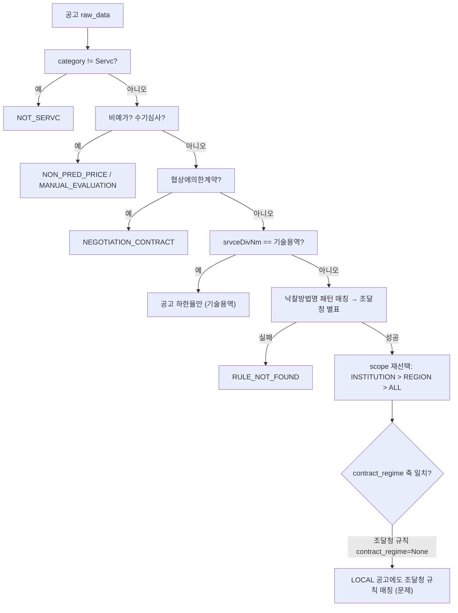
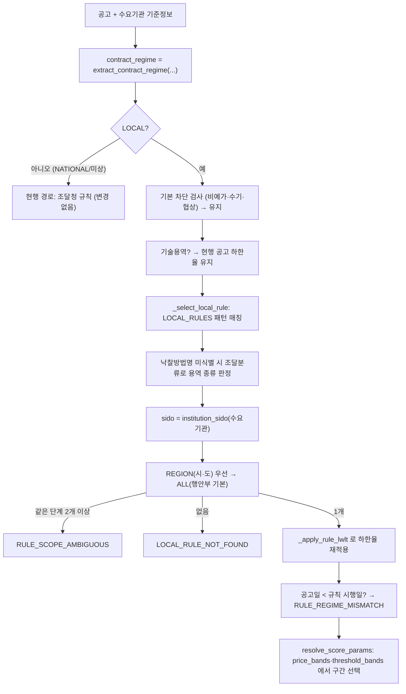

# 지방계약 정량평가 규칙 설계 (1단계: 행정안전부 예규·시도 별표 반영)

> **작성일**: 2026-10-05
> **작업**: Orca Task `task_81ce56bb110f` (builder, Run `run_03599ec1fd4a`, Dispatch `ctx_25aad90af5d9`)
> **정본 사양**: `.orca/capsules/task_local_rules_design/capsule.yaml` (`ORCA_TASK_CAPSULE_V2` 2.1.0)
> **기준 커밋**: `f8d5660e` (작업 브랜치 `kwanbum217/local-rules-design`, main 직접 커밋 없음)
> **목적**: 지방계약(LOCAL) 일반용역 적격심사 공고에 행정안전부 예규 제373호를 기본 규칙으로, 확인된 시·도 자체 별표를 지역 규칙으로 적용하고, 조달청 일반용역 별표를 국가계약에만 매칭시키는 1단계 구현 설계를 확정한다.
> **범위 경계**: 코드·설정·패키지를 변경하지 않았습니다. `src/` 와 `tests/` 는 읽기만 했습니다. `src/app/services/evaluation_rules.py` 에 계수를 입력하지 않았습니다. 커밋 산출물은 이 문서 한 편입니다.
> **원문 위치**: 시·도·행안부 원문 추출물은 `.orca/capsules/task_58ea8ddab6fb/external/` 등에 있으며 커밋하지 않습니다. 이 문서는 `.orca/` 를 마크다운 링크로 걸지 않고 인라인 코드로만 언급합니다.
> **판정 규칙**: 2026-09-30 수집 세션 3절의 10개 규칙을 그대로 준용합니다.
> **결론**: LOCAL 일반용역(2025-01-01 이후 14,473건) 중 현행 코드가 배점표를 확정해 계산하는 공고는 811건(5.6%)뿐이고, 4,236건이 배점표 미확정·미매칭으로 차단되며 9,426건은 수기심사로 차단됩니다. 시·도 9곳(46.9%)은 자체 별표가 확인됐고 2곳(20.4%)은 부분, 5곳(32.7%)은 미수집입니다. 이 문서는 7개 설계 질문에 권장안과 함께 답하고, 다음 빌더가 그대로 구현할 수 있도록 필드·함수·규칙 ID·시험 목록을 확정합니다.

---

## 0. 사용자 결정 확정 (2026-10-05, 구현 정본)

이 절이 1~11절보다 우선합니다. 1절 표의 권장안과 다른 결정은 아래대로 구현합니다.

| 항목 | 확정 | 1~11절 대비 변경 |
| --- | --- | --- |
| D1 규칙 표현 | 권장안대로 `PriceBand`·`ThresholdBand` 신규 필드 | 없음 |
| D2 규칙 선택 | 권장안대로 `contract_regime == "LOCAL"` 전용 분기, 조달청 규칙 배제 | 없음 |
| D3 지역 판정 | 권장안대로 수요기관 `toplvl_instt_cd`/`toplvl_instt_nm` | 없음 |
| D4 별표 선택 | 권장안대로 낙찰방법명 우선, 일반 띠는 조달분류 | 없음 |
| D5 단순노무 | 사용자 선택 + 자동 추천(공고명·조달분류는 추천 신호로만) | 6.5절의 차단 응답에 추천 별표를 함께 싣는다. 자동 확정하지 않는다 |
| D6 미상 처리 | 권장안대로 1단계 현행 유지 + 미상 표시 강화 | 없음 |
| D7 가격 단독 응답 | 권장안대로 `manual_non_price_score` + `quant_source="USER_INPUT_UNVERIFIED"` | 없음 |
| D8 행안부 기본 별표 | **기본 규칙을 두지 않는다** | 아래 0.1 |

### 0.1 D8 확정: 행정안전부 예규를 지방 일반용역 기본 규칙으로 쓰지 않는다

예규 제373호 별표 2 는 문면상 기술·학술용역 기준이라, 자체 기준이 없는(또는 미수집) 지자체의 일반용역에 적용하지 않습니다.

- `LOCAL_RULES` 에는 원문이 확인된 시·도 자체 별표 규칙(`institution_scope=REGION`)만 넣습니다. 5.1절의 행안부 기본 규칙(`institution_scope=ALL`, `contract_regime="LOCAL"`)은 만들지 않습니다.
- 5.1절 절차 4 의 `(INSTITUTION, REGION, ALL)` 에서 `ALL` 단계가 사라집니다. 5.5절 흐름의 `I -- "REGION(시·도) 우선 → ALL(행안부 기본)"` 은 `REGION(시·도)만` 이 됩니다.
- 시·도 규칙이 없으면 `BLOCK_CODE_LOCAL_RULE_NOT_FOUND` 로 막고, 메시지는 "해당 지자체의 일반용역 적격심사 기준이 아직 확보되지 않았습니다. 가격배점한도(B)·평점계수(k)·기준비율·통과점수를 직접 입력하면 가격점수를 계산합니다." 로 합니다.
- 사용자가 B·k·기준비율·통과점수를 모두 입력하면 그 값으로 가격점수를 계산합니다. 기존 덮어쓰기 입력 `max_price_score`·`multiplier`·`pass_threshold` 를 쓰고, 기준비율은 `QualificationInput.base_rate`(선택, 0.80~0.95, 이 경우에만 사용)를 새로 둡니다. 응답 `score_table.source` 는 "사용자 입력(지자체 기준 미확보)" 로, `quant_source` 는 `USER_INPUT_UNVERIFIED` 로 표시합니다. 하나라도 비면 차단을 유지합니다.
- 기술용역(`SERVC_TECH_QUAL_ANNOUNCEMENT_LWLT`) 경로는 2.2절대로 바꾸지 않습니다.

### 0.2 1단계 구현 대상 시·도

6.4절 표에서 `SERVC_LOCAL_MOIS_20260701_ATTACH_02`(0.1 로 제외)를 뺀 나머지 규칙을 구현합니다. 원문·산식이 확인된 지역은 인천(예규 제488호), 제주(예규 제82호), 강원(예규 제832호), 세종(예규 제32호), 경북, 충북(공고 제2023-1428호), 전남광주(예규 제3호), 경남(공고 제2023-23호), 울산(공고 제2022-1100호), 대구(단순노무 별표만), 경기(별표 1-2~1-6만)입니다. 대구 일반용역(별표 삭제)과 경기 별표 1-1(단순노무, 0.25 불일치 미확정)은 규칙을 만들지 않고 0.1 의 차단·사용자 입력 경로를 탑니다. 서울·부산·대전·충남·전북 5곳은 병렬 수집(`task_809e97534b72`)이 끝나 원문이 확인되면 별도 커밋으로 추가합니다.

## 1. 결정이 필요한 항목 요약

| # | 설계 질문 | 결정 항목 | 선택지 | 권장안 | 근거 |
| ---: | --- | --- | --- | --- | --- |
| D1 | 규칙 표현 | 3~4구간 B·k·T를 어떻게 표현할까 | (a) 기존 2구간 필드 재사용 (b) 신규 구간 목록 필드 | **(b) `EvaluationRule.price_bands` + `threshold_bands` 신규** | 기존 2구간은 5억원·고시금액 두 축뿐이고, B·k 경계와 T 경계가 다름. 4절 |
| D2 | 규칙 선택 | 지방계약에서 시·도 > 행안부 > 조달청 금지 | (a) 전역 `contract_regime="NATIONAL"` 부여 (b) LOCAL 전용 분기 | **(b) `contract_regime == "LOCAL"` 전용 분기**로 조달청 규칙을 후보에서 배제 | 기존 국가·미상 경로 무변경, `service_type` 필터 제약 회피. 5절 |
| D3 | 지역 판정 | 공고기관 vs 수요기관, 어떤 필드 | (a) `ntce_instt_nm` 공고기관 (b) 수요기관 `dminsttCd` (c) `rgn_cd`/`rgn_nm` | **(b) 수요기관의 `toplvl_instt_cd`/`toplvl_instt_nm`** + 옛 도명 별칭 정규화 | `rgn_nm` 은 시·군·구 단위. `toplvl_instt_nm` 만 시·도 본청. 5.4절 |
| D4 | 별표 선택 | 용역 종류를 어느 필드로 고를까 | (a) 낙찰방법명만 (b) 낙찰방법명 → 조달분류 → 공고명 (c) 항상 사용자 선택 | **(b) 낙찰방법명 우선, 일반 띠는 `pubPrcrmnt*ClsfcNm`** | 일반 띠 3,197건 중 3,188건(99.7%)이 폐기물 분류. 6절 |
| D5 | 단순노무 판정 | 단순노무 별표 자동 판정 | (a) 공고명 키워드 (b) 조달분류 (c) 사용자 선택 | **(c) 사용자 선택 + (a)(b) 보조 신호** | 일반 띠에서 청소 7건뿐. 자동 판정 근거 약함. 6.5절 |
| D6 | 미상 처리 | 계약 법령 미상 29.8% | (a) 현행 조달청 유지 (b) 차단 (c) 사용자 선택 | **(a) 1단계 현행 유지 + '미상' 표시 강화** | 사용자 결정 "1단계는 지방계약만". 미상 동작은 건드리지 않음. 7절 |
| D7 | 가격 단독 응답 | 정량 배점표 미반영 규칙의 응답 | (a) 차단 (b) 가격점수 + 사용자 정량 입력 | **(b) `manual_non_price_score` 입력 + `quant_source="USER_INPUT_UNVERIFIED"`** | 사용자 결정 "가격점수·통과점수만 기관 원문, 정량은 직접 입력". 8절 |
| D8 | 행안부 기본 별표 | 지방 일반용역 기본 규칙의 근거 | (a) 예규 별표 2 (b) 별도 기본 없음 | **(a) 예규 별표 2, 문면 한계 명시** | 예규 제2장의2는 기술·학술용역 문면. 수집 문서가 별표 2를 '일반용역 상당'으로 매핑. 6.4·11절 |

**한 줄 권장**: D1~D8 전부 권장안으로 진행하되, D5(단순노무 자동 판정)와 D8(행안부 별표 2의 문면 한계)은 사용자 확인 후 확정합니다.

---

## 2. 목표와 범위

### 2.1 이번 단계에서 하는 것

- LOCAL(지방계약) 일반용역 적격심사 공고에 **시·도 자체 별표**(확인 9곳)를 **지역 규칙**으로 적용한다.
- 자체 별표가 없는 LOCAL 일반용역에는 **행정안전부 예규 제373호 별표 2**(P.Q 미대상, 수집 문서상 일반용역 상당)를 **기본 규칙**으로 적용한다.
- 조달청 규칙은 LOCAL 공고에서 쓰지 않는다.
- 새 규칙은 **입찰가격 평점(B·k·통과점수 T)만** 기관 원문으로 계산하고, **정량평가 항목 배점표는 '기관 원문 미반영'** 으로 표시해 사용자가 정량점수를 직접 입력하게 한다.

### 2.2 이번 단계에서 하지 않는 것

- 국가계약(NATIONAL) 동작 변경. 조달청 규칙은 그대로 둔다.
- 계약 법령 미상(None) 처리 변경. 현행 조달청 규칙 적용을 유지한다(D6).
- 공기업 기관 규칙(2단계).
- 기술용역 공고 처리 변경. LOCAL 기술용역 20,640건은 현행대로 공고 하한율만 제공한다.
- 정량평가 배점표(별표 1~11)의 기관 원문 확보·검증. 이번 단계는 가격 평점만 확정한다.

### 2.3 대상 규모 (2025-01-01 이후 공고일, `category='Servc'`)

| 구분 | 건수 | 비고 |
| --- | ---: | --- |
| LOCAL 적격심사 용역 전체 | 35,113 | 낙찰방법명에 `적격심사` 포함, 수요기관 `jrsdctn_div_nm in (지방자치단체, 지방공기업)` |
| 그중 기술용역(`srvceDivNm='기술용역'`) | 20,640 | 이번 변경 대상 아님 |
| 그중 일반용역(`srvceDivNm='일반용역'`) | 14,473 | 이번 변경 대상 |
| 일반용역 중 수기심사 차단 | 9,426 | `관리규정외 수기심사(총점입력)` |
| 일반용역 중 현행 조달청 규칙 매칭 | 4,090 | 일반 띠 3,276 + 별표별 814 |
| 일반용역 중 현행 미매칭(`RULE_NOT_FOUND`) | 957 | `추정가격 15억원 미만 5억원 이상` 등 |
| 일반용역 중 현행 차단(수기 제외) | 4,236 | 일반 띠 3,276 + 미매칭 957 + k 미확정 3 |
| 일반용역 중 현행 계산 시도 | **811** | 별표별 814 − k 미확정 3 |

출처: 9.1절 질의 Q3~Q14, 판별 프로브(9.2절).

---

## 3. 현행 구조 분석

### 3.1 `EvaluationRule` 필드 (변경 전)

`src/app/services/evaluation_rules.py:28` 의 `EvaluationRule` 은 다음 축을 갖습니다.

| 필드 | 의미 |
| --- | --- |
| `rule_id`, `service_type`, `table_name`, `description`, `effective_date`, `source`, `patterns`, `lwlt_rate`, `base_rate` | 식별·매칭·기본값 |
| `max_price_score` | B 단일값 |
| `multiplier` | k 단일값 |
| `max_price_score_by_500m` | B 2구간 `(5억원 미만, 5억원 이상)` |
| `multiplier_by_notice` | k 2구간 `(고시금액 미만, 고시금액 이상)` |
| `pass_threshold` | 통과점수 T 단일값 |
| `score_table_source` | 배점표 근거 문서 경로 |
| `contract_regime`, `institution_scope`, `institution_code/name`, `region_code/name` | 축 |

`__post_init__` 은 `max_price_score` 와 `max_price_score_by_500m` 동시 선언, `multiplier` 와 `multiplier_by_notice` 동시 선언을 금지합니다(`evaluation_rules.py:60`).

### 3.2 B·k·T 해석 (`resolve_score_params`)

`resolve_score_params(rule, estimated_price, announced_date, method_name)` (`evaluation_rules.py:514`)는 `choose` 내부 함수로 B를 5억원 경계, k를 고시금액 경계에서 2구간 선택합니다. **낙찰방법명 구간 표기가 추정가격 판정보다 우선**합니다(`evaluation_rules.py:547`). 시행일 기반 `k` 경계는 `notice_amount_for_year(year)`(`src/ml/notice_amount.py:12`)를 씁니다.

### 3.3 규칙 선택 (`resolve_evaluation_rule`)

`resolve_evaluation_rule` (`evaluation_rules.py:1571`)의 순서:

1. `resolve_method_name` 으로 낙찰방법명·출처 결정 (`:1600`).
2. `_allocate_rules_for_announcement` 로 공고일 구간 벌 선택 (`:1604`, `:1547`).
3. `_resolve_by_method_name` (`:1755`) — `Servc` 검사, 비예가, 수기심사, 협상, 낙찰방법 계열, 기술용역, 별표 매칭.
4. 별표가 확정되면 **scope 단계 재선택** (`:1617`~`:1701`): `result.rule.service_type` 과 같은 규칙 중 같은 패턴 민감도인 후보를 모아 `_axis_matches` 로 거르고 `(INSTITUTION, REGION, ALL)` 순서로 하나를 고릅니다. 같은 단계에서 2개 이상이면 `RULE_SCOPE_AMBIGUOUS`, 아무 단계에도 없으면 `RULE_NOT_FOUND`.
5. 공고일 < 별표 시행일이면 `RULE_REGIME_MISMATCH` (`:1740`).

`_axis_matches` (`:1414`)는 `rule.contract_regime is not None and rule.contract_regime != contract_regime` 이면 불일치로 봅니다. 따라서 **`contract_regime=None` 인 조달청 규칙 45개는 LOCAL 공고에도 매칭**됩니다(확인).

### 3.4 하한율 결정

`_resolve_by_method_name` (`:1928`~`:1953`)이 공고 하한율 우선순위를 정합니다. 규칙 재선택 시에도 같은 로직을 다시 적용해야 합니다(5.2절).

### 3.5 지역·법령 판정

- `extract_contract_regime(raw_data, cntrct_mthd_nm, institution_regime)` (`:1398`) — 계약방법명에 `지방` 이 있으면 LOCAL, 아니면 기관 판정값.
- `classify_contract_regime(institution)` (`src/app/services/demand_institutions.py:206`) — `jrsdctn_div_nm` 이 `지방자치단체`/`지방공기업` 이면 LOCAL.
- `institution_region(institution)` (`demand_institutions.py:234`) — `rgn_cd`/`rgn_nm` 을 그대로 돌려줍니다. **이 값은 시·군·구 단위입니다**(5.4절 Q18·Q19).

### 3.6 현행 규칙 선택 흐름



---

## 4. 설계 질문 1 — 규칙 표현 (3~4구간)

### 4.1 기존 2구간 필드로 표현할 수 없는 이유

시·도 별표는 **추정가격 3~4구간**마다 B·k·T 가 다릅니다. 예: 인천은 10억원 이상 / 10억원 미만 5억원 이상 / 5억원 미만 2억원 이상 / 2억원 미만의 4구간이고, B는 30/50/70/90, k는 1/2/4/20(단순노무 20), T는 85/90/95/95입니다(수집 문서 4.2). 기존 필드는

- `max_price_score_by_500m` — 5억원 경계 **1개**,
- `multiplier_by_notice` — 고시금액 경계 **1개**,

뿐이라 3개 이상 경계를 표현할 수 없고, **T의 구간별 차이**를 담을 필드가 아예 없습니다. 게다가 **B·k 경계와 T 경계가 서로 다릅니다** — 인천·제주·강원·울산·경기(수집 문서 4.2·4.3·4.4·4.8·4.12)는 B·k 경계가 10억·5억·2억인데 T 경계는 30억·10억입니다. 하나의 구간 목록에 B·k·T를 함께 담으면 이 어긋남을 표현할 수 없습니다. 행안부 별표 2도 B·k는 5구간(B 30/50/50/80/90, k 1/2/4/20/20)인데 T는 10억원 경계 2구간(92/95)입니다.

### 4.2 신규 필드 `PriceBand`·`ThresholdBand` (권장안)

B·k 축과 T 축을 **분리한 두 구간 목록**으로 표현합니다.

```python
@dataclass(frozen=True)
class PriceBand:
    """입찰가격 평점(B·k) 구간 하나."""

    upper_bound: Decimal | None   # 이 구간의 추정가격 상한(원, 이하). None = 상한 없음(마지막 구간)
    max_price_score: Decimal      # B
    multiplier: Decimal           # k
    base_rate: Decimal | None = None   # 기준비율(%). None 이면 EvaluationRule.base_rate 를 쓴다
    flat_score: Decimal | None = None  # 원문이 인쇄한 평탄 점수(없으면 None)
    label: str = ""               # 원문 구간 표기
    source: str | None = None     # 원문 근거 file:line


@dataclass(frozen=True)
class ThresholdBand:
    """통과점수(T) 구간 하나. 경계가 PriceBand 와 다를 수 있다."""

    upper_bound: Decimal | None
    pass_threshold: Decimal
    label: str = ""
    source: str | None = None
```

`EvaluationRule` 에 필드를 추가합니다(기본값 `None` 이라 기존 45개 규칙 객체는 무변경).

```python
price_bands: tuple[PriceBand, ...] | None = None
threshold_bands: tuple[ThresholdBand, ...] | None = None
quant_basis: str = "REGISTRY"       # "REGISTRY" | "AGENCY_DOCUMENT_NOT_LOADED"
```

`__post_init__` 에 추가할 검증:

1. `price_bands is not None` 이면 `max_price_score`, `max_price_score_by_500m`, `multiplier`, `multiplier_by_notice` 는 모두 `None` 이어야 한다(동시 선언 금지, 기존 규칙과 동일한 정신).
2. `threshold_bands is not None` 이면 `pass_threshold` 는 `None` 이어야 한다.
3. 두 목록은 각각 `upper_bound` 오름차순이어야 하고 `None`(상한 없음)은 **마지막 하나**만 허용한다.
4. 모든 `PriceBand.multiplier > 0` 이어야 한다.

### 4.3 `resolve_score_params` 확장 (하위 호환)

`price_bands` 가 있으면 새 선택기로 분기하고, 없으면 기존 2축 경로를 그대로 둡니다.

```python
def select_price_band(
    bands: Sequence[PriceBand], estimated_price: Decimal | None
) -> tuple[PriceBand | None, int | None, str | None]: ...

def select_threshold_band(
    bands: Sequence[ThresholdBand], estimated_price: Decimal | None
) -> tuple[ThresholdBand | None, int | None, str | None]: ...
```

- `estimated_price` 가 `None`/0 이하이면 `(None, None, "추정가격이 없어 규모 구간을 정할 수 없습니다.")`.
- 이 밴드 규칙은 **낙찰방법명 구간 표기를 쓰지 않는다**. 지방 공고의 낙찰방법명 구간 표기(`추정가격 2억원 미만인 용역` 등)는 조달청 별표 라벨이라 시·도 별표 경계와 어긋날 수 있습니다(6.2절). 구간은 추정가격으로만 정합니다.
- 공통 선택 로직은 두 dataclass 가 `upper_bound` 를 갖는다는 점을 이용해 제네릭 헬퍼 하나로 구현합니다.

`ScoreParamResolution` (`evaluation_rules.py:494`)에 필드를 추가합니다.

```python
base_rate: Decimal | None = None            # 구간별 기준비율. None 이면 rule.base_rate
price_band_index: int | None = None
price_band_label: str | None = None
threshold_band_label: str | None = None     # T 구간 표기(경계가 B·k 와 다를 수 있음)
```

`resolve_score_params` 의 `price_bands` 분기 반환:

```python
price_band, price_index, price_reason = select_price_band(rule.price_bands, price)
threshold_band, _, threshold_reason = select_threshold_band(rule.threshold_bands or (), price)
if price_band is None or threshold_band is None:
    return ScoreParamResolution(  # 값 없음 -> _score_table 이 MISSING_SCORE_TABLE 로 차단
        max_price_score=None, multiplier=None, pass_threshold=None,
        ... , warnings=(price_reason or threshold_reason,),
    )
return ScoreParamResolution(
    max_price_score=price_band.max_price_score,
    multiplier=price_band.multiplier,
    pass_threshold=threshold_band.pass_threshold,
    base_rate=price_band.base_rate,
    price_band_index=price_index,
    price_band_label=price_band.label,
    threshold_band_label=threshold_band.label,
    max_price_score_basis=f"규모 구간: {price_band.label}",
    multiplier_basis=f"규모 구간: {price_band.label}",
    pass_threshold_basis=f"규모 구간: {threshold_band.label}",
    estimated_price=price,
    warnings=(),
)
```

`rule.threshold_bands` 가 `None` 이면 기존 단일 `pass_threshold` 를 쓰는 것으로 보고, 밴드 규칙에서는 `threshold_bands` 를 **필수**로 둡니다(검증 3-2항과 함께). `_score_table` (`src/app/api/v1/evaluations.py:214`)의 `base_rate` 는 `rule.base_rate` 대신 `resolution.base_rate or rule.base_rate` 로 바꿉니다(`evaluations.py:274`).

### 4.4 기존 조달청 규칙을 깨지 않는 근거

- 기존 규칙 45개는 모두 `price_bands is None`, `threshold_bands is None`, `quant_basis="REGISTRY"` 이므로 `resolve_score_params` 가 기존 분기를 그대로 탑니다.
- `resolve_score_params` 는 반환 필드만 추가되므로 기존 호출부(`evaluations.py:233`, `_score_table`)는 영향이 없습니다. `base_rate` 를 `resolution` 우선으로 바꾸는 것은 `price_bands is None` 일 때 `None` 이므로 `rule.base_rate` 로 귀결됩니다.
- `select_quant_band` (`evaluation_rules.py:2764`)와 `quant_score_table_for_rule` (`:2706`)은 시그니처를 바꾸지 않습니다. 새 LOCAL 규칙은 `quant_basis="AGENCY_DOCUMENT_NOT_LOADED"` 이므로 `quant_score_table_for_rule` 이 **무조건 `None`** 을 돌려주도록 가드를 추가합니다(`rule.quant_basis != "REGISTRY"` 이면 `None`). 기존 `QUANT_SCORE_TABLES` 조회는 그대로.
- 행안부 기본 규칙과 시·도 규칙 모두 `price_bands`·`threshold_bands` 로만 B·k·T 를 갖습니다.

### 4.5 미확정·대입값 처리

- 원문이 평탄 점수를 인쇄하지 않은 행(대구 별표 1, 세종 시설·폐기물, 경북 SW 등)은 `flat_score=None` 으로 두고 **검산 통과로 세지 않습니다**(판정 규칙 7).
- 경기도 별표 1-1(단순노무)의 0.25점 불일치는 `price_bands` 에 넣지 않고 **규칙을 만들지 않습니다**(미확정). 경기도 단순노무 공고는 행안부 기본으로 내려갑니다.

---

## 5. 설계 질문 2 — 규칙 선택

### 5.1 (a) 우선순위: 시·도 자체 > 행안부 예규 > (조달청 금지)

**권장**: `resolve_evaluation_rule` 에 **LOCAL 전용 분기**를 넣고, 그 분기는 `LOCAL_RULES` 만 후보로 봅니다. 조달청 규칙은 LOCAL 후보 집합에 아예 들어가지 않으므로 "조달청 금지"가 구조적으로 보장됩니다.

```python
LOCAL_RULES: tuple[EvaluationRule, ...] = (...)   # 시·도 규칙 + 행안부 기본 규칙

def _select_local_rule(
    method_name: str | None,
    raw_data: dict[str, Any],
    *,
    sido_code: str | None,
    sido_name: str | None,
) -> tuple[EvaluationRule | None, str | None, str]:
    """LOCAL 규칙 후보를 골라 (규칙, 차단 코드, 사유)를 돌려준다."""
```

`_select_local_rule` 절차:

1. `match_rule_by_mthd_nm` 으로 `LOCAL_RULES` 중 낙찰방법명이 맞는 후보를 모은다. 패턴 민감도(정규화 패턴 길이) 최댓값 후보만 남긴다.
2. 일반 띠(낙찰방법명이 구간만 표기)면 `resolve_local_service_type(raw_data, method_name)` 로 용역 종류를 정해 후보를 좁힌다(6.2절).
3. `_axis_matches(candidate, sido_code, sido_name, contract_regime="LOCAL")` 로 거른다. 시·도 규칙은 `institution_scope=REGION`, `region_code/name` = 정규화 시·도. 행안부 기본 규칙은 `institution_scope=ALL`, `contract_regime="LOCAL"`.
4. `(INSTITUTION, REGION, ALL)` 순서로 하나를 고른다. 같은 단계에 2개 이상이면 `RULE_SCOPE_AMBIGUOUS`.
5. 후보가 없으면 `(None, BLOCK_CODE_LOCAL_RULE_NOT_FOUND, "지방계약 규칙을 찾지 못했습니다.")`.

`resolve_evaluation_rule` 삽입 위치와 가드:

```python
# _resolve_by_method_name 호출 (기존)
result = _resolve_by_method_name(...)

# 신규: LOCAL 전용 분기
if (
    contract_regime == "LOCAL"
    and result.block_reason_code in (None, BLOCK_CODE_RULE_NOT_FOUND)
    and not (result.rule is not None
             and result.rule.rule_id == "SERVC_TECH_QUAL_ANNOUNCEMENT_LWLT")
):
    selected, code, reason = _select_local_rule(...)
    if selected is None:
        result = replace(result, is_blocked=True, block_reason_code=code,
                         block_reason_message=reason, rule=None, ...)
    else:
        result = _apply_rule_lwlt(result, selected, sucsfbid_lwlt_rate)
```

- `MANUAL_EVALUATION`, `NEGOTIATION_CONTRACT`, `NON_PRED_PRICE`, `NOT_SERVC`, `NOT_QUALIFICATION_METHOD` 차단은 그대로 유지한다(가드 `block_reason_code in (None, RULE_NOT_FOUND)`).
- 기술용역은 `_resolve_by_method_name` 이 `SERVC_TECH_QUAL_ANNOUNCEMENT_LWLT` 를 반환하므로 LOCAL 분기를 건너뛴다(2.2절).
- 기존 `scope 재선택` 블록(`:1617`~`:1701`)은 **LOCAL 이 아닐 때만** 실행한다. 즉 `if contract_regime != "LOCAL": <기존 블록>`.

### 5.2 하한율 재적용 (`_apply_rule_lwlt`)

`_resolve_by_method_name` 이 조달청 규칙으로 계산한 `effective_lwlt_rate` 는 LOCAL 규칙으로 바꾼 뒤 무효입니다. `:1928`~`:1953` 의 하한율 우선순위 로직을 함수로 추출해 두 경로에서 공유합니다.

```python
def _apply_rule_lwlt(
    result: RuleResolutionResult, rule: EvaluationRule, sucsfbid_lwlt_rate: Decimal | str | None
) -> RuleResolutionResult:
    """공고 하한율 우선, 결측 시 규칙 기본값 + 경고."""
```

LOCAL 규칙의 `lwlt_rate` 는 시·도 원문·조달청 관행 하한율입니다. 공고의 `sucsfbidLwltRate` 가 있으면 공고값이 이깁니다(현행과 동일).

### 5.3 (b) 시·도 적용범위 — 기초자치단체 포함 여부

각 시·도 원문 제1조(목적)의 적용범위 문구를 확인했습니다. **확인된 9곳과 경기·대구 모두 시·군(·구)을 포함**하므로, 기초자치단체 공고는 소속 시·도 별표를 씁니다.

| 시·도 | 규정 | 적용범위 문구(원문) | 기초자치단체 | 근거 |
| --- | --- | --- | --- | --- |
| 인천 | 예규 제488호 | "인천광역시 및 인천광역시 관할구역에 있는 군ㆍ구에 적용하는" | 포함 | `EXT/inan/elis_inan_008.txt:134` |
| 제주 | 예규 제82호 | "제주특별자치도에서 집행하는" | 도 직할(행정시) | `EXT/jeju/elis_jeju_main.txt:109` |
| 강원 | 예규 제832호 | "강원특별자치도(본청·직속기관·출장소·사업소 및 시군 포함)에서 집행하는" | 포함 | `EXT/gwd/elis_gwd_main.txt:253` |
| 세종 | 예규 제32호 | "세종특별자치시에서 집행하는" | 기초 없음 | `EXT/sejong/sejong_body.txt:61` |
| 경북 | 예규 제1571호 | "경상북도(소속 행정기관 및 시ㆍ군 포함)에서 집행하는" | 포함 | `EXT/gb/gb_body.txt:83` |
| 충북 | 공고 제2023-1428호 | "충청북도 및 도의 관할구역에 있는 시․군에서 발주하는" | 포함 | `EXT/cb/cb_cjuc.txt:86-88` |
| 전남광주 | 예규 제3호 | "전남광주통합특별시와 그 관할구역 안에 있는 시·군·구(구는 자치구를 말한다)에서 집행하는" | 포함 | `EXT/jn_gj/elis_jngj_bonmun.txt:293-295` |
| 경남 | 공고 제2023-23호 | "경상남도(경상남도 및 시․군 포함)에서 집행하는"; 부칙 ② 적용대상기관 동일 | 포함 | `EXT/gn/gn_general.hwp.tbl.txt:1` |
| 울산 | 공고 제2022-1100호 | "울산광역시 및 구ㆍ군에서 집행하는" | 포함 | `EXT/ulsan/ulsan_general_20220810.txt:32` |
| 대구 | 예규 제238호 | "대구광역시에서 집행하는" | 단순노무만 | `EXT/daegu/elis_daegu_main.txt:155` |
| 경기 | 예규 제748호 | "경기도(소속 행정기관 및 시·군을 포함한다)가 집행하는" | 포함 | `EXT/gg/gg_g2b_748.txt:9,15` |
| 행안부 | 예규 제373호 | "지방자치단체 등이 집행하는 기술용역 및 학술연구용역" | 기본 규칙 | `EXT/mois/mois373_body.txt:7239` |

**주의**: 교육청 소속 공고(예: 인천광역시교육청 118건)는 `classify_contract_regime` 이 LOCAL 로 판정하지만, 시·도 별표 제1조의 "○○시가 집행하는" 문구는 교육청을 명시하지 않습니다. 권장: 교육청·공단 등 `toplvl_instt_nm` 이 시·도 본청이 아닌 LOCAL 공고는 **시·도 규칙 대상에서 제외하고 행안부 기본**으로 둡니다(5.3절). 필요하면 사용자 선택으로 남깁니다.

### 5.4 (c) 지역 판정 — 수요기관, 그중 `toplvl_instt_*`

**결론: 수요기관(수요기관 코드 → 기준정보)의 `toplvl_instt_cd`/`toplvl_instt_nm` 를 쓴다.**

근거:

1. **공고기관이 아니라 수요기관이 집행 주체다.** 별표 문구는 "○○시가 집행하는 입찰"이므로 실제 계약 주체인 수요기관 기준입니다. 조달청 위탁 공고는 `ntce_instt_nm`(공고기관)이 조달청이고 `dminsttCd`(수요기관)가 지자체입니다. 현행 `_demand_institution_for_bid`(`evaluations.py:728`)도 `raw_data.dminsttCd` 로 수요기관을 이미 조회합니다.
2. **`rgn_cd`/`rgn_nm` 은 시·군·구 단위다.** Q18에서 `대구광역시 중구` 의 `rgn_cd=27110`, `rgn_nm=대구광역시 중구` 입니다. 시·도 규칙을 `rgn_code` 정확 일치로 찾으면 시·군·구 공고는 전부 불일치합니다.
3. **`toplvl_instt_cd`/`toplvl_instt_nm` 이 시·도 본청을 준다.** Q18에서 `대구광역시 중구` 의 `toplvl_instt_cd=6270000`, `toplvl_instt_nm=대구광역시` 입니다.
4. **옛 도명이 섞여 있어 별칭 정규화가 필요하다.** Q19에서 `강원도` 729 / `강원특별자치도` 448, `전라북도` 386 / `전북특별자치도` 435, `제주도` 99 / `제주특별자치도` 171 이 별도로 나옵니다. Q20에서 정규화 후 시·도 축이 안정됩니다. `전남광주통합특별시` 는 옛 `전라남도`·`광주광역시` 기관을 모두 포괄하므로 통합시 규칙 하나로 매칭합니다.

`src/app/services/demand_institutions.py` 에 추가할 함수:

```python
SIDO_ALIASES: dict[str, str] = {
    "강원도": "강원특별자치도",
    "전라북도": "전북특별자치도",
    "제주도": "제주특별자치도",
    "전라남도": "전남광주통합특별시",
    "광주광역시": "전남광주통합특별시",
}
SIDO_CODES: dict[str, str] = {  # 규칙 region_code 로 쓸 2자리 시·도 코드(법정동코드 앞 2자리)
    "서울특별시": "11", "부산광역시": "26", "대구광역시": "27", "인천광역시": "28",
    "대전광역시": "30", "울산광역시": "31", "세종특별자치시": "36", "경기도": "41",
    "강원특별자치도": "51", "충청북도": "43", "충청남도": "44", "전북특별자치도": "52",
    "전남광주통합특별시": "12", "경상북도": "47", "경상남도": "48", "제주특별자치도": "50",
}

def institution_sido(
    institution: G2BDemandInstitution | dict[str, Any] | None,
) -> tuple[str | None, str | None]:
    """수요기관의 시·도 (코드, 명) 를 돌려준다. 시·도로 볼 수 없으면 (None, None)."""
```

- 입력은 `toplvl_instt_nm`(없으면 `rgn_nm` 첫 토큰). 별칭 정규화 후 `SIDO_CODES` 에 없으면 `(None, None)` → 행안부 기본.
- `toplvl_instt_nm` 이 `경기도교육청`, `서울물재생시설공단`, `(없음)` 등이면 `(None, None)`.
- `resolve_evaluation_rule_from_raw_data` 에 `sido_code`, `sido_name` 인자를 추가하고, `_analyze_bid`(`evaluations.py:1387`)에서 `institution_sido(institution)` 결과를 넘깁니다. 기존 `region_code`/`region_name`(시·군·구)은 다른 용도로 남겨 두거나 제거합니다 — 권장: `_axis_matches` 의 `REGION` 축을 `sido_code`/`sido_name` 으로 바꾸되, 기존 시험 `test_evaluation_rules_scope_axis.py` 가 `region_code` 로 규칙을 만들므로 **기존 파라미터명은 유지하고 시·도 값을 넘긴다**(호출부에서 시·도로 채움). 이렇게 하면 시험·시그니처 회귀가 없습니다.

### 5.5 새 규칙 선택 흐름



---

## 6. 설계 질문 3 — 별표 선택

### 6.1 1순위: 낙찰방법명 별표 식별 문자열

LOCAL 공고의 `sucsfbidMthdNm` 은 조달청 별표명을 그대로 쓰는 경우가 많아 **기존 `patterns` 를 재사용**할 수 있습니다. Q13에서 확인된 비중 있는 식별 문자열:

- `시설분야용역 적격심사 추정가격 5억원 미만/이상`
- `보험용역 적격심사 추정가격 5억원미만/이상`
- `여객 육상운송용역 적격심사 추정가격 5억원미만/이상`
- `폐기물처리용역 적격심사 추정가격 …`
- `화물 육상운송용역 적격심사 추정가격 …`
- `수리ㆍ점검용역 적격심사 …`
- `소프트웨어용역(중소기업자간 경쟁제품 대상/비대상) …`
- `임대차 적격심사 추정가격 고시금액 …`
- `수요기관 지정형 적격심사 추정가격 고시금액 …`
- `학술연구용역 적격심사 추정가격 고시금액 …`

시·도 규칙에는 **같은 `patterns` 를 그대로 붙입니다.** 매칭은 `match_rule_by_mthd_nm` (`evaluation_rules.py:1449`)을 그대로 씁니다.

### 6.2 2순위: 일반 띠는 조달분류(`pubPrcrmnt*ClsfcNm`)

낙찰방법명이 구간만 표기하는 일반 띠(`추정가격 2억원 미만인 용역`, `추정가격 5억원 미만 2억원 이상인 용역` 등)는 용역 종류를 담지 않습니다. 이때 `raw_data` 의 조달분류가 강한 신호입니다.

일반 띠 3,197건의 분류 분포(Q14b):

| 대분류 | 중분류 | 세분류 | 건수 |
| --- | --- | --- | ---: |
| 폐기물 처리 및 재활용서비스 | 폐기물 처리 | 건설폐기물처리서비스 | 3,125 |
| 폐기물 처리 및 재활용서비스 | 폐기물 재활용 | 폐기물재활용서비스 | 22 |
| 폐기물 처리 및 재활용서비스 | 폐기물 처리 | 기타비유해폐기물처리서비스 | 19 |
| 폐기물 처리 및 재활용서비스 | 폐기물 처리 | 생활폐기물처리서비스 | 17 |
| 폐기물 처리 및 재활용서비스 | 기타 | … | 6 |
| 시설물관리 및 청소서비스 | 시설물관리, 청소 등 | 건물청소서비스 | 2 |
| 임대·위탁 및 수리서비스 외 | … | … | 6 |

즉 일반 띠의 **99.7%(3,188/3,197)가 폐기물 처리 및 재활용서비스**입니다. 이 공고들에 현행 코드는 조달청 `일반 띠(ATTACH_12~14)`를 매칭하지만, 실제로는 시·도의 **폐기물처리용역 별표**를 써야 합니다.

```python
def resolve_local_service_type(
    raw_data: dict[str, Any], method_name: str | None
) -> tuple[str, str, str | None]:
    """(용역 종류 service_type, 근거, 미판정 사유) 를 돌려준다."""

# 판정 순서
# 1) method_name 별표 식별 문자열   -> basis="METHOD_NAME"
# 2) pubPrcrmntLrgClsfcNm/MidClsfcNm/ClsfcNm 매핑 -> basis="PROCUREMENT_CLASS"
# 3) 미판정 -> ("GENERAL", "UNRESOLVED", "…")
```

`resolve_evaluation_rule` 는 현재 `raw_data` 를 받지 않으므로, `raw_data: dict[str, Any] | None = None` 을 **기본값 있는 새 인자**로 추가하고 `resolve_evaluation_rule_from_raw_data` 가 넘깁니다(기존 호출부 무변경). 조달분류 문자열만 뽑아 넘기는 것도 같은 효과입니다.

조달분류 → `service_type` 매핑 초안:

| 분류 신호 | service_type | 비고 |
| --- | --- | --- |
| `폐기물 처리 및 재활용서비스` | `WASTE` | 일반/건설/생활폐기물 구분은 별표에 따라 세분 필요 |
| `시설물관리 및 청소서비스` | `SIMPLE_LABOR` 또는 `FACILITY` | D5 참조 |
| `소프트웨어 개발·유지` 계열 | `SW` | 확인 필요 |
| `운송` 계열 | `PASSENGER_TRANSPORT`/`FREIGHT` | 확인 필요 |

### 6.3 3순위: 공고명 키워드

`bid_ntce_nm` 키워드는 보조 신호로만 씁니다. 일반 띠 3,197건에서 `폐기물` 3,000건, `청소` 7건, `경비`·`시설물관리`·`검침` 0건이었습니다(Q15). 즉 공고명은 폐기물 판정에는 유효하지만 단순노무 판정에는 근거가 약합니다.

### 6.4 시·도별 규칙 초안

아래 `rule_id` 규칙을 `LOCAL_RULES` 에 만듭니다. B·k 는 `price_bands`, T 는 `threshold_bands` 로 옮기며 **두 경계가 다를 수 있습니다**(예: 인천은 B·k 경계 10억·5억·2억, T 경계 30억·10억). 모든 밴드의 `base_rate` 는 88(경기 별표 1-1의 89는 미확정이라 제외). 구간 표기는 원문을 그대로 옮겼습니다.

| rule_id | 지역(region) | service_type | price_bands (구간 → B/k) | threshold_bands (구간 → T) | 근거 |
| --- | --- | --- | --- | --- | --- |
| `SERVC_LOCAL_MOIS_20260701_ATTACH_02` | ALL | GENERAL | 10억↑ 30/1, 5억~10억 50/2, 2억~5억 50/4, 1억~2억 80/20, ~1억 90/20 | 10억↑ 92, ~10억 95 | 수집 4.1 별표 2 |
| `SERVC_LOCAL_INCHEON_20251224_ATTACH_01` | 인천 | GENERAL | 10억↑ 30/1, 5억~10억 50/2, 2억~5억 70/4, ~2억 90/20 | 30억↑ 85, 10억~30억 90, ~10억 95 | 수집 4.2 |
| `SERVC_LOCAL_INCHEON_20251224_SIMPLE_LABOR` | 인천 | SIMPLE_LABOR | 10억↑ 30/20, 5억~10억 50/20, 2억~5억 70/20, ~2억 90/20 | 전 구간 95 | 수집 4.2 |
| `SERVC_LOCAL_JEJU_20240101_ATTACH_01` (GENERAL/SIMPLE_LABOR) | 제주 | GENERAL / SIMPLE_LABOR | 인천과 동일 | 인천과 동일 | 수집 4.3 |
| `SERVC_LOCAL_GANGWON_20230611_ATTACH_01` (GENERAL/SIMPLE_LABOR) | 강원 | GENERAL / SIMPLE_LABOR | 인천과 동일 | 인천과 동일 | 수집 4.4 |
| `SERVC_LOCAL_SEJONG_20251201_ATTACH_02` | 세종 | FACILITY | 5억↑ 60/60, ~5억 70/60 | 전 구간 85 | 수집 4.6 |
| `SERVC_LOCAL_SEJONG_20251201_ATTACH_03` | 세종 | SW (중소기업간 경쟁제품 비대상) | 5억↑ 60/2, ~5억 70/2 | 전 구간 85 | 수집 4.6 |
| `SERVC_LOCAL_SEJONG_20251201_ATTACH_03_SME` | 세종 | SW_SME (대상) | 5억↑ 60/4, ~5억 70/4 | 전 구간 88 | 수집 4.6 |
| `SERVC_LOCAL_SEJONG_20251201_ATTACH_04` | 세종 | WASTE | 5억↑ 60/60, ~5억 70/60 | 전 구간 85 | 수집 4.6 |
| `SERVC_LOCAL_SEJONG_20251201_ATTACH_4_2` | 세종 | WASTE_HOUSEHOLD | 5억↑ 60/60, ~5억 70/60 | 전 구간 85 | 수집 4.6 |
| `SERVC_LOCAL_SEJONG_20251201_ATTACH_05` | 세종 | LAND_TRANSPORT (비대상) | 5억↑ 60/2, ~5억 70/2 | 전 구간 85 | 수집 4.6 |
| `SERVC_LOCAL_SEJONG_20251201_ATTACH_05_SME` | 세종 | LAND_TRANSPORT_SME (대상) | 5억↑ 60/4, ~5억 70/4 | 전 구간 88 | 수집 4.6 |
| `SERVC_LOCAL_GB_20260108_ATTACH_01` | 경북 | SIMPLE_LABOR | 5억↑ 50/20, ~5억 70/20 | 전 구간 95 | 수집 4.7 |
| `SERVC_LOCAL_GB_20260108_ATTACH_02` | 경북 | SW | 5억↑ 60/4, ~5억 80/4 | 전 구간 88 | 수집 4.7 |
| `SERVC_LOCAL_GB_20260108_ATTACH_03` | 경북 | WASTE | 5억↑ 50/4, ~5억 70/20 | 전 구간 95 | 수집 4.7 |
| `SERVC_LOCAL_GB_20260108_ATTACH_04` | 경북 | GENERAL | 5억↑ 50/4, ~5억 70/20 | 전 구간 95 | 수집 4.7 |
| `SERVC_LOCAL_ULSAN_20220810_ATTACH_01` | 울산 | GENERAL | 10억↑ 30/1, 5억~10억 50/2, 2억~5억 70/4, ~2억 90/20 | 30억↑ 85, 10억~30억 90, ~10억 95 | 수집 4.8 |
| `SERVC_LOCAL_ULSAN_20220810_ATTACH_1_1` | 울산 | WASTE_HOUSEHOLD | 30억↑ 30/40, 10억~30억 50/20, ~10억 70/20 | 30억↑ 85, 10억~30억 90, ~10억 95 | 수집 4.8 |
| `SERVC_LOCAL_ULSAN_20220810_ATTACH_02` | 울산 | WASTE | 10억↑ 30/1, 5억~10억 50/2, 2억~5억 70/4, ~2억 90/20 | 30억↑ 85, 10억~30억 90, ~10억 95 | 수집 4.8 |
| `SERVC_LOCAL_CB_20231020_ATTACH_01` | 충북 | GENERAL | 인천과 동일 | 30억↑ 85, 10억~30억 90, ~10억 95(단순노무 95) | 수집 4.9 |
| `SERVC_LOCAL_JNGJ_20260716_ATTACH_01`~`_06` | 전남광주 | FACILITY/SW/WASTE/WASTE_HOUSEHOLD/FREIGHT/기타 | 별표별 3~4구간 | 30억↑ 85, 10억~30억 90, ~10억 95(시설분야 95) | 수집 4.10 |
| `SERVC_LOCAL_GN_20230105_ATTACH_01` | 경남 | GENERAL | 10억↑ 30/1, 5억~10억 50/2, 2억~5억 70/4, ~2억 90/20 | 30억↑ 85, 10억~30억 90, ~10억 95 | 수집 4.11 |
| `SERVC_LOCAL_DAEGU_20260511_ATTACH_01` | 대구 | SIMPLE_LABOR | 2억↑ 60/60, ~2억 70/60 | 전 구간 85 | 수집 4.5 |
| `SERVC_LOCAL_GG_20250808_ATTACH_1_2`~`_1_6` | 경기 | SW/WASTE/PASSENGER_TRANSPORT/INSURANCE/GENERAL | 별표별 4구간(1-5 보험 60/0.375·70/0.375) | 10억↑ 90, ~10억 95(보험 85) | 수집 4.12 |

**정정 (2026-10-05)**: 세종 별표 3·5 의 k 는 가격 구간이 아니라 중소기업간 경쟁제품 해당 여부로 갈립니다. 최초 표는 `~5억 70/4` 처럼 가격 구간으로 적었고 통과점수도 88 하나로 적었습니다. 비대상 k 2·통과 85·하한율 80.495%, 대상(`_SME`) k 4·통과 88·하한율 84.995% 입니다(`sejong_body_2025.txt` 제7조, `byp3_sw_2025.txt:16-34`, `byp5_2025.txt:19-34`). 육상운송은 여객·화물 구분이 없어 `FREIGHT` 가 아니라 `LAND_TRANSPORT` 입니다.

- 인천·제주·강원은 같은 별표 안에 일반 행과 단순노무 행이 함께 있으므로 `GENERAL` 과 `SIMPLE_LABOR` 규칙을 각각 만듭니다(제주·강원은 인천과 동일 값). 울산·충북도 단순노무 행이 있으므로 같은 방식으로 만듭니다.
- 대구는 단순노무 외 일반용역 별표가 삭제됐으므로(`EXT/daegu/elis_daegu_main.txt:165-171`) **단순노무 외는 시·도 규칙을 만들지 않고 행안부 기본**으로 보냅니다.
- 경기 별표 1-1(단순노무)은 0.25 불일치로 미확정이라 만들지 않습니다.
- 세종·경북·전남광주·울산·경기의 다중 별표는 `service_type` 으로 구분합니다.
- `service_type` 문자열은 기존 조달청 규칙과 겹치지 않도록 `FACILITY`/`SW`/`WASTE`/`WASTE_HOUSEHOLD`/`PASSENGER_TRANSPORT`/`FREIGHT`/`INSURANCE`/`SIMPLE_LABOR`/`GENERAL` 로 맞춥니다.

### 6.5 판정 불가 시 사용자 선택

`resolve_local_service_type` 이 `("GENERAL","UNRESOLVED",…)` 를 돌려주고 행안부 기본이 아닌 시·도 별표가 필요한 경우(예: 단순노무 여부가 B·k를 크게 가르는 인천·제주·강원·충북), 권장: `BLOCK_CODE_LOCAL_SERVICE_TYPE_UNRESOLVED` 로 차단하고 응답 `warnings` 에 후보 별표 목록을 실어 **사용자가 용역 세부유형을 선택**하게 합니다. `sucsfbidMthdNm` 에 `단순노무` 표기가 있으면 자동 선택합니다.

---

## 7. 설계 질문 4 — 계약 법령 미상

### 7.1 현황

2025-01-01 이후 `Servc` 공고 373,825건 기준 LOCAL 47.36%, NATIONAL 22.80%, 미상 29.84%입니다(`docs/analysis/demand_institution_regime_unknown_20261003.md` 97행). 미상은 기관 기준정보의 소관구분·분류로 법령을 확정할 수 없어 의도적으로 None 으로 둔 값입니다.

### 7.2 선택지

| 선택지 | 동작 | 장점 | 단점 |
| --- | --- | --- | --- |
| (a) 현행 유지 | 미상은 조달청 규칙 적용 | 동작 변화 0, 미상 공고도 점수 제공 | 미상이 '국가계약'으로 계산될 여지(표시는 '미상') |
| (b) 차단 | 미상은 점수 계산 차단 | 정확성 우선 | Servc의 29.8%가 즉시 차단, 사용자 경험 급락 |
| (c) 사용자 선택 | 미상은 LOCAL/NATIONAL 선택 후 규칙 적용 | 정확성·유연성 | UI·입력 추가 필요 |

### 7.3 권장

**(a) 현행 유지.** 사용자 결정이 "1단계는 지방계약만 반영"이므로 미상 처리는 이번 단계에서 바꾸지 않습니다. LOCAL 로 판정된 공고만 지방 규칙으로 전환하고, 미상은 현행 조달청 규칙과 '계약 법령 미상' 표시(`ContractRegimeDescription.label="계약 법령 미상"`)를 그대로 둡니다.

단, "조달청 규칙을 국가계약에만 매칭"이라는 목표와 미상 처리는 충돌하지 않도록 **응답 문구에 '국가계약 아님(미상, 조달청 기준 잠정)'을 명시**하는 표시 강화를 함께 제안합니다. (b)·(c)는 2단계 결정 항목으로 남깁니다.

---

## 8. 설계 질문 5 — 가격점수 단독 응답

### 8.1 원칙

새 LOCAL 규칙은 `quant_basis="AGENCY_DOCUMENT_NOT_LOADED"` 입니다. 가격 배점표(B·k·T)는 기관 원문으로 확정했으므로 `MISSING_SCORE_TABLE` 로 차단하지 않습니다. 정량평가 항목 배점표는 미반영이므로 **사용자가 정량점수를 직접 입력**합니다.

### 8.2 스키마 변경

`src/app/schemas/evaluations.py`:

```python
class QualificationInput(BaseModel):
    ...
    manual_non_price_score: float | None = Field(
        default=None, ge=0.0, le=100.0,
        description=(
            "정량평가 배점표가 기관 원문 미반영인 규칙에서 사용자가 직접 입력하는 "
            "비가격 정량점수(Q)입니다. 서버가 검증하지 않습니다."
        ),
    )

class RuleScoreTable(BaseModel):
    ...
    price_band_label: str | None = Field(None, description="선택된 B·k 추정가격 구간 표기")
    threshold_band_label: str | None = Field(None, description="선택된 T 추정가격 구간 표기")

class EvaluationResponse(BaseModel):
    ...
    quant_source: Literal["REGISTRY_TABLE", "USER_INPUT_UNVERIFIED", "NONE"] | None = None
    quant_notice: str | None = None
```

### 8.3 API 처리

- `_analyze_bid` (`evaluations.py:1428`)의 `quant_table = quant_score_table_for_rule(rule)` 이 LOCAL 규칙에서 `None` 이 됩니다. 이때:
  - `rule.quant_basis == "AGENCY_DOCUMENT_NOT_LOADED"` 이면 `payload.qualification_input.manual_non_price_score` 를 Q로 씁니다.
  - `manual_non_price_score is None` 이면 `BLOCK_CODE_LOCAL_QUANT_REQUIRED` 로 차단하고 "정량점수를 직접 입력하십시오" 안내를 냅니다.
  - 값이 있으면 기존 `QUANT_ITEM_NOT_IN_TABLE` 차단을 **적용하지 않고** `QuantInputScores(performance=manual, labor_plan=0, reputation=0, has_labor_item=False)` 로 넘깁니다.
- `quant_source="USER_INPUT_UNVERIFIED"`, `quant_notice="정량평가 배점표는 기관 원문 미반영입니다. 입력한 정량점수는 서버가 검증하지 않습니다."` 를 채웁니다.
- `quant_score_table=None` 유지(별표 배점표 없음). `score_table` 에 B·k·T·`price_band_label`·`threshold_band_label`·`source` 를 채웁니다.
- 기존 차단 코드(`MISSING_SCORE_TABLE`, `QUANT_LIMIT_EXCEEDED`, `QUANT_ITEM_NOT_IN_TABLE`, `QUANT_GRADE_UNKNOWN`, `QUANT_BAND_UNRESOLVED`)는 그대로 둡니다. LOCAL 규칙에는 `MISSING_SCORE_TABLE` 이 나오지 않습니다.

### 8.4 기존 경로와 구분

| 상황 | 현행 | LOCAL 규칙 |
| --- | --- | --- |
| B·k·T 미확정 | `MISSING_SCORE_TABLE` 차단 | 시행 안 함(원문 확정) |
| 정량 배점표 없음 | `QUANT_ITEM_NOT_IN_TABLE` 차단 | `manual_non_price_score` 입력 요구 |
| 정량 입력 검증 | 별표 배점한도로 검증 | 검증 없음, 응답에 미검증 표시 |

---

## 9. 설계 질문 6 — 영향 범위 실측

### 9.1 질의

모든 질의는 `scripts/db_readonly_query.py --sql "SELECT ..."` 로 실행했고, `category='Servc' AND bid_ntce_dt>='2025-01-01'` 조건과 `dminstt_nm`/`rgn_nm`/`toplvl` 인덱스 또는 `category`·`bid_ntce_dt` 인덱스를 탔습니다(전수 검색 아님).

| # | 목적 | 결과 |
| --- | --- | --- |
| Q1 | `Servc` 전체(2025-01-01 이후) | 373,833 |
| Q3 | `Servc` 낙찰방법명에 `적격심사` 포함 | 62,720 |
| Q10 | 그중 수요기관 소관구분 LOCAL | 35,113 |
| Q12 | LOCAL 적격심사 서비스구분 | 기술용역 20,640 / 일반용역 14,473 |
| Q14 | LOCAL 일반용역 14,473 분해 | 수기 9,426 / 일반 띠 3,276 / 별표별 910(LIKE) / 미매칭 861(LIKE) |
| Q14b | 일반 띠 3,197건 분류 | 폐기물 3,188(99.7%) |
| Q13 | LOCAL 일반용역 낙찰방법명 분포 | 상위 40종(본문 9.2 표) |

### 9.2 현행 판별 결과(프로브)

Q13의 낙찰방법명 40종(합계 14,473건)을 현행 `resolve_evaluation_rule_from_raw_data` 에 `contract_regime=LOCAL`, 공고일 2026-06-01 로 넣어 판별했습니다(아래 프로브).

| 현행 결과 | 건수 | 비중 |
| --- | ---: | ---: |
| `MANUAL_EVALUATION` 차단 | 9,426 | 65.1% |
| 조달청 `ATTACH_12/13/14` 매칭(일반 띠, B·k·T 미확정 → `MISSING_SCORE_TABLE` 차단) | 3,276 | 22.6% |
| 조달청 `ATTACH_01·02·03·04·06·08·09·10·11` 매칭(배점표 확정 → 계산) | 811 | 5.6% |
| 조달청 `ATTACH_05` 매칭(k 미확정 → 차단) | 3 | 0.0% |
| `RULE_NOT_FOUND` 차단 | 957 | 6.6% |
| 합계 | 14,473 | 100% |

즉 **현행 코드가 LOCAL 일반용역에서 배점표를 확정해 계산하는 공고는 811건(5.6%)** 이고, 수기심사 9,426건을 뺀 나머지 4,236건이 배점표 미확정·미매칭으로 차단됩니다.

### 9.3 시·도별 분포 (`toplvl_instt_nm` 정규화, Q20)

| 시·도 | LOCAL 적격심사 | 별표 확보 | 비고 |
| --- | ---: | --- | --- |
| 경기도 | 6,149 | 부분 | 별표 1-1(단순노무) 미확정 |
| 서울특별시 | 4,799 | 미수집 | 행안부 기본으로 내려감 |
| 전남광주통합특별시 | 3,199 | 확인 | 옛 전남·광주 포괄 |
| 경상북도 | 2,973 | 확인 | |
| 경상남도 | 2,801 | 확인 | |
| 충청남도 | 2,620 | 미수집 | |
| 강원특별자치도 | 2,194 | 확인 | 옛 강원도 포함 |
| 충청북도 | 1,640 | 확인 | |
| 전북특별자치도 | 1,610 | 미수집 | |
| 인천광역시 | 1,545 | 확인 | |
| 부산광역시 | 1,423 | 미수집 | |
| 대구광역시 | 832 | 부분 | 단순노무만 |
| 제주특별자치도 | 730 | 확인 | |
| 대전광역시 | 726 | 미수집 | |
| 울산광역시 | 653 | 확인 | |
| 세종특별자치시 | 283 | 확인 | |
| 비시·도(교육청·공단·없음) | 936 | 제외 | 행안부 기본 |

확보 상태 집계(시·도 축 34,177건): 확인 16,018(46.9%), 부분 6,981(20.4%), 미수집 11,178(32.7%).

### 9.4 조달청 매칭 건수 (시·도별, Q16, 일반용역)

서울 776, 경기 513, 경남 346, 충남 329, 경북 286, 전북 285, 강원 227, 전남광주 221, 전남 219, 충북 216, 대전 166, 인천 136, 부산 124, 세종 98, 대구 88, 제주 70, 울산 59, 광주 27 (합 4,186은 LIKE 기준). 프로브 기준 정확한 매칭은 4,090건(9.2절)이며 차이는 `수리ㆍ점검 5억원 미만 고시금액 이상`(POST 벌에 패턴 없음) 등입니다.

**설계 함의**: 매칭 건수가 많은 서울(4,799)·경기(6,149)는 별표가 미수집·부분이라, 이번 단계에서 **행안부 기본 적용 대상이 가장 큰 지역**이 됩니다. 시·도 별표를 추가 수집하면 효과가 크므로 2단계 최우선 순위로 남깁니다.

---

## 10. 설계 질문 7 — 구현 단계와 시험 목록

### 10.1 파일별 변경 요약

| 파일 | 변경 | 핵심 |
| --- | --- | --- |
| `src/app/services/evaluation_rules.py` | 필드·상수·함수 추가 | `PriceBand`·`ThresholdBand`; `EvaluationRule.price_bands`·`threshold_bands`·`quant_basis`; `ScoreParamResolution.base_rate/price_band_index/price_band_label/threshold_band_label`; `select_price_band`·`select_threshold_band`; `resolve_score_params` 분기; `LOCAL_RULES`; `_select_local_rule`; `resolve_local_service_type`; `_apply_rule_lwlt`; `resolve_evaluation_rule` LOCAL 분기 + 기존 scope 블록 `contract_regime != "LOCAL"` 가드; `quant_score_table_for_rule` 에 `quant_basis != "REGISTRY"` 가드; 새 차단 코드 |
| `src/app/services/demand_institutions.py` | 함수·상수 추가 | `SIDO_ALIASES`, `SIDO_CODES`, `institution_sido` |
| `src/app/api/v1/evaluations.py` | 배선·응답 | `resolve_evaluation_rule_from_raw_data` 에 `sido_code/name` 전달; `_score_table` base_rate 를 `resolution` 우선; `_rule_score_table_payload` 에 `price_band_label`·`threshold_band_label`; LOCAL 정량 입력 경로(`manual_non_price_score`)와 새 차단; `_success_response`·`_score_table_missing_response` 에 `quant_source`/`quant_notice` |
| `src/app/schemas/evaluations.py` | 스키마 추가 | `QualificationInput.manual_non_price_score`; `RuleScoreTable.price_band_label`·`threshold_band_label`; `EvaluationResponse.quant_source`·`quant_notice` |
| `src/ml/notice_amount.py` | 변경 없음 | LOCAL 밴드는 고시금액 축을 쓰지 않음 |
| `tests/` | 시험 추가 | 10.3절 |

### 10.2 새 차단 코드

| 코드 | 상황 |
| --- | --- |
| `LOCAL_RULE_NOT_FOUND` | LOCAL 인데 시·도·행안부 규칙 모두 불일치 |
| `LOCAL_SERVICE_TYPE_UNRESOLVED` | 일반 띠에서 용역 종류를 자동 판정하지 못해 사용자 선택 필요 |
| `LOCAL_QUANT_REQUIRED` | `AGENCY_DOCUMENT_NOT_LOADED` 규칙인데 `manual_non_price_score` 미입력 |

기존 `RULE_NOT_FOUND`, `MISSING_SCORE_TABLE`, `RULE_SCOPE_AMBIGUOUS`, `RULE_REGIME_MISMATCH` 는 유지합니다.

### 10.3 새 시험 목록

| 시험 | 검증 내용 |
| --- | --- |
| `test_price_band_selection_by_estimated_price` | 4구간에서 경계값(2억/5억/10억)이 올바른 `PriceBand` 를 고른다 |
| `test_threshold_band_uses_its_own_boundaries` | B·k 경계와 다른 T 경계(30억/10억)에서 올바른 T 를 고른다 |
| `test_price_band_requires_estimated_price` | 추정가격이 없으면 밴드를 임의 선택하지 않고 미확정으로 돌려준다 |
| `test_price_bands_and_flat_fields_cannot_coexist` | `price_bands` 와 기존 B/k 동시 선언, `threshold_bands` 와 `pass_threshold` 동시 선언이 `ValueError` |
| `test_band_lists_are_sorted_and_single_open_upper` | 정렬 위반·상한 없는 밴드 2개가 `ValueError` |
| `test_local_regime_uses_sido_rule_before_mois_default` | LOCAL + 인천 region → 인천 규칙, 그 외 시·도 → 행안부 기본 |
| `test_local_regime_never_matches_traffic_rules` | LOCAL 공고에서 조달청 규칙이 선택되지 않는다 |
| `test_national_regime_keeps_traffic_rules` | NATIONAL 공고는 기존 조달청 규칙 그대로(회귀) |
| `test_unknown_regime_keeps_traffic_rules` | 미상(None) 공고는 기존 조달청 규칙 그대로(D6) |
| `test_manual_and_negotiation_blocks_survive_local` | LOCAL 이어도 수기·협상·비예가 차단 유지 |
| `test_local_tech_service_keeps_announcement_lwlt` | LOCAL 기술용역은 공고 하한율 경로 유지 |
| `test_institution_sido_normalizes_legacy_province_names` | 강원도→강원특별자치도, 전라북도→전북특별자치도, 제주도→제주특별자치도, 전라남도/광주광역시→전남광주통합특별시 |
| `test_institution_sido_rejects_non_sido_toplvl` | 교육청·공단·None → (None, None) |
| `test_local_general_band_uses_procurement_class` | 일반 띠 + 폐기물 분류 → 폐기물 별표 |
| `test_local_service_type_unresolved_blocks_with_reason` | 판정 불가 시 사용자 선택 안내와 차단 |
| `test_local_price_only_response_requires_manual_quant` | `manual_non_price_score` 없으면 `LOCAL_QUANT_REQUIRED` |
| `test_local_price_only_response_marks_unverified` | 입력 시 `quant_source=USER_INPUT_UNVERIFIED`, `quant_notice` 채움 |
| `test_local_response_keeps_band_labels_and_source` | `score_table.price_band_label`·`threshold_band_label`·`source` 노출 |
| `test_traffic_resolve_score_params_unchanged` | 기존 규칙 45개에서 `resolve_score_params` 결과·basis 불변 |
| `test_quant_score_table_none_for_local_rules` | LOCAL 규칙은 `quant_score_table_for_rule` 이 `None` |
| `test_existing_scope_axis_tests_still_apply` | `tests/test_evaluation_rules_scope_axis.py` 회귀 |

### 10.4 기존 회귀 시험 (반드시 통과 유지)

- `tests/test_evaluation_rules_pre.py`, `tests/test_evaluation_rules_scope_axis.py`, `tests/test_score_param_band_selection.py`, `tests/test_evaluations_api.py`, `tests/test_evaluations_realuse_scenarios.py`, `tests/test_evaluation_rules_meta_api.py`, `tests/test_evaluation_scoring.py`.
- `tests/test_evaluation_rules_scope_axis.py:38` 는 등록 조달청 규칙이 `institution_scope=ALL`, `contract_regime=None` 임을 고정합니다. **LOCAL 규칙은 이 단언 대상 튜플에 넣지 않습니다**(테스트는 `PRE_*`/`POST_*` 만 순회).
- `tests/test_evaluation_rules_scope_axis.py:114` 는 미상(None)에서 `contract_regime="LOCAL"` 규칙이 배제됨을 확인합니다. LOCAL 분기 도입 후에도 `_axis_matches` 의 기존 의미를 바꾸지 않으므로 통과해야 합니다.

### 10.5 규칙 검증·문서 시험

- `python3 scripts/validate_agent_rules.py --quiet`
- `uv run pytest tests/test_validate_doc_links.py -q`

---

## 11. 위험·미확정

| # | 위험 | 영향 | 완화 |
| ---: | --- | --- | --- |
| R1 | 행안부 예규 제2장의2 문면은 기술·학술연구용역이고, 수집 문서가 별표 2를 '일반용역 상당'으로 매핑 | 지방 일반용역 기본 규칙의 법적 근거가 약함 | D8 결정 항목. 별표 2를 기본으로 하되 `source` 에 매핑 근거를 남기고 사용자 확인. 미수집 시·도(32.7%)에 영향 |
| R2 | 단순노무 자동 판정 근거 부족(청소 7건) | 인천·제주·강원·충북에서 k가 20 vs 1/2/4로 갈림 | D5 사용자 선택 + 낙찰방법명 `단순노무` 표기 우선 |
| R3 | 서울·경기 등 대량 지역 별표 미수집·부분 | 32.7%가 행안부 기본, 20.4%가 부분 | 2단계 별표 수집 최우선 |
| R4 | 옛 도명·통합시 명칭 혼재 | 지역 매칭 오류 | `SIDO_ALIASES` + `toplvl_instt_nm`. 시험으로 고정 |
| R5 | `_resolve_by_method_name` 의 `service_type` 필터 | LOCAL 규칙이 후보에서 누락될 수 있음 | LOCAL 분기는 `service_type` 필터를 쓰지 않는 별도 선택기 사용 |
| R6 | 하한율 재적용 누락 | LOCAL 규칙의 `lwlt_rate` 대신 조달청 값 사용 | `_apply_rule_lwlt` 공유 |
| R7 | 경기 별표 1-1 0.25 불일치 | 경기 단순노무 부정확 | 규칙 미생성, 행안부 기본으로 |
| R8 | 울산 별표가 2022년 판 | 후속 판본 미확인 | `source` 에 "2022-08-10 확인 최신본" 명시, 재수집 시 갱신 |

---

## 12. 검증 실행

| 명령 | 결과 |
| --- | --- |
| `python3 scripts/validate_agent_rules.py --quiet` | 아래 실행 참조 |
| `uv run pytest tests/test_validate_doc_links.py -q` | 아래 실행 참조 |

---

## 13. 참고

- `docs/analysis/servc_formula_collection_local_20261004.md` — 지자체 12곳 산식·적용범위 원문
- `docs/analysis/servc_formula_userfiles_local_20261004.md` — 사용자 제공 지자체 11건 대조
- `docs/analysis/servc_formula_resolve_daegu_dapa_gg_20261005.md` — 대구·경기 부분 판정 재확인
- `docs/analysis/servc_formula_recover_b_20261005.md` — 울산 등 재수집
- `docs/analysis/demand_institution_regime_unknown_20261003.md` — LOCAL/NATIONAL/미상 분포
- `docs/analysis/contract_regime_display_review_20261003.md` — 계약 법령 표시 정합성
- `.orca/capsules/task_58ea8ddab6fb/external/` — 시·도·행안부 원문 추출물(커밋하지 않음)
- `.orca/capsules/task_b84fb339a406/external/`, `.orca/capsules/task_81ce56bb110f/external/` — 사용자 제공 파일·추출물(커밋하지 않음)
