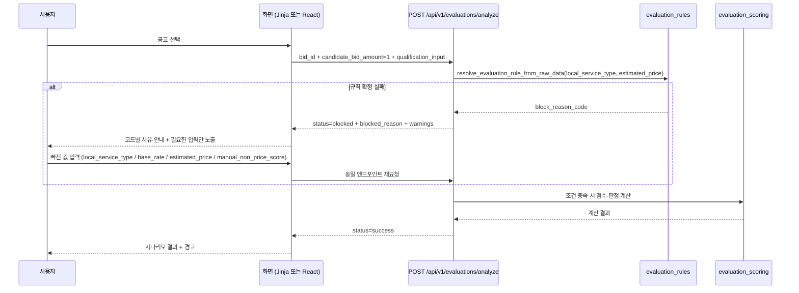
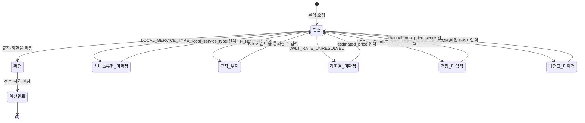

# 지방계약 사용자 입력 차단 상태 UI 현황 및 입력 화면 설계

> 작성일: 2026-10-05
> 작성자: Orca builder (task_034afa705c2d)
> 대상: 지방계약(LOCAL) 적격심사에서 사용자 입력이 필요한 계산 차단 상태
> 범위: 현황 조사와 입력 화면 설계만 수행한다. 코드는 변경하지 않는다.
> 연계 정본: [local_regime_rules_design_20261005.md](local_regime_rules_design_20261005.md) 0절(D5·D7·D8), 6.5절, 8절
> 원칙: 자동 확정 금지(추천 + 사용자 선택), 규칙 부재 시 수동 입력, 정량점수는 사용자 직접 입력

---

## 1. 요약

지방계약 평가에는 사용자 입력 없이는 계산을 진행할 수 없는 네 가지 차단 상태가 있다. 서버와 스키마는 이미 입력 계약을 갖추고 있으나, 두 화면(Jinja `detail.html`, React `App.tsx` + `ScoreFormulaCard.tsx`)은 그중 일부 필드만 노출하거나 전혀 노출하지 않는다.

핵심 공백은 다음과 같다.

- `LOCAL_RULE_NOT_FOUND` 해제에 필요한 **기준비율(`base_rate`)** 입력란이 어느 화면에도 없다. `_local_user_input_rule` 은 B·k·기준비율·통과점수 넷을 모두 요구하므로(evaluations.py:409-416) Jinja 화면에서는 이 차단을 풀 수 없다.
- **`local_service_type` 선택 UI** 가 없다. `LOCAL_SERVICE_TYPE_UNRESOLVED` 는 사용자 선택을 전제로 설계됐으나(6.5절) 화면에 선택 수단이 없다.
- **`manual_non_price_score` 입력란**이 없다. `LOCAL_QUANT_REQUIRED` 의 유일한 해제 수단이다.
- 차단 사유·안내 문구 매핑에 LOCAL 코드가 없어, 원문 메시지를 그대로 노출하고 "공고문의 낙찰방법과 별표를 직접 확인하십시오"라는 잘못된 안내를 보여 준다(detail.html:1043, detail.html:1061).
- React 경로는 애초에 `/api/v1/evaluations/analyze` 를 호출하지 않고 `/api/v1/predictions/predict-price` 를 호출하며(App.tsx:194), 해당 스키마에는 위 필드들이 없다(predictions.py:37-48).

이 문서는 차단 코드별 API 응답 필드, 화면 표시 위치, 현재 가능한 조치를 표로 정리하고, 화면별 입력 요소·표시 문구·재요청 흐름·상태 전이를 설계한다.

---

## 2. 차단 코드와 API 응답 계약

### 2.1 대상 차단 코드

| 차단 코드 | 정의 위치 | 발생 조건 | 해제에 필요한 사용자 입력 |
| --- | --- | --- | --- |
| `LOCAL_SERVICE_TYPE_UNRESOLVED` | evaluation_rules.py:2823 | 일반 띠에서 단순노무 여부, 또는 중소기업자간 대상/비대상 표기가 없어 별표를 확정하지 못함 | `local_service_type` |
| `LOCAL_RULE_NOT_FOUND` | evaluation_rules.py:2822 | 수요기관 시·도 규칙이 레지스트리에 없음 | `max_price_score`·`multiplier`·`base_rate`·`pass_threshold` (넷 모두) |
| `LWLT_RATE_UNRESOLVED` | evaluations.py:169 | 구간별 인쇄 하한율이 서로 다른 규칙인데 추정가격이 없어 구간을 고르지 못함 | `estimated_price` |
| `LOCAL_QUANT_REQUIRED` | evaluations.py:167 | `quant_basis=AGENCY_DOCUMENT_NOT_LOADED` 규칙인데 정량점수를 입력하지 않음 | `manual_non_price_score` |
| `MISSING_SCORE_TABLE` (연관) | evaluations.py:159 | 규칙 선언값도 사용자 입력도 없는 B·k·T 가 있음 | 빠진 B·k·T 항목 |

`LOCAL_SERVICE_TYPE_UNRESOLVED` 는 세 갈래에서 발생한다. 일반 띠에서 GENERAL·SIMPLE_LABOR 후보가 갈릴 때(evaluation_rules.py:2633-2639), 중소기업자간 대상/비대상 표기가 없을 때(evaluation_rules.py:2665-2671), 같은 조건 후보가 여러 개일 때(evaluation_rules.py:2683-2688)이다. 세 경우 모두 응답 `warnings` 에 후보 별표 목록을 싣고 추천 문구를 덧붙인다(evaluation_rules.py:2626-2632).

`LOCAL_RULE_NOT_FOUND` 는 `resolve_evaluation_rule_from_raw_data` 가 차단한 뒤(evaluation_rules.py:2612-2613), B·k·기준비율·통과점수가 모두 주어지면 `_local_user_input_rule` 로 임시 규칙을 만들어 계산을 계속한다(evaluations.py:1514-1545). 하나라도 비면 차단을 유지한다(evaluations.py:409-416).

`LWLT_RATE_UNRESOLVED` 는 구간별 하한율이 다른데 추정가격이 없을 때 `effective_lwlt_rate=None` 으로 남겨 규칙 대표값으로 추측하지 않는다(evaluation_rules.py:2701-2723, evaluation_rules.py:2757-2763).

### 2.2 차단별 API 응답 필드

모든 차단 응답은 `status="blocked"`, `blocked=true`, `blocked_reason="<CODE>: <메시지>"` 형식이다(_blocked_response, evaluations.py:962-988).

| 차단 코드 | `blocked_reason` 메시지 근거 | 함께 오는 필드 | 비어 있는 필드 |
| --- | --- | --- | --- |
| `LOCAL_SERVICE_TYPE_UNRESOLVED` | evaluation_rules.py:2636-2637, 2668-2669, 2686 | `warnings`(후보 별표 목록·추천), `contract_regime`, `rule_basis` | `rule_id`, `score_table`, `quant_score_table` |
| `LOCAL_RULE_NOT_FOUND` | evaluation_rules.py:1606-1609 | `warnings`(추천), `contract_regime`, `rule_basis` | `rule_id`, `score_table`, `quant_score_table` |
| `LWLT_RATE_UNRESOLVED` | evaluations.py:1569-1570 | `rule_id`, `rule_name`, `rule_basis`, `warnings`(구간 미확정 사유) | `lower_bound_rate`, `score_table`, `quant_score_table` |
| `LOCAL_QUANT_REQUIRED` | evaluations.py:1610-1611 | `rule_id`, `rule_name`, `rule_basis`, `warnings` | `quant_score_table`(LOCAL 은 항상 null), `quant_source`, `quant_notice` |
| `MISSING_SCORE_TABLE` | evaluations.py:1093-1096 | `rule_id`, `lower_bound_rate`, `score_table.missing_fields`, `scenario_results`(점수 null) | `quant_score_table`(null 일 수 있음) |

`LOCAL_QUANT_REQUIRED` 와 `MISSING_SCORE_TABLE` 은 흐름상 상호 배타적이다. LOCAL 규칙은 `quant_score_table_for_rule` 이 `None` 이고(evaluations.py:1589), 이때 `quant_basis=AGENCY_DOCUMENT_NOT_LOADED` 이면 `manual_non_price_score` 를 요구하므로(evaluations.py:1600-1613) `quant_table is None` 분기(evaluations.py:1620-1632)로 내려가지 않는다.

---

## 3. 현재 화면 현황

### 3.1 두 화면의 구조

| 화면 | 파일 | 평가 엔드포인트 | 입력 UI |
| --- | --- | --- | --- |
| 입찰 상세 (Jinja + jQuery) | src/app/templates/bids/detail.html | `POST /api/v1/evaluations/analyze` (detail.html:1004-1005, detail.html:1536) | 정량평가 배점표를 서버 응답으로 동적 생성(detail.html:1219-1247) + 고정 B·k·T·추정가격 입력행(detail.html:449-492) |
| AI 예측 시뮬레이터 (React) | frontend/src/App.tsx, frontend/src/components/ScoreFormulaCard.tsx | `POST /api/v1/predictions/predict-price` (App.tsx:194) | `ScoreFormulaCard` 의 B·k·T·Q 고정 입력(ScoreFormulaCard.tsx:431-509) |

차단 UI는 Jinja 화면에만 있다. React 화면은 `/evaluations/analyze` 를 호출하지 않으므로 `blocked_reason` 을 받지 않고, 규칙 판별 차단은 `score_verdict.unavailable_reasons`(predictions.py:268-274)로만 전달되며 카드가 "판정 확인 불가"로 표시한다(ScoreFormulaCard.tsx:276-297).

### 3.2 차단 코드별 화면 표시 (핵심 표)

| 차단 코드 | Jinja 화면 표시 | 표시 위치(파일:행) | 차단 사유 문구 처리 | React 화면 표시 | 사용자가 지금 할 수 있는 조치 |
| --- | --- | --- | --- | --- | --- |
| `LOCAL_SERVICE_TYPE_UNRESOLVED` | 차단 카드에 원문 노출 | 카드: detail.html:383-392 / 렌더: detail.html:1466-1469, detail.html:1566-1570 | 매핑 없음 → `getBlockedReasonText` 폴백(detail.html:1043)이 원문 반환, 안내는 일반 문구(detail.html:1061) | 카드 없음. `unavailable_reasons` 를 "판정 확인 불가"로 표시(ScoreFormulaCard.tsx:276-297) | 없음. `local_service_type` 입력 수단이 어느 화면에도 없음 |
| `LOCAL_RULE_NOT_FOUND` | 차단 카드에 원문 노출 | 카드: detail.html:383-392 / 렌더: detail.html:1466-1469, detail.html:1566-1570 | 매핑 없음 → 원문(detail.html:1043) + 일반 안내(detail.html:1061) | 동일하게 사유만 표시 | B·k·T 는 입력 가능(detail.html:459-491)하나 **기준비율 입력란 없음** → 넷을 모두 요구하는 서버 조건(evaluations.py:409-416)을 충족할 수 없어 해제 불가 |
| `LWLT_RATE_UNRESOLVED` | 차단 카드에 원문 노출 | 카드: detail.html:383-392 / 렌더: detail.html:1466-1469 | 매핑 없음 → 원문 + 일반 안내 | 동일 | 추정가격 입력란은 존재(detail.html:466-473)하고 전송됨(detail.html:1273, detail.html:1547) → 입력 시 해제 가능하나, UI는 그것이 해제 수단임을 알려 주지 않음 |
| `LOCAL_QUANT_REQUIRED` | 차단 카드에 원문 노출 | 카드: detail.html:383-392 / 렌더: detail.html:1466-1469, detail.html:1566-1570 | 매핑 없음 → 원문 + 일반 안내 | 동일 | 없음. `manual_non_price_score` 입력란이 어느 화면에도 없음 |
| `MISSING_SCORE_TABLE` (연관) | 미확인 항목 배너 + B·k·T 입력행 | 배너: detail.html:404-406 / 채움: detail.html:1099-1103 / 입력행: detail.html:449-492 | `score_table.missing_fields` 를 라벨로 변환(detail.html:1065-1068) | B·k·T 입력 시 `score_verdict` 사유 감소(ScoreFormulaCard.tsx:263-266) | 빠진 B·k·T 를 입력하면 해제 |

동적 정량 입력표는 `quant_score_table` 이 `None` 이면 비워지고 "적용 별표 배점표 미확인"만 남는다(detail.html:1225-1228). LOCAL 차단들은 `score_table`·`quant_score_table` 을 주지 않으므로(2.2절), 입력표가 비어 있는데도 화면은 무엇을 채워야 하는지 안내하지 않는다.

### 3.3 화면이 실제로 전송하는 페이로드

Jinja 초기 규칙 확인과 분석 실행은 입력을 다음처럼 구성한다.

| 호출 | 파일:행 | 전송 필드 |
| --- | --- | --- |
| 초기 규칙 확인 | detail.html:1455-1459, 빌더 detail.html:1266-1276 | `quant_items`, `management_grade`, `reputation_items`, `estimated_price`, `disqualification` (B·k·T 는 포함하지 않음) |
| 분석 실행 | detail.html:1535-1553 | 위 5개 + `max_price_score`, `multiplier`, `pass_threshold` |

React 는 `pushScore` 로 넷만 문자열 전송한다: `max_price_score`, `multiplier`, `pass_threshold`, `non_price_score`(App.tsx:182-201).

---

## 4. API 입력 필드와 화면 공백

### 4.1 `QualificationInput` 요청 스키마 필드

| 필드 | 스키마 정의 | 설명 | Jinja 전송 | React 전송 |
| --- | --- | --- | --- | --- |
| `quant_items` | schemas/evaluations.py:61 | 심사항목별 점수 | 예(detail.html:1251-1257) | 아니오 |
| `management_grade` | schemas/evaluations.py:69 | 신용평가등급 | 예(detail.html:1261-1262) | 아니오 |
| `reputation_items` | schemas/evaluations.py:76 | 신인도 항목 합계 | 예(detail.html:1267) | 아니오 |
| `estimated_price` | schemas/evaluations.py:83 | 공고에 추정가격이 없을 때만 사용 | 예(detail.html:1273, detail.html:1547) | 아니오 |
| `disqualification` | schemas/evaluations.py:106 | 결격사유 여부 | 예(detail.html:1274) | 아니오 |
| `max_price_score` | schemas/evaluations.py:122 | 가격배점한도 B | 예(detail.html:1549) | 예(App.tsx:189) |
| `multiplier` | schemas/evaluations.py:127 | 평점계수 k | 예(detail.html:1550) | 예(App.tsx:190) |
| `pass_threshold` | schemas/evaluations.py:132 | 통과점수 T | 예(detail.html:1551) | 예(App.tsx:191) |
| `base_rate` | schemas/evaluations.py:137 | 기준비율(0.80~0.95) | **아니오** | **아니오** |
| `manual_non_price_score` | schemas/evaluations.py:146 | LOCAL 비가격 정량점수 Q | **아니오** | **아니오** |
| `local_service_type` | schemas/evaluations.py:155 | 지방 용역 세부유형 선택 | **아니오** | **아니오** |
| `performance_score`·`management_score`·`labor_plan_score`·`credibility_score` | schemas/evaluations.py:90-105 | 구형 경로 호환 | 아니오 | 예(`nonPriceScore`→`non_price_score`, 다른 스키마) |

### 4.2 `PredictPriceRequest` 스키마 필드 (React 경로)

| 필드 | 스키마 정의 | React 전송 |
| --- | --- | --- |
| `bid_id` | schemas/predictions.py:32 | 예(App.tsx:198) |
| `user_price` | schemas/predictions.py:33 | 예(App.tsx:199) |
| `selected_model` | schemas/predictions.py:34 | 아니오 |
| `max_price_score` | schemas/predictions.py:37 | 예(App.tsx:189) |
| `multiplier` | schemas/predictions.py:40 | 예(App.tsx:190) |
| `pass_threshold` | schemas/predictions.py:43 | 예(App.tsx:191) |
| `non_price_score` | schemas/predictions.py:46 | 예(App.tsx:192) |

`PredictPriceRequest` 에는 `estimated_price`, `base_rate`, `manual_non_price_score`, `local_service_type` 이 없다. React 경로는 `_score_verdict` 안에서 `local_service_type` 없이 규칙을 판별하므로(predictions.py:255-263), LOCAL 차단은 사유 표시로만 끝나고 해제 경로가 없다. React 카드의 "비가격 정량점수 합계 (Q)"(ScoreFormulaCard.tsx:479)는 `PredictPriceRequest.non_price_score` 로, LOCAL 의 `manual_non_price_score` 와 다른 필드이므로 차단을 풀지 못한다.

### 4.3 화면에서 빠진 입력 정리

| 빠진 입력 | 관련 차단 | 필요한 이유 | 근거 |
| --- | --- | --- | --- |
| `base_rate` (기준비율) | `LOCAL_RULE_NOT_FOUND` | `_local_user_input_rule` 이 넷을 모두 요구하므로 기준비율 없이는 임시 규칙을 만들지 않음 | evaluations.py:409-416 |
| `local_service_type` | `LOCAL_SERVICE_TYPE_UNRESOLVED` | 자동 확정 금지, 추천 + 사용자 선택이 확정 결정(D5) | local_regime_rules_design_20261005.md:25, 6.5절 |
| `manual_non_price_score` | `LOCAL_QUANT_REQUIRED` | LOCAL 규칙은 정량 배점표 미반영이라 사용자 직접 입력이 유일한 값 공급원(D7) | local_regime_rules_design_20261005.md:27, evaluations.py:1603-1613 |
| `LOCAL_*` 차단 사유·안내 매핑 | 전부 | 현재 원문 노출 + 잘못된 일반 안내 | detail.html:1030-1062 |
| React 경로의 평가 API 연결 | 전부 | `/predictions/predict-price` 는 LOCAL 입력 계약이 없음 | App.tsx:194, predictions.py:37-48 |

---

## 5. 입력 화면 설계안

### 5.1 공통 원칙

1. 자동 확정 금지: 추천은 문구로만 제시하고 확정은 사용자가 한다(D5).
2. 차단 코드별로 필요한 입력만 노출한다. 불필요한 입력을 항상 띄우면 사용자가 오해한다.
3. 차단 사유·안내는 코드 매핑으로 결정하고, 원문 메시지는 보조로만 쓴다.
4. 입력 후 같은 엔드포인트로 재요청하면 서버가 다시 판별·계산한다. 클라이언트가 값을 추측하거나 대체하지 않는다.
5. 값의 정본은 서버 응답이며 화면은 표기만 한다(기존 원칙 유지, detail.html:1081-1084).

### 5.2 화면별 입력 요소

| 화면 | 차단 상태 | 추가할 입력 요소 | 위치(안) |
| --- | --- | --- | --- |
| Jinja 상세 | `LOCAL_SERVICE_TYPE_UNRESOLVED` | 용역 세부유형 `<select>`. 옵션은 응답 `warnings` 의 후보 별표에서 유도(GENERAL, SIMPLE_LABOR, SW, SW_SME, LAND_TRANSPORT, LAND_TRANSPORT_SME 등). 추천 문구는 별도 캡션으로 표시 | 고정 입력행(detail.html:449-492) 하단 |
| Jinja 상세 | `LOCAL_RULE_NOT_FOUND` | 기준비율 `<input id="input-base-rate">` (step 0.01, 0.80~0.95). B·k·T 는 기존 입력행 재사용 | 고정 입력행(detail.html:449-492)에 행 추가 |
| Jinja 상세 | `LWLT_RATE_UNRESOLVED` | 추가 요소 없음. 기존 추정가격 입력행(detail.html:466-473)을 강조하고 안내로 해제 수단임을 명시 | 기존 행 하이라이트 |
| Jinja 상세 | `LOCAL_QUANT_REQUIRED` | 비가격 정량점수 `<input id="input-manual-non-price-score">` (step 0.01, 0~100) | 고정 입력행 하단 |
| React 시뮬레이터 | 전체 LOCAL | 두 갈래 중 택일: (a) `ScoreFormulaCard` 에 위 입력을 추가하고 `/evaluations/analyze` 로 전환, (b) `PredictPriceRequest`·`_score_verdict` 를 확장해 동일 입력 수용. (a)가 기존 차단 계약을 그대로 재사용하므로 권장 | ScoreFormulaCard.tsx:431-509 |

React 를 (a)로 갈 경우 초기 규칙 확인은 Jinja 와 동일하게 `/evaluations/analyze` 를 1원 후보금액으로 호출해 차단 코드와 후보를 받는다(현재 Jinja 방식, detail.html:1445-1496).

### 5.3 표시 문구

`getBlockedReasonText`·`getBlockedGuidanceText`(detail.html:1029-1062)에 다음 항목을 추가한다.

| 차단 코드 | 사유 문구 | 안내 문구 |
| --- | --- | --- |
| `LOCAL_SERVICE_TYPE_UNRESOLVED` | 적용 별표를 자동 확정하지 못했습니다. 아래 후보 중 용역 세부유형을 선택하십시오. | 후보 별표와 추천을 참고해 선택하면 즉시 다시 판별합니다. 자동 확정하지 않습니다. |
| `LOCAL_RULE_NOT_FOUND` | 해당 지자체 기준이 확보되지 않았습니다. B·k·기준비율·통과점수를 입력하면 계산합니다. | 네 값을 모두 입력해야 하며, 기준비율은 0.80~0.95 입니다. |
| `LWLT_RATE_UNRESOLVED` | 추정가격이 없어 적용할 구간 낙찰하한율을 확정하지 못했습니다. | 추정가격을 입력하면 해당 구간 하한율로 계산합니다. |
| `LOCAL_QUANT_REQUIRED` | 정량평가 배점표가 기관 원문 미반영이라 정량점수를 직접 입력해야 합니다. | 입력한 정량점수는 서버가 검증하지 않습니다. |
| `MISSING_SCORE_TABLE` | 공고문 배점표(미확인 항목)를 입력해야 점수를 계산할 수 있습니다. | 배점표를 입력한 뒤 다시 실행하십시오. |

React 카드의 판정 상태 문구(ScoreFormulaCard.tsx:263-297)에도 같은 매핑을 적용해 "판정 확인 불가"만 보여 주는 현재 동작을 대체한다.

### 5.4 재요청 흐름

서버는 재요청 시 `LOCAL_RULE_NOT_FOUND` + B·k·기준비율·통과점수를 받으면 임시 규칙으로 계산하고, `LOCAL_USER_INPUT_SOURCE` 경고를 남긴다(evaluations.py:1533-1535, evaluations.py:177). 사용자 입력이 규칙 선언값과 다르면 덮어쓰기 경고가 붙는다(evaluations.py:1325-1327).

### 5.5 상태 전이

동일 차단이 반복되면 입력이 서버 조건을 충족하지 못한 것이므로, 화면은 응답 `warnings` 의 후보·추천과 `blocked_reason` 을 갱신해 보여 준다.

---

## 6. 구현 범위 추정

### 6.1 파일별 변경 (설계 기준, 이번 작업에서는 미수행)

| 파일 | 변경 내용 | 비고 |
| --- | --- | --- |
| src/app/templates/bids/detail.html | 기준비율·정량점수·용역유형 입력 추가, `getBlockedReasonText`·`getBlockedGuidanceText` LOCAL 매핑 추가, 분석 실행 페이로드에 `base_rate`·`manual_non_price_score`·`local_service_type` 추가 | 기존 입력행(detail.html:449-492)과 페이로드(detail.html:1543-1552) 확장 |
| frontend/src/components/ScoreFormulaCard.tsx | LOCAL 입력(용역유형·기준비율·정량점수)과 차단 사유 매핑 추가 | (a)안 채택 시 `/evaluations/analyze` 호출로 전환 |
| frontend/src/App.tsx | 차단 응답 상태 보관·표시, 페이로드 확장 | 현재 `scoreTable` 상태(App.tsx:83-88) 확장 |
| src/app/schemas/evaluations.py | 변경 없음(필드 이미 존재) | (a)안 기준 |
| src/app/schemas/predictions.py | (b)안 채택 시에만 확장 | 기본 권장은 (a)안 |
| src/app/api/v1/predictions.py | (b)안 채택 시에만 `_score_verdict` 확장 | 기본 권장은 (a)안 |

서버 스키마와 계산 경로는 이미 완성되어 있어, 화면 배선만으로 네 차단을 모두 해제 가능하게 만들 수 있다. 유일하게 서버 확장이 필요한 경우는 React 를 `predict-price` 경로에 그대로 두는 (b)안이다.

### 6.2 시험 방법

| 구분 | 시험 | 검증 내용 |
| --- | --- | --- |
| API 회귀 | `tests/test_evaluations_api.py` | LOCAL 4차단 응답의 `blocked_reason`·`warnings` 계약 유지 |
| API 시나리오 | `tests/test_evaluations_realuse_scenarios.py` | B·k·기준비율·통과점수 입력 시 `LOCAL_RULE_NOT_FOUND` 해제, `LOCAL_USER_INPUT_SOURCE` 경고 |
| 규칙 단위 | `tests/test_evaluation_rules_scope_axis.py` | LOCAL_SERVICE_TYPE_UNRESOLVED 발생·후보 warnings |
| 화면 | 상세 페이지 수동 시나리오 | 각 차단에서 입력→재요청→해제 확인. 사유·안내 문구가 코드별로 바뀌는지 |
| React | `ScoreFormulaCard` 렌더 시험 | 차단 사유 매핑과 입력 노출 여부 |
| 정적 | `python3 scripts/validate_agent_rules.py --quiet` | 규칙·문서 검증 |

화면 시나리오는 다음 네 가지를 최소로 포함한다: (1) 인천·제주·강원 같은 GENERAL/SIMPLE_LABOR 갈림, (2) 세종 SW·육상운송의 대상/비대상 갈림, (3) 미수집 시·도에서 B·k·기준비율·통과점수 입력, (4) LOCAL 규칙에서 정량점수 직접 입력.

---

## 7. 결정 사항과 남은 위험

| # | 항목 | 현재 상태 | 비고 |
| --- | --- | --- | --- |
| 1 | `LOCAL_SERVICE_TYPE_UNRESOLVED` 선택지 노출 방식 | 미구현. 응답 `warnings` 에 후보 문자열만 존재 | 후보 rule_id·table_name 파싱과 옵션 라벨 규약이 필요 |
| 2 | React 화면의 평가 API 전환 | 미정. (a)안 권장 | 전환 시 인증·쿼터 경로(evaluations 는 로그인 필수, predictions 는 익명 허용) 차이 확인 필요 |
| 3 | 차단 상태에서 정량 입력표가 빈 상태로 남음 | 미구현 | 비어 있는 이유(차단 코드)를 함께 안내해야 함 |
| 4 | `LOCAL_RULE_NOT_FOUND` 부분 입력 시 되돌림 | 서버는 차단 유지 | 화면은 어떤 필드가 비었는지 다시 계산해 표시해야 함 |

이 문서는 현황 조사와 설계만 담는다. 구현은 별도 Task 로 분리한다.
