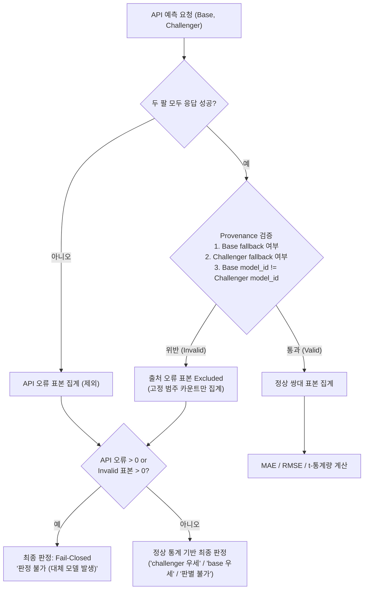

# 용역 쌍대 비교의 실제 모델 출처(Provenance) 가드 설계서

> **작성일**: 2026-08-12
> **버전**: v1.0.0
> **상태**: 작성 완료 (A5 Task 구현)
> **소유 파일**: `scripts/compare_servc_models_paired.py`, `tests/test_compare_servc_models_paired_provenance.py`
> **참조 파일**: `src/app/api/v1/predictions.py`, `src/app/schemas/predictions.py`

---

## 1. 배경 및 문제점

### 1.1 허위 쌍대 비교(Fake Paired Evaluation) 위험
운영 API 경로에서 두 모델(base vs challenger)을 쌍대 비교할 때, 한 팔의 모델 로드에 실패하거나 파일 부재 등으로 대체(fallback) 모델로 자동 전환되는 상황이 발생할 수 있습니다.

- **문제 상황**:
  - Challenger 모델 요청(`servc_institution_v1`) -> 로드 실패로 Champion/Default 모델(`servc_prev_63leaf`)로 대체.
  - Base 모델 요청(`servc_prev_63leaf`) -> 정상적으로 `servc_prev_63leaf` 반환.
  - 결과: 동일한 모델(`servc_prev_63leaf`)끼리 자기 자신과 오차 차이를 측정하는 **허위 쌍대 판정**이 발생함.
- **결과 위험**:
  - 두 팔의 실제 오차가 동일하므로 `diff = 0`이 되어 Challenger가 무해하거나 우세하다는 오판을 유발하거나, 한 쪽만 대체되어 왜곡된 성능 지표로 잘못 승격 결정될 수 있음.

---

## 2. 출처(Provenance) 가드 설계

### 2.1 API 응답 출처 필드 수집
API 응답(`PredictPriceResponse`)에서 제공하는 모델 출처 계약 필드를 수집합니다:
- `requested_model`: 호출부가 요청한 모델 ID
- `model_id`: 실제로 추론을 수행한 실제 모델 ID
- `fallback_used`: 대체 모델 응답 여부 (`bool`)
- `fallback_reason`: 대체 발생 사유 (`str | None`) - **보안 및 규격화를 위해 전혀 출력하지 않음**

### 2.2 표본 유효성 검증 규칙 (Provenance Validation)
각 공고(bid) 표본에 대해 두 팔의 예측 결과를 다음과 같이 검증합니다:

| 검증 항목 | 조건 | 위반 시 판정 |
| --- | --- | --- |
| Base 팔 대체 여부 | `requested_model == model_id` 및 `not fallback_used` | `base_fallback` 감지 |
| Challenger 팔 대체 여부 | `requested_model == model_id` 및 `not fallback_used` | `chal_fallback` 감지 |
| 양 팔 실제 모델 동일성 | `base.model_id != chal.model_id` | `same_actual_model` 감지 |
| 응답 계약 필드 누락 | `model_id`, `requested_model`, `fallback_used` 중 하나라도 부재, None, 공백일 때 | `missing_provenance` 감지 |

위 4가지 조건 중 하나라도 위반하면 해당 표본은 **출처 오류 표본(invalid provenance)**으로 지정되어 정상 쌍대 비교 수치 계산(MAE, RMSE, t-통계량)에서 즉시 제외됩니다.

### 2.3 임의 사유 비노출 (Strict No-Exposure)
`fallback_reason`에는 내부 파일 경로, DB 연결 정보, 스택 트레이스 등 민감 정보가 포함될 수 있습니다.
- 로그 및 보고서에는 예외 원문을 정화(sanitize)하여 노출하던 기존 방식을 폐기하고, 아예 **임의 문자열을 전혀 출력하지 않고 고정 구조화 범주(`base_fallback`, `chal_fallback`, `missing_provenance`, `same_actual_model`)만 집계**하도록 설계합니다. (민감 한 줄 stdout 비노출 원칙)

### 2.4 Fail-Closed 승격 판정 단축 (Short-Circuit)
출처 오류 표본이나 API 오류(요청 실패 등) 표본이 단 1건이라도 발생하면:
- 실패 건수와 고정 범주별 원인을 명시적으로 집계·출력합니다.
- 승격 판정(`verdict`)은 **Fail-Closed** 처리되어 `"판정 불가 (대체 모델 발생)"`으로 자동 변환되고 모델 승격을 즉시 차단합니다.

---

## 3. 구현 아키텍처 (Mermaid)

---

## 4. 검증 결과

`tests/test_compare_servc_models_paired_provenance.py` 신규 단위 테스트 작성을 통해 아래 5가지 핵심 시나리오를 monkeypatch로 검증 완료했습니다:

1. **정상 서로 다른 모델**: 100% 정상 쌍대 검정 수행 및 통계 기반 판정.
2. **한 팔 fallback**: 대체 발생 표본 제외, 고정 범주 건수 집계, Fail-Closed 판정.
3. **두 팔 동일 actual_model**: 동일 모델 판정 감지, Excluded 집계 및 Fail-Closed.
4. **응답 필드 누락 레거시 대응**: `missing_provenance`로 엄격히 탐지하여 제외 및 Fail-Closed.
5. **전량 무효 케이스 (Zero Valid)**: 유효 표본 0건 시 빈 통계를 반환하며 CLI Non-Zero(1) 종료로 traceback 없이 Fail-Closed 테스트 완료.

---

## 5. 결론 및 향후 과제

본 출처 가드 구현으로 인해 모델 로드 실패나 서버 대체 동작에 따른 **허위 쌍대 승격 위험이 완전히 차단**되었습니다.
정본 서빙 환경에서의 실제 대량 쌍대 측정은 Coordinator 오케스트레이터 지침에 따라 수행됩니다.
