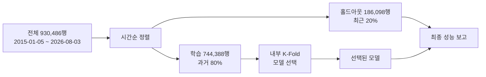
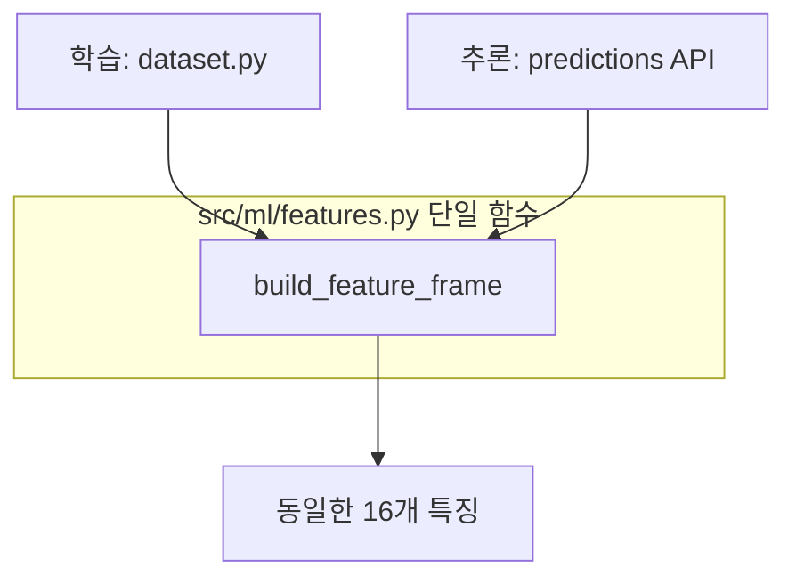

> **작성일**: 2026-08-03
> **버전**: v2.1.0
> **상태**: 제도 재검토로 일부 재설계. 데이터 재검증 대기
> **대상**: 용역(Servc) 낙찰률 예측 모델
> **개정**: v1.0.0 은 DB 통계만 보고 작성했습니다. 원본 `bid_box` 의 도메인 로직을
> 검토해 낙찰하한율을 반영하면서 특징 구성과 성능 목표가 바뀌었습니다(2장, 3장, 4장).
> v2.1.0 에서 G2B 제도 원문 조사 결과를 반영했습니다
> ([`g2b_procurement_institution_analysis.md`](g2b_procurement_institution_analysis.md)).
> **2026-05-26 낙찰하한율 2%p 일괄 인상**으로 본 문서의 실측 통계는 모두 구 제도
> 기준이며, 낙찰방식별 분리 설계가 추가로 필요합니다. 13장을 먼저 읽으십시오.

# 용역 낙찰률 예측 모델 설계서

## 1. 배경

현재 서빙 중인 모델 3종은 어느 것도 용역 전용이 아닙니다.

| 모델 | 라벨상 담당 | 실제 학습 데이터 |
| --- | --- | --- |
| `ssh_hist_premium` | 용역 | 외부 CSV 22,893행, 타깃 누수 확인 |
| `quantum_leap_v25_pro` | 물품 | 2025 물품셋 76,527행 (건설·용역 15% 혼입) |
| `v25` | 건설·외자 | `data_scope: all` 15,000행 |

2026-08-03 백필로 용역 조인 표본이 **약 3만 건에서 92만 건**으로 늘었고,
예정가격·기초금액 보유율이 99.60% 가 되었습니다. 카테고리별로 나눠 학습한
실측에서 특성 차이가 뚜렷했습니다.

| 카테고리 | 표본 | R2 |
| --- | ---: | ---: |
| 용역 | 925,031 | **0.5519** |
| 물품 | 784,266 | 0.3480 |
| 전체 혼합 | 3,068,179 | 0.3627 |
| 건설 | 1,358,882 | **-0.1094** |

혼합 학습(0.3627)이 용역 전용(0.5519)보다 나쁘고, 건설은 R2 가 음수입니다.
**카테고리를 섞으면 서로를 망칩니다.** 용역 전용 설계의 근거입니다.

---

## 2. 문제 정의

### 2.1 타깃은 낙찰금액이 아니라 낙찰률입니다

| 대상 | 낙찰금액과의 상관 |
| --- | ---: |
| 예정가격 | **+0.9816** |
| 낙찰률 | +0.0049 |

낙찰금액은 예정가격이 98% 설명합니다. 금액을 타깃으로 두면 R2 는 높게 나오지만
예정가격을 되풀이할 뿐 정보가 없습니다. 타깃은 **낙찰률(`sucsf_bid_rate`)** 로 둡니다.

금액이 필요한 소비자에게는 `예측 낙찰금액 = 기초금액 x 예측 낙찰률 / 100` 으로
환산해 제공합니다.

### 2.2 낙찰률의 기준 금액

`낙찰금액 / 기준금액 x 100` 이 실제 낙찰률과 얼마나 일치하는지 잰 결과입니다.

| 기준 금액 | 오차 0.5%p 이내 비율 | 중앙 오차 |
| --- | ---: | ---: |
| 예정가격 (`presmpt_prce`) | 1.79% | 8.653%p |
| **`base_amount` 컬럼** | **51.14%** | **0.485%p** |

`base_amount` 기준이 가깝습니다. 다만 **이 컬럼은 이름과 달리 기초금액이 아닙니다.**
`extract_business_budget` 이 `asignBdgtAmt`(배정예산금액) 또는 `bdgtAmt`(예산금액)에서
값을 뽑습니다. 진짜 기초금액인 `bssamt` 는 **G2B 응답에 아예 없습니다**(표본 300건에서
보유율 0.0%).

일치율이 51% 에 그치는 것도 이 때문일 가능성이 큽니다. 낙찰률은 기초금액 기준으로
산정되는데 우리는 예산금액만 가지고 있습니다. 이 격차는 10장의 데이터 공백으로
기록합니다.

### 2.3 타깃 분포

| 통계 | 값 |
| --- | ---: |
| 평균 | 89.96 |
| 표준편차 | 4.52 |
| 중앙값 | 88.25 |
| 사분위 범위 | 87.99 ~ 90.46 |

**분포가 매우 좁습니다.** 사분위 범위가 2.5%p 에 불과합니다. 평균만 답해도
RMSE 4.5 는 나오므로, R2 를 기준으로 삼아야 개선을 제대로 잽니다. RMSE 단독
비교는 착시를 부릅니다.

정제 규칙은 `50 < y < 120` 입니다. 원표본 932,624행 중 2,138행(0.23%)이
제거되어 930,486행이 남습니다.

---

## 3. 특징 설계

### 3.1 절제 실험 (2026-08-03 실측)

930,486행, 시간순 8:2 분할(학습 744,388 / 홀드아웃 186,098), LightGBM 동일
하이퍼파라미터입니다.

| 특징군 | R2 | RMSE | MAPE | 증분 |
| --- | ---: | ---: | ---: | ---: |
| A. 현행 8특징 | 0.5036 | 3.5892 | 2.2248 | 기준 |
| B. A + 범주형 3종 | 0.5536 | 3.4036 | 2.0962 | **+0.0500** |
| C. B + 금액 순위·분위 | 0.5717 | 3.3340 | 2.0716 | +0.0181 |
| D. C + 기관x계약방법 이력 | 0.5961 | 3.2377 | 1.9751 | +0.0244 |
| E. D - log_price | 0.5952 | 3.2412 | 1.9805 | -0.0009 |
| F. D + 낙찰하한율 | 0.6269 | 3.1115 | — | **+0.0318** |
| **G. F + 예정가격결정방법** | **0.6285** | **3.1049** | — | +0.0016 |

**G 를 채택합니다.** A 대비 R2 +0.1249, RMSE -13.5% 입니다.

E 가 D 와 거의 같으므로 `log_price` 는 순위 특징과 중복됩니다. 다만 제거해도
이득이 없어 유지합니다. 삭제는 특징 수가 문제될 때 첫 후보입니다.

F 와 G 는 원본 `bid_box` 의 도메인 로직을 검토하고 추가한 것입니다. 4장을 참조하십시오.

### 3.2 왜 범주형이 가장 큰 증분인가

분산 설명력(eta^2) 실측입니다.

| 컬럼 | eta^2 | 범주 수 | 현행 사용 |
| --- | ---: | ---: | --- |
| `dminstt_nm` (수요기관) | **0.3239** | 15,767 | 이력값으로만 |
| `bid_methd_nm` (입찰방식) | **0.2438** | 7 | 미사용 |
| `cntrct_mthd_nm` (계약체결방법) | 0.0871 | 4 | 미사용 |
| `ntce_kind_nm` (공고종류) | 0.0363 | 3 | 미사용 |
| 금액 계열 전부 | 0.006 미만 | — | `log_price` 만 |

계약체결방법별 낙찰률입니다.

| 계약체결방법 | 건수 | 평균 | 표준편차 |
| --- | ---: | ---: | ---: |
| 수의계약 | 264,092 | 91.02 | 4.45 |
| 제한경쟁 | 100,235 | 89.08 | 6.54 |
| 일반경쟁 | 27,598 | 85.17 | 10.67 |
| 지명경쟁 | 8,035 | 84.87 | 3.55 |

수의계약과 일반경쟁이 **5.9%p** 차이납니다. 타깃 표준편차가 4.52 인 것을 감안하면
이 컬럼 하나가 표준편차보다 큰 차이를 만듭니다. 2026-08-03 에 수집기 필드명 오류를
고쳐 용역 99.96% 가 채워졌으므로 이제 쓸 수 있습니다.

### 3.3 금액은 선형이 아니라 순위 관계입니다

| 변수 | Pearson | Spearman |
| --- | ---: | ---: |
| 예정가격 | -0.0179 | **-0.2584** |
| `base_amount` (예산금액) | -0.0006 | **-0.2591** |

선형 상관은 0 인데 순위 상관은 -0.26 입니다. 금액이 클수록 낙찰률이 낮아지는
경향이 분명히 있으나 관계가 심하게 비선형이라 원본 값이나 로그로는 잡히지
않습니다. **백분위 순위(`price_rank`)와 20분위(`price_q`)로 넣습니다.**

`base_amount / presmpt_prce` 는 중앙값 1.1000 이지만 표준편차가 174만입니다.
극단 이상치가 있어 **[0.5, 2.0] 으로 절단**한 뒤 씁니다.

### 3.4 최종 특징 목록 (19개)

먼저 4장에서 추가한 3종입니다. 기여도는 특징군 D 실험에 없던 항목이라 비웁니다.

| 특징 | 설명 | 출처 |
| --- | --- | --- |
| `lwlt` | 낙찰하한율. 0 은 결측 처리 | `raw_data.sucsfbidLwltRate` |
| `lwlt_missing` | 하한율 결측 여부 (23%) | 파생 |
| `prearng` | 예정가격결정방법 (범주형) | `raw_data.prearngPrceDcsnMthdNm` |

나머지 16종과 특징군 D 실험 기준 기여도입니다.

| 특징 | 설명 | 기여도 |
| --- | --- | ---: |
| `duration` | 공고~마감 일수, [0, 365] 절단 | 4,920 |
| `ic_hist` | 기관x계약방법 과거 낙찰률 평균 | 4,565 |
| `inst_hist` | 기관 과거 낙찰률 평균 | 4,200 |
| `log_price` | log1p(예정가격) | 4,105 |
| `inst_cnt` | 기관 과거 표본 수 | 3,982 |
| `base_ratio` | 기초금액/예정가격, [0.5, 2.0] 절단 | 3,394 |
| `ic_cnt` | 기관x계약방법 과거 표본 수 | 3,282 |
| `price_rank` | 예정가격 백분위 순위 | 1,764 |
| `month_cos`, `month_sin` | 개찰월 주기 인코딩 | 1,472 / 1,363 |
| `cntrct` | 계약체결방법 (범주형) | 1,078 |
| `wd_sin`, `wd_cos` | 개찰요일 주기 인코딩 | 825 / 676 |
| `kind` | 공고종류 (범주형) | 761 |
| `bidm` | 입찰방식 (범주형) | 434 |
| `price_q` | 예정가격 20분위 | 379 |

범주형은 LightGBM 의 `categorical_feature` 로 직접 넘깁니다. 원핫 인코딩은
`dminstt_nm` 처럼 범주가 많을 때 차원이 폭발하므로 쓰지 않습니다.

### 3.5 이력 특징의 누수 차단

기관 이력은 **자기 자신과 미래를 제외한** 과거 평균이어야 합니다.

```python
ordered = df.sort_values("openg_dt")
g = ordered.groupby("inst", sort=False)["y"]
hist = g.transform(lambda s: s.shift(1).expanding().mean())
count = g.transform(lambda s: s.shift(1).expanding().count())
```

`shift(1)` 이 자기 자신을, `expanding()` 이 미래를 배제합니다. 이 처리를 빠뜨리면
홀드아웃 R2 가 비현실적으로 높게 나옵니다. 기존 `ssh_hist_premium` 이 5폴드 중
3개에서 R2 0.9999999999999998 을 낸 것이 이 유형의 사고입니다.

---

## 4. 원본 프로젝트 도메인 로직 검토

v1.0.0 은 DB 통계만 보고 작성했습니다. 원본 `bid_box` 의 낙찰 산식을 검토한 결과
설계가 바뀌었습니다.

### 4.1 낙찰하한율이 가장 강한 신호입니다

원본 `bid_box/ssh/histmodel.py` 는 낙찰률을 직접 예측하지 않고
`프리미엄 = 낙찰률 - 낙찰하한율` 을 예측한 뒤 하한율을 더해 복원합니다.
제도적으로 타당한 접근입니다. 낙찰률은 하한율 위에서만 형성되기 때문입니다.

문제는 하한율을 구하는 방식이었습니다.

```python
# bid_box/ssh/histmodel.py
lower_map = df.groupby('group')['bid_rate'].quantile(0.05)
df['lower_rate'] = df['group'].map(lower_map)
```

**하한율을 타깃(`bid_rate`)의 5분위수로 만들었습니다.** 타깃에서 파생한 값을 특징으로
쓰고 다시 타깃을 복원하므로 누수입니다. `ssh_hist_premium` 이 5폴드 중 3개에서
R2 0.9999999999999998 을 낸 원인이 이것입니다. 저장된 하한율 표 8,199개 값 중
62.2% 가 하한율로 불가능한 범위이고 최댓값이 2억 1,500만인 것도 같은 이유입니다.

**진짜 낙찰하한율은 G2B 응답에 있습니다.** `sucsfbidLwltRate` 필드이며 원본 응답
보유율 100% 입니다. 다만 DB 컬럼으로 추출되지 않아 `raw_data` JSON 안에만 있어
그동안 아무도 쓰지 않았습니다.

실측입니다(용역 930,388행).

| 항목 | 값 |
| --- | ---: |
| 값이 0 인 비율 (사실상 결측) | 23.0% |
| 유효 표본 | 715,497 |
| 평균 / 중앙값 | 87.635 / 88.000 |
| 낙찰률과 Pearson | +0.4742 |
| 낙찰률과 **Spearman** | **+0.7056** |

**Spearman 0.7056** 은 지금까지 찾은 어떤 특징보다 강합니다. 비교하면 수요기관
eta^2 가 0.3239, 입찰방식이 0.2438 이었습니다.

### 4.2 구조적 제약: 낙찰률은 하한율 이상입니다

| 항목 | 값 |
| --- | ---: |
| 낙찰률 >= 하한율 비율 | **99.95%** |
| 프리미엄 중앙값 | 0.163%p |
| 프리미엄 평균 | 1.009%p |

거의 예외 없이 성립하는 제도적 하한입니다. **예측값을 하한율 미만으로 내놓으면
그 자체로 틀린 답이므로, 후처리에서 하한율로 절단합니다.** 하한율이 결측(0)인
23% 는 절단하지 않습니다.

### 4.3 프리미엄 예측은 채택하지 않습니다

원본처럼 프리미엄을 타깃으로 두는 방안을 검토했으나 이득이 없습니다.

| 타깃 | 표준편차 |
| --- | ---: |
| 낙찰률 | 2.884 |
| 프리미엄 (낙찰률 - 하한율) | 2.958 |

프리미엄이 오히려 산포가 큽니다. 예측 난이도가 줄지 않으므로 **낙찰률을 그대로
타깃으로 두고 하한율을 특징으로 넣습니다.** 하한율이 23% 결측이라 타깃 변환을
쓰면 그 구간을 통째로 버려야 하는 문제도 있습니다.

### 4.4 예정가격결정방법

`prearngPrceDcsnMthdNm` 도 `raw_data` 에만 있습니다.

| 방법 | 건수 | 평균 낙찰률 | 표준편차 |
| --- | ---: | ---: | ---: |
| 복수예가 | 453,414 | 88.839 | 5.451 |
| 단일예가 | 45,216 | **96.702** | 10.068 |
| 비예가 | 1,370 | 94.181 | 10.356 |

복수예가와 단일예가가 **7.9%p** 차이납니다. 복수예가는 15개 예비가격 중 4개를
추첨해 평균내므로 사정률 변동이 들어가고, 단일예가는 그 변동이 없습니다.

증분은 +0.0016 으로 작지만 결측이 없고 비용도 없어 포함합니다.

### 4.5 원본 산식 중 채택하지 않은 것

| 원본 로직 | 판단 |
| --- | --- |
| 하한율 = 그룹별 타깃 5분위수 | **폐기.** 타깃 누수 |
| 룰 기반 하한율 (적격심사 0.87745 등) | 실측 하한율 결측 시 대체값 후보로만 |
| 예정가격 시뮬레이션 `normal(1.0, 0.01)` | 사정률 근사로는 타당하나 점 추정에 불필요 |
| 프리미엄 타깃 | 4.3 참조. 이득 없음 |

룰 기반 하한율 값(적격심사 87.745, 용역 88.0)은 실측 분포의 최빈값
(88.0 이 171,390건, 87.745 가 111,178건)과 일치합니다. 원본 작성자가 제도를 정확히
파악하고 있었다는 뜻이며, 다만 그 값을 데이터에서 직접 얻을 수 있다는 것을
몰랐던 것으로 보입니다.

### 4.6 제도 산식 대조 (조달청 공식 기준)

데이터로 역추정한 값이 제도와 맞는지 조달청 및 업계 공개 자료로 대조했습니다.

**예정가격 산정 구조**입니다.


사정률 범위는 국가계약법 적용 시 -2% ~ +2%, 지방계약법 적용 시 -3% ~ +3% 입니다.
**사정률은 개찰 당일 추첨으로 결정되므로 공고 시점에는 알 수 없습니다.**

**낙찰하한율의 추정가격 구간별 차등**을 우리 데이터로 확인했습니다
(용역 2023년 이후 251,248행).

| 추정가격 구간 | 표본 | 최빈 하한율 |
| --- | ---: | --- |
| 2억 미만 | 218,518 | 88.0 (147,317), 87.745 (33,160), 90.0 (22,867) |
| 2억~10억 | 23,517 | 86.745 (9,997), 85.495 (4,553) |
| 10억~50억 | 8,355 | 79.995 (5,048), 82.995 (666) |
| 50억~100억 | 599 | 79.995 (203), 87.995 (143) |

**금액이 클수록 하한율이 낮아집니다.** 제도상 구간별 차등 구조와 일치하며,
`sucsfbidLwltRate` 가 임의값이 아니라 제도적 실제값임을 확인해 줍니다.
3.3 절에서 관찰한 "금액이 클수록 낙찰률이 낮다"는 순위 관계의 정체가 이것입니다.

### 4.7 복수예가 여부가 예측 난이도를 가릅니다

`낙찰률 - 낙찰하한율` 프리미엄을 예정가격결정방법별로 나눈 실측입니다.

| 방법 | 표본 | 평균 | 중앙값 | 표준편차 |
| --- | ---: | ---: | ---: | ---: |
| **복수예가** | 244,732 | 1.003 | **0.161** | **3.335** |
| 단일예가 | 6,516 | 5.558 | 3.490 | 7.380 |

**복수예가에서는 낙찰률이 하한율에 거의 붙습니다.** 중앙 프리미엄이 0.161%p 에
불과합니다. 표본의 97.4% 가 복수예가이므로, 이 구간은 하한율만 알아도 대부분
맞힐 수 있습니다.

설계 반영입니다.

| 항목 | 결정 |
| --- | --- |
| 하한율 절단 | 필수. 99.95% 가 하한율 이상 |
| `prearng` 특징 | 필수. 두 구간의 난이도가 2배 이상 다름 |
| 성능 보고 | **복수예가와 단일예가를 분리해 보고** |

전체 평균 지표만 보면 97% 를 차지하는 복수예가에 가려 단일예가 성능이 보이지
않습니다. 6.3 절의 금액 구간별 분해와 함께 필수 보고 항목으로 둡니다.

### 4.8 사정률은 특징으로 쓸 수 없습니다

사정률 = 예정가격 / 기초금액 인데 **기초금액이 데이터에 없습니다.**
대체로 예산금액을 넣어 재보면 아래와 같습니다.

| 항목 | 값 |
| --- | ---: |
| 예정가격 / 예산금액 중앙값 | 0.9091 |
| 1~99 분위 | 0.9021 ~ 1.0000 |

0.9091 은 1/1.1 입니다. **예산금액 = 예정가격 x 1.1 로 부가세 10% 관계이며
사정률과 무관합니다.** 분포가 극도로 좁은 것도 결정론적 관계이기 때문입니다.
3.3 절의 `base_ratio` 가 기여도는 있으나 의미는 부가세 포함 여부에 가깝습니다.

또한 사정률은 개찰 당일 추첨으로 정해지므로, 설령 기초금액을 확보해도
**공고 시점 예측에는 쓸 수 없습니다.** 예측 대상의 일부이지 입력이 아닙니다.

### 4.9 추론 시점 가용성 검증이 필요합니다

이 설계의 가장 큰 미해결 위험입니다.

복수예가에서 **예정가격은 개찰 시점에 확정**됩니다. 그런데 현재 특징의
`log_price`, `price_rank`, `price_q`, `base_ratio` 가 모두 `presmpt_prce`
에서 파생됩니다. 공고 시점에 이 값이 없다면 학습에서만 쓸 수 있는 값을
쓰고 있는 것이며, 서비스에서는 동작하지 않습니다.

| 확인 사항 | 방법 |
| --- | --- |
| 공고 시점 `presmptPrce` 존재 여부 | 개찰 전 공고를 수집해 필드 확인 |
| 존재한다면 그 값의 의미 | 추정가격인지 확정 예정가격인지 |
| 없다면 대체 | 기초금액 또는 추정가격 기반으로 특징 재설계 |

**이 검증 전에는 구현에 착수하지 않습니다.** 9장 이행 계획의 0단계로 둡니다.

---

## 5. 모델 선정

### 5.1 GBDT 를 씁니다. 딥러닝은 쓰지 않습니다

동일 조건 후보 비교 실측입니다.

| 모델 | CV avg R2 | 홀드아웃 R2 | 홀드아웃 RMSE |
| --- | ---: | ---: | ---: |
| **LightGBM** | **0.4621** | **0.5519** | **3.2122** |
| CatBoost | 0.4538 | 0.5472 | 3.2289 |
| Ridge | 0.3138 | 0.3935 | 3.7371 |

선형(Ridge)과 트리의 격차가 0.16 으로 큽니다. 관계가 비선형이고 범주형이
지배적이라는 뜻이며, 이는 GBDT 가 가장 잘 다루는 형태입니다.

딥러닝을 배제하는 근거입니다.

| 항목 | 판단 |
| --- | --- |
| 데이터 형태 | 정형 표 데이터. GBDT 우위가 잘 알려진 영역 |
| 표본 규모 | 92만 행. 신경망 우위가 나타나기엔 부족 |
| 지배 신호 | 고차 범주형(수요기관 15,767종). 임베딩 학습 비용 대비 이득 불명 |
| 학습 비용 | GBDT 전량 학습 41초. 재학습 주기 운영에 유리 |
| 해석 가능성 | 입찰 의사결정 지원이므로 기여도 설명이 필요 |

**신경망을 고려할 유일한 지점은 공고명 텍스트입니다.** 용역은 유형(청소·경비·
설계·시스템구축·연구)이 공고명에 드러나는데 범주 컬럼에 없습니다. 다만 이 경우에도
임베딩 모델을 새로 학습하지 않고 **기존 임베딩으로 벡터를 뽑아 GBDT 에 넣는**
방식을 씁니다. 프로젝트 규칙상 임베딩 모델 교체는 금지입니다.

### 5.2 하이퍼파라미터

절제 실험에서 쓴 값입니다. 튜닝은 특징 확정 이후 별도로 수행합니다.

| 항목 | 값 |
| --- | --- |
| `n_estimators` | 600 |
| `learning_rate` | 0.05 |
| `num_leaves` | 63 |
| `min_child_samples` | 40 |
| `subsample` / `colsample_bytree` | 0.8 / 0.8 |

---

## 6. 검증 설계

### 6.1 시간순 분할이 필수입니다

입찰은 시계열입니다. 무작위 분할은 미래 정보로 과거를 맞히게 되어 실제 운영보다
좋은 수치를 냅니다. `openg_dt` 로 정렬한 뒤 **뒤 20% 를 홀드아웃**으로 뗍니다.



### 6.2 모델 선택과 성능 보고를 분리합니다

홀드아웃으로 모델을 고르고 그 홀드아웃으로 성능을 보고하면 선택 편향이 들어갑니다.

| 단계 | 사용 데이터 | 목적 |
| --- | --- | --- |
| 모델 선택 | 학습 구간 내부 K-Fold `avg_r2` | 후보 중 하나 선택 |
| 성능 보고 | 홀드아웃 | 대외 보고 수치 |

기존 `trainer.py` 가 이미 이 구조입니다. 그대로 따릅니다.

### 6.3 이분산 대응

금액 구간별 오차 실측입니다(최고 모델 D 기준).

| 구간 | 건수 | 실제 평균 | MAE | 실제 표준편차 |
| --- | ---: | ---: | ---: | ---: |
| 최소 | 37,185 | 91.385 | 1.646 | 4.129 |
| 소 | 37,185 | 89.881 | 1.500 | 4.036 |
| 중 | 37,185 | 90.250 | 1.747 | 4.553 |
| 대 | 37,185 | 90.183 | 1.755 | 5.032 |
| 최대 | 37,185 | 89.670 | **2.113** | **6.965** |

큰 건일수록 실제 산포가 1.7배(4.13 -> 6.97), 오차가 1.4배 커집니다.

**대응은 구간 분할이 아니라 예측 구간 제공입니다.** 구간별로 모델을 나누면 표본이
쪼개져 이력 특징이 약해집니다. 대신 LightGBM 분위 회귀로 0.1 / 0.5 / 0.9 분위를
함께 학습해 **점 추정과 신뢰 구간을 같이 제공**합니다. 입찰가 결정에는 "90.2%"
보다 "88.5 ~ 92.0% 구간" 이 실질적으로 유용합니다.

성능 보고는 **반드시 구간별로 분해**합니다. 전체 평균 MAE 만 보면 큰 건의
성능 저하가 가려집니다.

---

## 7. 승격 기준

신규 모델은 champion 을 성능으로 압도할 때만 승격합니다(AGENTS.md 비협상 원칙).

| 조건 | 기준 |
| --- | --- |
| 필수 1 | 홀드아웃 R2 가 champion 대비 +0.01 이상 |
| 필수 2 | 최대 금액 구간 MAE 가 champion 대비 악화되지 않을 것 |
| 필수 3 | 내부 K-Fold `std_r2` 가 0.10 이하 (안정성) |
| 필수 4 | 어느 폴드도 R2 > 0.99 가 아닐 것 (누수 탐지) |
| 차단 | `holdout_is_overfit` 이 참이면 무조건 거부 |

필수 4 는 `ssh_hist_premium` 사고의 재발 방지 장치입니다.

승격은 자동으로 이뤄지지 않습니다. 챌린저를 registry 에 남기고 권고만 기록하며,
champion 교체는 담당자가 판단합니다. 롤백은 이전 버전 디렉터리를 champion 으로
되돌리는 것으로 즉시 가능합니다.

---

## 8. 운영 연결

### 8.1 train/serve 특징 단일화

AGENTS.md 금지 6항입니다. 학습과 추론의 특징 생성 로직을 분리하면 train/serve
skew 가 발생합니다.



신규 특징 8종(`ic_hist`, `ic_cnt`, `price_rank`, `price_q`, `base_ratio`,
`cntrct`, `bidm`, `kind`)을 **`features.py` 에만** 추가합니다.

### 8.2 추론 시점의 제약

이력 특징과 순위 특징은 추론 시점에 계산할 수 없습니다. 사전 집계가 필요합니다.

| 특징 | 학습 시 | 추론 시 |
| --- | --- | --- |
| `inst_hist`, `inst_cnt` | 확장평균 | `institution_win_rate_stats` 조회 |
| `ic_hist`, `ic_cnt` | 확장평균 | 신규 집계 테이블 필요 |
| `price_rank`, `price_q` | 전체 순위 | 학습 시점 분위 경계를 저장해 적용 |

`price_rank` 를 추론 시점에 다시 계산하면 기준이 달라져 skew 가 발생합니다.
**학습 때의 분위 경계를 모델 아티팩트와 함께 저장**하고 추론은 그것을 씁니다.

### 8.3 데이터셋 조인 확장

현재 `src/ml/dataset.py` 의 SELECT 에 범주형 3종이 빠져 있습니다.
`cntrct_mthd_nm`, `bid_methd_nm`, `ntce_kind_nm` 을 추가합니다.

차수 조인은 기존 `_normalized_ord` 를 그대로 씁니다. 공고 API 는 3자리(`000`),
낙찰 API 는 2자리(`00`) 로 내려주므로 정규화 없이는 조인율이 3.4% 로 떨어집니다.

---

## 9. 이행 계획

| 단계 | 작업 | 완료 기준 |
| --- | --- | --- |
| **0** | **추론 시점 가용성 검증 (4.9)** | **공고 시점 필드 목록 확정. 미통과 시 특징 재설계** |
| 1 | `dataset.py` 에 범주형 3종 + 하한율 + 예가방법 추가 | 데이터셋에 5컬럼 존재 |
| 2 | `features.py` 에 신규 특징 8종 추가 | 학습·추론이 같은 함수를 쓸 것 |
| 3 | 기관x계약방법 집계 테이블 추가 | 마이그레이션 적용, 추론 조회 동작 |
| 4 | 분위 경계 아티팩트 저장 | 재현 검증 통과 |
| 5 | 용역 전용 모델 학습·등록 | 홀드아웃 R2 0.59 이상 재현 |
| 6 | 분위 회귀 3종 추가 | 구간 포함률 실측 |
| 7 | 서빙 연결 | 담당자 승인 후 |

1~5 단계까지가 이번 설계의 범위입니다. 6~7 은 별도 판단이 필요합니다.

---

## 10. 미검증 항목

측정하지 않은 것은 설계에 반영하지 않았습니다. 후속 검증 대상입니다.

| 항목 | 가설 | 검증 방법 |
| --- | --- | --- |
| 공고명 텍스트 | 용역 유형이 낙찰률을 가름 | 기존 임베딩 벡터를 특징에 추가해 R2 증분 측정 |
| 지역 정보 | 지역 제한 경쟁이 낙찰률에 영향 | 기관명에서 지역 추출 후 eta^2 측정 |
| 참여업체 수 | 경쟁 강도가 직접 영향 | G2B 에 해당 필드가 있는지 확인 선행 |
| 하이퍼파라미터 | 튜닝 여지 있음 | 특징 확정 후 탐색 |
| 예산 대비 낙찰 추세 | 연도별 낙찰률 하락 추세 존재 가능 | 연도 특징 추가 시 증분 측정 |

참여업체 수는 이 중 가장 유망합니다. 낙찰률은 본질적으로 경쟁 강도의 함수인데
현재 특징에 경쟁 관련 정보가 전혀 없습니다. G2B 응답에 해당 필드가 있는지
확인이 선행돼야 합니다.

### 10.1 데이터 공백

측정으로 확인된 결손입니다. 특징 설계로 메울 수 없고 수집이 필요합니다.

| 항목 | 현황 | 영향 |
| --- | --- | --- |
| 기초금액 (`bssamt`) | G2B 응답에 없음 (보유율 0.0%) | 낙찰률 기준 금액을 정확히 못 씀 |
| 낙찰하한율 결측 | 23% 가 0 | 해당 구간은 하한 절단 불가 |
| `cntrct_mthd_nm` 물품 | 3.61% 만 보유 | 용역에는 영향 없음 |

기초금액은 별도 조달청 API(입찰공고 상세)에 있을 수 있습니다. 확인이 필요합니다.
`raw_data` 에는 `sucsfbidLwltRate`, `prearngPrceDcsnMthdNm`, `techAbltEvlRt`,
`bidPrceEvlRt` 처럼 DB 컬럼으로 뽑히지 않은 필드가 더 있으므로, 전수 조사를
한 번 하는 편이 낫습니다.

---

## 11. 요약

| 항목 | 결정 | 근거 |
| --- | --- | --- |
| 타깃 | 낙찰률 (`sucsf_bid_rate`) | 금액은 예정가격이 98% 설명 |
| 모델 | LightGBM | Ridge 대비 +0.16, CatBoost 대비 +0.005 |
| 딥러닝 | 사용 안 함 | 정형 데이터, 92만 행, 범주형 지배 |
| 특징 | **19개 (특징군 G)** | A 대비 R2 +0.1249 |
| 최대 단일 특징 | **낙찰하한율** | Spearman +0.7056, 단독 증분 +0.0318 |
| 후처리 | 예측값을 하한율로 절단 | 낙찰률 >= 하한율이 99.95% |
| 분할 | 시간순 8:2 | 시계열이므로 무작위 분할은 부정확 |
| 이분산 | 분위 회귀로 구간 제공 | 최대 구간 산포가 최소의 1.7배 |
| **목표 성능** | **홀드아웃 R2 0.62 이상** | 절제 실험 실측 0.6285 |

---

## 12. 참고 자료

제도 산식 확인에 사용한 자료입니다. 데이터로 역추정한 값은 모두 아래와 대조했습니다.

| 자료 | 확인한 내용 |
| --- | --- |
| [조달청 낙찰자 결정제도](https://pps.go.kr/kor/sub.do?key=00005) | 적격심사 낙찰제, 종합심사 낙찰제 구조 |
| [비드프로 용역 적격기준 낙찰하한율](https://www.bidpro.co.kr/jkdirsvc/sjview.asp) | 용역 추정가격 구간별 하한율 차등 |
| [비드프로 복수예가 단일예가 비예가](https://blog.bidpro.co.kr/blog/g2b-bid-types-boksu-danil-biyega) | 예정가격 결정 방식 3종의 차이 |
| [복수예비가격 생성 및 추첨방법이 예정가격에 미치는 영향](https://koreascience.kr/article/JAKO201507158234262.pdf) | 복수예가 15개 생성과 4개 추첨 구조 |
| [클리원트 복수예가 작동 원리](https://blog.cliwant.com/boksu-yega-meaning-how-it-works/) | 사정률 범위 (국가계약 ±2%, 지방계약 ±3%) |
| [나라장터 입찰 용어 정리](https://farmarketer.com/나라장터-입찰-용어-정리-기초금액부터-예정가격-투/) | 기초금액·예정가격·투찰률·낙찰률 정의 |

원본 프로젝트에서 검토한 파일입니다.

| 경로 | 검토 내용 |
| --- | --- |
| `bid_box/ssh/histmodel.py` | 프리미엄 예측 구조, 하한율 산출 로직(누수 확인) |
| `bid_box/apps/predictions/model_files/ssh_hist_premium/preprocess.py` | 서빙 특징 목록 |
| `bid_box/scripts/build_ssh_hist_premium_model.py` | 학습 스크립트 |

제도 원문 조사는 별도 문서로 분리했습니다.
[`g2b_procurement_institution_analysis.md`](g2b_procurement_institution_analysis.md) 12장에
법령·행정규칙 원문 링크를 정리해 두었습니다.

---

## 13. 제도 재검토에 따른 변경 (v2.1.0)

G2B 제도 원문을 조사한 결과
([`g2b_procurement_institution_analysis.md`](g2b_procurement_institution_analysis.md)),
본 문서의 결론 중 일부가 바뀝니다.

### 13.1 확증된 것

낙찰하한율이 적격심사 배점표에서 결정론적으로 유도되는 값임을 산식으로 확인했습니다.

```
낙찰하한율 = 기준투찰률 - (배점한도 - 통과점수 + 수행능력만점) / (100 x 감점계수)
```

기술용역 4개 구간에 이 식을 적용한 값이 공시 하한율과 전부 일치하고, 4.6 절에서
데이터로 관찰한 최빈값(79.995 / 85.495 / 86.745 / 87.745)과도 전부 일치합니다.
**`sucsfbidLwltRate` 를 신뢰할 수 있으며, 결측 23% 는 배점표로 역산할 여지가 있습니다.**

### 13.2 바뀐 것

| 항목 | v2.0.0 | v2.1.0 |
| --- | --- | --- |
| 제도 안정성 가정 | 하한율을 고정 상수 체계로 취급 | **2026-05-26 +2%p 인상.** 레짐 특징·정규화 필수 |
| 모델 구성 | 용역 단일 모델 | 낙찰방식별 분리 (적격심사 / 협상 / 폴백) |
| 하한 절단 | 전 건 일괄 적용 | **협상에 의한 계약은 미적용.** 제도상 하한율 개념이 없음 |
| 성능 목표 R2 0.62 | 절제 실험 기준 | 구 레짐 데이터 기준값. **신 레짐 재측정 전까지 잠정** |
| 용역 분야 정보 | 미고려 | 분야별 하한율이 47.994~89.995 로 갈림. `svc_category` 도출 필요 |
| 고시금액 임계 | 미고려 | 2.2억 → 2.3억(2025~) 이동. 연도별 기준값 사용 |

### 13.3 구현 착수 조건 — 충족 (2026-08-03)

V1~V7 검증을 전부 실행했습니다. 결과는
[`servc_institution_verification_20260803.md`](servc_institution_verification_20260803.md) 입니다.

| 번호 | 항목 | 결과 |
| --- | --- | --- |
| V1 | 2026-05-26 이후 표본과 하한율 분포 | 14,234건, 침투율 17%. **평균 계단 없음** |
| V2 | 하한율 88.000 의 근거 | **수의계약 하한율.** 적격심사 무관 |
| V3 | 공고 시점 `presmptPrce` 의 의미 | **미개찰 공고 100% 보유. 추정가격 확정** |
| V4 | 낙찰방법 분포 | `sucsfbidMthdNm` 에 적격심사 구간 명시. 82.6% 는 "공고서참조" |
| V5 | 협상 계약 낙찰률 분산 | 표준편차 11.9~12.1 (전체 6.6) |
| V6 | 기초금액 확보 가능성 | **불가.** `base_amount` 는 배정예산액 |
| V7 | 용역 세부 분야 식별 | `srvceDivNm`·`pubPrcrmntLrgClsfcNm` 존재 |

**4.9 절의 최대 위험이 해소되어 구현에 착수할 수 있습니다.**

### 13.4 검증에서 새로 드러난 것

| 발견 | 영향 |
| --- | --- |
| **표본의 50.4% 가 수의계약** | 분리 모델 최상위 분기가 낙찰방식이 아니라 계약방법 |
| **추론 시점 하한율 결측 62.8%** | 학습 표본 결측률(32.3%)의 2배. 가장 강한 특징이 서비스에서 3건 중 2건 없음 |
| `presmpt_prce` 이상값 10,699건 (0.99%) | 비율 특징 평균을 파괴. 정제 규칙 필수 |
| 적격심사 명시 구간 산포 0.41~1.34 | 하한율만으로 사실상 정답. 구간별 난이도가 30배 차이 |
| 협상 계약 15만 건 이상 (`techAbltEvlRt` 기준) | 낙찰방법 기준(3.5만)보다 훨씬 많음. 평가비율이 정확한 식별자 |
| 복수예가 15/4 구조 812,849건 확증 | 제도 가정 확인 |

**11장의 성능 목표 R2 0.62 는 이 재편 이후 재측정합니다.** 구간별 난이도가 30배
차이나는 것이 확인된 이상, 전체 평균 R2 는 의미 있는 지표가 아닙니다.

---

## 14. 서빙 경로 정합 (2026-08-04)

학습이 쓰는 특징을 추론 경로가 만들지 못하면 같은 모델이 학습 때와 다른 입력을
보게 됩니다(train/serve skew). 실측으로 그 상태였음이 확인되어 바로잡았습니다.

### 14.1 증상

하한율 87.995% 인 용역 건의 예측이 **100.776%** 로 나왔습니다. 제도상 나올 수 없는
값이며, 원인은 모델이 하한율을 포함한 제도 특징을 전혀 보지 못한 것이었습니다.

### 14.2 원인

| 경로 | 문제 |
| --- | --- |
| `predict_price_api` | 공고 컬럼만 넘김. 제도 특징은 `raw_data` JSON 안에 있어 누락 |
| `predict_optimal_price` | 프레임을 구 52컬럼으로 좁혀, 남은 특징마저 wrapper 가 기본값으로 채움 |
| 기관·재발주 이력 | DB 조회가 필요한데 session 을 넘기지 않아 상수로 고정 |

### 14.3 조치

| 위치 | 변경 |
| --- | --- |
| `src/ml/dataset.py` | `announcement_feature_payload()` 추가. 공고 한 건을 학습 프레임과 같은 키 규격으로 펼침 |
| `src/app/api/v1/predictions.py` | 위 함수와 `build_feature_dict(features, db)` 를 병합 |
| `src/ml/model_registry.py` | `_prepare_full_frame()` 추가. 프레임을 구 컬럼으로 좁히지 않음 |

원본 키(`title`, `agency_name`, `scenario_mode`)는 남깁니다. 통째로 갈아끼우면
규칙 기반 구 모델이 동작하지 않습니다.

### 14.4 실측

`servc_institution_v1` 이 요구하는 특징 34개 기준입니다.

| 상태 | 충족 특징 |
| --- | ---: |
| 조치 전 | **0 / 34** |
| 조치 후 | **34 / 34** |

`weekday_sin`, `is_repeat`, `inst_sample_cnt` 등이 0 인 것은 결측이 아니라 실제
값입니다(재발주 아님, 신규 기관 등).

### 14.5 재발 방지

`tests/test_predictions_api.py` 가 API 계층에서 이를 고정합니다. 병합을 되돌리면
`test_predict_price_passes_institution_features_from_raw_data` 와
`test_predict_price_fills_history_features_requiring_db` 가 실패합니다. 되돌리는
변경을 실제로 적용해 두 테스트가 깨지는 것을 확인했습니다.

### 14.6 함께 고친 것

| 항목 | 내용 |
| --- | --- |
| 용역 기본 모델 | `ssh_hist_premium` → `servc_institution_v1`. 종전 모델은 5폴드 중 3개가 R2 0.9999999999999998 인 타깃 누수 모델 |
| 매핑 중복 | 카테고리별 기본 모델을 세 곳에 적어 두던 것을 `CATEGORY_DEFAULT_MODELS` 단일 정본으로 통합 |
| 승격 백업 위치 | `data/model_files/<name>.bak` → `data/model_backups/<name>`. 서빙 루트 안에 두면 `ModelRegistry` 가 백업본까지 모델로 등록 |
