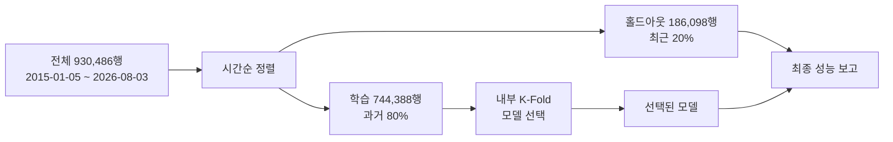
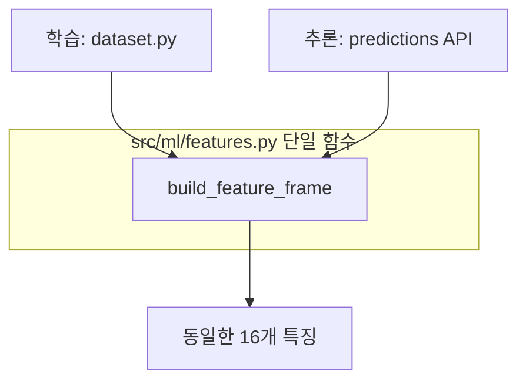

> **작성일**: 2026-08-03
> **버전**: v1.0.0
> **상태**: 설계 확정, 구현 미착수
> **대상**: 용역(Servc) 낙찰률 예측 모델

# 용역 낙찰률 예측 모델 설계서

## 1. 배경

현재 서빙 중인 모델 3종은 어느 것도 용역 전용이 아닙니다.

| 모델 | 라벨상 담당 | 실제 학습 데이터 |
| --- | --- | --- |
| `ssh_hist_premium` | 용역 | 외부 CSV 22,893행, 타깃 누수 확인 |
| `quantum_leap_v25_pro` | 물품 | 2025 물품셋 76,527행 (건설·용역 15% 혼입) |
| `v25` | 건설·외자 | `data_scope: all` 15,000행 |

2026-08-03 백필로 용역 조인 표본이 **약 3만 건에서 92만 건**으로 늘었고,
예정가격·기초금액 보유율이 99.60% 가 되었습니다. 카테고리별로 나눠 학습한
실측에서 특성 차이가 뚜렷했습니다.

| 카테고리 | 표본 | R2 |
| --- | ---: | ---: |
| 용역 | 925,031 | **0.5519** |
| 물품 | 784,266 | 0.3480 |
| 전체 혼합 | 3,068,179 | 0.3627 |
| 건설 | 1,358,882 | **-0.1094** |

혼합 학습(0.3627)이 용역 전용(0.5519)보다 나쁘고, 건설은 R2 가 음수입니다.
**카테고리를 섞으면 서로를 망칩니다.** 용역 전용 설계의 근거입니다.

---

## 2. 문제 정의

### 2.1 타깃은 낙찰금액이 아니라 낙찰률입니다

| 대상 | 낙찰금액과의 상관 |
| --- | ---: |
| 예정가격 | **+0.9816** |
| 낙찰률 | +0.0049 |

낙찰금액은 예정가격이 98% 설명합니다. 금액을 타깃으로 두면 R2 는 높게 나오지만
예정가격을 되풀이할 뿐 정보가 없습니다. 타깃은 **낙찰률(`sucsf_bid_rate`)** 로 둡니다.

금액이 필요한 소비자에게는 `예측 낙찰금액 = 기초금액 x 예측 낙찰률 / 100` 으로
환산해 제공합니다.

### 2.2 낙찰률의 기준 금액은 기초금액입니다

`낙찰금액 / 기준금액 x 100` 이 실제 낙찰률과 얼마나 일치하는지 잰 결과입니다.

| 기준 금액 | 오차 0.5%p 이내 비율 | 중앙 오차 |
| --- | ---: | ---: |
| 예정가격 (`presmpt_prce`) | 1.78% | 8.653%p |
| **기초금액 (`base_amount`)** | **51.08%** | **0.485%p** |

기초금액 기준이 맞습니다. 다만 일치율이 51% 에 그치므로 **낙찰률이 단일 산식으로
결정되지 않습니다.** 낙찰 방식(적격심사, 협상에 의한 계약 등)에 따라 기준이
달라지는 것으로 보이며, 이것이 범주형 특징이 필요한 이유입니다.

### 2.3 타깃 분포

| 통계 | 값 |
| --- | ---: |
| 평균 | 89.96 |
| 표준편차 | 4.52 |
| 중앙값 | 88.25 |
| 사분위 범위 | 87.99 ~ 90.46 |

**분포가 매우 좁습니다.** 사분위 범위가 2.5%p 에 불과합니다. 평균만 답해도
RMSE 4.5 는 나오므로, R2 를 기준으로 삼아야 개선을 제대로 잽니다. RMSE 단독
비교는 착시를 부릅니다.

정제 규칙은 `50 < y < 120` 입니다. 원표본 932,624행 중 2,138행(0.23%)이
제거되어 930,486행이 남습니다.

---

## 3. 특징 설계

### 3.1 절제 실험 (2026-08-03 실측)

930,486행, 시간순 8:2 분할(학습 744,388 / 홀드아웃 186,098), LightGBM 동일
하이퍼파라미터입니다.

| 특징군 | R2 | RMSE | MAPE | 증분 |
| --- | ---: | ---: | ---: | ---: |
| A. 현행 8특징 | 0.5036 | 3.5892 | 2.2248 | 기준 |
| B. A + 범주형 3종 | 0.5536 | 3.4036 | 2.0962 | **+0.0500** |
| C. B + 금액 순위·분위 | 0.5717 | 3.3340 | 2.0716 | +0.0181 |
| **D. C + 기관x계약방법 이력** | **0.5961** | **3.2377** | **1.9751** | +0.0244 |
| E. D - log_price | 0.5952 | 3.2412 | 1.9805 | -0.0009 |

**D 를 채택합니다.** A 대비 R2 +0.0925, RMSE -9.8% 입니다.

E 가 D 와 거의 같으므로 `log_price` 는 순위 특징과 중복됩니다. 다만 제거해도
이득이 없어 유지합니다. 삭제는 특징 수가 문제될 때 첫 후보입니다.

### 3.2 왜 범주형이 가장 큰 증분인가

분산 설명력(eta^2) 실측입니다.

| 컬럼 | eta^2 | 범주 수 | 현행 사용 |
| --- | ---: | ---: | --- |
| `dminstt_nm` (수요기관) | **0.3239** | 15,767 | 이력값으로만 |
| `bid_methd_nm` (입찰방식) | **0.2438** | 7 | 미사용 |
| `cntrct_mthd_nm` (계약체결방법) | 0.0871 | 4 | 미사용 |
| `ntce_kind_nm` (공고종류) | 0.0363 | 3 | 미사용 |
| 금액 계열 전부 | 0.006 미만 | — | `log_price` 만 |

계약체결방법별 낙찰률입니다.

| 계약체결방법 | 건수 | 평균 | 표준편차 |
| --- | ---: | ---: | ---: |
| 수의계약 | 264,092 | 91.02 | 4.45 |
| 제한경쟁 | 100,235 | 89.08 | 6.54 |
| 일반경쟁 | 27,598 | 85.17 | 10.67 |
| 지명경쟁 | 8,035 | 84.87 | 3.55 |

수의계약과 일반경쟁이 **5.9%p** 차이납니다. 타깃 표준편차가 4.52 인 것을 감안하면
이 컬럼 하나가 표준편차보다 큰 차이를 만듭니다. 2026-08-03 에 수집기 필드명 오류를
고쳐 용역 99.96% 가 채워졌으므로 이제 쓸 수 있습니다.

### 3.3 금액은 선형이 아니라 순위 관계입니다

| 변수 | Pearson | Spearman |
| --- | ---: | ---: |
| 예정가격 | -0.0179 | **-0.2584** |
| 기초금액 | -0.0006 | **-0.2591** |

선형 상관은 0 인데 순위 상관은 -0.26 입니다. 금액이 클수록 낙찰률이 낮아지는
경향이 분명히 있으나 관계가 심하게 비선형이라 원본 값이나 로그로는 잡히지
않습니다. **백분위 순위(`price_rank`)와 20분위(`price_q`)로 넣습니다.**

`base_amount / presmpt_prce` 는 중앙값 1.1000 이지만 표준편차가 174만입니다.
극단 이상치가 있어 **[0.5, 2.0] 으로 절단**한 뒤 씁니다.

### 3.4 최종 특징 목록 (16개)

| 특징 | 설명 | 기여도 |
| --- | --- | ---: |
| `duration` | 공고~마감 일수, [0, 365] 절단 | 4,920 |
| `ic_hist` | 기관x계약방법 과거 낙찰률 평균 | 4,565 |
| `inst_hist` | 기관 과거 낙찰률 평균 | 4,200 |
| `log_price` | log1p(예정가격) | 4,105 |
| `inst_cnt` | 기관 과거 표본 수 | 3,982 |
| `base_ratio` | 기초금액/예정가격, [0.5, 2.0] 절단 | 3,394 |
| `ic_cnt` | 기관x계약방법 과거 표본 수 | 3,282 |
| `price_rank` | 예정가격 백분위 순위 | 1,764 |
| `month_cos`, `month_sin` | 개찰월 주기 인코딩 | 1,472 / 1,363 |
| `cntrct` | 계약체결방법 (범주형) | 1,078 |
| `wd_sin`, `wd_cos` | 개찰요일 주기 인코딩 | 825 / 676 |
| `kind` | 공고종류 (범주형) | 761 |
| `bidm` | 입찰방식 (범주형) | 434 |
| `price_q` | 예정가격 20분위 | 379 |

범주형은 LightGBM 의 `categorical_feature` 로 직접 넘깁니다. 원핫 인코딩은
`dminstt_nm` 처럼 범주가 많을 때 차원이 폭발하므로 쓰지 않습니다.

### 3.5 이력 특징의 누수 차단

기관 이력은 **자기 자신과 미래를 제외한** 과거 평균이어야 합니다.

```python
ordered = df.sort_values("openg_dt")
g = ordered.groupby("inst", sort=False)["y"]
hist = g.transform(lambda s: s.shift(1).expanding().mean())
count = g.transform(lambda s: s.shift(1).expanding().count())
```

`shift(1)` 이 자기 자신을, `expanding()` 이 미래를 배제합니다. 이 처리를 빠뜨리면
홀드아웃 R2 가 비현실적으로 높게 나옵니다. 기존 `ssh_hist_premium` 이 5폴드 중
3개에서 R2 0.9999999999999998 을 낸 것이 이 유형의 사고입니다.

---

## 4. 모델 선정

### 4.1 GBDT 를 씁니다. 딥러닝은 쓰지 않습니다

동일 조건 후보 비교 실측입니다.

| 모델 | CV avg R2 | 홀드아웃 R2 | 홀드아웃 RMSE |
| --- | ---: | ---: | ---: |
| **LightGBM** | **0.4621** | **0.5519** | **3.2122** |
| CatBoost | 0.4538 | 0.5472 | 3.2289 |
| Ridge | 0.3138 | 0.3935 | 3.7371 |

선형(Ridge)과 트리의 격차가 0.16 으로 큽니다. 관계가 비선형이고 범주형이
지배적이라는 뜻이며, 이는 GBDT 가 가장 잘 다루는 형태입니다.

딥러닝을 배제하는 근거입니다.

| 항목 | 판단 |
| --- | --- |
| 데이터 형태 | 정형 표 데이터. GBDT 우위가 잘 알려진 영역 |
| 표본 규모 | 92만 행. 신경망 우위가 나타나기엔 부족 |
| 지배 신호 | 고차 범주형(수요기관 15,767종). 임베딩 학습 비용 대비 이득 불명 |
| 학습 비용 | GBDT 전량 학습 41초. 재학습 주기 운영에 유리 |
| 해석 가능성 | 입찰 의사결정 지원이므로 기여도 설명이 필요 |

**신경망을 고려할 유일한 지점은 공고명 텍스트입니다.** 용역은 유형(청소·경비·
설계·시스템구축·연구)이 공고명에 드러나는데 범주 컬럼에 없습니다. 다만 이 경우에도
임베딩 모델을 새로 학습하지 않고 **기존 임베딩으로 벡터를 뽑아 GBDT 에 넣는**
방식을 씁니다. 프로젝트 규칙상 임베딩 모델 교체는 금지입니다.

### 4.2 하이퍼파라미터

절제 실험에서 쓴 값입니다. 튜닝은 특징 확정 이후 별도로 수행합니다.

| 항목 | 값 |
| --- | --- |
| `n_estimators` | 600 |
| `learning_rate` | 0.05 |
| `num_leaves` | 63 |
| `min_child_samples` | 40 |
| `subsample` / `colsample_bytree` | 0.8 / 0.8 |

---

## 5. 검증 설계

### 5.1 시간순 분할이 필수입니다

입찰은 시계열입니다. 무작위 분할은 미래 정보로 과거를 맞히게 되어 실제 운영보다
좋은 수치를 냅니다. `openg_dt` 로 정렬한 뒤 **뒤 20% 를 홀드아웃**으로 뗍니다.



### 5.2 모델 선택과 성능 보고를 분리합니다

홀드아웃으로 모델을 고르고 그 홀드아웃으로 성능을 보고하면 선택 편향이 들어갑니다.

| 단계 | 사용 데이터 | 목적 |
| --- | --- | --- |
| 모델 선택 | 학습 구간 내부 K-Fold `avg_r2` | 후보 중 하나 선택 |
| 성능 보고 | 홀드아웃 | 대외 보고 수치 |

기존 `trainer.py` 가 이미 이 구조입니다. 그대로 따릅니다.

### 5.3 이분산 대응

금액 구간별 오차 실측입니다(최고 모델 D 기준).

| 구간 | 건수 | 실제 평균 | MAE | 실제 표준편차 |
| --- | ---: | ---: | ---: | ---: |
| 최소 | 37,185 | 91.385 | 1.646 | 4.129 |
| 소 | 37,185 | 89.881 | 1.500 | 4.036 |
| 중 | 37,185 | 90.250 | 1.747 | 4.553 |
| 대 | 37,185 | 90.183 | 1.755 | 5.032 |
| 최대 | 37,185 | 89.670 | **2.113** | **6.965** |

큰 건일수록 실제 산포가 1.7배(4.13 -> 6.97), 오차가 1.4배 커집니다.

**대응은 구간 분할이 아니라 예측 구간 제공입니다.** 구간별로 모델을 나누면 표본이
쪼개져 이력 특징이 약해집니다. 대신 LightGBM 분위 회귀로 0.1 / 0.5 / 0.9 분위를
함께 학습해 **점 추정과 신뢰 구간을 같이 제공**합니다. 입찰가 결정에는 "90.2%"
보다 "88.5 ~ 92.0% 구간" 이 실질적으로 유용합니다.

성능 보고는 **반드시 구간별로 분해**합니다. 전체 평균 MAE 만 보면 큰 건의
성능 저하가 가려집니다.

---

## 6. 승격 기준

신규 모델은 champion 을 성능으로 압도할 때만 승격합니다(AGENTS.md 비협상 원칙).

| 조건 | 기준 |
| --- | --- |
| 필수 1 | 홀드아웃 R2 가 champion 대비 +0.01 이상 |
| 필수 2 | 최대 금액 구간 MAE 가 champion 대비 악화되지 않을 것 |
| 필수 3 | 내부 K-Fold `std_r2` 가 0.10 이하 (안정성) |
| 필수 4 | 어느 폴드도 R2 > 0.99 가 아닐 것 (누수 탐지) |
| 차단 | `holdout_is_overfit` 이 참이면 무조건 거부 |

필수 4 는 `ssh_hist_premium` 사고의 재발 방지 장치입니다.

승격은 자동으로 이뤄지지 않습니다. 챌린저를 registry 에 남기고 권고만 기록하며,
champion 교체는 담당자가 판단합니다. 롤백은 이전 버전 디렉터리를 champion 으로
되돌리는 것으로 즉시 가능합니다.

---

## 7. 운영 연결

### 7.1 train/serve 특징 단일화

AGENTS.md 금지 6항입니다. 학습과 추론의 특징 생성 로직을 분리하면 train/serve
skew 가 발생합니다.



신규 특징 8종(`ic_hist`, `ic_cnt`, `price_rank`, `price_q`, `base_ratio`,
`cntrct`, `bidm`, `kind`)을 **`features.py` 에만** 추가합니다.

### 7.2 추론 시점의 제약

이력 특징과 순위 특징은 추론 시점에 계산할 수 없습니다. 사전 집계가 필요합니다.

| 특징 | 학습 시 | 추론 시 |
| --- | --- | --- |
| `inst_hist`, `inst_cnt` | 확장평균 | `institution_win_rate_stats` 조회 |
| `ic_hist`, `ic_cnt` | 확장평균 | 신규 집계 테이블 필요 |
| `price_rank`, `price_q` | 전체 순위 | 학습 시점 분위 경계를 저장해 적용 |

`price_rank` 를 추론 시점에 다시 계산하면 기준이 달라져 skew 가 발생합니다.
**학습 때의 분위 경계를 모델 아티팩트와 함께 저장**하고 추론은 그것을 씁니다.

### 7.3 데이터셋 조인 확장

현재 `src/ml/dataset.py` 의 SELECT 에 범주형 3종이 빠져 있습니다.
`cntrct_mthd_nm`, `bid_methd_nm`, `ntce_kind_nm` 을 추가합니다.

차수 조인은 기존 `_normalized_ord` 를 그대로 씁니다. 공고 API 는 3자리(`000`),
낙찰 API 는 2자리(`00`) 로 내려주므로 정규화 없이는 조인율이 3.4% 로 떨어집니다.

---

## 8. 이행 계획

| 단계 | 작업 | 완료 기준 |
| --- | --- | --- |
| 1 | `dataset.py` 에 범주형 3종 추가 | 데이터셋에 3컬럼 존재, 결측률 1% 미만 |
| 2 | `features.py` 에 신규 특징 8종 추가 | 학습·추론이 같은 함수를 쓸 것 |
| 3 | 기관x계약방법 집계 테이블 추가 | 마이그레이션 적용, 추론 조회 동작 |
| 4 | 분위 경계 아티팩트 저장 | 재현 검증 통과 |
| 5 | 용역 전용 모델 학습·등록 | 홀드아웃 R2 0.59 이상 재현 |
| 6 | 분위 회귀 3종 추가 | 구간 포함률 실측 |
| 7 | 서빙 연결 | 담당자 승인 후 |

1~5 단계까지가 이번 설계의 범위입니다. 6~7 은 별도 판단이 필요합니다.

---

## 9. 미검증 항목

측정하지 않은 것은 설계에 반영하지 않았습니다. 후속 검증 대상입니다.

| 항목 | 가설 | 검증 방법 |
| --- | --- | --- |
| 공고명 텍스트 | 용역 유형이 낙찰률을 가름 | 기존 임베딩 벡터를 특징에 추가해 R2 증분 측정 |
| 지역 정보 | 지역 제한 경쟁이 낙찰률에 영향 | 기관명에서 지역 추출 후 eta^2 측정 |
| 참여업체 수 | 경쟁 강도가 직접 영향 | G2B 에 해당 필드가 있는지 확인 선행 |
| 하이퍼파라미터 | 튜닝 여지 있음 | 특징 확정 후 탐색 |
| 예산 대비 낙찰 추세 | 연도별 낙찰률 하락 추세 존재 가능 | 연도 특징 추가 시 증분 측정 |

참여업체 수는 이 중 가장 유망합니다. 낙찰률은 본질적으로 경쟁 강도의 함수인데
현재 특징에 경쟁 관련 정보가 전혀 없습니다. G2B 응답에 해당 필드가 있는지
확인이 선행돼야 합니다.

---

## 10. 요약

| 항목 | 결정 | 근거 |
| --- | --- | --- |
| 타깃 | 낙찰률 (기초금액 기준) | 금액은 예정가격이 98% 설명 |
| 모델 | LightGBM | Ridge 대비 +0.16, CatBoost 대비 +0.005 |
| 딥러닝 | 사용 안 함 | 정형 데이터, 92만 행, 범주형 지배 |
| 특징 | 16개 (특징군 D) | A 대비 R2 +0.0925 |
| 분할 | 시간순 8:2 | 시계열이므로 무작위 분할은 부정확 |
| 이분산 | 분위 회귀로 구간 제공 | 최대 구간 산포가 최소의 1.7배 |
| 목표 성능 | 홀드아웃 R2 0.59 이상 | 절제 실험 실측 0.5961 |
