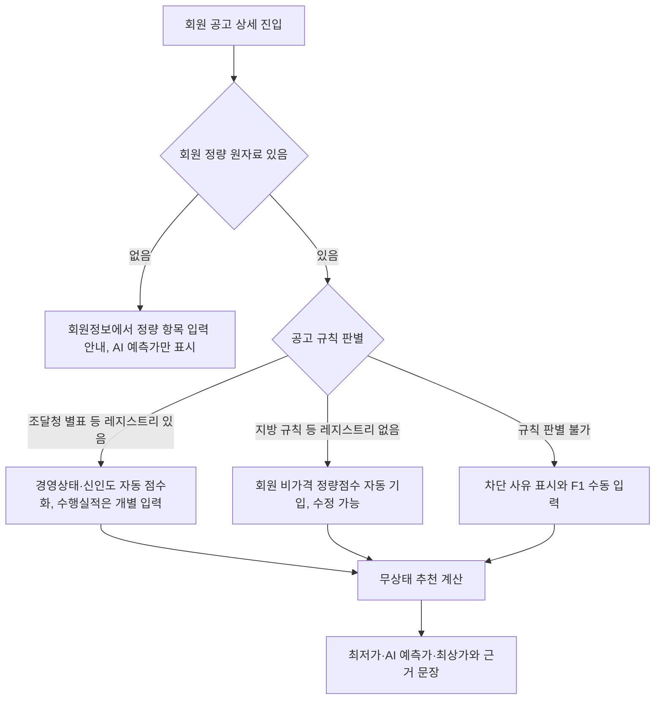

# 웹 브라우저 사용자 피드백 반영 개정 설계서

> **작성일**: 2026-10-06
> **버전**: 0.3 (2026-10-01 수정 설계서 0.2 와 정적 검증 보고서를 현재 코드 기준으로 개정)
> **상태**: 사용자 결정 4건 반영 완료, 구현 착수 전 데이터 확보 1건 남음(5.3)
> **기준 커밋**: `1dc6f02e` (main)
> **선행 문서**: `웹_브라우저_사용자_피드백_수정_설계서_20261001.md`, `웹_브라우저_사용자_피드백_설계서_정적검증_20261001.md`(저장소 밖, 사용자 다운로드 폴더)

---

## 1. 개정 사유

| 사유 | 내용 |
| --- | --- |
| 사용자 결정 | 2026-10-06 사용자가 미확정 4건(업종, 지역, 난수, 입력 우선순위)을 결정했다(2장). |
| 기준 시점 | 0.2 판은 2026-10-01 코드 기준이다. 이후 지방 규칙 47개, 구간별 낙찰하한율, 조달청 평탄, 입찰 상세의 지방계약 수동 입력(F1, `f51b5460`)이 병합됐다. |
| 원문 해석 오류 | 0.2 판은 업종을 '전체' 기본 선택 필터로, 지역 제한을 기관명 지역 검색으로 해석했다. 둘 다 원문과 다르다. |

---

## 2. 사용자 결정 (2026-10-06)

| 번호 | 항목 | 결정 |
| --- | --- | --- |
| D-W1 | 업종 | DB 에 저장된 공고 중 4개 업종(파견, 경비업, 위생관리용역업, 유료직업소개업) 공고만 프런트엔드에 렌더링한다. 목록 자체를 4개 업종으로 한정하고, 그 안에서 업종을 골라 좁힌다. 정량평가 적용 여부와 무관하게 해당 업종으로 입찰할 수 있는 모든 공고가 대상이다. |
| D-W2 | 지역 제한 | 공고의 참가가능지역이 기준이다. 사용자는 공고 발주처의 지역 정보와 참가 지역 제한을 함께 확인하려 한다. 기본값은 전체다. |
| D-W3 | 난수 | 나라장터 입찰에는 난수가 두 군데 있다. (1) 복수예비가격 15개 중 추첨으로 정해지는 예정가격(사정률) (2) 참가업체 수. |
| D-W4 | 입력 우선순위 | 회원가입 때 정량평가 측정 항목을 미리 기입하고, 회원이 공고를 조회하면 정량평가가 자동 기입되어 지표를 바로 알 수 있어야 한다. |

---

## 3. 현재 코드 사실 (2026-10-06 확인)

| 영역 | 사실 | 근거 |
| --- | --- | --- |
| 업종 데이터 | 면허제한은 `bid_announcement_license_limits.lcns_lmt_nm`('명칭/코드' 형식)과 `permsn_indstryty_list` 에 있다. 목록 API 는 면허 코드 최대 10개를 OR 로 검색한다. | `src/app/services/bid_queries.py` |
| 위생관리 코드 | 1162 는 건물위생관리업, 1167 은 기계경비업무다(실데이터 `lcns_lmt_nm`). 0.2 판 정적 검증이 남긴 1162/1167 의문은 해소됐다. | 4.1 표 |
| 지역 필터 | 현재 지역 필터는 수요기관명·공고기관명 부분 문자열로 지역을 판정한다. 참가제한 지역이 아니다. | `src/app/services/bid_queries.py:262` |
| 참가가능지역 | `bid_announcement_participation_regions.prtcpt_psbl_rgn_nm` 에 수집된다. 2026년 용역 공고 162,128건 중 56,820건에 행이 있다. 지금은 공고 상세에서만 읽고 목록 검색에는 쓰지 않는다. | `src/app/services/bid_queries.py:799` |
| 낙찰 결과 | `bid_results` 에는 낙찰금액, 낙찰률, 참가업체 수(`raw_data.prtcptCnum`)가 있고 예정가격·기초금액·복수예비가격은 없다. 따라서 과거 사정률을 지금 데이터로는 계산할 수 없다. | `bid_results` 컬럼·raw 키 |
| 복수예가 시나리오 | 평가 엔진은 기초금액 ±2%(국가)·±3%(지방) 이론 범위로 3대 예가 시나리오를 만든다. 과거 실측 분포가 아니다. | `src/app/services/evaluation_scoring.py:292` |
| 정량평가 자동 점수 범위 | 정량평가 레지스트리는 조달청 규칙에만 있다. 지방 규칙 47개는 '기관 원문 미반영' 이라 비가격 점수를 `manual_non_price_score` 로 받는다. | `src/app/services/evaluation_rules.py` |
| 입찰 상세 입력 | F1 이 지방계약 차단 해제용 수동 입력(기준비율, 용역 세부유형, 비가격 정량점수)을 추가했다. 차단 응답이 와야 보인다. | `src/app/templates/bids/detail.html` |
| 결격 기본값 | 정량평가 요청의 `disqualification` 기본값이 `False` 다. | `src/app/schemas/evaluations.py:106` |
| 분석 API | `candidate_bid_amount` 가 필수이고, 상세 화면은 진입 시 1원으로 호출하며, 차단 응답도 스냅샷으로 저장한다. | `src/app/schemas/evaluations.py:276`, `detail.html:1622`, `evaluations.py:1454` |

---

## 4. 공고 목록

### 4.1 업종 한정 (D-W1)

4개 업종을 면허 코드 묶음으로 정의하고, 목록 쿼리의 기본 조건을 이 묶음의 합집합으로 둔다. 화면의 업종 선택은 이 합집합 안에서만 좁힌다. 입찰 분야 선택란은 화면에서 제거하고 내부 `category` 분류는 유지한다.

| 업종 그룹 | 포함 코드(실데이터 관측 명칭) | 면허제한 행 수(전체 기간) |
| --- | --- | ---: |
| 파견 | 1172 근로자파견사업 | 660 |
| 경비업 | 1164 시설경비업무, 1167 기계경비업무, 1165 호송경비업무, 1168 특수경비업무, 2775 혼잡·교통유도경비업무 | 2,148 |
| 위생관리용역업 | 1162 건물위생관리업 | 4,138 |
| 유료직업소개업 | 5603 국내유료직업소개사업, 5604 국외유료직업소개사업 | 163 |

- 제외: 7740 가축방역위생관리업(건물위생관리와 다른 업종), 5601·5602 무료직업소개사업(원문이 '유료' 로 한정). 제외 판단은 구현 리뷰에서 사용자 확인을 받는다.
- 매핑은 코드 상수 한 곳에 두고 시험으로 고정한다. 명칭 부분 문자열 검색으로 연결하지 않는다.
- 면허제한 행이 없는 공고는 4개 업종 목록에서 빠진다. '업종 제한 정보 없음' 공고를 업종 공고로 추정하지 않는다.
- 업종 선택은 복수 선택을 허용한다(기존 API 가 OR 검색을 지원). 기본은 4개 업종 전체다.

### 4.2 지역 제한 (D-W2)

| 항목 | 설계 |
| --- | --- |
| 필터 이름 | `지역 제한`, 기본값 `전체` |
| 필터 기준 | `bid_announcement_participation_regions.prtcpt_psbl_rgn_nm` 에 선택 지역이 포함된 공고. 수요기관명 기반의 기존 지역 필터와 바꾼다. |
| 목록 표시 | 공고마다 발주처 지역(수요기관 소재 시·도)과 참가가능지역을 함께 표시한다. |
| 행 없음 | 참가가능지역 행이 없는 공고는 '참가 지역 제한 정보 없음' 으로 표시하고, 지역 필터를 고르면 결과에서 뺀다. 제한 없음으로 단정하지 않는다. |
| 정렬 | 기존 `region` 정렬은 발주처 지역 기준으로 유지한다. |

구현 시 '참가가능지역 행 없음' 이 '지역 제한 없음' 인지 '미수집' 인지 수집 API 응답으로 구분할 수 있는지 먼저 조사한다. 구분되면 두 상태를 따로 표시한다.

---

## 5. 입찰 상세: 투찰가 계산

### 5.1 입력 흐름 (D-W4)

- 별도 '분석 실행' 영역과 '내 투찰 금액' 입력은 제거한다. 입력이 바뀌면 디바운스 후 다시 계산한다.
- F1 수동 입력은 유지하되, 회원 원자료가 있으면 그 값을 미리 채워 둔다. 회원 원자료가 없거나 규칙 판별이 막힌 공고에서만 수동 입력이 주 경로가 된다.
- 결격사유 체크박스는 제거한다. 서버 계약을 바꿔 결격 입력이 없으면 '미확인' 으로 다루고, 결과는 '가격·정량 점수 계산 결과' 로 한정한다(정적 검증 4.3).

### 5.2 회원 정량 원자료 (D-W4)

| 원자료 | 가입 시 입력 | 공고 조회 시 |
| --- | --- | --- |
| 경영상태 | 신용평가등급, 평가일 | 조달청 별표 공고는 레지스트리 기준표로 자동 환산. 레지스트리가 없는 공고는 회원이 입력한 비가격 정량점수에 포함 |
| 신인도 | 해당 가감점 항목 체크 | 경영상태와 같은 방식 |
| 수행실적 | 입력하지 않음 | 공고마다 개별 입력, 입력란 아래 해당 공고의 산정 기준 표시 |
| 비가격 정량점수(기관 원문 미반영 공고용) | 회사 기본값 1개 | 지방 규칙 공고에 자동 기입, 공고별 수정 가능 |

- 저장은 신규 테이블(`account_company_profiles`, `account_qualification_facts`, `account_consent_events`)로 하고 기존 `accounts_customuser` 는 바꾸지 않는다. 기존 `bid_evaluation_profiles` 는 공고별 수정값 저장소로 두고, 우선순위는 공고별 수정값 > 회원 원자료 > 빈 값이다.
- API 가입과 SSR 가입을 함께 바꾸고, 계정·회사·원자료·동의 기록을 한 트랜잭션으로 저장한다.
- '테스트 회원' 은 시연·검증 환경에서 원자료가 채워진 계정을 시드 스크립트로 만든다. 운영 DB 에 시험 계정을 넣지 않는다.

### 5.3 최저가·AI 예측가·최상가 (D-W3)

| 명칭 | 정의 |
| --- | --- |
| AI 예측가 | 현재 예측 API 의 `optimal_price`. 근거 문장에 발주처 과거 평균 낙찰률, 유효 표본 수, 기본값 대체 여부를 함께 쓴다. |
| 최저가 | 사정률 난수가 '기존 낙찰 데이터' 의 최저일 때 정해지는 예정가격에서, 회원 정량점수를 반영해 통과점수를 넘기는 가장 낮은 투찰금액(낙찰하한율 이상). |
| 최상가 | 사정률 난수가 '기존 낙찰 데이터' 의 최고일 때 정해지는 예정가격에서, 회원 정량점수를 반영해 통과점수를 넘기는 가장 높은 투찰금액. |

- 통과 투찰률 구간은 기존 `invert_pass_bid_range`(평탄·구간별 하한율 반영)를 재사용한다. 필요 가격점수 = 통과점수 − 회원 정량점수다.
- '기존 낙찰 데이터' 의 사정률 범위는 같은 발주처(표본 부족 시 같은 시·도·업종) 과거 공고의 예정가격 ÷ 기초금액 최솟값·최댓값이다.
- **데이터 확보 필요(구현 선행)**: 현재 DB 에는 과거 예정가격·기초금액이 없다. 나라장터 개찰결과 예비가격 상세 정보를 신규 테이블로 수집해야 한다. 수집 전에는 기존 이론 범위(기초금액 ±2%/±3%)로 계산하고 '과거 실측 아님' 을 표시한다.
- 참가업체 수 난수는 금액 산식에 넣지 않는다. 근거 문장에 발주처 과거 참가업체 수(`prtcptCnum`)의 평균과 범위를 보여 준다. 낙찰 확률로 환산하지 않는다.

### 5.4 근거 문장

| 결과 | 문장 형식 |
| --- | --- |
| AI 예측가 | 발주처의 기존 낙찰 데이터 N건 분석 시 평균 XX.XX%의 낙찰률을 보이며, 금번 입찰의 낙찰률은 YY.YY%로 예측했습니다. (표본 부족 시: 표본이 부족해 시·도 평균으로 대체했습니다.) |
| 최저가 | 해당 공고는 가격점수 B점, 정량평가 Q점, 낙찰 통과점수 T점입니다. 귀사의 정량평가 점수는 S점(경영상태 a점, 신인도 b점 등)으로 가격점수는 P점 이상이어야 합니다. 과거 사정률 최저(R%) 기준 예정가격에서 이를 충족하는 최저 투찰금액입니다. |
| 최상가 | 앞부분은 최저가와 같고 마지막 문장을 '과거 사정률 최고(R%) 기준 예정가격에서 이를 충족하는 최고 투찰금액입니다.' 로 쓴다. |
| 공통 | 과거 참가업체 수 평균 n개사(범위 a~b). 결격사유는 확인하지 않은 계산입니다. |

B·Q·T 는 공고 규칙에서 가져온다. 85/15/85 를 고정값으로 쓰지 않는다.

---

## 6. API 경계 (정적 검증 4.1 반영)

| 경로 | 역할 | 저장 |
| --- | --- | --- |
| 규칙 메타 조회(신규 또는 기존 확장) | 공고 규칙, B·k·T 상태, 필요한 입력 항목 | 없음 |
| 무상태 추천 계산(신규) | AI 예측가, 최저가·최상가, 근거 문장 재료를 한 번에 계산 | 없음 |
| 분석 저장(기존 `/evaluations/analyze`) | 사용자가 명시적으로 저장할 때만 | 스냅샷 |

상세 화면의 진입 시 1원 호출은 규칙 메타 조회로 바꾼다.

---

## 7. 구현 순서

| 단계 | 작업 | 선행 |
| --- | --- | --- |
| 1 | 업종 매핑 상수와 목록 기본 한정, 지역 제한 필터·표시 교체 | 4.1 제외 업종 사용자 확인 |
| 2 | 회원 원자료 테이블·가입 확장(API, SSR), 시드 시험 계정 | 없음 |
| 3 | 결격 미확인 계약, 규칙 메타 조회, 무상태 추천 계산 API | 2 |
| 4 | 개찰결과 예비가격 수집과 사정률 분포 | 수집 API 조사 |
| 5 | 상세 화면 개편(자동 기입, 실행 영역 제거, 세 금액과 근거 문장) | 3, 4(4 이전에는 이론 범위로) |

각 단계는 독립 리뷰와 mock 없는 API 끝단 시험을 거친다. 화면 변경은 로그인 화면이라 렌더 HTML 대조와 끝단 시험으로 검증한다.

---

## 8. 남은 확인

| 항목 | 담당 |
| --- | --- |
| 4.1 제외 업종(가축방역위생관리업, 무료직업소개사업) 확정 | 사용자 |
| 참가가능지역 '행 없음' 의 의미(제한 없음 / 미수집) | 구현 조사 |
| 개찰결과 예비가격 상세 수집 API 와 과거분 소급 범위 | 구현 조사 |
| 홈페이지 이미지 샘플과 적용 위치(로그인 후 대시보드) | 사용자 |
