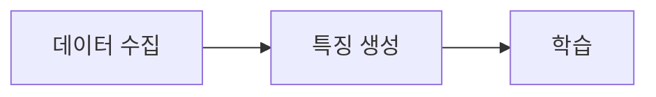

# 문서화 규칙

> **작성일**: 2026-07-31
> **상태**: 확정

---

## 1. 언어 및 어조

- 모든 설명은 **한국어(존댓말/경어체)** 로 작성합니다.
- 코드 블록, 변수명, 환경변수명, 클래스명, 파일명은 영어 그대로 유지합니다.

---

## 2. 마크다운 구조

- 제목: `#`
- 섹션: `##`
- 하위 섹션: `###`
- 주요 섹션 사이에 구분선(`---`) 삽입.
- 비교 데이터, 설정값, 매핑은 **표(Table)** 를 우선 사용.
- 핵심 개념, 버전, 수치는 굵게(`**텍스트**`) 처리.

---

## 3. 메타데이터 패턴

새 문서 상단에 인용 블록(`>`)으로 메타데이터를 명시합니다.

```
> **작성일**: 2026-07-31
> **버전**: v0.1.0
> **상태**: 설계
> **관련**: [링크]
```

---

## 4. 다이어그램 (Mermaid)

- 아키텍처, 타임라인, 프로세스 설명 시 `mermaid` 코드 블록 사용.
- 노드 텍스트에 공백/특수문자 포함 시 큰따옴표(`"텍스트"`)로 감쌉니다.
- 긴 텍스트는 `<br/>` 태그로 줄바꿈합니다.



---

## 5. 코드 예시

코드블록 앞에 파일 경로를 주석으로 명시합니다.

```python
# src/ml/features.py
def build_feature_frame(raw_df):
    ...
```

---

## 6. 교차 참조

- 다른 문서 참조는 상대경로 마크다운 링크 형식: `[이름](../folder/file.md)`.
- 설계서는 관련 기준 문서(테스트 명세, 환경변수 등)를 섹션/번호로 명시 참조합니다.

---

## 7. 금지 사항

- **이모지(Emoji)** 사용은 어떤 경우에도 허용되지 않습니다.
- 실제 시크릿 값(API 키, 비밀번호) 기록 금지.
