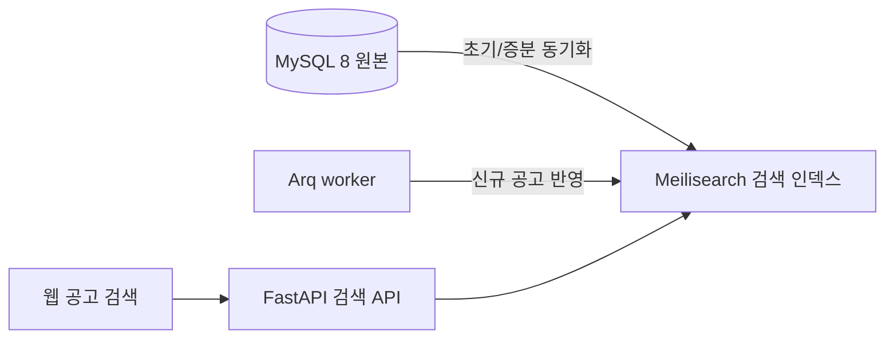

# 공고 검색 성능 개선 인수인계

> **작성일**: 2026-08-09
> **상태**: 구현·초기 전체 색인·검색 실측 완료
> **우선순위**: 웹 공고 검색 응답시간 개선

---

## 1. 문제와 확인된 원인

웹 공고 목록의 키워드 검색은 `src/app/services/bid_queries.py`의
`list_announcements` 경로를 사용합니다. 현재 검색 조건은 공고명·공고번호·수요기관에
선행 와일드카드가 있는 `LIKE '%검색어%'`를 사용합니다.

2026-08-09에 `q=청소`, `category=Servc`, `region=seoul`로 실행 계획을 확인한 결과,
MySQL은 카테고리 인덱스만 사용하고 약 1,089,659행을 검사했습니다. 공고별 최신
레코드를 고르는 상관 서브쿼리도 후보 행마다 실행됩니다. 일반 B-tree 인덱스 추가만으로는
선행 와일드카드 검색을 해결할 수 없습니다.

## 2. 시도 후 중단한 MySQL Full-Text 방식

별도 작업 트리 `feat/bid-search-fulltext`에서 MySQL `ngram` Full-Text 인덱스를
`bid_announcements`와 `bid_results`에 추가하는 마이그레이션을 준비했습니다. 단위 및
회귀 테스트는 마이그레이션 적용 전 기준으로 통과했으나, 실제 546만 행
`bid_announcements`에 인덱스를 생성하는 과정에서 Docker MySQL이 다음 오류로
중단·자동 재시작했습니다.

```text
fsync() returned EIO, aborting
ALTER TABLE bid_announcements ADD FULLTEXT INDEX ... WITH PARSER ngram
```

복구 후 확인 결과는 다음과 같습니다.

| 항목 | 결과 |
| --- | --- |
| MySQL 상태 | Docker 자동 재시작 및 crash recovery 완료, healthy |
| Alembic 버전 | `d4e5f6a7b8c9` 유지 |
| Full-Text 인덱스 | 생성되지 않음 |
| 원본 테이블 변경 | 확인되지 않음 |
| 백업 | `/tmp/refac_bid_box_search_index_backup/search_tables_before.sql` |

따라서 **Full-Text 마이그레이션·코드는 커밋하거나 병합하지 않았으며, 같은 방식의
DDL을 재시도하지 않습니다.** 대용량 인덱스 빌드가 Docker 파일시스템 I/O 한계를 다시
건드릴 위험이 있습니다.

## 3. 재개 방안: Meilisearch 별도 검색 인덱스

원본 MySQL을 검색 엔진으로 쓰지 않고 Meilisearch에 읽기 전용 복제 인덱스를 둡니다.
원본 테이블·컬럼·타입은 변경하지 않으므로 데이터 무손실 원칙을 지킵니다.



### 3.1 구현 범위

1. `docker-compose.yml`에 Meilisearch 서비스와 영속 볼륨을 추가합니다.
2. 공고·결과 데이터를 검색 전용 문서로 초기 색인하고, 수집 완료 뒤 Arq 작업으로
   증분 반영합니다.
3. 검색 API는 키워드 질의를 Meilisearch에 보내고, 카테고리·지역·날짜 필터와 페이지
   처리를 유지합니다.
4. 서비스 장애 때는 검색 결과를 성공처럼 비우지 않고 명시적 오류 및 관측 로그를
   남깁니다.
5. 웹 화면의 기존 검색 계약을 유지한 채 실제 응답시간과 결과 정합성을 검증합니다.

### 3.2 사전 결정 사항

- 신규 Docker 서비스와 이미지 도입이므로 구현 시작 전 담당자의 명시 승인이 필요합니다.
- Meilisearch 인증키는 `.env`에만 두고 문서·로그·커밋에 실제 값을 기록하지 않습니다.
- 초기 색인은 약 900만 레코드 규모이므로 디스크 여유와 작업 시간에 맞춰 실행합니다.
- Full-Text 실험 작업 트리의 미커밋 변경은 참고용일 뿐 재사용하거나 병합하지 않습니다.

## 4. 예상 소요

| 구간 | 예상 |
| --- | ---: |
| Compose·동기화 태스크·API 구현 | 60~90분 |
| 초기 색인 및 한글 검색·필터 검증 | 40~70분 |
| 웹 연동·P95 측정·회귀 테스트 | 20~30분 |
| **총계** | **약 2~3시간** |

초기 색인 시간은 호스트 디스크 I/O와 MySQL 읽기 부하에 따라 달라집니다. DB가 바쁜
시간대에는 초기 색인을 피하고, 수행 전 백업·행 수·스키마 확인을 합니다.

## 5. 구현 결과 (2026-08-10)

| 항목 | 구현 위치 | 내용 |
| --- | --- | --- |
| Compose | `docker-compose.yml` | 영속 볼륨을 쓰는 `meilisearch` 서비스를 추가했습니다 |
| 설정 | `src/app/core/config.py` | `MEILI_ENABLED`, URL, 인증키, 타임아웃을 환경 변수로 분리했습니다 |
| 읽기 모델 | `src/app/services/search_index.py` | 공고 최신 차수와 낙찰 결과를 Meilisearch 문서로 변환·전체/증분 upsert 합니다 |
| 검색 API | `src/app/services/bid_queries.py` | 키워드 요청만 Meilisearch로 보내고, DB에서는 ID 목록으로 원본 행을 다시 읽어 기존 응답 계약을 보존합니다 |
| 수집 연계 | `src/tasks/run_mode_matrix.py` | `collect → search → rag` 순서로 최근 24시간 적재분을 멱등 upsert 합니다 |
| 장애 처리 | `src/app/api/v1/bids.py` | 검색 엔진 연결 실패는 빈 결과가 아닌 HTTP 503과 오류 로그로 드러냅니다 |

초기 전체 색인은 다음 명령으로 실행합니다. 실행 전에 `.env`의 `MEILI_MASTER_KEY`를
충분히 긴 무작위 값으로 설정해야 합니다. 실제 값은 문서나 커밋에 기록하지 않습니다.

```bash
uv run python scripts/verify_migration.py
uv run python scripts/sync_search_index.py
```

동기화는 원본 테이블을 읽기만 하며, 공고 문서의 ID는 `업무구분 + 공고번호`로 고정해
차수가 갱신될 때 이전 문서를 교체합니다. 색인 완료 뒤에는 `청소`, `미화`, 공고번호,
기관명, 지역·카테고리 필터를 실제 API로 대조하고 기존 경로와 P50/P95를 측정합니다.

### 5.1 초기 전체 색인·실측 결과

| 항목 | 결과 |
| --- | ---: |
| 최신 공고 문서 | 4,829,807건 |
| 낙찰결과 문서 | 3,405,950건 |
| 검색 문서 합계 | 8,235,757건 |
| `q=청소`, `cat=Servc`, `region=seoul` 30회 P50 | 15.9ms |
| 같은 조건 30회 P95 | 47.5ms |
| 같은 조건 30회 P99 | 54.7ms |
| 검색 요청 오류 | 0건 |

원본 공고 전체 행 수와 최신 공고 문서 수가 다른 것은 의도된 동작입니다. 검색 읽기
모델은 동일 공고번호·업무구분에서 최신 차수만 남기므로, 이전 차수는 색인하지 않습니다.
`청소`, `미화`, 공고번호 및 기관명 검색과 지역·업무구분 필터를 Compose 앱의 실제 API에서
확인했습니다. MySQL 원본은 색인 전에 `verify_migration.py`를 통과했으며 검색 인덱스는
Meilisearch 전용 볼륨에만 기록됩니다.

## 6. 재개 순서와 완료 기준

1. `infrastructure-setup`, `data-preservation`, `validation-cutover`, `git-workflow`
   스킬을 읽고 적용합니다.
2. 새 작업 브랜치와 격리 worktree에서 구현합니다. 공유 루트 작업 트리의 미커밋 변경은
   건드리지 않습니다.
3. MySQL 원본 행 수·스키마를 기록하고 Meilisearch 색인 문서 수 및 표본 결과를 대조합니다.
4. `청소`, `미화`, 공고번호, 기관명, 지역·카테고리 필터를 실제 웹/API에서 검증합니다.
5. 기존 `LIKE` 경로와 Meilisearch 경로의 P50/P95를 동일 조건으로 측정합니다.
6. 전량 테스트, `python3 scripts/validate_agent_rules.py --quiet`, Compose 설정 검증을
   통과한 뒤 커밋·푸시합니다. 담당자 승인 후에만 `main`에 `--no-ff` 병합합니다.

완료 기준은 원본 DB 무변경, 검색 결과 정합성 표본 통과, 기존 기능 회귀 없음, 그리고
현재 수십 초 단위의 키워드 검색보다 실측 응답시간이 유의하게 개선된 상태입니다.
