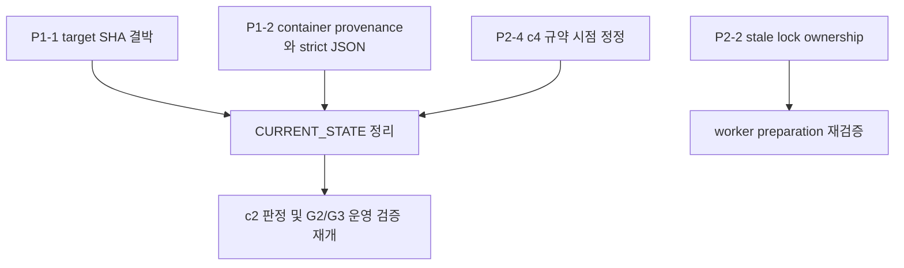

# 2026-08-22 최신 main 감사 인수인계

> **검토 범위**: `1a45ad5` 이후 `56fc9fb`까지 신규 27개 커밋
> **검토 방법**: 최신 `main`의 구현·원시 benchmark JSON·정본 문서를 직접 대조
> **판정**: 새 P0 없음. P1 2건을 최우선으로 수정하며, G3 전체 컷오버는 계속 보류합니다.

---

## 1. 검증된 완료 항목

| 항목 | 판정 | 근거 |
| --- | --- | --- |
| worktree 소속 검증과 `.env` 오복사 차단 | 종결 | `scripts/orca_prepare_worktree.py`가 양쪽 Git common directory 일치를 확인 |
| trust RMW의 원자적 갱신·기본 rollback | 대부분 종결 | lock, 임시 파일, atomic replace, backup/restore 및 회귀 테스트 존재 |
| ModelRegistry single-flight | 종결 | 별도 candidate registry 완성 뒤 swap하는 구현과 동시 lookup 테스트 존재 |
| c4 개별 게이트 | 통과 유지 | 기존 +10% 기준 36.81ms 아래인 worst P95 34.32ms. 전체 G3 통과를 뜻하지 않음 |

## 2. 확정된 미해결 항목

| 우선순위 | 항목 | 실제 확인 근거 | 조치 |
| --- | --- | --- | --- |
| P1-1 | verified merge target SHA 미결박 | `scripts/merge_verified_branch.py`는 evidence의 source commit만 현재 source ref와 대조하고 target commit은 기록·대조하지 않음 | finalize evidence에 `target_commit`을 의무화하고 merge 직전 현재 target SHA와 일치하지 않으면 merge 전 호출 자체를 거부. target 이동 회귀 테스트 추가 |
| P1-2 | benchmark container provenance 실패 | `scripts/benchmark_latency.py`가 존재하지 않는 Compose service `backend`를 조회. 실제 `predict_remeasure_20260822_c2_r1.json`과 A/B baseline JSON의 `docker_image_id`가 `unknown` | service `app` 조회만으로 끝내지 말고 harness SHA와 target container SHA/image ID/container ID를 분리 기록. 기대 대상 불일치·`unknown`은 측정 시작을 거부 |
| P2-1 | 운영 정본 stale | `docs/context/CURRENT_STATE.md`의 source commit은 `29d7bec`이며 HEAD는 `56fc9fb`; 완료한 worker preparation, single-flight, merge/evidence 작업을 Active Priorities로 남김 | 완료 항목을 종결 계열로 이동하고 이 문서의 P1/P2를 Active Priorities에 반영 |
| P2-2 | stale lock ownership 손상 | `scripts/orca_trust_worktree.py`가 stale lock을 unlink하고 finally에서 소유권 확인 없이 같은 경로를 unlink | UUID token 기반 소유권 확인 후 자기 lock만 삭제. stale 회수는 PID 생존 확인을 포함. 경쟁 회귀 테스트 추가 |
| P2-3 | strict JSON 위반 | 최신 원시 benchmark JSON에 `NaN` 존재, `json.dumps()`가 `allow_nan=False`가 아님 | 비표본 지표는 `null`로 정규화하고 strict serialization 사용. 모든 evidence를 strict parser로 검증 |
| P2-4 | c4 +2.0ms 규칙의 시점 표현 | A/B 실측 뒤 `e8f1f40`에서 추가됨 | c4 PASS는 기존 +10% 기준으로 유지. `+2.0ms`는 향후 실험용 prospective 규칙으로 표현하고 “사전 합의” 표현 제거 |

## 3. 보수적으로 유지할 판정

- c2 sequential gate는 P95 22.68ms로 기존 21.77ms 기준을 넘습니다. A/B 중앙 델타가 -0.97ms여도 현재 **미달** 상태를 유지합니다.
- G2 Windows Docker Desktop 실기 검증, Ollama/SSE c4, Arq 처리량 검증은 아직 미완료입니다.
- 현재 raw A/B baseline의 `git_sha`는 harness 실행 SHA일 뿐 baseline container 코드 SHA 증거가 아닙니다. provenance 수정 전에는 이 값을 target SHA로 사용하지 않습니다.

## 4. 권장 실행 순서와 의존성

1. P1-1을 먼저 수정·단위 테스트합니다. merge gate 신뢰성 문제이므로 다른 병합 전에 끝냅니다.
2. P1-2와 P2-3을 한 benchmark evidence Task로 묶어 container provenance와 strict JSON을 함께 검증합니다. Docker 측정 자원은 exclusive로 지정합니다.
3. P2-2는 별도 trust lock Task에서 token ownership과 stale-recovery 경쟁 테스트를 추가합니다.
4. P2-1/P2-4 문서 갱신은 위 코드 Task의 검증된 결과 뒤에 수행합니다.
5. 그 후에만 c2 disposition 및 G2/G3 운영 검증을 재개합니다.

## 5. 다음 코디네이터 지침

- P1-1과 P1-2는 서로 다른 파일이지만 둘 다 merge/evidence 신뢰 경계이므로 검증된 `worker_done` 전에는 병합하지 않습니다.
- P1-2 Task는 기존 raw evidence를 수정·재작성하지 않습니다. 새 스키마와 strict JSON 검증만 추가하고, 재측정은 새 provenance가 기록된 뒤 별도 Task로 실행합니다.
- P2-2 구현은 실제 사용자 `~/.gemini` 파일을 변경하지 않는 격리 테스트만 허용합니다.
- 문서 갱신에서 G3 전체 통과를 선언하지 않습니다.
