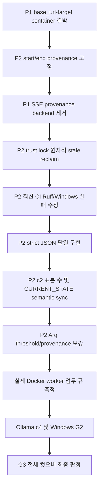

# 2026-08-23 최신 main 후속 감사 인수인계

> **검토 범위**: `56fc9fb` 이후 최신 `main` `9a46efe`까지 신규 29개 커밋
> **검토 방법**: 최신 `main` 구현·원시 benchmark JSON·정본 문서·GitHub Actions 결과 대조
> **판정**: P0 없음. provenance 결박 P1 1건과 P2 보완점이 남아 G3 전체 컷오버는 보류

---

## 1. 검증된 완료 항목

| 항목 | 판정 | 근거 |
| --- | --- | --- |
| verified merge target SHA 결박 | 종결 | `scripts/merge_verified_branch.py`, `target_commit` 회귀 테스트 |
| trust lock token ownership | 대부분 종결 | `scripts/orca_trust_worktree.py`의 UUID/PID token 및 자기 token 해제 |
| strict JSON 기능 | 기능 종결, 중복 잔존 | `scripts/_strict_json.py`와 benchmark evidence 적용 |
| c4 +2.0ms 규약 표현 | 종결 | 기존 +10% 판정선과 prospective 보조 지표를 분리 |
| Arq 합성 반복 게이트 | 제한적 PASS | 600건 3회, 최악 처리량 1,138.77 jobs/sec, P95 504.941ms, 실패율 0% |

Arq 결과는 Redis 연계 in-process 합성 하네스의 반복성 PASS입니다. 실제 Docker `worker` 업무 큐 또는 G3 전체 PASS를 의미하지 않습니다.

---

## 2. 확정된 미해결 항목

| 우선순위 | 항목 | 실제 확인 근거 | 조치 |
| --- | --- | --- | --- |
| **P1** | `base_url`과 실제 provenance container 미결박 | `scripts/benchmark_latency.py:102-147`은 `base_url`과 무관하게 Compose `app` 조회 | target container/name/ID와 image digest를 명시·검증하고 URL 대상과 결박 |
| **P1** | SSE provenance 서비스명 잔존 | `scripts/benchmark_sse_gate.py:331-345`가 존재하지 않는 `backend` 조회 | `app` 및 target provenance 정책으로 통합 |
| P2 | 측정 전후 provenance 재조회 | `benchmark_latency.py:512`, `build_evidence()`의 `:444` | start/end provenance를 기록하고 container/image 변경 시 무효화 |
| P2 | stale lock reclaim TOCTOU | `scripts/orca_trust_worktree.py:65-75`의 read→stat→unlink | 교체된 새 lock을 삭제하지 않는 원자적 회수 방식 도입 |
| P2 | 최신 CI 실패 | Run `32583897498`, `9a46efe` | Ruff 8건과 Windows `os.getloadavg`·`os.fork` 테스트 실패 수정 |
| P2 | strict JSON 이중 구현 | `scripts/benchmark_latency.py:52-71`, `scripts/_strict_json.py` | 공용 helper 하나로 통일 |
| P2 | `CURRENT_STATE` semantic stale | 완료된 작업이 Active Priorities에 잔존 | 완료 항목을 종결 계열로 이동하고 최신 CI·P1/P2 반영 |
| P2 | c2 표본 수 과대기재 | `docs/analysis/c2_disposition_20260822.md:54,62` | c2 단독 표본을 12,000에서 6,000으로 정정 |
| P2 | Arq absolute threshold 사후 calibration | `scripts/arq_gate.py`의 900/600/0 기준 | threshold 도출식과 calibration 성격을 명시 |
| P2 | Arq 환경 provenance 부족 | `data/benchmarks/arq_throughput_20260823.json:5-8` | host load, Redis/Arq, Docker image/container, worker 설정 기록 |

---

## 3. 보수적으로 유지할 판정

- c2 sequential gate P95 22.68ms는 기준 21.77ms를 초과하므로 **미달**을 유지합니다.
- c2 A/B 12,000 표본 표현은 c2 단독 기준으로는 무효이며, c2는 6,000건입니다.
- Arq 합성 하네스 반복 게이트는 제한적 PASS입니다. 실제 Docker `worker` 업무 큐와 분리합니다.
- 최신 GitHub Actions는 green이 아닙니다. Run `32583897498`의 lint와 Windows job이 실패했습니다.
- G2 Windows Docker Desktop, Ollama c4, 실제 worker 업무 큐, 단발 RAG 검증은 미완료입니다.
- `9.2/10` 같은 종합 점수는 산정식이 없으므로 정본 판정 수치로 사용하지 않습니다.

---

## 4. 권장 실행 순서와 의존성

1. `base_url ↔ 실제 target container ↔ image digest` 결박을 먼저 구현하고 회귀 테스트합니다.
2. benchmark start/end provenance를 고정하고 측정 중 container 교체를 거부합니다.
3. SSE benchmark의 `backend` 조회를 제거하고 동일한 provenance 신뢰 경계를 적용합니다.
4. trust lock stale 회수를 원자적으로 재설계하고 경쟁 테스트를 추가합니다.
5. 최신 CI의 Ruff 오류와 Windows 테스트 실패를 수정해 원격 CI를 green으로 만듭니다.
6. `benchmark_latency.py`의 strict JSON 중복 구현을 `_strict_json.py` 하나로 통합합니다.
7. c2 표본 수와 `CURRENT_STATE.md`의 완료/미완료 semantic state를 갱신합니다.
8. Arq threshold 도출식과 host/Redis/Docker/worker provenance를 문서화합니다.
9. 실제 Docker `worker` 업무 큐 처리량을 별도 측정합니다.
10. Ollama c4와 Windows Docker Desktop G2를 검증한 뒤에만 G3 전체 컷오버를 판정합니다.

---

## 5. 다음 코디네이터 지침

- 본 문서를 먼저 읽고 `docs/context/CURRENT_STATE.md`와 최신 `main`을 대조합니다.
- 새 작업은 새 Orca Run·Task·Dispatch로 등록하며 완료된 Task/Dispatch를 재사용하지 않습니다.
- P1 provenance Task는 Docker 측정 자원을 `exclusive`로 선언합니다.
- 기존 raw evidence JSON은 수정하지 않고 새 provenance 스키마와 새 측정 파일을 사용합니다.
- P1/P2 코드 변경은 `uv run pytest tests/ -q`, `python3 scripts/validate_agent_rules.py --quiet`, Ruff, Bandit을 통과해야 합니다.
- G1 무손실, main 최종 병합, G3 전체 컷오버는 코디네이터가 직접 diff와 원시 evidence를 대조합니다.
- 기본 코디네이터는 Codex `gpt-5.6-terra / medium`입니다. 모델 변경 시 `MODEL_CHANGE_NOTICE`를 먼저 기록합니다.

---

## 6. 세션 상태

이번 세션에서는 구현을 시작하지 않고 후속 작업 순서만 기록합니다. 다음 세션에서 4장의 순서대로 재개합니다.
