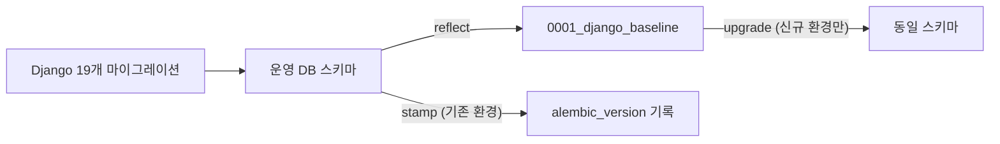

# 원본 Django 마이그레이션 히스토리 (19개)

> **작성일**: 2026-08-02
> **버전**: v1.0.0
> **상태**: 보존 기록 (G1 데이터 무손실)
> **원본 경로**: `bid_box/apps/<app>/migrations/`

---

## 1. 목적

이식본은 Django ORM 을 SQLAlchemy 로 바꾸면서 Django 마이그레이션 실행 체계를 쓰지 않습니다. 그러나 `docs/design/REFACTORING_DESIGN.md:297` 이 지적하듯 **히스토리가 단절되면 스키마 상태의 단일 정보원이 사라집니다.**

이 문서는 원본 19개 마이그레이션의 목록과 각각이 무엇을 바꿨는지를 남겨, Alembic 기준선(`0001_django_baseline`)이 정확히 어떤 상태를 뜻하는지 추적할 수 있게 합니다.

운영 DB 의 `django_migrations` 테이블도 **삭제하지 않고 그대로 둡니다.** Alembic 은 이 테이블을 관리 대상에서 제외합니다 (`migrations/env.py` 의 `include_object`).

---

## 2. 적용 이력

운영 DB `django_migrations` 기준입니다. 전체 54건 중 프로젝트 앱 소속 19건입니다. 나머지 35건은 Django 기본 앱(`auth`, `admin`, `contenttypes`, `sessions`, `sites`, `socialaccount`, `account`)의 것입니다.

| 순서 | 앱 | 마이그레이션 | 변경 내용 |
| ---: | --- | --- | --- |
| 1 | accounts | `0001_initial` | `accounts_customuser` 생성 (닉네임, 생년월일, 성별 확장) |
| 2 | bids | `0001_initial` | `bid_announcements`, `bid_results` 생성 |
| 3 | bids | `0002_alter_bidresult_collected_at_and_more` | `collected_at` 등 필드 속성 조정 |
| 4 | bids | `0003_biddatasetsummary` | `bid_dataset_summaries` 생성 |
| 5 | bids | `0004_bidannouncement_base_amount` | `base_amount`(기초금액) 컬럼 추가 |
| 6 | bids | `0005_alter_bidannouncement_presmpt_prce` | `presmpt_prce` 필드 속성 변경 |
| 7 | bids | `0006_prefer_presmpt_prce_for_base_amount` | 기초금액 산출 시 `presmpt_prce` 우선 (데이터 마이그레이션) |
| 8 | bids | `0007_restore_base_amount_priority` | 위 결정을 되돌림 (데이터 마이그레이션) |
| 9 | bids | `0008_strict_base_amount_mapping` | 기초금액 매핑 규칙 확정 (데이터 마이그레이션) |
| 10 | bids | `0009_bidresult_list_sort_indexes` | 목록 정렬용 인덱스 추가 |
| 11 | chatbot | `0001_initial` | `automation_requests`, `automation_subscriptions`, `knowledge_base_status` 생성 |
| 12 | chatbot | `0002_automationrequest_action_key_and_more` | `action_key` 등 자동화 필드 추가 |
| 13 | chatbot | `0003_chatsessionstate` | `chat_session_states` 생성 |
| 14 | chatbot | `0004_chatsessionstate_last_action_key_and_more` | 세션 상태에 마지막 액션/필터 추가 |
| 15 | chatbot | `0005_chatsessionstate_chat_history_json` | `chat_history_json` 추가 |
| 16 | chatbot | `0006_alter_automationrequest_status` | 상태 choices 확장 |
| 17 | pipelines | `0001_initial` | `pipeline_executions` 생성 |
| 18 | pipelines | `0002_pipelineexecution_external_url_and_more` | `external_url`, `raw_status_payload` 등 추가 |
| 19 | predictions | `0001_initial` | `prediction_results`, `retrain_logs` 생성 |

6~8번이 서로를 되돌리는 관계인 점에 주의하십시오. 기초금액(`base_amount`) 산출 기준을 세 번에 걸쳐 바꾼 이력이며, **최종 확정본은 8번**입니다. 이 세 단계를 Alembic 리비전으로 각각 재현하는 것은 의미가 없어, 기준선은 8번까지 적용된 최종 상태만 담습니다.

---

## 3. Alembic 기준선과의 관계

`migrations/versions/0001_django_baseline.py` 는 모델 정의가 아니라 **운영 DB 를 반영해서** 생성했습니다. 따라서 기준선은 "19개 마이그레이션을 모두 적용한 뒤의 상태"와 정확히 같습니다. 빈 스키마에 기준선을 적용해 운영 DB 와 비교했을 때 차이가 0건임을 확인했습니다.

이후 스키마 변경은 Alembic 리비전으로만 추가합니다.

---

## 4. 참조

- Alembic 운영 절차: [`db_migration_runbook.md`](db_migration_runbook.md)
- 설계 근거: [`../design/REFACTORING_DESIGN.md`](../design/REFACTORING_DESIGN.md) 5장
