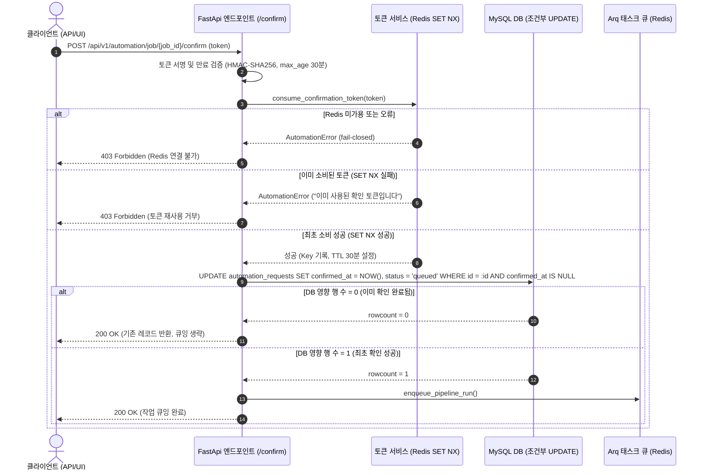

# 자동화 실행 확인 토큰 단일 소비 및 멱등성 보장 사양서

> **문서 버전**: v1.0.0
> **최종 수정일**: 2026-09-03
> **상태**: 운영 정본 (Production Approved)
> **적용 모듈**: `src/app/services/automation_tokens.py`, `src/app/api/v1/automation.py`, `src/app/services/automation_orchestrator.py`

---

## 1. 개요 및 배경

공공조달 입찰 데이터 수집, 지식베이스 갱신, ML 모델 재학습 등 고비용/데이터 변경 작업을 트리거할 때, 시스템은 사용자의 명시적 확인(confirmation)을 요구합니다.
기존 구현에서는 프로세스 메모리 집합(`set`)을 기반으로 소비된 확인 토큰을 추적하였으며, 검사(`is_confirmation_token_consumed`)와 기록(`mark_confirmation_token_consumed`)이 분리되어 있었습니다.

이로 인해 다음과 같은 취약점이 존재했습니다:
1. **다중 워커 프로세스 불일치**: `WEB_CONCURRENCY > 1` 환경에서 워커 프로세스마다 서로 다른 인메모리 집합을 보유하여 다른 워커로 유입된 중복 요청이 통과됨.
2. **검사-기록 간 경쟁 상태(Race Condition)**: 동일 프로세스 내에서도 두 요청이 동시에 검사 단계를 통과한 후 각각 작업을 중복 큐잉할 수 있음.
3. **DB 레벨 원자성 부재**: `confirmed_at` 필드를 조회 후 갱신(read-modify-write)하는 구조로 인해 동시 트랜잭션이 중복 큐잉을 유발할 수 있음.

본 문서는 Redis의 `SET NX EX` 원자적 명령과 DB 조건부 `UPDATE`를 결합하여 확인 토큰의 **정확히 1회 소비(Single Consumption)** 및 **완전한 멱등성(Idempotency)**을 보장하는 규약을 정의합니다.

---

## 2. 단일 소비 아키텍처 및 계약

### 2.1 2단계 방어 계층 (Two-Tier Defense)

토큰 단일 소비와 멱등 큐잉은 2단계 방어 계층으로 이루어집니다:



---

## 3. 세부 구현 규약

### 3.1 Redis 기반 원자적 토큰 소비 (`automation_tokens.py`)

- **Redis Key 포맷**: `bidbox:automation:consumed_token:{sha256(token)}`
  - 원본 토큰의 SHA-256 해시값을 사용하여 키 길이를 고정하고 특수문자 문제를 방지합니다.
- **원자적 명령**: `SET key "1" EX 1800 NX`
  - `NX`: 키가 존재하지 않을 때만 값을 설정합니다. 이미 존재하면 `None`/`False`를 반환하여 즉시 거부합니다.
  - `EX 1800`: 확인 토큰의 최대 유효시간(`CONFIRMATION_MAX_AGE` = 30분)과 일치시켜 토큰 만료 이후 불필요한 Redis 메모리를 자동 회수합니다.
- **Fail-Closed 정책**:
  - Redis 서버에 연결할 수 없거나 명령 수행 중 네트워크 예외가 발생하면 **절대 요청을 통과시키지 않고(fail-closed)** 즉시 `AutomationError`를 발생시켜 HTTP 403으로 거부합니다.
  - 고비용 자동화 작업(수집, 재학습)은 안전성이 가용성보다 우선하므로 미검증 실행을 엄격히 방지합니다.

### 3.2 DB 레벨 조건부 갱신 (`automation_orchestrator.py`)

- **조건부 UPDATE 쿼리**:
  ```sql
  UPDATE automation_requests
  SET confirmed_at = :now,
      status = 'queued',
      result_summary = '실행 확인이 완료되었습니다.'
  WHERE id = :id AND confirmed_at IS NULL;
  ```
- **영향 행 수(rowcount) 판정**:
  - `rowcount == 1`: 해당 트랜잭션이 확인 권한을 획득함. `start_automation_request`를 호출하여 Arq 태스크 큐에 작업을 1회 등록합니다.
  - `rowcount == 0`: 다른 동시 트랜잭션이 이미 `confirmed_at`을 설정했음. 작업을 큐에 추가 등록하지 않고 최신 요청 상태만 반환합니다.

---

## 4. 장애 모드 및 실패 시나리오 대응 매트릭스

| 시나리오 | 동작 방식 | 응답 상태 | 큐잉 여부 | 안전성 보장 근거 |
| --- | --- | --- | --- | --- |
| 정상적인 최초 확인 요청 | Redis SET NX 성공, DB rowcount=1 | HTTP 200 | 1회 큐잉 | 정상적인 1회 실행 보장 |
| 동일 토큰 재사용 시도 | Redis SET NX 실패 (Key 이미 존재) | HTTP 403 | 큐잉 안 됨 | 원자적 NX 판정으로 거부 |
| 동일 토큰 동시 2건 요청 | 1건만 SET NX 성공, 1건은 SET NX 실패 | 1건 200, 1건 403 | 정확히 1회 | Redis 원자적 연산으로 레이스 컨디션 차단 |
| Redis 장애 / 다운 | Redis 클라이언트 None 또는 예외 | HTTP 403 | 큐잉 안 됨 | Fail-closed 안전 정책 적용 |
| 위조되거나 변조된 토큰 | HMAC-SHA256 서명 불일치 | HTTP 403 | 큐잉 안 됨 | 서명 검증 실패로 Redis 도달 전 거부 |
| 30분 초과 만료 토큰 | Timestamp 서명 만료 판정 | HTTP 403 | 큐잉 안 됨 | 토큰 수명 검증 실패로 즉시 거부 |

---

## 5. 검증 방법 및 테스트 현황

1. **단위 및 동시성 테스트 (`tests/test_automation_token_single_consumption.py`)**:
   - `test_token_consumed_atomically_with_set_nx`: SET NX 단일 소비 및 2회차 거부 검증.
   - `test_concurrent_token_consumption_with_threads`: 멀티 스레드(5개 스레드) 동시 소비 시 정확히 1개만 성공 검증.
   - `test_token_consumption_fails_closed_when_redis_unavailable`: Redis 미가용 시 fail-closed 거부 검증.
   - `test_token_consumption_fails_closed_on_redis_exception`: Redis 통신 예외 시 fail-closed 거부 및 커넥션 무효화 검증.
   - `test_conditional_update_in_orchestrator_prevents_duplicate_execution`: DB 조건부 UPDATE rowcount 기반 이중 큐잉 방지 검증.
   - `test_two_api_confirm_calls_with_same_token_queue_exactly_once`: API 연속 호출 시 정확히 1건만 200 및 큐잉 검증.

2. **기존 API 연동 테스트 (`tests/test_automation_api.py`)**:
   - `test_manual_retrain_requires_confirmation`: 재학습 확인 성공 및 토큰 재사용 403 거부 단언.
   - `test_confirm_executes_pending_request`: 전체 점검 확인 성공 및 토큰 재사용 403 거부 단언.
   - `test_confirm_fails_closed_when_redis_unavailable`: Redis 장애 시 403 거부 단언.
