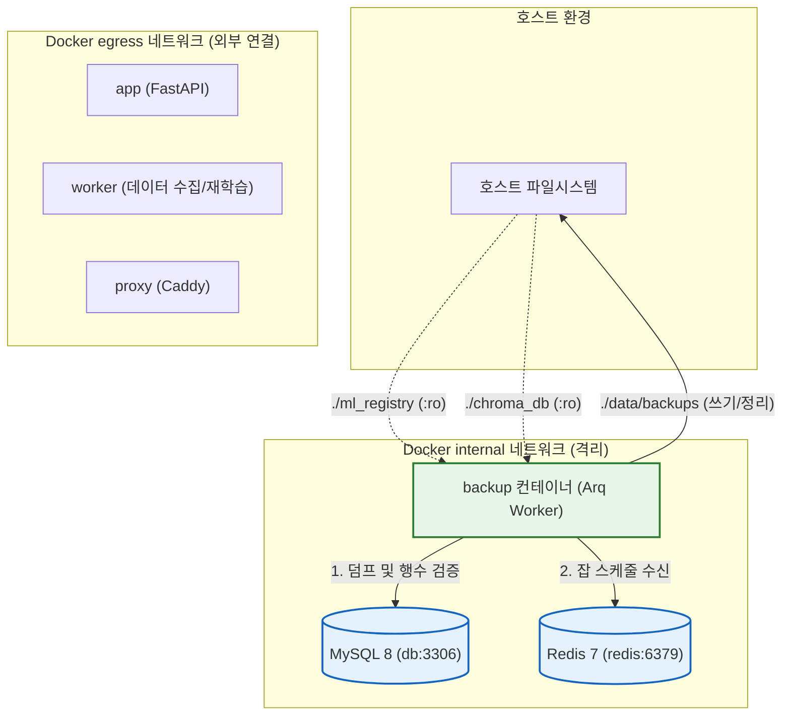

# 백업 서비스 최소권한(Least Privilege) 아키텍처 명세

> **작성일**: 2026-09-14
> **버전**: v1.0.0
> **대상 서비스**: `backup` (`docker-compose.prod.yml`)
> **관련 사양**: Task `task_19e732e36709`

---

## 1. 개요 및 목적

본 문서는 2026-09-14 외부 감사 지적에 따라 운영 환경(`docker-compose.prod.yml`)의 `backup` 컨테이너에 최소권한 원칙(Least Privilege)을 적용한 내역과 잔류 권한의 필요 근거를 정의합니다.

기존 `backup` 서비스는 `worker` 서비스와 동일한 Arq `WorkerSettings`를 실행하면서 불필요한 외부 네트워크 접근(`egress`), 호스트 게이트웨이 매핑(`extra_hosts`), 파일 시스템 쓰기 권한을 부여받았습니다. 본 작업을 통해 실제 코드 실행 경로에서 요구하지 않는 권한을 전면 제거하고 격리 수준을 강화하였습니다.

---

## 2. 백업 서비스 코드 실행 경로 및 자원 분석

백업 컨테이너는 Arq 크론 스케줄러로 기동되어 정해진 주기에 다음 세 가지 함수를 순차적으로 실행합니다.

| 실행 함수 | 호출 모듈 | 주요 작업 및 I/O 특성 |
| --- | --- | --- |
| `backup_schedule_task` | `src/tasks/scheduled_tasks.py` | 매일 03:00 정기 통합 백업 조율, 디스크 여유 공간 점검 |
| `execute_backup` | `scripts/backup_recovery.py` | MySQL DB 덤프(`mysqldump`), ChromaDB 백업 아카이브(`tar.gz`), 서빙 모델 아카이브(`tar.gz`), 백업 매니페스트 생성 |
| `prune_snapshots` | `scripts/backup_snapshots.py` | 보존 정책(`BACKUP_RETENTION_COUNT=7`)에 따른 오래된 스냅샷 디렉터리 삭제 |

---

## 3. 최소권한 적용 변경 내역 (제거된 권한)

코드 분석 결과 백업 작업에 사용되지 않는 네트워크, 호스트 매핑, 디렉터리 쓰기 권한을 제거하였습니다.

| 항목 | 기존 설정 | 변경 후 설정 | 제거 사유 및 근거 |
| --- | --- | --- | --- |
| 외부 네트워크 | `egress` 포함 | `internal` 단독 | 백업 작업은 내부 `db`와 `redis`에만 접근하며 외부 인터넷 통신(공공데이터 수집, 외부 API 등)이 전혀 불필요함 |
| 호스트 매핑 | `host.docker.internal:host-gateway` | 완전 제거 | Ollama 등 호스트 로컬 서비스와 통신하지 않음 |
| ML 레지스트리 볼륨 | `./ml_registry:/app/ml_registry` | `./ml_registry:/app/ml_registry:ro` | 모델 아카이빙 시 파일 읽기만 수행하며 쓰기 작업이 발생하지 않음 |
| ChromaDB 볼륨 | `./chroma_db:/app/chroma_db` | `./chroma_db:/app/chroma_db:ro` | 벡터 DB 아카이빙 시 파일 읽기만 수행하며 쓰기 작업이 발생하지 않음 |

---

## 4. 잔류 권한 및 유지 필요 근거

백업 정상 동작을 위해 유지된 권한 및 환경변수의 기술적 근거는 다음과 같습니다.

| 자원 / 권한 | 설정값 / 방식 | 유지 필요 근거 및 기술적 제약 |
| --- | --- | --- |
| `./data:/app/data` | Read-Write (rw) | 백업 산출물 기본 경로가 `/app/data/backups/snapshots`이며, `execute_backup`의 스냅샷 생성 및 `prune_snapshots`의 오래된 스냅샷 디렉터리 삭제에 쓰기 권한 필수 |
| `SECRET_KEY` | 환경변수 주입 | `src.app.core.config.Settings` 초기화 시 Pydantic 필드 검증을 통과하기 위해 필수 (`SECRET_KEY` 누락 시 프로세스 기동 불가) |
| `REDIS_PASSWORD` / `REDIS_URL` | 환경변수 주입 | Arq 워커가 스케줄 작업을 수신하기 위해 Redis 브로커(`redis:6379`) 연결 인증에 필수 |
| `DATABASE_URL` / `DB_*` | 환경변수 주입 | `mysqldump` 바이너리 실행 및 `query_db_row_counts`를 통한 DB 정합성(G1) 검증 쿼리 실행에 필수 |
| `internal` 네트워크 | Docker 네트워크 | `db` 컨테이너(MySQL 포트 3306) 및 `redis` 컨테이너(포트 6379)와의 상호 통신 필수 |
| `BACKUP_SCHEDULE_ENABLED` | `true` | Arq 워커 설정에서 `backup_schedule_task` 크론 작업을 활성화하기 위한 플래그 |
| `AUTOMATION_*`, `ML_*` | `false` | 백업 전용 컨테이너에서 데이터 수집, 야간 스케줄, 재학습 파이프라인이 오작동으로 실행되는 것을 차단 |

---

## 5. 보안 권고사항: DB 백업 전용 계정 분리

현재 `backup` 서비스는 운영 앱(`app`, `worker`)과 동일한 `DB_USER` 계정을 공유하고 있습니다.

### 5.1 권고 배경
- 현재 `DB_USER`는 DDL 및 DML(INSERT, UPDATE, DELETE) 권한을 모두 보유하고 있습니다.
- 백업 컨테이너 침해 시 DB 데이터 변조 위험을 최소화하기 위해 읽기 전용에 준하는 백업 전용 계정 분리가 권장됩니다.

### 5.2 권고 권한 세트 (사용자 결정 사항)
백업 전용 사용자(예: `backup_user`)를 신설할 경우 필요한 최소 MySQL 권한:
- `SELECT`: 전체 테이블 데이터 덤프
- `RELOAD`: `--single-transaction` 일관성 스냅샷 생성
- `LOCK TABLES`: 덤프 시점 테이블 락 제어
- `SHOW VIEW`: 뷰 정의 덤프
- `TRIGGER`: 트리거 정의 덤프

> **참고**: DB 사용자 생성 및 권한 변경은 데이터베이스 스키마 및 계정 정책 변경에 해당하므로, 코디네이터/작업자 임의 적용이 아닌 사용자 승인 후 별도 마이그레이션 태스크로 진행할 것을 권고합니다.

---

## 6. 서비스 격리 구조도

